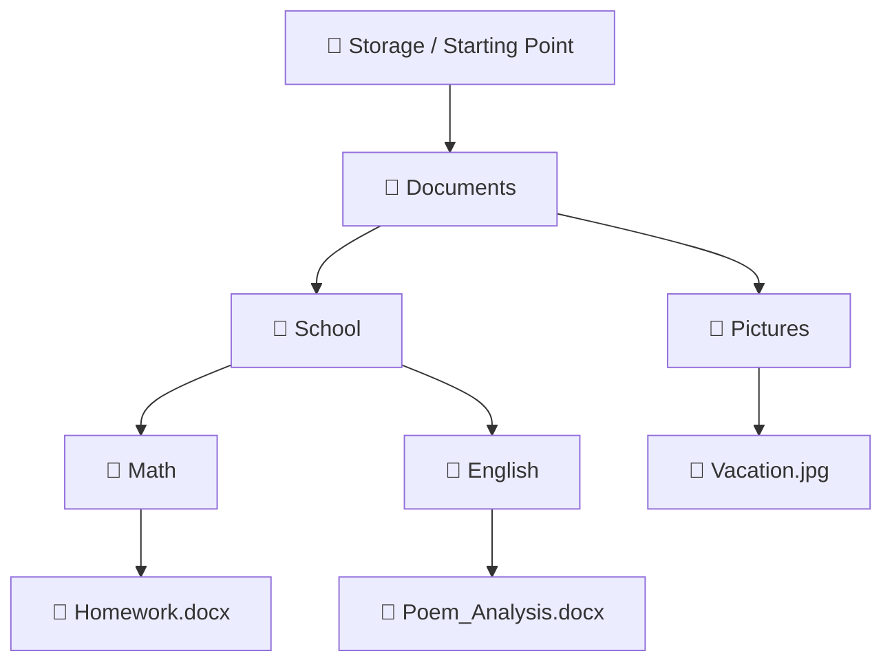

###### Topics

File System Basics

- Understanding folder structure and hierarchy
- Recognizing the difference between files and folders

File Operations

- Creating, naming, and saving files and folders
- Copying, moving, and deleting files and folders

Working with Applications

- Opening, saving, and printing simple documents
- Performing simple calculations with the calculator

   
# 🗂️ File System Basics

When you use a computer, you are almost always working with a **file system**. The file system is, simply put, the organizational system an operating system uses to manage files and folders on a storage medium. It ensures that data is not stored “somewhere,” but rather at a fixed location, where it can be found, renamed, copied, or deleted. This is the foundation for almost everything you do on a computer—whether saving a document, opening a picture, or printing a presentation. Modern operating systems organize files in a hierarchical structure of folders and subfolders ([File Systems](https://learn.microsoft.com/en-us/windows/win32/fileio/file-systems)).

   
## 🌳 Understanding Folder Structure and Hierarchy

The folder structure can best be imagined as a **tree** or as a **shelving system**.

At the very top, there is a starting point. From there, paths lead to various folders. These folders can contain more subfolders. And within these subfolders are files. That’s what is meant by **hierarchy**: There are higher-level and lower-level layers.

A typical example would be:

- A main folder called `School`
- inside, a subfolder `Math`
- inside, a file `Homework.docx`

The file, therefore, is **not just somewhere on the computer**, but in a particular place within a structure.

A folder can contain other folders, creating a sort of nested organizational system. This is helpful because you can sort your data by topic, instead of throwing everything into one big collection folder. This principle is described in basic introductions to computer use: Files are stored in folders, and folders can contain additional subfolders ([Understanding Files, Folders, and Drives](https://edu.gcfglobal.org/en/computerbasics/understanding-files-folders-and-drives/1/)).

An important idea here: **Location is part of the information.** Two files can have the same name, as long as they are in different folders. For example:

- `Documents/English/Notes.txt`
- `Documents/History/Notes.txt`

Both are named `Notes.txt`, but they are in different places.

To visualize the hierarchy, this simple illustration helps:

In such a structure:

- **top** = more general
- **further down** = more specific
- **Files** are usually at the end of a branch
- **Folders** serve as containers and organizational layers

Also very important is the term **path**. A path describes **exactly where** a file or folder is located. A path is a kind of set of directions in the file system. Under Windows, paths often look like this:

`C:\Users\Anna\Documents\School\Math\Homework.docx`

On macOS or Linux, more like:

`/Users/Anna/Documents/School/Math/Homework.docx`

Even if the notation differs, the idea is always the same: A path shows the hierarchy from the starting point to the specific file. The rules for file names and paths depend on the operating system; for instance, under Windows, certain characters like `\ / : * ? " < > |` are not allowed in file names ([Naming Files, Paths, and Namespaces](https://learn.microsoft.com/en-us/windows/win32/fileio/naming-a-file)).

   
### 📍 Why a Good Folder Structure Is So Important

Many beginners underestimate this. But a good structure will save you an incredible amount of time later.

If you save files logically, then:

- you’ll find them more quickly,
- you’ll avoid mix-ups,
- you’ll work more neatly,
- and you reduce the risk of saving something twice or in the wrong place.

Instead of saving everything directly onto the desktop, it usually makes more sense to collect topics or projects in clearly named folders. For example:

- `School`
- `Personal`
- `Application`
- `Photos`
- `Invoices`

Within these folders, you can subdivide further, for example by year, subject, or project.

   
### 🧭 A Helpful Approach for Beginners

If you are not sure where a file is, always ask yourself these three questions:

1. **In which main category am I looking?**  
   For example: Documents, Downloads, Pictures.

2. **In which folder could it thematically be?**  
   For example: School, Work, Personal.

3. **What might the file be called?**  
   For example: `Presentation.docx`, `Notes.pdf`, `Invoice_May.pdf`.

This trains you to see the computer not as a “magic box,” but as an organized system. This understanding is a core area of digital literacy.

   
## 📄 Recognizing the Difference Between Files and Folders

A **file** is a single saved object containing content. This could be a text document, an image, a video, a spreadsheet, a music file, or a PDF. A file contains the actual data. A **directory** or **folder**, by contrast, is a container that holds files and often other folders as well ([Computer file](https://en.wikipedia.org/wiki/Computer_file), [Directory (computing)](https://en.wikipedia.org/wiki/Directory_(computing))).

Simply put:

- **File = Content**
- **Folder = Container for contents**

That’s the most important difference.

If you save a photo, the photo is a file.  
If you create a folder `Vacation 2025` and place all the vacation photos in it, then `Vacation 2025` is the folder and each individual photo is a file.

Here's a clear summary of the difference:

| Feature | File | Folder |
|---|---|---|
| Purpose | Stores content | Organizes contents |
| Can contain text/image/audio | Yes | No, only indirectly via contained files |
| Can contain other items | No | Yes |
| Often has a file extension | Yes | Normally no |
| Example | `Letter.docx`, `Photo.jpg`, `Music.mp3` | `Documents`, `Pictures`, `Invoices` |

A very useful identifying feature for files is the **file extension**. This is the part after the period in the filename, for example:

- `.docx` = Word document
- `.pdf` = PDF file
- `.jpg` = Image
- `.txt` = Text file
- `.xlsx` = Excel file

The file extension helps the operating system and apps recognize **what type of file** it is and which application can open it. So when you see a file named `CV.pdf`, you know immediately: That's not a folder but a PDF document.

Folders usually **don’t** have such an extension. Instead, they appear with a folder icon and a name like `Projects`, `School`, or `Photos`.

A common beginner’s mistake is to confuse file and folder because both show up as icons. That’s why this basic rule is worthwhile:

> A file is usually the actual work object.  
> A folder is the environment where such work objects are collected and organized.

   
### 🔍 How to Recognize Files and Folders in Practice

In file managers like Windows Explorer or Finder on Mac, there are several clues:

- **Icon**: Folders usually have a folder icon; files have a different icon per type.
- **Name**: Files often have an extension, folders usually don't.
- **Opening behavior**:  
  - Opening a folder shows its contents.  
  - Opening a file usually brings it up in an appropriate application.
- **Size**: Files usually have a directly recognizable file size. Folders don’t, or only as a summarized value.

If you open a folder and see further elements inside, that’s a sure sign: This is an organizational structure, not the actual content itself.

   
# 🛠️ File Operations

Once you understand what files and folders are and how they're arranged, the next step is: **You need to be able to work with them.** The most important file operations are:

- create
- name
- save
- copy
- move
- delete

These six things are absolute basics. If you can do them confidently, you can find your way around almost any app and any operating system.

   
## ✏️ Creating, Naming, and Saving Files and Folders

Let’s start with creating.

To **create a folder** means to make a new container for content at a particular place. You usually do this with a right-click and a menu item like **“New Folder”** or **“New” > “Folder.”** On Mac or Linux you’ll find very similar functions. The goal is always the same: You create a new place to organize your contents.

**Creating a file** usually happens through an application. When you open a text editor and start writing, your content initially exists only within the app’s workspace. Only when you save does it become a real file on storage.

This is an important difference:

- **create** = start something
- **save** = store the current state permanently on the device

As long as you haven’t saved, your changes can be lost, e.g., if the program crashes or is closed.

When **naming**, you should aim for clear and understandable names. Good filenames make finding them much easier later. Instead of `Document1.docx`, something like `Application_Mueller_2026.docx` is much more helpful.

Good names are:

- unique,
- short but meaningful,
- logically structured,
- and ideally avoid unnecessary special characters.

A handy naming pattern:

- `Topic_Date`
- `Project_Version`
- `Subject_Content_Year`

For example:

- `Math_Formulary_2026.pdf`
- `Invoice_2026-03.pdf`
- `Internship_Report_V2.docx`

On Windows, certain characters are not allowed in filenames, such as `\ / : * ? " < > |` ([Naming Files, Paths, and Namespaces](https://learn.microsoft.com/en-us/windows/win32/fileio/naming-a-file)). Even though other systems may allow more, in practice it's good to keep filenames simple to avoid compatibility problems.

When **saving**, you typically decide three things at once:

1. **Where** to save the file  
2. **What** to name it  
3. **In which format** to save it

This first point is extremely important. Many beginners simply click "OK" or "Save" quickly when saving, without noticing *where* the file ends up. The file is saved, but later "lost" because it's in an unexpected place.

So the golden rule when saving is:

- check location first,
- then check filename,
- then format,
- only then hit save.

If you later save a file again, you're often just overwriting the existing version. If you want to keep a separate new version instead, use **"Save As"**. This creates a new file with a different name, format, or location.

   
### 🧱 Typical Workflow: Creating a File Properly

A sensible workflow often looks like this:

1. First, choose or create a suitable folder  
   E.g.: `Documents > School > Biology`

2. Then open the appropriate application  
   e.g. a word processor

3. Create your content  
   For example, write a short report

4. Save early  
   Not just at the very end

5. Give the file a clear name  
   For example: `Presentation_Cell.docx`

This helps you develop good digital work habits right from the start.

   
### 🗃️ Comparing Creating Files and Folders

| Process | File | Folder |
|---|---|---|
| How is it created? | Usually via an application | Mainly directly in the file manager |
| Content | Actual data | Contains files and subfolders |
| Naming | With filename, usually plus extension | With folder name |
| Is storage location important? | Yes | Yes |
| Typical mistake | Saved incorrectly or badly named | Created in the wrong location |

The key point: A file is usually the result of your work, a folder is the structure for organizing it.

   
## 📦 Copying, Moving, and Deleting Files and Folders

These three operations sound similar but mean something different. This is where most misunderstandings happen in practice.

### Copying

**Copying** means: You create an **additional** version in another location. The original remains.

So if you copy a file from `Documents` onto a `USB stick`, it exists in **two places** afterward:

- in the original location
- and on the USB stick

Copying is good when you need a backup or want the same file in multiple places. Copying leaves the original; moving transfers it ([Managing Files and Folders](https://edu.gcfglobal.org/en/computerbasics/managing-files-and-folders/1/)).

### Moving

**Moving** means: The file or folder is **transferred to a new place**. Afterward, it is no longer at the old location, only the new one.

It’s like physically taking a folder out of one shelf and putting it into another. It’s not duplicated, just relocated.

### Deleting

**Deleting** means: You remove a file or folder from its current location. On many systems, what's deleted goes into the Recycle Bin or similar and is often still recoverable. In others—such as via certain keyboard shortcuts, network drives, or on external storage—deletion can be more direct and permanent. So you should always delete thoughtfully.

Here's the difference in a nutshell:

| Action | What happens to the original? | Result |
|---|---|---|
| Copy | Stays | There’s also a copy |
| Move | Changes location | Only in new spot afterward |
| Delete | Is removed | File/folder no longer available in normal way |

A common beginner's mistake is to **confuse copying and moving**. Here’s an easy rule:

- **Copy = duplicate**
- **Move = relocate**
- **Delete = remove**

   
### 🖱️ How to Perform These Actions Practically

In most graphical interfaces, there are several ways:

- via **right-click menu**
- with **keyboard shortcuts**
- by **dragging with the mouse**
- via buttons in ribbons or toolbars

The best-known shortcuts are:

- **Ctrl + C** = copy
- **Ctrl + X** = cut / prepare to move
- **Ctrl + V** = paste
- **Del** = delete

On Mac, use the `Cmd` key in place of `Ctrl`.

The key is not just which button you press, but that you **understand what logically happens**:

- With **Copy + Paste**, a second version is created.
- With **Cut + Paste**, the same object is transferred to another location.
- With **Delete**, it is removed from the current structure.

With the mouse, the exact behavior sometimes depends **where you drag to**—such as within the same drive or onto another device. That’s why, for beginners, using right-click or familiar key combos is clearer, since the intent is more obvious.

   
### ♻️ What You Should Really Know About Deleting

Deleting isn’t always “gone forever.” Often there’s an intermediate step:

1. File is deleted
2. It goes to the Recycle Bin
3. There, it can be restored if needed
4. Only after the bin is emptied is it no longer normally accessible

This is useful because accidentally deleted files can often be saved.

But be careful: If you delete a folder, usually all files and subfolders inside it are deleted too. So before deleting a folder, check what's inside.

A good principle:

> Never delete out of habit.  
> Always read *what* is selected first.

   
### 🧠 Typical Thinking Mistakes about File Operations

Some misunderstandings crop up again and again:

**“I moved the file, but it’s gone.”**  
It’s often not gone—just somewhere else.

**“I copied it, why is everything doubled now?”**  
Because copying intentionally makes a second copy.

**“I deleted the folder, but I only wanted to remove one file!”**  
Then the container was removed instead of just the contents.

**“I can’t find my document anymore.”**  
It was often saved incorrectly or moved.

These mistakes are common. The key is understanding the underlying mechanism. Then file operations seem logical, not random.

   
# 💻 Working with Applications

File system basics and file operations are the foundation. The next step is to **work usefully with applications**.

An application is a program that lets you perform specific tasks, for example:

- writing text
- reading PDFs
- viewing images
- calculating
- printing

It’s important: Applications and files are not the same.

The application is the tool.  
The file is usually the work product.

A word processor, for example, opens a text file. The calculator does calculations, but often doesn’t create a classic file.

   
## 📝 Opening, Saving, and Printing Simple Documents

When working with documents, the process almost always has three steps:

1. **open**
2. **edit or view**
3. **save or print**

### Opening Documents

Opening a document means a suitable application loads and displays the file. When you double-click a file, the operating system normally tries to start the right application automatically.

Some typical examples:

- `.docx` → word processor
- `.pdf` → PDF program or browser
- `.txt` → simple text editor
- `.jpg` → image viewer

If the right program doesn’t start automatically, you can often select **“Open with…”** and set the correct application yourself.

Important: Opening does **not** automatically change the file. Only if you edit content and then save is the file actually changed.

### Saving Documents

Once you edit a document, you should save early. This is one of the most important habits. Saving means the current state is stored permanently on the device.

There are two cases:

**Normal Save**  
You update the same file.

**Save As**  
You create a new file, e.g., with a different name, format, or location.

This is especially useful when:

- you don’t want to overwrite a template,
- you want to keep multiple versions,
- you want to save a document additionally as a PDF.

A classic example:

You write a letter in a text app.  
You first save it as `Letter_Draft.docx`.  
Later you want to send the finished version and also save it as `Letter_Final.pdf`.

Now you have both versions.

### Printing Documents

When printing, the document’s content is sent to a printer. In almost all applications, this is done via:

- **File > Print**
- or the shortcut **Ctrl + P**  
  or on Mac **Cmd + P**

Before actual printing, there is usually a print dialog. There you can check important settings:

- Which printer is being used
- How many pages will be printed
- Whether only a selection or the entire document is printed
- Whether it will print in color or black and white
- Whether portrait or landscape orientation will be used
- How many copies will be printed

Beginners often click “Print” too quickly, without checking these settings. Then maybe the wrong number of pages, the wrong printer, or the wrong format is used.

A good, calm process is:

1. Open document
2. Check content
3. Save if there were still changes
4. Open print dialog
5. Check print settings
6. Only then print

This saves paper, time, and nerves.

   
### 📂 Common Scenarios When Opening and Saving

There are some everyday situations you should recognize.

**Situation 1: You open an existing file and change it.**  
Then you normally save the same file again.

**Situation 2: You want to keep the original.**  
Then use **“Save As”** and give it a new name.

**Situation 3: You can't find your document.**  
The issue is often not with the app, but the save location. You need to search in the file system, not in the program.

**Situation 4: The file won’t open.**  
Maybe the file type doesn’t match the program, or the file is corrupt.

This distinction is important because beginners often think a file “lives” only in the application. In reality, it’s located somewhere in the file system and is just used by the application.

   
### 🖨️ Printing Terms You Should Know

| Term | Meaning |
|---|---|
| Printer | The device that produces the printout |
| Print dialog | Window with print settings |
| Page range | Which pages are to be printed |
| Copies | How many times the document is printed |
| Portrait | Page is oriented upright |
| Landscape | Page is rotated sideways |
| Preview | Shows beforehand what the printout will look like |

If a print preview is available, you should use it when possible. It will show you right away if something is cut off or if the layout is wrong.

   
## 🧮 Performing Simple Calculations with the Calculator

The calculator is one of the simplest but also most useful apps on the computer. It's great for quick everyday calculations without needing a spreadsheet.

With the calculator, you can mainly perform these basic operations:

- **Addition** `+`
- **Subtraction** `-`
- **Multiplication** `×` or `*`
- **Division** `÷` or `/`

Some calculator apps also have functions like:

- Percent calculation
- Square root
- Memory functions
- Scientific functions
- Date or conversion tools

For basic use, the four operations are more than enough.

### Here's How a Simple Calculation Works

Suppose you want to calculate `25 + 17`.

Type:

1. `25`
2. `+`
3. `17`
4. `=`

The result is `42`.

For `80 - 19`:

1. `80`
2. `-`
3. `19`
4. `=`

For multiplication and division:

- `6 × 7 = 42`
- `84 ÷ 2 = 42`

It’s important to recognize the calculator’s symbol language. Sometimes multiplication is `×`, sometimes `*`. Division might be `÷` or `/`.

### Understanding Percent Calculations

Many calculators have a `%` button. You can solve typical everyday questions, for example:

- How much is 10% of 200?
- What’s the size of a discount?
- How much VAT do you add?

Example:  
10% of 200 is 20.

Depending on your calculator, you might enter it differently. Some apps use the `%` key directly; others need you to rewrite the calculation:

`200 × 10 ÷ 100 = 20`

This is the safest way, as you’ll always know what’s happening mathematically, even without a special key.

### Important Buttons

Nearly every calculator has these basic keys:

| Key | Function |
|---|---|
| `C` or `AC` | Clears the entry |
| `=` | Shows the result |
| `+` | Add |
| `-` | Subtract |
| `×` or `*` | Multiply |
| `÷` or `/` | Divide |
| `.` or `,` | Enter decimal numbers |
| `%` | Percentage |

If you make a typo, you can usually reset with `C` or `AC`. Some calculators also have a backspace key to remove only the last digit.

### Common Mistakes When Calculating on the Calculator

A typical mistake is using the wrong operation—for example, hitting multiply instead of divide. Another frequent error is entering the wrong number, like `250` instead of `205`. That’s why it’s worth checking your entry before pressing `=`.

When using decimals, pay attention—depending on app or system settings, it might use a period or comma. Both indicate the separation between whole numbers and decimals.

### Why the Calculator Is Still an Important Basic App

The calculator seems simple, but it teaches something valuable: You learn to work purposefully with an app.

You enter data,  
the app processes it,  
and you interpret the result.

That’s a basic pattern for many programs:

- Input
- Processing
- Output

If you understand this with the calculator, you’ll also grasp how other software fundamentally works.

   
### 🔄 Connection Between Applications and the File System

Lastly, one point is especially important: Not every application works with files equally strongly, but almost all are **connected to the file system**.

- A word processor opens and saves files.
- An image program loads and exports files.
- A PDF program opens, displays, and prints files.
- The calculator usually works without classic files.

So file system basics and working with apps always go hand in hand. You learn not just "which button to press," but also **where information is located, how it’s organized, and how programs work with it**. That’s what real digital literacy is.