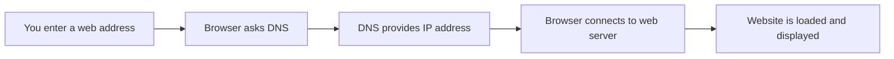
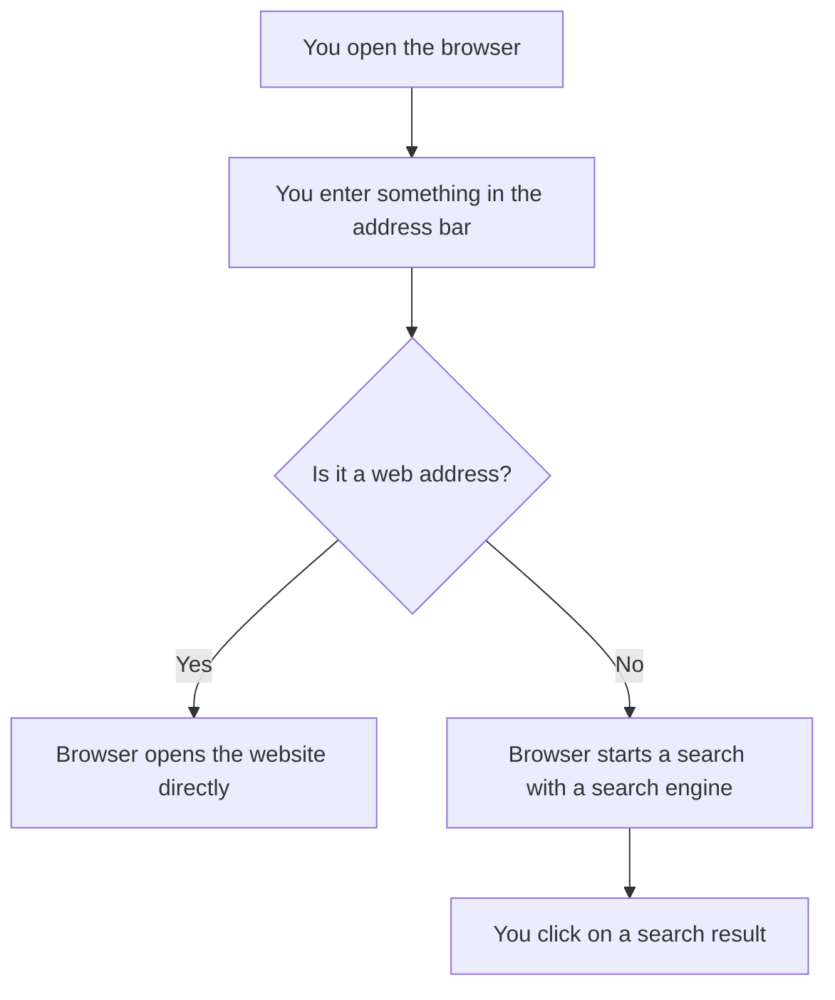
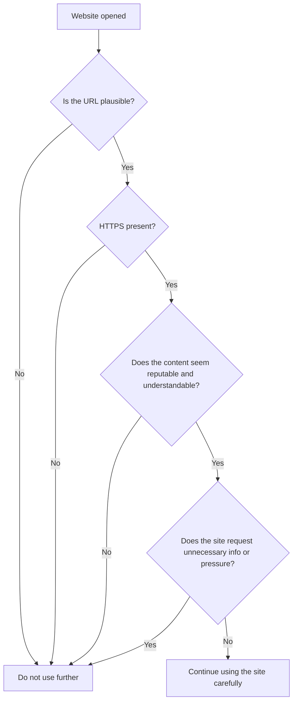
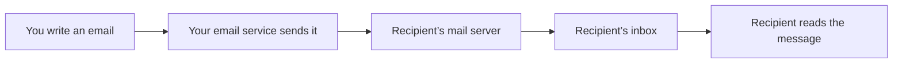

###### Topics

Internet Basics

- Open and use a web browser at a basic level
- Use search engines for simple research

Staying Safe on the Internet

- Recognize secure and insecure websites
- Observe basic data protection and safety measures while browsing

Email Basics

- Understand the structure and purpose of emails
- Write, send, and receive emails
- Add and save email attachments

   
# 🌐 Internet Basics

If you want to use the internet effectively, you first need a clear understanding of the basic terms. Many people, for example, confuse **web browsers** and **search engines**. That’s normal but important to distinguish.

A **web browser** is the program you use to open websites, for example Google Chrome, Mozilla Firefox, Microsoft Edge, or Safari. In a way, a browser is your “window to the web” ([What is a browser?](https://www.mozilla.org/en-US/firefox/browsers/what-is-a-browser/)).

A **search engine**, on the other hand, is a service on the internet that helps you search for information, for example Google, Bing, or DuckDuckGo. The search engine runs **inside the browser**. That means: You first open the browser, then you use a search engine in it.

To make this easy to remember:

| Term         | What it is                             | Examples                 |
|--------------|---------------------------------------|--------------------------|
| Web browser  | A program to open websites            | Chrome, Firefox, Edge, Safari |
| Search engine| A search service for web content      | Google, Bing, DuckDuckGo |

   
## 🧭 Opening and Using a Web Browser at a Basic Level

Opening a browser is the first practical step into the internet. On a computer, you usually click an icon in the taskbar, on the desktop, or in the start menu. On a smartphone or tablet, you tap the browser app.

When the browser is open, you’ll normally see an **address bar** at the top. There you can either:

- Type in a **web address**, for example, `www.wikipedia.org`
- Or type in a **search term** directly, for example, `Weather Berlin`

This is convenient because modern browsers allow both in the same bar.

### 🧩 The Most Important Parts of a Browser

To feel confident, it helps to know the key elements.

| Element        | Meaning                          | What you use it for                    |
|----------------|----------------------------------|----------------------------------------|
| Address bar    | Shows the current web address    | Go directly to a website or enter a search term |
| Back button    | Goes back to the previous page   | If you ended up somewhere by mistake   |
| Forward button | Goes forward again               | If you’ve just gone back               |
| Reload         | Reloads the page                 | If something isn't displaying properly |
| Tabs           | Multiple pages open at once      | For comparing or working in parallel   |
| Bookmarks      | Saved websites                   | For pages you visit often              |
| Menu           | Additional settings              | History, downloads, print, settings    |

### 🌍 What Happens When You Open a Website?

When you enter a web address, more happens in the background than you might think. The browser first needs to find out what server the site is on. It often uses the **Domain Name System (DNS)** for this. DNS translates a name like `example.com` into a technical IP address so the browser can find the right server ([What is DNS? | How DNS works](https://www.cloudflare.com/learning/dns/what-is-dns/)).

After that, the browser requests the contents and displays them to you as a readable website.

### 🗂️ Working with Tabs

**Tabs** are tabs in the browser. They help you have multiple sites open at the same time. This is extremely useful in everyday life. For example, you can read an article in one tab and look up an explanation for a word in another.

Important: The more tabs you have open, the easier it is to lose track. For effective learning, it’s often better to keep only a few tabs open at once, name them deliberately, or close unnecessary tabs.

### ⭐ Bookmarks, History, and Downloads

A **bookmark** saves a website so you can find it quickly later. This is useful for learning sites, government portals, online banking, or email services.

**History** keeps a record of the sites you’ve visited. It’s helpful if you accidentally closed a site and want to find it again.

The **downloads** section shows you files you’ve downloaded from the internet, like PDFs, images, or forms. You should be especially careful here, as not every downloaded file is safe.

   
## 🔎 Using Search Engines for Simple Research

A search engine doesn’t “live search” the whole internet at that moment; rather, it works with an index built beforehand. Simply put, it’s a huge collection of recorded websites that can be searched.

For you, this means: You enter search terms and get a list of results that best match your query.

### 📝 Formulating Good Search Queries

Many people search too vaguely. They get a lot of results, but often not the right ones. Good research starts with a good search query.

Instead of just searching for `Laptop`, it’s better to use:

- `Laptop for university under 800 euro`
- `What is a web browser simple explanation`
- `PDF Basic Law German`

The more precise your search terms, the better your results.

Even simple search techniques help a lot. Many search engines support, for example:

- **Quotation marks** for an exact phrase: `"digital competence"`
- **Minus sign** to exclude terms: `jaguar -car`
- **site:** for results only on a specific site: `data protection site:bsi.bund.de`

Such refinements are described by Google in their search help ([Refine web searches](https://support.google.com/websearch/answer/2466433?hl=en)).

### 📄 Reading Search Results Properly

A search result usually consists of three parts:

| Part        | Meaning                                |
|-------------|----------------------------------------|
| Title       | Name or headline of the page           |
| URL         | The web address                        |
| Description | Short preview text about the page      |

You should never judge search results only by their position. A site at the very top isn’t automatically the best or most trustworthy. Often, the top results include ads or pages optimized for search engines but not necessarily the most expert.

So pay attention to these questions:

- **Who provides the site?**
- **Is it an official source, an educational institution, a company, or a personal blog?**
- **Is the information up to date?**
- **Does the page really match your question?**

When you’re looking for reliable information, these source types are often particularly good:

- official government sites
- universities and research institutions
- reputable expert portals
- well-known software or manufacturer documentation for tech topics

### 🧠 The Difference Between “Finding Something” and “Understanding Something”

For real learning, it’s not enough to just quickly google an answer. You should try to use search results in a meaningful order:

1. **First, get an overview**
2. **Then clarify terms**
3. **Then compare several sources**
4. **Then explain in your own words**

That’s how you learn more sustainably. If you just copy a term, you’ll quickly forget it. If you can explain it in your own words, you’ve understood it.

### 🔍 Browser and Search Engine Clearly Distinguished Again

Because it is so important, here’s a very simple comparison:

   
# 🛡️ Staying Safe on the Internet

The internet is useful, but not every site or message is trustworthy. That’s why it’s important not only to learn “how to click,” but also **how to recognize risks**.

Internet safety doesn’t mean distrusting everything. It means being attentive, knowing typical warning signs, and developing good habits.

   
## 🔒 Recognizing Secure and Insecure Websites

An important feature of secure websites is the use of **HTTPS**. HTTPS makes sure the data between your browser and the website is transmitted encrypted ([What is HTTPS?](https://www.cloudflare.com/learning/ssl/what-is-https/)).

You usually recognize HTTPS because the address starts with `https://` and the browser shows a padlock symbol.

But here is a very important point: **HTTPS alone does not automatically mean the website is reputable or honest.** It mainly means the connection is encrypted. Fraudulent sites can also use HTTPS ([How to recognize and avoid phishing scams](https://consumer.ftc.gov/articles/how-recognize-and-avoid-phishing-scams)).

### ✅ How to Recognize More Trustworthy Websites

A website appears more trustworthy when several things match:

| Feature                | Why it's useful                               |
|------------------------|-----------------------------------------------|
| `https://` and padlock | Connection is encrypted                       |
| Clean, understandable URL| Less risk for typo or fake sites            |
| No aggressive popup storm| Appears more reputable, less manipulative   |
| Clear provider information| You know who is behind the site            |
| Understandable, pressure-free content| Typical of reputable sites      |
| Official domain or known organization| Increases trustworthiness       |

### ⚠️ Warning Signs of Insecure Websites

Be suspicious if you see one or more of these signs:

- The address looks odd, for example with typos like `paypaI.com` instead of `paypal.com`
- The site puts you under time pressure: “Only 3 minutes left!”
- Extreme promises: “Free iPhone,” “100% guaranteed win”
- Requests unusually many personal details
- Your browser shows a security warning
- The design looks copied, unfinished, or full of language errors
- Downloads start automatically

Fake sites often try to imitate famous brands. Phishing attacks commonly use fake login pages or messages that create pressure, for example: “Your account will be blocked unless you click immediately” ([How to recognize and avoid phishing scams](https://consumer.ftc.gov/articles/how-recognize-and-avoid-phishing-scams)).

### 🧭 Consciously Checking a Website

Instead of clicking right away, mentally go through this checklist:

### 🏢 Why the URL is So Important

The **URL** is the internet address of a site. That’s where many fakes hide. So, don’t just look at the logo or how the site looks—always check the address.

Example:

- real: `https://www.sparkasse.de`
- suspicious: `https://sparkasse-login-sicher.net`

The second address may look credible but might not belong to the real organization.

### 📢 Take Browser Warnings Seriously

If your browser says a connection isn’t secure or there’s a certificate problem, that’s no minor detail. Don’t just click away such warnings. Beginners often make the mistake of treating browser warnings as “annoying tech messages.” In reality, they are there to protect you.

   
## 🕵️ Observing Basic Data Protection and Safety Measures while Browsing

In everyday situations, data protection mainly means: **don’t share more data than necessary**. Many websites, apps, and services collect info about your behavior, devices, or interests. Being mindful of this is an important part of digital literacy.

### 👤 Share Personal Data Sparingly

Before you enter data anywhere, ask yourself:

- Why does this site want this info?
- Is this detail really necessary?
- Would you give this detail to a stranger?

Be especially careful with:

- Full address
- Phone number
- Date of birth
- ID details
- Bank details
- Passwords

A reputable service only asks for what is needed for its purpose.

### 🍪 Understanding Cookies and Consents

Many sites show you a cookie notice on your first visit. **Cookies** are small pieces of data a website saves in your browser. Some are technically necessary, others are for analytics or advertising.

Important for you: Not every consent is mandatory. You should read consent windows and avoid automatically accepting everything.

### 🕶️ Private Mode is Not ‘Invisible’

Many people think incognito or private mode makes them anonymous. This is not true. Private mode mainly prevents your browser from storing local history, search history, or form data. Websites, employers, schools, or internet providers can still see what you do ([Private Browsing - Use Firefox without saving history](https://support.mozilla.org/en-US/kb/private-browsing-use-firefox-without-history)).

That’s a common misconception you should understand early.

### 🔐 Safe Browsing Habits

A big part of safety comes not from expert knowledge, but from simple habits:

- Open important sites directly via the known address or a bookmark
- Don’t carelessly click on links in messages or pop-ups
- Download programs only from official manufacturer sites
- Always log out after using someone else’s device
- Don’t save passwords on public devices
- Check you’re really on the right site before logging in

### 🔄 Why Updates Matter

Browsers, operating systems, and programs should be regularly updated. Security updates close known vulnerabilities and help prevent attacks ([Understanding Patches and Software Updates](https://www.cisa.gov/news-events/news/understanding-patches-and-software-updates)).

It sounds technical, but it’s practical: An outdated browser is often easier to attack than an up-to-date one.

### 📶 Caution with Public Networks

Public Wi-Fi, for example in cafés, hotels, or train stations, is convenient, but you should be especially careful there. Do sensitive things like online banking or important account changes preferably only on secure networks, or at least make sure your connection is encrypted and you’re really on the right site.

### 🧠 The Most Important Safety Rule of All

If something on the internet seems **too urgent, too good, or too weird**, taking a pause is often the best security measure. Scams work because people act quickly under pressure. If you stop and check, you protect yourself much better.

   
# 📧 Email Basics

Email is one of the most important digital basic skills. It’s used for private communication, school, study, work, contact with authorities, applications, and online services.

An email is basically a digital message. It works much like a letter, only faster. Instead of a mailbox and postal service, you use an email program or a web service.

   
## ✉️ Understanding the Structure and Purpose of Emails

To use emails safely and effectively, you should first know their structure.

### 🧱 The Most Important Parts of an Email

| Part         | Meaning                                   |
|--------------|-------------------------------------------|
| From         | The sender of the email                   |
| To           | The main recipient                        |
| Cc           | Other recipients who see the message      |
| Bcc          | Other recipients invisible to others      |
| Subject      | Brief headline of the message             |
| Message body | The actual content                        |
| Attachment   | Additional file, for example PDF or image |
| Signature    | Closing with name and possibly contact info|

The **subject** is especially important. It helps the recipient immediately understand what it’s about. A good subject is clear and concrete, for example:

- `Appointment Confirmation for Monday`
- `Documents for Registration`
- `Question about Invoice 2024-18`

A subject like `Hello` or `Important!!!` is often too vague.

### 🎯 What Emails Are for

Emails are especially good for:

- more formal messages
- information that should be retained in writing
- messages with attachments
- communication where the other person doesn’t need to respond immediately

For very short, spontaneous arrangements, many people use messengers nowadays. But for anything that needs to be documented, traceable, or official, an email is often the better choice.

### 📬 How Emails Basically Work

In the background, an email doesn’t go directly from person to person like live chat. It’s relayed via mail servers.

That’s why sometimes an email doesn’t arrive instantly but with a short delay.

   
## 🖊️ Writing, Sending, and Receiving Emails

Writing an email usually always follows the same simple process. Once you understand this, you can use almost any email service.

### 📝 Writing an Email

Typically, you click **“Compose”**, **“New Message”**, or a plus symbol. Then fill out the fields:

1. **Enter recipient**  
   In the "To" field, enter the email address of the person you want to send to.

2. **Enter subject**  
   Write briefly and specifically what it’s about.

3. **Write text**  
   Write your message. For more formal emails, greetings and a closing are appropriate.

4. **Add attachment** if needed  
   For example, a document or photo.

5. **Send**  
   The message gets sent only when you click "Send".

Google describes this basic process in their help for composing emails ([Write an email](https://support.google.com/mail/answer/6580?hl=en)).

### 💬 What a Well-Formatted Email Looks Like

A clear email usually has this form:

- **Salutation**: “Hello Ms. Müller,” or “Good day,”
- **Introduction**: What is this about?
- **Main part**: The actual information or question
- **Closing**: “Best regards” or “Yours sincerely”
- **Name**

It sounds simple, but it makes a big difference. An email with no clear structure may come across as rude or confusing.

### 📥 Receiving and Reading Emails

Incoming mail usually lands in the **inbox**. There you can click and read them. Many email services also sort messages into areas like:

- Inbox
- Sent
- Drafts
- Trash
- Spam or Junk

The **spam folder** is important. Unwanted or suspicious emails land there. But sometimes real emails end up there too. So if you’re waiting for something important, it’s worth checking this folder.

### ↩️ Replying, Reply All, Forwarding

When you receive an email, there are usually three common actions:

| Function         | Meaning                                      |
|------------------|----------------------------------------------|
| Reply            | Reply only to the sender                     |
| Reply all        | Reply to all original recipients             |
| Forward          | Send the email to another person             |

Especially **“Reply all”** should be used consciously. Otherwise, too many people receive your response unnecessarily.

### 🚨 Caution with Suspicious Emails

Not every email is harmless. Be especially careful if:

- you don’t know the sender
- the message creates pressure
- you’re supposed to click a link
- there’s an unexpected attachment
- bank info, passwords, or codes are requested

Such signs are typical of phishing emails ([How to recognize and avoid phishing scams](https://consumer.ftc.gov/articles/how-recognize-and-avoid-phishing-scams)).

A particularly good protection is: **Don’t click sensitive links directly from the email**—open important services yourself in the browser.

   
## 📎 Adding and Saving Email Attachments

Attachments are files you send along with an email. For example:

- PDFs
- Images
- Word files
- Spreadsheets
- Presentations

### 📤 Adding an Attachment

Almost all email services have a **paperclip icon** for this. Click it, choose a file from your device, and attach it to your email. This process is described in Gmail Help ([Send attachments with your Gmail message](https://support.google.com/mail/answer/6584?hl=en)).

Important: Before sending, check that you’ve really attached the correct file. In everyday life, it’s surprisingly common to send the wrong version or even a totally different file.

### 📁 Understanding Typical File Types

| File extension | Type          | Typical content              |
|----------------|--------------|------------------------------|
| `.pdf`         | Document     | Forms, documents, articles   |
| `.jpg` / `.png`| Image        | Photos, screenshots          |
| `.docx`        | Text document| Letters, assignments, reports|
| `.xlsx`        | Spreadsheet  | Lists, numbers, analysis     |
| `.pptx`        | Presentation | Slides and talks             |
| `.zip`         | Archive file | Multiple files packed together|

If you recognize file extensions, you can assess attachments better.

### 📥 Saving an Attachment

If you receive an email with an attachment, you can usually click or download the file. It often ends up in your device’s downloads folder or wherever you select.

For efficient work, don’t just leave attachments lying around but save them consciously, for example in folders like:

- `Documents/School`
- `Documents/Application`
- `Documents/Invoices`

This saves you a lot of search time later.

### ⚠️ Don’t Open Attachments Blindly

Attachments are convenient but also a classic way for malware and fraud attempts. Don’t open attachments if:

- you don’t know the sender
- you weren’t expecting the message
- the file has a strange name
- the email seems suspicious
- you’re being pressured to act quickly

Be especially cautious with executable files or weird archive files. If in doubt, ask first or don’t open the file.

### 🧾 Good Habits with Attachments

These simple rules help in daily life:

- Name files clearly before sending  
  Instead of `Document_new_final2.pdf`, use something like `Application_Max_Mustermann.pdf`

- Check if the attachment fits the message  
  The message text should clearly mention what is attached

- Only open attachments from trusted sources  
  When in doubt, check first, then click

- Save important attachments in an organized way  
  Otherwise, you won’t find them later

- Pay attention to file size and format  
  Not every recipient can open every format easily

### 🧠 Why Email Skills Are So Important

Emails may seem old-fashioned at first glance, but digitally they’re a fundamental standard. If you can handle browsers, search engines, website checking, and email cleanly, you already master a large part of practical digital basic skills.

These skills aren’t just “computer knowledge.” They help you

- find information reliably,
- recognize risks better,
- communicate clearly,
- and use digital tools deliberately instead of randomly.