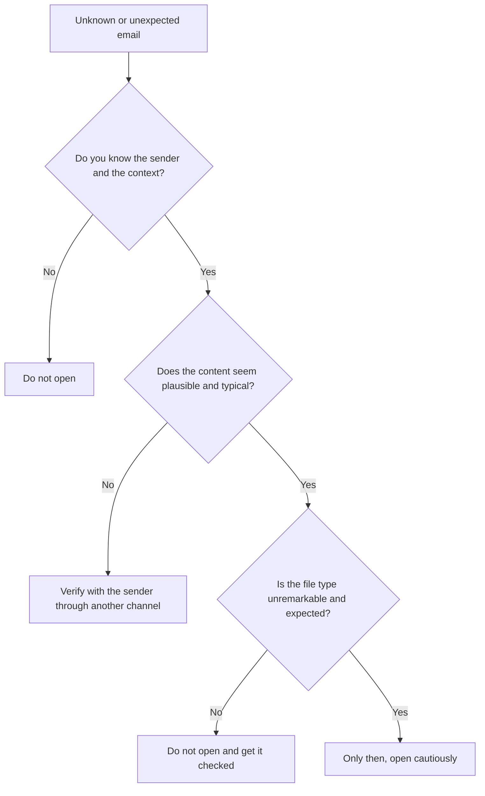
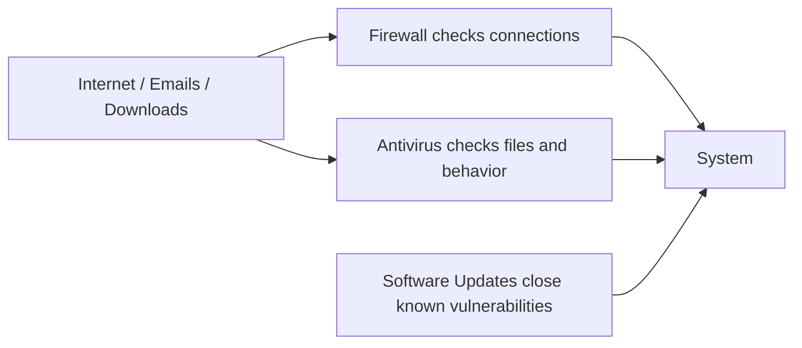

###### Topics

Fundamentals of IT Security

- Understanding the characteristics of secure passwords
- Protecting personal data and handling information sensitively
- Taking precautions when opening unknown attachments

System Protection and Maintenance

- Basic understanding of the difference between antivirus, firewall, and software updates
- Installing and uninstalling programs securely
- Performing software updates and recognizing their importance

   
# 🔐 Fundamentals of IT Security

IT security does not start with big companies or complicated networks. It starts with your normal everyday behavior: How do you handle passwords? What information do you disclose? Do you open attachments immediately or check them first? Many security problems arise not because technology fails completely, but because people trust too quickly, become too comfortable, or underestimate risks.

You can think of IT security as several protective layers. A good password protects access. Caution when handling information protects your privacy. Distrust toward unknown attachments protects your device from malware. These layers complement each other.

   
## 🔑 Understanding the Characteristics of Secure Passwords

A password is like the key to your digital space. If this key is easy to duplicate, someone can get in very quickly. That’s why a good password is not just “anything I can remember,” but a conscious security decision.

The Federal Office for Information Security (BSI) recommends choosing passwords that are **long**, **unique**, and as hard to guess as possible, and not using the same password for multiple services ([Passwords](https://www.bsi.bund.de/EN/Themen/Consumer-Protection/Information-and-Recommendations/Online-Communication/Passwoerter/passwords_node.html)).

A secure password mainly has these characteristics:

- It is **long**. Length is one of the most important factors.
- It is **unique**. Every important account should have its own password.
- It is **not easy to guess**. No names, birth dates, or simple patterns.
- It is **not reused**.

When people talk about “strong passwords,” they often think only of special characters. The truth is a bit different: A long password or, even better, a long **passphrase** is often stronger and easier to remember than a short, artificially complicated password.

An example:

- Weak: `Sommer2024`
- Stronger: `KaffeeZugMondWiese19`
- Even better as a principle: a long, random passphrase that you use **only for this one service**

The reason is simple: Attackers often try known words, names, years, and typical patterns first. Short or predictable passwords fail quickly. Long and unique combinations are much harder to crack.

   
### 🧠 What Really Makes a Password Secure

Here is a simple overview:

| Characteristic | Insecure | More Secure |
|---|---|---|
| Length | short, e.g., 6–8 characters | much longer, ideally a passphrase |
| Predictability | name, birthday, `123456`, `qwertz` | random or unusual word combinations |
| Reuse | same password for many accounts | every account has its own password |
| Relation to you | pet name, favorite team | no easily guessable personal references |

The problem with reused passwords is particularly severe. Imagine an online shop where you once registered gets hacked. If you used the same password there as for your email account, attackers can also try it elsewhere. This is often called **credential stuffing**: stolen credentials are automatically tested on many services.

Your email account is especially critical. Anyone with access to your emails can often reset passwords for other services. That’s why your password should be particularly strong there.

   
### 🚫 What You Should Avoid with Passwords

Many bad passwords at first glance “don’t seem that insecure.” Typical mistakes include:

- First or last name
- Birth date
- `Passwort123`
- `Hallo123!`
- Name + year
- The same combination everywhere

Even minor tweaks usually don’t help much. If you change `Sommer2024` to `Sommer2024!`, that’s only minimally better and still predictable. Attackers know such patterns well.

   
### 🛠️ How to Use Good Passwords Practically in Everyday Life

A common problem is: Good passwords are secure but hard to remember. This is where **password managers** help. They store your passwords securely and generate unique, strong passwords for every service. Then you don't have to remember twenty complicated passwords yourself—just one strong master password.

Additionally, **two-factor authentication** is very useful. This means you need something besides the password—for example, a code from an app. This makes an account much better protected, even if the password becomes known.

So remember the principle:

- **Long instead of just complicated**
- **Unique instead of reused**
- **Password manager instead of paper or unprotected notes apps**
- **2-factor authentication where it's available**

   
## 🕵️ Protecting Personal Data and Handling Information Sensitively

Personal data is information that reveals something about you or can be linked to you. This includes obvious things like your name, address, and phone number, but also information that many underestimate: your location, your school or workplace, your daily routine, photos of your home, travel plans, or answers to typical security questions.

The key point is: Not every single piece of information is dangerous on its own. But many small pieces together often form a very accurate picture of you. That’s exactly what scammers, data collectors, and attackers use.

For example, if you post publicly:

- where you work,
- when you are on vacation,
- your pet’s name,
- your children’s names,
- when your birthday is,

then this quickly becomes material for fraud attempts, identity theft, or guessing security questions.

This is often called **data minimization**: Only disclose as much information as is truly necessary. Not every website, every app, and every person needs to know everything about you.

   
### 📂 Which Data Is Especially Sensitive

Some data is particularly worth protecting because its misuse can have direct consequences.

| Data Type | Example | Why Sensitive |
|---|---|---|
| Credentials | email, password, PIN | allow direct access to accounts |
| Financial data | IBAN, credit card details | can lead to monetary loss |
| Identity data | ID photo, birth date, address | can be used for identity theft |
| Health data | diagnoses, medical reports | very private and susceptible to misuse |
| Location & daily routine info | live location, travel plans | reveal habits and absences |
| Work or school data | internal info, documents | can put you or others at risk |

It's important to note: Not only “secret” data is sensitive. Even very normal information can become problematic in the wrong combination.

   
### 🤝 What “Handling Information Sensitively” Really Means

Handling information sensitively doesn’t mean being paranoid. It means deciding consciously:

- **Who should really receive this information?**
- **Why is it being requested?**
- **Is it necessary to provide everything?**
- **What could happen if this information is shared?**

A typical mistake is sharing information out of habit. Many people click through forms quickly, grant apps unnecessary access, or respond to messages without checking who is actually asking.

A few typical everyday situations:

**On social networks:**  
Not everything that’s true needs to be public. You should never post photos of ID cards, boarding passes, student IDs, sick notes, or package labels. Even background details in photos can reveal a lot—like addresses, screen contents, or name tags.

**On calls or messages:**  
Just because someone sounds friendly or urgent doesn’t mean the person is trustworthy. Scammers often use pressure: “Act immediately,” “Account blocked,” “We just need your details.” It’s exactly in these moments you should slow down instead of speeding up.

**With online accounts:**  
Fill out only required fields if additional information isn't needed. If a service really doesn’t need your birth date, ask yourself why you should enter it.

   
### 🛡️ How to Better Protect Personal Data

A few simple habits can help greatly in everyday life:

- Share personal information consciously and sparingly.
- Check privacy settings in apps and social networks.
- Never share sensitive data carelessly via email or chat.
- Be cautious with photos, screenshots, and documents.
- Use strong passwords and two-factor authentication.
- Check if a website seems trustworthy before entering data.

Especially important is the combination of technology and behavior. A strong password does little good if you simultaneously make too much personal information public. And cautious behavior alone is not enough if your account is protected by a weak password.

   
## 📎 Taking Precautions When Opening Unknown Attachments

Unknown attachments are a classic attack vector. Many malicious programs get onto devices not through spectacular hacks, but simply via email. The BSI warns that phishing messages often use pressure, deception, and fake senders to get people to click on attachments or links ([Phishing](https://www.bsi.bund.de/EN/Themen/Consumer-Protection/Information-and-Recommendations/Online-Communication/Phishing/phishing_node.html)). Malware can spread exactly through such attachments ([Malware](https://www.bsi.bund.de/EN/Themen/Consumer-Protection/Information-and-Recommendations/Cyber-Security/Malware/malware_node.html)).

An attachment is not safe just because it seems to come from someone you know. Sender addresses can be faked, accounts can be hacked, and sometimes malware automatically sends messages from real inboxes.

Therefore: Don’t open an attachment just because you’re curious—only open it when you have reason to trust it.

   
### 🔍 How to Recognize Suspicious Attachments

Pay special attention to these warning signs:

- The message is unexpected.
- The content creates pressure: “urgent,” “immediately,” “final notice.”
- The language seems unusual, awkward, or generic.
- The sender is subtly altered, e.g., with swapped letters.
- You’re asked to open an invoice, reminder, or application that doesn’t fit you.
- The file type seems unusual or hidden.

Be especially cautious with file extensions. Some formats are harmless, others potentially dangerous. Files that can execute programs or macros—such as certain Office documents with active content or executable files—are especially problematic.

If you can’t see the file extension, that’s already a problem. Attackers often disguise files to look like PDFs when they’re actually something else.

   
### 🧭 How to Proceed Before Opening Anything

The most important rule: **Check before you open.**

With every unexpected email, ask yourself:

1. **Am I expecting this message at all?**
2. **Does the sender really fit?**
3. **Does the content make sense in this context?**
4. **Does the attachment make sense here?**
5. **Can I check with the sender through another communication channel?**

For example, if you suddenly get a strange file from a coworker, don’t just reply to the same suspicious email—ask them via another secure channel if they really sent it.

Here’s a simple decision logic:

This logic seems simple, but it’s extremely effective. Many attacks fail because people paused for a moment rather than clicking reflexively.

   
### 🚫 What You Should Never Do with Attachments

You should always avoid the following:

- Opening attachments just because the subject sounds urgent
- Enabling macros unless you know exactly why
- Running file formats you don’t know
- Simply clicking away security warnings
- “Just taking a quick look” even when the message feels suspicious

The “just a quick look” is especially dangerous. Many malicious programs need only a single thoughtless click.

   
# 🛡️ System Protection and Maintenance

IT security is not just about cautious user behavior, but also about proper system maintenance. Even if you are attentive, devices remain vulnerable if protective software is missing or software is outdated.

You need to be able to distinguish between three things:

- **Antivirus** detects or blocks malware.
- **Firewall** controls network connections.
- **Updates** close vulnerabilities and improve software.

Many confuse these terms or think one alone is enough. In reality, they perform different functions.

   
## 🧱 Basic Understanding of the Difference Between Antivirus, Firewall, and Updates

You can imagine these three building blocks as different security roles.

**Antivirus** or antivirus software mainly looks at whether files, programs, or processes seem suspicious. It tries to detect, block, or remove malware. The BSI describes malware as programs that can carry out unwanted and harmful functions ([Malware](https://www.bsi.bund.de/EN/Themen/Consumer-Protection/Information-and-Recommendations/Cyber-Security/Malware/malware_node.html)).

The **firewall** monitors network traffic. Simplified, it decides which connections are allowed and which are not. It is like a bouncer for data traffic between your device and other systems.

**Software updates** or **patches** ensure that errors and vulnerabilities in programs are fixed. This is especially important because attackers specifically exploit known vulnerabilities. The BSI emphasizes that updates and patches close security gaps and improve stability ([Updates and Patches](https://www.bsi.bund.de/EN/Themen/Consumer-Protection/Information-and-Recommendations/Cyber-Security/Updates-and-Patches/updates-and-patches_node.html)).

   
### 🧩 The Differences at a Glance

| Protection Measure | Main Purpose | Typical Question |
|---|---|---|
| Antivirus | Detect and block malware | “Is this file or behavior suspicious?” |
| Firewall | Control network connections | “Is this connection allowed in or out?” |
| Updates | Fix vulnerabilities | “Is the software up to date and secure?” |

Important: None of these measures replaces the others.

An example:

- The firewall can block unwanted connections.
- The antivirus can detect a malicious file.
- The update ideally prevents a known vulnerability from being exploited in the first place.

If you only have antivirus but haven’t installed updates for months, your system is still vulnerable. If you only install updates but open unknown attachments carelessly, a problem can still occur. Good security is always a combination of multiple protection layers.

   
### 🏰 Explained Visually

This diagram shows clearly: The tools work at different stages.

   
## 📦 Installing and Uninstalling Programs Securely

Installing programs seems trivial, but is a sensitive moment from a security standpoint. With every installation, you are giving software access to your system. If the program is insecure, manipulated, or unnecessary, you could create a problem for yourself.

So the most important rule for installations: **Install only from trusted sources.**

Trusted sources are usually:

- Official manufacturer websites
- Official app stores or package sources
- In companies: approved internal software sources

Less trustworthy sources are:

- Dubious download portals
- Email or chat attachments
- Links from unverified forums or comments
- “Cracked” or illegally altered programs

The reason is simple: With unofficial sources, you often don't know if the file is unaltered and clean.

   
### 🔍 What to Check Before Installing

Before you click “Install,” check:

- **Do you really need the program?**
- **Is it from a trusted source?**
- **Does the manufacturer name fit?**
- **Is the program asking for an unusual number of permissions?**
- **Is additional software bundled with it?**

Many unsavory programs don’t stand out as classic viruses, but through add-ons: toolbars, adware, browser changes, or unnecessary background services. You shouldn’t just click through installation dialogs blindly.

Pay special attention to checkboxes like:

- "Install recommended extra software"
- "Change start page"
- "Change default search engine"
- "Install trial version of additional security software"

These things aren't always direct malware but are often unwanted and annoying.

   
### 🛠️ How to Install Programs Securely

A clean installation process looks roughly like this:

1. Download the program from an official source.
2. Check that name, manufacturer, and version are plausible.
3. Read the options carefully during installation.
4. Remove unnecessary extra checkboxes.
5. Grant only permissions that seem reasonable.
6. Restart the system if needed.
7. Afterward, check if anything changed unexpectedly, like browser homepage, search engine, or new background programs.

If you’re unsure whether a program is reputable, don’t just install it “on a whim.” Be especially cautious with system tools, drivers, cleaners, and so-called optimizers. Such programs often promise a lot and deliver little—sometimes even risks.

   
### 🗑️ Uninstalling Programs Securely

Uninstalling doesn’t just mean deleting the program folder. If you only remove files manually, entries, services, or remnants often remain on the system.

To uninstall securely:

- Use the normal uninstall function of the operating system or the official uninstaller.
- Fully close the program beforehand.
- Restart the device if needed.
- Check afterward if auto-start entries, browser extensions, or add-ons remain.

Why is this important? Because unwanted software sometimes hides in multiple places. A clean uninstall helps keep order and security in the system.

Also: The fewer unnecessary programs installed on a device, the smaller the attack surface. Every additional program can bring bugs, vulnerabilities, or unwanted functions.

   
## 🔄 Performing Software Updates and Recognizing Their Importance

Many consider updates a nuisance, but they are one of the most important security measures. An update is not just "cosmetic" or "a new color in the menu." It often fixes bugs, closes security holes, improves stability, or makes programs compatible with other components.

The BSI points out that updates and patches close vulnerabilities and should therefore be installed promptly ([Updates and Patches](https://www.bsi.bund.de/EN/Themen/Consumer-Protection/Information-and-Recommendations/Cyber-Security/Updates-and-Patches/updates-and-patches_node.html)).

The key idea:

**Not only new programs need maintenance, but also those that seem to work perfectly well.**  
Many people say: "Why update? It's working." Exactly therein lies the problem. Software may run normally on the surface and still have a known vulnerability under the hood.

   
### 🧨 Why Outdated Software Is Dangerous

Attackers specifically look for known vulnerabilities. If a flaw is publicly known and the manufacturer has already provided an update, unpatched systems become especially attractive. The problem is known, but left unfixed.

It's a bit like a manufacturer announcing: "The lock on this door is faulty, here’s the repair," and some still leave the door unchanged.

Outdated software is especially problematic for:

- Operating systems
- Web browsers
- Email programs
- Office applications
- PDF readers
- Apps with internet access
- Routers and other network devices

Many people, for example, forget the router. Even there, software runs, even there vulnerabilities exist, and updates are important.

   
### ⚙️ Types of Updates

Not every update is the same, but in general they can be understood as follows:

| Update Type | Meaning |
|---|---|
| Security update | fixes security vulnerabilities |
| Bug fix | eliminates bugs or crashes |
| Feature update | brings new functions |
| Driver update | improves hardware control |
| Firmware update | updates devices like routers, printers, or SSDs |

For IT security, **security updates** are especially crucial. But other updates can also be indirectly relevant because stability problems or bugs can also pose risks.

   
### 🕒 How to Handle Updates in Everyday Life

You’ll be best off with a clear system:

- Enable automatic updates where useful.
- Check for updates manually on a regular basis if not automatic.
- Install security updates promptly.
- Do not postpone updates for weeks without good reason.
- Restart devices after updates if prompted.
- Keep not only the operating system up to date but also browsers, apps, and key tools.

Browsers and operating systems in particular are central targets for attacks. If these are up to date, you’ve already done a lot.

   
### 🧯 What to Consider Before Major Updates

While updates are important, you should apply common sense when running them. Before major updates, it makes sense to:

- back up important data
- ensure sufficient battery/stable power supply
- avoid starting updates in the middle of critical work
- use official update routes and avoid dubious “driver updaters” or “system boosters”

Such third-party programs often promise easier updates but are frequently unnecessary or even problematic. The safest way is almost always the official update mechanism from the operating system or the manufacturer.

If a device or program no longer receives security updates, that’s also crucial information. Then it’s not simply “old but fine,” but potentially an ongoing risk.

   
### 🧠 The Real Learning Goal Behind Updates

What matters most is not just knowing **how** to update, but **why** updates are crucial. Updates are not a side issue of IT, but a central part of system maintenance. They keep a system not only modern but, above all, resilient.

When you internalize this thought, you automatically make better everyday decisions:

- You don’t ignore security warnings.
- You don't leave devices neglected for months.
- You realize that security is a process, not a one-time state.

That’s the core of good IT basics: not blindly following rules, but understanding the logic behind them.