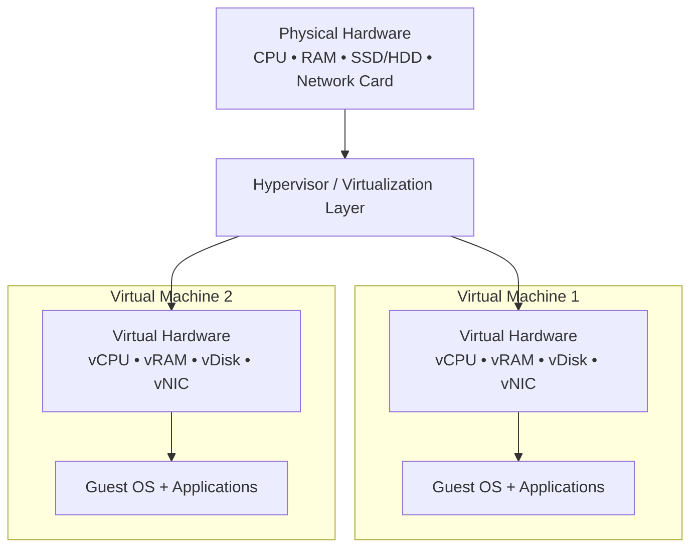
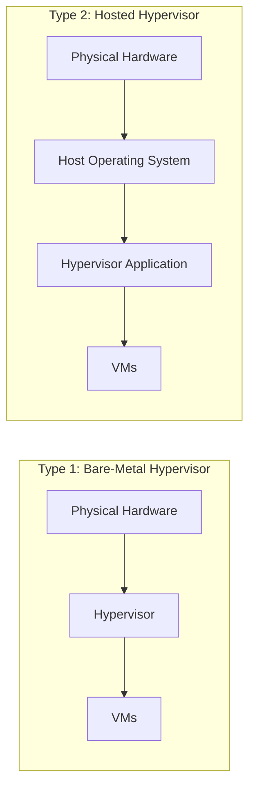
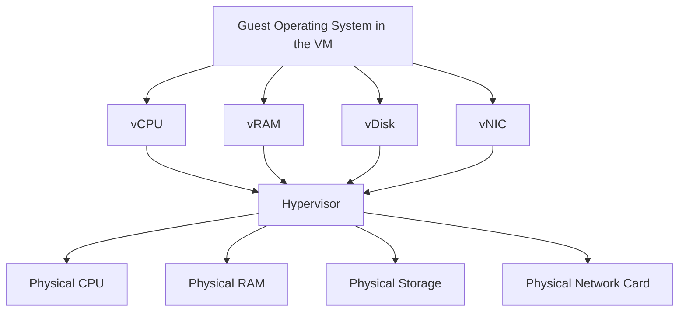

###### Topics

Fundamentals of Virtualization

- Definition and importance of virtualization
- Difference between physical and virtual hardware
- Typical areas of application for virtualization
- Advantages of virtualization for users and companies

Hypervisors and virtual hardware

- Overview of the difference between Hypervisor Type 1 and Type 2
- Examples of virtualization software
- Basic understanding of virtual CPU, memory, disk, and network card

   
# 🧠 Fundamentals of Virtualization

Virtualization is one of the most important foundational concepts in modern IT. Once you truly understand it, many other topics will become much easier: servers, cloud, containers, test environments, networks, and even IT security. The core idea is surprisingly simple: **Through software, a single physical computer is turned into multiple “virtual computers,” which behave like their own independent systems.** This software-based abstraction of computing resources is the essence of virtualization ([What is virtualization?](https://www.redhat.com/en/topics/virtualization/what-is-virtualization)).

You can think of it like a large apartment building. The **physical hardware** is the building itself. The **virtual machines (VMs)** are the apartments within it. Each apartment appears outwardly as its own complete area with its own usage, even though all share the same building. In IT terms, this means multiple virtual systems share the same CPU, the same memory, the same disk, and the same network connection of a real computer—all without users needing to realize these are “shared” ([Virtualization](https://www.ibm.com/think/topics/virtualization)).

   
## 📘 Definition and Importance of Virtualization

Virtualization means that **hardware resources are no longer used directly and exclusively by one single operating system**, but rather an additional software layer divides, manages, and allocates these resources to multiple virtual systems. This layer is generally called a **hypervisor**. Through it, more than one operating system can run concurrently on a single physical machine—for example, Windows, Linux, and another Linux next to each other ([What is virtualization?](https://www.redhat.com/en/topics/virtualization/what-is-virtualization)).

The importance of virtualization is enormous because it solves several problems at once:

A physical server is often **not fully utilized**. In the past, a separate server was bought for every application. This often led to servers only using 10 to 20 percent of their actual capacity. With virtualization, multiple systems can be consolidated onto a single server, making much more efficient use of hardware ([Virtualization](https://www.ibm.com/think/topics/virtualization)).

Virtualization also creates **flexibility**. A virtual machine is fundamentally a software-defined environment. This means it can be copied, moved, backed up, restarted, or rebuilt for testing far more easily than a whole physical computer ([What is virtualization?](https://www.redhat.com/en/topics/virtualization/what-is-virtualization)).

Even more important: virtualization is a **foundation of cloud computing**. When you “book” a server in the cloud, you usually do not get bare hardware directly, but instead a virtual machine running on physical hardware in a data center ([Virtualization](https://www.ibm.com/think/topics/virtualization)).

To remember this technically in one sentence:

**Virtualization separates the operating system’s view of hardware from the real, physical hardware.**  
The operating system “believes” it has its own computer, but in reality, it works within a virtual environment.

   
## 🖥️ Difference Between Physical and Virtual Hardware

The difference between physical and virtual hardware is one of the most important points overall.

**Physical hardware** is everything that exists as an actual component:  
a real processor, real RAM modules, real SSDs or HDDs, real network cards, real motherboards.

**Virtual hardware**, on the other hand, is a **software-provided replica or abstraction** of these components. For example, the virtual machine sees a CPU, memory, a disk, and a network card. However, these devices are not necessarily “real physical components” of their own, but are provided by the hypervisor and mapped to the actual underlying hardware ([What is virtualization?](https://www.redhat.com/en/topics/virtualization/what-is-virtualization)).

This is important:  
The virtual machine works **as if it had a real computer in front of it**. For the guest operating system, in day-to-day use, there is very little difference. Windows or Linux in the VM installs drivers, uses memory, writes to disks, and sends network packets—all through the virtualization layer.

A simple comparison helps:

| Aspect | Physical Hardware | Virtual Hardware |
|---|---|---|
| Existence | Actually present as a component | Provided through software |
| Access | OS accesses directly or nearly directly | Access is via hypervisor |
| Quantity | Usually exists only once | Can be divided into many virtual instances |
| Flexibility | Modifications are often manual | Configuration is mostly via click or file |
| Portability | Device must be moved physically | VM can often be moved as a file or image |
| OS’s Typical View | “This is my real computer” | “This is my computer”—even though virtual |

A classic example:  
A physical server may have **32 CPU cores and 128 GB RAM**. For example, **eight virtual machines** can run on it. One VM gets 4 vCPUs and 16 GB RAM, another 8 vCPUs and 32 GB RAM, a third only 2 vCPUs and 4 GB RAM. None of these VMs “knows” exactly what the whole physical server looks like. Each sees only the virtual hardware allocated to it.

The following diagram shows the layers:

   
### 🧱 Layer Model: From Physical to Virtual Hardware

The key takeaway here is:  
**Virtual hardware is not imaginary hardware; it is a controlled, software-managed view of real resources.**

   
## 🏢 Typical Areas of Application for Virtualization

Virtualization is not only used in large data centers. You come across it in many situations.

A key area of application is **server consolidation**. Here, several previously separate servers are merged as virtual machines onto fewer physical hosts. This saves hardware, electricity, space, and administrative effort ([Virtualization](https://www.ibm.com/think/topics/virtualization)).

Another big field is **test and development environments**. Developers, administrators, and learners can quickly create a new VM, try out software there, reproduce errors, or test risky changes without endangering their main computer or production systems. That’s why virtualizers like VirtualBox or VMware Workstation are so popular in education and development ([Oracle VM VirtualBox User Manual, Chapter 1. First steps](https://www.virtualbox.org/manual/ch01.html)).

**Old or specialized software** is also often virtualized. Some applications only run on certain OS versions or require an old environment. Rather than maintaining an old physical PC, you can simply run the needed environment as a VM.

In enterprises, **desktop virtualization** is also important. Here, a user does not work directly on a local PC, but on a virtual desktop in the data center. This makes management, standardization, and security easier.

The **cloud** is also extremely important. Many cloud servers are virtual machines. If a company wants to deploy ten new servers within minutes, this is often accomplished by starting up new VMs on existing hardware.

A brief overview of typical usages:

| Area | Why Virtualization is Useful Here |
|---|---|
| Server operation | Multiple services on less hardware |
| Development & testing | Quickly create new environments |
| Training & learning | Safe experimentation |
| Legacy systems | Continue using old software |
| Cloud infrastructure | Rapid provisioning of servers |
| Desktop virtualization | Central management of workplaces |
| IT security | Isolated analysis or sandbox environments |

Virtualization is especially valuable for learning. You can run multiple operating systems on a single computer, simulate networks, try server services, and make mistakes without risking your main system. This is one of the biggest practical benefits for beginners and advanced users alike.

   
## 🌟 Advantages of Virtualization for Users and Companies

Virtualization offers advantages on two levels: for individual users and for organizations.

For **users**, the greatest advantage is usually **flexibility**. You can run several operating systems in parallel on the same computer. For example, if your main system is Windows, you can also run Linux in a VM. This is ideal for learning, development, or testing.

Another advantage is **isolation**. If something goes wrong in a virtual machine—such as a software error, a failed configuration, or even malware in a test environment—the main system often remains better protected because the VM runs in its own environment. Virtualization explicitly supports this separation of workloads ([What is virtualization?](https://www.redhat.com/en/topics/virtualization/what-is-virtualization)).

Moreover, VMs are often **easier to back up, copy, and clone** than physical systems, since they are software-based ([Virtualization](https://www.ibm.com/think/topics/virtualization)). This is extremely practical for learners, developers, and admins.

For **companies**, there are additional business and operational advantages:

| Perspective | Advantage | Explanation |
|---|---|---|
| User | Multiple systems at once | One computer can host several OSes |
| User | Safe test environments | Changes usually stay isolated in the VM |
| User | Easy learning | Servers, networks, and clients can be simulated |
| Company | Better hardware utilization | Less idle time on servers |
| Company | Lower costs | Fewer devices, electricity, space, cooling |
| Company | Faster deployment | New VMs can be provisioned in minutes |
| Company | Easier management | Standardized images and central control |
| Company | Greater agility | Systems can be adapted more quickly to new requirements |

A particularly important point is **scalability**. If additional resources are needed, you can often assign more RAM, more CPUs, or more storage to a VM without physically upgrading hardware—provided the host has enough spare capacity.

**Availability** is equally important. In many professional virtualization platforms, VMs can be more easily moved, restarted, or integrated into backup concepts than physical single systems. This makes operations more robust and easier to administer.

However: virtualization is **not a magic, costless trick**. All VMs share actual resources. If the host is overloaded, all VMs suffer. Virtualization increases efficiency—but it does not create additional physical performance from nothing. This is a critical misconception to avoid early on.

   
# ⚙️ Hypervisors and Virtual Hardware

If virtualization is the basic idea, the **hypervisor** is the technical key layer that ties everything together. It creates and manages virtual machines and ensures that they can use CPU, memory, disks, and networks—without uncontrolled, direct access to underlying hardware ([Hyper-V technology overview](https://learn.microsoft.com/en-us/windows-server/virtualization/hyper-v/hyper-v-technology-overview)).

   
## 🧭 What exactly a Hypervisor does

A hypervisor has several tasks at once:

It **provides virtual hardware**.  
It **allocates physical resources** to various VMs.  
It **isolates VMs from one another** so they cannot directly interfere with each other.  
It **manages start, stop, configuration, and often also snapshots or migrations**.

In other words:  
The hypervisor is like a very intelligent resource manager sitting between real hardware and virtual machines.

Without a hypervisor, there would be emulation or other niche solutions, but not the classic, modern virtualization as used today in data centers, desktop computers, or the cloud.

   
## ⚖️ Difference Between Hypervisor Type 1 and Type 2 at a Glance

The difference between **Type 1** and **Type 2** is particularly about architecture.

A **Type 1 hypervisor** runs **directly on the physical hardware**. It sits at the bottom of the stack and manages virtual machines above it. That’s why it’s also known as a **bare-metal hypervisor**. For example, Microsoft describes Hyper-V as a virtualization technology using a hypervisor-based architecture ([Hyper-V technology overview](https://learn.microsoft.com/en-us/windows-server/virtualization/hyper-v/hyper-v-technology-overview)).

A **Type 2 hypervisor** does **not run directly on hardware**, but rather on top of a pre-installed host operating system like Windows, Linux, or macOS. For example, Oracle describes VirtualBox as a virtualization application that runs on existing host operating systems ([Oracle VM VirtualBox User Manual, Chapter 1. First steps](https://www.virtualbox.org/manual/ch01.html)).

This might seem like a minor difference at first, but in practice it is very important.

For Type 1, the stack is simply:

**Hardware → Hypervisor → Virtual Machines**

For Type 2, the stack is longer:

**Hardware → Host OS → Hypervisor Application → Virtual Machines**

You can visualize it like this:

   
### 🧱 Architecture Comparison: Type 1 and Type 2

The practical difference is this:

Type 1 hypervisors are usually more focused on **performance, stability, and professional operation**. That’s why they are typical for data centers, server farms, and cloud environments.

Type 2 hypervisors are particularly useful for **desktop use, learning, development, and tests**, as they are easy to install and use like a regular application.

Here's a side-by-side comparison:

| Feature | Type 1 | Type 2 |
|---|---|---|
| Runs on | Directly on hardware | On a host OS |
| Typical use | Server, data center, production | Desktop, test, learning, development |
| Performance | Usually more efficient, closer to hardware | Some extra overhead from host OS |
| Management | More professional, centralized | Easier to start, often local |
| Example idea | "Server virtualization" | "VM as an app on my PC" |

Importantly:  
**Type 2 is not “bad”**—it’s just intended differently. Type 2 is actually more practical for learning, labs, demo environments, and software testing. For highly-available enterprise platforms, Type 1 is usually the better choice.

   
### 🧠 Why the Difference Matters

If you’re just starting out, remember this rule of thumb:

- **Want to just launch VMs on your own computer?**  
  You’ll usually encounter a Type 2 hypervisor.

- **Want to understand how companies centrally virtualize many servers?**  
  Then you’ll be thinking in terms of Type 1 hypervisors.

This difference also affects things like performance, security model, resource management, and professionalism in operations. The closer the virtualization layer sits to the real hardware, the more direct and controlled its operation.

   
## 🛠️ Examples of Virtualization Software

There are many virtualization solutions. Some are focused on data centers, others more at desktop use.

Especially common in professional server environments:

- **VMware vSphere / ESXi**, a well-known platform for server virtualization ([VMware vSphere Documentation](https://docs.vmware.com/en/VMware-vSphere/index.html))
- **Microsoft Hyper-V**, prominent in Windows and Windows Server environments ([Hyper-V technology overview](https://learn.microsoft.com/en-us/windows-server/virtualization/hyper-v/hyper-v-technology-overview))
- **KVM**, a virtualization technology built into the Linux kernel ([Kernel-based Virtual Machine (KVM)](https://www.kernel.org/doc/html/latest/virt/kvm/index.html))

Common for desktop and test systems:

- **Oracle VM VirtualBox**, very popular for learning and private labs ([Oracle VM VirtualBox User Manual, Chapter 1. First steps](https://www.virtualbox.org/manual/ch01.html))
- **VMware Workstation** or **VMware Fusion**
- **Parallels Desktop** on macOS

A reasonable breakdown:

| Software | Typical Category | Common Usage |
|---|---|---|
| VMware ESXi | Mainly Type 1 | Data center, server operation |
| Microsoft Hyper-V | Type 1-oriented | Windows Server, enterprise |
| KVM | Kernel-based virtualization | Linux server, cloud, hosting |
| Oracle VirtualBox | Type 2 | Learning, development, tests |
| VMware Workstation | Type 2 | Desktop virtualization |
| Parallels Desktop | Type 2 | macOS desktop with guest OS |

If you’re just starting, VirtualBox or a similar desktop solution is often the easiest way in. If you want to understand the enterprise world, look into Hyper-V, ESXi, or KVM.

   
## 🧩 Basic Understanding of Virtual CPU, Memory, Disk, and Network Card

Virtual machines only appear to be “real computers” because they are assigned **virtual hardware components**. The most important of these are:

- virtual CPU
- virtual memory
- virtual disk
- virtual network card

The guest OS sees these components as if they were real devices. The hypervisor makes sure that these virtual devices are connected to real, physical resources in the background.

   
### 🔢 Virtual CPU (vCPU)

The **vCPU** is the virtual form of a processor assigned to a VM. If you assign a VM **2 vCPUs**, the guest OS typically sees two logical processors it can use.

It’s important to understand:  
A vCPU is **not always the same as a dedicated physical CPU core**. Rather, the hypervisor schedules and distributes computing time on the real processors. The vCPU is first and foremost a **virtual compute unit** mapped to real CPU time by the hypervisor.

This is a very common beginner mistake:  
Many think “4 vCPUs” always means “4 real cores dedicated to this VM.” That’s not necessarily the case. It can be configured that way, but that is not the default meaning.

Practically, this means:

- More vCPUs can allow a VM more parallel compute work.
- Too many vCPUs can also be unnecessary if the application doesn’t use them.
- When many VMs simultaneously require CPU, they compete for the host’s real processor power.

You can picture a vCPU as a **workbench in a workshop**. There may be many workbenches, but all must be served by the real machines and resources in the actual workshop.

   
### 🧠 Virtual Memory (vRAM)

The **virtual memory** is the RAM you assign to a VM. If you give a VM 8 GB of RAM, the guest OS sees those 8 GB as its built-in main memory.

Again:  
The VM works with a **virtual view** of memory, but behind that resides the host’s real physical RAM.

Memory is often one of the critical bottlenecks in virtualization. CPU can be distributed in time, but RAM must actually exist somewhere physically. If you start too many VMs using too much RAM, even a powerful host will quickly hit its limits.

For understanding, think of it this way:

- **vRAM is the memory available to the VM**
- **physical RAM is what’s actually built into the host**
- the hypervisor mediates between the two

If you assign too little RAM to a VM, the guest OS will run slowly. If you assign too much, you may deprive other VMs or the host itself of essential memory.

   
### 💾 Virtual Disk (vDisk)

The **virtual disk** is for the VM what a real SSD or HDD is for a physical computer. It holds the operating system, applications, configuration files, and user data.

For the VM, it acts as a normal drive. It can be partitioned, formatted, and used to store data. In reality, this is usually just a **file on the host system** or a storage area provided by the hypervisor.

Typical virtual disk formats include:

| Format | Common Environment |
|---|---|
| VDI | VirtualBox |
| VMDK | VMware |
| VHD / VHDX | Microsoft |
| qcow2 | KVM/QEMU |

Importantly:

The virtual disk is **not a “pseudo-drive”**, but from the guest OS’s perspective a perfectly normal block storage device. The difference is that this device is mapped in software.

A VM’s performance often depends highly on the underlying real storage. A VM with a fast virtual disk backed by a slow physical HDD will still be slow. The virtual layer can abstract a lot, but physical reality remains crucial.

   
### 🌐 Virtual Network Card (vNIC)

The **virtual network card**—often called a **vNIC**—is the VM’s network connection. From the guest OS’s perspective, it is just a normal network card. The VM can use IP addresses, send packets, offer server services, or access other systems.

In the background, the hypervisor connects this virtual network card to a **virtual switch** or directly via specific network modes. VirtualBox, for example, documents various network modes like NAT, bridged, and host-only ([Oracle VM VirtualBox User Manual, Chapter 6. Virtual networking](https://www.virtualbox.org/manual/ch06.html)).

The basic idea behind these modes:

| Mode | Simply Explained |
|---|---|
| NAT | The VM accesses the network via the host, much like behind a router |
| Bridged | The VM is directly on the same network as other devices |
| Host-only | The VM can only communicate with the host or an isolated virtual network |
| Internal Network | Only VMs can talk to each other, no external access |

For basic understanding:

- The VM has a virtual network card.
- This card is attached to the hypervisor’s virtual network infrastructure.
- Through this, the VM gains access to the internet, a company network, or an isolated test network.

This is particularly powerful for learning environments. With just a few clicks, you can build a small virtual network of multiple machines without buying any additional hardware.

   
### 🔄 How These Virtual Hardware Components Work Together

It’s the interaction between all these components that makes a VM a "complete computer":

- The **vCPU** processes instructions.
- The **vRAM** holds running data and programs.
- The **vDisk** persists data.
- The **vNIC** connects the VM to networks.

The guest OS usually does not notice in daily use whether it’s running on virtual or physical hardware. It boots, loads drivers, starts services, and works with files and network connections just like it would on real hardware.

The following diagram summarizes this interplay:

   
### 🧩 Interplay of Virtual Components

If you keep this diagram in mind, you’ll already have a solid understanding of virtualization:

**The VM does not receive “magical” resources, but virtual representatives of real hardware.**  
The hypervisor is the translation and management layer in between.

This is the point where virtualization becomes technically tangible—and from here, advanced topics like snapshots, live migration, storage overcommitment, virtual switches, or cloud instances become much easier to understand.