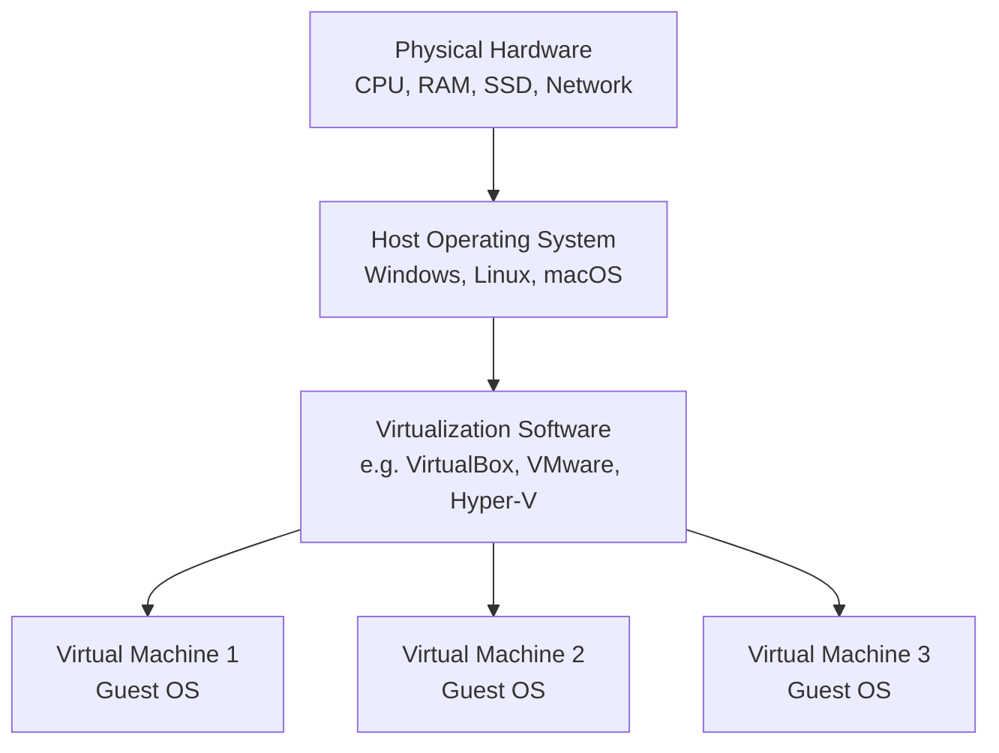
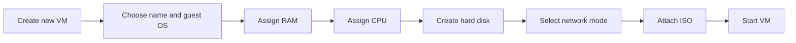
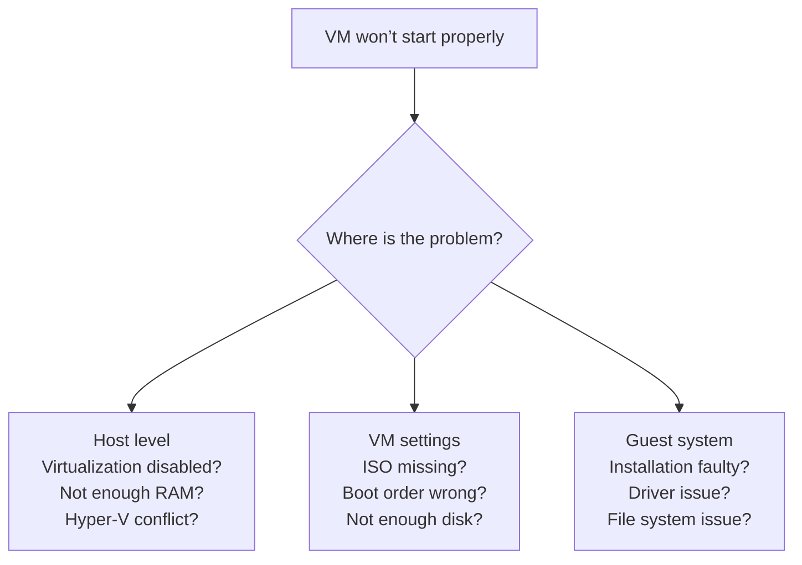

###### Topics

Setting up virtualization software

- Download and installation of virtualization software
- Basic requirements for use on your own system

Creating and configuring virtual machines

- Creating a new virtual machine
- Assigning CPU, RAM, hard disk, and network
- Adjusting basic VM settings

First steps with the virtual machine

- Starting and using a guest operating system
- Identifying simple configuration and startup issues

   
# 🖥️ Setting Up Virtualization Software

Virtualization means that you run one or more **virtual computers** on your real computer—the **host system**. These virtual computers are called **virtual machines** or simply **VMs**. Each VM behaves almost like an independent physical PC: It can have its own operating system, run its own programs, and use its own network settings.

The basic principle is important because it helps you understand most later settings:

So, the virtualization software sits **between your real computer and the virtual machine**. It distributes hardware resources such as memory, processor time, disk space, and network access to the VM.

Virtualization is especially useful if you want to:

- test another operating system,
- learn in a clean and isolated environment,
- try out software safely,
- recreate servers, networks, or development environments.

That VirtualBox supports various host and guest operating systems is described directly in the official manual ([Oracle VM VirtualBox User Manual – Introduction](https://www.virtualbox.org/manual/UserManual.html)). Microsoft also describes the use of virtual machines and Hyper-V as a way to run multiple operating systems on one device ([What is Hyper-V on Windows?](https://learn.microsoft.com/windows-server/virtualization/hyper-v/hyper-v-overview)).

   
## 📥 Download and Installation of Virtualization Software

Before you can create a VM, you need suitable virtualization software. For beginners, these solutions are particularly relevant:

| Software | Suitable for | Special features |
|---|---|---|
| **Oracle VM VirtualBox** | Windows, Linux, macOS | Very popular, good for learning, simple graphical interface |
| **VMware Workstation Player / Pro** | Mainly Windows and Linux | Very stable, often used professionally |
| **Hyper-V** | Windows Pro, Enterprise, Education | Integrated into Windows, good for Microsoft environments |
| **KVM/QEMU** | Mainly Linux | Very powerful, more technical |

If you’re currently learning, **VirtualBox** is often the simplest option as the interface is clear and there are many tutorials for it. You’ll find the official installation and introductory documentation in the VirtualBox manual ([Oracle VM VirtualBox User Manual](https://www.virtualbox.org/manual/UserManual.html)).

### How to choose the right software

The choice depends heavily on your host system:

- **Windows Home**: VirtualBox is often easiest, since Hyper-V is usually not fully available there.
- **Windows Pro/Enterprise/Education**: You can use Hyper-V or VirtualBox.
- **Linux**: VirtualBox or KVM/QEMU are common.
- **macOS**: VirtualBox is possible, but additional restrictions apply on newer Apple Silicon systems depending on the tool. Here, carefully check the respective vendor documentation.

Important: Not every virtualization software works equally well on every system. Especially on Windows, **Hyper-V** can affect other virtualization solutions. Microsoft describes that Hyper-V provides its own virtualization platform ([Introduction to Hyper-V on Windows](https://learn.microsoft.com/windows-server/virtualization/hyper-v/get-started/Install-Hyper-V)).

### Typical Download and Installation Process

In practice, installation almost always follows these steps:

1. Go to the official vendor site.
2. Download the version for your host operating system.
3. Run the installer.
4. Confirm default options if you have no special requirements.
5. Allow installation of network drivers or host components if prompted.
6. After completion, start the software.

It’s normal with VirtualBox, for example, that additional components such as network adapter drivers are set up during installation. These are needed so that VMs can use their own virtual network interfaces later ([Oracle VM VirtualBox User Manual – Networking](https://www.virtualbox.org/manual/ch06.html)).

### Common Observations During Installation

Some users are surprised when their network connection briefly resets during installation. That’s normal, as virtual network drivers are integrated. The software creates virtual network adapters or services so that, for example, a VM can later:

- access the internet,
- communicate with the host,
- run in an isolated test network.

After installation, you should start the software once with no VMs to check if it runs properly.

   
## ⚙️ Basic Requirements for Use on Your Own System

Not every computer is automatically well-suited for virtualization. A VM may be "virtual," but it uses **real** resources from your machine. That’s why requirements are so important.

### Hardware Virtualization: VT-x, AMD-V, SLAT

Modern virtualization usually requires hardware support from the CPU. For Intel, this is known as **Intel VT-x**, for AMD as **AMD-V**. Microsoft also names **Second Level Address Translation (SLAT)** as an important requirement for Hyper-V ([System requirements for Hyper-V on Windows](https://learn.microsoft.com/windows-server/virtualization/hyper-v/host-hardware-requirements)).

In simple terms:

- The CPU must **support** virtualization.
- The feature often needs to be **enabled in BIOS/UEFI**.
- Without it, some VMs won’t start at all or will be very limited.

So if you see errors like “VT-x is disabled” or “AMD-V unavailable” when creating or starting a VM, this is often **not** the VM’s fault but a host setting.

### Memory: The Most Common Bottleneck

A VM needs its own RAM, which comes from your computer’s physical memory. If you have 8 GB total and assign 4 GB to a VM, only about 4 GB remain for the host and other programs.

This quickly leads to problems:

- Host system slows down,
- VM lags,
- Programs freeze,
- Disk is heavily used for swapping.

Basic rule of thumb:

- **4 GB RAM total**: only very small tests feasible
- **8 GB RAM total**: simple Linux VMs usually work well
- **16 GB RAM total**: much more comfortable for learning
- **32 GB or more**: good for multiple VMs or heavier systems

### CPU Power

CPU cores also matter. A VM is assigned virtual processors, but the computing power always comes from the real CPU. If your host has only a few cores, don’t assign too many virtual CPUs.

A common beginner’s mistake: “I’ll just give the VM as much as possible.” That’s almost always bad. The host also needs resources. If you take too much from the host for your VM, **both** will suffer.

### Disk and Storage

A VM needs storage space for:

- the virtual disk file,
- the guest operating system,
- updates,
- programs,
- temporary files,
- possibly snapshots.

The virtual disk is usually a file on your host. VirtualBox uses VDI files, among others ([Oracle VM VirtualBox User Manual – Virtual Storage](https://www.virtualbox.org/manual/ch05.html)).

Key points:

- An **SSD** makes VMs much faster than an HDD.
- Always plan for **extra space**.
- Using snapshots can increase storage usage significantly.

### BIOS/UEFI Settings

If virtualization doesn’t work, look in the BIOS/UEFI for settings like:

- Intel Virtualization Technology
- VT-x
- Intel VT-d
- SVM Mode
- AMD-V

Not every setting is equally important, but VT-x or AMD-V are usually crucial.

### Host OS and Conflicts

On Windows, features like **Hyper-V**, **Windows Hypervisor Platform**, or **Virtual Machine Platform** can affect other virtualization solutions. Microsoft documents that Hyper-V provides the system’s hypervisor layer ([Hyper-V architecture](https://learn.microsoft.com/windows-server/virtualization/hyper-v/hyper-v-architecture)). This is important as some tools may not access hardware directly or may behave differently than expected.

### Practical Minimum Pre-Check

Before you even install a VM, ask yourself these questions:

| Question | Why it matters |
|---|---|
| Does my CPU support virtualization? | Otherwise, the VM may not run |
| Is virtualization enabled in BIOS/UEFI? | Common cause for startup errors |
| Do I have enough RAM? | Otherwise host and VM will be slow |
| Do I have enough SSD/disk space? | OS and updates need space |
| Are there conflicts with Hyper-V or similar features? | May affect VirtualBox/VMware |
| Do I have installation media for guest OS? | No ISO, no installation |

Having these clarified will save you a lot of troubleshooting later.

   
# 🧱 Creating and Configuring Virtual Machines

Now for the core part: creating a new virtual machine and shaping it. A VM is initially just an empty container. Only the right configuration turns it into a usable virtual computer.

The actual interface may differ depending on the software, but the core idea is almost always the same.

   
## 🆕 Creating a New Virtual Machine

Clicking **New** or **Create New Virtual Machine** typically takes you through a wizard step by step.

### Name, Type, and Version

First, you usually enter a name, for example:

- `Ubuntu-Lernsystem`
- `Windows-TestVM`
- `Debian-Webserver`

The name is not just cosmetic. Good names help you distinguish multiple VMs later. When learning, it’s useful to name VMs for their purpose.

Next, choose which guest OS you plan to install, for example:

- Linux
- Windows
- BSD
- Other

Often you also select the version, like Ubuntu 64-bit or Windows 11. This is important because the virtualization software sets suitable defaults depending on the choice. VirtualBox notes that certain standard configurations are preselected based on OS type ([Oracle VM VirtualBox User Manual – Creating a Virtual Machine](https://www.virtualbox.org/manual/ch01.html#gui-createvm)).

### Installation Medium: ISO File

A new VM starts empty. To install an OS, you need an **ISO file**—an image of an installation DVD or media.

Examples:

- Ubuntu ISO
- Debian ISO
- Windows ISO

The ISO is attached as a virtual DVD drive. When the VM boots, it starts the guest OS installer.

### Why VM Type Matters

A Linux guest and Windows guest often need different default settings:

- recommended RAM amount,
- default chipset,
- boot mode,
- controller settings,
- possible graphics options.

Accidentally choosing the wrong type isn’t usually catastrophic, but it can cause unnecessary problems or poor default values.

### Logical Naming for Learning

Especially when building core tech fundamentals, keeping things organized helps a lot. Instead of `VM1` or `Test`, better names might be:

- `ubuntu-cli-basics`
- `windows-lab-update-test`
- `debian-network-learn`

This way, you not only learn virtualization but also **good technical organization**.

   
## 🧠 Assigning CPU, RAM, Disk, and Network

This is the most important configuration step. Here, you determine how much of your real computer the VM gets.

### Assign CPU

A VM can be given one or more virtual CPUs, based on your real CPU’s cores or threads.

The golden rule: **Give the VM enough, but not too much**.

If your host has 8 logical CPUs, **1–2 vCPUs** is usually enough for a simple learning VM. More demanding tasks may need more, but always leave your host enough power.

Why too many CPUs can be bad:

- Not enough resources for the host.
- Unnecessarily complex scheduling.
- The VM won’t automatically run faster.
- The whole system can become unstable or laggy.

### Assign RAM

RAM typically has the greatest impact. Too little RAM makes a VM slow or unstable. Too much takes away from the host.

Some practical guidelines:

| Guest OS | Typical learning setup |
|---|---|
| Small Linux VM (no GUI) | 1–2 GB |
| Linux with desktop | 2–4 GB |
| Windows 10/11 for learning | 4–8 GB |
| Multiple services or development | More, as needed |

Always check what your host can handle. Giving a Windows VM 8 GB makes sense only if your real computer has enough memory to spare.

### Create virtual disk

Almost every VM needs a virtual hard disk. You configure:

- **File format** of the virtual disk,
- **Size**,
- **Dynamically allocated** vs. **fixed size**.

#### Dynamically allocated

The disk file grows as needed on your host rather than occupying the complete chosen space immediately.

Advantages:

- saves space at first,
- good for learning environments,
- quick to set up.

Disadvantage:

- can be less predictable under heavy use.

#### Fixed size

The full size is reserved immediately.

Advantages:

- often more predictable,
- sometimes higher performance.

Disadvantage:

- takes up all space right away.

VirtualBox describes working with virtual media and disk formats in the Virtual Storage section ([Oracle VM VirtualBox User Manual – Virtual Storage](https://www.virtualbox.org/manual/ch05.html)).

### How big should the disk be?

Depends on the guest OS:

- Small Linux test systems: **20–30 GB**
- Linux with desktop/tools: **30–50 GB**
- Windows learning systems: **64 GB or more**

It’s not just the initial install—updates, log files, browser caches, and programs use more space over time.

### Assigning network

Network might seem complicated, but the basic modes are easy to learn:

| Network mode | Meaning | Typical use |
|---|---|---|
| **NAT** | VM uses host’s network indirectly | Simple internet access |
| **Bridged Adapter** | VM appears as its own computer in the network | Testing in real LAN |
| **Host-Only** | Connects only between host and VM | Isolated learning environment |
| **Internal Network** | Only between VMs | Lab networks |

VirtualBox documents these network modes in the networking chapter ([Oracle VM VirtualBox User Manual – Networking Modes](https://www.virtualbox.org/manual/ch06.html)).

#### NAT Explained Simply

**NAT** is usually best for beginners: the VM has internet, but isn’t easily seen on the local network. It’s simple, works out of the box, and relatively safe for first tests.

#### Bridged Explained Simply

**Bridged mode** gives the VM its own presence on the network, like a real computer. Useful for network services, servers, or talking to other devices.

#### Host-Only Explained Simply

**Host-Only** is great for learning in a sandbox. The VM can talk to the host but not the internet (unless you add another virtual NIC). Good for lab environments.

### A Good Starting Setup for Beginners

For your first learning VM, these settings are usually best:

- **1–2 vCPUs**
- **2–4 GB RAM** for Linux, **4–8 GB** for Windows
- **dynamically allocated disk**
- **20–50 GB** depending on the guest
- **NAT** as network mode

This gives you a stable, simple, and manageable base.

   
## 🛠️ Adjusting Basic VM Settings

After creating the VM, you can usually tweak further settings. These may seem technical, but are important.

### Boot Order

**Boot order** defines what the VM boots from first:

- Optical drive / ISO
- Hard disk
- Network

For installation, have the ISO/virtual DVD drive first. After installing, set the virtual disk first, so it won’t boot into the installer every time.

### EFI/UEFI or Legacy BIOS

Modern OSes usually use **UEFI** instead of classic BIOS. Some virtualization software lets you select the boot mode. If a current guest OS fails to start, this setting may be relevant.

### Graphics and Display

Especially for desktop guests, graphics options matter:

- Video memory
- 2D/3D acceleration
- Screen resolution
- Multiple monitors

Overly aggressive graphics options aren’t always better. For simple learning VMs, default settings are often enough. If a graphical Linux or Windows VM stutters or shows a black screen, check these settings.

### Controllers and Virtual Hardware

You can set which virtual hardware is emulated, like:

- SATA controller
- NVMe controller
- Audio
- USB support
- Clipboard
- Shared folders

For learning, activate only what you need—each extra feature adds complexity.

### Shared Clipboard and Drag & Drop

Many programs let you copy text/files between host and guest or use shared folders.

These features are convenient but technically reduce isolation. In learning and testing, that’s fine, but you should understand they break separation between host and guest.

### Guest Additions or Tools

Many virtualization programs offer add-ons for guest OS, such as:

- **VirtualBox Guest Additions**
- **VMware Tools**

These typically improve:

- mouse integration,
- screen resolution,
- drivers,
- clipboard,
- shared folders,
- sometimes performance.

Oracle describes Guest Additions as extensions for better integration between host and guest ([Oracle VM VirtualBox User Manual – Guest Additions](https://www.virtualbox.org/manual/ch04.html)).

### Snapshots: Very Useful for Learning

A **snapshot** is like a save state of your VM. You can revert to that state at any time.

This is extremely helpful if you want to:

- test software,
- try out configs,
- provoke errors to learn from,
- save a system before making changes.

But: Snapshots aren’t a full replacement for backups. VMware explains snapshots as a way to capture a VM’s state at a certain point ([VMware Workstation Pro Documentation](https://docs.vmware.com/en/VMware-Workstation-Pro/index.html)).

   
# 🚀 First Steps with the Virtual Machine

Once the VM is created and configured, it’s time for hands-on use. Now, you start the machine, install or use the guest OS, and learn to recognize initial problems.

This is where real technical understanding develops: you observe how booting, hardware allocation, networking, and the guest OS all interact.

   
## 🖱️ Starting and Using the Guest Operating System

When you start the VM, a virtual boot process runs in the background—just like on a real PC.

### Typical Boot Sequence

Usually, the steps are:

1. Virtualization software starts the VM.
2. The VM checks its virtual hardware.
3. The virtual BIOS or UEFI looks for a boot medium.
4. If an ISO is present, the installer starts.
5. After installation, the VM boots from the virtual hard disk.
6. The guest OS loads drivers and UI.

Key lesson: A VM isn’t just a “program window with Linux or Windows”—it’s a **virtual computer with its own boot process**.

### Guest OS Installation

If you attached an ISO, usually an installer boots. This works almost exactly as on real hardware:

- Choose language
- Set keyboard
- Confirm partitioning
- Create user
- Set password
- Finish installation
- Reboot

After the first successful reboot, make sure the VM now **boots from the virtual disk** and not the installer again.

### Mouse and Keyboard Handling

A common beginner issue: The VM "captures" mouse and keyboard input, meaning that your input only goes to the VM window.

Many virtualization packages use a **host key** to release mouse/keyboard back to your real computer. VirtualBox documents this concept so users can switch keyboard/mouse control between host and guest ([Oracle VM VirtualBox User Manual – First Steps](https://www.virtualbox.org/manual/ch01.html)).

### Typical First Tasks in the VM

After installation, good initial steps include:

- Checking if the system boots normally,
- Verifying language and time zone,
- Testing the network connection,
- Running updates,
- Installing Guest Additions/Tools,
- Adjusting display resolution.

These are not “extras”; they help confirm your VM works as intended.

### What to Watch for When Using the VM

When working in the VM, train yourself to keep these things in mind:

- Is the system responsive?
- Does the VM have network access?
- Is the time correct?
- Is the screen resolution okay?
- Is CPU usage unusually high?
- Is enough disk space available?

These observations are part of good technical learning. Don’t just “use” the VM—analyze how the system behaves.

   
## 🩺 Recognizing Simple Configuration and Startup Issues

Especially early on, problems are common. That’s normal. What matters is learning to **systematically** identify where the problem lies.

A useful way to think about it:

### Problem 1: VM Won’t Start At All

If an error appears immediately at startup, common reasons include:

- Hardware virtualization disabled in BIOS/UEFI.
- Another virtualization feature is blocking access.
- VM misconfigured for the host hardware.
- Not enough free RAM.

Especially **VT-x**, **AMD-V**, **virtualization disabled**, or **Hypervisor** errors usually point to a host (not guest) problem.

### Problem 2: Black Screen or No Boot

If the VM starts but doesn’t boot, check mainly:

- Is an ISO correctly attached?
- Is the boot order correct?
- Is the virtual disk present?
- Is the guest OS installed?
- Does BIOS/UEFI match the guest?

A plain black screen often means: no bootable medium or the VM can’t find it.

### Problem 3: Installer Keeps Starting Over

This often happens if the ISO remains attached after installation and the boot order prioritizes the virtual DVD drive.

Solution:

- Eject or remove the ISO,
- Move the disk up in the boot order,
- Reboot the VM.

### Problem 4: VM Extremely Slow

A very common issue. Usual causes:

- Too little RAM,
- Too many or inappropriate CPU settings,
- Overloaded host system,
- VM stored on slow HDD not SSD,
- Missing Guest Additions/Tools,
- Background updates or indexing.

Slowness is rarely “mysterious,” but typically due to resources or drivers.

### Problem 5: No Network in VM

If the VM lacks internet or network, check:

- What network mode is set?
- Is the virtual network adapter enabled?
- Does the guest have an IP address?
- Does networking work on the host?
- Is NAT or Bridged mode properly chosen?

With **NAT**, internet access is usually easiest. Bridged mode issues may relate to the physical adapter, Wi-Fi peculiarities, or network policies.

### Problem 6: Mouse, Resolution, or Display Issues

Typical symptoms:

- Mouse movement is inaccurate,
- Resolution can’t be changed,
- Display remains small,
- Graphics are choppy.

Check:

- Are Guest Additions/Tools installed?
- Is enough video memory set?
- Is an experimental 3D acceleration enabled that’s causing issues?
- Is the correct graphics controller selected?

### Problem 7: Not Enough Disk Space

If the VM starts showing errors, updates fail, or the system becomes unstable, the guest or host may have run out of disk space.

You must distinguish **both levels**:

- **Host disk full**: VM disk file can’t expand further.
- **Guest disk full**: The OS inside the VM has no space.

A common beginner mistake: checking only the VM while the host SSD has filled up.

### How to Think About Problems

For troubleshooting, proceed in order:

#### 1. Check the Host

First ask:

- Does the virtualization software run properly?
- Enough RAM, CPU, disk space?
- Virtualization enabled?
- Any conflicts with other hypervisor features?

#### 2. Check VM Configuration

Then, check VM settings:

- CPU
- RAM
- Virtual hard disk
- ISO
- Boot order
- Network mode

#### 3. Check Guest OS

Then look into the guest OS itself:

- Is the system installed correctly?
- Driver issues?
- File system corrupt?
- Network service running?
- Updates failed?

This way of thinking is essential for core tech fundamentals: learning to **separate layers**. That’s what distinguishes structured technical work from just tinkering.

### Practical Diagnostic Table

| Symptom | Probable Layer | Typical Cause |
|---|---|---|
| VT-x/AMD-V error | Host | Virtualization disabled or blocked |
| Black screen at startup | VM config | No bootable medium |
| Installer loops | VM config | ISO still attached |
| No internet in VM | VM/guest | Wrong network mode or guest config |
| VM very slow | Host + VM | Too little RAM, slow disk, overloaded |
| Poor display/resolution | Guest | Tools/Additions missing |

### Why These Issues are Normal

Nearly all beginner VM issues stem from three patterns:

- **Incorrectly estimated resources**
- **Misunderstood boot/install logic**
- **Not cleanly separating host, VM, and guest**

Once you grasp these three areas, you’ll quickly gain confidence with VMs. This is the real learning win: Not just “getting a VM to run,” but understanding **why** it runs—or why it doesn’t.