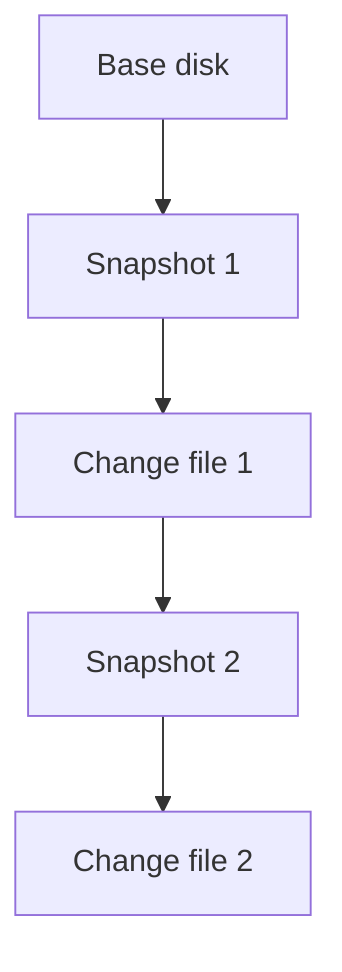
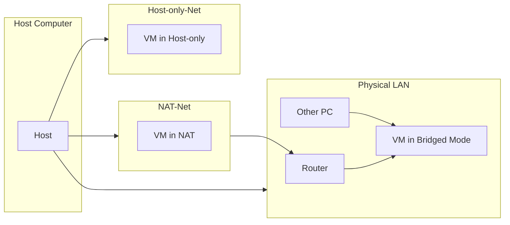

###### Topics

Working with Virtual Machines

- Understanding and using snapshots fundamentally
- Cloning, importing, and exporting virtual machines

Virtual Networks

- Basically distinguishing NAT, Bridged, and Host-only modes
- Understanding communication of virtual machines in the network
- Learning basic security aspects of virtual networks

   

# 🖥️ Working with Virtual Machines

Virtual machines, often simply called **VMs**, are essentially **complete computers in software**. They feature a virtual CPU, virtual memory, virtual hard drives, and virtual network cards. A so-called **hypervisor** provides this virtual hardware, such as VirtualBox, VMware, or Hyper-V. Microsoft describes Hyper-V exactly like this: as a virtualization technology that allows you to run multiple isolated operating systems on a single physical host ([What is Hyper-V on Windows?](https://learn.microsoft.com/en-us/virtualization/hyper-v-on-windows/about/)).

To get a clear understanding, this mental model helps:

- **The host** is your real computer.
- **The guest** is the virtual machine.
- **The VM consists of state, configuration, and virtual disks.**

These three things are crucial when talking about **snapshots**, **cloning**, **import/export**, and **virtual networks**.

   

## 📸 Understanding and Using Snapshots Fundamentally

A **snapshot** is a kind of **restore point** for a virtual machine. It remembers what the VM looked like at a certain point in time. Depending on the hypervisor, this can include the state of the virtual disks, the configuration, and even the memory contents. In Hyper-V, this concept is called a **checkpoint**, and Microsoft explains that it can capture the state, data, and hardware configuration of a VM ([Manage Hyper-V checkpoints](https://learn.microsoft.com/en-us/windows-server/virtualization/hyper-v/manage/manage-checkpoints)).

Important: A snapshot is **not simply a full file copy of the entire VM**. In many virtualization systems, after taking a snapshot, **changes are written to additional differential files**. The original state remains unchanged, and new changes are stacked on top. This allows you to roll back to a previous state later.

   

### 🧠 What a Snapshot Means in Practice

Imagine you have a VM with Linux or Windows and you want to test a risky update. Here’s how you could proceed:

1. Bring the VM to a clean state.
2. Create a snapshot.
3. Install the update or new software.
4. If something breaks: revert to the snapshot.

That's the big advantage: You can **experiment quickly** without having to rebuild the VM from scratch.

A snapshot is ideal when you want to:

- test an operating system update,
- try out new software,
- make configuration changes,
- perform malware analysis or set up labs in isolated environments,
- create a safe starting point before teaching or running a demo.

   

### ⚙️ What Exactly Gets Saved

Depending on the hypervisor and settings, a snapshot can include various elements:

| Component | Is it often saved? | Meaning |
|---|---:|---|
| State of the virtual disk | Yes | Which files and data were present in the VM |
| VM configuration | Yes | RAM allocation, devices, network cards, etc. |
| Memory contents | Optional or often possible | The VM resumes exactly where it left off |
| Running state | Frequently | Whether the VM was on, off, or paused |

If memory contents are saved, it's especially convenient: After restoring, it feels like the computer was **frozen and then thawed out exactly at that point**.

   

### 🪜 How Snapshots Often Work Internally

Here is a simplified diagram:

The idea: The old state remains, and new changes go into extra files. This is practical, but also means:

- more storage use over time,
- increased complexity,
- potentially worse performance with long snapshot chains.

Oracle explains in the VirtualBox manual that snapshots capture a VM’s state at a specific point and can be reverted to that state ([Oracle VM VirtualBox User Manual](https://www.virtualbox.org/manual/UserManual.html)).

   

### ✅ When Snapshots are Useful

Snapshots are best for **short-term restore points** within a learning, testing, or admin workflow.

Typical situations:

- **Before updates**: e.g., before a major Windows or kernel update
- **Before software installation**: e.g., database, webserver, driver, development tools
- **Before configuration changes**: network, firewall, permissions, services
- **Before lab experiments**: security tests, automation, scripts, new tools

Especially when learning, snapshots are extremely valuable since you can **try things fearlessly**. Knowing you can always go back boosts active and bold learning.

   

### ⚠️ What Snapshots Are Not

One crucial point: **Snapshots are not a substitute for backups.** Microsoft explicitly states for Hyper-V that checkpoints are not a replacement for backups ([Manage Hyper-V checkpoints](https://learn.microsoft.com/en-us/windows-server/virtualization/hyper-v/manage/manage-checkpoints)).

Why not?

Because snapshots are tightly coupled to the original VM structure. If VM files get corrupted, the host fails, or storage is lost, the snapshot often doesn't help like a real external backup would.

The difference is important:

| Snapshot | Backup |
|---|---|
| Quick restore point | Complete data protection |
| For tests and short-term rollbacks | For failure, loss, recovery |
| Often within the same VM structure | Ideally stored separately |
| Not intended for long-term retention | That’s exactly what it’s for |

Memory tip: **Snapshot = Rollback point. Backup = true protection.**

   

### 🚫 Common Mistakes with Snapshots

Many beginners make similar mistakes with snapshots. The most important are:

**1. Keeping too many snapshots**  
A long snapshot chain makes the VM confusing and can impact performance and storage.

**2. Treating a snapshot like a backup**  
This is one of the most dangerous misconceptions.

**3. Using blindly before production databases**  
Especially with write-heavy services or databases, you need to know how the hypervisor and the guest OS deal with consistency. Technically, a state is saved, but not necessarily a clean application point.

**4. Working without a naming system**  
"Snapshot 1," "Test," "New" are bad names. Better:  
`Before Apache installation 2026-03-24` or `Before Kernel Update Debian Lab`.

   

### 🧭 Good Practice for Snapshots

A clean learning and admin style looks like this:

- Snapshot **before** risky changes
- Assign a short, clear description
- Delete unnecessary snapshots after successful tests
- Don’t create endless snapshot chains
- For real safety, also export or properly back up

This is a very typical **Core-Tech-Fundamentals mindset**: You clearly separate
**test point**, **copy**, **archive**, and **backup**.

   

## 🧬 Cloning, Importing, and Exporting Virtual Machines

When you **clone** a VM, you create another VM from an existing one. The new VM is based on the original, but is usually usable as its own system thereafter.

This is very practical if you, for example:

- want to create multiple test systems from a base VM,
- want to distribute a prepared training environment,
- need a golden base system for different roles,
- want to build a lab network with several similar machines.

   

### 🪞 What Cloning Means

Cloning creates a new instance from an existing VM. This may start from the same state, but after that, it's independent.

There are two main types.

   

### 🧱 Full Clone

A **full clone** creates a **completely independent copy** of the VM, including virtual disks. The new VM is fully autonomous and no longer depends on the original.

This is the safe and clean variant if you really want to work independently.

Pros:

- independent of the original,
- stable and easy to understand,
- good for long-term use,
- good for sharing or archiving.

Cons:

- requires more storage,
- takes longer.

   

### 🔗 Linked Clone

A **linked clone** uses the original or a snapshot as a common base. The new VM only saves its changes separately.

Pros:

- quick to create,
- saves storage,
- good for short-term testing.

Cons:

- often depends on the original or base snapshot,
- less robust for long-term use,
- more complicated if you move files or delete base data.

Especially when learning, you should understand the difference:
**Full clone = your own complete machine.**
**Linked clone = derived machine with dependencies.**

   

### 🆔 Key Pitfalls When Cloning

Cloning a VM doesn’t automatically create a “perfectly new” system in every sense. Some identities need to be checked or regenerated.

Typical points:

- **Hostname**
- **IP address**
- **MAC address**
- **Machine IDs**
- **SSH host keys**
- **Domain/directory relationships**
- **Local certificates or tokens**

Running two cloned systems with the same identity on the same network can cause conflicts. Double IP addresses or identical system IDs are particularly problematic.

A very important practical learning point:
**A cloned VM is technically copied, but often not cleanly customized administratively.**

   

### 📦 Importing and Exporting: What Does This Mean?

**Exporting** means packaging a VM so it can be transferred or archived on another system.  
**Importing** means reading such a packaged VM into a hypervisor and creating a VM from it.

This is not the same as a snapshot and not exactly the same as cloning.

An export is more like a **package ready for transport**.

Most commonly, the **OVF/OVA** format is used. The DMTF describes OVF as a standardized format for packaging and distributing virtual appliances ([Open Virtualization Format](https://www.dmtf.org/standards/ovf)).

To sum up:

- **OVF** is more of a description plus accompanying files
- **OVA** is often a single archive that bundles everything together

   

### 🔄 Difference Between Cloning, Snapshot, and Export

| Function | Main Purpose | Typical Use Case |
|---|---|---|
| Snapshot | Remember and roll back to a state | Before changes, tests |
| Clone | Create a new VM from an existing VM | Labs, multiple systems |
| Export | Move or archive a VM | Transfer, migration |
| Import | Make an exported VM usable again | Deploying on another host |

This is one of the most important conceptual differences. Mastering this means you’re already far safer when working with virtualization.

   

### 🚚 When Import and Export Are Especially Useful

Export/import is useful if you want to:

- take a VM to another computer,
- share a prepared lab environment,
- archive a clean VM state,
- migrate between hypervisors or hosts, as long as formats and compatibility allow.

Microsoft describes for Hyper-V that you can export and later re-import VMs to move or redeploy them ([Export and import virtual machines](https://learn.microsoft.com/en-us/windows-server/virtualization/hyper-v/deploy/export-and-import-virtual-machines)).

   

### 🧹 What to Consider Before Exporting

Before exporting, you should consider if the VM contains sensitive data. Unintentionally, you might export:

- saved passwords,
- API keys,
- browser data,
- SSH keys,
- certificates,
- tokens,
- test data or personal data.

Export is therefore not just a technical task, but also a **security and privacy** topic.

If you intend to share a VM, it’s often wise to "clean" it first:

- remove temporary files,
- delete confidential keys,
- check user accounts,
- review log files,
- neutralize hostnames and network configuration.

   

### 🧠 A Good Mental Model

You can remember it like this:

- **Snapshot** = “I want to be able to roll back.”
- **Clone** = “I want an additional VM based on this one.”
- **Export** = “I want to transport or share the VM.”
- **Import** = “I want to bring such a package back into use.”

It sounds simple, but these distinctions often separate clean work from chaos.

   

# 🌐 Virtual Networks

A virtual computer only becomes realistically usable when it can communicate with other systems. That makes networking one of the most fundamental concepts.

A VM typically has one or more **virtual network adapters**. These are connected by the hypervisor to a virtual network. This virtual network can be connected to the host's real network in various ways.

The most important modes you have to know are:

- **NAT**
- **Bridged**
- **Host-only**

Oracle describes these network modes as basic options for virtual network connections in the VirtualBox manual ([Oracle VM VirtualBox User Manual](https://www.virtualbox.org/manual/UserManual.html)).

   

## 🔀 Basically Distinguishing NAT, Bridged, and Host-only

These three modes pursue different goals. If you can distinguish them, you already understand a key aspect of virtual networking.

   

### 🌍 NAT (Network Address Translation)

**NAT** stands for **Network Address Translation**. In this mode, the VM is part of a private virtual network, and the host or hypervisor translates external connections. Private address ranges are described in RFC 1918, for example, `10.0.0.0/8`, `172.16.0.0/12` and `192.168.0.0/16` ([Address Allocation for Private Internets](https://datatracker.ietf.org/doc/html/rfc1918)).

In practice:

- The VM can usually access the **external** network or internet.
- Devices on the physical LAN **don’t usually see** the VM directly.
- Incoming connections from outside to the VM are by default **not directly possible**, except with port forwarding.

It’s similar to home routers: Several devices use private IPs internally, but externally, communication appears via a translated connection.

**Typical learning scenario:**  
You want to install software, get updates, or use a browser in a VM, but the VM shouldn’t appear in the LAN as a separate device.

   

### 🌉 Bridged (Network Bridge)

In **bridged mode**, the VM is treated much more like a **separate real computer on the same physical network** as the host. The VM appears in the LAN, typically has its own MAC address, and generally gets an IP address from the same pool as other LAN devices.

In practice:

- The VM is directly visible in the network.
- Other LAN devices can reach it directly.
- The VM behaves much more realistically like a normal networked computer.

This is useful if you want to test server services, such as:

- web servers
- SSH servers
- databases in the LAN
- network diagnostics
- Active Directory or client/server scenarios

But this directness also makes bridged mode more sensitive from a security perspective.

   

### 🧪 Host-only

In **host-only mode**, a network is created where the **host and the VM can communicate** with each other, without the VM automatically having direct access to the external physical network.

This often means:

- Host ↔ VM works
- VM ↔ VM in the same host-only network works
- VM ↛ Internet, usually not directly by default
- External devices ↛ VM also not directly

This is ideal for:

- isolated learning environments,
- malware labs,
- local server tests only between host and guests,
- safe experiments without LAN exposure.

Host-only is thus a very good mode for controlled learning.

   

### 📊 Direct Comparison of the Three Modes

| Mode | Internet Access | Directly visible in LAN | Host can reach VM | Well suited for |
|---|---|---:|---:|---|
| NAT | Yes, usually outbound | Rather no | Limited, or via special configuration | Secure standard lab, updates, normal work |
| Bridged | Yes | Yes | Yes | Realistic network tests, servers in the LAN |
| Host-only | Usually no | No | Yes | Isolated labs, local tests |

   

### 🖼️ Visual Illustration of the Modes

This diagram mainly demonstrates one thing:  
**The network mode determines who can see and reach whom directly.**

   

## 💬 Understanding Communication of Virtual Machines in the Network

For two systems to communicate on a network, it's not enough that "networking is somehow on." Several layers and conditions must match.

The most important questions:

1. **Are the systems connected in the appropriate network mode?**
2. **Do they have valid IP addresses?**
3. **Are they in the same subnet, or is routing available?**
4. **Do firewalls allow the communication?**
5. **Is there really a service running on the target system at the desired port?**

A core networking principle:  
**Network communication rarely fails at a single point—it usually’s a chain of conditions.**

   

### 🧭 How Communication Between VMs Typically Works

There are several common cases.

   

### 🖥️ VM to Internet

This is easiest with **NAT** or **Bridged**.

- With **NAT**, outbound connections typically work without issues.
- With **Bridged**, the VM is like a member of the LAN and also has internet access.

Host-only is usually not intended for this purpose.

   

### 🖥️ Host to VM

Depends heavily on the mode:

- **Host-only**: very well suited
- **Bridged**: usually also possible
- **NAT**: often not directly, except with additional port forwarding or hypervisor-specific mechanisms

That’s why Host-only is so popular for local web server or SSH tests: The host can reach the VM, but not the rest of the LAN.

   

### 🖥️ VM to VM on the Same Host

If both VMs are in the **same virtual network**, they can communicate with each other. This applies to, e.g.:

- two VMs in the same Host-only network,
- two VMs in the same NAT network, as permitted by the hypervisor,
- two VMs in Bridged mode in the same physical LAN.

Key learning point:  
**“Both are virtual” isn't enough. They must be in the same or a routable network.**

   

### 🌐 VM to Device on the Real LAN

This works most directly with **Bridged** mode since the VM is an actual LAN member.

With **NAT**, it’s typically much harder by default since the VM is hidden behind a translation. Many hypervisors let you forward specific ports, but this is deliberately more restrictive.

Example:  
If you run a web server in a NAT VM, you can forward host port 8080 to VM port 80. You would then access the host port, which forwards to the VM. This is a classic case for **port forwarding**.

   

### 📡 Why Ping Sometimes Doesn’t Work

Many learners test networking with `ping`. That’s useful, but not perfect.

`ping` uses **ICMP**, which can be blocked by firewalls. The target might be reachable but simply not respond. This means:

- **Ping successful** → connection probably works
- **Ping fails** → not necessarily dead, could simply be ICMP blocked

So always check in addition:

- IP configuration
- Routing
- DNS
- Open ports
- Firewall rules
- Active services

   

### 🧱 Communication Happens on Multiple Layers

This conceptual model is very valuable for real learning:

| Layer | Question |
|---|---|
| Physical/virtual | Is the network card connected? |
| Layer 2 | Are the systems in the same virtual network? |
| Layer 3 | Do they have IP addresses and routing? |
| Layer 4 | Is the required port open? |
| Application | Is the service actually running? |

If you master this layered thinking, you'll solve networking problems much more systematically.

   

### 🔁 Example: Two VMs Should Talk to Each Other

Assume you have:

- **VM A** as web server
- **VM B** as client

Then at minimum, you need:

1. Both are in the same network or routable.
2. Both have valid IP addresses.
3. VM B knows the target address of VM A.
4. The firewall on VM A allows the web port.
5. A web server is actually running on VM A.

Only then will something like `http://<IP-of-VM-A>` work.

This may sound basic, but it’s exactly the structured thinking that Core-Tech-Fundamentals is all about.

   

## 🔐 Learning Basic Security Aspects of Virtual Networks

Virtual networks aren't automatically “secure” simply because they're virtual. Isolation is possible, but it needs deliberate configuration.

A major benefit of virtualization is that you can **intentionally restrict networks**. This is a security gain: You decide **how visible** and **how reachable** a VM is.

   

### 🛡️ Security Impact of Network Modes

Each network mode has typical security implications.

| Mode | Security Impact |
|---|---|
| NAT | Good default if the VM needs internet, but shouldn’t be visible in the LAN |
| Bridged | Greater visibility, thus more attack surface in the LAN |
| Host-only | Good isolation for tests between host and VM |
 
This doesn’t mean NAT is “secure” and Bridged is “insecure.” It means:  
**The more directly a VM appears in the real network, the more carefully you must secure it.**

   

### 🚪 Bridged Increases Direct Accessibility

In Bridged mode, the VM is often visible like any regular LAN device. This is practical, but also risky:

- other devices can scan its ports,
- services might be directly accessible,
- misconfigurations have immediate impact on the network,
- insecure test systems can cause real harm.

If you’re running an insecure, old, or experimental system, Bridged is **not** usually the best first choice.

   

### 🔒 Host-only for Labs and Controlled Environments

Host-only is powerful for learning, letting you build a small, controlled lab. The host and VMs can communicate, but VMs aren’t automatically exposed to the LAN or Internet.

Ideal for:

- local server exercises,
- exploit or malware analysis in a safe space,
- firewall rule testing,
- services that shouldn’t appear on the real network.

But Host-only isn’t a magic shield. If you enable shared folders, clipboard, integration features, or expose ports, you increase attack surface. These integration functions are available in many hypervisors and should be enabled consciously ([Oracle VM VirtualBox User Manual](https://www.virtualbox.org/manual/UserManual.html)).

   

### 🔌 Use Port Forwarding Sparingly

With NAT, you can expose specific VM services by setting up **port forwarding**. That’s convenient, but do it intentionally.

Good practice:

- Only open truly required ports,
- Only for as long as needed,
- Document which forwarding exists and for what,
- Remove forwarding after tests.

Security here comes from **minimization**: expose as little as possible, keep as much hidden as possible.

   

### 🧬 Clones and Security: Identical Systems Can Be Problematic

Security isn’t just about network modes, but also cloned VMs. When cloning, you may accidentally copy identifying info.

Risky examples:

- same SSH host keys,
- same local certificates,
- stored admin logins,
- API tokens,
- static IP addresses,
- identical hostnames,
- old logs with sensitive data.

Especially when exporting or sharing a VM, you should ask,  
**Which secrets are travelling with it?**

This is one of the most professional mindsets when handling VMs.

   

### 🧯 Minimal Security Principle: As Much Network as Needed, as Little as Possible

A very good fundamental principle is:

> **Always choose the least open network mode that still fulfills your goal.**

Examples:

- Just want to update → **NAT**
- Only want to test locally with host → **Host-only**
- Want other devices in the LAN to access the VM → **Bridged**

This concept is known as **Least Exposure** or minimizing attack surface.

   

### 🧹 Other Basic Protection Measures

Besides network mode, here are practical security rules:

- Keep guest OS up to date
- Disable unnecessary services
- Enable firewall on the guest
- Avoid default passwords
- Only enable shared folders when needed
- Regularly review shares and port forwarding
- Don’t blindly trust imports from unknown sources

Treat imported appliances or foreign VMs with caution. An imported system is a complete foreign OS with its own configuration. Never treat that naively.

   

### 🧠 The Right Learning Model for Security in Virtual Networks

If you remember just one thing, let it be this:

**Security in virtual networks is achieved primarily through conscious visibility, clear boundaries, and minimal exposure.**

Or even simpler:

- Who can see the VM?
- Who can reach it?
- Which services are open?
- Does that really need to be the case?

If you think this way, you not only learn virtualization technically, but also professionally.