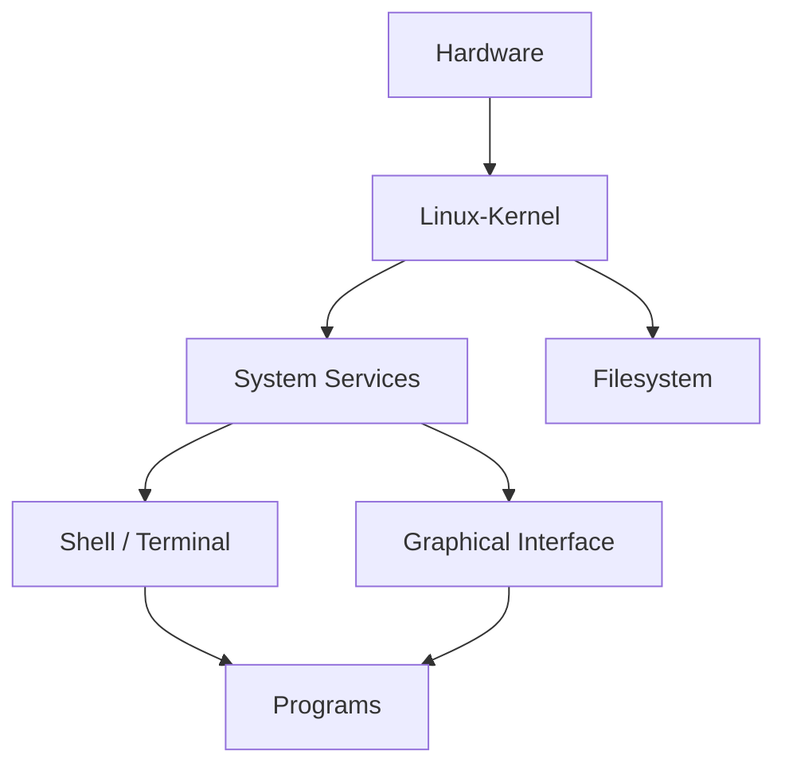
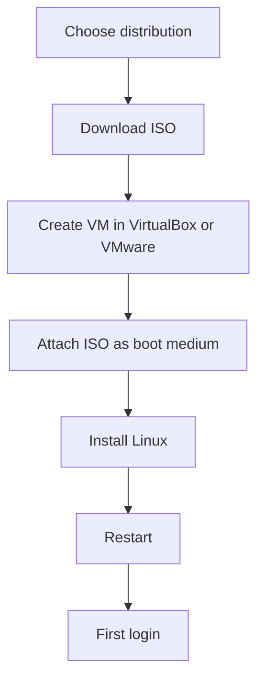
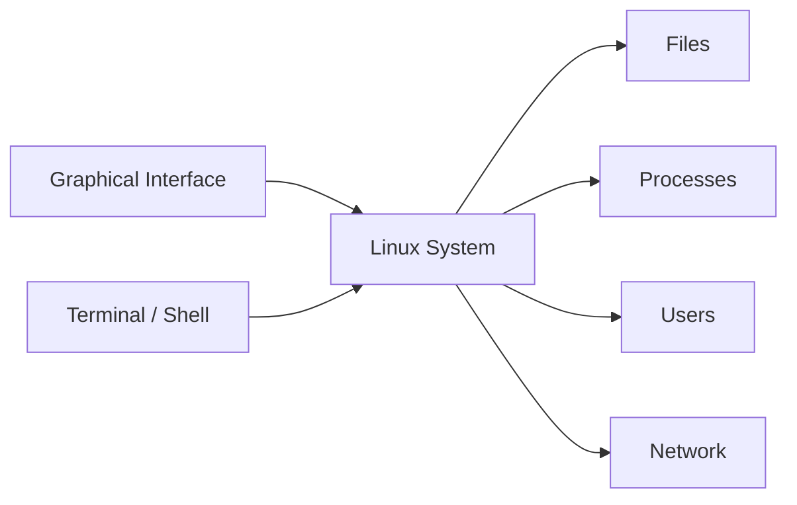

###### Topics

Linux Basics

- Overview of Linux and typical areas of application
- Important differences between Linux and other operating systems

Linux Distributions

- Examples of common distributions for desktop and server
- Simple criteria for selecting distributions

Installation and First Steps

- Installing a Linux distribution in a virtual machine
- First login and user authentication

Graphical User Interface and Terminal

- Navigation in the graphical environment
- Opening the terminal and understanding basic operation
- Switching between graphical environment and terminal

<br><br><br>
# 🐧 Linux Basics

<br><br><br>
## 🌍 Overview of Linux and Typical Areas of Application

When people talk about **Linux**, they often mean the entire operating system. **Technically speaking**, Linux is first and foremost the **kernel**, the core of the operating system. This kernel controls fundamental things like processes, memory, devices, filesystems, and communication with the hardware. Only in combination with additional tools, programs, libraries, and often a graphical interface does it become what you use as a "Linux system" ([What is Linux?](https://www.redhat.com/en/topics/linux/what-is-linux)).

This is important to understand because it explains why Linux can exist in so many different forms. There isn’t **one Linux**, but many variants that are all based on the same kernel. That’s why Linux on a server often looks very different from Linux on a laptop.

Linux is now used in many fields:

- **Servers and Data Centers**: Websites, databases, mail servers, web applications, and cloud services often run on Linux.
- **Cloud and Containers**: Many container technologies and cloud platforms are based on Linux fundamentals.
- **Software Development**: Developers often work with Linux because many tools for programming and system administration are well supported there.
- **Network and Security Environments**: Firewalls, routers, monitoring systems, or security tools often run on Linux.
- **Embedded Systems and IoT**: Linux runs in many devices, such as routers, TVs, industrial equipment, or single-board computers.
- **Desktop Systems**: Linux can also be used as a regular workstation or learning system.
- **Supercomputers**: Linux is especially prominent in high performance computing because it can be easily adapted to special hardware and scientific requirements ([TOP500](https://www.top500.org/)).

The great advantage of Linux is that it is **flexible, stable, customizable, and available in many variants**. For learners, this is especially interesting: You can start with a simple desktop and later move towards servers, networks, automation, or cybersecurity without having to relearn the fundamental concept from scratch.

<br><br><br>
### 🧱 Rough Structure of a Linux System



This diagram helps with learning: The terminal is **not a separate system**, but just **another way** to interact with the operating system. The graphical interface is also just a method of interfacing with the same system.

<br><br><br>
## ⚖️ Important Differences Between Linux and Other Operating Systems

Linux differs in several ways from Windows and partly from macOS. These differences are important when getting started, as many beginners unconsciously expect Linux to work “just like Windows.”

<br><br><br>
### 🔓 Openness and Structure

Linux is largely **open source**. That means the source code of many core components is publicly viewable and can be further developed by the community or companies. This also explains why there are so many distributions and why Linux is highly customizable ([What is Linux?](https://www.redhat.com/en/topics/linux/what-is-linux)).

With Windows, you essentially get **one central platform** from Microsoft. With Linux, there are many variants targeting different use cases. This gives you more freedom but also means you have to deal with terms like **distribution**, **package manager**, or **desktop environment** sooner.

<br><br><br>
### 🧩 Distributions Instead of a Single System

With Linux, you don’t simply install “Linux,” but rather a **distribution**. A distribution combines the Linux kernel with:

- Programs and system tools
- a package manager
- repositories for software
- optionally a graphical interface
- update mechanisms
- its own philosophy or target audience

That’s why an Ubuntu system can seem very beginner-friendly, while Arch Linux requires much more manual setup.

<br><br><br>
### 📁 Filesystem and Directory Structure

A very important difference is the structure of the filesystem. In Linux, everything starts at **`/`**, the so-called **root directory**. There are not usually drive letters like `C:` or `D:`. Instead, drives are **mounted** into the directory structure.

Typical directories include:

- **`/home`** – user personal files
- **`/etc`** – configuration files
- **`/var`** – variable data like logs
- **`/bin`**, **`/usr/bin`** – programs
- **`/tmp`** – temporary files

This may seem unfamiliar at first, but is very logically organized. If you want to learn Linux long-term, this understanding is extremely important.

<br><br><br>
### 👤 User Permissions and Security

Linux very clearly distinguishes between regular users and administrative rights. A user normally **does not work as administrator by default**. Administrative tasks are performed specifically with elevated privileges, often via **`sudo`**. This is an important security mechanism and a typical part of Linux fundamentals ([RootSudo](https://help.ubuntu.com/community/RootSudo)).

This differs from earlier Windows experience, where users were often used to working with administrator rights more frequently. Modern Windows versions have become stricter here, but in Linux this principle is especially central.

<br><br><br>
### 📦 Software Installation via Package Manager

In Linux, you often don’t install programs by downloading a `.exe` from some website, but via a **package manager**. Common examples include:

- **APT** with Debian and Ubuntu
- **DNF** with Fedora
- **Zypper** with openSUSE
- **Pacman** with Arch Linux

These package managers use verified repositories and can install, update, and remove programs along with their dependencies. This is a big difference from classic software installation on Windows and is one of the most practical Linux concepts ([Package management](https://documentation.ubuntu.com/server/explanation/software/package-management/)).

<br><br><br>
### ⌨️ The Terminal Has a Greater Significance

On Linux, the **terminal** is especially important. That doesn’t mean you have to do everything on a black screen with text only. But many tasks can be completed in the terminal:

- faster,
- more precisely,
- reproducibly
- and in an automated way.

Especially in the area of **Core Tech Fundamentals**, this is a huge advantage. If you learn how the system works on the command level, you will later understand servers, scripting, DevOps, containers, and many security topics much more easily.

<br><br><br>
### 🖥️ Customizability and Interfaces

Windows comes with a relatively fixed user experience. Linux, on the other hand, can look very different depending on the **desktop environment**. For example, you can use GNOME, KDE Plasma, or XFCE. This means that not every Linux looks the same, even though the kernel underneath is similar.

This is a powerful feature, but can also be confusing for beginners. That’s why it makes sense not to try too many variants at once in the beginning.

<br><br><br>
### 📊 Linux, Windows, and macOS Compared

| Topic | Linux | Windows | macOS |
|---|---|---|---|
| Basic Idea | Many distributions, highly customizable | Central platform from Microsoft | Central platform from Apple |
| Source Code | Many parts open | Mostly proprietary | Mostly proprietary |
| Software installation | Usually package manager + repositories | Often installer from websites or store | App Store + installer |
| Rights management | Strongly user- and role-oriented | Also user rights, but different daily use | Unix-based, similar basic idea as Linux in parts |
| Terminal significance | Very high | Medium | Relatively important, but often less central in daily use |
| Interface | User-selectable | Standardized | Highly prescribed |
| Typical Strength | Server, development, infrastructure, flexibility | Desktop compatibility, gaming, business environment | Integration into Apple ecosystem |

---

<br><br><br>
# 📦 Linux Distributions

<br><br><br>
## 🧩 Examples of Common Distributions for Desktop and Server

A **Linux distribution** is a pre-packaged Linux system. It decides, for example:

- which software is pre-installed,
- how updates are delivered,
- which package manager is used,
- whether the emphasis is on stability, simplicity, or currency.

This is critical for beginners: You will learn Linux more easily if you pick a distribution that fits your goals.

<br><br><br>
### 🖥️ Typical Desktop Distributions

**Ubuntu Desktop** is one of the most popular beginner distributions. It is widely used, well documented, and has strong community support. Canonical offers official installation and getting started documentation ([Install Ubuntu desktop](https://ubuntu.com/tutorials/install-ubuntu-desktop)).

**Linux Mint** is often recommended for those transitioning from Windows and wanting a more familiar desktop experience. The interface is immediately accessible for many users.

**Fedora Workstation** is modern, up to date, and technically well crafted. Fedora often brings newer software versions than Ubuntu or Debian and is popular, especially with developers ([Fedora Workstation](https://fedoraproject.org/workstation/)).

**Debian** is known for stability and plays a very important role in the Linux world. Many other distributions are built upon Debian or adopt concepts from it ([What is Debian?](https://www.debian.org/intro/about)).

**openSUSE** is also a strong desktop and server option, especially if you value structured system administration and good tools.

<br><br><br>
### 🗄️ Typical Server Distributions

**Ubuntu Server** is widely used on servers and in cloud environments. It is especially popular because it is accessible, well documented, and available in many hosting and cloud scenarios ([Ubuntu Server documentation](https://documentation.ubuntu.com/server/)).

**Debian** is also very popular on servers, mainly due to its stability and conservative approach.

**Red Hat Enterprise Linux (RHEL)** is very important in the business sector. It is targeted at professional and mission-critical deployments and offers commercial support ([Red Hat Enterprise Linux](https://www.redhat.com/en/technologies/linux-platforms/enterprise-linux)).

**AlmaLinux** and **Rocky Linux** are especially interesting if you want an RHEL-like system for learning or server purposes.

**SUSE Linux Enterprise Server** also plays an important role in the professional business sector.

<br><br><br>
### 🧭 Not Every Distribution Is Equally Suitable for Beginners

In theory, you can also start with Arch Linux, Gentoo, or Kali Linux. In practice, this is not a good idea for most learners.

- **Arch Linux** is excellent for deep learning, but only after you’ve grasped the basics.
- **Gentoo** is very special and geared towards manual control.
- **Kali Linux** is not an ordinary beginner desktop system, but a specialized distribution for security and penetration testing tasks. It is not intended as a general learning environment for Linux basics ([Kali Linux Documentation](https://www.kali.org/docs/)).

If you want to learn Linux cleanly and sustainably, a stable, well-documented system is usually the better entry point.

<br><br><br>
### 📋 Desktop and Server Distributions at a Glance

| Distribution | Typical Use | Suitable for Beginners? | Special Features |
|---|---|---:|---|
| Ubuntu Desktop | Desktop, learning, everyday use | Yes | Very large community |
| Linux Mint | Desktop, transitioning from Windows | Yes | User-friendly interface |
| Fedora Workstation | Desktop, development | Rather yes | Modern software versions |
| Debian | Desktop and Server | Yes, with some patience | Stable and traditional |
| Ubuntu Server | Server, cloud, labs | Yes | Good documentation |
| RHEL | Enterprise servers | Indirectly | Professional enterprise focus |
| AlmaLinux / Rocky Linux | Server, lab, RHEL-like systems | Yes, if server-focused | Good for enterprise learning paths |
| openSUSE | Desktop and server | Yes | Good admin tools |
| Arch Linux | Advanced learning | Rather no | Very manual, very educational |

<br><br><br>
## 🎯 Simple Criteria for Selecting Distributions

There is no absolutely “best” distribution. There is only the distribution that **best fits your goal**.

If you’re just starting out with Linux, you should not look for the “coolest” or “hardest” distribution, but for one with which you can **learn properly**.

<br><br><br>
### 🎓 Question 1: What Do You Actually Want to Learn?

If you primarily want to learn:

- **Linux basics**
- **Filesystem**
- **User management**
- **Terminal**
- **Package management**
- **Simple administration**

then **Ubuntu**, **Linux Mint**, or **Debian** are very good starting points.

If you want to head towards:

- **Enterprise Linux**
- **Server operation**
- **RHEL-like environments**
- **Administration in a business context**

then **Rocky Linux**, **AlmaLinux**, **RHEL**, or **SUSE** are good options.

If you’re especially interested in:

- **the latest developer software**
- **modern toolchains**
- **being close to upstream**
- **willingness to experiment**

then **Fedora** is a great fit.

<br><br><br>
### 🧠 Question 2: How Important Are Documentation and Community?

For beginners, this is extremely important. A system is not just good if it’s technically strong, but also if you can quickly find help when you run into problems.

Distributions with especially good learning and community support:

- Ubuntu
- Debian
- Fedora
- Linux Mint
- Arch Linux Wiki as a source of knowledge, even if Arch itself is not a typical beginner system ([ArchWiki](https://wiki.archlinux.org/))

For proper learning, good documentation is almost more important than any single technical feature.

<br><br><br>
### ⚖️ Question 3: Stability or Currency?

Here lies an important trade-off:

- **Stable distributions** update software more cautiously. That’s good for reliability.
- **More up-to-date distributions** deliver new software versions faster. That’s good for new features and modern hardware support.

For beginners, more currency is not always better. A learning system should be **predictable and stable** above all. That’s why Ubuntu LTS or Debian is often a very good start.

<br><br><br>
### 💻 Question 4: How Well Does the Distribution Match Your Hardware?

Not every graphical environment is equally resource-efficient. For example, an older laptop often works better with **XFCE** or **MATE** than with a heavy interface.

So, you not only choose the distribution, but often **the desktop environment** to match the hardware.

<br><br><br>
### 🧰 A Simple Decision Aid

| Your Goal | Good Choice |
|---|---|
| Getting started with Linux easily | Ubuntu Desktop, Linux Mint |
| Learn solid basics | Ubuntu, Debian |
| Modern developer environment | Fedora Workstation |
| Learn server skills at home | Ubuntu Server, Debian |
| Enterprise/admin direction | AlmaLinux, Rocky Linux, RHEL-like |
| Older hardware | Xubuntu, Linux Mint XFCE, Debian with XFCE |

---

<br><br><br>
# 💿 Installation and First Steps

<br><br><br>
## 🖥️ Installing a Linux Distribution in a Virtual Machine

A **virtual machine** is an emulated computer that runs as a program on your actual PC. For learning, this is ideal because you can try Linux **without changing your main machine**. If something goes wrong, you simply delete or reset the virtual machine.

Popular programs for this include:

- **VirtualBox**
- **VMware Workstation / Player**
- **Hyper-V** on Windows
- **UTM** or other solutions on macOS

VirtualBox is often a good starting point for beginners and is officially documented in Oracle’s user manual ([Oracle VM VirtualBox User Manual](https://www.virtualbox.org/manual/UserManual.html)).

<br><br><br>
### 🧱 What You Need for Installation

To install Linux in a VM, you typically need:

1. a virtualization program,
2. an **ISO file** of the desired distribution,
3. enough RAM and disk space,
4. some patience for the first steps.

The ISO file is an installation image, basically the “digital DVD” of the system.

For a simple test, you usually need about:

- **2 CPUs**
- **2 to 4 GB RAM**
- **20 to 30 GB virtual storage**

For server exercises without a graphical environment, less may suffice. For desktop environments, a bit more resources are more comfortable.

<br><br><br>
### 📥 Step 1: Download the ISO File

Always download the ISO from the **official website** of the distribution, for example from Ubuntu, Debian, or Fedora. This is important for security and modernity.

With Ubuntu you’ll find official installation guides and downloads right on the Ubuntu website ([Install Ubuntu desktop](https://ubuntu.com/tutorials/install-ubuntu-desktop)).

Advanced users additionally check the **checksum** of the ISO file. This is not essential for the very first steps, but it’s a good habit to pick up later.

<br><br><br>
### 🖥️ Step 2: Create a Virtual Machine

In VirtualBox or a similar tool you now create a new VM. You typically set:

- **Name of the VM**, e.g., `Ubuntu-Lab`
- **Type of system**, e.g., Linux
- **RAM**
- **Number of virtual CPUs**
- **Size of virtual hard drive**

Key point: The virtual hard drive is initially just a file on your real computer. Inside the VM, however, it acts like a real hard drive.

<br><br><br>
### 💽 Step 3: Attach the ISO to the VM

Next, you attach the ISO file as a virtual installation medium. The VM will not boot from a real DVD, but from this attached ISO file.

On first start, the VM will then boot into the installation program of the distribution.

<br><br><br>
### ⚙️ Step 4: Install Linux

The installer will vary a bit depending on the distribution, but the principle is similar:

- Select language
- Select keyboard layout
- Confirm network
- Create user account
- Set timezone
- Choose installation target
- Start installation

For your first steps in a VM, it is perfectly fine to accept the default options. You do not need to learn complicated partitioning at first if your main goal is to learn the basics.

<br><br><br>
### 🔁 Step 5: Restart and First Boot

After installation, the system usually prompts you to restart. After that, the VM should boot from the newly installed virtual hard drive and not from the ISO image. Most virtualization programs do this automatically, but sometimes you have to remove the installation medium manually.

Then you will see the login screen (for desktops) or – with server installations – a text-based login.

<br><br><br>
### 🧭 Why a VM Is So Didactically Valuable

For proper learning, the VM is almost ideal:

- You can experiment safely.
- You can use snapshots and revert states.
- You learn true system concepts.
- You don’t damage your main OS.
- You can compare multiple distributions in parallel.

Especially for Linux basics, this is a very good learning path.

<br><br><br>
### 🗺️ The Installation Process at a Glance



<br><br><br>
## 🔐 First Login and User Authentication

After the first start, you need to log in to the system. Here, it is important to understand the roles within a Linux system.

<br><br><br>
### 👤 User Account and Password

During installation, you typically set a **username** and **password**. This user account is your regular working account.

This is good because, in Linux, you generally **do not work as root** in everyday use. Instead, you use a normal account and only use administrative privileges when necessary. This is more secure and clean ([RootSudo](https://help.ubuntu.com/community/RootSudo)).

<br><br><br>
### 👑 What is Root?

**Root** is the system administrator. Root can do virtually anything:

- edit system files
- manage users
- install software system-wide
- control services
- change permissions

This is precisely why you should only use root privileges consciously. One wrong command with elevated rights can break a lot.

In many modern distributions, you do not log in directly as root, but use **`sudo`** when needed.

Example:

```bash
sudo apt update
```

This means: “Run this command with administrative privileges.”

<br><br><br>
### 🏠 Your Home Directory

After login, as a normal user, you end up in your personal area, the **home directory**. This is usually located at

```bash
/home/yourusername
```

Here, Linux typically stores:

- your documents,
- downloads,
- settings,
- personal files.

This is an important difference from system directories like `/etc` or `/usr`, which belong to the whole system.

<br><br><br>
### 💬 What You See After Login

This depends on your system:

- On a **desktop system**, a graphical interface with a login screen appears.
- On a **server system**, you typically land directly in a text login.

In the graphical environment, you log in via a login screen managed by a **display manager**. With a pure text login, you enter username and password in the terminal.

<br><br><br>
### 🧾 Understanding the Shell Prompt

When logged in to the terminal, you often see a prompt like:

```bash
max@ubuntu:~$
```

Typically, this means:

- **`max`** = username
- **`ubuntu`** = hostname
- **`~`** = current directory, here your home directory
- **`$`** = ordinary user

If you see a **`#`** instead, you are likely working with root privileges. This is an important warning sign: You should be particularly careful now.

---

<br><br><br>
# 🖱️ Graphical User Interface and Terminal

<br><br><br>
## 🧭 Navigation in the Graphical Environment

Linux can have a regular graphical environment – with windows, icons, menus, file manager, and settings. Depending on distribution and desktop environment, this interface looks a bit different.

Well-known desktop environments include:

- **GNOME**
- **KDE Plasma**
- **XFCE**
- **MATE**
- **Cinnamon**

A desktop environment is not the operating system itself, but the graphical layer that you interact with.

<br><br><br>
### 🪟 Typical Elements of the Interface

Even though the appearance varies, you will typically find these core components:

- **Application menu or launcher**
- **Taskbar or dock**
- **File manager**
- **System settings**
- **Notification area**
- **Workspaces / virtual desktops**

If you are used to Windows, the transition is often smaller than you think. The terms may be different, but the basic idea is familiar: opening programs, managing files, changing settings.

<br><br><br>
### 📂 Using the File Manager

The file manager is your graphical tool for folders and files. Here you can:

- Open directories
- Copy or move files
- Create new folders
- View external drives
- Rename files

But it’s important for your Linux understanding: The file manager only gives you a graphical view of the same filesystem that you later use in the terminal.

If you navigate to your home folder graphically and type `cd ~` in the terminal, you’re referring to the same place.

<br><br><br>
### ⚙️ Understanding System Settings

In settings, you can, for example, change:

- Network
- Language
- Display
- Keyboard
- Power options
- User accounts
- Audio
- Wallpaper

For beginners, this is convenient because you can first become familiar with many things graphically. Later, you’ll notice that many settings can also be managed via configuration files and commands.

<br><br><br>
### 🧠 Didactically Important: GUI Is Convenient, Terminal Is Precise

The graphical user interface is ideal for orientation and productivity. The terminal is ideal for systematically understanding **what exactly is happening**.

Both belong together. If you want to learn Linux properly, you should not think of “GUI versus terminal” but:

- GUI for exploration and getting things done
- Terminal for understanding, control, and automation

<br><br><br>
## ⌨️ Opening the Terminal and Understanding Basic Operation

The **terminal** is a window where you can enter commands. It is, to begin with, simply the **user interface for text input**. The terminal usually runs a **shell**, i.e., a program that interprets and executes your commands. Most commonly, this is the **Bash**.

<br><br><br>
### 🚪 How to Open the Terminal

Depending on desktop environment, you can usually:

- search for **“Terminal”** in the application menu,
- right-click in certain areas,
- or often use a keyboard shortcut like **`Ctrl` + `Alt` + `T`**.

The exact method depends on the distribution and desktop environment, but the principle is always the same.

<br><br><br>
### 🧾 What the Terminal Actually Does

The terminal is not “the computer itself,” but an interface. It displays text and takes your input. The shell processes your commands.

If you type a command like:

```bash
pwd
```

the shell asks the system: “Which directory am I currently in?”  
The output might be:

```bash
/home/max
```

This means: You are in your home directory.

<br><br><br>
### 🛠️ Understanding the First Basic Commands

A few commands are especially important for beginners:

```bash
pwd
ls
cd
clear
man
```

**`pwd`** shows the current directory.  
**`ls`** lists files and folders.  
**`cd`** changes directories.  
**`clear`** clears the terminal view.  
**`man`** shows the manual for a command.

Examples:

```bash
pwd
ls
cd Documents
cd ..
man ls
```

There’s already a lot of Linux thinking here:

- You consciously work with directories.
- You control the system precisely.
- You learn how to get information directly from the system.

<br><br><br>
### 🧭 Paths and Navigation in the Terminal

These notations are especially important:

- **`.`** = current directory
- **`..`** = one level up
- **`~`** = your home directory
- **`/`** = root directory

Examples:

```bash
cd ~
cd /etc
cd ..
```

This seems abstract at first but soon becomes very natural. Especially if you work with servers later, this understanding is indispensable.

<br><br><br>
### ⌛ Why the Terminal Feels Hard at First but Becomes Powerful

Initially, the terminal can seem daunting because you need to remember commands. But the huge advantage is: Commands are **unambiguous, repeatable, and documentable**.

If you need the same task performed ten times, in a GUI you often click through the same menus ten times. In the terminal, often a single command or later even a script suffices.

That’s one reason why the terminal is so important in tech professions.

<br><br><br>
### 🧰 Very Practical Rules for Terminal Operation

A few basics help immediately:

- With **up arrow**, you recall previous commands.
- With **Tab**, you can autocomplete names.
- With **`Ctrl + C`**, you can abort a running command.
- With **`q`**, you quit paged views like `man`.
- Linux usually distinguishes between **uppercase and lowercase**.

The last one is especially important:  
`File.txt` and `file.txt` are usually **two different names** on Linux.

<br><br><br>
## 🔄 Switching Between Graphical Interface and Terminal

On Linux, it’s normal to switch between graphical and text-based operation. This isn’t a workaround – it’s a core feature of the system.

<br><br><br>
### 🪟 Terminal Within the Graphical Interface

The simplest form is: You are logged into the desktop as usual and open a terminal window. Then you work simultaneously with:

- graphical applications
- and text commands

This is the most common case in everyday use.

<br><br><br>
### 🖥️ Virtual Consoles Without Graphical Interface

Linux also offers so-called **virtual consoles** or **TTYs**. You can use these to switch to text logins outside the graphical interface. On many distributions, this can be done with combinations like:

- **`Ctrl` + `Alt` + `F3`**
- **`Ctrl` + `Alt` + `F4`**
- etc.

You often return to the graphical session with **`Ctrl` + `Alt` + `F1`** or **`Ctrl` + `Alt` + `F2`** – depending on distribution and configuration ([Linux console](https://wiki.archlinux.org/title/Linux_console)).

This is very useful if:

- the graphical interface has issues,
- you want to conduct system diagnostics,
- you want to work text-based, as on a server.

<br><br><br>
### 🔧 Why This Switch Is So Important

This switch reveals something fundamental about Linux:

The graphical interface is **not the entire system**, but just a layer on top. The system often keeps running, even if the graphical interface is unavailable.

Especially when learning Core Tech Fundamentals, this is hugely valuable, because you understand:

- The operating system is more than just windows and menus.
- Services, processes, and user management work even without a desktop.
- A Linux server typically doesn’t have a graphical interface but is still fully usable.

<br><br><br>
### 🔗 GUI and Terminal Belong Together



The key learning message:  
**GUI and Terminal interact with the same system.**  
You’re just using different interfaces.

If you open a folder in the file manager or navigate to it with `cd` in the terminal, you’re working with the same structure. When you start a program in the GUI or type its name in the terminal, you are accessing the same system mechanisms.

<br><br><br>
### 🧠 The Best Learning Approach for Beginners

For starters, this sequence is especially useful:

1. **Get your bearings in the GUI**, so you don’t get lost.
2. **Open the terminal in parallel** to trace the same places and processes in text.
3. **Deliberately link simple commands to the graphical interface**.

Example:

- Open your home folder in the file manager.
- Open the terminal next to it.
- Type `pwd`.
- Compare the displayed location with what you see graphically.

This way, you are not only learning Linux superficially, but structurally. That’s exactly the right foundation for everything that comes later: administration, servers, networks, scripting, DevOps, or security.