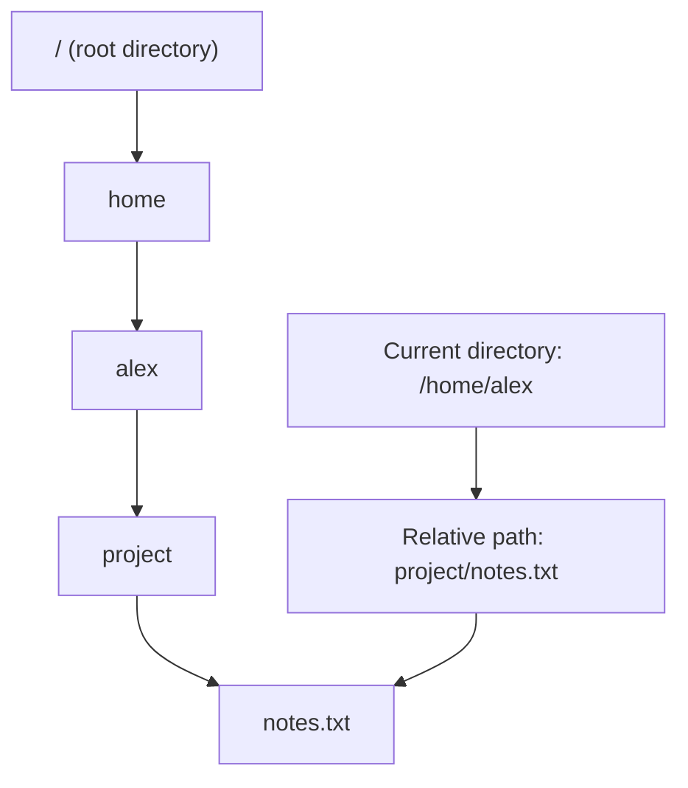
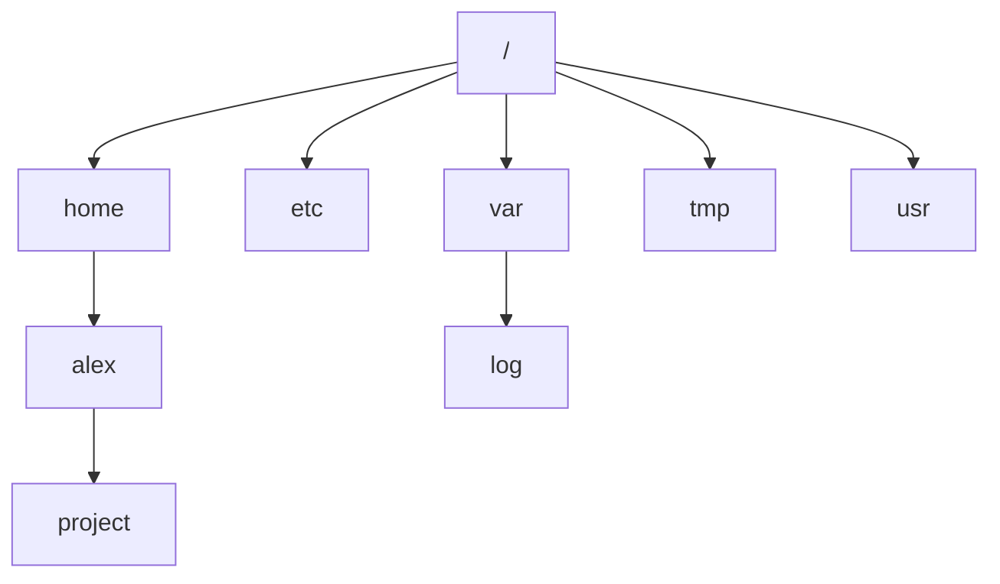
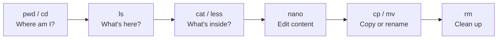

###### Topics

Working with the Linux Shell

- Navigating the file system with relative and absolute paths
- Displaying directory contents and files with ls, cat, and less

Handling Files and Directories

- Creating and managing files and directories using mkdir, cp, mv, and rm
- Understanding the basic structure of the Linux file system

Text Editing on the Command Line

- Opening, editing, and saving files with nano
- Simple navigation and search within a file

Practical Exercises

- Applying what you've learned to simple everyday tasks
- Recognizing and fixing common command mistakes

<br><br><br>
# 🐧 Working with the Linux Shell

The Linux shell is the text-based workspace of a Linux system. Instead of clicking on icons and windows, you enter commands. This may seem plain at first, but it's extremely powerful: you can quickly view, move, rename, edit files, and make entire workflows easily reproducible.

It's important to know that the shell almost always operates **in the current directory**. Many commands therefore refer to **where you currently are in the file system**. That's why understanding paths, navigation, and the structure of the file system is absolutely fundamental.

<br><br><br>
## 📍 Navigating the File System with Relative and Absolute Paths

A **path** describes the location of a file or directory within the file system. There are two fundamental types:

- **absolute paths**
- **relative paths**

An **absolute path** always starts at the root of the file system, i.e., `/`. It uniquely identifies a location, no matter what directory you're currently in.

Example:

```bash
/home/alex/project/notes.txt
```

This means: start at `/`, go to `home`, then `alex`, then `project`, then to the file `notes.txt`.

A **relative path** does **not** start with `/`, but is interpreted from the current directory. If you are currently in `/home/alex`, then this relative path:

```bash
project/notes.txt
```

points to the same file as the absolute path above.

<br><br><br>
### 🧭 Understanding the Current Directory

The shell always works in a so-called **current working directory**. To display it, you usually use `pwd`. `pwd` prints out the full path of the current directory ([pwd invocation](https://www.gnu.org/software/coreutils/manual/html_node/pwd-invocation.html)).

```bash
pwd
```

Example output:

```bash
/home/alex
```

If you use a relative path now, it refers to exactly this directory.

<br><br><br>
### 🪜 Important Elements of Relative Paths

You will frequently encounter these notations in the shell:

| Notation | Meaning |
|---|---|
| `.` | the current directory |
| `..` | the parent directory |
| `~` | your home directory |

The tilde `~` is usually expanded by the shell to the user’s home directory ([Bash Reference Manual – Tilde Expansion](https://www.gnu.org/software/bash/manual/bash.html#Tilde-Expansion)).

Examples:

```bash
cd .
```

You stay in the current directory.

```bash
cd ..
```

You move up one level.

```bash
cd ~
```

You change to your home directory.

```bash
cd ~/project
```

You go to the folder `project` within your home directory.

`cd` is the command for changing directories; in Bash, `cd` is a built-in shell command ([Bash Reference Manual – Bourne Shell Builtins](https://www.gnu.org/software/bash/manual/bash.html#Bourne-Shell-Builtins)).

<br><br><br>
### 🌳 How to Imagine Absolute and Relative Paths



The absolute path always starts at `/` at the top. The relative path starts wherever you currently are.

<br><br><br>
### 🧠 Typical Approach to Navigation

Whenever you work with paths, always ask yourself:

**“From where is this path being interpreted?”**

- Starts with `/` → absolute path
- Does not start with `/` → relative to current directory
- Starts with `~` → relative to your home directory

This mindset prevents many beginner mistakes.

<br><br><br>
## 👀 Displaying Directory Contents and Files with `ls`, `cat`, and `less`

These three commands are among the most important tools in the shell.

<br><br><br>
### 📂 `ls` – Display Directory Contents

`ls` lists files and directories ([ls invocation](https://www.gnu.org/software/coreutils/manual/html_node/ls-invocation.html)).

```bash
ls
```

This shows the content of the current directory.

You can also specify another directory:

```bash
ls /home/alex
```

Very useful options are:

```bash
ls -l
```

The output shows more details, such as file permissions, owner, size, and modification date.

```bash
ls -a
```

This also shows **hidden files**. In Linux files are considered hidden when their name starts with a dot, e.g., `.bashrc`.

```bash
ls -la
```

This is a very common combination: detailed list including hidden files.

#### What You Can Learn from `ls -l`

A typical line might look like this:

```bash
-rw-r--r-- 1 alex alex 2450 Mar 24 10:15 notes.txt
```

This roughly means:

| Part | Meaning |
|---|---|
| `-` | It's a file |
| `rw-r--r--` | Permissions |
| `alex alex` | Owner and group |
| `2450` | Size in bytes |
| `Mar 24 10:15` | Modification time |
| `notes.txt` | File name |

To start with, it's enough to know: `ls -l` shows you **more than just names**.

<br><br><br>
### 📄 `cat` – Display File Contents Directly

`cat` reads files and prints their contents to the console ([cat invocation](https://www.gnu.org/software/coreutils/manual/html_node/cat-invocation.html)).

```bash
cat notes.txt
```

This is handy for **short text files**.

If the file is very long, however, the content will just stream through the terminal. In that case, `cat` quickly becomes unwieldy.

What `cat` is good for:

- quickly viewing small configuration files
- display multiple files in sequence
- integrating content into simple shell workflows

Example:

```bash
cat file1.txt file2.txt
```

The contents are output one after another.

Important: `cat` is not a comfortable reader for long files. `less` is better for that.

<br><br><br>
### 📖 `less` – Read Long Files Page by Page

`less` is a **pager**. It displays text files page by page and allows navigation and search within the display ([less(1) — Linux manual page](https://man7.org/linux/man-pages/man1/less.1.html)).

```bash
less notes.txt
```

Now you can move through the file, instead of everything being dumped to the terminal at once.

Important keys in `less`:

| Key | Function |
|---|---|
| `Down Arrow` | Move down one line |
| `Up Arrow` | Move up one line |
| `Spacebar` | Move forward one page |
| `b` | Move back one page |
| `/keyword` | Forward search |
| `n` | Find next match |
| `q` | Quit `less` |

`less` is much more pleasant than `cat` for logs, configuration files, and longer text files.

<br><br><br>
### 🔍 When to Use `ls`, `cat`, and `less`

| Command | Intended Purpose | Typical Use |
|---|---|---|
| `ls` | Display directory contents | "What's here?" |
| `cat` | Display short files directly | "Show me the content quickly." |
| `less` | Comfortably read long files | "I want to read, scroll, and search." |

A typical workflow in practice is:

```bash
ls
less config.txt
cat short_note.txt
```

It may seem simple, but this is exactly the sort of routine that leads to clean work in the shell.

<br><br><br>
# 📁 Handling Files and Directories

When working in the shell, you manage files not with your mouse but with commands. This may sound more technical at first, but it's often clearer and more controlled.

<br><br><br>
## 🏗️ Creating and Managing Files and Directories with `mkdir`, `cp`, `mv`, and `rm`

<br><br><br>
### 🧱 `mkdir` – Creating Directories

`mkdir` creates directories ([mkdir invocation](https://www.gnu.org/software/coreutils/manual/html_node/mkdir-invocation.html)).

```bash
mkdir project
```

This creates a new folder named `project` in the current directory.

If you want to create several levels at once, `-p` is very useful:

```bash
mkdir -p project/notes/2026
```

With `-p`, missing intermediate directories are automatically created ([mkdir invocation](https://www.gnu.org/software/coreutils/manual/html_node/mkdir-invocation.html)).

Without `-p`, you'd get an error if `project/notes` doesn't already exist.

<br><br><br>
### 📋 `cp` – Copying Files and Directories

`cp` copies files and, with the appropriate option, directories as well ([cp invocation](https://www.gnu.org/software/coreutils/manual/html_node/cp-invocation.html)).

To copy a file:

```bash
cp notes.txt backup.txt
```

Now both files exist.

To copy a file into another directory:

```bash
cp notes.txt project/
```

To copy an entire directory recursively, use `-r`:

```bash
cp -r project project_backup
```

This is important: Without the recursive option, `cp` will not fully copy directories.

`cp` does not alter the original file. It creates a copy.

<br><br><br>
### 🚚 `mv` – Moving or Renaming Files

`mv` moves files and directories or renames them ([mv invocation](https://www.gnu.org/software/coreutils/manual/html_node/mv-invocation.html)).

To rename a file:

```bash
mv notes.txt ideas.txt
```

To move a file:

```bash
mv ideas.txt project/
```

Whether `mv` acts as **renaming** or **moving** depends on the target. Technically, it's the same command: the object gets a new path.

Moving a directory works the same way:

```bash
mv project archive/
```

If `archive/` exists, `project` is moved there.

<br><br><br>
### 🗑️ `rm` – Deleting Files and Directories

`rm` removes files; with the recursive option, it can also remove directories and their contents ([rm invocation](https://www.gnu.org/software/coreutils/manual/html_node/rm-invocation.html)).

To delete a file:

```bash
rm notes.txt
```

To delete a directory and its contents:

```bash
rm -r project
```

Very important: `rm` normally does **not move files to a trash can**, but removes them directly from the user's file system context ([rm invocation](https://www.gnu.org/software/coreutils/manual/html_node/rm-invocation.html)). Therefore, you should be especially careful with `rm`.

If you want a prompt before deleting, `-i` is helpful:

```bash
rm -i notes.txt
```

The system will ask before deleting.

<br><br><br>
### ⚠️ Why `rm -r` Can Be Dangerous

`rm -r` recursively deletes everything under a directory. If you mistype the path or include an unexpected space, you could remove much more than intended.

Example of clean operation:

1. first check your location with `pwd`
2. check what exists with `ls`
3. only then execute `rm`

This isn't just bureaucracy; it's good operating practice.

<br><br><br>
## 🗂️ Understanding the Basic Structure of the Linux File System

Linux organizes files in a **single directory structure** starting at `/`. Unlike Windows, which typically uses separate drive letters like `C:` or `D:`, everything hangs beneath the root `/`.

The standardized directory structure is described by the **Filesystem Hierarchy Standard** ([Filesystem Hierarchy Standard](https://refspecs.linuxfoundation.org/FHS_3.0/fhs/index.html)).

<br><br><br>
### 🌐 Overview of Important Directories

| Directory | Meaning |
|---|---|
| `/` | Root of the entire file system |
| `/home` | Users' home directories |
| `/root` | Administrator's (`root`) home directory |
| `/etc` | System-wide configuration files |
| `/var` | Variable data, e.g., logs |
| `/tmp` | Temporary files |
| `/usr` | Programs, libraries, documentation |
| `/bin` | Essential programs |
| `/sbin` | Essential system programs |
| `/dev` | Device files |
| `/proc` | Information about kernel and processes |

Many of these directories are described in the FHS, for example `/etc` for host-specific system configuration and `/var` for variable data like logs or spool files ([Filesystem Hierarchy Standard](https://refspecs.linuxfoundation.org/FHS_3.0/fhs/index.html)).

<br><br><br>
### 🏠 Especially Important for Everyday Life: `/home`

For normal work, `/home` is the most important directory. That’s where users’ personal files reside.

Example:

```bash
/home/alex
```

Typically, you store here:

- Documents
- Projects
- Downloads
- Personal configuration files

This is the area you'll work in most often as a regular user.

<br><br><br>
### ⚙️ Why `/etc` and `/var` Matter

`/etc` usually contains configuration files for the system and installed services. If you later work with servers, networks, or development environments, you'll often check here ([Filesystem Hierarchy Standard](https://refspecs.linuxfoundation.org/FHS_3.0/fhs/index.html)).

`/var` contains data that changes constantly, e.g., log files. This is especially relevant for troubleshooting, as many programs place their logs here ([Filesystem Hierarchy Standard](https://refspecs.linuxfoundation.org/FHS_3.0/fhs/index.html)).

<br><br><br>
### 🧠 A Good Mental Map of the File System

At first, you don’t need to know every directory by heart. Much more important is this basic understanding:

- `/` is the starting point for everything
- under `/home` is your personal workspace
- under `/etc` is configuration
- under `/var` is often logs and ongoing data
- paths always describe a place in this tree structure

If you internalize this model, the shell becomes much more logical.



<br><br><br>
# ✍️ Text Editing on the Command Line

A great strength of the shell is that you can not only manage files, but also edit them directly. For beginners, `nano` is a very good editor because it's intentionally simple.

<br><br><br>
## 📝 Opening, Editing, and Saving Files with `nano`

`nano` is a terminal-based text editor. It can open, edit, and save files; commands are displayed at the bottom of the editor ([GNU nano](https://www.nano-editor.org/dist/latest/nano.html)).

Open a file:

```bash
nano notes.txt
```

If the file exists, it will be opened. If it does not exist, you can create it and save later.

When you start `nano`, you'll usually see a menu bar at the bottom with commands like:

- `^O` for Save
- `^X` for Exit
- `^W` for Search

The `^` symbol means **Ctrl**. So `^O` means: **Ctrl + O**.

<br><br><br>
### 💾 Saving in `nano`

After you make changes, save with:

```text
Ctrl + O
```

`nano` will usually ask for the file name. If the presented name is correct, just confirm with **Enter** ([GNU nano](https://www.nano-editor.org/dist/latest/nano.html)).

Exit:

```text
Ctrl + X
```

If there are unsaved changes, `nano` will ask if you want to save.

This is very reassuring for beginners because `nano` makes it quite clear what to do next.

<br><br><br>
### ✏️ Editing in `nano`

Editing is straightforward: move the cursor where you want and type. Deletion works as usual with Backspace or Delete.

`nano` is intentionally not as complex as `vim` or `emacs`. It is ideal for simple configuration files, notes, or small scripts.

<br><br><br>
## 🔎 Simple Navigation and Search Within a File

If a file gets longer, you need two things:

- moving within the text
- searching for specific content

`nano` can do both.

<br><br><br>
### 🧭 Navigation in `nano`

You can move through the text with the arrow keys. That’s sufficient for many cases.

Additionally, there are useful key combinations described in the `nano` documentation ([GNU nano](https://www.nano-editor.org/dist/latest/nano.html)):

| Key | Function |
|---|---|
| Arrow keys | Move cursor |
| `Ctrl + A` | To the beginning of the line |
| `Ctrl + E` | To the end of the line |
| `Ctrl + V` | Page down |
| `Ctrl + Y` | Page up |

To start with, you don’t need to memorize everything. Arrow keys plus save, exit, and search are enough initially.

<br><br><br>
### 🔍 Searching in `nano`

Start search:

```text
Ctrl + W
```

Then enter the search term and confirm with **Enter** ([GNU nano](https://www.nano-editor.org/dist/latest/nano.html)).

This is especially useful for:

- configuration files
- log snippets
- longer notes
- source code with many lines

If you work closer to the system later, you’ll often open a file and search for a keyword, instead of reading everything from top to bottom.

<br><br><br>
### 🪄 Typical Workflow with `nano`

A simple, very realistic sequence would be:

```bash
nano todo.txt
```

Then:

1. Enter text
2. Save with `Ctrl + O`
3. Confirm with Enter
4. Exit with `Ctrl + X`

Exactly these small routines are important because they build muscle memory. In the shell, habit is often more valuable than just rote memorization.

<br><br><br>
# 🧰 Applying What You've Learned to Simple Everyday Tasks

You also wanted a practical reference. Since you don’t want exercises, I’ll show you typical **everyday scenarios** where the commands above work together quite naturally.

<br><br><br>
## 🛠️ Typical Everyday Workflows in the Shell

Suppose you want to create a small work directory, create a file, read it, rename it, and clean up later.

A realistic sequence would be:

```bash
mkdir project
cd project
nano notes.txt
ls
cat notes.txt
mv notes.txt ideas.txt
cp ideas.txt backup.txt
less ideas.txt
rm backup.txt
```

What happens here:

- `mkdir project` creates your working folder
- `cd project` moves into it
- `nano notes.txt` creates or opens a text file
- `ls` shows what is in the directory
- `cat notes.txt` displays the content directly
- `mv` renames the file
- `cp` creates a backup
- `less` displays longer content comfortably
- `rm` removes the backup again

This shows: shell work is often not about a single "magic" command, but about **small, clear steps** that build logically upon each other.

<br><br><br>
### 🧠 Learning Properly: Not Just Memorizing Commands, but Recognizing Patterns

Especially with Core Tech Fundamentals, it makes sense not only to memorize commands, but to understand the underlying pattern:

- **Where am I right now?** → `pwd`
- **What’s here?** → `ls`
- **How do I get somewhere else?** → `cd`
- **How do I view contents?** → `cat`, `less`
- **How do I change the structure?** → `mkdir`, `cp`, `mv`, `rm`
- **How do I edit text?** → `nano`

If you internalize these questions, you'll use commands much more confidently.

<br><br><br>
## 🚨 Recognizing and Fixing Common Command Mistakes

Making mistakes in the shell is normal. The important thing is to learn to **read error messages as clues**, not as defeat.

<br><br><br>
### ❌ Common Error Patterns

| Error Message or Problem | Typical Cause | What You Should Check |
|---|---|---|
| `No such file or directory` | Path misspelled or wrong current directory | Check `pwd`, `ls`, spelling |
| `Permission denied` | Insufficient permissions | Are you in the right directory? Do you have access rights? |
| `Is a directory` | File command applied to a directory | Check whether the target is a file or folder |
| `Not a directory` | Part of the path is not a directory | Check the path step by step |
| `rm: cannot remove ...` | File does not exist or lack of permissions | Check name, path, and permissions |
| `cp: -r not specified` | Trying to copy a directory without recursive option | Use `cp -r` |

Many GNU utilities document their behavior clearly in the manuals, e.g., that `cp` must be recursive for directories ([cp invocation](https://www.gnu.org/software/coreutils/manual/html_node/cp-invocation.html)) and `rm` needs recursive options for removing directories ([rm invocation](https://www.gnu.org/software/coreutils/manual/html_node/rm-invocation.html)).

<br><br><br>
### 🔬 The Most Common Beginner Mistake: Working in the Wrong Directory

This really is the classic. You think you’re working in `~/project` but are actually still in `~` or already in some other folder.

That’s why this mini routine is so valuable:

```bash
pwd
ls
```

Check first, then act.

When a command "doesn't work," very often the issue isn't with the command itself, but that the path doesn't match your current directory.

<br><br><br>
### 🔠 The Second-Most Common Mistake: Typos and Case Sensitivity

Linux distinguishes between uppercase and lowercase. `File.txt` and `file.txt` are two different names.

So if you type:

```bash
cat File.txt
```

but the file is actually named `file.txt`, you'll get an error.

That's why `ls` is so useful: it shows you the true names.

<br><br><br>
### 🧨 The Most Dangerous Mistake: Deleting Too Quickly

A command like:

```bash
rm -r something
```

should never be run "blindly." Always check first:

```bash
pwd
ls
```

and make sure which path is meant.

If you’re unsure, use explicit paths, e.g.:

```bash
rm -r ~/project/testdata
```

That's often safer than a relative path if you don’t know exactly where you are.

<br><br><br>
### 🩹 How to Systematically Troubleshoot Errors

If a command doesn't work, go through this sequence:

1. **Read the error message carefully**
2. **Check current directory** with `pwd`
3. **Check contents** using `ls`
4. **Check the path character by character**
5. **Check whether you mean a file or a directory**
6. **For long files, use `less` instead of `cat`**
7. **Before changing files, make a backup** with `cp`

This is exactly the kind of calm, methodical thinking that counts as a foundation.

<br><br><br>
## 🔄 Interaction of the Most Important Commands

Finally, here's a compact visual view of the typical workflow when working in the shell:



This order is not mandatory, but it shows the basic pattern very well: **orient, view, edit, organize, clean up**.