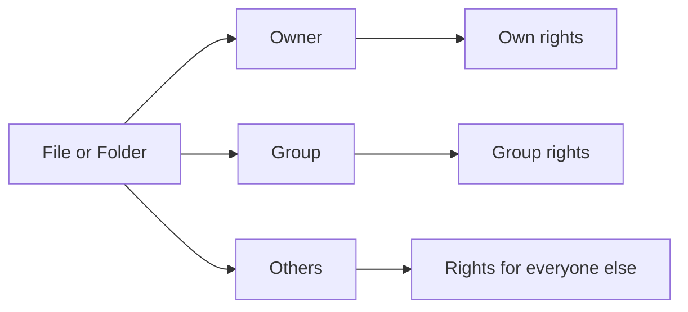

###### Topics

File permissions in Linux

- Understand the basic principle of owner, group, and others
- Categorize read, write, and execute permissions
- Display permissions with ls -l and simply adjust them with chmod

Software management under Linux

- Install and remove programs using package management
- Update software packages
- Understand the significance of package sources and updates in daily use

Safe and efficient working

- Important terminal rules for safe operation
- Useful keyboard shortcuts and simple routines for everyday Linux use

<br><br><br>
# 🔐 File Permissions in Linux

Linux doesn't just treat files and folders as “there” or “not there”—it assigns them permissions. These permissions determine **who** can **read**, **modify**, or **execute** something. This model is one of the main reasons Linux is so robust in multi-user environments. The basic principle comprises three roles: **owner**, **group**, and **others** ([Ubuntu Community Help Wiki: FilePermissions](https://help.ubuntu.com/community/FilePermissions)).

<br><br><br>
## 👤 Basic Principle: Owner, Group, and Others

Imagine a file as an object with a name tag. For each file, Linux stores **who** owns it and **which group** it belongs to. This results in three perspectives:

- **Owner**: the user who owns the file
- **Group**: a user group that can have specific permissions on the file
- **Others**: all other users on the system

So if you create a file, you’re usually its owner. At the same time, the file is assigned a group. All users who are neither owners nor members of this group fit into the “others” category ([Ubuntu Community Help Wiki: FilePermissions](https://help.ubuntu.com/community/FilePermissions)).

This is important because Linux can finely grade rights this way. For example, you can specify:

- Only you can do everything
- Your work group can read
- Everyone else can do nothing

This way, you get a clear, simple security model.



<br><br><br>
## 📖 Correctly Categorize Read, Write, and Execute Permissions

The three fundamental permissions are:

- **r = read**
- **w = write**
- **x = execute**

At first glance, this sounds simple. But in Linux, it’s important whether these permissions pertain to a **file** or to a **directory**. This is where beginners often get confused.

<br><br><br>
### 📄 Permissions on Regular Files

For a regular file, the permissions mean:

| Permission | Meaning |
|---|---|
| `r` | Read content |
| `w` | Change or overwrite content |
| `x` | Execute file as a program or script |

So if a text file has `r--` for you, you can read it, but not change it. If a script has `x`, it can be executed—as long as its contents allow it.

<br><br><br>
### 📁 Permissions on Directories

For directories, the meanings are different:

| Permission | Meaning for Directories |
|---|---|
| `r` | List filenames inside the directory |
| `w` | Create, delete, or rename entries |
| `x` | “Enter” the directory, i.e., access/traverse it |

The **x permission on directories** is especially important. Without `x`, you can’t effectively enter the folder, even if `r` is set. This is often described as “search” or “traverse” permission ([Ubuntu Community Help Wiki: FilePermissions](https://help.ubuntu.com/community/FilePermissions)).

A common misconception: “I have write access to the file, so I can delete it.” In Linux, deleting files within a folder depends mainly on the **directory’s permissions**, not just the file’s. This is a very important detail in practice.

<br><br><br>
### 🧠 How Linux Represents Permissions Internally

Permissions are stored in three blocks:

- **owner**
- **group**
- **others**

Each block can include or omit `r`, `w`, and `x`.

Example:

```text
rwxr-x---
```

Which means:

- `rwx` → owner can read, write, execute
- `r-x` → group can read and execute
- `---` → others can do nothing

A handy way to remember:

| Symbol | Value |
|---|---|
| `r` | 4 |
| `w` | 2 |
| `x` | 1 |

So permissions can also be written as numbers:

| Combination | Number |
|---|---|
| `---` | 0 |
| `--x` | 1 |
| `-w-` | 2 |
| `-wx` | 3 |
| `r--` | 4 |
| `r-x` | 5 |
| `rw-` | 6 |
| `rwx` | 7 |

For example:

- **`644`** → `rw-r--r--`
- **`755`** → `rwxr-xr-x`
- **`600`** → `rw-------`

This numeric notation is especially convenient for `chmod` ([GNU Coreutils: chmod invocation](https://www.gnu.org/software/coreutils/manual/html_node/chmod-invocation.html)).

<br><br><br>
## 🔎 Display Permissions with `ls -l`

With `ls -l`, Linux displays, among other things, the **file type**, **permissions**, **owner**, **group**, **size**, and **timestamp** ([GNU Coreutils: What information is listed](https://www.gnu.org/software/coreutils/manual/html_node/What-information-is-listed.html)).

An example:

```bash
ls -l
```

Possible output:

```text
-rwxr-x--- 1 anna dev 4096 Mar 24 14:10 script.sh
```

Which can be interpreted as:

| Part | Meaning |
|---|---|
| `-` | File type: regular file |
| `rwxr-x---` | Permissions |
| `1` | Number of hard links |
| `anna` | Owner |
| `dev` | Group |
| `4096` | Size |
| `Mar 24 14:10` | Modification time |
| `script.sh` | Filename |

For the first character, notably:

| Symbol | Meaning |
|---|---|
| `-` | Regular file |
| `d` | Directory |
| `l` | Symbolic link |

A directory might look like:

```text
drwxr-xr-x 2 anna dev 4096 Mar 24 14:20 projekt
```

Here the starting `d` indicates a directory.

If you just want a quick look at **who can do what**, `ls -l` is the standard tool. In daily use, this is the go-to diagnostic before changing permissions.

<br><br><br>
## 🛠️ Simply Adjust Permissions with `chmod`

With `chmod` you change permissions. This can be done in two ways:

- **Symbolic**: with letters like `u`, `g`, `o`, `+`, `-`, `=`
- **Numeric**: with numbers like `644` or `755`

Both are valid. For beginners, the symbolic method is often more understandable; the numeric method is often faster.

<br><br><br>
### ✍️ Symbolic Notation

The shortcuts mean:

| Abbreviation | Meaning |
|---|---|
| `u` | user / owner |
| `g` | group |
| `o` | others |
| `a` | all |
| `+` | add right |
| `-` | remove right |
| `=` | set rights exactly |

Examples:

```bash
chmod u+x script.sh
```

The owner gets execute permission.

```bash
chmod g-w datei.txt
```

The group loses write permission.

```bash
chmod o-r geheim.txt
```

Others can no longer read the file.

```bash
chmod a+r info.txt
```

Everyone can read.

```bash
chmod u=rw,go=r datei.txt
```

Owner can read and write, group and others can only read.

This symbolic form is very handy when you want to make targeted, small changes ([GNU Coreutils: chmod invocation](https://www.gnu.org/software/coreutils/manual/html_node/chmod-invocation.html)).

<br><br><br>
### 🔢 Numeric Notation

With the numeric form, you add up the values:

- `r = 4`
- `w = 2`
- `x = 1`

Examples:

```bash
chmod 644 datei.txt
```

Result: `rw-r--r--`

```bash
chmod 755 script.sh
```

Result: `rwxr-xr-x`

```bash
chmod 600 geheim.txt
```

Result: `rw-------`

This is very common in practice because typical values are quickly recognizable:

| Mode | Typical Usage |
|---|---|
| `644` | Regular file, generally readable |
| `600` | Private file |
| `755` | Script or directory, generally readable and accessible |
| `700` | Private directory or private script |

<br><br><br>
### ⚠️ Caution with Recursive Changes

With `chmod -R` you change permissions **recursively**—throughout a directory tree. This is powerful, but also dangerous:

```bash
chmod -R 755 projekt/
```

This gives many files and directories new permissions. It can work, but it can also grant excessive permissions. Especially problematic is when regular files unnecessarily get execute permission.

Therefore, the rule in daily practice: **check with `ls -l` first, then make targeted changes**. This is safer than, for example, just recursively setting everything to 777. The latter is almost never a good idea.

<br><br><br>
# 📦 Software Management under Linux

On Linux, programs are usually not installed by downloading a `.exe` from somewhere and double-clicking it. Instead, a **package manager** is used. It makes sure that programs are loaded from trusted sources, dependencies are installed, and updates are applied cleanly. This concept is a major advantage of Linux in daily operations ([Debian Wiki: AptCLI](https://wiki.debian.org/AptCLI)).

<br><br><br>
## 🧰 Installing and Removing Programs with the Package Manager

A **package manager** is the tool with which your distribution manages software. Depending on your Linux system, it’s called something different:

| Distribution | Common Package Manager |
|---|---|
| Debian / Ubuntu | `apt` |
| Fedora / RHEL | `dnf` |
| Arch Linux | `pacman` |

The basic operations are similar: install, remove, upgrade.

For Debian and Ubuntu systems, typical commands:

```bash
sudo apt install package-name
```

Installs a package,

```bash
sudo apt remove package-name
```

Removes the package, often leaving configuration files behind,

and

```bash
sudo apt purge package-name
```

Also removes configuration files, as far as they are managed by the package ([Debian Wiki: AptCLI](https://wiki.debian.org/AptCLI)).

Examples:

```bash
sudo apt install curl
sudo apt remove curl
sudo apt purge curl
```

For Fedora or RHEL, it’s very similar:

```bash
sudo dnf install package-name
sudo dnf remove package-name
```

Note: The package manager handles not only the program itself but also **dependencies**. If a program needs other libraries or helper packages, these are handled as well. This makes software installation on Linux often cleaner and more reproducible than manually downloading files.


<br><br><br>
## 🔄 Updating Software Packages

Here’s an important difference that many confuse at first:

```bash
sudo apt update
```

does **not** actually update packages. This command only updates the **package lists**—the information about which versions are available in the package sources ([Debian Wiki: AptCLI](https://wiki.debian.org/AptCLI)).

Only after that, for example:

```bash
sudo apt upgrade
```

Installed packages are upgraded to newer available versions, as long as this can be done without problematic removals or major changes ([Debian Wiki: AptCLI](https://wiki.debian.org/AptCLI)).

A typical workflow:

```bash
sudo apt update
sudo apt upgrade
```

Think of it as:

- **`apt update`** → “What new versions are available?”
- **`apt upgrade`** → “Install those new versions.”

In some situations you may also see:

```bash
sudo apt full-upgrade
```

This command can, if necessary, also remove packages or make additional changes to dependencies to allow for a complete upgrade ([Debian Wiki: AptCLI](https://wiki.debian.org/AptCLI)).

In everyday use, updates are important not only for new features, but especially for:

- Closing security loopholes
- Fixing bugs
- Improving stability
- Maintaining compatibility

Especially on systems connected to the Internet, regular updates aren’t optional, but an essential part of good hygiene.

<br><br><br>
## 🌐 Understanding the Significance of Package Sources and Updates

A **package source** or **repository** is where your package manager gets its information and software. With APT, these sources are defined in files like `sources.list` and in the `sources.list.d` directory ([sources.list(5)](https://manpages.debian.org/bookworm/apt/sources.list.5.en.html)).

Practically, this means: your system doesn’t just “know” on its own where to get software. It relies on registered sources.

This has several consequences in daily use:

1. **Official sources are usually the safest.**  
   They’re tailored for the distribution and maintained.

2. **Third-party sources expand the selection but increase risk.**  
   They may deliver newer software, but can also bring conflicts, incompatible versions, or trust issues.

3. **Updates come via these sources.**  
   If a source is outdated, deactivated, or unsafe, problems can arise.

APT uses a security model with signed repository metadata, so the origin of package information can be verified ([apt-secure(8)](https://manpages.debian.org/bookworm/apt/apt-secure.8.en.html)). Therefore, in daily practice it’s sensible to stick to trusted sources.

A typical practical understanding is:

- **Repositories** are the “stores”
- **Package lists** are the current catalogue
- **Packages** are the actual programs
- **`apt update`** fetches the new catalogue
- **`apt upgrade`** effectively “buys” the newer available versions

If you understand this, software management under Linux becomes very logical.

<br><br><br>
# 🛡️ Safe and Efficient Working

Linux is very convenient in the terminal, but it’s also easy to mess things up quickly if you’re careless. The good news is: With a few clear rules and some shortcuts, you’ll not only be safer but also much faster.

<br><br><br>
## ⚠️ Important Terminal Rules for Safe Operation

One of the most important rules: **Understand a command before you run it.** It sounds trivial, but it’s crucial at the terminal. A mistaken command often has an immediate impact.

<br><br><br>
### 📍 Rule 1: Always Know Where You Are

Before deleting files, moving them, or changing permissions, check your current directory:

```bash
pwd
ls
ls -l
```

`pwd` shows your current working directory. `ls` and `ls -l` show what you’re working with. This small habit prevents many errors.

Beginners often confuse:

- Their own home directory
- A project directory
- System paths like `/etc`, `/usr`, `/var`

A command in the wrong directory can have completely different consequences than intended.

<br><br><br>
### 🔑 Rule 2: Use `sudo` Deliberately

`sudo` runs commands with elevated privileges, typically as administrator. For that reason, you shouldn’t automatically stick `sudo` in front of everything. If a command fails without `sudo`, the right question isn’t always, “How do I run it as root?” but rather: **Should I even be doing this?**

Many beginners pick up a dangerous habit:

```bash
sudo something
```

just because it doesn’t work otherwise. Better:

- First understand what the command does
- Then check if admin rights are really required
- Only then run with `sudo`

This protects against accidental system changes.

<br><br><br>
### 🗑️ Rule 3: Be Extra Careful with `rm`

`rm` deletes files. Unlike graphical interfaces, there’s usually no recycle bin. The GNU documentation describes `rm` as a tool for removing files (and optionally directories); with options like `-r` and `-f` it’s very powerful ([GNU Coreutils: rm invocation](https://www.gnu.org/software/coreutils/manual/html_node/rm-invocation.html)).

Especially risky combinations:

```bash
rm -r folder/
rm -f file
rm -rf something
```

Even riskier with wildcards:

```bash
rm *.log
```

This can be useful, but only if you **know exactly what files `*` currently matches**.

A good routine is:

```bash
ls *.log
rm *.log
```

So first see what would be affected, then delete.

<br><br><br>
### ✨ Rule 4: Take Wildcards and Spaces Seriously

The shell treats characters like `*`, `?`, and spaces specially. So, handle filenames with spaces correctly, for example with quotes:

```bash
cat "my document.txt"
```

or use tab completion. That's safer and more convenient.

A common beginner mistake:

```bash
rm my document.txt
```

The shell interprets this as two separate arguments. With quotes or escaping, you avoid such issues.

<br><br><br>
### 📚 Rule 5: Use Help Instead of Guessing

Almost every important command comes with help:

```bash
man ls
man chmod
ls --help
chmod --help
```

This isn’t a side issue. Especially at the terminal, being able to look up help yourself is a core skill.

If you're unsure about an option, checking the help is almost always better than trial and error.

<br><br><br>
### 📝 Rule 6: Use Redirection Carefully

A single `>` overwrites a file, while `>>` appends to a file. The difference is small but hugely important in practice.

Example:

```bash
echo "new" > file.txt
```

overwrites the old content.

```bash
echo "more" >> file.txt
```

appends.

Especially for logs, configuration snippets, or script output, you should be sure about the behavior you want.

<br><br><br>
### 🌍 Rule 7: Don’t Blindly Copy-Paste Internet Commands

A terminal command from a blog, forum, or video can be useful—or dangerous. One-liners that directly run scripts from the internet are especially critical.

The golden rule: **read first, understand, then run**. If you can't roughly explain what a command does, don’t run it uncritically.

<br><br><br>
## ⌨️ Useful Keyboard Shortcuts for Linux Daily Work

Many shortcuts in the terminal are based on GNU Readline functions, used in Bash for input and editing ([GNU Bash Manual: Commands For Moving](https://www.gnu.org/software/bash/manual/html_node/Commands-For-Moving.html), [GNU Bash Manual: Commands For Killing](https://www.gnu.org/software/bash/manual/html_node/Commands-For-Killing.html)).

These shortcuts save time every day.

| Shortcut | Effect |
|---|---|
| `Tab` | Auto-completion |
| `↑` / `↓` | Browse command history |
| `Ctrl + R` | Search backward in history |
| `Ctrl + C` | Abort running command |
| `Ctrl + D` | End input / often exit shell |
| `Ctrl + L` | Clear screen |
| `Ctrl + A` | Go to line start |
| `Ctrl + E` | Go to line end |
| `Ctrl + U` | Delete from cursor to line start |
| `Ctrl + K` | Delete from cursor to line end |

<br><br><br>
### 🔎 Really Understand the Most Important Shortcuts

**`Tab`** is one of the most useful helpers ever. Instead of typing out long paths or filenames, type just the beginning and complete with `Tab`. Saves time and avoids typos.

**`Ctrl + R`** is gold when you need to reuse a previous command. Instead of walking through 100 old commands with arrow keys, you just type part of the command.

**`Ctrl + C`** usually ends a running foreground process. Important if a command hangs, takes too long, or you started it by mistake.

**`Ctrl + A`** and **`Ctrl + E`** are very practical when editing long commands. Instead of moving the cursor endlessly with arrows, just jump to start or end.

**`Ctrl + U`** and **`Ctrl + K`** help with fast editing. Especially when you want to fix a long line, they're much faster than lots of backspaces.

If you use these shortcuts regularly, terminal work will suddenly feel much smoother.

<br><br><br>
## 🧭 Simple Work Routines for Everyday Linux Use

Efficiency isn’t just about commands, but about habits. Good routines make you safer and faster.

<br><br><br>
### 📂 Routine 1: Always Check Before You Change

Before making changes:

```bash
pwd
ls
ls -l
```

These three commands take only seconds but prevent many mistakes. A great standard routine.

<br><br><br>
### 🧪 Routine 2: Display Before Doing Destructive Actions

Before deleting or moving with wildcards, first display the selection:

```bash
ls *.tmp
rm *.tmp
```

or:

```bash
ls project/*.log
mv project/*.log archive/
```

This way you check whether your pattern matches the right files.

<br><br><br>
### 🏷️ Routine 3: Use Clear Filenames

Filenames without unnecessary spaces and special characters are easier in the terminal. Instead of

```text
My new document final really final.txt
```

it’s often more practical:

```text
my-new-document-final.txt
```

Not a must, but usually more pleasant.

<br><br><br>
### 🔄 Routine 4: Regularly Update the System

If you use Linux productively, don’t postpone updates for months. Regular updates keep system and programs more secure and stable. Especially browsers, network applications, and core packages benefit.

A simple routine on Debian/Ubuntu:

```bash
sudo apt update
sudo apt upgrade
```

Not daily by force, but regularly and deliberately.

<br><br><br>
### 🧠 Routine 5: Reuse Commands Instead of Retyping

Use history and search:

- Arrow keys to recall last commands
- `Ctrl + R` for older commands
- `Tab` for names and paths

This saves time and reduces typos. Many advanced Linux users are fast because they type less, not because they know more commands.

<br><br><br>
### 🛑 Routine 6: Treat Root Privileges as an Exception

Work as a regular user as much as possible and use `sudo` only for specific administrative tasks. That’s a simple but highly effective security routine. Many errors are less damaging if they happen without admin rights.

Practical tip: In many shell prompts, root is indicated by `#` instead of `$`. Not an absolute rule, but a common signal to be more alert.

<br><br><br>
### 📁 Routine 7: Keep Your Home Directory Organized

Set up clear working folders, for example:

```text
~/projects
~/downloads
~/scripts
~/notes
```

It sounds trivial, but it helps enormously. When files are well organized, you work faster, rarely delete the wrong thing, and can spot permission problems more easily.