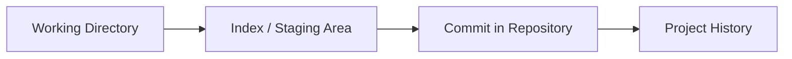
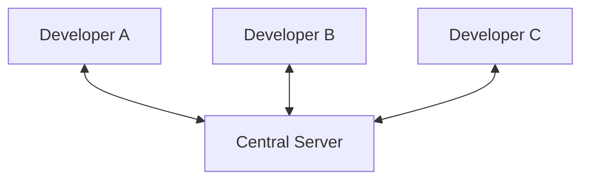
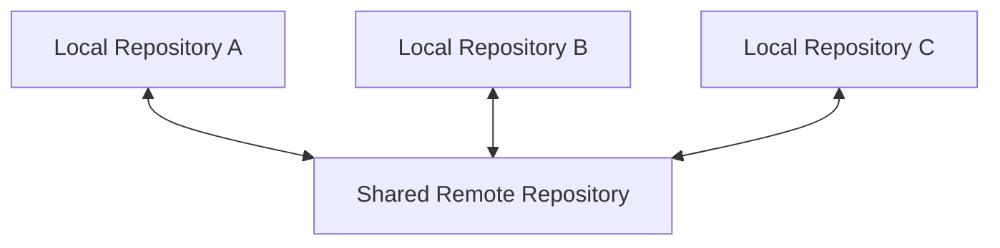

###### Topics

Fundamentals of Version Control

- Principles of version control systems
- Difference between centralized and distributed version control
- Benefits of version control in everyday work

Git Installation and Setup

- Installing Git
- Basic Git configuration with user.name and user.email

Getting Started with Git

- Initializing a new Git repository
- Using Git help and basic self-help options

<br><br><br>

# 📚 Fundamentals of Version Control

Version control basically means: you don't just save the current state of your files, but also their **evolution over time**. Instead of naming files like `project_final`, `project_final_new`, `project_final_really_final`, a version control system manages changes in a neat, traceable, and structured way. That's exactly what systems like Git are for. The core idea behind version control is described very well in the official Git introduction: changes should remain historically traceable, previous states should be restorable, and collaboration should be possible in a controlled manner ([Getting Started - About Version Control](https://git-scm.com/book/en/v2/Getting-Started-About-Version-Control)).

A version control system is therefore not just a storage place for files. It's more like a **time log** for a project. You can see:

- **what** was changed,
- **when** it was changed,
- **by whom** it was changed,
- and often also **why**, if meaningful commit messages were written.

In practice, this is extremely important because software development rarely follows a straight path. You try something, discard an idea, improve an approach, or fix a bug. Without version control, such a process quickly becomes chaotic. With version control, it remains orderly.

<br><br><br>

## 🧠 Principles of Version Control Systems

To truly understand version control, it's worth looking at the most important core principles.

<br><br><br>

### 🗂️ 1. A project gets a traceable history

The heart of a version control system is the **history**. Every time you save a meaningful state, a new entry in this history is created. In Git, such a saved state is called a **commit**.

A commit is not just "file saved." A commit typically contains:

- the state of the files at that moment,
- metadata like author, email, and timestamp,
- a commit message,
- a reference to previous commits.

This creates a chain of states. You can always look back and understand how the project reached its present state.

<br><br><br>

### 📸 2. Git thinks in snapshots, not just in individual file differences

An important technical point: Git conceptually treats data as **snapshots**. That is: with a commit, Git doesn't just remember "line 7 was changed," but stores the state of the tracked files as if you were taking a snapshot of the project. The Git documentation explicitly explains that Git thinks in snapshots rather than classic line-based deltas ([Getting Started - What is Git?](https://git-scm.com/book/en/v2/Getting-Started-What-is-Git%3F)).

This is important, because many beginners believe that Git only saves "change lists." Practically, you can of course compare changes, but Git’s internal model is closer to a set of snapshots.

This also helps in understanding branches, merges, and restores: Git does not work with loose file copies, but with linked states of your project.

<br><br><br>

### 🧪 3. Changes are consciously committed

A good version control system does not automatically store every random intermediate step as the official project state. Instead, **you** decide when a state is important enough to be recorded.

In Git, this often follows this mental model:



This means:

- In the **working directory**, you edit files as usual.
- In the **staging area**, you selectively gather the changes for the next commit.
- A **commit** creates a fixed point in the history from these.

This conscious commitment is didactically important: it forces you to structure your work steps meaningfully. Good commits make projects more understandable.

<br><br><br>

### 🔍 4. Changes remain comparable

Version control is not just an archive but also a **comparison tool**. You can look at:

- which lines have changed,
- which files have been added or removed,
- how two versions differ from each other.

This comparability is extremely valuable in practice. If an error suddenly appears, you can specifically check **when** it arose and **which change** likely caused it.

<br><br><br>

### 🌿 5. Parallel work becomes possible

Another core principle of modern version control systems is that you **do not always have to work directly on the same main version**. Git is especially strong at managing parallel development branches. These are called **branches**.

A branch, simply put, is an alternative development line. You can safely work on a feature there without immediately changing the stable main state. Later, this work is merged back.

Even if you don't need branching in detail yet, it’s part of the principles of version control: **Changes should be tryable in isolation and then integrable later on.**

<br><br><br>

### 🛡️ 6. Integrity and traceability are central goals

Git was built so that data remains very reliably traceable. Contents are internally identified by checksums. This ensures that Git recognizes changes uniquely and manipulations or corruptions are more easily detected. The Git introduction explicitly highlights this integrity ([Getting Started - What is Git?](https://git-scm.com/book/en/v2/Getting-Started-What-is-Git%3F)).

For you as a learner, this means above all: Git is not only convenient, but also technically designed to manage project states cleanly and consistently.

<br><br><br>

## ⚖️ Difference Between Centralized and Distributed Version Control

There are two major conceptual models in version control systems: **centralized** and **distributed**.

<br><br><br>

### 🏢 Centralized Version Control

In **centralized version control**, there is typically **one central server** where the official project history is kept. Developers work with working copies and constantly communicate with this server. Classic examples include Subversion (SVN) or older systems like CVS. The basic model is described in the Git introduction as the opposite of distributed systems ([Getting Started - About Version Control](https://git-scm.com/book/en/v2/Getting-Started-About-Version-Control)).

The principle looks roughly like this:



The advantages:

- There is a clear “central truth.”
- Management and permissions are often straightforward.
- The model is conceptually easy to understand.

Disadvantages:

- If the server fails, collaboration becomes difficult or impossible.
- Many operations depend on the connection to the server.
- The local working copy often does not contain the complete project history.
- The system is less flexible for modern distributed workflows.

<br><br><br>

### 🌍 Distributed Version Control

In **distributed version control**, each developer locally has a **full copy of the repository including history**. Git is the most well-known example of this. The Git documentation describes exactly this difference: in distributed systems, you don't just get a working copy, but a full local clone of the project ([Getting Started - About Version Control](https://git-scm.com/book/en/v2/Getting-Started-About-Version-Control)).

The model looks more like this:



Important: Even with Git, teams often use a shared remote repository, such as on GitHub, GitLab, or Bitbucket. **But technically, this remote is not the only complete source.** Every clone already contains a complete history.

Advantages:

- Many actions work locally and are very fast.
- You can continue working offline.
- Every clone is an additional backup of the history.
- Branching and merging are very powerful.
- Flexible team workflows become possible.

Disadvantages:

- The model is conceptually a bit more challenging at first.
- Terms like local, remote, push, pull, fetch, or merge must be understood clearly.
- Without a clear team process, things can get organizationally confusing.

<br><br><br>

### 📋 Direct Comparison in a Table

| Aspect | Centralized | Distributed |
|---|---|---|
| Project History | Mainly on the central server | Fully available locally |
| Working without Network | Highly limited | Easily possible |
| Speed of Many Commands | Often server-dependent | Often very fast locally |
| Server Outage | Critical bottleneck | Less critical for local work |
| Typical Systems | SVN, CVS | Git, Mercurial |
| Branching and Merging | Often more cumbersome | Usually strongly supported |

The key takeaway: **Git is distributed**. This shapes almost everything you do with Git.

<br><br><br>

## 💼 Benefits of Version Control in Everyday Work

In everyday work, version control isn’t just "nice to have," but a foundational tool in almost every professional technical environment.

<br><br><br>

### 🧯 Undoing Mistakes

Perhaps the most immediately tangible benefit: you can trace and very often undo errors cleanly. If a change breaks something, you don’t need to panic or search through old ZIP files. Instead, you look at the history and find out which state previously worked.

This greatly changes how you work. People work more confidently and structured when they know their work is traceable.

<br><br><br>

### 👥 Collaboration Without Overwriting Each Other

When multiple people work on the same files, things quickly become chaotic without version control. One person overwrites another's changes, changes are lost, or no one knows which file is actually "the right one."

Version control solves this problem by merging changes, making conflicts visible, and creating a shared history. This is exactly why version control is a core component of professional software development.

<br><br><br>

### 🧾 Documentation Through Project History

A good repository is also a form of technical documentation. If commits are appropriately named, you can later trace:

- when a feature was introduced,
- when a bug was fixed,
- why a particular technical decision was made.

This is especially valuable when looking back on a project after weeks or months. This happens constantly in real teams.

<br><br><br>

### 🔄 Safe Experimentation

With version control, you can try new ideas without immediately jeopardizing the stable state of the project. This is both didactically and practically important: good developers rarely work just linearly. They try out ideas, compare approaches, and discard things.

Version control makes this experimentation manageable.

<br><br><br>

### 🧠 Learning and Thinking More Cleanly

Especially in the learning context, Git is more than a tool. It supports an important way of thinking:

- Breaking down work into traceable steps
- Purposefully grouping changes
- Documenting decisions
- Analyzing your own mistakes instead of hiding them

By doing so, you learn not only Git, but also a clean technical way of working. And that’s especially valuable in the context of **Core Tech Fundamentals**.

<br><br><br>

### 🧰 Version Control is Useful for More than Just Source Code

Although Git is mainly associated with source code, version control can also be very useful for other text-based content:

- Configuration files
- Infrastructure definitions
- Documentation
- Scripts
- Markdown notes

As soon as content evolves and needs to remain traceable, version control makes sense.

<br><br><br>

# 🛠️ Git Installation and Setup

Before you start working with Git, you need two things:

1. Git must be installed on your system.
2. Git should be set up so that your commits correctly carry your name and email address.

The official installation instructions are provided on the Git website and in the Pro Git Book ([Downloads - Git](https://git-scm.com/downloads), [Getting Started - Installing Git](https://git-scm.com/book/en/v2/Getting-Started-Installing-Git)).

<br><br><br>

## 💻 Installing Git

The installation depends on your operating system. The principle, however, is always the same: install Git and then check if the `git` command is available.

<br><br><br>

### 🪟 Installing Git on Windows

On Windows, the most common way is the official installer for **Git for Windows** from the Git download page ([Downloads - Git](https://git-scm.com/downloads)).

Typical steps:

- Download installer
- Run setup
- Usually keep default options
- Then open terminal or Git Bash
- Check installation:

```bash
git --version
```

If Git is correctly installed, you'll get output such as:

```bash
git version 2.x.x
```

On Windows, **Git Bash** is often included as well. This is useful because many Git tutorials use shell commands that can be used directly there.

<br><br><br>

### 🍎 Installing Git on macOS

There are several common ways on macOS. Often used are:

- **Homebrew**
- **Xcode Command Line Tools**
- or the official Git source

With Homebrew, the command is typically:

```bash
brew install git
```

Afterwards, check again:

```bash
git --version
```

The official Git sources also mention these methods as typical installation options ([Getting Started - Installing Git](https://git-scm.com/book/en/v2/Getting-Started-Installing-Git)).

<br><br><br>

### 🐧 Installing Git on Linux

On Linux, Git is usually installed via the package manager of your distribution. Depending on your system, the commands differ. Examples:

**Debian/Ubuntu:**

```bash
sudo apt update
sudo apt install git
```

**Fedora:**

```bash
sudo dnf install git
```

**Arch Linux:**

```bash
sudo pacman -S git
```

Again, afterwards:

```bash
git --version
```

The Git documentation also recommends distribution-specific installation via the respective package manager ([Getting Started - Installing Git](https://git-scm.com/book/en/v2/Getting-Started-Installing-Git)).

<br><br><br>

### ✅ How to Check if Git is Working

If the command

```bash
git --version
```

returns a version number, Git is basically installed and executable.

If instead you get an error like "command not found", then usually one of these problems exists:

- Git is not installed yet
- installation is faulty
- Git is not in the `PATH`
- the terminal wasn’t restarted after installation

Especially at the beginning, this check is important, because many later issues are not proper Git problems, but installation or path problems.

<br><br><br>

## ⚙️ Basic Git Configuration with `user.name` and `user.email`

After installing, you should tell Git **who you are**. These details are included in your commits. Git stores the author and email for every commit. The official Git documentation describes this initial setup with `git config` as a fundamental first step ([Getting Started - First-Time Git Setup](https://git-scm.com/book/en/v2/Getting-Started-First-Time-Git-Setup)).

<br><br><br>

### 🧾 Why `user.name` and `user.email` Are Important

When you create a commit, Git saves metadata such as:

- author name
- author email address
- time
- commit message

Without correct information, commits may still be created, but your history will be unclean or incorrectly assigned. In team projects, this is especially problematic.

These settings are not just a formality. They are part of traceability.

<br><br><br>

### 🌍 Common Global Configuration

At first, you usually set your name and email **globally**, i.e., user-wide for all repositories on this computer:

```bash
git config --global user.name "Max Mustermann"
git config --global user.email "max@example.com"
```

`--global` means: these values are used by default in all your local Git projects.

When you make a commit, Git uses this identity, as long as nothing else is set in the respective repository.

<br><br><br>

### 🏷️ What “Global” Technically Means

Git has multiple configuration levels. The official documentation explains these levels as **system**, **global**, and **local** ([Getting Started - First-Time Git Setup](https://git-scm.com/book/en/v2/Getting-Started-First-Time-Git-Setup)).

| Level | Meaning |
|---|---|
| `--system` | Applies system-wide for all users on the machine |
| `--global` | Applies to your user account |
| `--local` | Applies only in a particular repository |

For starters, `--global` is almost always the right choice.

If you later need a different email for a particular project, you can override it locally:

```bash
git config user.email "different-address@example.com"
```

Without `--global`, the setting is only set in the current repository.

<br><br><br>

### 🔎 Checking Your Configuration

You can check if the values were set:

```bash
git config --global user.name
git config --global user.email
```

Or show multiple values at once:

```bash
git config --global --list
```

If you want to see which values are actually in effect in the current repository, this is also useful:

```bash
git config --list
```

This is an important little self-help technique: Before wondering why commits appear "signed incorrectly," first check your configuration.

<br><br><br>

### 🧠 Typical Beginner Mistake

Many believe that `user.name` and `user.email` are automatically related to a GitHub or GitLab login. That's not true. These values are primarily **commit metadata in Git itself**.

Platforms like GitHub can associate commits with your account if the email address used is known to the platform. But technically, Git stores this information independently of any online platform.

This is an important distinction: **Git is the version control system, GitHub is only a hosting service for Git repositories.**

<br><br><br>

# 🚀 Getting Started with Git

Once Git is installed and configured, you can create your first own repository and learn how to use Git’s built-in help functions.

<br><br><br>

## 📁 Initializing a New Git Repository

A **repository** is the place where Git manages the version history of a project. Initializing a new repository means: you tell Git that a particular folder should now be under version control. The official command for this is `git init` ([git-init Documentation](https://git-scm.com/docs/git-init)).

<br><br><br>

### 🏗️ What `git init` Actually Does

When you run `git init` in a folder, Git sets up the necessary internal repository structure there. Normally, a hidden folder named `.git` is created. This is where Git stores, among other things:

- configuration for this repository
- references to branches
- object database
- commit history
- internal administrative data

The command itself is briefly described in the official documentation: it creates an empty Git repository or reinitializes an existing one ([git-init Documentation](https://git-scm.com/docs/git-init)).

Important to understand: **The folder with your actual files is not the same as the `.git` folder.**  
Your project files stay where they are. Git just adds its own administrative structure.

<br><br><br>

### 📦 Typical Procedure: Creating a Repository for a New Project

A common process looks like this:

```bash
mkdir my-project
cd my-project
git init
```

After that, the `my-project` folder is a Git repository.

Git usually immediately responds with a message like this:

```text
Initialized empty Git repository in ...
```

But this does not mean that a history already exists. It just means: Git is ready to track changes.

<br><br><br>

### 🗃️ Putting an Existing Project Folder Under Version Control Afterwards

You can also run `git init` in a folder that already contains files:

```bash
cd existing-project
git init
```

This is very common in practice. You do not always start with an empty directory. Often, files already exist, and you decide to use Git only afterwards.

Git does not delete or change your files automatically. It just sets up version control.

<br><br><br>

### 🧭 What Logically Follows After `git init`

Even if you don't need a complete introduction to commits here, it’s important to understand the basic principle:

1. `git init` sets up the repository.
2. Files are added or prepared for tracking by Git.
3. A first commit creates the first real point in the history.

Without a commit, a repository exists but there is no project content history yet.

This is a typical beginner’s trap: **`git init` alone does not yet store any version of your work.**

<br><br><br>

### 🕵️ How to Know if You’re In a Repository

If you’re unsure, this often already helps:

```bash
git status
```

If you’re in a Git repository, Git shows the state of the repository. If you’re not, you get an error message to the effect of “not a git repository”.

`git status` is therefore one of the most important orientation tools out there. If you don't know what's going on, `git status` is almost always a good starting point.

<br><br><br>

## 🆘 Using Git Help and Basic Self-Help Options

A huge advantage of Git is: the tool already includes very good built-in help. If you really want to learn Git, you should not just memorize commands, but also learn how to **help yourself**.

The official documentation for `git help` directly describes the built-in help mechanisms ([git-help Documentation](https://git-scm.com/docs/git-help)).

<br><br><br>

### 📘 `git help` as a Central Starting Point

The basic command is:

```bash
git help
```

This gives you general help on Git.

Even more important is help for a specific command:

```bash
git help init
git help config
git help status
```

This opens the documentation for that command.

Alternatively, you can also use:

```bash
git init --help
git config --help
```

Both are very useful in everyday use.

<br><br><br>

### ✂️ Short Help with `-h`

If you don’t want the full documentation but just a brief command overview, this format is often more comfortable:

```bash
git init -h
git config -h
```

This gives you a more concise command help directly in the terminal.

Didactically, this is a very good distinction to understand early:

- `--help` = more detailed
- `-h` = shorter and faster

<br><br><br>

### 🧾 Showing Available Commands

If you want an overview, you can display Git commands:

```bash
git help -a
```

This shows a list of many available subcommands.

This is helpful for learners because you then don't experience Git as a magical black box, but as a toolkit with clear sub-tools.

<br><br><br>

### 🧭 `git status` as the Most Important Everyday Self-Help

Strictly speaking, `git status` is not a help command, but in practice it is often the **most practical self-help option at all**.

```bash
git status
```

This command answers many typical beginner questions:

- Am I in a repository?
- Which files have been changed?
- Which files are still untracked?
- Which changes are staged for the next commit?
- Which branch am I on?

Especially if you’re confused, this rule of thumb often applies:

1. `git status`
2. `git diff`
3. `git log`

With these three commands, you can already understand a lot of situations yourself.

<br><br><br>

### 🔍 Combine Help Purposefully with Documentation

A very good way to learn is this:

Whenever you see a command you don’t understand, check immediately:

```bash
git help <command>
```

For example:

```bash
git help init
```

Then pay particular attention to these parts of the documentation:

- **NAME** – What does the command basically do?
- **SYNOPSIS** – What is the basic usage?
- **DESCRIPTION** – What happens in detail?
- **OPTIONS** – What extra options are available?

With this, you don’t just learn Git as a collection of individual tricks, but as a consistent system.

<br><br><br>

### 🧠 Why Self-Help in Git is So Important

Git is a very powerful tool. That's why you won't go far in the long run if you only memorize copy-paste commands.

Professional work with Git also means:

- reading terminology carefully
- taking terminal output seriously
- using documentation
- understanding what a command does before you run it

This is not just important for Git, but for technical learning in general. Those who learn early on to use built-in help become much more independent and confident.

<br><br><br>

### 🛑 What You Should Avoid at the Beginning

At first, the biggest danger is not "knowing too few commands," but running commands too quickly whose effects you don't understand.

Therefore, this principle makes sense:

If you’re unsure:

- run `git status` first
- then `git help <command>`
- only then run the command

This sounds simple, but in practice it is a very powerful learning strategy.

<br><br><br>

### 🧱 A Clean Mental Model for Getting Started

If you internalize these first points, you already have a very solid foundation:

- A **repository** is the managed project context.
- `git init` turns a folder into a Git repository.
- Git stores project states as a traceable history.
- `user.name` and `user.email` are part of the commit metadata.
- `git help` and `git status` are central orientation tools.

This core model is important, because later topics like `add`, `commit`, `branch`, `merge`, `clone`, `push`, and `pull` build directly on it.