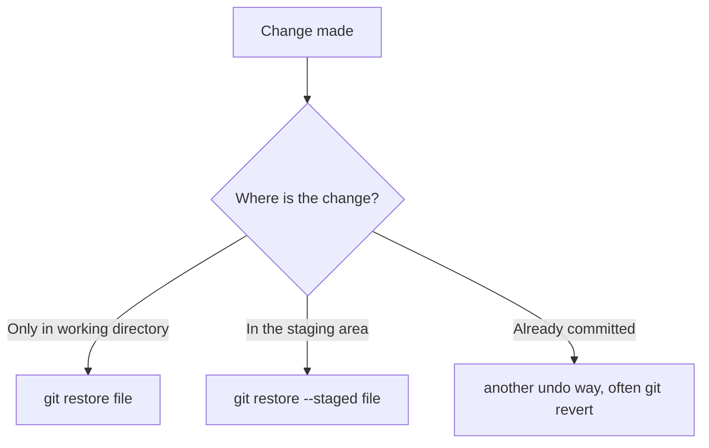
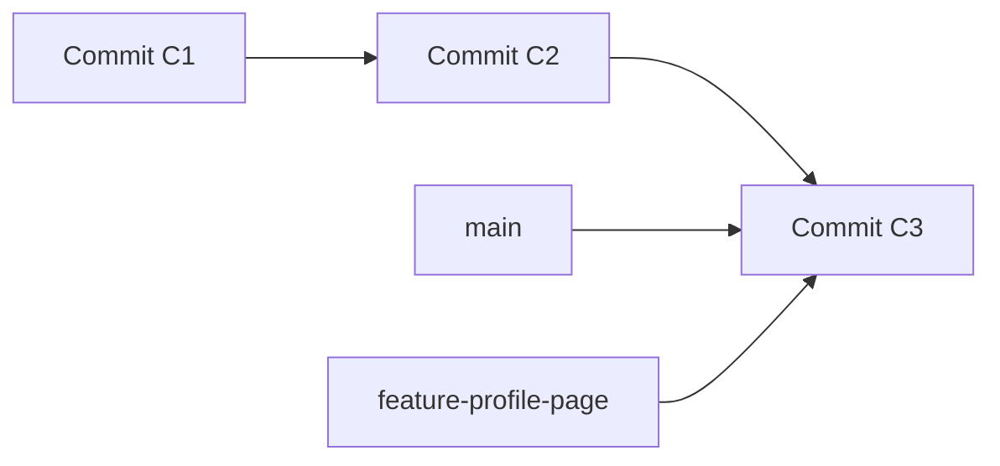
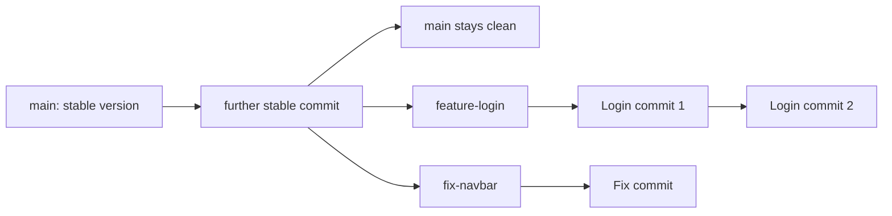

###### Topics

Tracking files and changes

- Adding files to the repository
- Saving changes with commits

Checking work status and history

- Checking the current status of a repository
- Displaying changes and commit history

Easily undoing changes

- Resetting unsaved changes with git restore
- Understanding the basic idea of undo functions in Git

Branch management

- Displaying and creating branches
- Switching between branches
- Understanding the purpose of branches in daily work

<br><br><br>
# 📦 Tracking Files and Changes

Understanding Git is much easier if you don’t just memorize individual commands but recognize the **model behind it**. That’s exactly what matters with Git: Git isn’t just a tool for “saving,” but a system that **records the states of your project** transparently.

One crucial foundation is: at its core, Git does not store your project like a text editor that “the latest version overwrites the previous one,” but works with **snapshots**—preserved states of the project ([Pro Git – What is Git?](https://git-scm.com/book/en/v2/Getting-Started-What-is-Git%3F)).

To really understand the next commands, you should have these three areas in mind:

- **Working directory**: These are the files you are currently working on.
- **Staging area** (also called **index**): A kind of preparation area for the next commit.
- **Repository**: The actual Git history with your commits.

<br><br><br>
## 🧠 The Basic Model: Working Directory, Staging Area, and Repository

When you edit a file, that happens first in your **working directory**. Git often already knows something has changed, but this change isn’t automatically included in the next commit.

With `git add` you specify **which changes are to be included in the next commit**. Technically, `git add` adds file contents to the **index/staging area** ([git-add Documentation](https://git-scm.com/docs/git-add)).

Only with `git commit` does the content of the staging area become a real, new entry in the project history. `git commit` creates a commit from the current contents of the index ([git-commit Documentation](https://git-scm.com/docs/git-commit)).


This is the most important mindset for Git:

- **Editing** is not yet **staging**
- **Staging** is not yet **permanently saving**
- **Committing** is actually recording in the history

If you clearly understand this model, almost all Git commands will become logical.

<br><br><br>
## 📁 Adding Files to the Repository

If you’ve created a new file, Git often does not know about it at first. Git calls such files **untracked files**. You can see this with `git status`; this command shows the state of the working directory and the staging area ([git-status Documentation](https://git-scm.com/docs/git-status)).

Suppose you’ve created a file called `app.js`. The typical workflow then is:

```bash
git status
git add app.js
git status
```

Before `git add`, the file is usually **untracked**. After `git add`, it is **staged** for the next commit.

It’s important to make a very precise distinction here, since this often confuses beginners:

- In casual language, people often say: “I added the file to the repository.”
- Technically speaking, with `git add` what happens first is:  
  **The file is added to the staging area.**
- Only with `git commit` does this state really enter the **repository history**.

A full example:

```bash
git add app.js
git commit -m "Add app.js"
```

After that, the file is not only known to Git, but also saved as part of a specific commit.

<br><br><br>
### 📄 Typical File States in Git

You should know these states:

| State      | Meaning                                          |
|---         |---                                               |
| **untracked** | File exists, but Git is not tracking it yet      |
| **modified**  | File is tracked, but has been changed            |
| **staged**    | Change is staged for the next commit             |
| **committed** | Change is already saved in a commit              |

An important learning tip: With Git, don’t think in commands first, but in **states**. Always ask yourself:

1. Is the change only in the working directory?
2. Is it already in the staging area?
3. Is it already in a commit?

If you can answer these three questions, you will understand Git much better than someone who just knows the commands by heart.

<br><br><br>
## 💾 Saving Changes with Commits

A **commit** is a preserved project state with a message describing what was changed. Git creates a new commit from the content currently in the staging area ([git-commit Documentation](https://git-scm.com/docs/git-commit)).

A typical workflow:

```bash
git add app.js
git commit -m "Add first version of the application"
```

This means:

- `git add app.js` marks the change for the next commit
- `git commit -m "..."` saves exactly this staged state in the Git history

Very important: A commit does **not automatically include all changed files** by default but only what you previously staged. That’s one of the big advantages of Git: you can deliberately decide which changes belong together.

For example, if you:

- fix a typo
- and add a new feature

you can commit these changes separately, even if they were made at the same time. This makes the history much easier to understand later.

<br><br><br>
### 📝 Understanding Good Commit Messages

A commit message should briefly and clearly state **what** was changed. Good commit messages help you enormously with tracking later.

Examples:

```bash
git commit -m "Fix password validation bug"
git commit -m "Add form validation"
git commit -m "Rename config file"
```

Less helpful are unclear messages like:

```bash
git commit -m "Update"
git commit -m "Changes"
git commit -m "fix"
```

The more precisely your commits are formulated, the easier it will be to understand your history later.

<br><br><br>
# 🔍 Checking Work Status and History

With Git, it’s not enough just to make changes. You also need to be able to read **what’s going on right now**. For this purpose, there are commands like `git status`, `git diff`, and `git log`.

This is extremely important in everyday work; otherwise you quickly lose track:

- Which files have been changed?
- What is already staged?
- What is still unsaved?
- Which commits already exist?

<br><br><br>
## 📌 Checking the Current Status of a Repository

The most important everyday command for this is:

```bash
git status
```

This command shows you the status of the working directory and staging area ([git-status Documentation](https://git-scm.com/docs/git-status)).

If you use `git status` regularly, you’ll almost always immediately get answers to these questions:

- Which branch am I on?
- Are there new files?
- Are there modified files?
- What is already staged for commit?
- Are there unstaged changes?

A typical thought process is:

1. I changed something.
2. I check with `git status` what Git sees of it.
3. I decide what I want to stage.
4. I commit deliberately.

That’s much better than “just committing whatever.”

<br><br><br>
### 🧾 Example: Reading `git status` Properly

A possible example:

```bash
On branch main
Changes to be committed:
  modified:   app.js

Changes not staged for commit:
  modified:   style.css

Untracked files:
  notes.txt
```

This means:

- `app.js` is already **staged**
- `style.css` has been changed, but is **not staged** yet
- `notes.txt` is new and Git does **not** track it yet

You can clearly see that Git can manage different states simultaneously.

If you want a more compact output, you can use this short form:

```bash
git status -s
```

Then states appear in a shortened form, which is often more convenient for daily work.

<br><br><br>
## 🕰️ Displaying Changes and Commit History

There are two closely related but different questions:

1. **What changes have I just made in files?**
2. **What commits already exist in history?**

For the first question, `git diff` is important. `git diff` shows differences between different states, for example between the working directory and staging area, or between the staging area and the last commit ([git-diff Documentation](https://git-scm.com/docs/git-diff)).

For the second question, `git log` is important. `git log` shows the commit history ([git-log Documentation](https://git-scm.com/docs/git-log)).

<br><br><br>
### 🔎 Viewing Current Changes with `git diff`

Common variants:

```bash
git diff
```

Normally, this shows changes that are **not yet staged**.

```bash
git diff --staged
```

This shows changes that are **already staged** and would go into the next commit.

This is important, because many beginners confuse `git status` and `git diff`:

- `git status` tells you **which files** are in which state
- `git diff` shows you **the exact content of changes**

So if you want to know *which lines* have changed, you need `git diff`.

<br><br><br>
### 📚 Reading Commit History with `git log`

The simplest command is:

```bash
git log
```

You'll see several commits with commit hash, author, date, and message.

In everyday use, this compact form is often more pleasant:

```bash
git log --oneline
```

Also very useful:

```bash
git log --oneline --graph --decorate --all
```

This gives you a compact, often very clear representation of the history with branch indicators.

An example:

```bash
a1b2c3d Add form validation
9f8e7d6 Fix CSS margin in header
5d4c3b2 Initial project setup
```

So you can easily follow **what happened in order**.

<br><br><br>
### 🧠 Why `status`, `diff`, and `log` Belong Together

These three commands form a powerful combination in everyday work:

| Question                         | Appropriate Command |
|---                               |---                 |
| What is the current state?        | `git status`       |
| What *exactly* was changed?       | `git diff`         |
| What saved steps already exist?   | `git log`          |

If you want to learn Git properly, you should almost see these three commands as the “basic view” of a project.

<br><br><br>
# ↩️ Easily Undoing Changes

Undoing is a topic of its own in Git, because Git offers different tools depending on the state. The most important basic rule is:

**Before you undo anything, you need to know where the change currently is.**

Because a change can

- be only in the working directory
- already be staged
- already be saved in a commit

Depending on that, you need a different command.

<br><br><br>
## 🧹 Resetting Unsaved Changes with `git restore`

`git restore` is used to restore contents in the working directory, but can also affect the staging area with options ([git-restore Documentation](https://git-scm.com/docs/git-restore)).

If you have modified a file, but **don’t want to commit** the change and simply want to discard it, you can use the following, for example:

```bash
git restore app.js
```

This practically means:

- The file `app.js` is reset to the state Git knows as the current base.
- Your **unsaved** changes in this file will be lost.

Important: `git restore` is not “magic undo.” When you discard local changes, they are usually gone unless you saved them elsewhere.

<br><br><br>
### ⚠️ What Actually Happens with `git restore`

Suppose you have experimented in `app.js` and want to discard all changes since the last saved state:

```bash
git restore app.js
```

Then `app.js` will be restored to the state Git can derive from the last known commit.

If you want to reset multiple files:

```bash
git restore .
```

Be careful, as this may discard many unsaved changes at once.

<br><br><br>
### 🗂️ Difference Between Working Directory and Staging Area

This is often when Git really becomes clear for many:

- `git restore file` typically affects changes in the **working directory**
- `git restore --staged file` removes a change from the **staging area** without necessarily deleting the working file content ([git-restore Documentation](https://git-scm.com/docs/git-restore))

Example:

```bash
git restore --staged app.js
```

This means:

- `app.js` is no longer staged for the next commit
- The changes in the file itself may still be present in the working directory

This is extremely useful if you accidentally staged something with `git add` that shouldn’t go into the next commit yet.

<br><br><br>
## 🧭 Understanding the Core Idea of Undo Functions in Git

The most important thing about “undo” in Git is not to know as many commands as possible, but to understand the **logic** behind them.

The core question is always:

**What exactly do you want to undo?**

- Only local, unsaved file changes?
- Only remove something from the staging area?
- Undo an already created commit?

The appropriate tool follows from that.

<br><br><br>
### 🧠 The Central Decision Logic

| Situation                                      | Typical Thought                  | Appropriate Git Way           |
|---                                             |---                               |---                            |
| File locally changed but not committed         | “I want to discard my changes”   | `git restore file`            |
| File accidentally staged                      | “Should not go into the commit”  | `git restore --staged file`   |
| Commit already exists, should be reverted      | “I want to undo the effect”      | often `git revert`            |

If a commit already exists, especially if it’s been shared, `git revert` is often the safe path, because it creates a new commit that undoes a previous commit ([git-revert Documentation](https://git-scm.com/docs/git-revert)).

For your current learning goal, the main insight is:

- **`restore`** mostly works on the file content and staging level
- **later undo commands** work more on the commit history level

This separation is a core principle of Git.



If you want to really learn Git, this is a very good mnemonic:  
**Git doesn’t “do everything the same”; it depends on which layer you are working on.**

<br><br><br>
# 🌿 Branch Management

Branches are among the most important Git concepts. Many beginners first see branches as only a technical extra, but in daily work they are a central tool for working **in parallel**, **in an organized way**, and **with low risk**.

At its core, a branch in Git is a movable pointer to a commit ([Pro Git – Branches in a Nutshell](https://git-scm.com/book/en/v2/Git-Branching-Branches-in-a-Nutshell)). This sounds abstract at first, but will become practical shortly.

If you continue to work on a branch and create new commits, this pointer simply moves forward.

<br><br><br>
## 🌱 Displaying and Creating Branches

To display existing branches, use:

```bash
git branch
```

This command lists branches; you can also use it to create branches ([git-branch Documentation](https://git-scm.com/docs/git-branch)).

The output might look like this:

```bash
* main
  feature-login
  fix-header
```

The asterisk `*` shows which branch you are currently on. In this example, `main`.

Create a new branch:

```bash
git branch feature-profile-page
```

This creates a new branch. But you are **not automatically switched to this branch**; you remain on your current branch.

This is an important pitfall for beginners.

<br><br><br>
### 🌿 What Technically Happens When Creating a Branch

When you create a branch, Git does not copy your whole project to a new folder. Instead, a new name is essentially created that points to the same commit as your current branch ([Pro Git – Branches in a Nutshell](https://git-scm.com/book/en/v2/Git-Branching-Branches-in-a-Nutshell)).

This makes branches in Git very lightweight and fast.



After creating, both branches often first point to the same commit. Only when you make new commits on a branch do they start to diverge.

<br><br><br>
## 🔀 Switching Between Branches

Today, `git switch` is often the clearer way to switch between branches ([git-switch Documentation](https://git-scm.com/docs/git-switch)).

Example:

```bash
git switch feature-profile-page
```

You then continue working on this branch.

If you want to create a branch and switch to it immediately:

```bash
git switch -c feature-profile-page
```

Which means:

- create new branch `feature-profile-page`
- immediately switch to this branch

Older guides often use `git checkout`, but for simply switching branches, `git switch` is usually easier to understand.

<br><br><br>
### 📍 What Happens When Switching a Branch

When you switch branches, Git changes your work context to the state that this branch represents.

In practice this means:

- The current branch pointer changes
- Files in the working directory are updated as needed
- You continue working on a different development line

You can imagine this as different project tracks:

- `main` = stable main version
- `feature-login` = new login feature
- `fix-header` = minor layout fix

This allows you to develop things separately without mixing everything into a single chaotic timeline.

<br><br><br>
## 🛠️ Understanding the Purpose of Branches in Daily Work

The true value of branches is not in the command itself, but in the **work principle**.

Branches help you to

- develop new features separately
- implement bug fixes in isolation
- keep risks away from the main branch
- work in parallel on multiple topics

This is extremely important in real-world development.

Imagine you have a stable state on `main`. Now you want to build a new profile page. If you work directly on `main` and break something mid-way, the main branch is also in an unfinished state.

With a branch like `feature-profile-page`, `main` stays clean, while you can freely experiment on the feature branch.

<br><br><br>
### 🧩 A Realistic Everyday Example

You have the following setup:

- `main` contains the current stable version
- `feature-login` is for a new login feature
- `fix-navbar` fixes a navigation display bug

Workflow:

1. You switch to `main`
2. You create a new branch for a task
3. You work there with your own commits
4. Later, this branch is integrated again

This keeps your work structured. That’s why branches are not a luxury, but a core tool of professional development.



<br><br><br>
### 🧠 Learning Branches Properly: The Mental View

Many people imagine branches at first as a “side copy of a project.” That’s not totally wrong as a rough idea, but technically a bit imprecise.

Better to think:

- A branch is **not an extra project folder**
- A branch is its own **line of development**
- Git can easily switch between these lines because branches only point to commits internally ([Pro Git – Branches in a Nutshell](https://git-scm.com/book/en/v2/Git-Branching-Branches-in-a-Nutshell))

This will also help you later to understand merge, rebase, and team workflows.

<br><br><br>
## 🧪 Overview of Typical Commands for Everyday Use

Here you see the commands from your topics neatly summarized:

| Task                         | Command                   |
|---                           |---                        |
| Check status                 | `git status`              |
| Stage file                   | `git add file`            |
| Create commit                | `git commit -m "Message"` |
| Show unstaged changes        | `git diff`                |
| Show staged changes          | `git diff --staged`       |
| Show history                 | `git log`                 |
| Show compact history         | `git log --oneline`       |
| Discard local changes        | `git restore file`        |
| Remove file from staging     | `git restore --staged file`|
| Show branches                | `git branch`              |
| Create branch                | `git branch name`         |
| Switch branch                | `git switch name`         |
| Create and switch branch     | `git switch -c name`      |

If you don’t just memorize these commands mechanically but learn the underlying model, you build a very solid foundation for Git. That’s exactly what’s crucial with core tech fundamentals: not knowing as many commands as possible, but understanding the **structure of the system**.