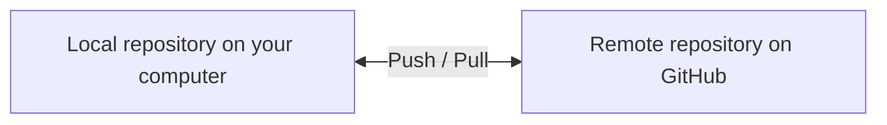
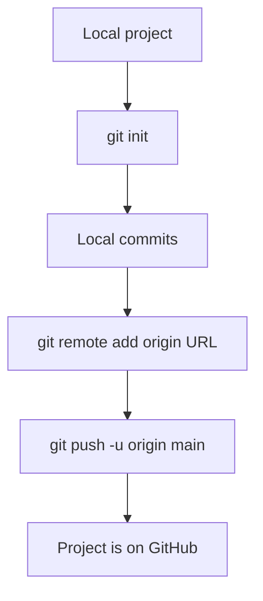
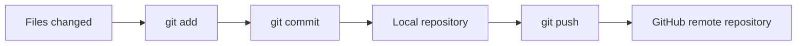
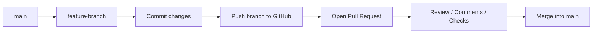

###### Topics

Working with Remote Repositories on GitHub

- Create and use a GitHub account
- Connect a local repository with a remote repository
- Clone an existing repository

Synchronization with GitHub

- Push changes to a remote repository
- Fetch and integrate changes from a remote repository

Collaboration with GitHub

- Understand the core principle of Pull Requests
- Recognize simple merge conflicts

Documentation on GitHub

- Basic navigation in the GitHub web interface
- Use README.md for simple project documentation

<br><br><br>
# 🌐 Working with Remote Repositories on GitHub

When working with Git and GitHub, you first need to keep an essential mental image in mind:

A **local repository** is on your computer. That’s where you edit files, make commits, and experiment in peace.  
A **remote repository** is on a server, for example, on GitHub. That’s where your project is stored online, shared, and synchronized with others. GitHub describes a remote repository as the online-hosted version of your project that your local Git repository can connect to ([About remote repositories](https://docs.github.com/en/get-started/git-basics/about-remote-repositories)).

A simple way to think about this is:

- **Local** = your workspace
- **Remote** = shared, central storage location
- **Git** = the system that tracks changes cleanly
- **GitHub** = the platform where you manage these Git repositories online

| Term | Simply explained | Typical location |
|---|---|---|
| Local repository | Your project copy with complete Git history | Your computer |
| Remote repository | Online version of your project | GitHub |
| Commit | A saved development step | Local, later also remote |
| Branch | A development branch | Local and/or remote |



This basic understanding is extremely important. Many Git problems arise not because Git is “complicated,” but because people do not clearly distinguish between:

1. the working state in your files,
2. the Git state in your local repository,
3. the state on GitHub.


<br><br><br>
## 👤 Creating and Using a GitHub Account

To use GitHub, you need a personal account. GitHub guides you through account creation directly on its registration page, where you set your username, email, and password ([Creating an account on GitHub](https://docs.github.com/en/get-started/start-your-journey/creating-an-account-on-github)).

### Typical account creation process

1. Go to **github.com**.
2. Click on **Sign up**.
3. Choose:
   - a **username**
   - an **email address**
   - a **password**
4. Confirm your email address.
5. Afterwards, you can create repositories, follow other projects, and publish your own.

### How you actually use your GitHub account

With your account, you can:

- create your own repositories
- store existing projects online
- manage projects as **public** or **private**
- collaborate with others
- create pull requests
- manage issues
- show documentation via README files

GitHub fundamentally distinguishes repositories based on whether they are public or private; public repositories are visible to everyone, private ones only to authorized persons ([About repositories](https://docs.github.com/en/repositories/creating-and-managing-repositories/about-repositories)).

### Important practical point: Authentication for Git commands

If you work with GitHub via the command line, your GitHub password is no longer sufficient for Git operations over HTTPS. GitHub requires secure authentication methods like **personal access tokens**, browser login, or **SSH keys** ([About authentication to GitHub](https://docs.github.com/en/authentication/keeping-your-account-and-data-secure/about-authentication-to-github)).

This is important because many beginners think:

> “I have a GitHub account, so why doesn’t `git push` work with my password?”

The answer is: For Git access, different authentication rules apply than for normal web login.

### HTTPS or SSH?

There are two common ways to connect to GitHub:

| Method | Who is it suitable for? | Special feature |
|---|---|---|
| HTTPS | Easy for beginners | Authentication via token or login dialog |
| SSH | Very convenient long-term | Set up SSH key once, often more convenient afterwards |

GitHub documents both variants and explains SSH setup separately ([Connecting to GitHub with SSH](https://docs.github.com/en/authentication/connecting-to-github-with-ssh)).

If you’re just starting out, **HTTPS** is often easier to understand. If you work with GitHub regularly, **SSH** is often more convenient long-term.


<br><br><br>
## 🔗 Connecting a Local Repository with a Remote Repository

This is one of the most important steps of all.

Often, your situation is:

- You already have a project on your computer.
- This project might already be initialized with Git.
- Now you want to connect this local project to a GitHub repository.

GitHub explains managing such connections via **remotes**; a remote is basically the saved address of an external repository ([Managing remote repositories](https://docs.github.com/en/get-started/git-basics/managing-remote-repositories)).

### The core principle

Your local repository doesn’t know about GitHub until you tell it:

> “That online repository there is my remote.”

The name **origin** is usually used for this.  
**origin** isn’t magical, it’s just a widely adopted default name for the primary remote.

### Typical procedure

Let’s assume you already have a local project folder:

```bash
git init
git add .
git commit -m "First commit"
```

Then you create a new repository on GitHub, such as `my-project`.

Then you connect your local repository to GitHub:

```bash
git remote add origin https://github.com/YOUR-NAME/my-project.git
```

This command saves the URL of the remote repository under the name `origin`.

You can check if the connection is set:

```bash
git remote -v
```

You will see the stored URL for `fetch` and `push`.

### What does `origin` actually mean?

`origin` is the name of the remote target.  
You could theoretically also write:

```bash
git remote add github https://github.com/YOUR-NAME/my-project.git
```

That would work technically. In practice, almost everyone uses `origin` because it’s clear and standardized.

### First push to the remote repository

Once your local project is connected to GitHub, you need to upload your local history for the first time:

```bash
git branch -M main
git push -u origin main
```

Here’s what happens:

- `git branch -M main` renames your current main branch to `main`
- `git push -u origin main` uploads the `main` branch to GitHub
- The `-u` sets an upstream so Git knows which remote branch is linked to your local branch

GitHub explains pushing local commits to a remote repository for such cases ([Pushing commits to a remote repository](https://docs.github.com/en/get-started/using-git/pushing-commits-to-a-remote-repository)).

### Very important beginner tip

If you let GitHub create a `README.md`, `.gitignore` or license file when creating the repository, the remote repository already has an initial commit. If your local repository also already has its own commits, local and remote histories may diverge. In this case, the first push may not work directly, because Git first needs to clarify how to combine both histories. This is not a “GitHub error,” but a safeguard in Git.

For beginners, the cleanest method is often:

- **either**: start locally and create an **empty** repository on GitHub
- **or**: create on GitHub first and then **clone**

### Useful illustration




<br><br><br>
## 📥 Cloning an Existing Repository

**Cloning** means: You pull an existing repository from GitHub completely to your computer. You get not only the current files, but also the entire Git history. GitHub describes `git clone` as creating a local copy of an existing repository ([Cloning a repository](https://docs.github.com/en/repositories/creating-and-managing-repositories/cloning-a-repository)).

### When you use cloning

Cloning is the right way when:

- the repository already exists on GitHub
- you want to work on someone else’s or an already existing project
- you need the full history locally
- you don’t want to manually create an empty directory first

### How it works

On GitHub, go into a repository and click the green **Code** button. There you get the URL, for example:

```bash
git clone https://github.com/YOUR-NAME/my-project.git
```

Git creates a new folder with the project name, downloads the files, and automatically sets up the `origin` remote.

Important:  
When cloning, you **do not** need to run `git remote add origin ...` yourself—Git already does this for you.

### What you get after cloning

After successfully cloning, you have:

- a local project folder
- the complete commit history
- the standard remote `origin`
- the information about which branch is checked out by default

You can check it with:

```bash
git remote -v
```

### HTTPS cloning or SSH cloning

Examples:

```bash
git clone https://github.com/YOUR-NAME/my-project.git
```

or

```bash
git clone git@github.com:YOUR-NAME/my-project.git
```

The difference is mainly the authentication method. For SSH you need appropriate keys that GitHub accepts ([Connecting to GitHub with SSH](https://docs.github.com/en/authentication/connecting-to-github-with-ssh)).

### The mental model when cloning

Cloning is basically:

> “Make a complete local working copy of this online project for me.”

Don’t confuse this with “downloading files.”  
If you just download a ZIP, you get the files, but **not** the Git history nor a real Git connection to the repository.


<br><br><br>
# 🔄 Synchronization with GitHub

Synchronization means making your local state and the state on GitHub match.

There are two directions:

- **local → GitHub**: you send your changes up
- **GitHub → local**: you pull changes down

Many learners think of Git as just “uploading files.” That's much too limited. In Git, you primarily synchronize **commits** and **branch states**, not just loose files.


<br><br><br>
## ⬆️ Pushing Changes to a Remote Repository

For changes to land on GitHub, you usually need this sequence:

1. Change files
2. Stage changes
3. Create a commit
4. Push the commit

### Standard workflow

```bash
git status
git add .
git commit -m "Description of change"
git push
```

### What happens at each step?

#### `git status`

Shows you what has changed. This is one of the most important commands because you’ll see:

- which files have changed
- which files are already staged
- which branch you’re on
- whether your branch is ahead or behind the remote branch

#### `git add .`

This determines which changes go into the next commit.

#### `git commit -m "..."`

This saves a development step in the local repository.

Very important:  
A commit is **local only** at first. It’s not yet on GitHub.

#### `git push`

Only now do you send your local commits to the remote repository. GitHub explains `push` as transferring local commits to a remote repository ([Pushing commits to a remote repository](https://docs.github.com/en/get-started/using-git/pushing-commits-to-a-remote-repository)).

### A very common misconception

Many beginners believe:

> `git add` or `git commit` already uploads something to GitHub.

That is not true.

- `git add` stages changes
- `git commit` saves them locally
- `git push` sends them to the remote

This distinction is central.



### If `git push` doesn’t work

Typical causes are:

- you’re not properly authenticated
- your remote branch has newer changes
- you’re pushing to a protected branch
- you haven’t set an upstream yet

You’ll often see messages like:

- `rejected`
- `non-fast-forward`
- `authentication failed`

Especially `non-fast-forward` usually means:  
There are already changes on GitHub that you don’t have locally yet. You need to fetch and integrate the remote state first.

### Push to a specific branch

If you’re not working on `main`, but on a feature branch, it looks like this:

```bash
git push -u origin feature-login
```

This is very common in teamwork, since changes often go through separate branches and pull requests.


<br><br><br>
## ⬇️ Fetching and Integrating Changes from a Remote Repository

Here you need to clearly distinguish two Git commands:

- `git fetch`
- `git pull`

This distinction is extremely important and gives you lots of control.

### `git fetch`: Fetch without integrating

With `git fetch`, you fetch new information and commits from the remote repository, but Git does **not** automatically integrate them into your current working branch. This is the careful, cautious variant, and Git describes it exactly this way in the official documentation ([git-fetch Documentation](https://git-scm.com/docs/git-fetch)).

Example:

```bash
git fetch origin
```

After that, your local repository knows what has happened on GitHub, but your current files remain unchanged.

This is handy if you want to check first:

- What has changed?
- Is my branch behind the remote?
- Do I want to merge or review first?

### `git pull`: Fetch and immediately integrate

`git pull` is usually a combination of `fetch` followed by `merge` or depending on your config, `rebase`. The Git documentation describes `git pull` exactly as fetching changes and integrating them into your current branch ([git-pull Documentation](https://git-scm.com/docs/git-pull)).

Example:

```bash
git pull origin main
```

This means:

> “Get the current state of `main` from remote `origin` and integrate it into my current branch.”

### The practical difference

| Command | What happens? | When useful? |
|---|---|---|
| `git fetch` | Fetches changes but does not auto-integrate | If you want to review first |
| `git pull` | Fetches changes and integrates them instantly | If you want to synchronize immediately |

### Why beginners often use `fetch` too rarely

`git pull` is convenient, but sometimes too “automatic.”  
If you want to understand what’s going on, `git fetch` is often better pedagogically. By practicing, you’ll learn:

- What is already local?
- What is only on GitHub?
- When is a merge required?
- Why can a conflict happen?

Especially for core tech fundamentals, this understanding is very valuable.

### Typical safe workflow

If you want to work carefully, this workflow is often useful:

```bash
git fetch origin
git status
git pull origin main
```

Or even more controlled:

```bash
git fetch origin
git log --oneline --graph --all
```

Then you can review the history before integrating.

### What “integrating” really means

Integrating means:  
The changes from the remote repository are included in your local development state. This can be smooth and easy—or you might get conflicts if the same places were changed differently.

This is where the next important area begins: Collaboration.


<br><br><br>
# 🤝 Collaboration with GitHub

GitHub isn’t just for storing code. The platform is primarily designed for collaboration. Especially important are:

- Branches
- Pull Requests
- Reviews
- Merging processes
- Conflict detection

If you understand this part, you understand the true value of GitHub.


<br><br><br>
## 🔀 Understanding the Core Principle of Pull Requests

A **Pull Request** is the usual GitHub way to propose changes from one branch into another. GitHub describes Pull Requests exactly as proposals for changes that can be reviewed, discussed, and merged ([About pull requests](https://docs.github.com/en/pull-requests/collaborating-with-pull-requests/proposing-changes-with-pull-requests/about-pull-requests)).

### Why pull requests are important

Imagine several people working on the same project.  
If everyone pushed directly to `main`, chaos would ensue quickly.

Therefore, often this approach is used:

1. The stable main state is on `main`.
2. For a new change, you create a feature branch.
3. You develop in this branch.
4. The branch is pushed to GitHub.
5. Then a pull request is opened.
6. Others can review and comment on the changes.
7. Only after that, the code is merged.

### The core idea

A pull request is **not** a Git command itself but a GitHub workflow using branch comparisons.

Typical procedure:



### What you see in a pull request

In a pull request, GitHub typically shows:

- which files were changed
- which lines were added or removed
- who commented what
- whether automated checks passed
- whether conflicts exist
- whether the branch is mergeable

### Important terms

| Term | Meaning |
|---|---|
| Base branch | The target branch, usually `main` |
| Compare branch | The branch with your changes |
| Review | Change review by others |
| Merge | Combining branches |

### Why pull requests are so important technically

A pull request separates **writing code** from **approving code**.

This is both didactically and technically very reasonable, as it allows:

- reviewable changes
- discussions at specific lines of code
- earlier detection of errors
- a more stable main branch

Even if you’re working alone, pull requests are useful. They force you to treat your change as a complete, reviewable unit.

### Typical minimum procedure in practice

You work locally on a new branch:

```bash
git checkout -b feature-readme
```

Then edit files and push:

```bash
git add .
git commit -m "Improve README"
git push -u origin feature-readme
```

Then go to GitHub and open a pull request from `feature-readme` to `main`.

This is a very typical workflow.


<br><br><br>
## ⚠️ Recognizing Simple Merge Conflicts

A **merge conflict** occurs when Git cannot automatically combine changes. GitHub explains that conflicts typically occur when the same lines in competing branches are changed differently or when a file is deleted in one branch and changed in another ([About merge conflicts](https://docs.github.com/en/pull-requests/collaborating-with-pull-requests/addressing-merge-conflicts/about-merge-conflicts)).

### The simple basic principle

Git is very good at automatically combining changes, **as long as they don’t logically interfere**.

Example without conflict:

- Person A changes `README.md`
- Person B changes `app.js`

Git can usually combine those changes easily.

Example with conflict:

- Person A changes line 5 in `README.md`
- Person B changes the same line 5 in a different way

Then Git doesn’t know which version is correct.

### What a conflict looks like

When Git marks a conflict in a file, you usually see markers like this:

```txt
<<<<<<< HEAD
Hello World
=======
Hello GitHub
>>>>>>> feature-greeting
```

This means:

- Upper part is one version
- Lower part is the other version
- Git asks you to decide

### How to mentally read a simple conflict

`<<<<<<< HEAD`  
Here begins your current branch’s version.

`=======`  
Git separates both versions here.

`>>>>>>> feature-greeting`  
Here ends the version from the other branch.

### What you have to do next

Manually edit the file so it looks the way it should in the end.  
For example:

```txt
Hello World on GitHub
```

Remove all conflict markers and save the file.

Then mark the resolution and finish the merge:

```bash
git add README.md
git commit
```

### How to recognize conflicts early

Conflicts are especially common when:

- many people work on the same files
- branches remain separate from the main branch for too long
- large changes get merged too late
- central files like `README.md`, config files, or main components are edited in parallel often

### Good learning rule

The longer a branch remains separated from the main branch, the greater the risk of conflicts.

Therefore, it's often best to:

- make smaller changes
- synchronize more frequently
- not leave pull requests open forever

### Conflicts on GitHub or locally?

Conflicts can appear both:

- **locally during merge or pull**
- and **on GitHub during a pull request**

GitHub often directly indicates in pull requests whether a branch can be merged cleanly. This is very helpful, but does not replace the understanding of what’s really happening locally.


<br><br><br>
# 📝 Documentation on GitHub

A good repository contains more than just working code. It also needs understandable documentation. On GitHub, the most important entry-level documentation is almost always the `README.md`.

Documentation isn’t “extra work”—it’s part of good software development. It helps others just as much as yourself.


<br><br><br>
## 🧭 Basic Navigation in the GitHub Web Interface

When you open a repository on GitHub, you see the project’s web interface. GitHub describes repositories as central places where you manage code, files, versions, and collaboration ([About repositories](https://docs.github.com/en/repositories/creating-and-managing-repositories/about-repositories)).

### The most important sections at a glance

On a typical repository page, you find several tabs at the top or upper area.

| Section | What it’s for |
|---|---|
| **Code** | Files, folders, branch selection, cloning, commits |
| **Issues** | Tasks, bug reports, discussions |
| **Pull requests** | Change proposals and reviews |
| **Actions** | Automation and CI/CD workflows |
| **Projects** | Project organization |
| **Wiki** | Additional documentation |
| **Security** | Security-related notes |
| **Insights** | Statistics and activity data |

Not all tabs are always enabled for every repository, but `Code`, `Issues`, and `Pull requests` are especially central.

### What you find under the “Code” tab

The **Code** tab is the standard view. There, you see:

- the current branch selection
- the file list
- the green **Code** button for cloning
- often the `README.md`
- information about recent commits

This is practically the main entry point into the repository.

### Important controls

#### Branch selection

At the top you can switch between branches. This is crucial since a repository can hold multiple development states simultaneously.

#### Code button

With the green **Code** button you can:

- copy the HTTPS URL
- copy the SSH URL
- clone the repository locally
- sometimes open in an app directly

#### Commit history

If you click on the number of commits, or open a file and view its history, you can see:

- who changed what and when
- which commit message was used
- how the file evolved

### Navigating the Pull Requests area

In the **Pull requests** tab you can:

- see open pull requests
- view closed pull requests
- open your own change proposals
- follow discussions and code reviews

This is where collaboration becomes most visible.

### Navigating the Issues area

Under **Issues** tasks, bugs, and improvement proposals are often tracked.  
A common beginner mistake is confusing issues with pull requests:

- **Issue** = Problem, task, or idea
- **Pull Request** = concrete code change as a proposal

### Why this navigation is important for learning

If you see GitHub only as a “place to upload,” you’re using maybe 20% of the platform.  
If you learn to orient yourself using Code, Branches, Pull Requests, Issues, and Documentation, you’ll understand GitHub as a complete work environment.

That’s a crucial step from mere user to someone who truly masters an efficient developer workflow.


<br><br><br>
## 📘 Using README.md for Simple Project Documentation

The file `README.md` is the standard entry-level documentation of a repository. GitHub displays README files prominently on the homepage of a repository, as long as they are in expected locations, such as the root folder ([About READMEs](https://docs.github.com/en/repositories/managing-your-repositorys-settings-and-features/customizing-your-repository/about-readmes)).

### What is `README.md`?

- `README` basically means: “Read me first”
- `.md` stands for **Markdown**
- Markdown is a simple markup language for structured text formatting on GitHub ([Basic writing and formatting syntax](https://docs.github.com/en/get-started/writing-on-github/getting-started-with-writing-and-formatting-on-github/basic-writing-and-formatting-syntax))

### Why the README is so important

When someone opens your repository, the README is usually the first thing they read.  
It answers basic questions like:

- What is this project?
- What is it for?
- How do you start it?
- What technologies are used?
- How do you use it?

Without a README, a project is often unnecessarily hard to understand, even if the code is good.

### What should go into a simple README

A good simple README often contains:

| Section | Content |
|---|---|
| Project name | Name of the project |
| Description | What the project does |
| Goal or purpose | Why it exists |
| Installation | How to start it locally |
| Usage | How to use it |
| Structure | Important folders or files |
| Status | e.g. in development |
| Contact or contributing | If others should contribute |

### Simple example of a README

```md
# My Project

A small sample project for learning Git and GitHub.

## Goal
This project shows how to connect a local repository with GitHub.

## Installation
```bash
git clone https://github.com/your-name/my-project.git
cd my-project
```

## Usage
Open the project in your editor and start the app as described in the docs.

## Technologies
- Git
- GitHub
- Markdown
```

### Key Markdown building blocks

Markdown is intentionally simple. A few blocks go a long way:

| Markdown | Effect |
|---|---|
| `# Heading` | Large heading |
| `## Subheading` | Smaller heading |
| `- Item` | List item |
| `` `code` `` | Inline code |
| ``` ``` | Code block |
| `[Text](URL)` | Link |

GitHub supports these basic formats directly in README files ([Basic writing and formatting syntax](https://docs.github.com/en/get-started/writing-on-github/getting-started-with-writing-and-formatting-on-github/basic-writing-and-formatting-syntax)).

### What makes a README good

A good README isn’t as long as possible, but as helpful as possible.  
It helps readers quickly answer:

- **What is this?**
- **How do I get it running?**
- **What’s the current state?**

### Practical beginner tip

Many people just put a title in the README and maybe a sentence. That’s better than nothing—but usually not enough.  
With learning projects especially, a README is worth it, because it forces you to state clearly what your project is about.

That has a strong learning effect:  
As soon as you can document something understandably, you’ve usually understood it much better.

### Editing the README directly on GitHub

You can not only edit `README.md` locally, but also directly via the GitHub web interface. That’s practical for small text changes. For larger changes, local editing is often more pleasant, because you have your editor, preview, and Git commands under better control.

### Good order for documenting

For small to mid-sized projects, this order is often sensible:

1. Project name and short description
2. Project purpose
3. Start or installation instructions
4. Key usage steps
5. Optionally project structure or special features

That way, your repository is not just technically correct on GitHub, but also really readable and usable for others.