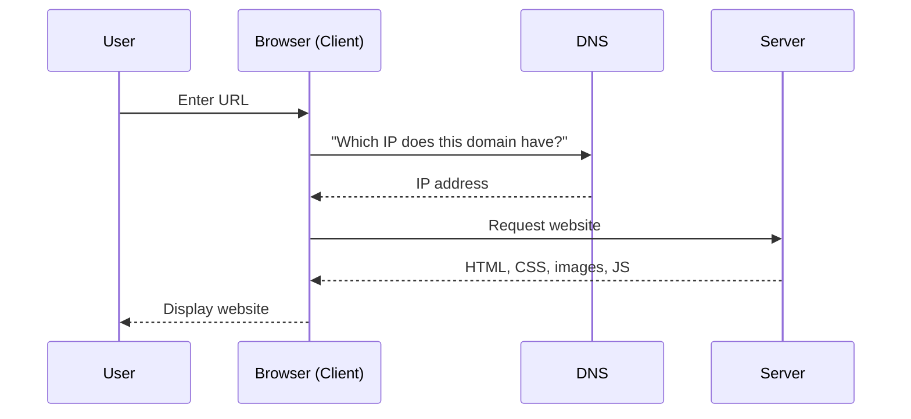
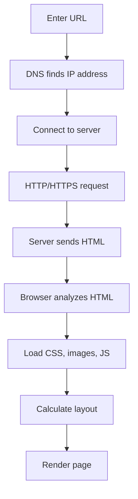

###### Topics

Understanding the Web

- Basic functioning of the Internet: client, server, and transmission paths
- Understanding HTTP and HTTPS in simple terms
- Understanding the structure and display of a website in the browser

Basic HTML Structure

- Structure of a minimal HTML document with doctype, html, head, and body
- Basic understanding of the meaning of title and meta

Text Structure in HTML

- Using headings, paragraphs, and text markup with h1 through h6, p, strong, and em
- Simple use of line breaks and horizontal lines

<br><br><br>
# 🌐 Understanding the Web

If you want to “understand the web,” a simple example helps: You’re sitting at your device, enter an address, your browser asks somewhere on the Internet for a resource, and another computer sends it back. From this seemingly small action arise HTML, images, CSS, JavaScript, and ultimately the visible website.

What’s important here: **The Internet** and **the Web** are not the same. The Internet is the technical foundation—a worldwide network made up of many interconnected networks. The **World Wide Web** is just **one service** running on top of the Internet, making websites accessible via HTTP or HTTPS ([How does the Internet work?](https://developer.mozilla.org/en-US/docs/Learn/Common_questions/Web_mechanics/How_does_the_Internet_work)).

<br><br><br>
## 🧭 Basic Functioning of the Internet: Client, Server, and Transmission Paths

At its core, the Internet operates on a simple principle: **A client requests something, a server responds**. In between, there are transmission paths and devices that relay the data.

Think of it like parcel delivery:

- You place an order.
- The order is sent to a warehouse.
- The warehouse sends you the package.
- Along the way, there are roads, distribution centers, and transport rules.

It’s similar on the web, only instead of boxes, **data packets** are sent.

<br><br><br>
### 💻 What is a Client?

A **client** is the device or program that makes a request. In practice, this is often your **web browser** like Chrome, Firefox, Safari, or Edge.

When you enter `https://example.com`, your browser is the client. It requests the website from the server. A client doesn't always have to be a browser. An app on your smartphone or a program on your computer can also be a client, as long as it requests data from a server ([How does the Internet work?](https://developer.mozilla.org/en-US/docs/Learn/Common_questions/Web_mechanics/How_does_the_Internet_work)).

Simply put:  
**Client = requests**

<br><br><br>
### 🗄️ What is a Server?

A **server** is a computer or service that waits for requests and responds to them. When someone opens a website, the server might deliver HTML files, images, CSS files, or data from a database ([What is a web server?](https://developer.mozilla.org/en-US/docs/Learn/Common_questions/Web_mechanics/What_is_a_web_server)).

Note: A server is not automatically “a huge supercomputer.” A server is primarily a **role** in the network. It provides something.

Simply put:  
**Server = delivers**

<br><br><br>
### 📦 How Do Data Get from A to B?

Data usually don’t travel across the Internet as “one big block,” but are divided into **smaller packets**. These packets travel across various networks and are reassembled at their destination. This is a core principle of the Internet ([How does the Internet work?](https://developer.mozilla.org/en-US/docs/Learn/Common_questions/Web_mechanics/How_does_the_Internet_work)).

Typically, there are several stations between client and server:

- your Wi-Fi or mobile network
- your router
- your Internet service provider
- additional network nodes on the Internet
- the target server

The devices that decide where a data packet is sent next are called **routers**. They choose paths through the network so the data reaches its destination ([How does the Internet work?](https://developer.mozilla.org/en-US/docs/Learn/Common_questions/Web_mechanics/How_does_the_Internet_work)).

The **transmission paths** can vary:

- Copper cables
- Fiber optic cables
- Wi-Fi
- Cellular networks
- Undersea cables between continents

So if you open a webpage, your data do not “magically” travel directly from your laptop to the server, but via many intermediate steps.

<br><br><br>
### 🧭 Why Are Addresses Necessary at All?

In the end, computers in a network communicate via **IP addresses**. But people prefer remembering names like `wikipedia.org` instead of strings of numbers. That’s why the **Domain Name System (DNS)** exists. DNS translates a domain name into an IP address so your browser knows which server to connect to ([How does the Internet work?](https://developer.mozilla.org/en-US/docs/Learn/Common_questions/Web_mechanics/How_does_the_Internet_work)).

This means:

- You remember `example.com`
- DNS finds the corresponding IP address
- The browser can then talk to the right server

Without DNS, the web would be very impractical for people.

<br><br><br>
### 📋 Roles at a Glance

| Term | Meaning | Simple Analogy |
|---|---|---|
| Client | Requests data | You order something |
| Server | Supplies data | The warehouse ships something |
| Router | Forwards data | Distribution center |
| DNS | Translates domain to IP | Phonebook / Address lookup |
| Transmission path | Transports data | Road, rail, air route |

<br><br><br>
### 🔄 What a Typical Request Looks Like



This diagram is intentionally simplified but is very helpful at the beginning. If you understand this, you already have a strong conceptual model in your head.

<br><br><br>
## 🔐 Understanding HTTP and HTTPS in Simple Terms

As soon as client and server communicate, they need **rules** so both know what requests and responses should look like. One of the most important rules on the web is **HTTP**.

HTTP stands for **HyperText Transfer Protocol** and is a protocol for transferring resources on the web ([An overview of HTTP](https://developer.mozilla.org/en-US/docs/Web/HTTP/Overview)).

Simply put:  
**HTTP governs how browsers and servers communicate on the web.**

<br><br><br>
### 📬 What Happens with HTTP?

When you open a website, your browser sends an **HTTP request** to the server. The server returns an **HTTP response**. This principle is called the **request-response model** ([An overview of HTTP](https://developer.mozilla.org/en-US/docs/Web/HTTP/Overview)).

A request might include:

- which resource is wanted
- which method is used, such as `GET`
- additional information in so-called headers

A response might include:

- a status code like `200 OK` or `404 Not Found`
- headers with further information
- often content, e.g., HTML

When you load a homepage, it might work like this:

1. Browser requests `/`  
2. Server responds with HTML  
3. Browser discovers more files in the HTML  
4. Browser requests CSS, images, and JavaScript  
5. Server delivers those files too

This is an important point: **A website often consists of several separate requests**, not just a single one.

<br><br><br>
### 📌 Common HTTP Terms You Should Know

| Term | Simple Meaning |
|---|---|
| Request | Request from the client |
| Response | Reply from the server |
| GET | "Give me this resource" |
| Status code | Result of the request |
| Header | Extra information |
| Body | Main content of the message |

Some common status codes:

- **200 OK** → everything worked
- **404 Not Found** → resource not found
- **500 Internal Server Error** → an error occurred on the server

These codes are standardized parts of HTTP ([HTTP response status codes](https://developer.mozilla.org/en-US/docs/Web/HTTP/Status)).

<br><br><br>
### 🔒 What's the Difference Between HTTP and HTTPS?

**HTTPS** is basically **HTTP with security protection**. More precisely, HTTPS is HTTP over an encrypted connection, usually secured with **TLS** ([HTTPS](https://developer.mozilla.org/en-US/docs/Glossary/HTTPS)).

This means three very important things:

- **Encryption:** Others should not be able to easily read the data being transmitted.
- **Integrity:** Data should not be secretly changed in transit.
- **Authenticity:** The browser can check if it is really communicating with the intended website and not a fake ([HTTPS](https://developer.mozilla.org/en-US/docs/Glossary/HTTPS)).

That’s why HTTPS is practically standard today, especially for logins, forms, online stores, and really, for the modern web in general.

<br><br><br>
### 🧠 Simple Analogy for HTTP vs. HTTPS

Imagine you’re sending a letter:

- **HTTP** is like a postcard. The content is easily readable.
- **HTTPS** is like a sealed envelope with a seal.

The analogy is simplified, but it’s very useful for beginners.

Important: HTTPS doesn’t automatically mean a website is "good" or "trustworthy." It primarily means the connection is technically secure ([HTTPS](https://developer.mozilla.org/en-US/docs/Glossary/HTTPS)).

<br><br><br>
### 📊 HTTP and HTTPS Compared

| Feature | HTTP | HTTPS |
|---|---|---|
| Encryption | No | Yes |
| Default port | 80 | 443 |
| Protection from eavesdropping | Low | High |
| Protection from tampering | Low | Significantly better |
| Certificate required | No | Yes, typically TLS certificate |

The port numbers are common network traffic conventions. For basic understanding, it’s enough to know: **HTTP is unencrypted, HTTPS is protected**.

<br><br><br>
## 🖥️ Understanding the Structure and Display of a Website in the Browser

Many beginners think: “I type an address, and the site just appears.” In fact, the browser does quite a bit of work.

The simplified process looks like this:

1. You enter a URL.  
2. The browser uses DNS to find the correct IP address.  
3. The browser establishes a connection to the server.  
4. For HTTPS, a secure connection is also set up.  
5. The browser sends an HTTP request.  
6. The server sends back HTML.  
7. The browser reads the HTML and fetches additional files.  
8. The browser calculates the layout and renders the page on screen.

This principle is technically accurate, even though many more steps occur in a real browser.

<br><br><br>
### 🔍 Step 1: Understanding the URL

A URL is the address of a resource on the web. It usually contains:

- the protocol, for example `https`
- the domain name, for example `example.com`
- possibly a path, for example `/about`

Example:

```text
https://example.com/about
```

Here this means:

- `https` → use HTTPS
- `example.com` → on which server/domain
- `/about` → which specific resource

Such addresses are central to the web ([What is a URL?](https://developer.mozilla.org/en-US/docs/Learn/Common_questions/Web_mechanics/What_is_a_URL)).

<br><br><br>
### 🌍 Step 2: DNS Looks Up the IP Address

Before the browser can reach a server, it needs to know which IP address to use. For this, it queries DNS. Only afterwards can the actual connection be made ([How does the Internet work?](https://developer.mozilla.org/en-US/docs/Learn/Common_questions/Web_mechanics/How_does_the_Internet_work)).

<br><br><br>
### 🤝 Step 3: Establishing a Connection

The browser then establishes a network connection to the target server. For HTTPS, there’s also the process of securing the connection with TLS so that communication is encrypted ([HTTPS](https://developer.mozilla.org/en-US/docs/Glossary/HTTPS)).

<br><br><br>
### 📄 Step 4: Loading HTML

The server usually sends an HTML document first. This HTML is the basic structure of the page. It indicates, for example:

- what the headings are
- where paragraphs are
- which images are included
- which CSS file should be loaded
- which JavaScript file should be loaded

The browser reads the HTML from top to bottom and builds an internal structural model—the **DOM**, or Document Object Model tree ([Introduction to the DOM](https://developer.mozilla.org/en-US/docs/Web/API/Document_Object_Model/Introduction)).

<br><br><br>
### 🎨 Step 5: Loading CSS, Images, and JavaScript

HTML often contains references to other files, for example:

- CSS for styling
- Images for content or design
- JavaScript for interactivity

The browser requests these files in addition. Therefore, a webpage usually doesn’t load “all at once” but in several steps.

CSS describes **how** something should look. JavaScript can alter **how** a page behaves. Images and media provide visible content.

<br><br><br>
### 🧱 Step 6: DOM, CSSOM, Layout and Rendering

For basic understanding, this simplified model helps:

- HTML creates the **DOM**
- CSS creates a structure for formatting
- The browser then computes **which element appears where and in what size**
- Then the page is drawn

This process is called browser rendering and is a key foundation of modern web development ([How browsers work](https://web.dev/articles/howbrowserswork)).

You don’t need to memorize all these technical terms immediately. More important is the logic:  
**HTML gives structure, CSS gives appearance, and the browser makes both visible.**

<br><br><br>
### 🧭 Simplified Process as a Graphic



This model is the kind of mental framework that really helps you learn: You don’t just learn terms, but the **process**.

<br><br><br>
# 🧱 Basic HTML Structure

HTML is the language used to describe the content and structure of a webpage. HTML stands for **HyperText Markup Language** ([HTML: HyperText Markup Language](https://developer.mozilla.org/en-US/docs/Web/HTML)).

It’s important to know: HTML is **not a programming language** in the traditional sense. HTML primarily describes **structure and meaning** of content. It says, for example: “This is a heading,” “this is a paragraph,” or “this is a list.”

<br><br><br>
## 📄 Structure of a Minimal HTML Document with doctype, html, head, and body

A minimal HTML document looks like this:

```html
<!doctype html>
<html lang="de">
  <head>
    <meta charset="UTF-8" />
    <title>My First Website</title>
  </head>
  <body>
    <h1>Hello World</h1>
    <p>This is my first HTML page.</p>
  </body>
</html>
```

This document is small, but it already contains the most important building blocks.

<br><br><br>
### 📌 `<!doctype html>` – The Document Type

The line `<!doctype html>` tells the browser that the document should be processed as modern HTML. It helps the browser to use the so-called standards mode ([Doctype](https://developer.mozilla.org/en-US/docs/Glossary/Doctype)).

For beginners, the most important reminder:

- This line comes right at the top.
- It’s part of a clean HTML document.

It is not a normal HTML tag like `<p>` or `<h1>`, but a declaration.

<br><br><br>
### 🌐 `<html>` – The Root Element

The `<html>` element is the outermost element of the HTML document. Everything else is inside it ([`<html>`: The HTML Document / Root element](https://developer.mozilla.org/en-US/docs/Web/HTML/Element/html)).

Often, you’ll see a language attribute:

```html
<html lang="de">
```

`lang="de"` indicates that the content is in German. This is useful for browsers, search engines, and assistive technologies like screen readers.

<br><br><br>
### 🧠 `<head>` – Information About the Document

The `<head>` contains information **about** the page, which usually isn’t directly visible in the main page content. This includes, for example:

- Character encoding
- Page title
- Meta information
- Links to CSS files

The `<head>` contains mainly **metadata**, that is, data about data ([`<head>`: The Document Metadata element](https://developer.mozilla.org/en-US/docs/Web/HTML/Element/head)).

Many beginners think, "There’s nothing visible in the head, so it’s unimportant." The opposite is true. The head is technically very important, because it tells the browser how the document should be handled.

<br><br><br>
### 👀 `<body>` – The Visible Page Content

The `<body>` contains the content users see on the page: headings, text, images, lists, links, forms, and much more ([`<body>`: The Document Body element](https://developer.mozilla.org/en-US/docs/Web/HTML/Element/body)).

In brief:

- **head** = information about the document
- **body** = visible content of the document

This is one of the most important basic distinctions in HTML.

<br><br><br>
### 🧩 Why This Structure Is So Important

A clean HTML document has a clear basic order. This order is not only “formally correct” but also helps:

- the browser to interpret it correctly
- search engines to understand the content
- screen readers and other assistive tools
- yourself for learning and reading code

Especially when starting with web development, this basic structure is a key foundation.

<br><br><br>
## 🏷️ Basic Meaning of `title` and `meta`

The elements `<title>` and `<meta>` are in the `<head>` and are among the most important metadata in HTML.

<br><br><br>
### 🏷️ `<title>` – The Page Title

The `<title>` element specifies the document’s title. This title typically appears in the browser tab and is often used when pages are bookmarked ([`<title>`: The Document Title element](https://developer.mozilla.org/en-US/docs/Web/HTML/Element/title)).

Example:

```html
<title>Contact – My Website</title>
```

This title is important because it:

- gives users orientation
- is visible in tabs
- is important for bookmarks
- also plays a role for search engines

A good title should be concise and clear.

<br><br><br>
### 🧾 `<meta>` – Additional Information

With `<meta>`, you provide extra information about the document. Meta tags are mostly not directly visible, but they are very important for browsers and other systems ([`<meta>`: The metadata element](https://developer.mozilla.org/en-US/docs/Web/HTML/Element/meta)).

A very important meta tag is:

```html
<meta charset="UTF-8" />
```

It sets the character encoding. `UTF-8` makes sure that characters such as `ä`, `ö`, `ü`, or `€` are displayed correctly ([`<meta>`: The metadata element](https://developer.mozilla.org/en-US/docs/Web/HTML/Element/meta)).

Another common meta tag is:

```html
<meta name="viewport" content="width=device-width, initial-scale=1.0" />
```

This helps browsers on mobile devices to scale and display the page correctly ([Using the viewport meta element](https://developer.mozilla.org/en-US/docs/Web/HTML/Viewport_meta_tag)).

You don’t need to remember all meta tags at first. It's more important to understand:

- `title` gives the page a name
- `meta` provides technical extra information

<br><br><br>
### 📋 `title` and `meta` Compared Directly

| Element | Purpose | Visible to users? |
|---|---|---|
| `<title>` | Page title | Yes, usually in browser tab |
| `<meta>` | Extra document information | Usually not directly visible |

<br><br><br>
# ✍️ Text Structure in HTML

HTML is particularly strong at **structuring and marking up** text meaningfully. This is important for good web design, accessibility, and sound learning: You shouldn’t just “make something bold” but express **what** content is.

<br><br><br>
## 🔠 Using Headings, Paragraphs, and Text Markup with `h1` to `h6`, `p`, `strong`, and `em`

These elements are among the most important tools for working with text in HTML.

<br><br><br>
### 🏗️ Headings with `h1` to `h6`

Elements `h1` through `h6` stand for headings at various levels. `h1` is the highest, `h6` is the lowest level ([Heading elements](https://developer.mozilla.org/en-US/docs/Web/HTML/Element/Heading_Elements)).

Example:

```html
<h1>Learning HTML</h1>
<h2>Basics</h2>
<h3>Headings</h3>
```

What matters here is not just the font size, but the **meaning**. A heading organizes content hierarchically. This way browsers, search engines, and screen readers understand how your content is organized ([Heading elements](https://developer.mozilla.org/en-US/docs/Web/HTML/Element/Heading_Elements)).

Don’t think:

- `h1` = big
- `h2` = slightly smaller
- `h3` = even smaller

Instead, think:

- `h1` = main heading
- `h2` = section
- `h3` = subsection

The appearance can be changed with CSS later. The semantic meaning remains important.

A simple example for a clean structure:

```html
<h1>My Website</h1>
<h2>About Me</h2>
<p>I am currently learning HTML.</p>
<h2>Projects</h2>
<p>Here I showcase my first pages.</p>
```

You can directly see: There’s a main topic, with several sections beneath.

<br><br><br>
### 📝 Paragraphs with `p`

The `<p>` element stands for a paragraph ([`<p>`: The Paragraph element](https://developer.mozilla.org/en-US/docs/Web/HTML/Element/p)).

Example:

```html
<p>HTML gives content meaningful structure.</p>
<p>Browsers can read and display this structure.</p>
```

A paragraph is a coherent text block. If you write normal prose text, `<p>` is almost always the right element.

A common beginner mistake is simply separating everything with line breaks. Professionally, you should: **Use paragraphs for text that logically belongs together.**

<br><br><br>
### 💪 Important Text with `strong`

The `<strong>` element marks text of **strong importance**. Browsers usually display it in bold by default, but the actual meaning is **importance**, not just “bold” ([`<strong>`: The Strong Importance element](https://developer.mozilla.org/en-US/docs/Web/HTML/Element/strong)).

Example:

```html
<p><strong>Attention:</strong> Save your file as .html.</p>
```

This is a key learning point:  
In HTML, you should ideally mark **meaning**, not just appearance.

So:

- Don’t think: `strong` = bold
- Think: `strong` = important

Visual display can differ according to browser or style.

<br><br><br>
### 🎯 Emphasis with `em`

The `<em>` element is for **emphasis** or highlighting within a sentence. By default, it is often displayed in italics, but the true meaning is verbal/linguistic emphasis ([`<em>`: The Emphasis element](https://developer.mozilla.org/en-US/docs/Web/HTML/Element/em)).

Example:

```html
<p>You should <em>really</em> understand HTML structurally.</p>
```

Again:

- Don’t think: `em` = italics
- Think: `em` = emphasized

This may seem minor, but is hugely important for a true understanding of the web. Ideally, HTML describes the **meaning** of text; CSS later describes the **appearance**.

<br><br><br>
### 🧩 Putting It All Together

```html
<h1>Learning Web Development</h1>
<p>HTML is the foundation for building websites.</p>
<p><strong>Important:</strong> First learn the structure, not just the appearance.</p>
<p>A good HTML file is <em>clear</em> and well-organized.</p>
```

You see the roles:

- `h1` gives the main heading
- `p` creates prose text
- `strong` marks things as important
- `em` adds linguistic emphasis

<br><br><br>
### ♿ Why This Text Structure Is More Than Just "Nicer Code"

This structure not only helps you as a developer, but also helps technical systems:

- Screen readers can use heading hierarchies
- Search engines better understand topics and sections
- Browsers interpret content more sensibly
- The code remains easier to read and maintain

It's a core principle of modern HTML: **Semantics over mere appearance**.

<br><br><br>
## ↩️ Using Line Breaks and Horizontal Lines Simply

Besides paragraphs and headings, there are two other basic elements that are often learned early: `<br>` and `<hr>`.

Both are useful, but should be used deliberately.

<br><br><br>
### ↩️ Line Breaks with `<br>`

The `<br>` element forces a line break within a block of text ([`<br>`: The Line Break element](https://developer.mozilla.org/en-US/docs/Web/HTML/Element/br)).

Example:

```html
<p>Max Mustermann<br>Example Street 12<br>12345 Example City</p>
```

This makes sense for content where a true line break matters, such as:

- Addresses
- Poems
- Song lyrics
- Fixed lines within a short block

It’s less appropriate to use `<br>` for general layout or making large gaps. For that, use CSS later.

A common beginner mistake:  
**Don’t use `<br>` as a replacement for proper structure.**

If you have two logically separate blocks of text, it's usually better to use two `<p>` elements than many `<br>`.

<br><br><br>
### ➖ Horizontal Line with `<hr>`

The `<hr>` element stands for a **thematic break** or a content separation between sections ([`<hr>`: The Thematic Break element](https://developer.mozilla.org/en-US/docs/Web/HTML/Element/hr)).

Example:

```html
<p>Section 1</p>
<hr>
<p>Section 2</p>
```

Many only see a line in `<hr>`, but technically and semantically it means:  
**A new thematic section or a break in content starts here.**

This is typical HTML thinking:

- not just “it looks like a line”
- but “what does this element mean?”

<br><br><br>
### 🧱 `br` and `hr` Compared

| Element | Purpose | Typical Use |
|---|---|---|
| `<br>` | Line break within a text block | Address, poem, fixed line |
| `<hr>` | Thematic break between content | Section separation |

A small example with both:

```html
<h1>Contact</h1>
<p>
  Max Mustermann<br>
  Example Street 12<br>
  12345 Example City
</p>

<hr>

<p><strong>Office Hours:</strong> Monday to Friday, 9 am to 5 pm.</p>
```

Here, `<br>` is appropriate as the address is displayed line by line. `<hr>` is appropriate because a new content section follows.

<br><br><br>
### 🧠 The Most Important Perspective for Learning HTML

Especially with all the elements in this chapter, the following mindset is valuable:

Don’t first ask:  
“How does this element look?”

First ask:  
**“What is the meaning of this content?”**

Then choose the right HTML element:

- Main heading → `h1`
- Section heading → `h2`
- Prose text → `p`
- Important warning → `strong`
- Linguistic emphasis → `em`
- Line break within a short text block → `br`
- Thematic break → `hr`

This way of thinking is the foundation for clean HTML and a truly deep understanding of the web.