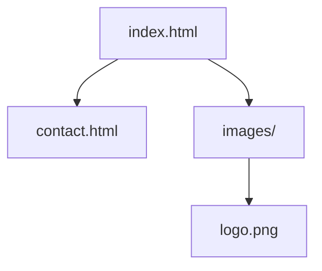
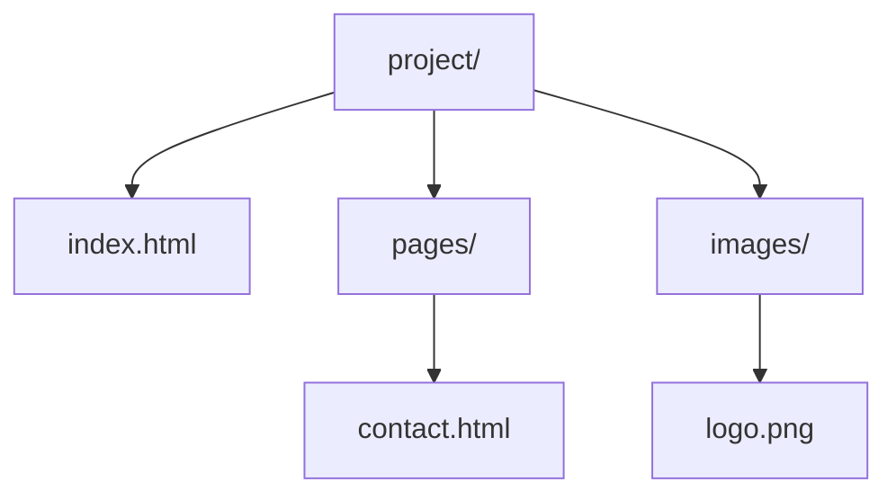
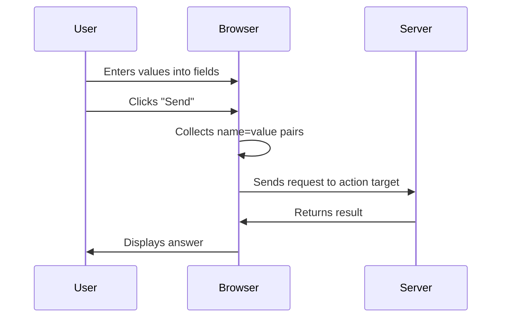

###### Topics

Lists and Links

- Creating ordered and unordered lists with ol, ul, and li
- Inserting and understanding hyperlinks with a and href
- Basic distinction between relative and absolute links

Embedding Images

- Inserting images with img
- Making sensible use of attributes like src, alt, and title
- Using simple path specifications correctly

Creating Simple Forms

- Learning the basic elements of a form with form, input, label, and button
- Building simple forms in a structured way
- Understanding the basic idea of submitting form data

<br><br><br>

# 📚 Lists and Links

Lists and links are some of the most important basics in HTML. They may seem simple at first glance, but they are a great example of how HTML **structures content** and **conveys meaning**. This is a core concept in Core Tech Fundamentals: You don’t just learn *how something looks*, but especially *what role a piece of content has within the document*. HTML thus describes the structure and meaning of a page, not primarily its design ([HTML: HyperText Markup Language](https://developer.mozilla.org/en-US/docs/Web/HTML)).

If you truly understand lists and links, you will have already developed two central skills:

1. **Logically organizing information**
2. **Connecting content**

Both are fundamental for websites, documentation, navigation, and forms.

<br><br><br>

## 📝 Creating ordered and unordered lists with `ol`, `ul`, and `li`

HTML knows two basic list types:

- **unordered lists** with `ul`
- **ordered lists** with `ol`

Each list item is created using `li`. `li` stands for **list item**. Both `ul` and `ol` use `li` for their entries ([The Unordered List element](https://developer.mozilla.org/en-US/docs/Web/HTML/Element/ul)).

### When do you use which list?

You use an **unordered list (`ul`)** when the order of the items **does not matter**. Typical examples:

- Shopping lists
- Product features
- Navigation with multiple menu items

You use an **ordered list (`ol`)** when the order **is important**. Typical examples:

- Step-by-step instructions
- Rankings
- Installation processes

### Example of an unordered list

```html
<ul>
  <li>Learn HTML</li>
  <li>Understand CSS</li>
  <li>Add JavaScript later</li>
</ul>
```

The browser typically displays bullet points. What’s important, however, is not the appearance but the semantic fact that this is a **list without a fixed order**.

### Example of an ordered list

```html
<ol>
  <li>Create file</li>
  <li>Write basic HTML skeleton</li>
  <li>Open in browser</li>
</ol>
```

Here, browsers usually show numbers. Again: It’s not about the numbers but the statement that the order matters.

### The relationship between `ul` / `ol` and `li`

An `li` normally belongs inside a list. You should think of it this way:

- `ul` = wrapper for an unordered list
- `ol` = wrapper for an ordered list
- `li` = single item inside the list

### A common misconception

Many beginners only look at what things look like and think:

> “I’ll use `ol` because I want to see numbers.”

A better approach:

> “I’ll use `ol` because the order is important in terms of meaning.”

This is a very important learning step. In HTML, you should ideally work **semantically**, not just visually.

### Comparison in a table

| Element | Meaning | Typical Use |
|---|---|---|
| `ul` | Unordered list | Features, menus, collections |
| `ol` | Ordered list | Steps, instructions, sequences |
| `li` | Single list item | Content inside `ul` or `ol` |

### Nested lists

Lists can also be nested inside each other. This is useful when you want to show main points and subpoints.

```html
<ul>
  <li>Frontend
    <ul>
      <li>HTML</li>
      <li>CSS</li>
      <li>JavaScript</li>
    </ul>
  </li>
  <li>Backend</li>
</ul>
```

This allows you to convey hierarchies. Especially when learning technical topics, this is helpful, since many subjects are organized more like a **tree** than a flat list.

<br><br><br>

## 🔗 Inserting and understanding hyperlinks with `a` and `href`

Hyperlinks are at the heart of the web. The `<a>` element is used to create links. The `href` attribute specifies **where** the link goes ([The Anchor element](https://developer.mozilla.org/en-US/docs/Web/HTML/Element/a)).

A simple link looks like this:

```html
<a href="https://developer.mozilla.org/">MDN Web Docs</a>
```

### What does `a` do?

The `a` element is the **link itself**. The text between the opening and closing tag is what users can click.

In this example:

```html
<a href="https://example.com">To the website</a>
```

is:

- `a` the HTML element for a link
- `href` the target address
- `To the website` the visible link text

### What does `href` mean?

`href` stands for **Hypertext Reference**. It holds the address to navigate to. Without `href`, an `a` element is usually not a real navigable link.

### Good link texts matter

A link’s text should clearly state where or what the link leads to. So better:

```html
<a href="contact.html">To the contact page</a>
```

rather than:

```html
<a href="contact.html">Click here</a>
```

This is not only more understandable to people but also better for accessibility and orientation ([The Anchor element](https://developer.mozilla.org/en-US/docs/Web/HTML/Element/a)).

### Links can also point to internal pages

```html
<a href="about.html">About us</a>
```

This means: Open the file `about.html`.

### Links can also contain images or other content

A link does not have to contain only text. For example, you can make an image clickable:

```html
<a href="index.html">
  
</a>
```

### Basic idea: a link is a connection

A hyperlink connects a document to another target. That target can be:

- another website
- a subpage of your project
- an image
- a document
- a section within the same page

Once you fully understand this, you grasp a core mechanism of the web: **Documents are interconnected**.

<br><br><br>

## 🧭 Basic distinction between relative and absolute links

This is a very important point because many beginners get confused here.

### Absolute linking

An **absolute URL** contains the complete web address, including protocol and domain. For example:

```html
<a href="https://www.wikipedia.org/">Wikipedia</a>
```

This is a fully specified address. The browser knows exactly which web target is meant.

### Relative linking

A **relative link** specifies the path **from the perspective of the current file or your website’s directory structure**. Example:

```html
<a href="contact.html">Contact</a>
```

Here, no full internet address is given. Instead, the link basically says:

> “Go to the file `contact.html` in the appropriate context of this project.”

### When do you use which?

**Absolute links** are generally used when you want to link to an **external website**.

**Relative links** are typically used when you're linking **within your own project**.

### Typical examples

| Type | Example | Meaning |
|---|---|---|
| Absolute | `https://example.com/about.html` | Complete internet address |
| Relative | `about.html` | File in the same folder |
| Relative | `pages/about.html` | File in a subfolder |
| Relative | `../index.html` | Move up one level, then to the file |

### Understanding a simple folder structure

Suppose your project looks like this:

```text
project/
├── index.html
├── contact.html
└── images/
    └── logo.png
```

Then:

- `contact.html` → file is in the same folder as `index.html`
- `images/logo.png` → go to the `images` folder, then to `logo.png`

### Visualization of paths



If you are in `index.html`:

- `href="contact.html"` points to `contact.html`
- `src="images/logo.png"` points to the image in the subfolder

### The principle behind relative paths

Relative paths are very useful because they make your project **more portable**. If you move the entire project folder, your internal links will often still work as long as the folder structure remains the same. This is a key practical advantage of clean project structures.

### A common error

A very frequent beginner mistake is not spelling filenames and folders exactly right. HTML paths are sensitive to:

- incorrect filenames
- incorrect folder names
- uppercase and lowercase letters on some systems
- missing or extra `/`

This illustrates an important learning principle in tech: **Precision beats guessing**. If a link doesn't work, always systematically check:

1. Does the file really exist there?
2. Is the name exactly right?
3. Is the path correct from the point of view of the current file?

<br><br><br>

# 🖼️ Embedding Images

Images make a page more visually appealing, but in HTML, it’s not just about “displaying something.” An image needs a correct source, a clear alternative description, and a sensible path. The `img` element embeds images into documents ([The Image Embed element](https://developer.mozilla.org/en-US/docs/Web/HTML/Element/img)).

<br><br><br>

## 🖼️ Inserting images with `img`

A simple image looks like this:

```html

```

### What is `img`?

`img` stands for **image**. It’s the HTML element for embedding an image.

Important: `img` is a so-called **empty element** or **void element**. It therefore usually has **no closing tag** like `</img>` ([Void element](https://developer.mozilla.org/en-US/docs/Glossary/Void_element)).

### The most important components

- `src` defines **which image file should be loaded**
- `alt` describes the image in text
- `title` can provide additional information, often as a tooltip when hovering the mouse

### Example with all three attributes

```html

```

### Why `alt` is so important

The `alt` attribute is not just “an optional nice bit of extra text.” It’s important for accessibility and for situations where the image cannot be loaded. Screen readers use the alternative text to communicate what the image is about ([The Image Embed element](https://developer.mozilla.org/en-US/docs/Web/HTML/Element/img)).

If the image is purely decorative and has no informational purpose, an empty `alt=""` is often used so that assistive technologies skip it ([Images Tutorial](https://www.w3.org/WAI/tutorials/images/)).

### What should be in `alt`?

A good `alt` text describes the **purpose** of the image, not just every optical detail.

Example:

```html

```

Not very helpful would be:

```html

```

After all, “Image” says almost nothing.

### What does `title` do?

`title` can provide an additional hint but is **not a replacement for `alt`**. That’s important. `title` is often shown by browsers as a tooltip when you hover the mouse over an element, but it’s not reliable enough to trust critical information to it alone ([HTML title global attribute](https://developer.mozilla.org/en-US/docs/Web/HTML/Global_attributes/title)).

### Comparison of attributes

| Attribute | Purpose | Importance |
|---|---|---|
| `src` | Path to image file | Essential |
| `alt` | Text alternative for content or purpose | Very important |
| `title` | Additional hint | Optional |

<br><br><br>

## 🧩 Making sensible use of attributes like `src`, `alt`, and `title`

So that you don’t just memorize these attributes but really understand them, this way of thinking helps:

### `src` = Where is the file located?

The `src` attribute contains the path to the image file.

```html

```

Here, the browser looks for the file `teamphoto.jpg` in the `images` folder.

### `alt` = What does the image mean in terms of content?

The `alt` attribute answers more the question:

> “What should a person understand if the image is not visible?”

That’s a very good rule of thumb.

### `title` = Additional note, but not required

If you use `title`, it should supplement, not repeat.

Not ideal:

```html

```

Better:

```html

```

Then each attribute serves its own purpose.

### Common mistakes with images

Some typical mistakes are:

- Forgetting `alt`
- Using the wrong path in `src`
- Confusing `title` with `alt`
- Misspelling file extensions, e.g., `.jpg` instead of `.png`
- Using spaces or special characters in file names thoughtlessly

Especially with images, you quickly realize how important a clean file structure is.

<br><br><br>

## 🧭 Using simple path specifications correctly

Image paths work the same way as for links.

### Example structure

```text
project/
├── index.html
├── pages/
│   └── contact.html
└── images/
    ├── logo.png
    └── team.jpg
```

### Embedding an image from the same level

If `index.html` is in the main folder and the image is in `images/logo.png`, then:

```html

```

### Embedding an image from a subfolder

If you are in `pages/contact.html` and the image is in `images/logo.png`, then you need to go up one level first:

```html

```

`..` means: **one folder level up**.

### Visualization of the path



From `contact.html`, the route to `logo.png` is:

1. up to `project/`
2. into `images/`
3. then `logo.png`

So the path is:

```html
../images/logo.png
```

### Practical learning tip for paths

When learning paths, don’t think in abstract strings, but as if using a file tree:

- Where am I right now?
- Where is the target?
- Do I need to go up, down, or access directly?

This is a very solid mental model and will help you later in CSS, JavaScript, build tools, and backend projects.

<br><br><br>

# 🧾 Creating Simple Forms

Forms are the interface between users and websites. Whenever anyone enters data and submits it, an HTML form is usually behind it. The `form` element is used to collect and send user input ([The Form element](https://developer.mozilla.org/en-US/docs/Web/HTML/Element/form)).

Forms are a particularly good topic for learning basic technical thinking because multiple layers come together here:

- Structure in HTML
- Assigning labels
- Data collection
- Sending to a target
- Difference between display and processing

So this is a classic Core Tech topic.

<br><br><br>

## 🧱 Learning the basic elements of a form with `form`, `input`, `label`, and `button`

A very simple form can look like this:

```html
<form>
  <label for="name">Name:</label>
  <input id="name" name="name" type="text">

  <button type="submit">Send</button>
</form>
```

### What does `form` do?

`form` is the wrapper of the entire form. Everything that belongs to this form area resides inside this element.

### What does `input` do?

`input` is an input field. Depending on the `type`, it can have various functions, such as:

- Enter text
- Enter email address
- Enter password
- Select a checkbox

Example:

```html
<input type="text">
<input type="email">
<input type="password">
```

Possible input types are defined in the HTML standard, and browsers support relevant helpers and validations depending on the type ([The Input element](https://developer.mozilla.org/en-US/docs/Web/HTML/Element/input)).

### What does `label` do?

`label` is the label for an input field. This is extremely important because it lets users know **what they should enter**. Also, a correctly linked `label` improves usability and accessibility ([The Label element](https://developer.mozilla.org/en-US/docs/Web/HTML/Element/label)).

The linkage works via:

- `for` in the `label`
- `id` in the matching `input`

Example:

```html
<label for="email">Email:</label>
<input id="email" name="email" type="email">
```

Here, the label “Email:” belongs precisely to this field.

### What does `button` do?

A `button` is a clickable button. In forms, it's often used for submission.

```html
<button type="submit">Send</button>
```

`type="submit"` means: The form should be submitted.

### Why `name` is important for `input`

Although your bullet list mostly mentions `form`, `input`, `label`, and `button`, one attribute absolutely belongs in your foundational understanding: `name`.

```html
<input id="name" name="name" type="text">
```

The `name` is the **key** under which the value will be transferred when the form is submitted. Without `name`, the field's value typically won't be sent as form data ([The Input element](https://developer.mozilla.org/en-US/docs/Web/HTML/Element/input)).

That's a very important technical relationship.

<br><br><br>

## 🏗️ Building simple forms in a structured way

A form should not be a random collection of fields. A good structure helps with readability, usability, and maintainability.

### Simple example of a structured form

```html
<form action="/send" method="post">
  <div>
    <label for="firstname">First name:</label>
    <input id="firstname" name="firstname" type="text">
  </div>

  <div>
    <label for="email">Email:</label>
    <input id="email" name="email" type="email">
  </div>

  <div>
    <button type="submit">Send form</button>
  </div>
</form>
```

### What is structured here?

Each field consists of:

1. a label
2. an input element
3. a clear grouping

This makes the code easier to read. Even if this initially looks plain, the HTML structure is already clean.

### Why `action` and `method` are important

The `form` element can have two especially important attributes:

- `action`
- `method`

Example:

```html
<form action="/send" method="post">
```

#### `action`

`action` specifies **where** the form data should be sent.

#### `method`

`method` specifies **how** the data will be sent. The most commonly used variants are `get` and `post` ([The Form element](https://developer.mozilla.org/en-US/docs/Web/HTML/Element/form)).

### Basic difference between `get` and `post`

#### `get`

With `get`, data is generally sent as part of the URL. This often looks like:

```text
/search?query=html
```

This is practical for search forms or content that you want to share via URL.

#### `post`

With `post`, the data is sent in the HTTP request body, not visible in the URL. This is often used when forms genuinely submit data, such as for signups, logins, or contact forms ([HTTP request methods](https://developer.mozilla.org/en-US/docs/Web/HTTP/Methods)).

It's important: `post` does not automatically mean “secure,” but does mean the data does not appear directly in the URL.

### Good basic structure for beginners

A helpful rule of thumb:

- `form` = the entire form wrapper
- `label` = indicates what is expected
- `input` = collects the input
- `name` = name of the data field when sending
- `button` = initiates an action, usually send

If you truly understand these five building blocks, you already have a very good grasp of the basic principle of forms.

<br><br><br>

## 📤 Understanding the basic idea of submitting form data

Now comes the most important conceptual step: What does “submit a form” actually mean?

When a user enters something in a form and clicks **Send**, in simplified terms the following happens:

1. The browser collects the values from the form fields.
2. It pairs them according to their `name` attributes.
3. It sends this data to the target specified in `action`.
4. The receiver, usually a server, processes the data.

### Example

```html
<form action="/register" method="post">
  <label for="username">Username:</label>
  <input id="username" name="username" type="text">

  <label for="email">Email:</label>
  <input id="email" name="email" type="email">

  <button type="submit">Sign up</button>
</form>
```

If a user enters:

- Username: `max`
- Email: `max@example.com`

then the core data sent will use the keys `username` and `email`.

### Why is `name` so crucial here?

The server doesn’t care about the `id` used for labeling; it cares mainly about the field names sent. That's why `name` is technically so important.

### Simplified data flow



### A concrete GET example

```html
<form action="/search" method="get">
  <label for="q">Search:</label>
  <input id="q" name="q" type="text">
  <button type="submit">Search</button>
</form>
```

If someone enters `html`, a URL could be created like:

```text
/search?q=html
```

The field with `name="q"` is thus transmitted together with the entered value.

### A concrete POST example

```html
<form action="/contact" method="post">
  <label for="message">Message:</label>
  <input id="message" name="message" type="text">
  <button type="submit">Send</button>
</form>
```

Here, the data is sent to `/contact`, typically not directly visible in the URL.

### Very important for your technical understanding

An HTML form does **not** process the data itself. It **collects and sends** it. The actual processing usually happens elsewhere, for example:

- on a server
- in a server application
- sometimes via JavaScript

This is a key architectural principle on the web: HTML describes and hands off data, but does not compute or store it on its own in terms of application logic.

### Common beginner mistakes with forms

A few mistakes show up especially often:

- `label` not linked with `input`
- `name` missing
- `button` doesn’t have the intended type
- `action` points to a wrong target
- `method` not chosen deliberately
- Fields are unclearly labeled

### Good learning attitude with forms

Forms are a perfect topic to practice “real learning” in tech. Instead of learning tags by heart, you should always understand the function of each part:

- What collects data?
- What labels data?
- What names data?
- What sends data?
- Where is data sent?
- In what form is data sent?

If you learn this way, you build real system understanding. And that is far more valuable in the long run than just memorizing syntax fragments.

<br><br><br>

## 🔧 The interplay of all fundamentals in a small complete example

So you can see how these topics connect, here’s a small HTML page with a list, link, image, and form:

```html
<!DOCTYPE html>
<html lang="en">
<head>
  <meta charset="UTF-8">
  <title>HTML Basics</title>
</head>
<body>
  <h1>HTML Basics</h1>

  <h2>List of Topics</h2>
  <ul>
    <li>Understanding lists</li>
    <li>Creating links</li>
    <li>Embedding images</li>
    <li>Creating forms</li>
  </ul>

  <h2>Useful Link</h2>
  <p>
    <a href="https://developer.mozilla.org/">To MDN documentation</a>
  </p>

  <h2>Image</h2>
  

  <h2>Contact Form</h2>
  <form action="/contact" method="post">
    <div>
      <label for="name">Name:</label>
      <input id="name" name="name" type="text">
    </div>

    <div>
      <label for="email">Email:</label>
      <input id="email" name="email" type="email">
    </div>

    <div>
      <button type="submit">Send</button>
    </div>
  </form>
</body>
</html>
```

In this example, you can clearly see:

- Lists structure content
- Links connect pages or resources
- Images embed media
- Forms collect and send input

These are not isolated topics, but building blocks of the same basic idea: HTML describes the **meaning and structure** of a web document.