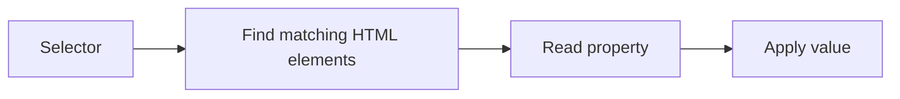
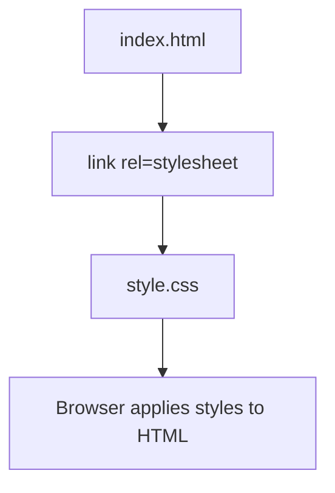

###### Topics

CSS Basics and Syntax

- Understand the structure of a CSS rule with selector, property, and value
- Integrate CSS into HTML internally and externally

Basic CSS Selectors and Colors

- Apply element, class, and ID selectors
- Use colors with simple color values such as names, hex, or RGB

Text Styling with CSS

- Adjust font size, font style, font weight, and line height
- Make text more readable and clear with CSS

<br><br><br>
# 🎨 CSS Basics and Syntax

CSS stands for **Cascading Style Sheets** and is the language you use to style the appearance of HTML content. While HTML primarily describes the **structure** of a page, CSS takes care of the **presentation**: colors, spacing, font sizes, layouts, and much more. CSS works in a rule-based manner: you write rules, and the browser applies these rules to the appropriate HTML elements ([What is CSS?](https://developer.mozilla.org/en-US/docs/Learn_web_development/Core/Styling_basics/What_is_CSS)).

<br><br><br>
## 🧱 Understanding the Structure of a CSS Rule with Selector, Property, and Value

At its core, a CSS rule consists of three things:

1. **Selector**
2. **Property**
3. **Value**

Here’s the basic form:

```css
selector {
  property: value;
}
```

A simple example:

```css
p {
  color: blue;
}
```

This means:

- `p` is the **selector**
- `color` is the **property**
- `blue` is the **value**

So, the rule says:  
**“All `<p>` elements should be displayed in blue.”** ([CSS Syntax](https://developer.mozilla.org/en-US/docs/Web/CSS/Syntax))

<br><br><br>
### 🔍 Explaining the Components Simply

| Component   | Meaning                          | Example      | Explanation               |
|-------------|----------------------------------|--------------|---------------------------|
| Selector    | Picks **which HTML element** to style | `p`          | All paragraphs            |
| Property    | Specifies **what** should be changed | `color`      | Text color                |
| Value       | Specifies **how** it should look      | `blue`       | Blue color                |

You can think of a CSS rule as a sentence:

> **“For this element, this property should get this value.”**

Another example:

```css
h1 {
  font-size: 32px;
}
```

This means:  
All `<h1>` headings should have a font size of `32px` ([font-size](https://developer.mozilla.org/en-US/docs/Web/CSS/font-size)).

<br><br><br>
### 🧩 The Structure of a CSS Rule

```css
p {
  color: red;
  font-size: 18px;
  line-height: 1.5;
}
```

Here, the same principle is applied several times:

- `p` is the selector
- `color: red;` is a property-value assignment
- `font-size: 18px;` is another one
- `line-height: 1.5;` is yet another

Important points:

- Curly braces `{ }` contain all style rules for the selector.
- There is **always a colon** `:` between property and value.
- Each line usually ends with a **semicolon** `;`.
- Multiple properties for the same selector are listed within the same rule ([CSS Syntax](https://developer.mozilla.org/en-US/docs/Web/CSS/Syntax)).

Especially early on, small syntax errors are common, such as forgetting a semicolon or a closing bracket. The browser may ignore parts of the code as a result. That’s why it pays to always write clean and orderly CSS.

<br><br><br>
### 🧠 A Mental Picture: How the Browser Works



Put simply, the browser asks:

1. **Who should I style?** → Selector  
2. **What should I change?** → Property  
3. **What value should I set?** → Value

<br><br><br>
### ✍️ A Complete Example with HTML and CSS

```html
<p>This is a paragraph.</p>
```

```css
p {
  color: green;
  font-size: 20px;
}
```

Result:

- The paragraph text is **green**
- The font is **larger**

The crucial point:  
CSS does not change the actual content, only the **presentation** of the content.

<br><br><br>
## 🔗 Integrating CSS Internally and Externally in HTML

For CSS to take effect, it must be linked to your HTML document. For your basics, two variants are especially important:

- **Internal CSS**
- **External CSS**

<br><br><br>
### 🏠 Internal CSS

Internal CSS is written directly in the HTML file, within a `<style>` element, usually in the `<head>` section. The `<style>` element is specifically for embedding style information in an HTML document ([The Style Information element](https://developer.mozilla.org/en-US/docs/Web/HTML/Element/style)).

Example:

```html
<!DOCTYPE html>
<html lang="en">
<head>
  <meta charset="UTF-8">
  <title>Internal CSS</title>
  <style>
    p {
      color: blue;
      font-size: 18px;
    }
  </style>
</head>
<body>
  <p>This text is blue.</p>
</body>
</html>
```

Here, HTML and CSS are in the **same file**.

**When is internal CSS practical?**  
For example:

- When you want to test something quickly
- For very small sample pages
- When learning, to see HTML and CSS directly together

For larger projects, it quickly becomes confusing because structure and style are heavily mixed.

<br><br><br>
### 🌍 External CSS

External CSS is placed in a **separate file**, such as `style.css`. You then link this file to your HTML page using a `<link>` element. The `<link>` element connects the HTML document with an external resource like a stylesheet ([The External Resource Link element](https://developer.mozilla.org/en-US/docs/Web/HTML/Element/link)).

HTML file:

```html
<!DOCTYPE html>
<html lang="en">
<head>
  <meta charset="UTF-8">
  <title>External CSS</title>
  <link rel="stylesheet" href="style.css">
</head>
<body>
  <p>This text gets its styling from an external CSS file.</p>
</body>
</html>
```

CSS file `style.css`:

```css
p {
  color: purple;
  font-size: 18px;
}
```

This is the **most important and cleanest way** in real work, because it keeps structure and presentation clearly separated.

**Advantages of external CSS:**

- The code is more organized.
- Multiple HTML pages can share the same CSS file.
- Changes to one CSS file affect many pages at once.
- Maintenance and extension are much easier.

Especially for proper learning, external CSS is very helpful, as you understand early on that HTML and CSS have different roles:  
HTML describes **what something is**, CSS describes **how it looks**.

<br><br><br>
### ⚖️ Internal and External Integration Compared

| Variant | Where is the CSS? | Advantage | Disadvantage |
|---|---|---|---|
| Internal | In the same HTML file, in the `<style>` block | Fast for small tests | Becomes confusing for larger pages |
| External | In a separate `.css` file | Clean, reusable, professional | You must link file and path correctly |

If you want to seriously learn CSS, you should **understand both** but switch to **external CSS files** as early as possible.

<br><br><br>
### 🗺️ How HTML and CSS Are Connected



The browser first loads your HTML, finds the reference to the CSS file, and then uses these rules for rendering.

<br><br><br>
# 🎯 Basic CSS Selectors and Colors

Once you know how CSS rules are structured, the next important question is:

**Which elements should a rule apply to?**

That’s exactly what you need **selectors** for.  
And once you’ve selected the right elements, you can style them using properties like `color` or `background-color`.

<br><br><br>
## 🏷️ Applying Element, Class, and ID Selectors

The three most important base selectors are:

- **Element selector**
- **Class selector**
- **ID selector**

With these three, you can get very far in the beginning.

<br><br><br>
### 📄 Element Selector

An element selector targets a specific HTML element, such as `p`, `h1`, or `button`. These selectors are also called **type selectors** in CSS ([Type selectors](https://developer.mozilla.org/en-US/docs/Web/CSS/Type_selectors)).

Example:

```css
p {
  color: black;
}
```

This means:  
All `<p>` elements on the page are targeted.

HTML:

```html
<p>First paragraph</p>
<p>Second paragraph</p>
```

Both paragraphs get the same rule.

The element selector is useful when you want to **style all elements of a certain type the same way**. For example:

- all paragraphs
- all headings of a certain level
- all list items

<br><br><br>
### 🧷 Class Selector

A class selector starts with a dot, like `.important`. It targets elements in HTML that have the corresponding `class` attribute ([Class selectors](https://developer.mozilla.org/en-US/docs/Web/CSS/Class_selectors)).

HTML:

```html
<p class="important">This paragraph is important.</p>
<p>This paragraph is normal.</p>
```

CSS:

```css
.important {
  color: red;
  font-weight: bold;
}
```

Only the paragraph with `class="important"` is displayed in bold red.

Classes are especially important because you can **reuse them multiple times**. The `class` attribute is specifically intended for grouping elements and styling them collectively ([class](https://developer.mozilla.org/en-US/docs/Web/HTML/Global_attributes/class)).

This makes classes extremely useful in practice. For example, you could label multiple elements as "important," "note," "button," or "card."

<br><br><br>
### 🆔 ID Selector

An ID selector begins with a hash sign, e.g., `#header`. It targets an element with a specific `id` attribute ([ID selectors](https://developer.mozilla.org/en-US/docs/Web/CSS/ID_selectors)).

HTML:

```html
<h1 id="main-title">Welcome</h1>
```

CSS:

```css
#main-title {
  color: darkblue;
}
```

Important:  
An `id` should be **unique** within an HTML document, meaning it should only occur once ([id](https://developer.mozilla.org/en-US/docs/Web/HTML/Global_attributes/id)).

That’s why IDs are mostly used for single, special areas or unique elements, such as:

- Main navigation
- Page header
- A specific section
- A single title

<br><br><br>
### 📊 Comparison: The Three Selectors Side by Side

| Selector Type | Syntax      | Selects                        | Typical Use Case                          |
|---------------|-------------|-------------------------------|-------------------------------------------|
| Element       | `p`         | All elements of that type     | Style all paragraphs alike                |
| Class         | `.info`     | All elements with that class  | Reusable styles                           |
| ID            | `#logo`     | The unique element with that ID | Single, special elements                  |

A very important learning point here:  
**Classes are intended for reuse, IDs for uniqueness.**  
If you understand this early, you’ll usually write cleaner CSS automatically.

<br><br><br>
### 🧪 Example: Using All Three Selectors Together

HTML:

```html
<h1 id="page-title">Learn CSS</h1>

<p>This is a normal paragraph.</p>
<p class="note">This is a note.</p>
<p class="note">Another note.</p>
```

CSS:

```css
p {
  color: #333;
}

.note {
  color: orange;
  font-style: italic;
}

#page-title {
  color: navy;
}
```

What happens here?

- All `<p>` elements get a dark text color.
- All elements with the class `.note` are additionally orange and italic.
- The element with the ID `#page-title` is navy blue.

You can already see an important principle here:  
Multiple rules can affect the same element. Which rule finally wins depends, among other things, on **specificity**. ID selectors are more specific than class selectors, and classes are more specific than element selectors ([Specificity](https://developer.mozilla.org/en-US/docs/Web/CSS/Specificity)).

For now, remember:

- Element = general
- Class = more targeted
- ID = very targeted

<br><br><br>
## 🌈 Using Colors with Simple Values such as Names, Hex, or RGB

In CSS, you can specify colors in various ways. The `color` property sets the **text color**, `background-color` sets the **background color** ([color](https://developer.mozilla.org/en-US/docs/Web/CSS/color), [background-color](https://developer.mozilla.org/en-US/docs/Web/CSS/background-color)).

A simple example:

```css
p {
  color: blue;
  background-color: lightgray;
}
```

There are many options for color values. For starters, these three are particularly important:

- **Color names**
- **Hex values**
- **RGB values**

<br><br><br>
### 🎨 Colors via Names

CSS recognizes many built-in color names such as `red`, `blue`, `green`, `black`, `white`, or `orange` ([Named colors](https://developer.mozilla.org/en-US/docs/Web/CSS/named-color)).

Example:

```css
h1 {
  color: red;
}
```

This is very easy to read and convenient for beginners. The disadvantage is that you can’t specify every shade precisely this way.

<br><br><br>
### 🧮 Colors with Hex Values

Hex colors start with `#` and usually consist of six hexadecimal characters, for example `#ff0000`. Two characters each stand for:

- Red
- Green
- Blue

So `#ff0000` means:

- Red = `ff` = maximum red
- Green = `00` = no green
- Blue = `00` = no blue

Result: **pure red** ([hex-color](https://developer.mozilla.org/en-US/docs/Web/CSS/hex-color)).

Examples:

```css
p {
  color: #333333;
}

h1 {
  color: #0066cc;
}
```

Hex values are common for:

- Text colors
- Background colors
- Brand colors
- UI design

Hex is very prevalent in web development because it’s compact and easy to copy, compare, and document.

<br><br><br>
### 🔢 Colors with RGB Values

RGB stands for **Red, Green, Blue**. You specify three numbers, each usually in the range `0` to `255` ([rgb()](https://developer.mozilla.org/en-US/docs/Web/CSS/color_value/rgb)).

Example:

```css
p {
  color: rgb(255, 0, 0);
}
```

This means:

- Red = 255
- Green = 0
- Blue = 0

So, again: **Red**

Another example:

```css
h2 {
  color: rgb(0, 102, 204);
}
```

RGB is especially useful when you want to mix colors systematically or compare them in design tools.

<br><br><br>
### 🆚 Names, Hex, and RGB Compared

| Syntax      | Example         | Advantage              | Disadvantage                 |
|-------------|----------------|------------------------|------------------------------|
| Color name  | `blue`         | Very easy to read      | Less precise                 |
| Hex         | `#0000ff`      | Compact, very common   | Unfamiliar at first for beginners |
| RGB         | `rgb(0, 0, 255)` | Easy to understand and systematic | A bit longer to write        |

All three options are valid CSS color values ([<color>](https://developer.mozilla.org/en-US/docs/Web/CSS/color_value)).

A good learning order for beginners:

1. Understand color names
2. Learn to read hex values
3. Grasp RGB as a color model

This way, you do not just memorize syntax, but also understand the logic behind digital colors.

<br><br><br>
### 🖍️ Practical Color Example

HTML:

```html
<h1 class="title">Welcome</h1>
<p class="text">CSS makes design possible.</p>
```

CSS:

```css
.title {
  color: #1d4ed8;
}

.text {
  color: rgb(55, 65, 81);
}
```

Here, the title gets a strong blue tone, while the body text receives a dark gray. This is particularly important in real projects:  
Not every color should be bright. Good design often uses **clear contrasts** and **calm text colors**.

<br><br><br>
# ✍️ Text Styling with CSS

Text is the most important information carrier on many websites. That’s why it's worth seeing CSS for text not just as "visual decoration," but as a tool for **readability**, **structure**, and **orientation**.

If text is poorly styled, a page quickly becomes exhausting:

- too small
- too tight
- too bright
- too bold
- too busy

You can improve this a lot with just a few CSS properties.

<br><br><br>
## 🔤 Adjusting Font Size, Font Style, Font Weight, and Line Height

The most important properties for your basics are:

- `font-size`
- `font-style`
- `font-weight`
- `line-height`

<br><br><br>
### 📏 `font-size` – Font Size

Use `font-size` to set how large the text appears ([font-size](https://developer.mozilla.org/en-US/docs/Web/CSS/font-size)).

Example:

```css
p {
  font-size: 18px;
}
```

This makes body text larger.

Typical values include:

- `16px` for normal body text
- `20px`, `24px`, `32px` or more for headings

You’ll often see units like `px`, `em`, or `rem` with `font-size`. For beginners, `px` is easiest to understand because it specifies a fixed size. Later, it’s well worth learning `rem`, as it is more flexible and accessible in many projects ([font-size](https://developer.mozilla.org/en-US/docs/Web/CSS/font-size)).

Important:  
Font size is not just a design choice, but also about usability. Text that’s too small is hard to read.

<br><br><br>
### 🖋️ `font-style` – Font Style

Use `font-style` to control whether text appears normal or italic ([font-style](https://developer.mozilla.org/en-US/docs/Web/CSS/font-style)).

Example:

```css
em {
  font-style: italic;
}
```

Or:

```css
.note {
  font-style: italic;
}
```

Common values are:

- `normal`
- `italic`

Italics can be useful to emphasize certain terms or notes. Too much italic text, however, can make longer texts harder to read, especially on smaller screens.

<br><br><br>
### 💪 `font-weight` – Font Weight

Use `font-weight` to set how light or bold text appears ([font-weight](https://developer.mozilla.org/en-US/docs/Web/CSS/font-weight)).

Example:

```css
strong {
  font-weight: bold;
}
```

Or with numeric values:

```css
h1 {
  font-weight: 700;
}
```

Typical values:

- `normal`
- `bold`
- `400` usually equals normal
- `700` usually equals bold

These numeric values may seem technical at first, but they’re very practical. Many fonts offer multiple weights, and CSS can target these specifically.

Important for good learning:  
**Bold** should serve a purpose. If everything is bold, nothing is truly emphasized.

<br><br><br>
### 📐 `line-height` – Line Height

Use `line-height` to control the vertical spacing between lines of text ([line-height](https://developer.mozilla.org/en-US/docs/Web/CSS/line-height)).

Example:

```css
p {
  line-height: 1.5;
}
```

This is a very important property for readability. If lines are too close together, text looks cramped. If they’re too far apart, the text loses coherence.

MDN often recommends at least `1.5` for body text to improve readability ([line-height](https://developer.mozilla.org/en-US/docs/Web/CSS/line-height)).

Unitless values like `1.5` are particularly handy in CSS because they adapt to the current font size. That means:

- For smaller text, the line height is proportionally smaller
- For larger text, it’s proportionally larger

This is often more elegant than fixed pixel values.

<br><br><br>
### 🧾 Overview of the Most Important Text Properties

| Property       | Purpose             | Example              | Effect                          |
|----------------|--------------------|----------------------|---------------------------------|
| `font-size`    | Size of the text   | `font-size: 18px;`   | Text becomes larger or smaller  |
| `font-style`   | Style of the text  | `font-style: italic;`| Text becomes italicized         |
| `font-weight`  | Thickness of text  | `font-weight: 700;`  | Text becomes bolder             |
| `line-height`  | Line spacing       | `line-height: 1.5;`  | Text becomes airier and easier to read |

These four properties are true core tools in CSS. If you master them, you can style text very effectively and thoughtfully.

<br><br><br>
### 🧪 Example of Text Styling

```css
p {
  font-size: 18px;
  font-style: normal;
  font-weight: 400;
  line-height: 1.6;
}
```

This combination usually yields well-readable body text:

- not too small
- not unnecessarily italicized
- not too bold
- with a pleasant line spacing

For headings, it might look like this:

```css
h1 {
  font-size: 32px;
  font-weight: 700;
  line-height: 1.2;
}
```

Why is the line height smaller here?  
Because headings are usually short. They often require less line spacing than body text. Body text, in contrast, should be calm and easy to read.

<br><br><br>
## 📚 Making Text More Readable and Clear with CSS

Good text styling is not just about setting any font size. The point is that people can **quickly grasp content**, **read comfortably**, and **orient themselves visually**.

A few basic principles help with this.

<br><br><br>
### 👀 1. Use Sufficient Font Size

Very small text often looks modern or "compact," but in practice is quickly uncomfortable. A well-readable size is essential for normal body text. CSS gives you exactly this tool with `font-size` ([font-size](https://developer.mozilla.org/en-US/docs/Web/CSS/font-size)).

Example:

```css
body {
  font-size: 16px;
}
```

Or for even more readable text:

```css
p {
  font-size: 18px;
}
```

On screens, readability is more important than "cramming as much in as possible."

<br><br><br>
### 📏 2. Provide Adequate Line Spacing

Good line spacing makes text calmer. This is especially important for longer paragraphs. MDN explicitly points out that a line height of at least `1.5` for body text improves readability ([line-height](https://developer.mozilla.org/en-US/docs/Web/CSS/line-height)).

Example:

```css
p {
  line-height: 1.5;
}
```

Or even airier:

```css
p {
  line-height: 1.7;
}
```

If you read text and feel like "everything is smushed together," the line height is often too small.

<br><br><br>
### 🎯 3. Ensure Contrast Between Text and Background

Text must stand out well against the background. Usually, the WCAG guidelines recommend a contrast ratio of at least **4.5:1** for normal text, and at least **3:1** for large text ([Understanding Success Criterion 1.4.3: Contrast (Minimum)](https://www.w3.org/WAI/WCAG21/Understanding/contrast-minimum.html)).

A good example:

```css
body {
  color: #222;
  background-color: #fff;
}
```

A problematic example would be very light gray text on a white background because the difference is too small.

This is not just about design, but real accessibility. People with limited vision, low-quality screens, or bright ambient light directly benefit.

<br><br><br>
### 🧱 4. Clearly Distinguish Headings and Body Text

If headings and normal text look almost the same, the page loses structure. You can create clear hierarchies with `font-size` and `font-weight`.

Example:

```css
h1 {
  font-size: 32px;
  font-weight: 700;
}

h2 {
  font-size: 24px;
  font-weight: 600;
}

p {
  font-size: 18px;
  font-weight: 400;
  line-height: 1.6;
}
```

You can immediately see:

- What is the main heading?
- What is a subheading?
- What is regular reading text?

This visual order is a central part of good information presentation.

<br><br><br>
### 🪶 5. Use Emphasis Sparingly

CSS can easily make text bold, italic, colorful, or bigger. But that’s why restraint is important.

If you use too many at once, for example:

- bold
- italic
- red
- underlined
- large

the text quickly looks chaotic.

It’s much better to use:

- **bold** for important terms
- **bigger** for headings
- **color** for subtle support
- **italics** only occasionally and deliberately

Good CSS doesn’t make text louder, but clearer.

<br><br><br>
### 📐 6. Limit Text Width So Lines Stay Comfortable to Read

This is often underestimated: if text spans the full screen width, it gets harder to read. With CSS, you can limit the width of a text block.

Example:

```css
article {
  max-width: 65ch;
}
```

The unit `ch` is roughly based on the width of the "0" digit and is very useful for text widths ([length](https://developer.mozilla.org/en-US/docs/Web/CSS/length)).

Why does this help?  
Because when reading, your eyes have to jump back to the beginning after each line. If lines are very long, this is harder to do.

<br><br><br>
### 🧭 7. Add Spacing Between Text Blocks

Readability arises not only within a line, but also between paragraphs, headings, and other text blocks. If everything is too close together, the page appears cramped and unstructured.

Example:

```css
p {
  line-height: 1.6;
  margin-bottom: 16px;
}

h2 {
  margin-top: 32px;
  margin-bottom: 12px;
}
```

Here, you’re not directly styling the letters, but the **visual organization**. That’s what makes good CSS: it ensures not just a pretty look, but understandable structure.

<br><br><br>
### 🧪 A Complete Example of Readable Text

```html
<article class="content">
  <h1>CSS Makes Text More Readable</h1>
  <p>
    With CSS, you can specifically control font sizes, line heights, and emphasis.
    This makes text not just prettier, but above all clearer and easier to read.
  </p>
  <p class="note">
    Sufficient contrast and good line spacing are especially important.
  </p>
</article>
```

```css
.content {
  max-width: 65ch;
  color: #222;
  background-color: #fff;
}

.content h1 {
  font-size: 32px;
  font-weight: 700;
  line-height: 1.2;
}

.content p {
  font-size: 18px;
  font-weight: 400;
  line-height: 1.6;
  margin-bottom: 16px;
}

.note {
  color: #0f4c81;
  font-style: italic;
}
```

Why this is good:

- The text block is not too wide.
- The contrast is good.
- The heading stands out clearly.
- The paragraphs are easy to read.
- The note is styled differently, but not excessively so.

This is exactly how you should learn CSS basics:  
not as a set of isolated commands, but as tools that together create good presentation.

<br><br><br>
### 🧠 How You Should Remember These CSS Basics

If you truly want to understand CSS, this model helps:

- **Selectors** answer: *Which element do I mean?*
- **Properties** answer: *What do I want to change?*
- **Values** answer: *How exactly should it look?*

And for text styling additionally:

- **Font size** controls visibility
- **Font weight** controls emphasis
- **Font style** controls tone and highlight
- **Line height** controls reading flow
- **Colors** control orientation and contrast

With this approach, you’ve not only memorized CSS, but started to understand it as a design system.