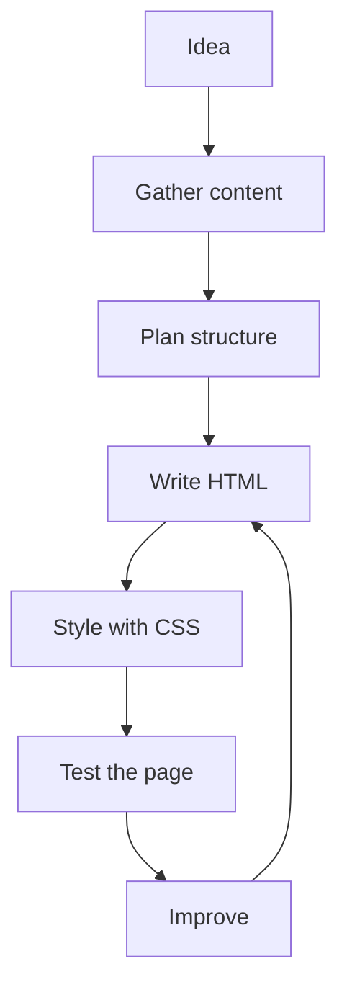
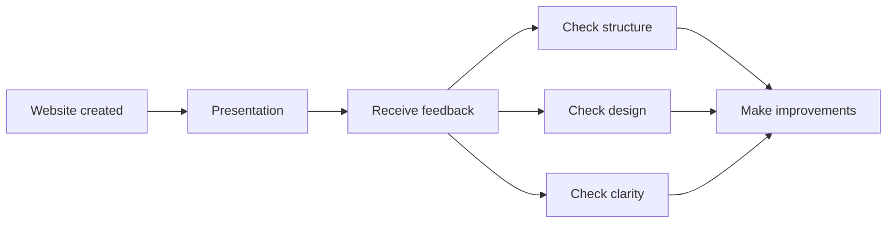

###### Topics

Project Implementation

- Planning and developing your own simple website
- Applying HTML and CSS basics in a mini project
- Structuring and designing content

Presentation and Reflection

- Briefly presenting your own project work
- Reflecting on your own implementation
- Exchanging feedback on structure, design, and clarity

<br><br><br>

# 🚀 Project Implementation

When you plan and implement a **simple website of your own**, it's not just about “building something with HTML and CSS.” In reality, you’re learning several very important fundamentals of computer science and web development all at once:

- **planning a project sensibly**
- **structuring content logically**
- **building a clean foundation with HTML**
- **using CSS to purposefully design the look**
- **making decisions deliberately and being able to explain them later**

A small website is a very good mini-project because it lets you experience the entire process of a technical project with a manageable example: from the idea to the finished presentation.

Often, this is exactly the most important learning step: not just writing code, but understanding **why you build something in a certain way**.

<br><br><br>

## 🧭 Planning and Developing Your Own Simple Website

Before you write HTML tags or pick colors, you need a **clear plan**. Especially beginners often make the mistake of just jumping into the code. That feels productive but often leads to a confusing site, or you end up having to rebuild everything again.

A good plan doesn’t mean you have to spend hours on theory. It’s enough if you answer these three simple questions:

1. **What is my website about?**
2. **Who is the website for?**
3. **Which content should people see and understand right away?**

If you can answer these questions, everything else becomes much easier.

### 🧠 What Matters in Planning

A simple website usually needs a clear core. For example:

- a personal introduction page
- a hobby page
- a small portfolio site
- an info page on a topic
- a project page about a self-created product or learning project

It’s important not to take on too much at once. A mini-project should be **manageable**. That makes sense academically because you learn best by focusing on a few core skills and implementing them cleanly.

A typical plan for a small website might look like this:

| Step | Question | Result |
|---|---|---|
| Determine topic | What is the topic of the site? | Clear project idea |
| Define goal | What should visitors understand or do? | Purpose of the site |
| Gather content | What texts, images, info do I need? | Raw material |
| Plan structure | What sections does the page need? | Page layout |
| Set design roughly | What colors, font sizes, spaces fit? | Visual direction |
| Implement | Write HTML + CSS | Functioning site |
| Review | Is everything understandable, readable, and logical? | Improved version |

### 🗂️ Typical Basic Structure of a Simple Website

A simple website often consists of just a few, clearly defined sections. That’s actually a good thing because it helps visitors find their way quickly.

For example:

- **Header** with title or name
- **Introduction** with a short overview
- **Main content** with information
- **optionally an image or small gallery**
- **Contact or closing section**
- **Footer** with additional info

HTML even offers semantic elements like `<header>`, `<main>`, `<section>`, and `<footer>` designed to make a page’s structure clear ([HTML elements reference](https://developer.mozilla.org/en-US/docs/Web/HTML/Element)).

This is important because a website should not only look good visually for people, but also be clearly structured for browsers, search engines, and assistive technologies. A logically structured page is not just “neat” but also technically sensible.

### 🧱 From Plan to Implementation

Developing a website is usually not a straight path, but rather a small cycle:



This is an important learning point: **Web development is iterative**. You build something, look at it, spot problems, and improve it. That's exactly how professionals work.

For example, if you notice your headline is too long, a text block feels too wide, or an image is badly placed, that’s not a negative “mistake” but a normal part of the development process.

<br><br><br>

## 🧩 Applying HTML and CSS Basics in a Mini Project

HTML and CSS have different jobs. Understanding this distinction clearly is one of the most important fundamentals.

**HTML** is responsible for the **structure and meaning** of the content.  
**CSS** is responsible for the **appearance and layout**.

MDN describes HTML as a markup language for structuring content and CSS as a style sheet language for describing the presentation of documents ([HTML: HyperText Markup Language](https://developer.mozilla.org/en-US/docs/Web/HTML), [CSS: Cascading Style Sheets](https://developer.mozilla.org/en-US/docs/Web/CSS)).

Many beginners mentally mix these two levels. But learning is much easier if you clearly separate them:

- HTML answers: **What is this?**
- CSS answers: **How does it look?**

### 🏗️ HTML Basics Explained Clearly

HTML is made up of elements that structure the content. Typical basic elements include:

- Headings like `<h1>`, `<h2>`
- Paragraphs with `<p>`
- Images with ``
- Links with `<a>`
- Lists with `<ul>` or `<ol>`
- Sections such as `<header>`, `<main>`, `<section>`, `<footer>`

A simple basic HTML structure might look like this:

```html
<!DOCTYPE html>
<html lang="de">
<head>
  <meta charset="UTF-8">
  <meta name="viewport" content="width=device-width, initial-scale=1.0">
  <title>Meine Webseite</title>
  <link rel="stylesheet" href="style.css">
</head>
<body>
  <header>
    <h1>Willkommen auf meiner Webseite</h1>
    <p>Hier stelle ich mein Projekt vor.</p>
  </header>

  <main>
    <section>
      <h2>Über mich</h2>
      <p>Ich interessiere mich für Webentwicklung und Gestaltung.</p>
    </section>

    <section>
      <h2>Mein Projekt</h2>
      <p>In diesem Mini-Projekt habe ich eine einfache Webseite erstellt.</p>
    </section>
  </main>

  <footer>
    <p>© 2026 Meine Webseite</p>
  </footer>
</body>
</html>
```

You can clearly see the difference between content and design here: The HTML defines **what content exists and how it’s organized**, but not yet how everything actually looks.

### 🎨 CSS Basics Explained Clearly

CSS styles the HTML structure. With it, you can define for example:

- Colors
- Fonts
- Spacing
- Widths
- Borders
- Backgrounds
- Arrangement of elements

A simple example:

```css
body {
  font-family: Arial, sans-serif;
  background-color: #f5f7fb;
  color: #222;
  margin: 0;
  padding: 0;
}

header, main, footer {
  max-width: 800px;
  margin: 0 auto;
  padding: 20px;
}

h1 {
  color: #1e3a8a;
}

section {
  background-color: white;
  padding: 16px;
  margin-bottom: 20px;
  border-radius: 10px;
}
```

This immediately gives the page a more pleasant look. It shows how much CSS can change the effect of a website, even though the content stays the same.

### 🔍 Why a Mini Project is So Helpful

If you learn HTML and CSS in isolation, focusing only on single tags or properties, much remains abstract. In a mini project, by contrast, you immediately see the purpose:

- A heading is not just a tag, but helps orientation.
- A paragraph is not just text, but conveys information.
- Spacing is not just “decorative” but improves readability.
- A color is not just pretty, but influences perception.
- Navigation structure determines how understandable your site is.

This is educationally valuable: You’re not just learning technology in isolation, but in context.

### 🧭 Which HTML and CSS Basics You Will Actually Use

In a simple project, you usually use just those basics that are truly important in the beginning:

| Area | Typical content |
|---|---|
| HTML structure | `html`, `head`, `body`, `title`, `meta` |
| Content elements | `h1` to `h3`, `p`, `img`, `a`, `ul`, `li` |
| Semantic elements | `header`, `main`, `section`, `footer`, possibly `nav` |
| CSS basics | `color`, `background-color`, `font-family`, `margin`, `padding` |
| Box model | Inner and outer spacing, widths, borders |
| Simple layouts | Centering, columns, cards, Flexbox basics |

Especially the **CSS box model** is a key principle. Each element, in simple terms, consists of content, padding, border, and margin. This is a core concept in page design ([The box model](https://developer.mozilla.org/en-US/docs/Learn/CSS/Building_blocks/The_box_model)).

If you understand why an element is too tight, too wide, or too close to another, you already think like someone who consciously designs web layouts.

### 🧪 Typical Beginner Mistakes – and Why They Happen

At the start, the same problems often occur:

- too many different font sizes
- too many colors
- missing spacing
- unordered heading structure
- walls of text without paragraphs
- images without reasonable size
- restless layout

These mistakes are normal. They're usually made because beginners create designs by gut feeling. With more practice, you learn that good web design is mainly based on **clarity, repetition, and order**.

A good website doesn’t need many effects. Above all, it needs:

- a clear structure
- a readable font
- sensible spacing
- visual consistency

### ♿ Consider Understandability and Accessibility from the Start

When you structure content, **accessibility** also matters. This means the page should be as usable and understandable as possible for everyone. This includes meaningful headings, alt text for images, and sufficient contrast between text and background. The Web Content Accessibility Guidelines emphasize exactly these principles ([Web Content Accessibility Guidelines (WCAG) 2 Overview](https://www.w3.org/WAI/standards-guidelines/wcag/)).

This isn't an “extra topic for later,” but is part of good technical craftsmanship. A page is only truly well designed when it's not only pretty, but also understandable and readable.

For example:

- dark text on a light background is often easier to read
- headings should be logically nested
- images should fit the content and support the text
- links should be recognizable
- text blocks should not be too wide

If you keep these points in mind, your site will automatically look more professional.

<br><br><br>

## 🏛️ Structuring and Designing Content

Here lies a crucial idea: **Structure** and **design** are not the same, but they work together.

- **Structure** means: what content is there, in what order, in what sections?
- **Design** means: what does this content look like so it’s effective and easy to understand?

Many beginners focus first on design because colors and shapes are immediately visible. But structure is actually more important. If the structure is bad, even beautiful design cannot save the site.

### 🧱 What “Structuring Content” Really Means

Structuring content means arranging information in a logical order. This is similar to a good speech or well-written text.

A meaningful structure unconsciously answers these questions:

- What is the main topic?
- What is especially important?
- What comes first?
- What belongs together?
- What is more like additional information?

If you can look at a website and instantly understand what it's about, the structure is usually good.

A classic pattern for a small project page might be:

1. **Title / Introduction**
2. **Brief explanation of the topic**
3. **Main content**
4. **Visual supplements**
5. **Ending or contact**

It sounds simple, but it's just this kind of order that makes websites understandable.

### 🏷️ The Role of Headings

Headings are not just bigger text. They are orientation points. They show visitors:

- where they are
- what comes next
- which topics belong together

That’s why a clean heading hierarchy is important. Usually there should be one main heading `<h1>`, then appropriate subheadings `<h2>`, with further subdivisions `<h3>` if needed. MDN describes this kind of structuring as a key part of a page’s organization ([Heading elements](https://developer.mozilla.org/en-US/docs/Web/HTML/Element/Heading_Elements)).

If you pick headings just for their appearance, chaos quickly ensues. It's better to set the structural level first, then adjust the design with CSS.

### 📝 Formatting Texts Well

Especially with small websites, people often underestimate how important good texts are. Even a technically correct site feels weak if the texts are messy or hard to understand.

Pay attention to:

- short, clear paragraphs
- comprehensible phrasing
- a logical order
- no needlessly complicated sentences
- clear statements instead of filler words

This is particularly interesting for learning: If you can explain a topic well on your website, it shows that you've really understood it. Good structure is thus also a sign of real understanding.

### 🖼️ Using Images and Visual Elements Sensibly

Images can really enhance a website, but only if they serve a purpose. An image should fit the content, not just fill a gap.

An image can, for example:

- explain something
- draw attention
- create a mood
- add information
- make the site more personal

But images shouldn't replace structure. An image is a supplement, not a substitute for clear content.

In HTML, images often include an `alt` attribute. This describes the image for situations where the image can’t load or needs to be interpreted by assistive technology ([``: The Image Embed element](https://developer.mozilla.org/en-US/docs/Web/HTML/Element/img)).

### 🎨 What “Designing” Really Means

Design isn’t just about “making things pretty.” Good design directs the eye, creates order, and helps understanding.

Key design factors include:

| Design Factor | Effect |
|---|---|
| Color | draws attention, creates mood |
| Font size | shows importance |
| Spacing | provides air and order |
| Alignment | gives calm and clarity |
| Contrast | improves readability |
| Repetition | makes the design consistent |
| Whitespace | prevents overload |

**Spacing** in particular is often an “aha!” moment for beginners. If elements have enough space, the page immediately looks calmer, more structured, and more professional.

### 🎯 Thinking of Structure and Design Together

The best effect is achieved when structure and design support each other.

For example:

- The most important message is at the top.
- It gets a clear main heading.
- Below it is a short introductory text.
- There’s enough space between sections.
- The colors are restrained and consistent.
- Important elements are clearly highlighted.

Then you don't just have a “functioning” site but also one that is **understandable**. That’s exactly what Core Tech Fundamentals is about: not just using technology correctly, but using it sensibly.

<br><br><br>

# 🗣️ Presentation and Reflection

The actual project work is only part of the learning process. The second important part is that you **present**, **explain**, and **reflect on** your work.

Why is this so important?

Because you only really grasp a project once you can say:

- what you did,
- why you did it that way,
- what worked well,
- what was difficult,
- and what you would do differently next time.

That’s not a side issue, but a very central part of good learning. In technical professions, it's not enough to just build something—you also need to explain decisions and assess outcomes.

<br><br><br>

## 🎤 Briefly Presenting Your Own Project Work

A brief project presentation doesn’t mean explaining every line of code. It’s about communicating the key points understandably.

A good short presentation usually answers these questions:

- **What is the goal of your website?**
- **What content does it show?**
- **How is it structured?**
- **Which HTML and CSS basics did you use?**
- **What mattered to you in the design?**

### 🧭 A Useful Order for the Presentation

When you explain your website, a clear sequence helps. For example:

1. **Topic and goal**
2. **Site structure**
3. **important technical elements**
4. **design decisions**
5. **special challenges**

This is much clearer than just starting somewhere.

### 🏗️ What You Can Demonstrate Technically

With a mini website, you don’t need to show off complex technology. Even simple, clearly explained decisions are valuable.

For example, you could say:

- You used semantic HTML elements to logically structure the page.
- You chose CSS colors and spacing to make the content easy to read.
- You divided the content into sections to make orientation easier.
- You made sure headings sensibly structure the content.

This shows you didn’t just “build something” but made conscious design choices.

### 👀 Why the Presentation Is So Important

When you present your own project, you train several skills at once:

- technical understanding
- communication skills
- technical language
- self-observation
- reasoning

So you’re not just learning web development, but also how to make technical work understandable. That’s extremely valuable in school, university, training, and jobs.

<br><br><br>

## 🤔 Reflecting on Your Own Implementation

Reflection means consciously reviewing your work afterwards—not to criticize yourself, but to learn from it.

Many associate reflection only with “finding mistakes.” In reality, it’s about more:

- What worked well?
- Why did it work well?
- Where did problems arise?
- What did I learn in the process?
- What would I do differently in the next project?

This step is what turns an activity into real learning.

### 🛠️ Reflection in Web Development

With your website, you could look at several aspects:

| Area | Possible Reflection |
|---|---|
| Planning | Was my original plan clear enough? |
| Structure | Is the layout logical and easy to understand? |
| HTML | Did I mark up the content sensibly? |
| CSS | Does the design support readability? |
| Content | Is the text clear and appropriate? |
| Process | What was easy, what was hard? |

This kind of reflection helps you understand not only the result, but your path getting there.

### 🧠 Why Reflection is So Academically Valuable

Especially in technical subjects, reflection is a sign of real understanding. Those who can reflect, recognize connections:

- Why was my site confusing?
- Why did the layout seem chaotic at first?
- Why did it get better after I adjusted the spacing?
- Why does clear heading structure help?

Then you don’t just learn isolated solutions, but principles. And principles can be applied to new projects.

### 🌱 Treating Mistakes as Learning Material

A very important point is your attitude toward mistakes. Mistakes are normal in projects:

- an element is in the wrong spot
- colors don’t go together
- text is too long
- an image is too big
- spacing feels chaotic

None of this means failure. It’s material for learning. Good developers are always revising. The first version is rarely the best version.

If you can say:  
“In the beginning my page was too crowded, so I reduced the content and worked with more space,”  
that’s strong reflection. You’re showing development.

<br><br><br>

## 💬 Exchanging Feedback on Structure, Design, and Clarity

Feedback is one of the most valuable parts of a project. When others look at your website, they often notice things you no longer see yourself. That’s because you know your own site very well, while others are experiencing it for the first time.

That’s why feedback is especially important for:

- **Structure**
- **Design**
- **Clarity**

### 🧭 Feedback on Structure

Structure is about whether the layout is logical.

Typical questions include:

- Is it immediately clear what the site is about?
- Is the order of content sensible?
- Do the sections fit well together?
- Can you find important information quickly?

If you get feedback such as “I wasn’t sure where to start” or “The most important information came very late,” that’s about your site’s information architecture.

### 🎨 Feedback on Design

Design feedback deals with visual impact.

It might be about:

- Are the colors pleasant and suitable?
- Is the font easy to read?
- Is there enough spacing?
- Does the page feel calm or cluttered?
- Are important elements visibly emphasized?

Importantly, design is not just a matter of taste. Of course, there are subjective impressions, but many points can be assessed objectively, for example readability, contrast, or consistency. Sufficient contrast is key for good visibility ([Understanding Success Criterion 1.4.3: Contrast (Minimum)](https://www.w3.org/WAI/WCAG22/Understanding/contrast-minimum.html)).

### 🧾 Feedback on Clarity

Clarity concerns whether your content is clear and understandable.

For example:

- Are the texts easy to understand?
- Are terms clearly explained?
- Is the language appropriate for the audience?
- Does the layout support understanding?
- Are headings and content consistent?

This point especially shows that web development isn’t just technical. A good website communicates information so people can grasp it quickly.

### 🔄 What Good Feedback Exchange Looks Like

Good feedback is not just “I like it” or “I don’t like it.” Helpful feedback is concrete.

Instead of:

- “The design is weird.”

Better:

- “The font is a bit small, so the text is hard to read.”
- “The sections are good, but more spacing would make the page calmer.”
- “The main headline is clear, but the second section could use a more specific title.”

Such exchange is valuable because it directly addresses structure, design, and impact.

### 🤝 Why Feedback is So Important for Proper Learning

When learning, you quickly get a blind spot: you know what you meant, so you no longer notice if it’s clear to others. Feedback breaks through exactly this problem.

In a project focused on web fundamentals, feedback helps you

- sharpen your technical thinking,
- take the users’ perspective,
- improve your decisions,
- and realistically assess your work’s quality.

This is a crucial step from “I built something” to “I implemented something sensibly and understandably.”

### 🔁 Typical Feedback and Improvement Process



This process shows that presentation and reflection aren’t extras, but are directly part of quality improvement.

<br><br><br>

## 🧠 Why These Points Matter in the Context of Core Tech Fundamentals

At its core, this is about fundamental technical skills that go far beyond a single website.

When you plan, implement, present, and reflect on a simple website, you simultaneously learn to:

- **break down problems into sub-tasks**
- **think of structure before appearance**
- **use tools intentionally**
- **justify technical decisions**
- **take feedback and improve**

These are basic skills in computer science and technical projects in general.

A mini website might seem small at first glance. But in reality, you’re training many essential ways of thinking:

- systematic working
- clean structuring
- understandable presentation
- iterative improvement
- conscious self-reflection

And that’s exactly what good technical learning involves: not just knowing content by heart, but **understanding it through application**, **improving through feedback**, and **anchoring it permanently through reflection**.