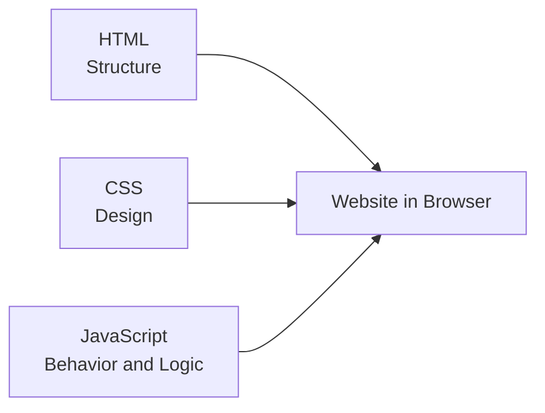
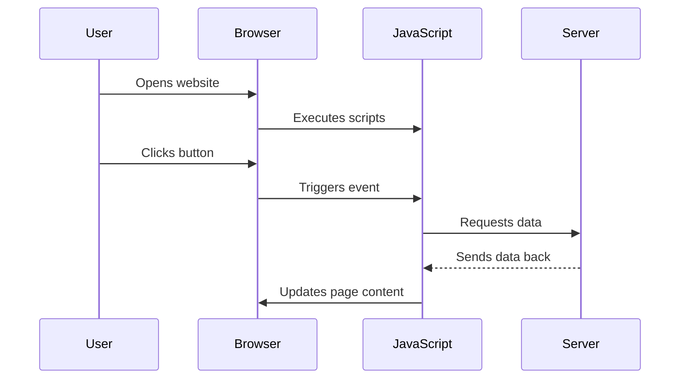

###### Topics

JavaScript Overview

- Importance and typical use cases of JavaScript
- Role of JavaScript in the browser and on websites

Setting up the Development Environment

- Overview of browsers and dev tools
- Installing and basic use of a code editor

First JavaScript Program

- Integrating JavaScript into HTML
- Running and testing your first simple scripts
- Outputting basic content to the console

<br><br><br>
# 🟨 JavaScript Overview

JavaScript is a programming language that is best known for making websites **dynamic and interactive**. Whenever you click a button on a website, open a dropdown menu, validate a form, or load content without refreshing the entire page, JavaScript is usually involved. That is exactly why it became so important on the web: it complements HTML and CSS by adding **behavior and logic** ([What is JavaScript?](https://developer.mozilla.org/en-US/docs/Learn_web_development/Core/Scripting/What_is_JavaScript)).

Here, HTML describes the **content** of a page, CSS the **appearance**, and JavaScript the **behavior**. This division is a fundamental principle of modern web development. Without JavaScript, a website can display content, but many things would be static, inflexible, or cumbersome.

Today, JavaScript is much more than just “the language for browsers.” You can also use it to write server applications, tools, automations, and build processes. Nevertheless, for beginners, the key thing is: **In the browser, JavaScript controls how a website behaves.**


<br><br><br>
## 🌍 Importance and Typical Use Cases of JavaScript

JavaScript is so important on the web because it fills the gap left by HTML and CSS.

HTML can say: “Here's a button.”
CSS can say: “The button should be blue.”
JavaScript can say: “When someone clicks the button, something happens.”

This sounds simple, but it's at the heart of almost every modern website.

Typical use cases include:

| Use Case | What JavaScript Does There |
|---|---|
| Interactive user interfaces | Clicks, menus, tabs, modals, sliders, accordions |
| Forms | Validate inputs, display hints, prepare data |
| Dynamic content | Load, change, or hide content |
| Server communication | Send or receive data via API |
| Web apps | Complex applications like mail services, dashboards, maps, editors |
| Games and animations | Movement, logic, responses to input |
| Using browser APIs | Access to location, clipboard, storage, audio, camera—depending on browser permissions ([Web APIs](https://developer.mozilla.org/en-US/docs/Learn_web_development/Extensions/Client-side_APIs/Introduction)) |

A particularly important point: JavaScript works **event-driven**. This means it often waits for an event, such as:

- a click
- a keypress
- the page loading
- submitting a form

After that, the script responds. This way of thinking is crucial for the web, as users constantly interact with the page.

JavaScript can also **change content in the browser directly** without reloading the entire page. Technically, this often happens via the so-called **DOM**, which is the document structure of the HTML page. JavaScript can find elements there, change texts, add classes, influence styles, or insert new content ([Introduction to the DOM](https://developer.mozilla.org/en-US/docs/Web/API/Document_Object_Model/Introduction)).

A small example:

```html
<button id="meinButton">Click me</button>
<p id="text">Nothing has happened yet.</p>

<script>
  const button = document.getElementById("meinButton");
  const text = document.getElementById("text");

  button.addEventListener("click", function () {
    text.textContent = "The button was clicked!";
  });
</script>
```

This already clearly shows JavaScript's role: it connects user actions with reactions on the page.

A common beginner’s mistake is confusing JavaScript with Java. The names are similar, but they are **different languages for different purposes** ([JavaScript Guide](https://developer.mozilla.org/en-US/docs/Web/JavaScript/Guide)).


<br><br><br>
## 🧩 Role of JavaScript in the Browser and on Websites

In the browser, JavaScript takes on the role of the **active part** of a website. You can imagine it like this:

- **HTML** builds the basic structure.
- **CSS** styles the interface.
- **JavaScript** controls behavior, reactions, and logic.

The interplay looks like this:



So, the browser loads a website, reads the HTML, applies CSS, and then runs JavaScript. This JavaScript can then:

- find elements on the page
- change content
- react to clicks
- fetch data from the internet
- output errors to the console
- work with browser functions

It’s important: JavaScript does not run “somewhere on the side” in the browser, but in an **execution environment** provided by the browser. That’s why JavaScript in the browser has access to things like `document`, `window`, `console`, or `fetch`. These objects are part of the browser environment and provide functions to control web pages ([Window](https://developer.mozilla.org/en-US/docs/Web/API/Window), [Document](https://developer.mozilla.org/en-US/docs/Web/API/Document)).

A typical flow on a website might look like this:



This shows well why JavaScript is so central: it’s the layer that connects users, browsers, and sometimes servers.

When we say, “JavaScript runs in the browser,” this is usually what’s meant: the browser executes the code, and JavaScript changes the current page or responds to input. That’s why JavaScript on websites is not just “additional code” but often the part that turns a static page into an **application**.


<br><br><br>
# 🛠️ Setting up the Development Environment

Before you write JavaScript, you need a simple but clean development environment. The good news: for beginners, this is very straightforward. You basically need just two things:

1. a **browser**
2. a **code editor**

That’s all you need to start.

The browser is your **runtime environment** for testing. The code editor is your **tool for writing** code. Together, these two are enough to get started right away.


<br><br><br>
## 🌐 Overview of Browsers and Dev Tools

Every modern browser can run JavaScript. These include:

- Google Chrome
- Mozilla Firefox
- Microsoft Edge
- Safari

All of these browsers have built-in **developer tools**, often called **DevTools**. With these, you can look at the HTML structure, inspect CSS, test JavaScript, find errors, and observe network requests. Such DevTools are a central tool in web development ([Open Chrome DevTools](https://developer.chrome.com/docs/devtools/open), [Firefox Developer Tools](https://firefox-source-docs.mozilla.org/devtools-user/)).

A rough orientation:

| Browser | DevTools Available | Typical Strength |
|---|---|---|
| Chrome | Yes | Very widespread, strong debugging tools |
| Firefox | Yes | Good tools for CSS and web standards |
| Edge | Yes | Similar to Chrome, as it shares the same engine |
| Safari | Yes | Important for testing behavior on Apple devices |

For beginners, Chrome or Firefox are often especially convenient because lots of tutorials and documentation use them.

The main areas of DevTools:

| Area | Purpose |
|---|---|
| **Elements / Inspector** | View HTML structure and CSS on the current page |
| **Console** | View JavaScript output and test code directly |
| **Sources / Debugger** | View files, set breakpoints, step through code |
| **Network** | Observe file loading and server requests |
| **Application / Storage** | Check local storage, cookies, and other stored data |

Especially important for getting started is the **console**. Here you can:

- display output with `console.log()`
- see errors
- directly enter and test short JavaScript commands

You usually open DevTools with:

- `F12`
- or `Ctrl + Shift + I`
- or right-click → **Inspect**

If you are new, the console is often the fastest way to confirm that your script is actually running.

An example: If you enter in the console

```js
console.log("Hello from the console");
```

the browser will display this text immediately. This is simple but very important feedback.

A big advantage of DevTools is that you’re not “programming blind.” You can instantly see:

- if your JavaScript was loaded
- if an error occurred
- which line is affected
- what values your variables currently have

This makes a huge difference, especially when learning, because you can step by step see what’s happening.


<br><br><br>
## 💻 Installing and Using a Code Editor

A code editor is a program where you write your source code. You could use a simple text editor, but a real code editor is far more practical since it highlights syntax, shows files clearly, numbers lines, and often assists while typing.

A very popular editor is **Visual Studio Code**. It's free, widely used, and very suitable for beginners ([Visual Studio Code Setup](https://code.visualstudio.com/docs/setup/setup-overview)).

Other well-known editors include:

| Editor | Special Feature |
|---|---|
| Visual Studio Code | Very popular, many extensions, good for beginners |
| Sublime Text | Fast and lightweight |
| WebStorm | Very powerful, but paid |
| Notepad++ | Simple, especially popular on Windows |

For beginners, Visual Studio Code is often the best choice because:

- the interface is clear
- many languages are supported
- HTML, CSS, and JavaScript are well recognized
- there are lots of extensions for future needs

### 🔧 Basic Installation Idea

Installation is usually very simple:

1. Download the editor from the official website.
2. Run the installer.
3. Accept the default options.
4. Open the editor.

With VS Code, you can then create a folder for your project, such as:

```text
my-first-js-project
```

You will later add your files inside, for example:

```text
my-first-js-project/
├─ index.html
└─ script.js
```

This separation is important for clean work: HTML in one file, JavaScript in another.

### 🧭 Basic Usage of an Editor

The main things at first are very manageable:

| Function | Meaning |
|---|---|
| Create file | Add new HTML or JS file |
| Save file | Save changes |
| Open folder | Manage several related files as a project |
| Syntax highlighting | Code is displayed in color for readability |
| Tabs | Switch between several open files |
| File view | See project structure in the sidebar |

A typical workflow:

1. Open your project folder in the editor.
2. Create `index.html`.
3. Create `script.js`.
4. Write code.
5. Save files.
6. Open the HTML file in the browser.
7. Test and check the console.

This already gives you a complete mini-development environment.

For now, you don't need any complex extensions, terminal knowledge, or build systems. That comes later. At first, it's much more important to truly understand **how the HTML file, JavaScript file, and browser work together**.


<br><br><br>
# 🚀 First JavaScript Program

Now comes the practical part: How do you include JavaScript in a web page, how do you run it, and how do you see if it works?

The first goal isn’t to write “big programs” immediately. The first goal is to understand the technical process:

- Where is the code located?
- When is it loaded?
- Where is the output visible?
- How do you detect errors?

If you understand these basics clearly, almost everything will be easier later.


<br><br><br>
## 🔌 Integrating JavaScript into HTML

JavaScript is included in HTML via the `<script>` element. There are several ways to do this. The `<script>` element is the official HTML mechanism to embed scripts in a document or to include external script files ([The Script element](https://developer.mozilla.org/en-US/docs/Web/HTML/Element/script)).

### 🧱 Method 1: Write JavaScript directly in HTML

```html
<!DOCTYPE html>
<html lang="en">
<head>
  <meta charset="UTF-8">
  <title>My First JavaScript</title>
</head>
<body>
  <h1>Hello World</h1>

  <script>
    console.log("Hello from JavaScript");
  </script>
</body>
</html>
```

Here, the JavaScript code is directly in the HTML document. That’s fine for very small examples, but in real projects, the code quickly becomes messy.

### 📄 Method 2: Load JavaScript from an external file

This is the usual and cleaner approach:

```html
<!DOCTYPE html>
<html lang="en">
<head>
  <meta charset="UTF-8">
  <title>My First JavaScript</title>
</head>
<body>
  <h1>Hello World</h1>

  <script src="script.js"></script>
</body>
</html>
```

And in the `script.js` file you have:

```js
console.log("Hello from the external file");
```

This separation is important because it structures the code better: HTML is responsible for structure, JavaScript for behavior.

### ⏱️ Why placement of the `<script>` tag matters

The browser reads HTML from top to bottom. If your script wants to access an HTML element, that element must usually be **loaded already**. That’s why you often place `<script>` just before the closing `</body>` tag, so the rest of the page’s content is built beforehand ([JavaScript basics](https://developer.mozilla.org/en-US/docs/Learn_web_development/Core/Scripting/JavaScript_first_steps)).

Example:

```html
<body>
  <button id="button">Click me</button>

  <script src="script.js"></script>
</body>
```

This way the button is already present when `script.js` runs.

### ⚡ Alternative: `defer`

A modern and very good approach is this pattern:

```html
<head>
  <meta charset="UTF-8">
  <title>My First JavaScript</title>
  <script src="script.js" defer></script>
</head>
```

The `defer` attribute ensures the script is loaded early but only executed after the HTML document has been parsed ([The Script element](https://developer.mozilla.org/en-US/docs/Web/HTML/Element/script)). For many normal pages, this is very practical.

For beginners, remember:

- **simple and classic:** `<script>` at the end of `<body>`
- **modern and clean:** `<script src="script.js" defer>` in the `<head>`

### 🚫 What beginners often do wrong

Some typical mistakes when integrating scripts:

- Filename does not match exactly, e.g. `Script.js` instead of `script.js`
- File in the wrong folder
- Changes not saved
- JavaScript tries to access HTML elements before they’re loaded
- Wrong quotation marks or missing brackets in the code

That’s why the browser console is so important: errors are usually shown there immediately.


<br><br><br>
## ▶️ Running and Testing Your First Simple Scripts

To run your first JavaScript program, you only need an HTML file and possibly an external JS file.

### 📁 Example Project

`index.html`

```html
<!DOCTYPE html>
<html lang="en">
<head>
  <meta charset="UTF-8">
  <title>First Script</title>
</head>
<body>
  <h1>My First JavaScript Program</h1>

  <script src="script.js"></script>
</body>
</html>
```

`script.js`

```js
console.log("The script was loaded successfully.");
```

### 🧪 How to test the script

1. Save both files.
2. Open `index.html` in the browser.
3. Open the DevTools.
4. Go to the **Console**.
5. You should see the output there.

If the text appears in the console, you know:

- the HTML file was loaded
- the JavaScript file was found
- the code was executed

This is an important first technical proof that your environment works.

### 👀 First visible effect on the page

You can also have JavaScript change something in the document directly:

```html
<!DOCTYPE html>
<html lang="en">
<head>
  <meta charset="UTF-8">
  <title>First Script</title>
</head>
<body>
  <h1 id="headline">Hello</h1>

  <script>
    document.getElementById("headline").textContent = "Hello with JavaScript";
  </script>
</body>
</html>
```

Here, JavaScript finds the headline by its ID and replaces the text. This way you immediately see that JavaScript can affect the page content ([textContent](https://developer.mozilla.org/en-US/docs/Web/API/Node/textContent)).

### 🛎️ Another simple example with an alert

```html
<script>
  alert("Welcome to the page!");
</script>
```

This opens a message box. `alert()` is technically useful, but is rarely used nowadays since it interrupts the page. For learning, though, it clearly shows: **JavaScript is really running** ([Window: alert() method](https://developer.mozilla.org/en-US/docs/Web/API/Window/alert)).

### 🐞 If nothing happens

If you run your script and see no output, check first:

- Is the file saved?
- Is the filename correct?
- Are you opening the correct HTML file?
- Is there an error message in the console?
- Is the JavaScript code syntactically correct?

Especially at the beginning, small typos are common. What matters is learning to find them systematically.


<br><br><br>
## 🖥️ Outputting Simple Content in the Console

The console is one of the most important tools when learning JavaScript. It’s like your direct window into your program’s execution. With it, you can check if a script is running, what value a variable has, or whether a particular part of your code is reached.

The most well-known method is:

```js
console.log("Hello console");
```

`console.log()` writes a message to the browser console ([console: log() static method](https://developer.mozilla.org/en-US/docs/Web/API/console/log_static)).

This might seem simple, but it’s very powerful. You can use it to output not just text, but also numbers, variables, arrays, objects, and much more.

### 🔤 Simple examples

```js
console.log("Hello World");
console.log(42);
console.log(true);
```

Here, a text, a number, and a boolean value are output.

### 📦 Outputting variables

```js
let name = "Lena";
let age = 25;

console.log(name);
console.log(age);
```

This way you can see directly which values your variables hold.

### 🧠 Combining text and value

```js
let score = 100;
console.log("The score is:", score);
```

This form is especially useful for debugging, as it immediately tells you what the value means.

### ⚠️ Other useful console methods

In addition to `console.log()`, there are other helpful methods:

```js
console.warn("This is a warning.");
console.error("This is an error.");
console.info("This is information.");
```

These help to differentiate messages more clearly ([console](https://developer.mozilla.org/en-US/docs/Web/API/Console_API)).

### 📋 Structured output

When you later work with tables or objects, this can also be useful:

```js
console.table([
  { name: "Anna", age: 22 },
  { name: "Ben", age: 28 }
]);
```

The console then displays the data in a table. This is very convenient when you want to check data clearly.

### 🪜 Why the console is essential for learning

The console is valuable for beginners because it gives instant feedback. You don’t need to build complex interfaces just to see if something works. Instead, you can observe directly:

- Is the code being executed?
- What values occur?
- Which condition is true or false?
- Where does an error happen?

In practice, it often looks like this:

```js
let number = 10;
console.log("Starting value:", number);

number = number + 5;
console.log("New value:", number);
```

You see step by step how the program state changes. That's what makes the console one of the best learning tools in JavaScript.

### 🔍 Testing the console directly in the browser

You don't always have to write a file to try out JavaScript. In DevTools, you can directly enter commands in the console:

```js
2 + 2
```

The browser outputs the result.

Or:

```js
document.title
```

Then you'll see the title of the current page. This way, you can quickly try small things and understand how JavaScript is connected to the page.

### 🧭 A sensible workflow for your first steps

For your first programs, this order is especially useful:

1. Write code in the editor
2. Save the file
3. Load the page in the browser
4. Open the console
5. Check the output
6. Read and understand errors
7. Adjust code and test again

This may sound basic, but it’s an extremely valuable process. Good learning in programming is not just about writing code, but also about **interpreting and understanding feedback correctly**. That’s exactly where the browser and console help you right from the start.