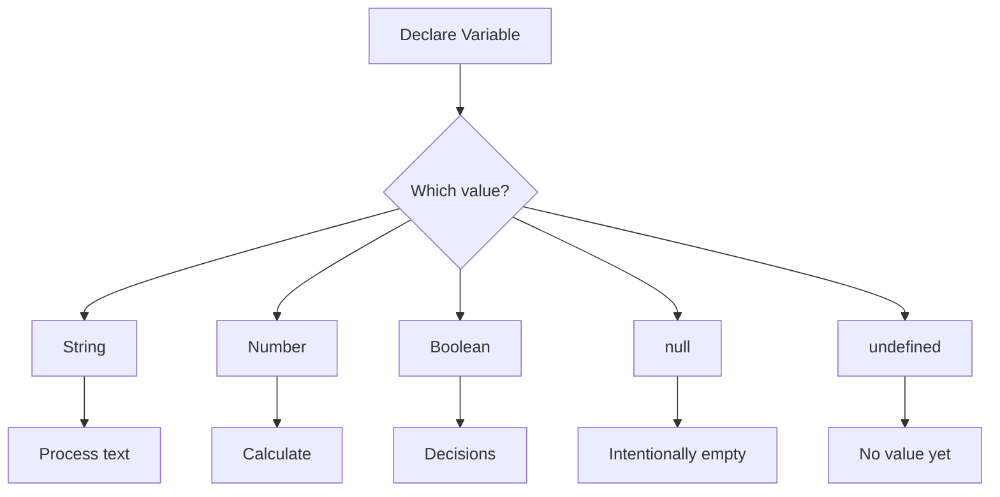
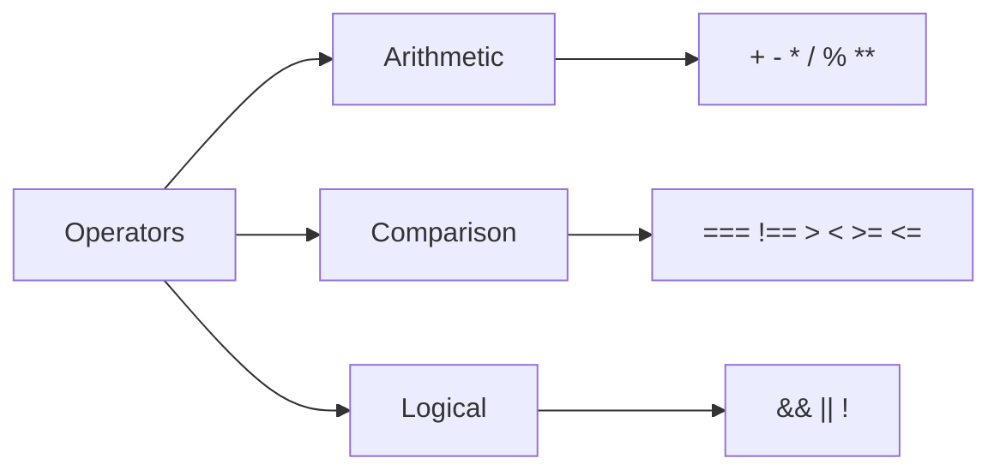
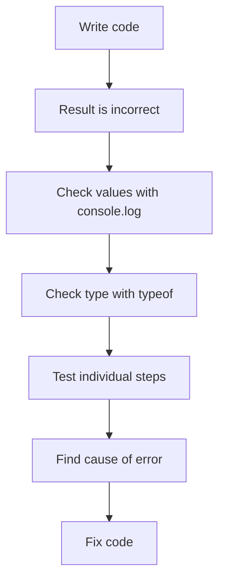

###### Topics

Variables and Data Types

- Definition and usage of let and const
- Overview of String, Number, Boolean, null, and undefined
- Basic work with strings

Operators and Console Work

- Basics of arithmetic, comparison, and logical operators
- Working with the browser console for output and simple debugging

<br><br><br>
# 🧱 Variables and Data Types

When you code, you need to **store** values somewhere so you can work with them later. This is exactly what **variables** are for. A variable is basically a named storage place. In JavaScript today, you usually create variables with `let` or `const`. Both create **block-scoped** variables, i.e., variables that are only valid within the block in which they are defined, for example within a function or an `if` block ([let](https://developer.mozilla.org/en-US/docs/Web/JavaScript/Reference/Statements/let), [const](https://developer.mozilla.org/en-US/docs/Web/JavaScript/Reference/Statements/const)).

Values in variables also always have a **data type**. The data type determines how JavaScript handles the value. A number is processed differently than text or a boolean. Especially in the beginning this is extremely important, since many mistakes don't come from complicated logic, but from working with the wrong data type ([JavaScript data types and data structures](https://developer.mozilla.org/en-US/docs/Web/JavaScript/Data_structures)).

<br><br><br>
## 📌 Definition and Usage of `let` and `const`

`let` and `const` are the modern ways to create variables in JavaScript. The difference is simple but very important:

- Use `let` when the value **may change later**
- Use `const` when the name **should always refer to the same value**

Let's look at this right away:

```js
let points = 10;
points = 15;

const country = "Germany";
// country = "France"; // Error
```

Here, `points` is allowed to change because it was defined with `let`. `country` was defined with `const` and therefore **cannot be reassigned** ([const](https://developer.mozilla.org/en-US/docs/Web/JavaScript/Reference/Statements/const)).

### What does "cannot be reassigned" mean exactly?

This is often misunderstood. `const` does **not** mean that the content is always completely immutable. It first means: **The variable itself cannot be set to another value**.

For simple values like numbers or strings, this is straightforward:

```js
const age = 25;
// age = 26; // Error
```

For more complex values like objects or arrays, the content can be partially changed, even though the variable was created with `const`. This goes a bit beyond the absolute basics, but it’s good to know so you don’t make a logical error later.

```js
const user = { name: "Lena" };
user.name = "Mia"; // allowed
// user = { name: "Tom" }; // not allowed
```

The `user` variable remains bound to the same object, but the properties of the object can be changed ([const](https://developer.mozilla.org/en-US/docs/Web/JavaScript/Reference/Statements/const)).

### Why `let` and `const` are better

Both are **block-scoped**, i.e., bound to a block. This makes code more readable and prevents many typical errors that used to occur more often with `var` ([let](https://developer.mozilla.org/en-US/docs/Web/JavaScript/Reference/Statements/let)).

Example:

```js
if (true) {
  let message = "Hello";
  console.log(message); // works
}

// console.log(message); // Error, not visible outside the block
```

This is good because it helps you think more cleanly: values only exist where you actually need them.

### When to use `let` and when to use `const`?

A good basic rule for clean learning and code:

- Use **`const` by default**
- Use **`let` only** when you know the value should change later

Why does this make sense? Because your code becomes clearer. When you see `const`, you instantly know: This binding is meant to stay stable. This makes programs easier to understand and reduces accidental changes.

### Typical examples

```js
const firstName = "Ali";
let accountBalance = 100;

accountBalance = accountBalance + 50;
```

`firstName` does not normally change during the program. `accountBalance` does.

### Common beginner mistakes

A very common mistake is to use `const` and then try to reassign:

```js
const temperature = 20;
temperature = 25; // Error
```

Another frequent mistake is using a variable before it is declared. `let` and `const` cannot be used normally before their declaration; they are in a **Temporal Dead Zone** until initialized ([let](https://developer.mozilla.org/en-US/docs/Web/JavaScript/Reference/Statements/let)).

```js
// console.log(name); // Error
let name = "Sara";
```

You don't have to memorize the technical term right away. What matters is: **Declare first, then use.**

### Comparison of `let` and `const`

| Keyword | Can be reassigned? | Scope | Typical use |
|---|---:|---|---|
| `let` | Yes | Block | Values that change |
| `const` | No | Block | Values that stay the same |

### Mental model

Think of variables as labeled boxes:

- `let` = a box whose contents you may swap
- `const` = a box permanently linked to exactly one content

This image is, of course, simplified, but helps a lot at the start.

<br><br><br>
## 🧩 Overview of `String`, `Number`, `Boolean`, `null`, and `undefined`

These data types are among the most important basics in JavaScript. They are **primitive data types** ([JavaScript data types and data structures](https://developer.mozilla.org/en-US/docs/Web/JavaScript/Data_structures)). Primitive values are simple, direct values such as text, numbers, or booleans.

### Table of the most important primitive data types

| Data Type | Meaning | Example |
|---|---|---|
| `String` | Text | `"Hello"` |
| `Number` | Number | `42`, `3.14` |
| `Boolean` | Truth value | `true`, `false` |
| `null` | intentionally no value | `null` |
| `undefined` | no value assigned yet | `undefined` |

Let’s now look at each type individually.

<br><br><br>
### 🔤 `String` – Text values

A `String` is just text. Strings are written in quotes, either double or single:

```js
const greeting = "Hello";
const name = 'Mila';
```

JavaScript treats everything between the quotes as text, including things that look like numbers:

```js
const numberAsText = "123";
```

This is **not** a `Number`, but a `String`.

You need strings everywhere: for names, messages, email addresses, URLs, or generally anything shown as text ([String](https://developer.mozilla.org/en-US/docs/Web/JavaScript/Reference/Global_Objects/String)).

### How can you check the type?

Use `typeof` to display the type:

```js
console.log(typeof "Hello"); // "string"
console.log(typeof 42);      // "number"
```

`typeof` is amazingly helpful in the beginning if you want to understand what you’re really working with ([typeof](https://developer.mozilla.org/en-US/docs/Web/JavaScript/Reference/Operators/typeof)).

<br><br><br>
### 🔢 `Number` – Numeric values

The `Number` type in JavaScript stands for both **whole numbers** and **floating point numbers**. Unlike some other languages, JavaScript just uses the `Number` type for both `int` and `float` values ([Number](https://developer.mozilla.org/en-US/docs/Web/JavaScript/Reference/Global_Objects/Number)).

```js
const age = 28;
const price = 19.99;
```

Negative numbers are perfectly normal:

```js
const temperature = -5;
```

You can do math with numbers:

```js
const sum = 10 + 5;
const product = 4 * 3;
```

A very important point: If you mix up numbers and text, you often get unexpected results.

```js
console.log(10 + 5);   // 15
console.log("10" + 5); // "105"
```

In the second example, at least one value is a `String`. JavaScript concatenates here instead of adding numerically. That’s why understanding data types is so important.

<br><br><br>
### ✅ `Boolean` – True or False

A `Boolean` has only two possible values:

- `true`
- `false`

You need booleans for decisions, i.e., whenever you want to check if something is true or not.

```js
const isOnline = true;
const isDone = false;
```

Typical examples:

```js
const hasEnoughMoney = accountBalance > 0;
const isAdult = age >= 18;
```

Here, the Boolean values are created via a comparison. Comparison operators return either `true` or `false` ([Comparison operators](https://developer.mozilla.org/en-US/docs/Web/JavaScript/Reference/Operators#comparison_operators)).

Booleans are the basis for `if` statements, loops, and many other control structures. Without them, you couldn’t make decisions in your program.

<br><br><br>
### 🕳️ `null` – intentionally no value

`null` in JavaScript means: **There is intentionally no value here** ([null](https://developer.mozilla.org/en-US/docs/Web/JavaScript/Reference/Operators/null)).

```js
const selectedUser = null;
```

This can be meaningful if you want to indicate:

- Nothing has been selected yet
- There is currently no value
- A value was explicitly cleared

So `null` is often a **deliberate empty state**.

<br><br><br>
### 🌫️ `undefined` – not yet defined

`undefined` typically means: **No value has been assigned yet** ([undefined](https://developer.mozilla.org/en-US/docs/Web/JavaScript/Reference/Global_Objects/undefined)).

```js
let city;
console.log(city); // undefined
```

The variable was created but not yet filled.

`undefined` also appears when you access something that doesn’t exist, such as a non-existent property.

```js
const person = { name: "Nora" };
console.log(person.age); // undefined
```

### Difference between `null` and `undefined`

This is a core point that many confuse at first.

| Value | Meaning |
|---|---|
| `undefined` | Nothing assigned yet or something doesn’t exist |
| `null` | Explicitly set to “no value” |

A simple image to remember:

- `undefined` = “Nothing inside yet”
- `null` = “Intentionally emptied”

Example:

```js
let color;
console.log(color); // undefined

color = null;
console.log(color); // null
```

Initially, `color` has no value. Afterward, we explicitly set it: No value should be present right now.

### Important special case: `typeof null`

If you try `typeof null`, you’ll get `"object"`. This is historical JavaScript behavior—not a logical indicator that `null` is a normal object ([typeof](https://developer.mozilla.org/en-US/docs/Web/JavaScript/Reference/Operators/typeof)).

```js
console.log(typeof null); // "object"
```

This seems odd at first. You don’t have to “like” it, but you should know it.

<br><br><br>
## ✍️ Basic Work with Strings

Strings are very important in practice because you’re always working with text: names, messages, URLs, form input, log output, and much more.

### Creating strings

```js
const firstName = "Lea";
const lastName = "Schmidt";
```

### Concatenating strings

That’s called **concatenation**. You can use the `+` operator:

```js
const fullName = firstName + " " + lastName;
console.log(fullName); // Lea Schmidt
```

Here you add two strings together with a space in between.

### Template literals – the more modern and convenient way

In modern JavaScript, it’s common to use **template literals** with backticks `` ` ``. You embed values with `${...}` ([Template literals](https://developer.mozilla.org/en-US/docs/Web/JavaScript/Reference/Template_literals)).

```js
const fullName = `${firstName} ${lastName}`;
console.log(fullName);
```

This is usually easier to read than lots of `+` concatenations.

### Combining strings and variables

```js
const product = "Keyboard";
const price = 49.99;

console.log(`The product ${product} costs ${price} Euros.`);
```

This is especially handy for output in the console or on web pages.

### Length of a string

Use `.length` to get the number of characters:

```js
const word = "JavaScript";
console.log(word.length); // 10
```

The `length` property is one of the most important basics with strings ([String.length](https://developer.mozilla.org/en-US/docs/Web/JavaScript/Reference/Global_Objects/String/length)).

### Changing case

```js
const text = "hello";
console.log(text.toUpperCase()); // HELLO
console.log(text.toLowerCase()); // hello
```

This is often useful for comparisons or for uniform display of inputs ([String](https://developer.mozilla.org/en-US/docs/Web/JavaScript/Reference/Global_Objects/String)).

### Checking parts of a string

Use `.includes()` to see if a string contains a substring ([String.prototype.includes](https://developer.mozilla.org/en-US/docs/Web/JavaScript/Reference/Global_Objects/String/includes)):

```js
const email = "max@example.com";
console.log(email.includes("@")); // true
```

### Extracting characters or substrings

Use `.slice()` to cut out part of a string ([String.prototype.slice](https://developer.mozilla.org/en-US/docs/Web/JavaScript/Reference/Global_Objects/String/slice)):

```js
const word = "Programming";
console.log(word.slice(0, 5)); // Progr
```

Counting starts at `0`. That’s very important in JavaScript: many things are zero-based.

### Removing spaces

Use `.trim()` to remove whitespace from the beginning and end of a string ([String.prototype.trim](https://developer.mozilla.org/en-US/docs/Web/JavaScript/Reference/Global_Objects/String/trim)):

```js
const input = "   Hello   ";
console.log(input.trim()); // "Hello"
```

This is especially useful for user input.

### Common mistakes with strings

A frequent mistake is mixing strings and numbers without keeping the data type in mind:

```js
const amount = "5";
const result = amount + 1;
console.log(result); // "51"
```

If `amount` is a string, JavaScript concatenates text, not adds numbers.

Another common mistake is comparing differently cased text:

```js
console.log("hello" === "Hello"); // false
```

Strings are **case-sensitive and character-accurate**.

### Visualization: Basic idea of variables and data types



<br><br><br>
# 🧮 Operators and Console Work

Operators are the tools you use to **process**, **compare**, and **logically combine** values. Without operators, you couldn’t write meaningful programs. They are truly foundational in JavaScript ([Expressions and operators](https://developer.mozilla.org/en-US/docs/Web/JavaScript/Guide/Expressions_and_operators)).

The browser console is, in turn, one of the most important learning tools. It helps you see values, test behavior, and find errors. Especially if you really want to learn, you should get in the habit of not just writing code, but also constantly observing: **What is actually happening?**

<br><br><br>
## ➕ Basics of Arithmetic, Comparison, and Logical Operators

You can divide operators into three main groups:

- **Arithmetic operators** for math
- **Comparison operators** for comparisons
- **Logical operators** for combining boolean values

These aren’t just little symbols, but building blocks for almost every programming decision.

<br><br><br>
### ➗ Arithmetic operators – Doing math with values

You’re already familiar with these from regular math.

| Operator | Meaning | Example | Result |
|---|---|---|---|
| `+` | addition | `5 + 2` | `7` |
| `-` | subtraction | `5 - 2` | `3` |
| `*` | multiplication | `5 * 2` | `10` |
| `/` | division | `6 / 2` | `3` |
| `%` | modulo (remainder) | `7 % 2` | `1` |
| `**` | power | `2 ** 3` | `8` |

Examples:

```js
console.log(8 + 4);  // 12
console.log(8 - 4);  // 4
console.log(8 * 4);  // 32
console.log(8 / 4);  // 2
console.log(9 % 2);  // 1
console.log(2 ** 4); // 16
```

The `%` operator is very practical if you want to check whether a number is even or odd:

```js
console.log(10 % 2); // 0
console.log(11 % 2); // 1
```

If the remainder is `0`, the number is even.

### The `+` operator can do two things

This is extremely important: In JavaScript, `+` can **add** or **concatenate strings** ([Addition (+)](https://developer.mozilla.org/en-US/docs/Web/JavaScript/Reference/Operators/Addition)).

```js
console.log(3 + 4);        // 7
console.log("Hello" + "!"); // Hello!
console.log("3" + 4);      // 34
```

As soon as a string is involved, you'll get string concatenation instead of numeric addition. This is where many beginners make mistakes.

### Shortcuts

There are handy shorthand forms:

```js
let account = 100;

account += 50; // account = account + 50
account -= 20; // account = account - 20
account *= 2;  // account = account * 2
account /= 5;  // account = account / 5
```

These assignment operators are standard in JavaScript ([Assignment operators](https://developer.mozilla.org/en-US/docs/Web/JavaScript/Reference/Operators#assignment_operators)).

### Increment and decrement

```js
let number = 5;
number++;
console.log(number); // 6

number--;
console.log(number); // 5
```

`++` increases a value by `1`, `--` decreases it by `1` ([Increment](https://developer.mozilla.org/en-US/docs/Web/JavaScript/Reference/Operators/Increment), [Decrement](https://developer.mozilla.org/en-US/docs/Web/JavaScript/Reference/Operators/Decrement)).

It's enough at first to know the simple form. Later you'll see that pre- and post-increment (`++x` vs. `x++`) can make a difference in expression evaluation.

<br><br><br>
### ⚖️ Comparison operators – Testing values

Comparison operators answer questions like:

- Are two values the same?
- Is one value greater than another?
- Is something at least 18?

The result is always a `Boolean`, i.e., `true` or `false`.

| Operator | Meaning | Example | Result |
|---|---|---|---|
| `===` | strict equality | `5 === 5` | `true` |
| `!==` | strict inequality | `5 !== 4` | `true` |
| `>` | greater than | `7 > 3` | `true` |
| `<` | less than | `2 < 1` | `false` |
| `>=` | greater than or equal | `5 >= 5` | `true` |
| `<=` | less than or equal | `3 <= 5` | `true` |

Examples:

```js
console.log(10 > 5);     // true
console.log(10 < 5);     // false
console.log(10 === 10);  // true
console.log(10 !== 8);   // true
```

### Why `===` is so important

JavaScript has both `==` and `===`. For clean learning, you should always use **`===` and `!==` almost exclusively**, as these compare **without unexpected type conversion** ([Equality comparisons and sameness](https://developer.mozilla.org/en-US/docs/Web/JavaScript/Guide/Equality_comparisons_and_sameness)).

Example:

```js
console.log(5 == "5");  // true
console.log(5 === "5"); // false
```

With `==`, JavaScript tries to convert values before comparing. This can be convenient but is often confusing for beginners. `===` is clearer: same value **and** same type.

### Comparisons with strings

Strings can also be compared:

```js
console.log("Apple" === "Apple"); // true
console.log("Apple" === "apple"); // false
```

Every character and case matters.

<br><br><br>
### 🧠 Logical operators – Combining conditions

Logical operators work with boolean values and combine conditions.

| Operator | Meaning | Example |
|---|---|---|
| `&&` | AND | `age >= 18 && hasID` |
| `||` | OR | `isAdmin || isModerator` |
| `!` | NOT | `!isOffline` |

### `&&` – Logical AND

Both conditions must be true:

```js
const age = 20;
const hasTicket = true;

console.log(age >= 18 && hasTicket); // true
```

If either condition is `false`, the overall result is `false`.

### `||` – Logical OR

At least one condition must be true:

```js
const isMember = false;
const hasVoucher = true;

console.log(isMember || hasVoucher); // true
```

### `!` – Logical NOT

`!` inverts the boolean value:

```js
const isOnline = true;
console.log(!isOnline); // false
```

### Compound conditions

```js
const age = 17;
const hasPermission = true;

console.log(age >= 18 || hasPermission); // true
```

Here: Either of age **or** permission is enough.

### A typical real-world example

```js
const username = "mia";
const password = "1234";

const loginAllowed = username === "mia" && password === "1234";
console.log(loginAllowed); // true
```

You can clearly see how comparison and logical operators work together.

### Order and brackets

Just like in math, the order of operations matters. As conditions get more complex, brackets really help understanding and prevent errors ([Operator precedence](https://developer.mozilla.org/en-US/docs/Web/JavaScript/Reference/Operators/Operator_precedence)).

```js
const result = (10 > 5 && 8 > 3) || false;
console.log(result); // true
```

Even if you don’t know exact precedence by heart, parentheses are almost always the safe option.

### Visualization of operator groups



<br><br><br>
## 🖥️ Working with the Browser Console for Output and Simple Debugging

The browser console is one of the most important tools in the web environment. It's part of the Developer Tools and lets you run JavaScript directly, see outputs, and investigate errors ([Console](https://developer.mozilla.org/en-US/docs/Web/API/console), [Open Chrome DevTools](https://developer.chrome.com/docs/devtools/open/)).

If you want to really learn well:
**Don’t just write code – observe it.**
That’s exactly what the console is for.

### How do you open the console?

In most browsers:

- `F12`
- or right-click → **Inspect**
- or `Ctrl + Shift + I` / `Cmd + Option + I`

Then switch to the **Console** tab. There you can type JavaScript and run it directly ([Open Chrome DevTools](https://developer.chrome.com/docs/devtools/open/)).

### Output with `console.log()`

The most important method: `console.log()`:

```js
console.log("Hello world");
```

This shows values so you can see what your code does.

```js
const name = "Amira";
console.log(name);
```

Or multiple values at once:

```js
const age = 22;
console.log("Name:", name, "Age:", age);
```

Great for making intermediate results visible.

### Why `console.log()` is so useful

Beginners often think: “I wrote the code—I know what it should do.”
In reality, what matters is not what you **think**, but what the code **actually does**.

Example:

```js
const price = "10";
const shipping = 5;
const total = price + shipping;

console.log(total); // "105"
```

Without the console, you might only notice much later that `price` was a string.

### Other useful console methods

Besides `console.log()`, there are more Console API methods ([Console](https://developer.mozilla.org/en-US/docs/Web/API/console)).

#### `console.warn()`

Shows a warning:

```js
console.warn("Warning: This value is unexpected.");
```

#### `console.error()`

Highlights an error prominently:

```js
console.error("Error: The file was not found.");
```

#### `console.table()`

Very handy for arrays or objects, shows data as a table:

```js
const users = [
  { name: "Lea", age: 21 },
  { name: "Tom", age: 25 }
];

console.table(users);
```

Especially when learning, that’s often much clearer than regular output.

### Quick testing in the console

You can immediately try out simple expressions in the console:

```js
2 + 2
"Hello".toUpperCase()
5 > 3
```

This is didactically very valuable. You get instant feedback and can test ideas without writing a whole file. That’s exactly how you develop an instinct for language elements.

### Inspecting variables in the console

If you’ve already defined a variable in your script or directly in the console, you can inspect it:

```js
let color = "blue";
console.log(color);
typeof color;
```

You can also check things one step at a time:

```js
let price = "20";
console.log(price);
console.log(typeof price);
```

This helps you catch misunderstandings early.

### Simple debugging with the console

Debugging almost always begins with a simple question:

**What value is really present at which spot?**

Take this example:

```js
const firstName = "Lina";
const age = "18";
const isAdult = age >= 18;

console.log(isAdult);
```

If the result surprises you, you can check:

```js
console.log(age);
console.log(typeof age);
console.log(age >= 18);
```

This breaks a problem down into checkable steps. That’s one of the most important programming learning habits.

### Typical things to check with the console

When something doesn’t work, check, step by step:

- Is the variable actually present?
- What value does it have now?
- What type is it?
- Is a comparison result really `true` or `false`?
- Is the code at this location even being executed?

This approach is far more valuable than aimless trial and error.

### Example of systematic debugging

```js
const price = "50";
const discount = 10;
const finalPrice = price - discount;

console.log("price:", price);
console.log("type of price:", typeof price);
console.log("discount:", discount);
console.log("finalPrice:", finalPrice);
```

Here you can instantly see:

- `price` is a string
- `discount` is a number
- JavaScript does the math differently than you might expect

Observing things like this trains your technical understanding.

### When real errors occur

Runtime errors show up in the console, for example if you use an undefined variable:

```js
console.log(username);
```

You’ll get a `ReferenceError` because `username` doesn’t exist. Browser consoles display such errors with the line number and often a clickable spot in the code ([Console](https://developer.mozilla.org/en-US/docs/Web/API/console)).

### Good learning practice with the console

If you really want to learn, use the console all the time—not just in emergencies:

- after declaring a variable
- after calculations
- after comparisons
- when working with strings
- when you expect a boolean result

That way you gradually develop a real sense for how JavaScript “thinks.”

### Mini procedure for good debugging



### Example: output, comparison, and string work together

```js
const firstName = "Noah";
const lastName = "Becker";
const age = 19;

const fullName = `${firstName} ${lastName}`;
const isAdult = age >= 18;

console.log("Full name:", fullName);
console.log("Age:", age);
console.log("Adult:", isAdult);
```

This small example already contains a lot of fundamentals:

- Variables with `const`
- Strings
- Template literals
- Numbers
- Comparison operators
- Boolean result
- Console output

It’s exactly these small, clear code examples that are ideal for really building up core tech fundamentals.