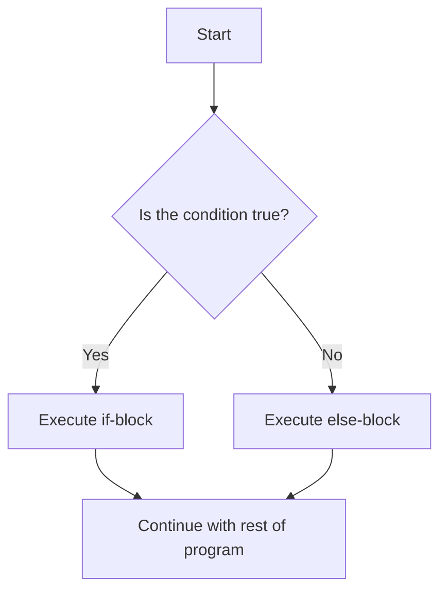
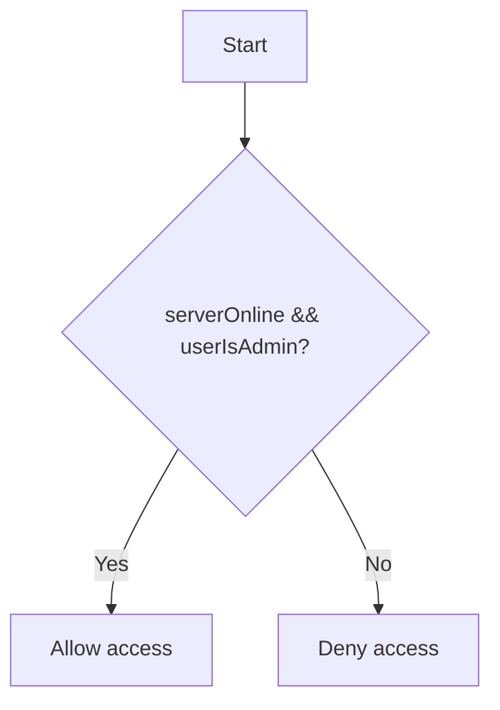
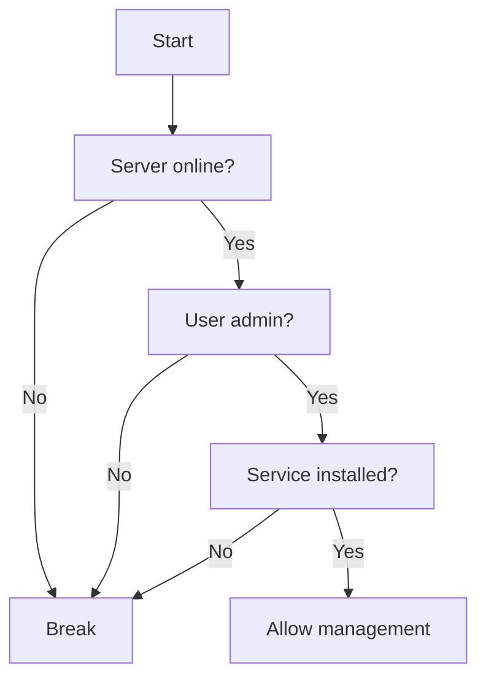
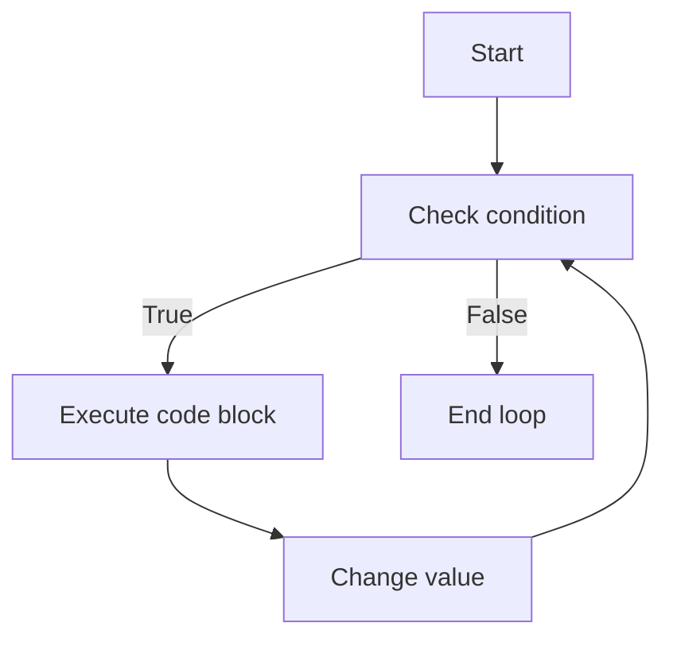
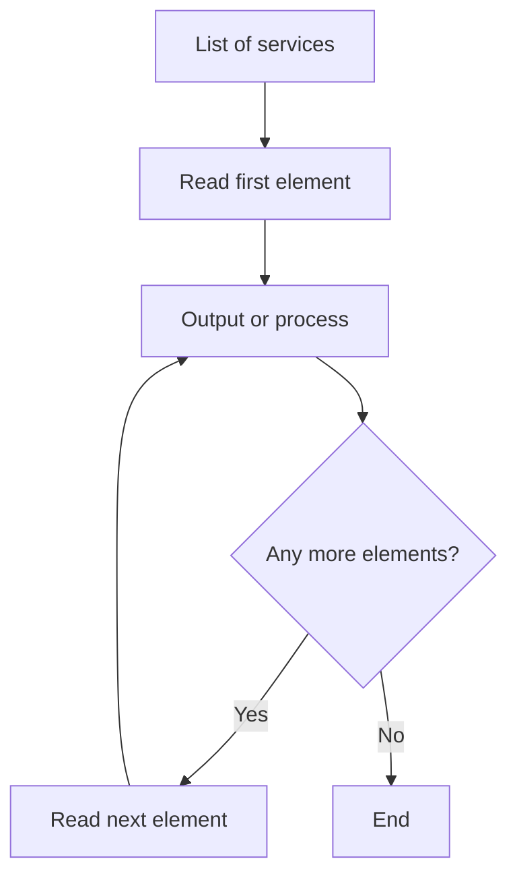
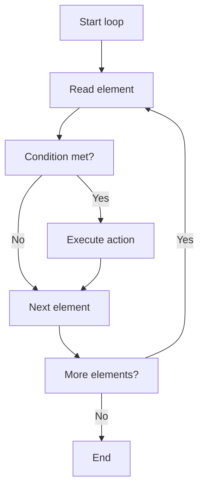

###### Topics

Conditions and Program Flow

- Simple if-else statements to control program flow
- Applying comparison and logical operators in conditions
- Understanding simple nesting of conditions

Loops – Basics

- Introduction to for and while loops
- Implementing repetition with loops
- Handling typical simple use cases with loops

<br><br><br>

# 🧭 Conditions and Program Flow in JavaScript

When you program, your code usually **runs line by line from top to bottom**. This is called **program flow**.
But as soon as you want to make decisions, this rigid execution is no longer enough.

A program often needs to react to different situations, for example:

* A user is logged in or not
* A password is correct or not
* A number is greater than 10 or not
* A file exists or not
* A service on a Windows Server is running or stopped

This is exactly what you need **conditions** for.

With conditions you specify:

* **When** certain code should be executed
* **When not**
* **Which of several paths** should be taken

In JavaScript, this is primarily done with:

* `if`
* `else`
* `else if`

These statements control the sequence of your program.

Especially in the context of **Windows Server 2025**, this way of thinking is very important.
Even though JavaScript itself is typically not the classic admin tool for Windows Server, it can still appear in the server context, for example:

* in web applications on a server
* in admin interfaces
* in Node.js scripts
* in automation tools
* in dashboards for monitoring server status

A script could check, for example:

* Is the logged in user an administrator?
* Is there enough free disk space?
* Is a service running?
* Is the server reachable?
* Did a backup complete successfully?

Then, based on a condition, your code decides what should happen.

<br><br><br>

## 🚦 Simple if-else Statements to Control Program Flow

The simplest form of a condition is the `if` statement.

It means:

> **If** a condition is true, then execute this code.

### 🧱 Basic if Structure

```javascript
if (condition) {
  // this code runs only if the condition is true
}
```

The word `if` thus means: **in case**.

Example:

```javascript
let memoryFree = true;

if (memoryFree) {
  console.log("Enough storage available.");
}
```

Here, the output will only be shown if `memoryFree` is `true`.

### 🪟 Example from the Windows Server Context

Imagine you're checking in an admin dashboard whether a service is running:

```javascript
let serviceRunning = true;

if (serviceRunning) {
  console.log("The service is running properly.");
}
```

If `serviceRunning` is set to `false`, nothing happens in this example.

---

### 🔁 if with else

Often you want to handle not just one case, but also the opposite.

For this, there is `else`.

```javascript
if (condition) {
  // if true
} else {
  // if false
}
```

Example:

```javascript
let userIsAdmin = false;

if (userIsAdmin) {
  console.log("Access to server management allowed.");
} else {
  console.log("Access denied.");
}
```

There are exactly two possibilities here:

* Condition is `true` → first block is executed
* Condition is `false` → second block is executed

### 🧠 What Happens Internally

JavaScript checks the expression in the parentheses:

```javascript
if (userIsAdmin)
```

If the result is **true**, the code block directly after `if` is executed.
If the result is **false**, the `else` block (if present) is executed.

---

### 🛠️ if-else in a Realistic Example

```javascript
let serverOnline = false;

if (serverOnline) {
  console.log("Server is reachable.");
} else {
  console.log("Server is not reachable.");
}
```

This is typical for status displays in monitoring tools.

---

### 🧾 if, else if and else

If there are more than two cases, you use `else if`.

```javascript
let cpuLoad = 82;

if (cpuLoad < 50) {
  console.log("CPU load is low.");
} else if (cpuLoad < 80) {
  console.log("CPU load is medium.");
} else {
  console.log("CPU load is high.");
}
```

This is how the checking works:

1. Is `cpuLoad < 50`?
2. If not: Is `cpuLoad < 80`?
3. If also not: only `else` remains

Important:
JavaScript checks these conditions **from top to bottom**.
As soon as a condition matches, its block is executed and the rest is skipped.

---

### 📊 Overview of the Structure

| Construction              | Meaning                                        |
| ------------------------- | ---------------------------------------------- |
| `if`                      | Executes code only if the condition is true    |
| `if ... else`             | Chooses between two possibilities              |
| `if ... else if ... else` | Chooses between multiple possibilities         |

---

### 🖼️ Diagram: Flow of an if-else Decision



---

### ⚠️ Common Logical Errors with if-else

#### ❌ Confusing Assignment with Comparison

```javascript
let isOnline = true;

if (isOnline === true) {
  console.log("Online");
}
```

That's correct, but often unnecessarily long. Shorter:

```javascript
if (isOnline) {
  console.log("Online");
}
```

Because `isOnline` is already a Boolean.

---

#### ❌ Assignment Instead of Comparison

A very common mistake:

```javascript
if (isOnline = true) {
  console.log("Online");
}
```

This is problematic because this is not a comparison.
Here, `true` is **assigned**.

Correct would be:

```javascript
if (isOnline === true) {
  console.log("Online");
}
```

Or simply:

```javascript
if (isOnline) {
  console.log("Online");
}
```

---

#### ❌ Omitting Curly Braces

JavaScript sometimes allows this:

```javascript
if (isOnline)
  console.log("Online");
```

This works for a single line, but is error-prone.
Cleaner and safer:

```javascript
if (isOnline) {
  console.log("Online");
}
```

Especially when your code later grows, curly braces are very important.

<br><br><br>

## ⚖️ Applying Comparison and Logical Operators in Conditions

A condition is usually not just a simple Boolean like `true` or `false`, but a **comparison**.

For this you need **operators**.

These operators help you check:

* whether two values are equal
* whether they are different
* whether a value is greater or less than another
* whether multiple conditions apply simultaneously

---

### 📏 Comparison Operators

Comparison operators always return a Boolean result:

* `true`
* `false`

Here are the most important ones:

| Operator | Meaning              | Example   |
| -------- | -------------------- | --------- |
| `===`    | exactly equal        | `5 === 5` |
| `!==`    | not exactly equal    | `5 !== 3` |
| `>`      | greater than         | `10 > 5`  |
| `<`      | less than            | `3 < 7`   |
| `>=`     | greater or equal     | `8 >= 8`  |
| `<=`     | less or equal        | `4 <= 9`  |

---

### 🔍 Why `===` Is So Important

In JavaScript, there is `==` and `===`.

The important difference:

* `==` compares **loosely**
* `===` compares **strictly**

Example:

```javascript
5 == "5"    // true
5 === "5"   // false
```

Why?

* With `==`, JavaScript tries to convert values
* With `===`, **value and data type** must be the same

Therefore, in clean code you should almost always use `===`.

### 🧠 Example

```javascript
let port = 443;

if (port === 443) {
  console.log("HTTPS port detected.");
}
```

This is clear and safe.

---

### 🪟 Comparison Operators in the Windows Server Context

```javascript
let freeDiskGB = 12;

if (freeDiskGB < 20) {
  console.log("Warning: Low storage available.");
}
```

Or:

```javascript
let activeSessions = 5;

if (activeSessions >= 5) {
  console.log("Many active sessions on the server.");
}
```

---

### 🔗 Logical Operators

Very often a single comparison is not enough.
Then you combine several conditions.

For this, there are logical operators:

| Operator | Meaning | Example                           |      |                                          |
| -------- | ------- | ---------------------------------- | ---- | ---------------------------------------- |
| `&&`     | AND     | both conditions must be true       |      |                                          |
| `        |         | `                                  | OR   | at least one condition must be true      |
| `!`      | NOT     | negates the Boolean value          |      |                                          |

---

### 🤝 The AND Operator `&&`

With `&&`, **all** conditions must be true.

```javascript
let serverOnline = true;
let userIsAdmin = true;

if (serverOnline && userIsAdmin) {
  console.log("Admin is allowed to access the server.");
}
```

This only works if:

* the server is online
* **and**
* the user is an admin

If either condition is false, the block doesn't run.

---

### 🔀 The OR Operator `||`

With `||`, **one** true condition is enough.

```javascript
let userIsAdmin = false;
let userIsSupport = true;

if (userIsAdmin || userIsSupport) {
  console.log("Access to support area allowed.");
}
```

Here, it is sufficient if the user is either admin **or** support staff.

---

### 🔁 The NOT Operator `!`

The operator `!` negates the value:

* `true` becomes `false`
* `false` becomes `true`

Example:

```javascript
let maintenanceModeActive = false;

if (!maintenanceModeActive) {
  console.log("System is normally available.");
}
```

That means:

> If maintenance mode is **not active**, then print the message.

---

### 🧾 Compound Conditions

Here's a typical example:

```javascript
let serverOnline = true;
let cpuLoad = 72;
let maintenanceModeActive = false;

if (serverOnline && cpuLoad < 80 && !maintenanceModeActive) {
  console.log("System is running stably.");
}
```

Here, **three things must be true at the same time**:

1. Server is online
2. CPU load is under 80
3. Maintenance mode is not active

Only then will the output occur.

---

### 🖼️ Diagram: Logical Connections



---

### 📊 Truth Tables

Truth tables help you clearly understand logical operators.

### 🤝 Truth Table for `&&`

| Condition A | Condition B | A && B |
| ----------- | ----------- | ------ |
| false       | false       | false  |
| false       | true        | false  |
| true        | false       | false  |
| true        | true        | true   |

So with `&&`, **everything** really must match.

---

### 🔀 Truth Table for `||`

| Condition A | Condition B | A || B |
| ----------- | ----------- | ------ |
| false       | false       | false  |
| false       | true        | true   |
| true        | false       | true   |
| true        | true        | true   |

With `||`, **at least one** true condition is enough.

---

### 🔁 Truth Table for `!`

| A     | !A    |
| ----- | ----- |
| true  | false |
| false | true  |

---

### ⚠️ Order in Combined Conditions

JavaScript evaluates complex conditions according to certain rules.
Nevertheless, you should often use parentheses in mixed conditions so that the expression remains clearly readable.

Example:

```javascript
let isAdmin = false;
let isSupport = true;
let serverOnline = true;

if ((isAdmin || isSupport) && serverOnline) {
  console.log("Access possible.");
}
```

That means:

1. First check: Is the person an admin **or** support?
2. Then additionally check: Is the server online?

Only then is access allowed.

Without parentheses, things can quickly become confusing.

---

### 🧠 Typical Practical Cases

#### Case 1: Access Only for Admins with Active Server

```javascript
let isAdmin = true;
let serverOnline = true;

if (isAdmin && serverOnline) {
  console.log("Admin console is opening.");
}
```

#### Case 2: Warning for High CPU or Low Storage

```javascript
let cpuLoad = 92;
let freeDiskGB = 8;

if (cpuLoad > 90 || freeDiskGB < 10) {
  console.log("Display system warning.");
}
```

#### Case 3: Action Only Outside of Maintenance Mode

```javascript
let maintenanceMode = false;

if (!maintenanceMode) {
  console.log("Backup can be started.");
}
```

---

### 🧱 Reading Conditions Like a Sentence

This is a very good method for beginners.

Example:

```javascript
if (cpuLoad > 80 && serverOnline) {
  console.log("Server is under load.");
}
```

Read it like:

> If the CPU load is greater than 80 and the server is online, then output the message.

If you can read conditions clearly in language, you usually understand them logically, too.

<br><br><br>

## 🪆 Understanding Simple Nesting of Conditions

A **nesting** means:

> Inside a condition there is another condition.

So, an `if` inside an `if`.

You need this if a second decision only makes sense when a first condition has already been met.

---

### 🧱 Basic Idea of Nesting

```javascript
if (condition1) {
  if (condition2) {
    // code
  }
}
```

That means:

1. First check `condition1`
2. Only if it is true, check `condition2`
3. Only if that is also true, the code runs

---

### 🪟 Example from Server Routine

```javascript
let serverOnline = true;
let userIsAdmin = true;

if (serverOnline) {
  if (userIsAdmin) {
    console.log("Access to server settings permitted.");
  }
}
```

Here:

* If the server is offline, the second condition is never checked
* Only if the server is online, it checks if the user is admin

---

### 🧠 Why Use Nesting?

Nestings are useful when conditions **depend on each other**.

Practical example:

* First check if the server is reachable
* Then check if the user has permissions
* Then check if the service can be started

This order is logical.
It would be pointless to check permissions or services if the server is not even reachable.

---

### 🧾 Example with Multiple Levels

```javascript
let serverOnline = true;
let userIsAdmin = true;
let serviceInstalled = true;

if (serverOnline) {
  if (userIsAdmin) {
    if (serviceInstalled) {
      console.log("Service can be managed.");
    }
  }
}
```

Here there are three levels:

1. Server online?
2. User is admin?
3. Service installed?

Only if all three conditions are met will the output appear.

---

### 🖼️ Diagram: Nested Decision



---

### 🔍 Nesting vs. Logical Connection

Many nested conditions can also be written with `&&`.

Instead of:

```javascript
if (serverOnline) {
  if (userIsAdmin) {
    console.log("Access allowed.");
  }
}
```

You can also write:

```javascript
if (serverOnline && userIsAdmin) {
  console.log("Access allowed.");
}
```

Both are logically similar.

The difference is often in **readability** and **intent**.

---

### 📊 When Is Which Appropriate?

| Situation                                                                      | Better suited        |
| ------------------------------------------------------------------------------ | -------------------- |
| Several conditions should simply apply together                                | `&&`                 |
| A second check should only happen within a certain case                        | Nesting              |
| Different reactions needed at each level                                       | Nesting              |
| Short compact condition                                                        | logical connection   |

---

### 🧠 Example Where Nesting Is More Useful

```javascript
let serverOnline = true;
let userIsAdmin = false;

if (serverOnline) {
  console.log("Server is reachable.");

  if (userIsAdmin) {
    console.log("Admin rights present.");
  } else {
    console.log("No admin rights.");
  }
} else {
  console.log("Server is not reachable.");
}
```

Here, nesting is practical because you want to output different messages at each level.

---

### ⚠️ Danger of Too Deep Nesting

Too many nested conditions quickly make code unreadable.

For example:

```javascript
if (a) {
  if (b) {
    if (c) {
      if (d) {
        console.log("Very deeply nested");
      }
    }
  }
}
```

You can write this, but it becomes hard to read.

Especially for beginners, remember:

* better clear
* better understandable
* better logically structured
* don't nest unnecessarily deep

---

### 🧾 Example: User Login on a Server Portal

```javascript
let serverOnline = true;
let userFound = true;
let passwordCorrect = true;

if (serverOnline) {
  if (userFound) {
    if (passwordCorrect) {
      console.log("Login successful.");
    } else {
      console.log("Password is wrong.");
    }
  } else {
    console.log("User does not exist.");
  }
} else {
  console.log("Server is currently not reachable.");
}
```

This is a very good learning example because the checks are logically built one after the other.

---

### 🧱 Clear Thinking Aid

With nested conditions, this thought helps:

> Which check only makes sense after a previous one was successful?

If you can answer this, you usually understand nesting immediately.

<br><br><br>

# 🔁 Loops – Basics in JavaScript

Conditions decide **if** something happens.
Loops decide **how often** something happens.

You need a loop whenever you want to **repeat the same or similar code multiple times** without having to retype it each time.

That's extremely important, because programs very often complete repeated tasks:

* checking multiple users
* processing many files
* analyzing log entries
* checking services multiple times
* displaying items in a list
* collecting status messages
* generating numerical sequences

Especially in an environment like **Windows Server 2025**, loops can, for example, be used to:

* check multiple server roles
* process a list of users
* control several shares
* repeatedly wait for a status
* loop over log entries or configuration values

Without loops, you'd have to repeatedly write the same code many times.
That would be impractical, error-prone, and confusing.

Example without a loop:

```javascript
console.log("Checking service 1");
console.log("Checking service 2");
console.log("Checking service 3");
console.log("Checking service 4");
```

That's doable for four lines.
But for 100 or 1,000 repetitions, this is not a viable solution.

With loops, it becomes structured code.

<br><br><br>

## 🔄 Introduction to for and while Loops

The two most important simple loops in JavaScript are:

* `for`
* `while`

Both are used for repetition.
They differ in **how** the repetition is controlled.

---

### 🔢 The for Loop

The `for` loop is particularly handy when you already know in advance **how many times** something should be repeated.

Basic structure:

```javascript
for (start value; condition; change) {
  // this code is repeated
}
```

At first, this looks complicated, but it is logically structured.

The three parts mean:

| Part       | Meaning                                   |
| ---------- | ----------------------------------------- |
| Start value| Where does the count begin?               |
| Condition  | As long as this is true, the loop runs    |
| Change     | What happens after each run?              |

---

### 🧱 Simple Example

```javascript
for (let i = 1; i <= 5; i++) {
  console.log("Run number: " + i);
}
```

That means:

1. `let i = 1` → start at 1
2. `i <= 5` → as long as `i` is less than or equal to 5, the loop runs
3. `i++` → after each iteration, `i` is incremented by 1

The output is:

```javascript
Run number: 1
Run number: 2
Run number: 3
Run number: 4
Run number: 5
```

---

### 🧠 Meaning of `i`

The variable `i` often stands for **index** or simply for a **counter**.

It's just a name.
You could also write `counter`:

```javascript
for (let counter = 1; counter <= 5; counter++) {
  console.log(counter);
}
```

For beginners, this can sometimes be more readable.

---

### 🪟 Example in the Windows Server Context

```javascript
for (let check = 1; check <= 3; check++) {
  console.log("Server check " + check + " in progress.");
}
```

This could symbolically stand for three consecutive checks.

---

### 🔁 The while Loop

The `while` loop is useful when you don't know exactly how many times something needs to be repeated.
It runs **as long as a condition is true**.

Basic structure:

```javascript
while (condition) {
  // repeat this code
}
```

Example:

```javascript
let counter = 1;

while (counter <= 5) {
  console.log("Value: " + counter);
  counter++;
}
```

The result is similar to the `for` loop.

Important:
With `while`, you must make sure that the condition eventually changes.

---

### ⚠️ Danger of Infinite Loops

If the condition always remains true, the loop runs forever.

Example:

```javascript
let counter = 1;

while (counter <= 5) {
  console.log(counter);
}
```

Here, `counter++` is missing.

The problem:

* `counter` always remains 1
* `1 <= 5` is always true
* the loop never ends

This is called an **infinite loop**.

Especially in server or automation scripts, this is dangerous because it can waste resources or block processes.

---

### 🖼️ Diagram: Structure of a Loop



---

### 📊 for and while in Comparison

| Feature           | for Loop                             | while Loop                          |
| ----------------- | ------------------------------------ | ----------------------------------- |
| Typical Usage     | fixed number of repetitions          | indefinite number                   |
| Counter           | usually directly in the loop header  | often defined before                |
| Readability       | good for counted loops               | good for conditional repetitions    |
| Error risk        | usually clear                        | higher risk of infinite loops       |

---

### 🧠 Rule of Thumb

* `for` = **I know roughly how many times**
* `while` = **I repeat as long as something is true**

<br><br><br>

## ♻️ Implementing Repetitions with Loops

Loops are there to execute the same process multiple times.

Important:
A loop does not just blindly repeat the same text, it usually works with values, counters, or data lists.

---

### 🔢 Repetition with the for Loop

```javascript
for (let i = 1; i <= 5; i++) {
  console.log("Backup step " + i);
}
```

Here, the code block executes five times.

This is useful when you need a fixed number of repetitions.

---

### ⏳ Repetition with the while Loop

```javascript
let attempt = 1;

while (attempt <= 3) {
  console.log("Connection attempt " + attempt);
  attempt++;
}
```

Here, the loop runs three times.

The condition is checked **before each run**.

---

### 🧠 Step-by-Step Sequence of a Loop

Let’s take this example:

```javascript
for (let i = 1; i <= 3; i++) {
  console.log("Check " + i);
}
```

This happens internally:

| Step             | Value of `i` | Condition `i <= 3` | Action            |
| ---------------- | -----------: | ------------------ | ----------------- |
| Start            |            1 | true               | Output: Check 1   |
| After 1st run    |            2 | true               | Output: Check 2   |
| After 2nd run    |            3 | true               | Output: Check 3   |
| After 3rd run    |            4 | false              | Loop ends         |

This shows clearly that a loop basically consists of three parts:

* Start value
* Condition
* Change

---

### 📦 Loops and Arrays

Loops become especially useful when you want to process multiple pieces of data.
For this, you often use an **array**.

An array is a list of values.

Example:

```javascript
let services = ["DNS", "DHCP", "IIS"];
```

This list contains three entries.

With a loop, you can output all entries one after the other:

```javascript
let services = ["DNS", "DHCP", "IIS"];

for (let i = 0; i < services.length; i++) {
  console.log("Service: " + services[i]);
}
```

---

### 🔍 Why Does the Index Start at 0?

In JavaScript, array positions start at `0`.

That means:

| Position | Value   |
| -------- | ------- |
| 0        | `"DNS"` |
| 1        | `"DHCP"`|
| 2        | `"IIS"` |

That's why the loop here starts with `0`.

The condition is:

```javascript
i < services.length
```

`services.length` is `3` here.

So `i` goes through the values:

* 0
* 1
* 2

As soon as `i` reaches `3`, the loop ends.

---

### 🪟 Example: Iterating Through a User List

```javascript
let users = ["Anna", "Mehmet", "Sofia", "Leon"];

for (let i = 0; i < users.length; i++) {
  console.log("User found: " + users[i]);
}
```

This way, a system can process multiple users in sequence.

---

### 🧾 Combining Loops with Conditions

Often, a condition is also used inside a loop.

Example:

```javascript
let cpuValues = [35, 81, 67, 92];

for (let i = 0; i < cpuValues.length; i++) {
  if (cpuValues[i] > 80) {
    console.log("High CPU load detected: " + cpuValues[i] + "%");
  }
}
```

Here’s what happens:

* The loop iterates over all values
* For each value, it checks if the value is greater than 80
* Only then is a message output

This is a very typical pattern in programming.

---

### 🖼️ Diagram: Looping Over a List



---

### ⚠️ Typical Errors in Repetitions

#### ❌ Incorrect Condition

```javascript
for (let i = 0; i <= services.length; i++) {
  console.log(services[i]);
}
```

This is problematic because at `i === services.length` an invalid index is accessed.

Correct:

```javascript
for (let i = 0; i < services.length; i++) {
  console.log(services[i]);
}
```

---

#### ❌ Forgot to Change Variable

```javascript
let i = 0;

while (i < 3) {
  console.log(i);
}
```

Here, `i` is never changed.
The loop never ends.

Correct:

```javascript
let i = 0;

while (i < 3) {
  console.log(i);
  i++;
}
```

---

#### ❌ Not Reading Loop Logic Clearly

You should always be able to describe a loop in words.

Example:

```javascript
for (let i = 0; i < 5; i++) {
  console.log(i);
}
```

Read:

> Start at 0, repeat as long as `i` is less than 5, increase `i` by 1 after each run.

If you can describe this clearly in words, you've usually understood the loop correctly.

<br><br><br>

## 🧰 Handling Typical Simple Use Cases with Loops

Loops are not an end in themselves.
They are used to solve real tasks more easily.

Here are typical simple use cases that frequently appear in JavaScript and transfer well to Windows Server-like ways of thinking.

---

### 📋 1. Outputting Multiple Entries One After Another

A classic case is outputting lists.

```javascript
let serverRoles = ["Active Directory", "DNS", "DHCP", "File Server"];

for (let i = 0; i < serverRoles.length; i++) {
  console.log("Installed role: " + serverRoles[i]);
}
```

Several server roles are output one after another here.

---

### 🔎 2. Checking Values

With a loop, you can check many values.

```javascript
let disks = [120, 18, 75, 9];

for (let i = 0; i < disks.length; i++) {
  if (disks[i] < 20) {
    console.log("Warning: Low disk space - " + disks[i] + " GB free");
  }
}
```

This is a simple monitoring pattern.

---

### 🔢 3. Counting

Sometimes you just want to count how often something occurs.

```javascript
let failedAttempts = [false, true, true, false, true];
let numErrors = 0;

for (let i = 0; i < failedAttempts.length; i++) {
  if (failedAttempts[i] === true) {
    numErrors++;
  }
}

console.log("Number of failed logins: " + numErrors);
```

Here, it counts how many `true` values are in the list.

---

### ⏱️ 4. Repeatedly Trying

This is especially typical for connections or status checks.

```javascript
let attempt = 1;

while (attempt <= 3) {
  console.log("Ping attempt number " + attempt);
  attempt++;
}
```

Such a loop can symbolically stand for several check attempts.

---

### 🪟 5. Iterating Over Users or Services

```javascript
let services = ["Spooler", "WinRM", "W32Time"];

for (let i = 0; i < services.length; i++) {
  console.log("Checking service: " + services[i]);
}
```

This is a typical admin or monitoring approach.

---

### 🧠 6. Filtering Data

A loop can be used to process only certain entries.

```javascript
let ports = [80, 135, 443, 3389, 21];

for (let i = 0; i < ports.length; i++) {
  if (ports[i] === 443 || ports[i] === 3389) {
    console.log("Important port found: " + ports[i]);
  }
}
```

Here, only certain ports are considered.

---

### 📊 7. Simple Average/Literal Calculations

Even simple calculations often use loops.

```javascript
let cpuValues = [40, 55, 65, 70];
let sum = 0;

for (let i = 0; i < cpuValues.length; i++) {
  sum += cpuValues[i];
}

console.log("Sum of all CPU values: " + sum);
```

This is a basic pattern for later evaluations.

---

### 🧾 Combination of Loop and Condition

This is one of the most important basic patterns:

```javascript
let userStatus = ["active", "locked", "active", "inactive"];

for (let i = 0; i < userStatus.length; i++) {
  if (userStatus[i] === "locked") {
    console.log("Locked user discovered.");
  }
}
```

Here you can clearly see:

* Loop = goes through all elements
* Condition = decides per element what should happen

This interplay is central to nearly every real application.

---

### 🖼️ Diagram: Loop Plus Condition



---

### 📊 Overview of Typical Simple Use Cases

| Use Case       | Example Idea                                    |
| -------------- | ----------------------------------------------- |
| Output lists   | Display users, services, roles                  |
| Check values   | Check disk space, CPU, ports                    |
| Counting       | Count errors, hits, warnings                    |
| Repeat         | Several connection attempts                     |
| Filter         | Only pay attention to certain values            |
| Process        | Handle each element of a list in sequence       |

---

### 🧠 Why This is Important for You

If you have understood conditions and loops, you can already solve many basic problems in JavaScript.

Because almost every application needs these two things at some point:

* **Making decisions**
* **Performing repetitions**

Especially in a technical context like **Windows Server 2025**, this way of thinking will help you even if you later work with different languages, scripts, or automations.
Because the underlying logic almost always stays the same:

* check
* decide
* repeat
* process

And that’s exactly what `if`, `else`, `for` and `while` are the basic tools for.