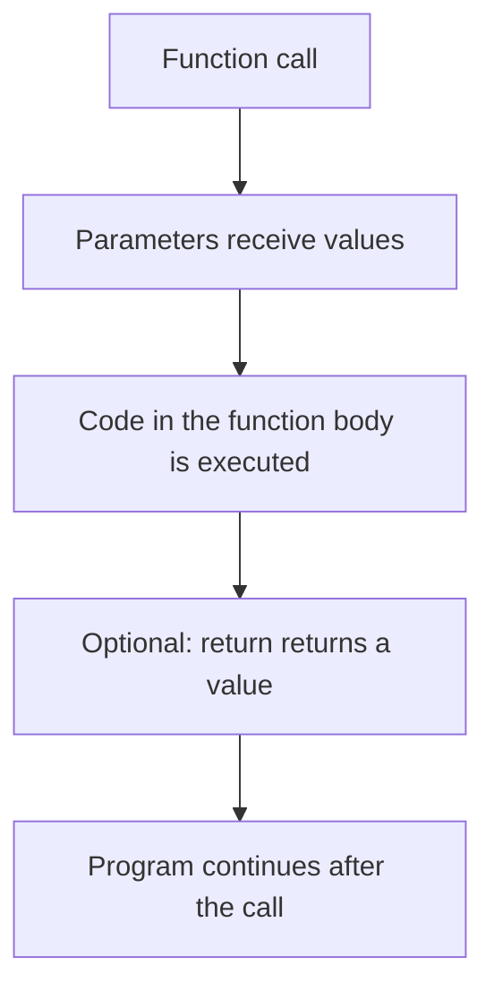
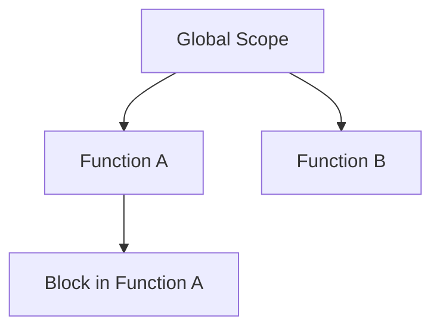
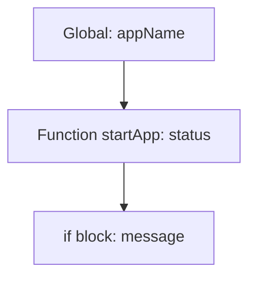

###### Topics

Functions in JavaScript

- Defining and calling functions
- Passing parameters and using return values
- Understanding the difference between reusable code and direct code

Arrow Functions

- Basic syntax of arrow functions
- Getting to know simple differences from classic functions

Scope – Basics

- Difference between global and local scope
- Importance of let and const in relation to variable visibility


<br><br><br>

# 🧩 Functions in JavaScript

A **function** in JavaScript is a named or unnamed code block that you **define once** and **can run as often as you like**. This is what makes functions so important: You don't have to write out the same process over and over again, but encapsulate it in one place and call it as needed. JavaScript also treats functions as so-called **first-class citizens** – this means you can store them in variables, pass them to other functions, or return them as a return value ([Functions – MDN](https://developer.mozilla.org/en-US/docs/Web/JavaScript/Guide/Functions)).

Think of a function like a small tool. If, for example, you often want to calculate a price, format a text, or show a greeting, you build a function for that. After that, you only have to call this tool.


<br><br><br>

## 🛠️ Defining and Calling Functions

To **define** a function means: You describe **what it should do**.  
To **call** a function means: You start it.

The classic way looks like this:

```js
function greet() {
  console.log("Hello!");
}
```

Here's what's happening:

- `function` tells JavaScript: Here comes a function definition.
- `greet` is the name of the function.
- The round brackets `()` later hold possible parameters.
- The curly braces `{}` contain the code to be executed.

You call it like this:

```js
greet();
```

Then the code inside the function runs and in the console appears:

```js
Hello!
```

Important: **The definition alone does not execute the function.**  
Only invoking it starts it.

A simple example:

```js
function showFavoriteLanguage() {
  console.log("My favorite language is JavaScript.");
}

showFavoriteLanguage();
showFavoriteLanguage();
showFavoriteLanguage();
```

The function is called three times here. That's exactly the benefit: **write it once, use it multiple times**.

You can also define functions first and call them much later:

```js
function sayHello() {
  console.log("Hello everyone!");
}

// later in the code
sayHello();
```

With a **function declaration** as above, the function can even be called within the same scope before its position in the source code, because JavaScript processes these declarations before the code is executed. This behavior is often simply called **hoisting** ([function – MDN](https://developer.mozilla.org/en-US/docs/Web/JavaScript/Reference/Statements/function)).

Example:

```js
hello();

function hello() {
  console.log("This works.");
}
```

But for beginners, a good rule is: **Define functions as early as possible before you use them.** That way, your code remains easier to read.


<br><br><br>

### 🔍 What a Function Does Internally

When you call a function, this process runs in simplified terms:



This is important for your mental model:

1. The function starts.
2. It may receive inputs.
3. It processes those inputs.
4. It may return a result.
5. Afterwards, the rest of the code continues.


<br><br><br>

## 📥 Passing Parameters and Using Return Values

Very often, a function shouldn't always do the same thing, but **work with different values**. For this, there are **parameters**.

Parameters are placeholders in the function definition.  
**Arguments** are the actual values you pass when calling the function ([Functions – MDN](https://developer.mozilla.org/en-US/docs/Web/JavaScript/Guide/Functions)).

Example:

```js
function greetPerson(name) {
  console.log("Hello, " + name + "!");
}

greetPerson("Mia");
greetPerson("Ali");
```

Here:

- `name` is the **parameter**
- `"Mia"` and `"Ali"` are the **arguments**

The output:

```js
Hello, Mia!
Hello, Ali!
```

This makes the same function flexible.

You can also use multiple parameters:

```js
function add(a, b) {
  console.log(a + b);
}

add(3, 4);
add(10, 5);
```

The result:

```js
7
15
```

So far, the result has only been printed. Often, however, you want to **not just display** a value, but **reuse** it. For this, there's `return`.

With `return`, a function returns a value and ends its execution at that point ([return – MDN](https://developer.mozilla.org/en-US/docs/Web/JavaScript/Reference/Statements/return)).

Example:

```js
function add(a, b) {
  return a + b;
}

let result = add(3, 4);
console.log(result);
```

Output:

```js
7
```

The important difference is:

- `console.log(...)` displays something
- `return ...` gives a value back to the caller

This becomes clearest in a direct comparison:

```js
function calculateWithLog(a, b) {
  console.log(a + b);
}

function calculateWithReturn(a, b) {
  return a + b;
}

let value1 = calculateWithLog(2, 3);
let value2 = calculateWithReturn(2, 3);

console.log("value1:", value1);
console.log("value2:", value2);
```

Output:

```js
5
value1: undefined
value2: 5
```

Why is `value1` equal to `undefined`?  
Because the first function has **no return value**. If a function doesn't explicitly return something, the result is by default `undefined` ([return – MDN](https://developer.mozilla.org/en-US/docs/Web/JavaScript/Reference/Statements/return)).

This is a very common beginner mistake: People think `console.log()` is already the result. But it's not. It's just a printout.

Another example from practice:

```js
function calculateVAT(price) {
  return price * 0.19;
}

function calculateFinalPrice(netPrice) {
  let vat = calculateVAT(netPrice);
  return netPrice + vat;
}

let finalPrice = calculateFinalPrice(100);
console.log(finalPrice);
```

Here you can clearly see:

- A function can use the result of another function.
- Small, clear functions make code more understandable.
- With return values, you can combine functions.


<br><br><br>

### 🧠 Really Understanding Parameters and Return Values

It's helpful to think of functions like little machines:

- **Parameters** are the input
- **Code inside** is the processing
- **Return value** is the output

```js
function square(number) {
  return number * number;
}

let result = square(5);
console.log(result);
```

Here's what happens:

- `5` goes in as input to the function
- the function computes `5 * 5`
- `25` is returned by `return`
- `result` stores `25`

If you don't pass in a parameter that's expected, that parameter often gets the value `undefined` ([Functions – MDN](https://developer.mozilla.org/en-US/docs/Web/JavaScript/Guide/Functions)).

```js
function greet(name) {
  console.log("Hello, " + name);
}

greet();
```

Output:

```js
Hello, undefined
```

That's why it's important, when calling, to consider: **What inputs does my function actually need?**


<br><br><br>

## ♻️ Reusable Code and Direct Code

Now we're getting to a central concept of good programming.

**Direct code** means: You just write out a process exactly where you need it.

Example:

```js
let price1 = 100;
let vat1 = price1 * 0.19;
let finalPrice1 = price1 + vat1;
console.log(finalPrice1);

let price2 = 200;
let vat2 = price2 * 0.19;
let finalPrice2 = price2 + vat2;
console.log(finalPrice2);

let price3 = 300;
let vat3 = price3 * 0.19;
let finalPrice3 = price3 + vat3;
console.log(finalPrice3);
```

That works. But the code is almost identical multiple times. This quickly leads to problems in real projects:

- a lot of repetition
- changes have to be made in multiple places
- higher risk of errors
- code gets confusing

The better solution is **reusable code**:

```js
function calculateFinalPrice(price) {
  let vat = price * 0.19;
  return price + vat;
}

console.log(calculateFinalPrice(100));
console.log(calculateFinalPrice(200));
console.log(calculateFinalPrice(300));
```

Now the logic is **in one place**. If the VAT logic changes, you only have to adjust this one function.

That's one of the most important principles in software development:  
**Don't write the same process out over and over, but abstract it.**

A function helps you to

- bundle logic,
- give names to processes,
- avoid repetition,
- find errors more easily,
- make changes more quickly.

This is especially important when learning: If you notice you're writing the same code for the second or third time, that's often a sign that a function would be sensible.

Here's a direct comparison:

| Approach | Features |
|---|---|
| Direct Code | quick to write, but often confusing and hard to maintain |
| Reusable Code with Functions | cleaner, more extendable, easier to test and understand |

A good function name also makes a big difference. Instead of:

```js
function doSomething(x) {
  return x * 1.19;
}
```

this is much clearer:

```js
function calculatePriceWithVAT(price) {
  return price * 1.19;
}
```

The name already explains the intent. That helps you and others when reading later.


<br><br><br>

# ➡️ Arrow Functions

**Arrow functions** are a shorter way to write functions and were introduced with ES6 ([Arrow function expressions – MDN](https://developer.mozilla.org/en-US/docs/Web/JavaScript/Reference/Functions/Arrow_functions)).

They're called this because they use the arrow `=>`.

Arrow functions are especially handy for short functions, for example, for small calculations or when working with arrays. Still, it's important to understand that they're **not just shorter**, but also **different in some ways**.


<br><br><br>

## ✍️ Basic Syntax of Arrow Functions

The simplest form looks like this:

```js
const greet = () => {
  console.log("Hello!");
};
```

This is functionally similar to:

```js
function greet() {
  console.log("Hello!");
}
```

Here, the function is stored in a variable. This is very typical for arrow functions.

An example with a parameter:

```js
const greetPerson = name => {
  console.log("Hello, " + name + "!");
};
```

If there's exactly **one parameter**, you may omit the parentheses.  
It also works with parentheses:

```js
const greetPerson = (name) => {
  console.log("Hello, " + name + "!");
};
```

With **multiple parameters**, parentheses are required:

```js
const add = (a, b) => {
  return a + b;
};
```

If the function only **returns a single expression**, you can omit the braces and `return`. The value is then **returned automatically** ([Arrow function expressions – MDN](https://developer.mozilla.org/en-US/docs/Web/JavaScript/Reference/Functions/Arrow_functions)).

```js
const add = (a, b) => a + b;
```

That's the same as:

```js
const add = (a, b) => {
  return a + b;
};
```

A few common forms at a glance:

| Syntax | Example |
|---|---|
| No parameters | `const hello = () => "Hello";` |
| One parameter | `const double = x => x * 2;` |
| Multiple parameters | `const add = (a, b) => a + b;` |
| Multiple statements | `const test = x => { const y = x * 2; return y; };` |

Important: As soon as you use a function body with `{ ... }`, you usually also need a `return` for a result.

Example:

```js
const incorrect = (a, b) => {
  a + b;
};

console.log(incorrect(2, 3));
```

This returns:

```js
undefined
```

Why?  
Because within the curly braces, there's **no `return`**.

The right way:

```js
const correct = (a, b) => {
  return a + b;
};
```


<br><br><br>

### 🔄 Classic Function and Arrow Function Compared

```js
function multiply(a, b) {
  return a * b;
}

const multiplyShort = (a, b) => a * b;
```

Both do the same. The second version is just more compact.

For short, clear logic, this is nice.  
For longer or more complex processes, the classic syntax may be more readable. Good code isn't automatically the shortest code, but the most understandable.


<br><br><br>

## ⚖️ Simple Differences from Classic Functions

Arrow functions aren't just a shorter syntax. There are some important differences.

| Topic | Classic Function | Arrow Function |
|---|---|---|
| Syntax | longer | shorter |
| Own `this` | yes | no |
| Own `arguments` | yes | no |
| Usable as constructor with `new` | yes | no |

The most important practical difference is: **Arrow functions don't have their own `this`**. Instead, they inherit `this` from the surrounding context ([Arrow function expressions – MDN](https://developer.mozilla.org/en-US/docs/Web/JavaScript/Reference/Functions/Arrow_functions)).

For beginners, this is enough:

- A classic function gets its own `this`.
- An arrow function "borrows" `this` from outside.

This is especially important with objects.

Example with a classic function:

```js
const person = {
  name: "Lena",
  sayName: function () {
    console.log(this.name);
  }
};

person.sayName();
```

Output:

```js
Lena
```

Here, `this` refers to the object `person`.

If, instead, you use an arrow function as a method, this can be problematic:

```js
const person = {
  name: "Lena",
  sayName: () => {
    console.log(this.name);
  }
};

person.sayName();
```

Here, `this` is **not** the `person` object, because the arrow function doesn't have its own `this`. That's why arrow functions are often not the right choice as object methods if you want to access properties of the object via `this` ([Arrow function expressions – MDN](https://developer.mozilla.org/en-US/docs/Web/JavaScript/Reference/Functions/Arrow_functions)).

Another difference: Arrow functions don't have their own `arguments` object. If you want to flexibly collect all passed values, you usually use **rest parameters** like `(...args)` nowadays.

```js
const showAll = (...values) => {
  console.log(values);
};

showAll(1, 2, 3);
```

Arrow functions also **can't be used as constructors** with `new` ([Arrow function expressions – MDN](https://developer.mozilla.org/en-US/docs/Web/JavaScript/Reference/Functions/Arrow_functions)).

For the basics, you can remember this rule of thumb:

- **Classic functions**: good for general functions and methods with `this`
- **Arrow functions**: good for short functions and places where you consciously want to keep the outer `this`


<br><br><br>

# 🔍 Scope – Basics (Visibility Areas)

**Scope** means roughly **validity area** or **visibility area** in English. It refers to:  
**Where in the code can a variable or function be accessed?** ([Scope – MDN Glossary](https://developer.mozilla.org/en-US/docs/Glossary/Scope)).

This is a core concept in JavaScript. Many errors don't stem from incorrect calculations but because a variable **isn't visible at the point you want to use it**.

If you understand scope, you'll understand better:

- why some variables are available everywhere,
- why others exist only in a function,
- why `let` and `const` are so important,
- why order in code is crucial.


<br><br><br>

## 🌍 Difference between Global and Local Scope

The **global scope** is the area outside of functions or specific blocks. A variable declared there is generally usable in many places, depending on the runtime context ([Scope – MDN Glossary](https://developer.mozilla.org/en-US/docs/Glossary/Scope)).

Example:

```js
let language = "JavaScript";

function showLanguage() {
  console.log(language);
}

showLanguage();
console.log(language);
```

Here, `language` is globally visible. You can access it both inside and outside the function.

The **local scope** is a smaller section of the code, for example, inside a function.

```js
function testLocal() {
  let message = "I am local";
  console.log(message);
}

testLocal();
console.log(message);
```

The last line leads to an error because `message` only exists **inside** the function.

That's the heart of local scope:  
**What is defined inside is not automatically visible outside.**

Functions create their own scope. Variables you declare there with `let`, `const` or even `var` are initially part of that scope.

A clear illustration:



Visibility roughly works like this:

- Inside, you can often access stuff from outside.
- Outside, you can't access stuff from inside.

Example:

```js
let outside = "outside";

function example() {
  let inside = "inside";
  console.log(outside); // works
  console.log(inside); // works
}

example();
console.log(outside); // works
console.log(inside); // Error
```

This is a very important rule:  
**Inner areas often know about outer variables, but outer areas don't know about inner variables.**

This is also called nested scopes or lexical scope. A function can access variables defined in its outer context ([Closures – MDN](https://developer.mozilla.org/en-US/docs/Web/JavaScript/Guide/Closures)).

Another important point: blocks like `if`, `for` or `while` also create their own scope – at least for `let` and `const`.

```js
if (true) {
  let text = "only visible here";
  console.log(text);
}

console.log(text); // Error
```

That's why nowadays we don't just talk about global and local scope but often about **block scope** as well.


<br><br><br>

### 🏠 Scope as Rooms in a House

A very helpful analogy is this:

- The **global scope** is the whole house.
- A **function** is a room.
- A **block** like `if` or `for` is maybe a small closed-off area in the room.

If a variable is in the hallway, you can often get it from a room.  
But if it's in a certain room, it's **not automatically in the whole house**.

That's how scope works.

Example:

```js
let house = "I am in the house";

function room() {
  let closet = "I am in the room";
  console.log(house);
  console.log(closet);
}

room();
```

That works. But outside of `room()`, `closet` is not accessible.


<br><br><br>

## 🔐 The Importance of `let` and `const` Regarding Variable Visibility

`let` and `const` are modern ways to declare variables. Both are **block-scoped**. That means: They only apply in the block where they were defined, for example, inside a function, a loop, or an `if` block ([let – MDN](https://developer.mozilla.org/en-US/docs/Web/JavaScript/Reference/Statements/let), [const – MDN](https://developer.mozilla.org/en-US/docs/Web/JavaScript/Reference/Statements/const)).

Example with `let`:

```js
if (true) {
  let number = 42;
  console.log(number);
}

console.log(number); // Error
```

Example with `const`:

```js
if (true) {
  const pi = 3.14;
  console.log(pi);
}

console.log(pi); // Error
```

In terms of **visibility**, `let` and `const` behave the same:

- both are block-scoped
- both aren't accessible outside the block
- both help to keep variables well-contained

The difference between them isn't in scope, but in **whether you can reassign the variable name later**:

- `let`: reassignment allowed
- `const`: reassignment not allowed ([const – MDN](https://developer.mozilla.org/en-US/docs/Web/JavaScript/Reference/Statements/const))

Example:

```js
let points = 10;
points = 20; // allowed

const country = "Germany";
country = "Austria"; // Error
```

Important: With `const`, the **binding** is constant, not necessarily the entire content of an object or array.

```js
const person = { name: "Mia" };
person.name = "Ali"; // allowed

const numbers = [1, 2, 3];
numbers.push(4); // allowed
```

Not allowed would be:

```js
const person = { name: "Mia" };
person = { name: "Ali" }; // Error
```

For learners, this way of thinking is very useful:

- Use **`const` by default** when the reference shouldn't change.
- Use **`let`** when you plan to assign a new value later.

That makes your code clearer and helps you avoid accidental changes.

A very important connection between visibility and `let`/`const` is that neither can be used normally before their declaration. They're in a so-called **temporal dead zone** until their declaration ([let – MDN](https://developer.mozilla.org/en-US/docs/Web/JavaScript/Reference/Statements/let), [const – MDN](https://developer.mozilla.org/en-US/docs/Web/JavaScript/Reference/Statements/const)).

Example:

```js
console.log(name);
let name = "Mia";
```

That gives an error.

The practical rule for beginners is simple:  
**Declare `let` and `const` before you use them.**

That makes your code not just correct, but also more readable.


<br><br><br>

### 🧱 Why `let` and `const` Suit Visibility Better Than Untargeted Variables

If variables are visible too widely, code becomes hard to understand. Then, nearly any part of the program could change the value. That makes debugging unnecessarily hard.

With `let` and `const`, you can deliberately **keep variables close to where they're needed**.

Example:

```js
function calculatePrice(price) {
  const vatRate = 0.19;
  const vat = price * vatRate;
  const finalPrice = price + vat;
  return finalPrice;
}
```

This is very readable because:

- `vatRate`, `vat`, and `finalPrice` are only visible where needed
- nobody can accidentally use them outside the function
- the function is self-contained

This helps you develop a good mindset:  
**Variables should be as narrowly visible as possible, but as widely as necessary.**


<br><br><br>

### 👀 Local, Global, and Block Scope in a Combined Example

```js
const appName = "LearnApp"; // global

function startApp() {
  const status = "started"; // local to the function

  if (status === "started") {
    let message = "The app is running"; // block-scoped
    console.log(appName);  // globally visible
    console.log(status);   // visible from function scope
    console.log(message);  // visible from block scope
  }

  console.log(appName);  // visible
  console.log(status);   // visible
  console.log(message);  // Error
}

startApp();

console.log(appName); // visible
console.log(status);  // Error
```

This example shows the hierarchy very well:

- `appName` is global and therefore visible in many places
- `status` lives only in `startApp()`
- `message` lives only in the `if` block

You can think of it like concentric areas:



The deeper a variable is defined, the smaller its visibility area.


<br><br><br>

### 🧭 Good Mindset for Core Tech Fundamentals

If you really want to learn JavaScript basics well, always think of functions and scope together.

A function isn't just a reusable code block. It's also its own **thinking and working space**:

- It takes inputs.
- It processes data.
- It returns a result.
- It protects internal variables from unnecessary outside access.

This is how structured code is created.

Especially when learning, this approach will help you:

1. **Understand the process**: What should the function do?
2. **Determine the inputs**: Which parameters does it need?
3. **Determine the result**: What should be returned?
4. **Deliberately limit variables**: What truly needs to be visible outside?
5. **Choose the right syntax**: classic function or arrow function

If you keep these points in mind, you'll not just memorize syntax, but really understand the core architecture behind JavaScript code.