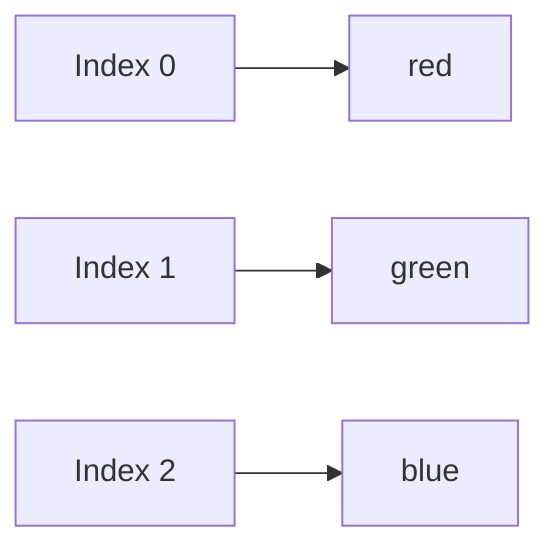
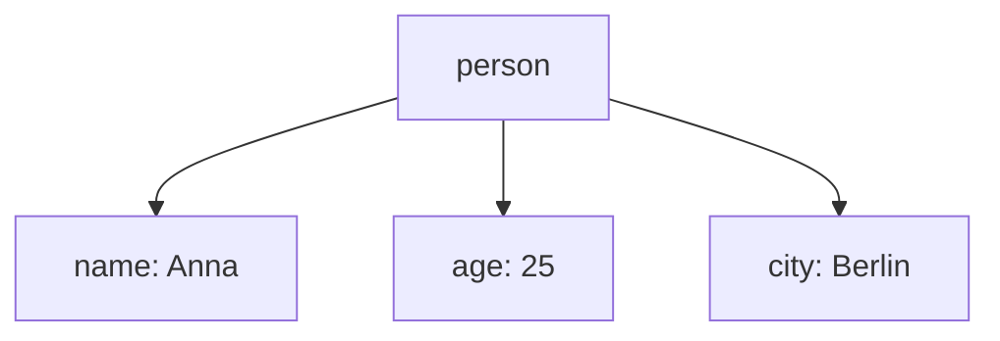

###### Topics

Arrays

- Create arrays and access elements
- Iterate through arrays with loops and forEach
- Use basic array methods

Objects

- Create objects and access properties
- Add and modify properties
- Understand the difference between arrays and objects

<br><br><br>
# 🧠 Arrays and Objects in JavaScript

Arrays and objects are among the most important fundamentals in JavaScript. If you truly understand them, almost everything else will become easier for you later: loops, functions, DOM manipulation, APIs, data processing, and even frameworks like React or Vue constantly build on these concepts.

You can think of both data types as **containers for data**. The difference is **how** this data is stored and accessed:

- **Arrays** store values in an **ordered sequence**
- **Objects** store values as **key-value property pairs**

To help you understand the difference clearly, we’ll look at both one after the other.

<br><br><br>
## 📦 Arrays

An array is an **ordered list of values**. These values can be numbers, texts, booleans, other arrays, or even objects. In JavaScript, array elements are accessed by their **index**, which always starts at **0** ([Indexed collections](https://developer.mozilla.org/en-US/docs/Web/JavaScript/Guide/Indexed_collections)).

This is a very important point: The **first element** is not at position 1, but at position 0.

<br><br><br>
### 🛠️ Create arrays and access elements

You create an array with **square brackets `[]`**.

```js
const colors = ["red", "green", "blue"];
```

Here the array contains three values:

- `"red"`
- `"green"`
- `"blue"`

Since arrays are ordered, each element has a fixed position:

- `"red"` is at index `0`
- `"green"` is at index `1`
- `"blue"` is at index `2`

You access a single element by specifying the index in square brackets:

```js
const colors = ["red", "green", "blue"];

console.log(colors[0]); // red
console.log(colors[1]); // green
console.log(colors[2]); // blue
```

If you access an index that doesn’t exist, you get back `undefined`.

```js
const colors = ["red", "green", "blue"];

console.log(colors[5]); // undefined
```

You can get the number of elements in an array using the `.length` property ([Array](https://developer.mozilla.org/en-US/docs/Web/JavaScript/Reference/Global_Objects/Array)).

```js
const colors = ["red", "green", "blue"];

console.log(colors.length); // 3
```

You can also change array values by assigning a new value to an index:

```js
const colors = ["red", "green", "blue"];

colors[1] = "yellow";

console.log(colors); // ["red", "yellow", "blue"]
```

Arrays can contain mixed data types, although in clean code you generally do so only when it really makes sense.

```js
const data = ["Anna", 25, true];
```

For beginners, it is often better to keep arrays as **uniform** as possible, for example, storing only numbers or only names in an array. This makes the code easier to understand.

<br><br><br>
### 👀 How you can imagine an array



An array is like a row of numbered compartments. You get a value by knowing its number.

<br><br><br>
### 🔁 Iterate through arrays with loops and `forEach`

Very often, you don’t just want to read a single element, but **process all elements one after the other**. This is exactly what loops are for.

There are several ways to iterate through an array. For beginners, especially these two are important:

- the classic `for` loop
- the `forEach()` method

`forEach()` runs a function for each element in the array ([Array.prototype.forEach()](https://developer.mozilla.org/en-US/docs/Web/JavaScript/Reference/Global_Objects/Array/forEach)).

<br><br><br>
### 🔁 The classic `for` loop

The classic `for` loop is especially useful when you want to work with indices.

```js
const colors = ["red", "green", "blue"];

for (let i = 0; i < colors.length; i++) {
  console.log(i, colors[i]);
}
```

What happens here exactly?

1. `let i = 0`  
   The loop starts at the first index.

2. `i < colors.length`  
   The loop runs as long as `i` is less than the array’s length.

3. `i++`  
   After each iteration, `i` is increased by 1.

As a result, all elements are output one after another:

```js
0 "red"
1 "green"
2 "blue"
```

The big advantage of the `for` loop: You have **full control**. You can go forwards, backwards, or step by larger increments through the array.

For example, going backward:

```js
const colors = ["red", "green", "blue"];

for (let i = colors.length - 1; i >= 0; i--) {
  console.log(colors[i]);
}
```

<br><br><br>
### 🔂 `forEach()` simply explained

`forEach()` is an array method. It automatically iterates through every element of the array and calls a function for each ([Array.prototype.forEach()](https://developer.mozilla.org/en-US/docs/Web/JavaScript/Reference/Global_Objects/Array/forEach)).

```js
const colors = ["red", "green", "blue"];

colors.forEach(function(color) {
  console.log(color);
});
```

The result:

```js
red
green
blue
```

Modern syntax using arrow function:

```js
const colors = ["red", "green", "blue"];

colors.forEach((color) => {
  console.log(color);
});
```

You can remember `forEach()` like this:

> “For each element in the array, please execute this code.”

Very often you want not only the element, but also the index. That is also possible:

```js
const colors = ["red", "green", "blue"];

colors.forEach((color, index) => {
  console.log(index, color);
});
```

Here:

- `color` is the current element
- `index` is the position in the array

The result:

```js
0 "red"
1 "green"
2 "blue"
```

<br><br><br>
### ⚖️ `for` or `forEach()`?

Both are correct, but they have slightly different use cases.

| Method     | When useful?                   | Advantage           |
|------------|-------------------------------|---------------------|
| `for`      | When you actively need the index or want full control | flexible            |
| `forEach()`| When you just want to process all elements in sequence | very readable       |

One important point: `forEach()` is convenient but not always as flexible as a classic loop. For example, you can’t easily break out of it early using `break` like you can in a regular `for` loop ([Array.prototype.forEach()](https://developer.mozilla.org/en-US/docs/Web/JavaScript/Reference/Global_Objects/Array/forEach)).

For beginners, the main rule is:

- If you want to learn the principle of loops, learn `for` first
- If you want to write clean, easily readable code for “each element in sequence”, `forEach()` is often very pleasant

<br><br><br>
### 🧰 Use basic array methods

JavaScript arrays have many built-in methods for modifying or checking data ([Array](https://developer.mozilla.org/en-US/docs/Web/JavaScript/Reference/Global_Objects/Array)).

For starters, these methods are especially important:

<br><br><br>
### ➕ `push()` – Add at the end

With `push()`, you add an element at the **end** of the array ([Array.prototype.push()](https://developer.mozilla.org/en-US/docs/Web/JavaScript/Reference/Global_Objects/Array/push)).

```js
const animals = ["dog", "cat"];

animals.push("mouse");

console.log(animals); // ["dog", "cat", "mouse"]
```

This is useful when you want to build up a list step by step.

<br><br><br>
### ➖ `pop()` – Remove the last element

With `pop()`, you remove the **last** element from the array ([Array.prototype.pop()](https://developer.mozilla.org/en-US/docs/Web/JavaScript/Reference/Global_Objects/Array/pop)).

```js
const animals = ["dog", "cat", "mouse"];

animals.pop();

console.log(animals); // ["dog", "cat"]
```

`pop()` also returns the removed element:

```js
const animals = ["dog", "cat", "mouse"];
const removed = animals.pop();

console.log(removed); // "mouse"
```

<br><br><br>
### ⬅️ `shift()` – Remove the first element

With `shift()`, you remove the **first** element ([Array.prototype.shift()](https://developer.mozilla.org/en-US/docs/Web/JavaScript/Reference/Global_Objects/Array/shift)).

```js
const numbers = [10, 20, 30];

numbers.shift();

console.log(numbers); // [20, 30]
```

<br><br><br>
### ➡️ `unshift()` – Add at the beginning

With `unshift()`, you add an element **at the beginning** ([Array.prototype.unshift()](https://developer.mozilla.org/en-US/docs/Web/JavaScript/Reference/Global_Objects/Array/unshift)).

```js
const numbers = [20, 30];

numbers.unshift(10);

console.log(numbers); // [10, 20, 30]
```

<br><br><br>
### 🔎 `includes()` – Check if a value exists

With `includes()`, you check if a certain value is in the array ([Array.prototype.includes()](https://developer.mozilla.org/en-US/docs/Web/JavaScript/Reference/Global_Objects/Array/includes)).

```js
const colors = ["red", "green", "blue"];

console.log(colors.includes("green")); // true
console.log(colors.includes("yellow")); // false
```

This is very handy when you quickly want to know if a value is present.

<br><br><br>
### ✂️ `slice()` – Get part of an array

With `slice()`, you create a **new array** with a section from the original array, without modifying the original ([Array.prototype.slice()](https://developer.mozilla.org/en-US/docs/Web/JavaScript/Reference/Global_Objects/Array/slice)).

```js
const numbers = [10, 20, 30, 40, 50];

const section = numbers.slice(1, 4);

console.log(section); // [20, 30, 40]
console.log(numbers);     // [10, 20, 30, 40, 50]
```

Important:

- Start index is inclusive
- End index is exclusive

So: `slice(1, 4)` means “from index 1 up to, but not including, index 4”.

<br><br><br>
### 🔗 `join()` – Turn array into a string

With `join()`, you concatenate all elements into a string ([Array.prototype.join()](https://developer.mozilla.org/en-US/docs/Web/JavaScript/Reference/Global_Objects/Array/join)).

```js
const words = ["Hello", "you", "there"];

console.log(words.join(" ")); // "Hello you there"
console.log(words.join("-")); // "Hello-you-there"
```

This is useful when you want to prepare content for output or text representation.

<br><br><br>
### 📌 Important mindset when working with arrays

Whenever you work with arrays, you should always ask yourself these questions:

1. **Is order important?**
2. **Do I access values by their position?**
3. **Do I want to store many similar values as a list?**

If you answer “yes” to these, then an array is usually the right choice.

<br><br><br>
## 🧱 Objects

An object stores data not at fixed positions like an array, but via **properties**. A property consists of a **key** and a **value**. In JavaScript, objects are the central structure to describe related information ([Working with objects](https://developer.mozilla.org/en-US/docs/Web/JavaScript/Guide/Working_with_objects)).

An object is especially well-suited for things like:

- a person
- a product
- a user account
- an order
- a car

Because such things have properties with names.

<br><br><br>
### 🏗️ Creating objects and accessing properties

You create an object with **curly braces `{}`**.

```js
const person = {
  name: "Anna",
  age: 25,
  city: "Berlin"
};
```

This object has three properties:

- `name`
- `age`
- `city`

Each property has a value:

- `name` → `"Anna"`
- `age` → `25`
- `city` → `"Berlin"`

You can access properties in two ways:

1. **Dot notation**
2. **Bracket notation** with square brackets

Dot notation is the most common and usually most readable way ([Property accessors](https://developer.mozilla.org/en-US/docs/Web/JavaScript/Reference/Operators/Property_accessors)).

```js
const person = {
  name: "Anna",
  age: 25,
  city: "Berlin"
};

console.log(person.name);  // Anna
console.log(person.age); // 25
```

Bracket notation uses strings:

```js
const person = {
  name: "Anna",
  age: 25,
  city: "Berlin"
};

console.log(person["name"]);  // Anna
console.log(person["city"]); // Berlin
```

Both variants access the same data. The practical difference:

- **Dot notation** is used when the property name is fixed/known
- **Bracket notation** is used when the name is dynamic or contains special characters

Example using a variable:

```js
const person = {
  name: "Anna",
  age: 25
};

const property = "name";

console.log(person[property]); // Anna
```

With dot notation, this would **not** work:

```js
console.log(person.property); // looks for "property", not for "name"
```

This is a very important distinction.

<br><br><br>
### 🧠 How you can imagine an object



An object therefore doesn’t function like a numbered list, but more like a dataset with named fields.

<br><br><br>
### ✏️ Add and modify properties

Objects in JavaScript are very flexible. You can add new properties afterwards or change existing values ([Working with objects](https://developer.mozilla.org/en-US/docs/Web/JavaScript/Guide/Working_with_objects)).

Add a new property:

```js
const person = {
  name: "Anna",
  age: 25
};

person.city = "Berlin";

console.log(person);
```

Result:

```js
{
  name: "Anna",
  age: 25,
  city: "Berlin"
}
```

Change existing property:

```js
const person = {
  name: "Anna",
  age: 25
};

person.age = 26;

console.log(person.age); // 26
```

This also works with bracket notation:

```js
const person = {
  name: "Anna"
};

person["profession"] = "Developer";

console.log(person.profession); // Developer
```

If you access a property that does not exist, you get `undefined`, just like with arrays:

```js
const person = {
  name: "Anna"
};

console.log(person.hobby); // undefined
```

<br><br><br>
### 🗑️ Remove properties

You should at least know how to remove properties. The `delete` operator is used for this ([delete operator](https://developer.mozilla.org/en-US/docs/Web/JavaScript/Reference/Operators/delete)).

```js
const person = {
  name: "Anna",
  age: 25,
  city: "Berlin"
};

delete person.city;

console.log(person); // { name: "Anna", age: 25 }
```

In practice, `delete` is not used constantly in every project, but the principle is important: Objects can change by adding, modifying, or removing properties.

<br><br><br>
### 🪆 Objects can also be more complex

Objects can contain other objects or arrays. This is very common in real software.

```js
const user = {
  name: "Ali",
  age: 30,
  hobbies: ["Reading", "Cycling"],
  address: {
    city: "Hamburg",
    zip: "20095"
  }
};
```

Accessing nested values:

```js
console.log(user.hobbies[0]);      // Reading
console.log(user.address.city);   // Hamburg
```

You can see how arrays and objects work together in practice:

- `hobbies` is an array
- `address` is an object

<br><br><br>
## ⚖️ Understand the difference between arrays and objects

This is one of the most important points of all. Many beginners initially just see: “Both store data.” That’s true, but the real difference lies in the **structure** and the **access principle**.

Arrays and objects are closely related in JavaScript; technically, arrays are a special kind of object, but they’re intended for ordered lists and should be used as such ([Array](https://developer.mozilla.org/en-US/docs/Web/JavaScript/Reference/Global_Objects/Array)).

The practical difference:

- **Array** = data via **positions / order**
- **Object** = data via **names / properties**

<br><br><br>
### 📚 Comparison in simple terms

Imagine you want to store three colors.

As an array:

```js
const colors = ["red", "green", "blue"];
```

Here it matters:

- which element stands first
- which is second
- which is third

You access them like:

```js
colors[0]
colors[1]
colors[2]
```

Now imagine you want to store data about a person.

As an object:

```js
const person = {
  name: "Anna",
  age: 25,
  city: "Berlin"
};
```

Here it matters:

- what the property is called
- what it means

You access them like:

```js
person.name
person.age
person.city
```

So you see:

- With an array, you care about the **order**
- With an object, you care about the **meaning of the field**

<br><br><br>
### 🆚 Direct comparison in a table

| Feature       | Array                | Object                      |
|---------------|----------------------|-----------------------------|
| Structure     | ordered list         | collection of properties    |
| Access        | via index (`[0]`, `[1]`) | via key (`.name`, `["name"]`) |
| Order         | important            | usually not the main point  |
| Typical usage | lists, collections   | descriptions of things      |
| Example       | `["red", "green", "blue"]` | `{ name: "Anna", age: 25 }` |

This distinction will tremendously help you model data later.

<br><br><br>
### 🧭 When to use an array, when to use an object?

Use an **array** if you:

- want to store multiple similar values
- have an order
- want to iterate over all values
- access values by their position

Example:

```js
const numbers = [5, 10, 15, 20];
```

Use an **object** if you:

- want to describe a single thing with properties
- want to name data
- need easily readable access via property names

Example:

```js
const car = {
  brand: "BMW",
  color: "black",
  year: 2022
};
```

<br><br><br>
### 🚫 Common beginner mistakes

A very common mistake is to use arrays like objects or treat objects like arrays.

For example, this is not a meaningful array usage:

```js
const person = [];
person.name = "Anna";
```

Technically, JavaScript may allow this because arrays are objects internally, but logically, it’s sloppy and confusing. If you want to store properties like `name` or `age`, use an **object**, not an array ([Working with objects](https://developer.mozilla.org/en-US/docs/Web/JavaScript/Guide/Working_with_objects)).

It’s just as wrong to cram a list of values into an object when order and iteration matter:

```js
const colors = {
  0: "red",
  1: "green",
  2: "blue"
};
```

You can write this, but if it’s an ordered list, it belongs in an array:

```js
const colors = ["red", "green", "blue"];
```

<br><br><br>
### 🧩 Arrays and objects together in practice

In real programs, you almost never use just one or the other. Usually, you combine both.

For example, a list of users:

```js
const users = [
  { name: "Anna", age: 25 },
  { name: "Ben", age: 30 },
  { name: "Clara", age: 28 }
];
```

Here:

- `users` is an **array**
- each element in the array is an **object**

You access individual values in combination:

```js
console.log(users[0].name);  // Anna
console.log(users[1].age);   // 30
```

This is an extremely typical pattern in JavaScript, especially with API data, web apps, and data processing.

<br><br><br>
### 🏛️ Mental model for clean learning

If you really want to master arrays and objects, remember this model:

- **Array** = “I have many things of the same kind.”
- **Object** = “I describe a thing with properties.”

Examples:

- many names → array
- one person → object
- many people → array of objects
- a product with price, name, and stock → object
- many products → array of objects

This way of thinking is a core part of **Core Tech Fundamentals**, because it teaches you not just how to store data, but how to **structure it properly**. Those who can structure data cleanly will understand code much faster and write much better programs later on.