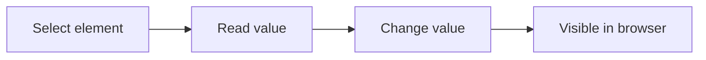
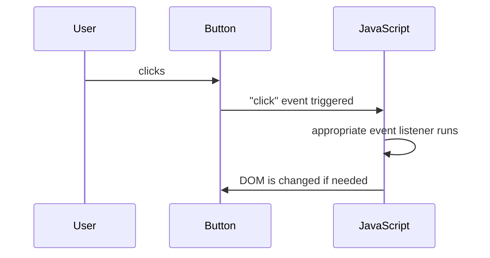
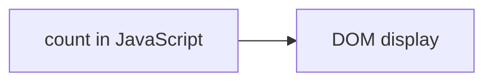
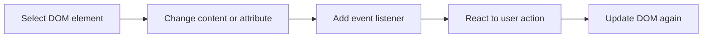

###### Topics

DOM Basics

- Select HTML elements using document.querySelector and document.getElementById
- Modify text content and simple attributes of DOM elements

Events and Event Handling

- Handle click events with event listeners
- Understand the basics of the event object

Application Project

- Combine DOM manipulation and event handling in a small web application
- Test functionality directly in the browser
- Identify and fix simple errors in the code

<br><br><br>
# 🌳 DOM Basics

When you work with JavaScript in the browser, the **DOM** is one of the most fundamental concepts. The browser doesn't just read your HTML as text but builds a **tree-like object structure** from it. This structure is called the **Document Object Model**, or **DOM** for short. JavaScript can access this structure, find elements, modify content, and react to user actions ([Document Object Model (DOM)](https://developer.mozilla.org/en-US/docs/Web/API/Document_Object_Model)).

Think of the DOM as a blueprint for your website. Each HTML element becomes an object in memory: headings, paragraphs, buttons, images, form inputs, etc. So, when you use JavaScript to change a text or hide a button, you are really editing this DOM tree.

A very simple HTML document like this:

```html
<body>
  <h1>Welcome</h1>
  <p id="info">Hello World</p>
  <button>Click me</button>
</body>
```

is internally structured something like this:

```mermaid
graph TD
  A[document]
  A --> B[html]
  B --> C[body]
  C --> D[h1]
  C --> E[p id="info"]
  C --> F[button]
```

This is important for learning:  
If you understand the DOM, you understand the core of frontend JavaScript. Many things can then be reduced to a simple pattern:

1. Find an element  
2. Read its content or property  
3. Change its content or property  
4. React to an event

This pattern runs through almost every interactive web application.

<br><br><br>
## 🧱 What the DOM Practically Means for You

In daily work, DOM manipulation usually means:

- you **select an element**
- you **change text**
- you **change attributes or properties**
- you **respond to clicks**
- you **combine everything into a small logic**

For example:

- a button is clicked
- a counter increases
- a text on the page updates
- an attribute like `disabled`, `title`, or `src` changes

This is the basis for many real interfaces.

<br><br><br>
## 🔎 Select HTML Elements with `document.querySelector` and `document.getElementById`

Before you can change anything, you first have to **find** the right element. There are various methods for this. Two of the most important are:

- `document.getElementById(...)`
- `document.querySelector(...)`

Both return a DOM element if they find something. If nothing is found, you get `null` ([Document: getElementById() method](https://developer.mozilla.org/en-US/docs/Web/API/Document/getElementById), [Document: querySelector() method](https://developer.mozilla.org/en-US/docs/Web/API/Document/querySelector)).

In summary:

| Method | Expects | Finds | Typical Use |
|---|---|---|---|
| `document.getElementById("...")` | an ID *without* `#` | exactly the element with this ID | when you want to target an element uniquely by ID |
| `document.querySelector("...")` | a CSS selector | the **first** matching element | when you want to search flexibly by class, tag, ID, or combination |

`getElementById` is very direct. `querySelector` is more flexible because it uses CSS selectors ([Document: querySelector() method](https://developer.mozilla.org/en-US/docs/Web/API/Document/querySelector)).

<br><br><br>
### 🆔 Understanding `document.getElementById(...)`

This method is ideal if your element has a unique `id`.

HTML:

```html
<p id="status">Ready</p>
```

JavaScript:

```js
const statusElement = document.getElementById("status");
console.log(statusElement);
```

Important:  
You write **just the ID name**, i.e., `"status"` and **not** `"#status"` ([Document: getElementById() method](https://developer.mozilla.org/en-US/docs/Web/API/Document/getElementById)).

This is a common beginner's mistake:

```js
// WRONG:
document.getElementById("#status");
```

Why is this wrong?  
Because `getElementById` **does not expect a CSS selector**, only the pure ID value. The `#` belongs in CSS, not in this method.

<br><br><br>
### 🎯 Understanding `document.querySelector(...)`

`querySelector` is particularly handy because you can use the same logic you know from CSS.

Examples:

```js
document.querySelector("p");         // first <p> element
document.querySelector(".info");     // first element with class="info"
document.querySelector("#status");   // element with id="status"
document.querySelector("main p");    // first <p> inside <main>
```

HTML might look like this:

```html
<main>
  <p class="info">First paragraph</p>
  <p>Second paragraph</p>
</main>
```

Then

```js
const element = document.querySelector("main p");
```

would find the **first** matching `<p>` inside `<main>` ([Document: querySelector() method](https://developer.mozilla.org/en-US/docs/Web/API/Document/querySelector)).

The word **first** is important.  
If multiple elements match, `querySelector` only gives you the first. If you need all matching elements, you'd use `querySelectorAll(...)` later, but for your basics, the principle is important: **one selector, one first matching element**.

<br><br><br>
### ⚖️ When to Use Which Method

If you are targeting an element uniquely by ID, `getElementById` is often the most straightforward choice.

If you want to stay flexible, for example:

- searching by class
- finding a nested element
- using the same selector logic as in CSS

then `querySelector` is very pleasant.

A sensible learning pattern is:

- **ID present and unique?** → `getElementById`
- **Need more flexibility?** → `querySelector`

Both methods are correct. It’s not about one being “modern” and the other “wrong.” Use the method suited for your situation.

<br><br><br>
## ✏️ Modify Text Content and Simple Attributes of DOM Elements

Once you have found an element, you can change its content or properties. This is the next major step: not just reading, but actively affecting the page.

For beginners, these are especially important:

- `textContent` for text content
- `setAttribute(...)` for simple HTML attributes
- direct properties like `value`, `src`, `href`, `disabled`

Many of these mirror HTML attributes or DOM properties ([Node: textContent property](https://developer.mozilla.org/en-US/docs/Web/API/Node/textContent), [Element: setAttribute() method](https://developer.mozilla.org/en-US/docs/Web/API/Element/setAttribute)).

<br><br><br>
### 📝 Change Text with `textContent`

If you want to change the text inside an element, `textContent` is usually the cleanest and safest basis. This property reads or sets the text content of a node ([Node: textContent property](https://developer.mozilla.org/en-US/docs/Web/API/Node/textContent)).

HTML:

```html
<p id="message">Old message</p>
```

JavaScript:

```js
const message = document.getElementById("message");
message.textContent = "New message";
```

After that, the browser shows:

```html
<p id="message">New message</p>
```

Why is `textContent` so good for beginners?

- it’s simple
- it works directly with text
- you don’t need to juggle strings with HTML in them
- it’s often safer than `innerHTML` if you only want to swap text ([Node: textContent property](https://developer.mozilla.org/en-US/docs/Web/API/Node/textContent))

You can also read out text:

```js
const currentText = message.textContent;
console.log(currentText);
```

<br><br><br>
### 🏷️ Modify Simple Attributes

HTML elements often have attributes like:

- `src`
- `href`
- `alt`
- `title`
- `disabled`
- `placeholder`

You can change such attributes with `setAttribute(...)` ([Element: setAttribute() method](https://developer.mozilla.org/en-US/docs/Web/API/Element/setAttribute)).

Example with a link:

```html
<a id="myLink" href="https://example.com">To Website</a>
```

```js
const link = document.getElementById("myLink");
link.setAttribute("href", "https://developer.mozilla.org/");
link.textContent = "To MDN";
```

Now the link points somewhere else and has new text.

You can also read attributes:

```js
const currentAddress = link.getAttribute("href");
console.log(currentAddress);
```

Reading and setting attributes is a core part of DOM manipulation.

<br><br><br>
### 🔧 Properties Instead of Attributes: Often Even More Direct

In the browser, there are not only HTML attributes but also **DOM properties** you can set directly. This often feels more natural.

Examples:

```js
image.src = "new-image.png";
button.disabled = true;
input.value = "Hello";
link.href = "https://developer.mozilla.org/";
```

This style is very common, as it is short and clear. Many standard attributes have corresponding DOM properties ([HTMLImageElement: src](https://developer.mozilla.org/en-US/docs/Web/API/HTMLImageElement/src), [HTMLInputElement: value](https://developer.mozilla.org/en-US/docs/Web/API/HTMLInputElement/value), [HTMLButtonElement: disabled](https://developer.mozilla.org/en-US/docs/Web/API/HTMLButtonElement/disabled)).

A small example:

```html
<input id="name" value="Anna">
<button id="save">Save</button>
```

```js
const nameInput = document.getElementById("name");
const saveButton = document.getElementById("save");

nameInput.value = "Max";
saveButton.disabled = true;
saveButton.textContent = "Saved";
```

Here, you change both **text** and **properties**.

<br><br><br>
### 🧠 A Clean Mental Model for DOM Manipulation

When you change content, this mental model helps:



It sounds trivial, but is extremely important for learning. Many beginners try to “just change something” without checking:

- Did I select the right element?
- Does the element even exist?
- Am I changing text, attribute, or property?
- Is the change triggered by an event?

If you keep these four questions in mind, you’ll program much more cleanly.

<br><br><br>
# ⚡ Events and Event Handling

Interactive websites come alive when something happens as a result of a user's action:

- clicking
- typing
- scrolling
- mouseover an element
- submitting a form

Such actions are called **events**. To react to them in JavaScript, you register an **event listener**—a function that runs when a certain event occurs ([EventTarget: addEventListener() method](https://developer.mozilla.org/en-US/docs/Web/API/EventTarget/addEventListener)).

<br><br><br>
## 🖱️ Handle Click Events with Event Listeners

Clicking a button is the classic first event example.

HTML:

```html
<button id="clickButton">Click me</button>
```

JavaScript:

```js
const clickButton = document.getElementById("clickButton");

clickButton.addEventListener("click", function () {
  console.log("The button was clicked.");
});
```

`addEventListener("click", ...)` means:

- listen for the event `"click"`
- when it happens, run the provided function

That's what `addEventListener` is for ([EventTarget: addEventListener() method](https://developer.mozilla.org/en-US/docs/Web/API/EventTarget/addEventListener)).

<br><br><br>
### 🧩 Basic Structure of an Event Listener

Almost always, the pattern is like this:

```js
element.addEventListener("eventname", function () {
  // React to the event
});
```

Or with a named function:

```js
function handleClick() {
  console.log("It was clicked.");
}

button.addEventListener("click", handleClick);
```

Both versions are fine. For small examples, an anonymous function in the listener is often practical. For larger programs, a named function is more readable.

Note a typical beginner's mistake:

```js
// WRONG:
button.addEventListener("click", handleClick());
```

Why is this wrong?  
Because you are **calling the function right away** instead of passing it as a reaction to the click. The correct version:

```js
button.addEventListener("click", handleClick);
```

<br><br><br>
### 🔁 What Happens When a Button Is Clicked

A click can be understood like this:



Didactically, this is a strong mental bridge:

- **User action**
- **Event occurs**
- **JavaScript reacts**
- **DOM may change**

This is what many small web applications are made of.

<br><br><br>
### 🎛️ A Click Event With a Visible DOM Change

Here, the connection between event and DOM manipulation is very clear:

HTML:

```html
<p id="status">Nothing has happened yet.</p>
<button id="startButton">Start</button>
```

JavaScript:

```js
const status = document.getElementById("status");
const startButton = document.getElementById("startButton");

startButton.addEventListener("click", function () {
  status.textContent = "The button was clicked.";
  startButton.disabled = true;
});
```

What happens here?

- The button is selected.
- The paragraph is selected.
- On click, the text is changed.
- Additionally, the button is disabled.

You're already combining several fundamentals here:

- Element selection
- Changing text
- Changing attribute/property
- Processing an event

<br><br><br>
## 🎯 Understand the Basics of the Event Object

When an event listener runs, the function can receive an **event object** by request. This object contains information about **what happened** ([Event](https://developer.mozilla.org/en-US/docs/Web/API/Event)).

Example:

```js
button.addEventListener("click", function (event) {
  console.log(event);
});
```

The `event` object comes automatically from the browser. You don’t create it yourself ([Event](https://developer.mozilla.org/en-US/docs/Web/API/Event)).

This object is extremely useful; you can react more precisely to the event.

<br><br><br>
### 📦 Key Properties of the Event Object

For beginners, these are especially helpful:

- `event.type`
- `event.target`
- `event.currentTarget`

#### `event.type`

Lets you know which type of event occurred.

```js
button.addEventListener("click", function (event) {
  console.log(event.type); // "click"
});
```

#### `event.target`

`target` is the element on which the event originally occurred ([Event: target property](https://developer.mozilla.org/en-US/docs/Web/API/Event/target)).

```js
button.addEventListener("click", function (event) {
  console.log(event.target);
});
```

#### `event.currentTarget`

`currentTarget` is the element to which the current event listener is attached ([Event: currentTarget property](https://developer.mozilla.org/en-US/docs/Web/API/Event/currentTarget)).

```js
button.addEventListener("click", function (event) {
  console.log(event.currentTarget);
});
```

In simple cases, `target` and `currentTarget` are often the same. Later, when events bubble or nested elements are involved, the difference becomes important.

<br><br><br>
### 🔍 `target` and `currentTarget` Made Easy

Suppose you have this HTML:

```html
<button id="myButton">
  <span>Save</span>
</button>
```

If you click the `<span>` text inside the button, `event.target` could be the inner `<span>`, while `event.currentTarget` remains the button where the listener is attached ([Event: target property](https://developer.mozilla.org/en-US/docs/Web/API/Event/target), [Event: currentTarget property](https://developer.mozilla.org/en-US/docs/Web/API/Event/currentTarget)).

This is crucial to understand, because many beginners think they are always the same. In simple examples they may appear so, but technically they have different meanings.

<br><br><br>
### 🛑 Quick Intro to `preventDefault()`

For normal click buttons you often don't need this. But if you're reacting to a link or form, sometimes you want to prevent the default behavior. For this, there's `event.preventDefault()` ([Event: preventDefault() method](https://developer.mozilla.org/en-US/docs/Web/API/Event/preventDefault)).

Example with a link:

```html
<a id="myLink" href="https://example.com">Continue</a>
```

```js
const myLink = document.getElementById("myLink");

myLink.addEventListener("click", function (event) {
  event.preventDefault();
  console.log("The link was clicked, but the page won't change.");
});
```

This is already a bit beyond the absolute basics but good to know. You can see:  
An event can not only provide information but also modify the browser's default behavior.

<br><br><br>
# 🛠️ Application Project

Now let’s put the pieces together in a small web application. The goal isn’t to build something huge, but to really understand how all parts connect:

- Select elements
- Modify text
- Modify properties
- Handle click events
- Use the event object
- Test directly in the browser
- Find and fix simple errors

A good learning rule:  
**Better to really understand one small app than to just copy five complicated examples.**

<br><br><br>
## 💡 Small Web Application: Click Counter with Status Display

This mini-app is consciously simple, but didactically strong. It shows you the entire basics chain in a realistic context.

Features:

- A button increases a counter.
- A text shows the current value.
- A status field explains what just happened.
- A reset button sets the counter back to zero.
- The reset button is disabled when the counter is `0`.
- The event object is used to show which element was clicked.

You can save this as **a single HTML file** and open it directly in the browser.

```html
<!DOCTYPE html>
<html lang="en">
<head>
  <meta charset="UTF-8">
  <meta name="viewport" content="width=device-width, initial-scale=1.0">
  <title>DOM and Events – Mini-App</title>
  <style>
    body {
      font-family: Arial, sans-serif;
      max-width: 700px;
      margin: 40px auto;
      padding: 0 16px;
      line-height: 1.6;
    }

    .app {
      border: 1px solid #ccc;
      border-radius: 12px;
      padding: 20px;
      background: #f9f9f9;
    }

    .status-box {
      margin: 16px 0;
      padding: 12px;
      border-radius: 8px;
      background: #eef4ff;
    }

    .counter {
      font-size: 2rem;
      font-weight: bold;
      color: #1d4ed8;
    }

    .buttons {
      display: flex;
      gap: 12px;
      margin-top: 16px;
    }

    button {
      padding: 10px 16px;
      border: none;
      border-radius: 8px;
      cursor: pointer;
      background: #2563eb;
      color: white;
      font-size: 1rem;
    }

    button:disabled {
      background: #9ca3af;
      cursor: not-allowed;
    }

    #resetButton {
      background: #dc2626;
    }
  </style>
</head>
<body>
  <div class="app">
    <h1>Mini-App: Click Counter</h1>

    <p>Current count: <span id="counterValue" class="counter">0</span></p>

    <div class="status-box">
      <p id="statusText">No click performed yet.</p>
    </div>

    <div class="buttons">
      <button id="countButton" title="Increase the counter">Click me</button>
      <button id="resetButton" disabled title="Resets the counter to 0">Reset</button>
    </div>
  </div>

  <script>
    const counterValue = document.getElementById("counterValue");
    const statusText = document.querySelector("#statusText");
    const countButton = document.getElementById("countButton");
    const resetButton = document.getElementById("resetButton");

    let count = 0;

    function updateView() {
      counterValue.textContent = count;
      resetButton.disabled = count === 0;

      if (count === 0) {
        statusText.textContent = "The counter is at 0.";
        countButton.setAttribute("title", "Increase the counter");
      } else {
        statusText.textContent = "The counter was updated.";
        countButton.setAttribute("title", "Current count: " + count);
      }
    }

    countButton.addEventListener("click", function (event) {
      count++;
      counterValue.textContent = count;
      statusText.textContent = "Clicked on: " + event.currentTarget.id;
      resetButton.disabled = false;
      countButton.setAttribute("title", "Current count: " + count);
    });

    resetButton.addEventListener("click", function (event) {
      count = 0;
      statusText.textContent = "Reset by: " + event.currentTarget.id;
      updateView();
    });

    updateView();
  </script>
</body>
</html>
```

This app uses exactly the fundamentals you should learn:

- `document.getElementById("counterValue")`
- `document.querySelector("#statusText")`
- `textContent` for changing text
- `setAttribute("title", ...)` for changing an attribute
- `disabled` as a property
- `addEventListener("click", ...)`
- `event.currentTarget.id` from the event object

<br><br><br>
## 🧭 Step-by-Step Explanation of the Mini-App

To really understand the logic, let’s break down the app into meaningful parts.

<br><br><br>
### 🔎 1. Select Elements

```js
const counterValue = document.getElementById("counterValue");
const statusText = document.querySelector("#statusText");
const countButton = document.getElementById("countButton");
const resetButton = document.getElementById("resetButton");
```

Here, you’re grabbing four DOM elements from the HTML.

- `counterValue` displays the count
- `statusText` displays the message
- `countButton` increments the counter
- `resetButton` resets the counter

Note the deliberate comparison:

- once with `getElementById(...)`
- once with `querySelector(...)`

You can see the same core logic with two different selection methods.

<br><br><br>
### 🧮 2. Store State in a Variable

```js
let count = 0;
```

The DOM only shows things, but the real value of the counter is stored in the JavaScript variable `count`.

This is a crucial learning point:  
The page doesn't "magically" display the state. Usually there is an **internal variable**, and the DOM is just the visible presentation.

You can imagine it like this:



When `count` changes, you need to update the display in the DOM.

<br><br><br>
### 🔄 3. Update the Display

```js
function updateView() {
  counterValue.textContent = count;
  resetButton.disabled = count === 0;

  if (count === 0) {
    statusText.textContent = "The counter is at 0.";
    countButton.setAttribute("title", "Increase the counter");
  } else {
    statusText.textContent = "The counter was updated.";
    countButton.setAttribute("title", "Current count: " + count);
  }
}
```

This function bundles all visible changes.

What exactly happens?

- `counterValue.textContent = count;`  
  Updates the number in the `<span>`.

- `resetButton.disabled = count === 0;`  
  The reset button is only active when there’s actually something to reset.

- `statusText.textContent = ...`  
  The status message updates.

- `countButton.setAttribute("title", ...)`  
  The button’s `title` attribute is adjusted.

This is good structure:  
Instead of modifying the DOM uncoordinatedly in many places, you gather logical updates in a function.

<br><br><br>
### 🖱️ 4. Handle Click on the Counter Button

```js
countButton.addEventListener("click", function (event) {
  count++;
  counterValue.textContent = count;
  statusText.textContent = "Clicked on: " + event.currentTarget.id;
  resetButton.disabled = false;
  countButton.setAttribute("title", "Current count: " + count);
});
```

This is the heart of the interaction.

On click:

1. `count++` increases the internal value.
2. `counterValue.textContent = count` shows the new value.
3. `statusText.textContent = ...` writes a message.
4. `event.currentTarget.id` reads from the event object which listener reacted.
5. `resetButton.disabled = false` enables the reset button.
6. The `title` attribute is updated.

Here you can see well how an event directly triggers DOM manipulation.

<br><br><br>
### 🔁 5. Handle Click on the Reset Button

```js
resetButton.addEventListener("click", function (event) {
  count = 0;
  statusText.textContent = "Reset by: " + event.currentTarget.id;
  updateView();
});
```

This resets the counter to `0`. Then the code calls `updateView()` to keep the display consistent.

This is cleaner than repeating the same code everywhere.  
Thinking this way is a step towards good code structure.

<br><br><br>
## 🌐 Test Functionality Directly in the Browser

Especially with DOM and events, it's important that you don't just read code but actually try it in the browser. That's where DOM and events actually run.

The easiest is with a single HTML file.

### How to proceed

1. Create a file named `index.html`
2. Copy the entire code inside
3. Save the file
4. Open it in the browser (double-click)

You can then immediately click and observe the UI changing.

If you want to work more professionally, you can also use a local development server, for example via an editor extension like Live Server. For these basics, that's not strictly necessary yet.

Most important of all:  
**Test every small change immediately.**  
This greatly accelerates your learning because you see cause and effect right away.

<br><br><br>
### 🧪 Why Direct Testing Is So Valuable for Learning

When you learn DOM and event handling, you are working with visible changes. This is ideal since you get instant feedback.

For example, if you write this code:

```js
statusText.textContent = "Hello";
```

you immediately see in the browser whether:

- the right element was selected
- the text was actually changed
- your script is running at all

That's a huge advantage compared to more abstract topics. Use it consciously:  
**small change → save → check browser → continue**

This leads to much more stable learning than simply copying code.

<br><br><br>
## 🐞 Identify and Fix Simple Errors in Code

At the beginning, errors often seem chaotic. In reality, many DOM errors are very typical and repeat constantly. If you know these patterns, you'll be much calmer when debugging.

The browser usually shows JavaScript errors in the developer tools, especially in the **console**. There you can read error messages and find out which line has a problem. This is a crucial step in troubleshooting ([What went wrong? Troubleshooting JavaScript](https://developer.mozilla.org/en-US/docs/Learn_web_development/Extensions/Testing/Troubleshooting_JavaScript)).

On Windows/Linux, you usually open the developer tools with `F12` or `Ctrl + Shift + I`, on macOS typically via the browser's developer tools. The key is not the keyboard shortcut, but to **actively use the console**.

<br><br><br>
### ❌ Typical Error Patterns in DOM Code

| Error Pattern | Common Cause | Solution |
|---|---|---|
| `Cannot read properties of null` | Element not found | Check selector, check ID, check script timing |
| Button doesn't react | Event listener is not on the right element | Check element selection, write `addEventListener` correctly |
| `getElementById("#id")` doesn't work | Used `#` by mistake | Pass only `"id"` without `#` |
| Function runs right away instead of on click | Function passed with `()` | Pass reference: `handler` not `handler()` |
| Text does not visibly change | Wrong element selected or wrong code path | Use `console.log(...)` and check element |

These are not rare problems, but standard beginner errors. When you spot them, you learn much faster.

<br><br><br>
### 🧱 The Classic: `null` Instead of an Element

One of the most frequent errors is:

```js
const status = document.getElementById("status");
status.textContent = "New";
```

If the element with `id="status"` doesn't exist, `status` is `null`. JavaScript can't set `textContent` on `null`, so it throws an error ([Document: getElementById() method](https://developer.mozilla.org/en-US/docs/Web/API/Document/getElementById)).

Typical reasons:

- ID misspelled in HTML
- ID misspelled in JavaScript
- Script runs before the HTML element is loaded

You can check if the element was found:

```js
const status = document.getElementById("status");
console.log(status);
```

If you see `null` in the console, you know immediately:  
The problem is in selecting the element—not in changing the text.

<br><br><br>
### ⏱️ Script Runs Too Early

Another common mistake is your JavaScript executes **before** the HTML element exists in the DOM.

For example, problematic:

```html
<head>
  <script>
    const button = document.getElementById("myButton");
    console.log(button); // often null
  </script>
</head>
<body>
  <button id="myButton">Click</button>
</body>
```

Here, the script runs when the button isn't in the document yet.

Two usual solutions:

1. Place the `<script>` at the very end of `<body>`  
2. Wait for `DOMContentLoaded`, i.e., run your code after the HTML is parsed ([Document: DOMContentLoaded event](https://developer.mozilla.org/en-US/docs/Web/API/Document/DOMContentLoaded_event))

Example with `DOMContentLoaded`:

```js
document.addEventListener("DOMContentLoaded", function () {
  const button = document.getElementById("myButton");
  console.log(button);
});
```

For beginners, the first solution is often easiest:  
Just put your script right before `</body>`.

<br><br><br>
### ✍️ Typos in Methods and Event Names

JavaScript is strict about spelling. Even tiny typos break things.

Examples:

```js
// WRONG
button.addEventListner("click", handler);

// WRONG
button.addEventListener("clik", handler);
```

Correct:

```js
button.addEventListener("click", handler);
```

These errors are trivial, but very common. That's why for debugging, always calmly check the spelling first.

<br><br><br>
### 🔍 Use `console.log(...)` to Check Things

`console.log(...)` is one of the most important learning tools. Not because it looks “pro,” but because it shows you what's happening in your code.

For example:

```js
const button = document.getElementById("countButton");
console.log(button);
```

Or in an event listener:

```js
button.addEventListener("click", function (event) {
  console.log("Button was clicked");
  console.log(event);
});
```

Or with state:

```js
console.log("Current count value:", count);
```

With such output, you can answer questions like:

- Is my code actually running?
- Was the right element found?
- Is the click event really firing?
- Does my variable have the expected value?

For real learning, this is crucial:  
**Don’t guess—verify.**

<br><br><br>
### 🧠 A Good Debugging Sequence for Beginners

If your DOM code isn't working, it's best to proceed in this order:

1. **Does the element actually exist in the HTML?**
2. **Is the selector correct?**
3. **Is the script in the right place?**
4. **Is the event listener actually registered?**
5. **Is the function really executed on click?**
6. **Is the DOM value correctly changed after this?**

That’s much better than randomly changing everything at once.

An example of systematic checking:

```js
const button = document.getElementById("countButton");
console.log("Button found:", button);

button.addEventListener("click", function () {
  console.log("Click received");
});
```

If the first output is `null`, you don't need to analyze the rest.  
That’s exactly the kind of clean thinking that makes you progress quickly in tech basics.

<br><br><br>
## 🧩 How the Three Topics Are Connected

The three blocks from your list are not in fact separate islands but a continuous chain:



That's how interactive web pages work.

A real basic pattern is almost always:

1. You find an element with `getElementById` or `querySelector`.
2. You attach a click listener with `addEventListener`.
3. In the handler, you use the `event` object.
4. Then, with `textContent`, `disabled`, or `setAttribute`, you update the UI.

If you master this pattern, you have a real foundation for frontend development.