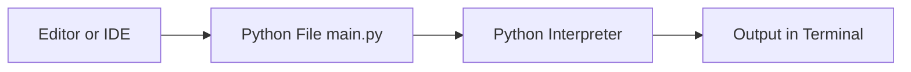
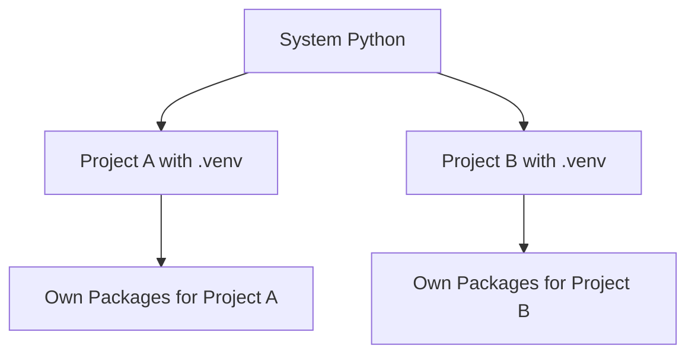

###### Topics

Python Overview

- Typical application areas of Python
- Important features of the language

Installing Python

- Installing Python
- Checking the Python version

First steps in the development environment

- Setting up a simple development environment
- Creating and running a first Python project
- Getting to know virtual environments in a simple form

<br><br><br>
# 🐍 Python Overview

Python is a **general-purpose programming language** that was deliberately designed to be **highly readable** and **easy to write**. The official Python documentation describes it as easy to learn but also very powerful, suitable for many types of software ([The Python Tutorial](https://docs.python.org/3/tutorial/), [What is Python? Executive Summary](https://www.python.org/doc/essays/blurb/)).

Python is particularly interesting for Core-Tech-Fundamentals because you can quickly grasp the central concepts of programming with it: variables, data types, conditions, loops, functions, modules, files, packages, and working with a runtime environment. So, Python is not just “a language,” but often also a very good introduction to clean technical thinking.

<br><br><br>
## 💼 Typical Application Areas of Python

Python is used in many fields because the language itself is relatively simple and there are suitable libraries for almost every use case.

| Area | What you do with it | Typical tools |
|---|---|---|
| Automation | Renaming files, searching folders, generating reports, running scripts | `pathlib`, `os`, `shutil`, `subprocess` from the standard library ([The Python Standard Library](https://docs.python.org/3/library/)) |
| Web Development | Websites, web backends, APIs | Django ([Django overview](https://www.djangoproject.com/start/overview/)), FastAPI ([FastAPI](https://fastapi.tiangolo.com/)) |
| Data Analysis | Reading, filtering, evaluating, visualizing data | NumPy ([What is NumPy?](https://numpy.org/doc/stable/user/whatisnumpy.html)), pandas ([pandas overview](https://pandas.pydata.org/docs/getting_started/overview.html)) |
| AI / Machine Learning | Training models, predictions, data pipelines | scikit-learn ([Getting Started](https://scikit-learn.org/stable/getting_started.html)), TensorFlow ([TensorFlow Learn](https://www.tensorflow.org/learn)) |
| Testing | Automatically testing programs | pytest ([pytest documentation](https://docs.pytest.org/en/stable/)) |
| Science / Research | Simulations, numerical calculations, experiments | NumPy, SciPy ([SciPy User Guide](https://docs.scipy.org/doc/scipy/tutorial/)) |
| DevOps / Tools | Build scripts, CLI tools, deployments | Standard library, automation scripts |

Python is especially popular for **automation**. For example, if you do the same click, file, or renaming process every day, Python is often a good candidate for automating it. The standard library already provides many tools for this, without needing to install additional packages ([The Python Standard Library](https://docs.python.org/3/library/)).

In **web development**, Python is often used for the backend part, namely the part of an application that processes logic, interacts with databases, and provides APIs. Frameworks like Django and FastAPI turn this into structured applications with routing, forms, security, and data processing ([Django overview](https://www.djangoproject.com/start/overview/), [FastAPI](https://fastapi.tiangolo.com/)).

In **data analysis**, Python is almost a standard tool. With NumPy you work efficiently with arrays of numbers and mathematical operations, and with pandas you handle tables, CSV files, and time series very comfortably ([What is NumPy?](https://numpy.org/doc/stable/user/whatisnumpy.html), [pandas overview](https://pandas.pydata.org/docs/getting_started/overview.html)).

Python is also used very often in **machine learning and AI**. The reason is not that the core language is “magical,” but rather that the ecosystem is huge and many libraries already exist out of the box. This makes Python attractive for both beginners and professionals ([Getting Started](https://scikit-learn.org/stable/getting_started.html), [TensorFlow Learn](https://www.tensorflow.org/learn)).

For proper learning it is important to note: Python is not limited to a single area. So when you learn Python, you’re not just learning syntax, but also many **transferable fundamentals** that you will recognize later in other languages and systems.

<br><br><br>
## ✨ Important Features of the Language

Python has some characteristics that are very pleasant for beginners while also enabling professional work.

### **Highly Readable Syntax**

A central feature of Python is its readability. Python code often looks almost like “technical English.” This allows you to focus more on logic while learning and less on complicated special characters or very rigid syntax rules. The official documentation emphasizes exactly this simplicity and clarity ([The Python Tutorial](https://docs.python.org/3/tutorial/)).

A simple example:

```python
name = "Lea"

if name == "Lea":
    print("Hello Lea")
```

This is easy to read because Python has little “syntactic noise.” No curly braces, no semicolons at the end of lines, no unnecessary extra words.

### **Indentation is Part of the Language in Python**

In many languages, indentation is mainly for human readability. In Python, it is also **technically important** because blocks are defined by it. That means: indentation is not just for looks but actually controls the structure of the program ([The Python Tutorial – More Control Flow Tools](https://docs.python.org/3/tutorial/controlflow.html)).

This is very valuable didactically, because you learn to write clean, structured code early on.

### **Interpreted and Interactive**

Python is usually executed by an **interpreter**. Simply put: you write code and Python processes it directly. You can also start Python interactively in the terminal and try out individual commands immediately. This interactive approach is very helpful, especially at the beginning ([Using Python](https://docs.python.org/3/using/index.html)).

For example:

```bash
python
```

Then you can directly enter:

```python
2 + 3
```

and instantly get a result. This is ideal for quickly testing how something works.

### **Dynamically Typed**

Python is **dynamically typed**. This means you usually don’t have to specify the type when creating a variable. Python determines at runtime whether something is, for example, a number, a string, or a list.

```python
x = 5
name = "Mila"
prices = [10, 20, 30]
```

This makes it easier to get started. At the same time, you should understand that flexibility also means responsibility: Some errors only appear at runtime. Python therefore also supports **type hints** if you want to more clearly document which data types are expected ([typing — Support for type hints](https://docs.python.org/3/library/typing.html)).

### **Multiple Programming Styles are Possible**

Python supports various ways of thinking about programming: procedural, object-oriented, and functional. This is very practical because you can learn many concepts with one language ([The Python Tutorial](https://docs.python.org/3/tutorial/)).

Concretely: you can start with very simple scripts and later build cleanly structured programs with classes, modules, and packages.

### **Large Standard Library**

Python already comes with many modules “out of the box.” This principle is often described as **“batteries included.”** You can directly work with files, JSON, date/time, HTTP, paths, regular expressions, and much more without first having to search for external packages ([The Python Standard Library](https://docs.python.org/3/library/)).

This is ideal for beginners because you quickly become productive and also get a sense of how much can be achieved with built-in tools.

### **Cross-Platform Compatibility**

Python runs on Windows, macOS, and Linux. The same code can often run on multiple operating systems with only small or no changes, as long as you don’t use very system-specific features ([Using Python on Windows](https://docs.python.org/3/using/windows.html), [Using Python on Unix platforms](https://docs.python.org/3/using/unix.html), [Using Python on a Macintosh](https://docs.python.org/3/using/mac.html)).

For technical understanding, this is important: You don’t just learn “how to write code,” but also how programs are executed in different environments.

### **Large Ecosystem and Strong Community**

Python has an enormous number of libraries, learning materials, tutorials, and community resources. This makes the language particularly beginner-friendly, because you’ll find good examples and documentation for almost every problem ([Python Package Index](https://pypi.org/), [Python Documentation](https://docs.python.org/3/)).

This is a big advantage when learning: If you don’t understand a topic, you’ll usually find several alternative explanations and tools for it.

<br><br><br>
# 🛠️ Installing Python

Before you can start programming, you need Python on your computer. It’s important that you understand **what** you’re installing:

- the **Python interpreter** that runs your code
- usually also **pip**, the package manager for additional libraries
- often additional tools like **IDLE** or the ability to start Python via the terminal

Today, you generally work with **Python 3**. If you only see “Python,” it almost always means Python 3. The official Python website provides the latest versions ([Python Releases for Windows](https://www.python.org/downloads/windows/), [Python Releases for macOS](https://www.python.org/downloads/macos/)).

<br><br><br>
## ⬇️ Installing Python

### **Recommendation for Beginners**

The simplest and cleanest method is usually to install via the official Python website. There you get the latest stable version directly from the Python project ([Python Downloads](https://www.python.org/downloads/)).

### **Installation on Windows**

On Windows, you download the installer from the official Python website and start it. Pay particular attention to the option in the installer:

```text
Add python.exe to PATH
```

This option is important so you can start Python directly in the terminal later. The official Windows documentation describes this installation path ([Using Python on Windows](https://docs.python.org/3/using/windows.html)).

Typical process:

1. Download the installer from `python.org`.
2. Start the installer.
3. Check **Add python.exe to PATH**.
4. Complete the installation.

Afterwards, the Windows launcher `py` is also usually available. This launcher is handy because you can use it to start specific Python versions, for example:

```bash
py
```

or

```bash
py -3
```

### **Installation on macOS**

On macOS, you can also use the official installer from Python.org. This is often the clearest option for beginners because you then get a well-documented, complete Python installation ([Python Releases for macOS](https://www.python.org/downloads/macos/), [Using Python on a Macintosh](https://docs.python.org/3/using/mac.html)).

Important to note: macOS sometimes already comes with a Python-like system tool or had preinstalled versions in older releases. For your learning, you should deliberately focus on the **self-installed Python 3 version** so you clearly know which version you're using.

### **Installation on Linux**

On Linux, Python 3 is often already present. However, “Python is there” does not automatically mean that all tools for your learning are fully set up. Depending on your distribution, it may be necessary to install additional packages, for example for `venv`. The Python documentation generally describes usage on Unix platforms ([Using Python on Unix platforms](https://docs.python.org/3/using/unix.html), [venv — Creation of virtual environments](https://docs.python.org/3/library/venv.html)).

Examples that work on many Debian/Ubuntu systems are:

```bash
sudo apt update
sudo apt install python3 python3-venv python3-pip
```

On Fedora, Arch or other distributions, the packages may be named differently. What’s important is less the exact command and more the basic principle: you need a Python interpreter, `pip` and ideally `venv`.

### **What Should Be Available After Installation**

If everything worked, you should typically be able to use the following:

- `python`, `python3`, or `py`
- `pip` or `pip3`
- the interactive Python mode
- the ability to execute `.py` files

If something doesn’t work, it’s often due to a **PATH problem** or because multiple Python versions are installed on the system in parallel.

<br><br><br>
## 🔎 Checking the Python Version

After installation, the first sensible step is to check **whether Python is actually reachable** and **which version** you are using.

Depending on the operating system, different commands work:

| System | Common command |
|---|---|
| Windows | `py --version` or `python --version` |
| macOS | `python3 --version` |
| Linux | `python3 --version` |

Examples:

```bash
python --version
```

```bash
python3 --version
```

```bash
py --version
```

If Python is installed correctly, you’ll get output like:

```text
Python 3.12.2
```

This step is more important than it looks at first glance. You’re actually checking several things at once:

- Is Python installed?
- Is it found in the terminal?
- Which version is being called?
- Are you really addressing the version you want to work with?

### **Why Multiple Commands Exist**

The difference between `python`, `python3`, and `py` confuses many learners at first. A brief explanation:

- `python` is often the direct Python command.
- `python3` is commonly used on Unix systems to specifically refer to Python 3.
- `py` is often a launcher on Windows that manages Python versions ([Using Python on Windows](https://docs.python.org/3/using/windows.html)).

This isn’t “unnecessary chaos,” but a good example of an important tech fundamental: on different operating systems, tools can look similar but sometimes behave slightly differently.

### **Additionally Checking pip**

You can also check if the package manager works:

```bash
python -m pip --version
```

or on macOS/Linux:

```bash
python3 -m pip --version
```

Using `python -m pip` is often more robust than just `pip`, because you are explicitly saying: “use exactly the pip belonging to this Python” ([pip User Guide](https://pip.pypa.io/en/stable/user_guide/)).

This is a very important principle for clean work: **Interpreter and package manager should match**.

<br><br><br>
# 💻 First Steps in the Development Environment

Once Python is installed, the next big step is to create an environment where you can work sensibly. To do this, you need to distinguish between three things:

| Component | Task |
|---|---|
| Editor / IDE | Where you write your code |
| Terminal | Where you run commands |
| Python Interpreter | This is what actually runs your code |

Many beginners mix up these three things. This is normal. But for proper learning, the distinction is very important, because then you understand **which tool is responsible for what**.

Here’s how they interact, as a simple diagram:



So you don’t write “in Python,” but in an editor. Python itself is the runtime or interpreter that executes your code.

<br><br><br>
## 🧰 Setting Up a Simple Development Environment

### **What Works Well in the Beginning?**

For beginners, there are two good options:

1. **Very simple**: Python + IDLE  
2. **Practical and modern**: Python + Visual Studio Code

IDLE is included with many Python installations and is sufficient for small first steps. But if you want to learn in a more realistic and practical way right from the start, **Visual Studio Code** is often the better choice. Microsoft provides an official Python extension for it ([Python in Visual Studio Code](https://code.visualstudio.com/docs/languages/python)).

### **Recommended Simple Environment: VS Code**

For a simple, clean learning environment, you can proceed as follows:

1. Install Python.
2. Install Visual Studio Code.
3. Install the **Python Extension** in VS Code.
4. Open a project folder.
5. Select the correct Python interpreter.

Selecting the interpreter is important, because otherwise VS Code may not use the Python version you have installed or the one belonging to your virtual environment ([Python in Visual Studio Code](https://code.visualstudio.com/docs/languages/python)).

### **Important Terms in the Development Environment**

#### **Editor**
The editor is the tool where you write and save files. It does not automatically run the code.

#### **Terminal**
The terminal is the text-based interface where you enter commands. There you start Python, check versions, create virtual environments, and run scripts.

#### **Interpreter**
The interpreter is the actual program that runs Python code.

This distinction is extremely important because it prepares for many later topics: build processes, runtime, tools, package management, and environment management.

### **Why Not Just Rely on the Run Button?**

Many editors have a “Run” button. It’s convenient, but at the beginning it’s better to also understand the terminal commands. Otherwise, the following can easily happen:

- The editor uses a different Python version than you expect.
- Packages are installed in a different environment.
- The code runs in the editor but not in the terminal.
- It becomes harder to understand errors later.

Those who learn to use the terminal early build a much more robust technical foundation.

<br><br><br>
## 📁 Creating and Running a First Python Project

A project doesn’t have to be big at first; a regular folder with a Python file is enough.

### **Create Project Folder**

Create a folder, for example:

```text
my-first-python-project
```

Open this folder in your development environment.

### **Create First File**

Create a file in it named:

```text
main.py
```

The `.py` extension indicates that this is a Python file.

A possible first file:

```python
print("Hello, Python!")
```

### **What Does This Code Do?**

`print(...)` is a built-in Python function. It outputs something to the console or terminal ([Built-in Functions](https://docs.python.org/3/library/functions.html#print)).

The text `"Hello, Python!"` is a string, i.e. text.

### **Project Structure**

Your small project might look like this:

```text
my-first-python-project/
└── main.py
```

### **Running the Project**

Now switch to your project folder in the terminal and start the file.

On Windows, commonly:

```bash
py main.py
```

On macOS/Linux, commonly:

```bash
python3 main.py
```

Or, if your system uses `python`:

```bash
python main.py
```

You should then see the output:

```text
Hello, Python!
```

### **What Happens Technically When Running**

When you run `python main.py`, the following happens in simplified terms:

1. The interpreter reads the file `main.py`.
2. It processes the instructions from top to bottom.
3. `print(...)` is executed.
4. The output appears in the terminal.

This is a very basic but important way of thinking: a Python script is simply a file that the interpreter processes.

### **The Interactive Mode as a Learning Tool**

In addition to the file, you can also use the interactive mode to quickly try things out:

```bash
python
```

or:

```bash
python3
```

You can then directly type:

```python
print("Test")
3 * 7
```

The interactive mode is ideal for testing small ideas. For actual project code, however, you should use files, as they can be saved, traced, and versioned.

### **A Second Small Example**

If you want to see a bit more structure right away:

```python
name = "Sam"
print("Hello,", name)
```

Here you’re already learning two basics:

- A variable stores a value.
- `print()` can output multiple values.

Such mini-examples are better for true learning than big projects too early. That way, you first build a stable mental model: file, interpreter, execution, output.

<br><br><br>
## 🌱 Getting to Know Virtual Environments in a Simple Way

Virtual environments are a very important core concept in Python. Many beginners skip this topic at first, and that’s exactly what causes confusion and broken setups later.

### **What is a Virtual Environment?**

A virtual environment is a **separate Python area for a single project**. There, packages can be installed without them becoming global on the whole system. Python provides the module `venv` for this ([venv — Creation of virtual environments](https://docs.python.org/3/library/venv.html)).

Put simply, this means:

- Your computer has a Python installation.
- Each project can additionally have its **own isolated environment**.
- The packages of one project do not directly affect other projects.

### **Why This is Important**

Imagine:

- Project A needs package X in version 1.
- Project B needs the same package X in version 2.

If you install everything globally, such projects quickly come into conflict. Virtual environments solve exactly this problem ([venv — Creation of virtual environments](https://docs.python.org/3/library/venv.html)).

This is not just "Python insider knowledge," but a general core tech principle: **Cleanly isolate dependencies**.

### **How This Concept Works**



### **Creating a Virtual Environment**

In the project folder you can create a virtual environment with:

```bash
python -m venv .venv
```

or, on macOS/Linux, often:

```bash
python3 -m venv .venv
```

Here:

- `python -m venv` = start the module `venv` with your Python
- `.venv` = name of the folder for the environment

The name `.venv` is very popular because many tools recognize it automatically.

After this, your project might look like:

```text
my-first-python-project/
├── .venv/
└── main.py
```

### **Activating the Virtual Environment**

Activation works differently depending on the system.

#### **Windows (cmd)**

```bash
.venv\Scripts\activate
```

#### **Windows (PowerShell)**

```powershell
.venv\Scripts\Activate.ps1
```

#### **macOS / Linux**

```bash
source .venv/bin/activate
```

If activation worked, you’ll often see a hint like:

```text
(.venv)
```

at the beginning of the terminal line.

### **What Does Activation Do?**

Activation ensures that commands like `python` and `pip` now point to the **virtual environment** instead of the global system.

That’s the key point. From now on, you install packages on a per-project basis.

### **Installing a Package in the Virtual Environment**

For example:

```bash
python -m pip install requests
```

The package is now installed in the active environment, not system-wide. This keeps your project cleanly separated.

### **Checking the Installation**

You can list installed packages with:

```bash
python -m pip list
```

Or get detailed info:

```bash
python -m pip show requests
```

### **Leaving the Virtual Environment**

When you’re done, you can deactivate it:

```bash
deactivate
```

After that, you’re working outside the environment again.

### **Important Learning Point: Activation is Convenient, But Not Magic**

Many beginners think a virtual environment is simply “activated or not activated.” Technically, there’s more to it. A virtual environment is primarily its own set of:

- Python interpreter references
- Package directory
- Scripts
- Configuration

Activation is mainly a convenience so your terminal uses the right environment automatically ([venv — How venvs work](https://docs.python.org/3/library/venv.html)).

That’s a very valuable tech fundamental: The surface looks simple, but there’s a clear system underneath.

### **A Typical Workflow in Practice**

A realistic workflow for a new Python project often looks like this:

```bash
mkdir my-project
cd my-project
python -m venv .venv
source .venv/bin/activate
python -m pip install requests
```

On Windows, activation is different, but the pattern remains the same:

1. Create the project folder
2. Create the virtual environment
3. Activate the virtual environment
4. Install packages
5. Write and run code

### **Why `python -m pip` is Better than Just `pip`**

If you have multiple Python versions installed, `pip` may sometimes belong to a different installation than `python`. With `python -m pip`, you are explicitly saying: “use the pip belonging to exactly this interpreter” ([pip User Guide](https://pip.pypa.io/en/stable/user_guide/)).

This is a small detail, but one of the most important for clean Python setups.

### **Virtual Environment and Editor**

If you’re using VS Code, make sure VS Code uses the interpreter from your `.venv`. Otherwise, the following can happen:

- The terminal uses `.venv`
- VS Code analyzes another Python
- Installed packages are shown as “not found” in the editor

That’s why interpreter selection in the editor is a real core step and not just a convenience ([Python in Visual Studio Code](https://code.visualstudio.com/docs/languages/python)).

### **Key Takeaways for Your Skills**

Virtual environments are, at their core, not a complicated Python specialty but an example of professional software best practices:

- Projects should be reproducible.
- Dependencies should be isolated.
- Tools should clearly point to the same runtime.
- Development environment and runtime should match.

If you understand this principle early on, you’ll learn Python much more cleanly and with far less frustration.