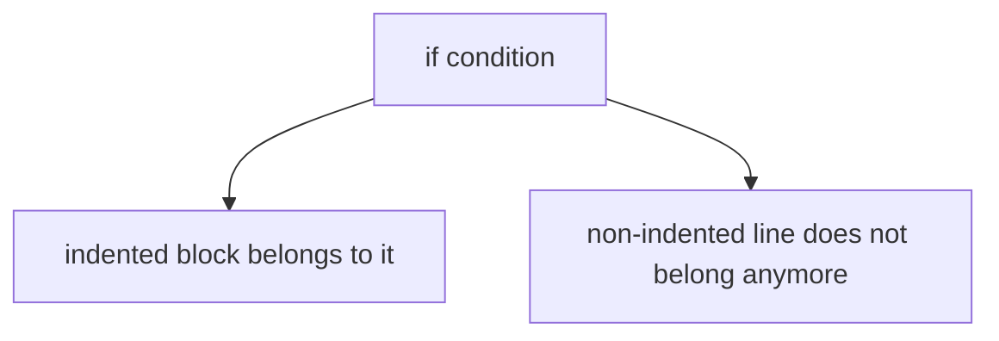

###### Topics

Basic Syntax Elements

- Structure of Python code with indentation and line structure
- Comments and their purpose

Working with Variables and Data Types

- Creating and naming variables sensibly
- Using Integer, Float, String, and Boolean

Basic Operators

- Applying mathematical operators
- Understanding assignment operators

Input and Output

- Displaying text and values with print()
- Processing user input with input()

<br><br><br>
# 🧱 Basic Syntax Elements

Python often feels friendly and readable at first because the language places a lot of value on clear structure. That’s why things like **indentation**, **line structure**, and **comments** are not just “side issues,” but a central part of how Python code works.

<br><br><br>
## 📐 Structure of Python Code with Indentation and Line Structure

In Python, code isn’t just understood through words and characters, but also through **whitespace**. That’s a major difference from many other programming languages.

When you write a block of instructions in Python, for example inside an `if` statement or a loop, you mark this block by **indentation**. This indentation isn’t just a matter of style in Python, it’s a part of the language’s syntax ([2. Lexical analysis](https://docs.python.org/3/reference/lexical_analysis.html)).

### 🔍 What does indentation actually mean?

Look at this example:

```python
age = 18

if age >= 18:
    print("You are of legal age.")
print("This line always runs.")
```

Here the line

```python
print("You are of legal age.")
```

belongs to the `if` condition because it is indented. The last `print()` line is **not** indented and therefore lies **outside** the block.

If you instead write something like:

```python
age = 18

if age >= 18:
print("You are of legal age.")
```

Python won’t understand where the block begins and will output an error.

### 📏 How far do you indent?

In Python, it is customary to use **four spaces** per block. This is recommended by the official style guide PEP 8 ([PEP 8 – Style Guide for Python Code](https://peps.python.org/pep-0008/)).

So for example:

```python
if True:
    print("Four spaces indentation")
```

Technically, Python can process tabs as well, but in practice you should **consistently use four spaces** only. Mixing tabs and spaces quickly leads to hard-to-find errors.

### 🧠 Why is this important?

Indentations help you on two levels:

First, **Python** understands which lines belong together this way.

Secondly, **humans** can also understand the code more quickly. Especially when learning, this is extremely important, because you don’t just have to remember *what* you wrote, but also *how* the code is logically structured.

### 🧩 Typical Code Blocks with Indentation

Indentation is especially needed with:

- `if`, `elif`, `else`
- `for`
- `while`
- Functions with `def`
- Classes with `class`

For example:

```python
name = "Lena"

if name == "Lena":
    print("Hello Lena!")
    print("Nice to see you.")
else:
    print("You are not Lena.")
```

Here you can see clearly: Several indented lines can belong to a single block.

### 🪜 Line Structure in Python

Python normally reads code **line by line**. Often, a new line also means: An instruction is complete. This makes Python pleasantly readable ([3. An Informal Introduction to Python](https://docs.python.org/3/tutorial/introduction.html)).

A simple example:

```python
x = 5
y = 10
print(x + y)
```

Each line contains its own instruction.

### 🔗 When can an instruction span multiple lines?

Sometimes a line gets too long. Then you can reasonably spread it over several lines.

Python especially allows this when you are inside parentheses:

```python
total = (
    10 +
    20 +
    30
)

print(total)
```

This is very readable and is often used in practice.

### ⚠️ Common Errors with Indentation

Especially in the beginning, these problems often arise:

- A line is not indented enough.
- A line is indented too far.
- Tabs and spaces are mixed.
- A block starts but is not followed by indented content.

Example of a problem:

```python
if 5 > 3:
    print("That is true.")
      print("This indentation is broken.")
```

The second `print()` line here has a mismatched indentation. Python is very strict about this because indentation determines your program’s structure.

### 🗺️ How to Think About Indentation



That’s a good way to think:  
**Indented = belongs to the block**  
**Not indented = block is ended**

<br><br><br>
## 💬 Comments and Their Purpose

Comments are places in code **meant for humans**. Python does not execute comments. They help you make code more understandable ([2. Lexical analysis](https://docs.python.org/3/reference/lexical_analysis.html)).

### ✍️ How Do You Write Comments?

In Python, a single-line comment starts with `#`:

```python
# This is a comment
x = 10
```

You can also write comments after an instruction:

```python
x = 10  # Start value
```

### 🧠 What Are Comments Good For?

Comments are especially useful when you want to explain:

- **why** you are doing something
- **what assumption** your code makes
- **which section** belongs to which part of the program

A good comment does not simply state the obvious, but provides additional meaning.

Weak comment:

```python
x = x + 1  # Increase x by 1
```

You already see that in the code.

Better comment:

```python
x = x + 1  # Increases the current attempt count
```

This clarifies **what meaning** the instruction has.

### 🚫 What Comments Should Not Do

Comments should not try to “rescue” badly written code. If you have to explain a lot because the code itself is chaotic, often the code itself is the problem.

For example, this is unnecessarily complicated:

```python
# Here we store the user's name in a variable,
# so that we can output it later
n = input("Name: ")
```

It’s often better to make the code itself clearer:

```python
username = input("Name: ")
```

Now you often don’t need a comment any more.

### 🏷️ Comments as a Learning Aid

While learning, comments are very valuable. You can use them to make your thought process visible:

```python
# First read input
number = input("Please enter number: ")

# Later convert to a real number
number = int(number)
```

This helps you understand the flow without having to keep everything in your head immediately.

### 📌 Comments vs. Documentation

A comment is usually short and in the code itself.  
Documentation is more detailed and often explains entire functions, modules, or programs.

For beginners, regular comments are usually enough. The important thing is: Write comments so that **you or others will still understand the code later**.

<br><br><br>
# 🧮 Working with Variables and Data Types

Variables and data types are among the absolute basics in Python. If you understand them well, pretty much everything else becomes easier: calculations, comparisons, input, conditions, loops, and later also functions.

<br><br><br>
## 🏷️ Creating and Naming Variables Sensibly

A variable is like a **name for a value**. You store something under an identifier, so that you can access it again later.

Example:

```python
age = 25
name = "Mia"
```

Here, `age` is the name of the variable, and `25` is the stored value.  
For `name`, `"Mia"` is the stored value.

Python creates variables by **assignment**. You don’t have to declare them beforehand as in some other languages. An assignment with `=` binds a name to an object ([7. Simple statements](https://docs.python.org/3/reference/simple_stmts.html)).

### 🧠 What Does the Variable Actually Do?

Important: A variable isn’t “the box itself,” but more like a **name** that points to a value.

When you write:

```python
score = 100
```

Python remembers: The name `score` currently stands for the value `100`.

You can reuse the name later:

```python
score = 150
```

Now `score` no longer refers to `100`, but to `150`.

### ✨ Good Variable Names

Good names help a lot with understanding. They tell you instantly what is in a variable.

Good:

```python
first_name = "Ali"
temperature = 21.5
is_logged_in = True
```

Bad:

```python
a = "Ali"
x = 21.5
b = True
```

Short names are only useful when the context is extremely clear. As a beginner you should use **descriptive names**.

### 📐 Rules for Variable Names

Python has clear rules for identifiers. Names may contain letters, digits, and underscores, but not start with a digit. Certain reserved words called keywords cannot be used as variable names ([2.3. Identifiers and keywords](https://docs.python.org/3/reference/lexical_analysis.html#identifiers)).

Allowed:

```python
name
age2
is_active
_my_value
```

Not allowed:

```python
2name
my-value
class
```

Why isn’t `class` allowed? Because `class` has a fixed meaning in Python.

### 🪄 Sensible Naming per PEP 8

The Python style recommends using `snake_case` (words separated by underscores) for variables and functions ([PEP 8 – Style Guide for Python Code](https://peps.python.org/pep-0008/)).

Examples:

```python
first_name = "Sara"
num_hits = 8
is_registered = False
```

This is more readable than:

```python
FirstName = "Sara"
numHits = 8
IsRegistered = False
```

### 🧭 Good Naming Perspective

A variable name should at least answer one of these questions:

- What is it?
- What is it for?
- What type of information does it hold?

For example:

- `price` instead of `p`
- `birth_year` instead of `b`
- `has_paid` instead of `status`

That way your code reads almost like an explanatory sentence.

<br><br><br>
## 🔢 Working with Integer, Float, String, and Boolean

Data types describe **what kind of value** a variable contains. Python has built-in standard types like numbers, text, and truth values ([Built-in Types — Python 3 documentation](https://docs.python.org/3/library/stdtypes.html)).

The four types you mentioned are the most important for beginners:

- `int` for whole numbers
- `float` for numbers with a decimal point
- `str` for text
- `bool` for True or False

<br><br><br>
### 📊 Overview of the Most Important Data Types

| Data Type | Meaning | Example | Typical Use Case |
|---|---|---:|---|
| `int` | Integer | `5`, `-3`, `100` | Counting, quantities, years |
| `float` | Floating point / decimal | `3.14`, `2.5`, `-0.75` | Measuring, prices, calculations |
| `str` | String / text | `"Hello"`, `"Python"` | Names, text, inputs |
| `bool` | Boolean | `True`, `False` | Conditions, status, decisions |

### 🔢 Integer: Whole Numbers

An `int` stores whole numbers, i.e., without decimal places.

```python
age = 20
points = 150
temperature = -5
```

Typical uses are counters, years, quantities, or scores.

With `int` you can do arithmetic as usual:

```python
a = 10
b = 3

print(a + b)   # 13
print(a - b)   # 7
print(a * b)   # 30
```

### 🌊 Float: Decimal Numbers

A `float` stores numbers with decimal places.

```python
price = 19.99
pi = 3.14159
temperature = 21.5
```

In Python you use a **dot** for decimal places, not a comma:

```python
value = 2.5
```

not:

```python
value = 2,5
```

Because `2,5` is something else entirely in Python and not the decimal number you want.

### 🔤 String: Text

A `str` is a sequence of characters, i.e., text. Put text in quotation marks:

```python
name = "Mila"
city = 'Berlin'
```

Double and single quotes are both allowed in Python ([Built-in Types — Python 3 documentation](https://docs.python.org/3/library/stdtypes.html)).

You can display, concatenate, or store strings:

```python
first_name = "Luca"
last_name = "Weber"

full_name = first_name + " " + last_name
print(full_name)
```

The result is:

```python
Luca Weber
```

### ✅ Boolean: Truth Values

A `bool` has exactly two possible values:

```python
True
False
```

These are important for program decisions, for example in `if` statements ([Built-in Types — Python 3 documentation](https://docs.python.org/3/library/stdtypes.html)).

Example:

```python
is_adult = True
has_paid = False
```

Later, you can use these for conditions:

```python
if is_adult:
    print("Access allowed")
```

### 🔄 Data Types Influence Behavior

Very important: The same operator can behave differently depending on data type.

```python
print(5 + 3)        # 8
print("5" + "3")    # 53
```

The first result is number addition.  
The second is string concatenation.

This is one of the most important learning points:  
**Not just the symbol matters, but also the data type of the values.**

### 🧪 View the Type with `type()`

If you want to know the type of a value, you can use `type()`:

```python
x = 42
print(type(x))
```

Or:

```python
name = "Nora"
print(type(name))
```

This is especially helpful in the beginning to avoid misunderstandings.

### 🔧 Type Conversion

You will often need to convert between types, especially after `input()`.

Examples:

```python
num = "25"
num = int(num)

price = "19.99"
price = float(price)

age = 30
age_text = str(age)
```

Python provides built-in functions like `int()`, `float()`, and `str()` for this ([Built-in Functions — Python 3 documentation](https://docs.python.org/3/library/functions.html)).

### ⚠️ Typical Beginner Mistakes with Data Types

A very common error is treating a string as a number:

```python
input_value = "10"
print(input_value + 5)
```

That doesn’t work, because `"10"` is a string and `5` is a number. Only after conversion does it work:

```python
input_value = "10"
num = int(input_value)
print(num + 5)
```

Another common error is confusing Booleans with strings:

```python
active = True      # Boolean
active_text = "True"  # String
```

They look similar, but are not the same.

<br><br><br>
# ➗ Basic Operators

Operators are the symbols you use to process values. They allow you to calculate, assign values, or—later on—make comparisons. For now, **mathematical operators** and **assignment operators** are particularly important.

<br><br><br>
## 🧮 Applying Mathematical Operators

Mathematical operators in Python work much like regular math. Python supports addition, subtraction, multiplication, division, integer division, modulus, and exponentiation ([6. Expressions — Python 3 documentation](https://docs.python.org/3/reference/expressions.html)).

<br><br><br>
### 📊 Overview of Important Mathematical Operators

| Operator | Meaning | Example | Result |
|---|---|---|---:|
| `+` | Addition | `5 + 2` | `7` |
| `-` | Subtraction | `5 - 2` | `3` |
| `*` | Multiplication | `5 * 2` | `10` |
| `/` | Division | `5 / 2` | `2.5` |
| `//` | Integer division | `5 // 2` | `2` |
| `%` | Modulo / remainder | `5 % 2` | `1` |
| `**` | Power | `5 ** 2` | `25` |

### ➕ Addition, Subtraction, Multiplication

These are the most familiar operations:

```python
a = 8
b = 3

print(a + b)   # 11
print(a - b)   # 5
print(a * b)   # 24
```

### ➗ Division with `/`

Normal division in Python produces a result with decimal places, usually a `float`:

```python
print(5 / 2)   # 2.5
```

Even if the calculation comes out “even,” with `/` the result is always a real division.

### 🪓 Integer Division with `//`

With `//` you get the integer part:

```python
print(5 // 2)   # 2
```

This is useful if you want to know, for example, how many full boxes, groups, or rows are possible.

### ♻️ Remainder with `%`

The modulo operator `%` gives the remainder of a division:

```python
print(5 % 2)   # 1
print(10 % 3)  # 1
```

You often need this to check whether a number is even or odd:

```python
number = 8
print(number % 2)   # 0
```

Remainder `0` here means the number is divisible by `2`.

### 🚀 Powers with `**`

With `**` you calculate powers:

```python
print(2 ** 3)   # 8
print(5 ** 2)   # 25
```

That’s a lot easier than multiplying repeatedly.

### 🧠 Order of Operations

Python observes a standard order of operations, much like math. Exponents, multiplication, and division have higher precedence than addition and subtraction. You can use parentheses to control the order ([6. Expressions — Python 3 documentation](https://docs.python.org/3/reference/expressions.html)).

Example:

```python
print(2 + 3 * 4)      # 14
print((2 + 3) * 4)    # 20
```

Without parentheses, `3 * 4` is computed first.  
With parentheses, `2 + 3` is computed first.

### 🔤 Operators with Strings

An interesting point: Some operators aren’t just for numbers.

```python
print("Hello " + "World")
print("Hi" * 3)
```

This gives:

```python
Hello World
HiHiHi
```

Here, `+` means string concatenation, not addition.  
`*` can repeat a string multiple times.

Again you see: **Data types help determine how operators behave.**

<br><br><br>
## 🪢 Understanding Assignment Operators

Assignment operators assign a value to a variable or change its existing value. The most important assignment operator is `=` ([7. Simple statements — Python 3 documentation](https://docs.python.org/3/reference/simple_stmts.html)).

### 🟰 Simple Assignment with `=`

Example:

```python
x = 10
```

This means: The name `x` receives the value `10`.

Important: The `=` in Python does **not** mean “is equal” as in math, but “assign.”

Therefore, this line is perfectly normal:

```python
x = x + 1
```

Mathematically that would make no sense. In Python, it means:  
Take the previous value of `x`, add `1`, and store the result back in `x`.

### 🔁 Shortened Assignment

Python also knows shorthand notations like:

- `+=`
- `-=`
- `*=`
- `/=`
- `//=`
- `%=`
- `**=`

These notations combine calculation and assignment in one step ([7. Simple statements — Python 3 documentation](https://docs.python.org/3/reference/simple_stmts.html)).

Examples:

```python
x = 10
x += 5
print(x)   # 15
```

That’s the same as:

```python
x = 10
x = x + 5
print(x)
```

More examples:

```python
balance = 100
balance -= 20
print(balance)   # 80
```

```python
points = 4
points *= 3
print(points)   # 12
```

### 📊 Overview of Important Assignment Operators

| Operator | Meaning | Example | Equivalent To |
|---|---|---|---|
| `=` | Assign value | `x = 5` | `x gets 5` |
| `+=` | Add and assign | `x += 2` | `x = x + 2` |
| `-=` | Subtract and assign | `x -= 2` | `x = x - 2` |
| `*=` | Multiply and assign | `x *= 2` | `x = x * 2` |
| `/=` | Divide and assign | `x /= 2` | `x = x / 2` |
| `//=` | Integer divide and assign | `x //= 2` | `x = x // 2` |
| `%=` | Modulo and assign | `x %= 2` | `x = x % 2` |
| `**=` | Power and assign | `x **= 2` | `x = x ** 2` |

### 🧠 Why Are Shortened Assignments Useful?

They often make code more compact and clearer, especially when a variable is changed step by step.

For example with a counter:

```python
counter = 0
counter += 1
counter += 1
counter += 1
```

You see immediately: The value increases each time.

### ⚠️ Important Distinction: `=` is not `==`

Even though you will use `==` more intensively later, it’s important to be aware of the difference now:

- `=` assigns
- `==` compares

Example:

```python
x = 5
print(x == 5)
```

Here, `x` first gets the value `5`. Then `x == 5` checks if `x` does indeed equal `5`. The result is `True`.

This distinction causes frequent confusion for beginners. So pay special attention to whether you intend to **store** or **compare**.

<br><br><br>
# 🖥️ Input and Output

A program becomes especially useful when it displays something or receives data from the outside. That’s what output with `print()` and input with `input()` are all about.

<br><br><br>
## 📤 Displaying Text and Values with `print()`

`print()` is a built-in Python function that lets you display values on the screen ([Built-in Functions — Python 3 documentation](https://docs.python.org/3/library/functions.html)).

### 📝 Simple Outputs

```python
print("Hello World")
print(42)
print(True)
```

`print()` can display text, numbers, and booleans.

### 🧩 Displaying Variables

You can also display the content of variables:

```python
name = "Emil"
age = 17

print(name)
print(age)
```

### 🔗 Displaying Multiple Values at Once

`print()` can display multiple values in a single call:

```python
name = "Emil"
age = 17

print("Name:", name, "Age:", age)
```

`print()` inserts spaces between the values by default. This is part of the standard behavior ([Built-in Functions — Python 3 documentation](https://docs.python.org/3/library/functions.html)).

The output then looks like this:

```python
Name: Emil Age: 17
```

### 🎨 Combining Text and Values

A classic beginner approach is:

```python
name = "Sina"
print("Hello " + name)
```

That will work fine as long as both parts are strings.

However, if you want to stick a number onto text using `+`, you get a problem:

```python
age = 18
print("I am " + age)
```

That doesn’t work because `"I am "` is a string and `age` is a number. You have to convert the number first:

```python
age = 18
print("I am " + str(age))
```

Or simply pass multiple arguments to `print()`, which is often easiest:

```python
age = 18
print("I am", age)
```

### 🧠 Why `print()` is so Important When Learning

`print()` isn’t just there for user output. It’s also one of your best tools for understanding what your code is doing.

For example, you can check:

- What value does a variable currently have?
- Was an input stored correctly?
- Did a calculation go as you expected?

Example:

```python
price = 19.99
quantity = 3
total = price * quantity

print("Price:", price)
print("Quantity:", quantity)
print("Total:", total)
```

This way you make your program’s internal state visible.

### 🗺️ `print()` in Program Flow

```mermaid
flowchart LR
    A[Values in program] --> B[print()]
    B --> C[Output in terminal or console]
```

That’s the core idea:  
Your program has internal values, and `print()` displays them.

<br><br><br>
## 📥 Processing User Input with `input()`

`input()` is also a built-in Python function. It reads user input and returns it as a **string** ([Built-in Functions — Python 3 documentation](https://docs.python.org/3/library/functions.html)).

This point is extremely important:  
**`input()` always returns text**, even if the user enters a number.

### ✍️ Simple Input

```python
name = input("What's your name? ")
print("Hello", name)
```

Flow:

1. Python displays the text `What's your name? `.
2. The user types something.
3. This input is saved into `name`.
4. It can then be processed further.

### 🧠 What Exactly Does `input()` Return?

If the user enters `25`, the result is not the number `25`, but the string `"25"`.

That’s crucial for future calculations.

Example:

```python
age = input("How old are you? ")
print(type(age))
```

The output shows a string type.

### 🔄 Converting Input to Numbers

If you want to do arithmetic with input, you must convert it:

```python
age = input("How old are you? ")
age = int(age)

print(age + 1)
```

Or more concisely:

```python
age = int(input("How old are you? "))
print(age + 1)
```

For decimals use `float()`:

```python
price = float(input("Enter price: "))
print(price * 2)
```

The conversion with `int()` and `float()` uses built-in functions ([Built-in Functions — Python 3 documentation](https://docs.python.org/3/library/functions.html)).

### ⚠️ What Happens With Invalid Input?

If you use `int()` and the user doesn’t enter a valid integer text, there’s an error.

For example:

```python
number = int(input("Please enter a number: "))
```

If someone enters `abc`, Python cannot make an integer out of that.

For beginners, the important thing is to grasp the principle:  
**Read input → create the right data type → process further**

### 🧭 Typical Input Flow

```mermaid
flowchart TD
    A[User types something] --> B[input()]
    B --> C[String is returned]
    C --> D{Do you want to calculate with it?}
    D -- Yes --> E[int() or float()]
    D -- No --> F[use as string]
```

That’s one of the most important basics in all of Python.

### 🧩 Examples for Different Inputs

#### 🔤 Text Input

```python
city = input("Which city do you live in? ")
print("You live in", city)
```

Here, the input remains a string. That’s appropriate.

#### 🔢 Integer Input

```python
quantity = int(input("How many tickets do you want? "))
print("You have chosen", quantity, "tickets.")
```

Here, the text is converted to an integer.

#### 🌊 Decimal Number Input

```python
temperature = float(input("What temperature was measured? "))
print("Measured temperature:", temperature)
```

Here, the text is converted to a decimal number.

### 🔍 Thinking `input()` and `print()` Together

Very many small programs follow exactly this pattern:

1. Get input
2. Process data
3. Output result

For example:

```python
name = input("Name: ")
age = int(input("Age: "))

print("Hello", name)
print("Next year you will be", age + 1)
```

That is already the basic structure of many real programs.

### 🧠 Pedagogically Important Learning Point

When learning Python, you should mentally distinguish between three levels when it comes to input and output:

- **What the user sees**
- **What Python stores internally**
- **What data type the value has internally**

An example:

```python
input_value = input("Please enter a number: ")
print(input_value)
print(type(input_value))
```

The user might see `7`.  
Python stores `"7"` as a string.  
Only with `int(input_value)` does it become the number `7`.

Practicing this clean thinking prevents many errors later on.