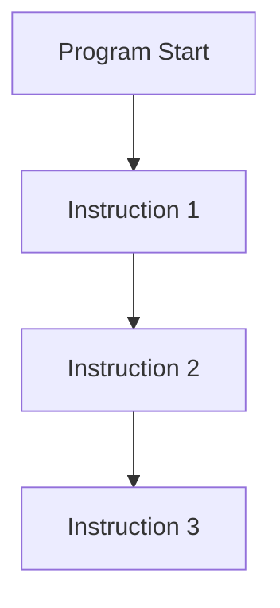
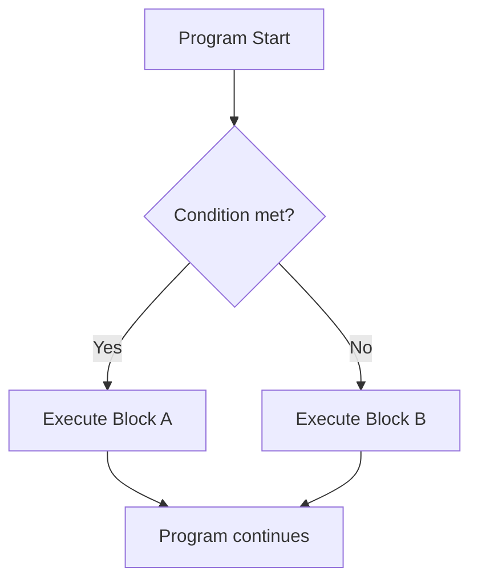
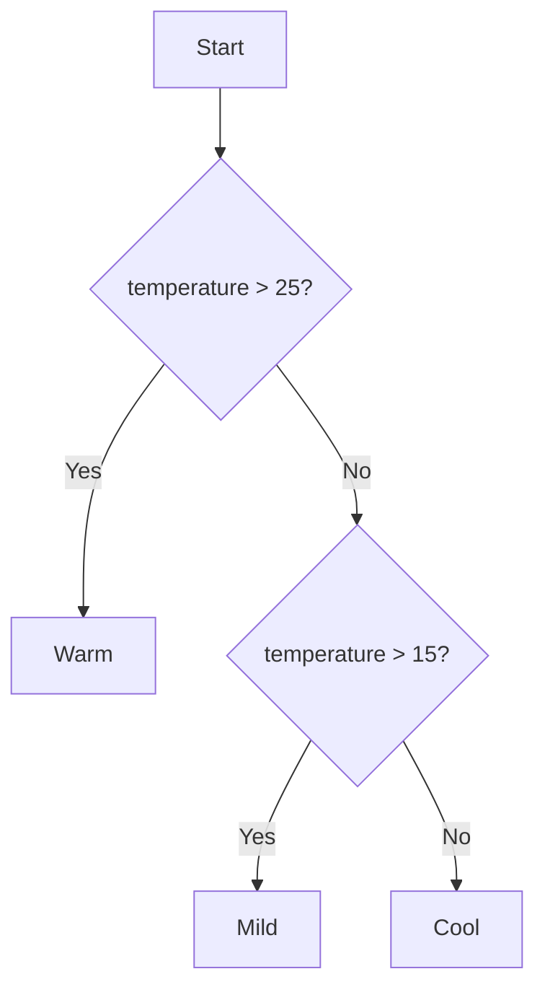
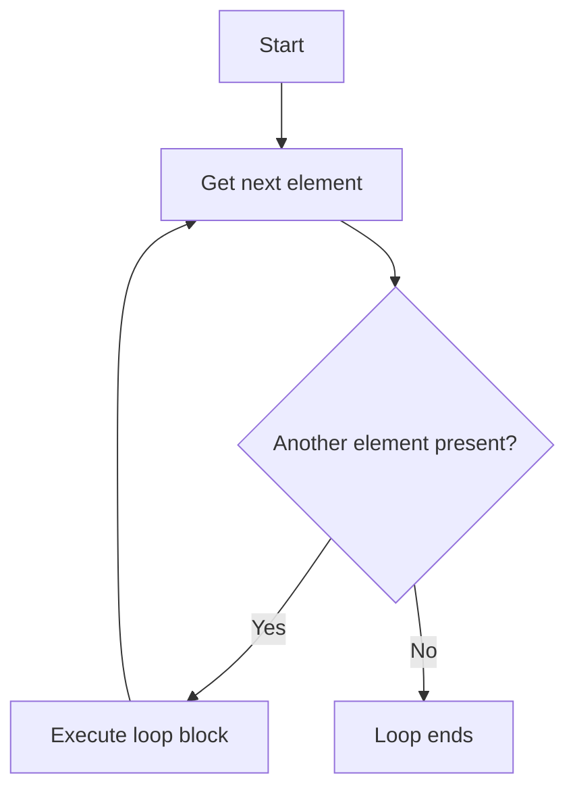
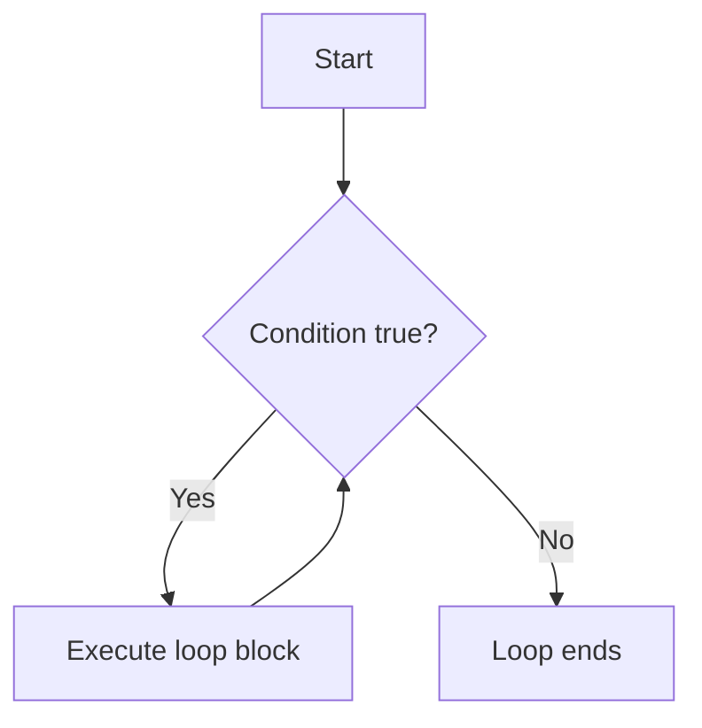

###### Topics

Understanding control structures

- Significance of control structures in program flow
- Difference between sequential and branching execution

Conditions with if, elif, else

- Structure and syntax of if statements
- Extending conditions with elif and else

Comparison and logical operators

- Using comparison operators in conditions
- Applying logical connections with and, or, and not

Loops in Python

- Using for loops
- Basic understanding of while loops
- Implementing simple repetitions with loops

<br><br><br>
# 🧭 Understanding Control Structures

Control structures are a central foundational principle of programming. They determine **in what order** a program executes instructions, **under what conditions** certain parts run, and **how often** something is repeated. Without control structures, a program would just be a rigid list of commands always processed from top to bottom.

Especially in Python, control structures are among the key foundations because they let you turn "individual commands" into real behavior. This enables a program to make decisions, react to input, and repeat processes. The Python documentation describes these tools under “Control Flow Tools” ([The Python Tutorial – More Control Flow Tools](https://docs.python.org/3/tutorial/controlflow.html)).

Simply put:

- **Control structures direct the flow of a program**
- They make programs **dynamic**
- They ensure code is **not just executed**, but also **controlled**

Imagine a program as a path through a building. Without control structures, you just walk down the hallway, straight ahead. With control structures, you can:

- Turn left or right at an intersection
- Walk in a circle until something is completed
- Skip an area if a condition isn't met

That’s exactly what `if`, `elif`, `else`, `for`, and `while` do.

<br><br><br>
## 🔄 Significance of Control Structures in Program Flow

A program consists of instructions. Normally, these instructions are executed **one after the other**. This is called **sequential execution**. But in practice, that's almost never enough.

Real programs have to react to situations, for example:

- Is a password correct?
- Is an account covered?
- Are there more data to process?
- Should a menu item be displayed repeatedly?

That's where control structures come in. They influence the so-called **control flow** or **program flow**. That means: They decide **which instruction comes next**.

The most important types are:

| Type of Control Structure | Purpose | Typical Python Constructs |
|---|---|---|
| Branching | Make decisions | `if`, `elif`, `else` |
| Repetition | Do things multiple times | `for`, `while` |
| Nesting | Combine structures inside each other | `if` in `for`, `while` in `if`, etc. |

If you understand control structures, you understand not just syntax, but also the thinking behind programs: **A program is not a block of text, but a guided flow**.

<br><br><br>
## 🛤️ Difference Between Sequential and Branching Execution

### 📌 Sequential Execution

With **sequential execution**, a program runs line by line from top to bottom. Each instruction is processed in exactly the order it appears in the code.

Example:

```python
print("Start")
print("Loading data")
print("Done")
```

Nothing surprising happens here. Python executes the first `print` command, then the second, then the third.

This is the simplest flow and the default case in programs.

### 🌿 Branching Execution

With **branching execution**, the subsequent flow depends on a **condition**. So, the path isn't always the same. Instead, the program decides which block to run based on a truth value.

Example:

```python
age = 17

if age >= 18:
    print("Adult")
else:
    print("Minor")
```

Here there are two possible paths. Which one runs depends on whether `age >= 18` is true or false.

This is the core of a branch:

- **true** → a specific block is executed
- **false** → a different block or none at all is executed

In Python, the `if` statement is used for this ([The Python Tutorial – if Statements](https://docs.python.org/3/tutorial/controlflow.html#if-statements)).

### 🧠 Why This Difference Is So Important

Sequential execution means: **The flow is fixed**.

Branching execution means: **The flow depends on data, states, or input**.

That's a huge difference. Only through branching can software "seem intelligent." Of course, the program doesn't really think, but it can react to conditions and pursue different paths.

Here's a simple visualization:



That’s sequential: always the same process.



That’s branched: The path depends on a condition.

### 🧱 A Technical but Very Important Point: Indentation

In Python, code blocks are defined not by curly braces, but by **indentation**. This is a core principle of the language ([The Python Tutorial – More Control Flow Tools](https://docs.python.org/3/tutorial/controlflow.html)).

Example:

```python
if True:
    print("This code belongs to the if block")
print("This code is outside")
```

Indentation tells Python exactly what belongs to the block and what doesn't. This makes Python code very readable but requires clean writing.

<br><br><br>
# 🧩 Conditions with `if`, `elif`, `else`

With `if`, `elif`, and `else`, a Python program can make decisions. These constructs form the foundation for almost all reactions to states, input, and data.

You can think of it as a question system:

- **if** = "If this is true, then ..."
- **elif** = "Otherwise, if instead this is true, then ..."
- **else** = "If none of that is true, then ..."

<br><br><br>
## 🧱 Structure and Syntax of `if` Statements

The simplest form of a condition in Python is `if`.

General form:

```python
if condition:
    statement
```

Three things are especially important:

1. After `if` comes a **condition**
2. The line ends with a **colon**
3. The block to execute is **indented**

Example:

```python
temperature = 30

if temperature > 25:
    print("It is warm")
```

If `temperature > 25` is true, the output happens. If not, nothing happens.

An `if` statement means:  
**Only execute the indented block if the condition is true.**

In Python, conditions are evaluated as **boolean values**, i.e., ultimately as `True` or `False` ([Built-in Types – Truth Value Testing](https://docs.python.org/3/library/stdtypes.html#truth-value-testing)).

### 🔍 What Exactly Is a Condition?

A condition is an expression that results in `True` or `False`.

For example:

```python
number = 10

print(number > 5)   # True
print(number < 5)   # False
```

Such expressions can be comparisons, logical connections, or any values Python interprets as true or false.

For example, these values are interpreted as “false” in Python:

- `False`
- `None`
- `0`
- `0.0`
- `""` (empty string)
- `[]` (empty list)

This is part of the **truthiness** concept, i.e., truth value evaluation in Python ([Built-in Types – Truth Value Testing](https://docs.python.org/3/library/stdtypes.html#truth-value-testing)).

### 🧠 How Python Processes an `if` Statement

Python processes an `if` statement in this order:

1. The condition is evaluated
2. If it's `True`, the indented block is executed
3. If it's `False`, the block is skipped

Example:

```python
name = "Mila"

if name == "Mila":
    print("Name recognized")

print("Program continues")
```

If the condition is true, you'll see `Name recognized` first, then `Program continues`.
If it's false, only `Program continues` will appear.

This shows something important: Control structures **don't interrupt the whole program**, but only control the part they refer to.

### ⚠️ Typical Misconceptions with `if`

A common mistake is believing that Python “guesses” what is meant. But Python is very exact.

Example of proper code:

```python
score = 80

if score >= 50:
    print("Passed")
```

Here, the condition is explicit.

A common beginner mistake would be something like:

```python
if score:
    print("Passed")
```

This is syntactically allowed but only means: “Is `score` a true value?” Since `80` is not `0`, this is considered true. But content-wise, that's completely different from “at least 50 points.”

This is an important learning point:  
**Don’t just write what works, but write what exactly expresses what you mean.**

<br><br><br>
## 🌿 Extending Conditions with `elif` and `else`

Often, a single `if` condition isn’t enough. Then you can extend the decision chain.

- `elif` stands for **else if**
- `else` is the default case when nothing else applies

General form:

```python
if condition_1:
    block_1
elif condition_2:
    block_2
else:
    block_3
```

Python checks these conditions **from top to bottom**. Once a condition is true, its corresponding block is executed and the remaining branches are **not checked further** ([The Python Tutorial – if Statements](https://docs.python.org/3/tutorial/controlflow.html#if-statements)).

### 🌡️ Example with Multiple Cases

```python
temperature = 18

if temperature > 25:
    print("Warm")
elif temperature > 15:
    print("Mild")
else:
    print("Cool")
```

What happens here?

- First, Python checks: `temperature > 25`
- That's `False` for `18`
- Then Python checks: `temperature > 15`
- That’s true
- So `Mild` is printed
- `else` is no longer considered

Important: `elif` is not a second, independent `if` statement. It is part of **the same decision chain**.

### 🧭 Order Is Crucial

The order of conditions in `if`-`elif`-`else` is very important.

Check out this example:

```python
number = 12

if number > 0:
    print("Positive")
elif number > 10:
    print("Greater than 10")
```

Here, with `number = 12`, only `Positive` is printed. Why?  
Because the first condition is already true. Python does not continue checking after that.

If you want to handle more specific cases first, you must check them **before more general cases**:

```python
number = 12

if number > 10:
    print("Greater than 10")
elif number > 0:
    print("Positive")
```

This is a common principle in programming:  
**Handle specific cases before general ones.**

### 🚪 The Role of `else`

`else` means: “If none of the previous conditions apply, then execute this block.”

Example:

```python
login_successful = False

if login_successful:
    print("Welcome")
else:
    print("Access denied")
```

`else` has **no own condition**. It's the catch-all case.

This is especially useful when you want to ensure that exactly one of several paths is chosen.

### 🧱 Nested Conditions

Conditions can also be nested. That means: Inside an `if` block, there is another `if`.

Example:

```python
age = 20
has_id = True

if age >= 18:
    if has_id:
        print("Entry allowed")
    else:
        print("ID missing")
else:
    print("Too young")
```

This is logically correct, but you shouldn't nest unnecessarily deeply, as the code becomes harder to read.

Often you can combine conditions:

```python
if age >= 18 and has_id:
    print("Entry allowed")
```

This is more compact and often clearer. We’ll look at how these logical connections work in detail next.

### 🖼️ Decision Logic as a Flowchart



That’s how you can picture `if`-`elif`-`else`: as a tree of decision branches.

<br><br><br>
# 🧮 Comparison and Logical Operators

Conditions almost always consist of **operators**. These operators compare values or connect multiple conditions.

Two major groups are important here:

- **Comparison operators**: compare values
- **Logical operators**: connect multiple conditions

<br><br><br>
## ⚖️ Using Comparison Operators in Conditions

Comparison operators always yield a truth value, i.e., `True` or `False` ([Python Language Reference – Comparisons](https://docs.python.org/3/reference/expressions.html#comparisons)).

The most important comparison operators in Python are:

| Operator | Meaning | Example | Result with `x = 5` |
|---|---|---|---|
| `==` | equal | `x == 5` | `True` |
| `!=` | not equal | `x != 5` | `False` |
| `>` | greater than | `x > 3` | `True` |
| `<` | less than | `x < 3` | `False` |
| `>=` | greater or equal | `x >= 5` | `True` |
| `<=` | less or equal | `x <= 4` | `False` |

These operators form the base of almost all conditions.

### 🔍 `==` Is Not the Same As `=`

This is a very important point.

- `=` means: **assign a value**
- `==` means: **compare two values**

Example:

```python
number = 10
```

Here, the variable `number` gets the value `10`.

```python
number == 10
```

Here, it’s checked whether `number` is equal to `10`.

This is one of the most common beginner mistakes. The difference is fundamental:  
One **changes** a value, the other **checks** a value.

### 🔠 Comparisons with Numbers, Text, and Other Values

Comparison operators aren't limited to numbers.

Example with text:

```python
name = "Lena"

if name == "Lena":
    print("Name matches")
```

You can also compare booleans:

```python
active = True

if active == True:
    print("Active")
```

In Python you often write it shorter in such cases:

```python
if active:
    print("Active")
```

This is more readable when it’s really about a boolean value.

Important: Only compare values where the comparison also makes sense contextually.

### 🔗 Comparison Chains in Python

Python allows comparison chains like:

```python
age = 20

if 18 <= age < 30:
    print("Between 18 and 29")
```

In Python, this is a built-in language feature and not just a shorthand for two separate comparisons ([Python Language Reference – Comparisons](https://docs.python.org/3/reference/expressions.html#comparisons)).

This form is often very readable and elegant.

<br><br><br>
## 🧠 Applying Logical Connections with `and`, `or`, and `not`

Logical operators let you combine multiple conditions. That's necessary when a decision depends on more than one criterion.

The three central logical operators in Python are:

- `and`
- `or`
- `not`

They are part of the boolean operations in Python ([Python Language Reference – Boolean Operations](https://docs.python.org/3/reference/expressions.html#boolean-operations)).

### 🔗 `and` – Both Conditions Must Be True

`and` means: The overall result is only true if **both** conditions are true.

Example:

```python
age = 20
has_ticket = True

if age >= 18 and has_ticket:
    print("Entry allowed")
```

Here, it’s not enough to just have the right age or just a ticket. Both must be true.

Thinking:

- true and true → true
- true and false → false
- false and true → false
- false and false → false

### 🔀 `or` – At Least One Condition Must Be True

`or` means: The overall result is true if **at least one** of the conditions is true.

Example:

```python
is_weekend = False
has_vacation = True

if is_weekend or has_vacation:
    print("Today is a day off")
```

Here, either reason suffices.

Thinking:

- true or true → true
- true or false → true
- false or true → true
- false or false → false

### 🚫 `not` – Inverts a Condition

`not` switches the truth value:

- turns `True` into `False`
- turns `False` into `True`

Example:

```python
logged_in = False

if not logged_in:
    print("Please log in")
```

This means: “If not logged in, then ...”

`not` is very useful for checking the **absence** of a state.

### 📋 Truth Table

| A | B | `A and B` | `A or B` | `not A` |
|---|---|---|---|---|
| `True` | `True` | `True` | `True` | `False` |
| `True` | `False` | `False` | `True` | `False` |
| `False` | `True` | `False` | `True` | `True` |
| `False` | `False` | `False` | `False` | `True` |

### 🧩 Combining Conditions

Example:

```python
age = 22
member = True
banned = False

if age >= 18 and member and not banned:
    print("Access permitted")
```

Here, a realistic rule is modeled:

- at least 18 years old
- member
- not banned

This is a very typical pattern in real software development: several conditions are combined to form a business rule.

### ⚠️ Reading Operators Correctly

A common mistake is reading logical expressions too quickly. Especially with `not`, you should check consciously what it refers to.

Example:

```python
if not age >= 18:
    print("Not of legal age")
```

That’s correct, but often less clear than:

```python
if age < 18:
    print("Not of legal age")
```

Both can work, but the second version is usually easier to read.

When learning, you should always ask yourself:  
**Is my expression not only correct, but also understandable?**

### ⚙️ Short-Circuit Evaluation

Python often doesn't fully evaluate logical expressions if the result is already determined. This is called **short-circuit evaluation** ([Python Language Reference – Boolean Operations](https://docs.python.org/3/reference/expressions.html#boolean-operations)).

Example:

```python
x = 10

if x > 5 or x / 0 > 1:
    print("Condition is true")
```

No error occurs from division by zero here because `x > 5` is already true. Python doesn’t have to evaluate the right side.

Likewise, with `and`:

```python
x = 2

if x > 5 and x / 0 > 1:
    print("Will not be executed")
```

No error here either, because `x > 5` is already false. The overall result for `and` can no longer be true, so the right side is not checked.

This is technically very important, especially if conditions contain expensive calculations or potentially problematic expressions.

<br><br><br>
# 🔁 Loops in Python

Loops are used to **repeat** instructions multiple times. Instead of writing out the same code ten times, you describe **what should be repeated** once.

This is not only more convenient, but also cleaner, shorter, and less error-prone. Python provides mainly two types of loops:

- `for` loops
- `while` loops

The Python documentation also covers both in the control flow section ([The Python Tutorial – More Control Flow Tools](https://docs.python.org/3/tutorial/controlflow.html)).

<br><br><br>
## 🔂 Using `for` Loops

A `for` loop is used when you want to iterate over a sequence of values. In Python, `for` doesn’t primarily work with counters as in some other languages, but with **iterable objects**, for example, lists, strings, or `range()` objects ([The Python Tutorial – for Statements](https://docs.python.org/3/tutorial/controlflow.html#for-statements)).

General form:

```python
for variable in data:
    statement
```

The loop means:  
**Take each element from `data` one by one and execute the block for each element.**

### 🧵 Example with a List

```python
names = ["Anna", "Ben", "Chris"]

for name in names:
    print(name)
```

Process:

- first, `name` gets the value `"Anna"`
- then `"Ben"`
- then `"Chris"`

For each of these values, the indented block runs.

That’s a very natural programming style in Python:  
Not “run from index 0 to 2” but “go through the elements of the list.”

### 🔢 `range()` for Counting Loops

If you want a loop to run a certain number of times, you often use `range()` ([The Python Tutorial – The range() Function](https://docs.python.org/3/tutorial/controlflow.html#the-range-function)).

Example:

```python
for i in range(5):
    print(i)
```

Output:

```python
0
1
2
3
4
```

Important: `range(5)` yields the numbers **from 0 up to but not including 5**. The upper bound is **not included**.

Common forms:

| Expression | Meaning |
|---|---|
| `range(5)` | 0, 1, 2, 3, 4 |
| `range(2, 6)` | 2, 3, 4, 5 |
| `range(1, 10, 2)` | 1, 3, 5, 7, 9 |

Example:

```python
for number in range(2, 6):
    print(number)
```

This prints `2`, `3`, `4`, `5`.

### 🔤 Iterating Over Strings

Strings are also iterable.

```python
for letter in "Python":
    print(letter)
```

Here, each letter is processed individually.

This shows an important core principle in Python:  
Many things can be iterated over with `for`, not just number ranges.

### 🧠 What a `for` Loop Conceptually Does

A `for` loop takes a sequence and processes its elements one after another. It's especially suitable when the number of iterations **comes directly from the data** or **is fixed beforehand**.

Typical situations:

- Processing all elements of a list
- Examining characters of a text
- Executing a block exactly `n` times

In Python, `for` is therefore often the first choice when there’s a clear count or an existing collection.

### 🖼️ Flow of a `for` Loop



Think of it this way: Python fetches one element after another until none are left.

<br><br><br>
## 🔄 Basic Understanding of `while` Loops

A `while` loop is used as long as a condition is true. It is therefore **condition-driven**.

General form:

```python
while condition:
    statement
```

Meaning:  
**As long as the condition is true, keep executing the block.**

The Python documentation puts it similarly: Repeat a block as long as the expression is true ([The Python Tutorial – while Statements](https://docs.python.org/3/tutorial/introduction.html#first-steps-towards-programming)).

### ⏳ Simple Example

```python
number = 1

while number <= 5:
    print(number)
    number = number + 1
```

Process:

- `number` starts at `1`
- condition `number <= 5` is true
- `1` is printed
- `number` is incremented by 1
- then condition is checked again
- this continues until `number` reaches `6`
- then the condition is false and the loop ends

The key thing about `while` is:  
The condition is **checked before each iteration**.

### ⚠️ Danger of Infinite Loops

With `while`, you must be careful that something changes so the condition becomes false at some point.

Example of an infinite loop:

```python
while True:
    print("Runs forever")
```

`True` is always true, so this loop never ends on its own.

This can also happen unintentionally:

```python
number = 1

while number <= 5:
    print(number)
```

Here, `number` is never changed. Therefore, `number <= 5` is always true and the loop runs endlessly.

This is one of the most important practical points for `while`:  
**The loop condition must sensibly change during the loop.**

### 🧠 When `while` Is Useful

`while` is ideal when the number of repetitions **is not fixed**, but depends on the state.

Typical situations:

- Wait until input is valid
- Read data until there is no more
- Repeat until a goal is reached

In contrast, `for` is usually better when you want to process a known set or a fixed range.

### 🔍 `for` and `while` Direct Comparison

| Feature | `for` | `while` |
|---|---|---|
| Controlled by | elements / range | condition |
| Suitable for | known count or collection | unknown duration, state-dependent |
| Risk of infinite loop | low | higher |
| Typical style in Python | very frequent | use selectively |

Both loops can handle similar tasks, but they think differently:

- `for`: “for each element” or “as often as the range specifies”
- `while`: “as long as the condition holds”

### 🖼️ Flow of a `while` Loop



This shows the essence well: each time it jumps back to the condition.

<br><br><br>
## 🔁 Implementing Simple Repetitions with Loops

Loops are the tool for describing repetitive work compactly. Instead of copying the same code block manually, the repetition is formulated systematically.

This brings many advantages:

- less code
- better readability
- easier maintenance
- lower error rate

Let’s look at some typical simple patterns.

### 🔢 Fixed Repetition with `for`

If something should happen a certain number of times, `for` with `range()` is often ideal.

Example:

```python
for i in range(3):
    print("Hello")
```

Here, `"Hello"` is printed exactly three times.

This is much cleaner than writing `print("Hello")` three times in a row.

### 📈 Counting with a Loop

```python
for i in range(1, 6):
    print(i)
```

Here, the loop counts from 1 to 5.

The code shows well that loops don’t just “repeat,” but often also manage a **changing variable**. In this case, that's `i`.

### 🧮 Accumulating: Processing Values Step by Step

A typical pattern is to build up a result step by step in a loop.

```python
total = 0

for number in range(1, 6):
    total = total + number
    print(total)
```

Here, the total increases with each loop iteration.

So, loops are not just repetitions, but also often **stepwise state changes**.

### 📦 Processing Elements One After the Other

```python
products = ["Keyboard", "Mouse", "Monitor"]

for product in products:
    print("Processing:", product)
```

That’s one of the most practical uses of loops: processing multiple data in the same way.

### ⏱️ Repeating Until a State is Reached

`while` is suitable for this.

```python
battery = 20

while battery < 100:
    print("Charging...")
    battery = battery + 20

print("Battery full")
```

Here, the number of loop passes isn't specified as a list but results from the `battery` state.

This makes `while` very useful for dynamic flows.

### 🧠 The Real Learning Goal Behind Loops

When you learn loops, it's not just about memorizing syntax. The more important goal is this way of thinking:

- **What stays the same in each pass?**
- **What changes from pass to pass?**
- **How do I know when the loop should end?**

That is the actual core technical skill.

For every loop, there are almost always these three building blocks:

| Building Block | Meaning |
|---|---|
| Initial state | what the loop starts with |
| Repeated action | what happens each pass |
| Exit condition | when the loop ends |

When you recognize these three, you understand loops on a much deeper level than just syntactically.

### 🔧 Example: Systematically Reading a Loop

```python
number = 1

while number <= 3:
    print("Iteration", number)
    number = number + 1
```

You should read the code like this:

- **Initial state:** `number = 1`
- **Condition:** as long as `number <= 3`
- **Action:** print statement
- **Change:** increment `number` by 1
- **End:** as soon as `number` reaches `4`

If you analyze code like this, you learn more sustainably. This is especially important in Core Tech Fundamentals: Not just knowing **what keyword** is used, but understanding **how the flow develops over time**.

<br><br><br>
## 🧭 Control Structures as the Foundation for Good Programming Thinking

Control structures are far more than just language syntax. They form the basis for how you think in programs:

- **sequential**: What happens in order?
- **branched**: What decision is made, and when?
- **repeated**: What should happen multiple times?
- **state-based**: When should a process end?

If you understand these structures properly, you can read and write almost any simple algorithm. That's exactly why they are so fundamental in Python and in computer science in general.

A good learning approach is not to just “write down” code, but to play it through in your mind as a process:

1. What values exist at the beginning?
2. Which condition is checked?
3. Which block is actually executed?
4. How do the values change afterwards?
5. Is the condition checked again?

This process-oriented thinking is the heart of control structures. And once you’ve mastered this, later topics like functions, data structures, debugging, and algorithms become much easier.