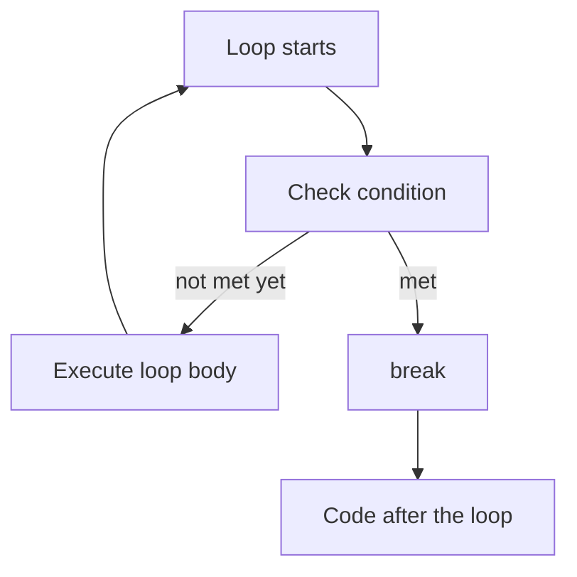
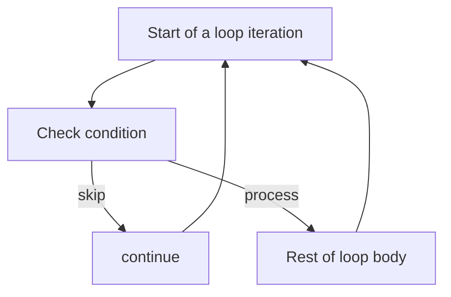
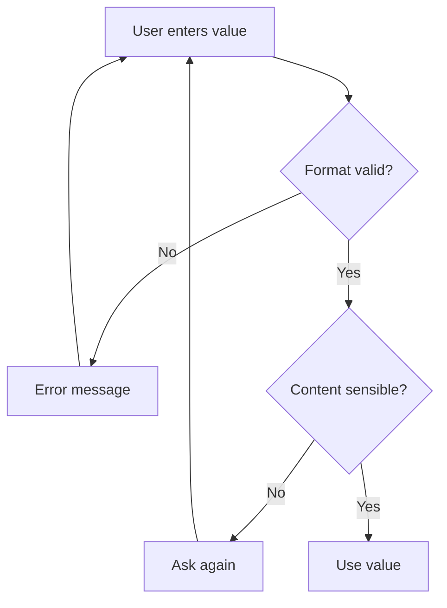
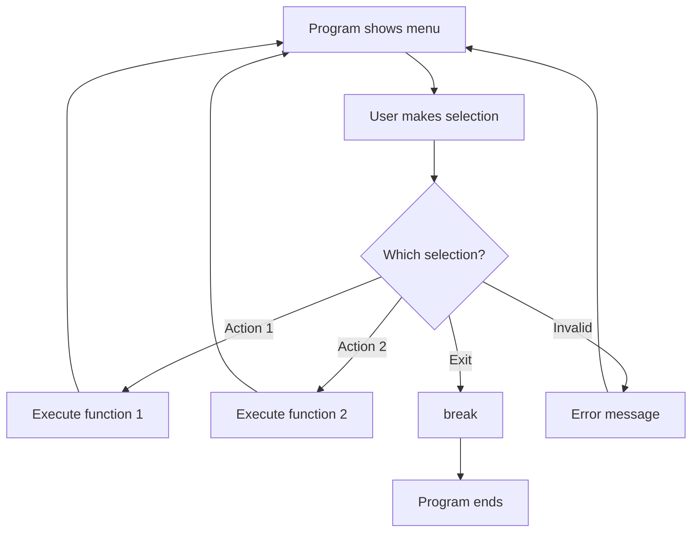
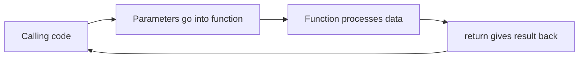

###### Topics

Loop Control

- use break to prematurely end loops
- apply continue in simple cases

Practical Use Cases

- validate inputs
- control program logic through user interaction

Define Own Functions

- create functions with def
- use functions with parameters and return values
- choose meaningful function names

<br><br><br>
# 🔁 Loop Control

When you program, many processes follow the same pattern: something is repeated until a goal is achieved. That's exactly what **loops** are for. In Python, you usually use `for` or `while` loops for this.

But loops alone are often not enough. In real programs, you sometimes need to say in the middle of a repetition:

- **"Stop, we're done."** → that's what `break` is for
- **"We'll skip this pass."** → that's what `continue` is for

These two tools are part of **loop control**. They help you make the flow flexible instead of just running through everything to the end. Python describes `break` as an immediate termination of the **innermost enclosing loop**, while `continue` jumps directly to the next iteration of that loop ([Python Language Reference – break](https://docs.python.org/3/reference/simple_stmts.html#the-break-statement), [Python Language Reference – continue](https://docs.python.org/3/reference/simple_stmts.html#the-continue-statement)).

<br><br><br>
## 🛑 Using `break` to Prematurely End Loops

`break` means: **End the loop immediately.**

As soon as Python encounters `break`, the current loop is aborted. The code after the loop then continues as normal. This is especially useful if you already found what you were looking for earlier, or when an input is finally valid.

### What exactly happens?

Imagine a loop like a round that always starts over. `break` says:

> "We don't need to continue. Exit the loop."

Important: `break` ends **only the loop it's directly in**, not automatically all outer loops ([Python Language Reference – break](https://docs.python.org/3/reference/simple_stmts.html#the-break-statement)).

### Simple Example

```python
for number in range(10):
    if number == 5:
        break
    print(number)

print("Loop ended")
```

Output:

```python
0
1
2
3
4
Loop ended
```

As soon as `number == 5`, the loop ends. The `5` itself is not printed anymore because `break` is executed before.

### Typical Use Cases for `break`

`break` is especially useful when you don't know in advance how long a loop has to run.

For example:

- you are searching for a certain value
- you are waiting for a correct user input
- you read data until an end signal comes
- you want to controllably exit an infinite loop

### Example: Prompt User Input Until It Fits

```python
while True:
    entry = input("Type 'yes' to continue: ")

    if entry == "yes":
        print("Thank you, continuing.")
        break

    print("That was not correct.")
```

Here, `while True` is deliberately an infinite loop. It runs until `break` is executed. This pattern is very common in practice.

### Why `break` Is So Useful

Without `break`, you would have to build many complicated conditions around it. With `break` you can clearly say:

- **Loop is running**
- **Condition met**
- **Stop immediately**

This often makes the code more direct and understandable.

### Mental Model

You can imagine `break` like an **emergency exit**:

- As long as everything runs normally, the loop goes round and round.
- When a certain condition occurs, you take the emergency exit.
- After that, you're out and continue below the loop.

### Visualization: `break` in a Loop



### Clean Usage of `break`

`break` is very helpful when there is a **clear reason for termination**. Good examples are:

- "Input is valid"
- "Element has been found"
- "User wants to quit"
- "Error case detected, loop should not continue"

It's less good if there are lots of `break` statements scattered throughout the code and you can hardly tell when the loop actually ends. Then the flow becomes hard to read.

<br><br><br>
## ⏭️ Apply `continue` in Simple Cases

`continue` does not mean "end the loop", but rather:

> "Skip this iteration and immediately start the next one."

Python then does **not execute** the rest of the code inside the current round, but jumps straight to the next loop iteration ([Python Language Reference – continue](https://docs.python.org/3/reference/simple_stmts.html#the-continue-statement)).

### Difference Between `break` and `continue`

| Statement | Effect |
|---|---|
| `break` | fully terminates the loop |
| `continue` | only ends the current iteration and starts the next one |

This is a very important difference.

### Example

```python
for number in range(6):
    if number == 3:
        continue
    print(number)
```

Output:

```python
0
1
2
4
5
```

The `3` is skipped. The loop continues as normal afterward.

### When `continue` Makes Sense

`continue` is especially handy if you want to **exclude certain cases early**.

For example:

- ignore empty inputs
- skip invalid records
- only process suitable values further
- rapidly sort out special cases

### Example: Skip Empty Inputs

```python
inputs = ["Max", "", "Anna", "", "Tom"]

for name in inputs:
    if name == "":
        continue
    print(f"Hello {name}")
```

Here, empty entries are simply skipped. This way, you don't have to wrap the rest of the code in extra `if` blocks.

### Why Only "in Simple Cases"?

This is an important point. `continue` is useful, but if you use it too often or in complex places, the flow becomes hard to track.

Simple, easily readable case:

```python
for value in data:
    if value is None:
        continue
    print(value)
```

Harder to read case:

```python
for value in data:
    if condition_a:
        continue
    if condition_b:
        continue
    if condition_c:
        continue
    if condition_d:
        continue
    # lots more code
```

Then you quickly wonder: **Which cases are actually being processed?**  
Therefore, `continue` is best when it makes a small, clear statement:

- "skip if empty"
- "skip if invalid, next iteration"

### Mental Model

`continue` is like a thought in your head:

> "We're not going to check this candidate further, take the next one."

Not out of the loop, just out of the **current round**.

### Visualization: `continue` in a Loop



### Good Rule for Effective Learning

When learning `break` and `continue`, don't just memorize their definitions; always ask yourself:

- **Do I want to exit the loop completely?** → `break`
- **Do I only want to skip this one iteration?** → `continue`

This distinction is much more important than just memorizing the syntax.

<br><br><br>
# 🧩 Practical Use Cases

Loop control only really makes sense when you see it in real situations. Especially common are:

- **validating inputs**
- **controlling program logic via user interaction**

These are classic programming fundamentals, since programs almost always have to react to data or users.

<br><br><br>
## ✅ Validate Inputs

Validating inputs means: a program accepts an input and checks if it's valid. If not, it asks again.

This is a very basic pattern in software development. A program shouldn't just blindly accept anything. It must check:

- Was anything even entered?
- Is the format correct?
- Is the value allowed?
- Is the input meaningful?

### Typical Basic Pattern

```python
while True:
    entry = input("Please enter a number: ")

    if not entry.isdigit():
        print("That's not a valid number.")
        continue

    number = int(entry)
    print(f"You entered the number {number}.")
    break
```

### What Happens Here

1. The loop begins.
2. The user enters something.
3. With `isdigit()`, it's checked if the entry contains only digits.
4. If not, the next loop iteration is started immediately with `continue`.
5. If the input is valid, it is converted.
6. The loop ends with `break`.

### Why This Pattern Is So Effective

Here, `continue` and `break` work perfectly together:

- `continue` handles **invalid cases**
- `break` ends the loop for the **valid case**

It's logically clean because the code expresses:

- wrong input → try again
- correct input → proceed

### Better Way of Thinking About Input Checking

Many beginners think:  
"I just need `input()`."

In reality, `input()` is only the beginning. The important part is **validating** the input. That's where you see if a program is robust.

### Example: Only Accept Age Within a Sensible Range

```python
while True:
    entry = input("How old are you? ")

    if not entry.isdigit():
        print("Please only enter a whole number.")
        continue

    age = int(entry)

    if age < 0 or age > 120:
        print("Please enter a realistic age.")
        continue

    print(f"Your age is {age}.")
    break
```

Here, it's not only checked **if** it's a number but also **if** it's reasonable. That's precisely how clean program logic is built.

### Visualization: Input Validation with a Loop



### Technically Important

The built-in function `input()` in Python always reads a **string**, i.e., text. If you want to process a number, you first have to check and then convert the input ([Python Built-in Functions – input](https://docs.python.org/3/library/functions.html#input), [Python Built-in Functions – int](https://docs.python.org/3/library/functions.html#int)).

This is a core programming principle:  
**Receiving input is not the same as understanding input.**

### Typical Mistakes When Validating Input

A common mistake is to convert directly:

```python
number = int(input("Please enter a number: "))
```

This can work, but only as long as the user really enters a number. For invalid input, an error occurs. For learning and clear logic, the previous verification is often more understandable.

### Why This Belongs to "Core Tech Fundamentals"

Input validation is not just a side issue. It trains several basic skills at once:

- understanding loops
- formulating conditions
- validating data
- controlling program flow
- improving user friendliness

So you don't just learn syntax, but real thinking in processes.

<br><br><br>
## 🕹️ Controlling Program Logic Through User Interaction

Many programs don't just run linearly from top to bottom. Instead, they respond to user choices. That's exactly when loop control comes in handy:

- User selects an action
- Program executes it
- Then the program prompts again
- On "Exit," it's terminated

This pattern is behind menus, simple console programs, and many interactive tools.

### Typical Menu Example

```python
while True:
    print("\nMenu:")
    print("1 - Show greeting")
    print("2 - Show time")
    print("3 - Exit")

    selection = input("Please choose: ")

    if selection == "1":
        print("Hello!")
    elif selection == "2":
        print("The time function would be built in here.")
    elif selection == "3":
        print("Program will exit.")
        break
    else:
        print("Invalid selection.")
```

### Why This Is Didactically Important

This example nicely shows that a program does not have to be a rigid block. It can **react to people**. The loop keeps the program alive, and the conditions decide what happens next.

### The Role of `break` in Interactive Programs

In such menus, `break` is the signal for:

- User wants to exit the program
- Program can now terminate the loop in a controlled way

Without `break`, the menu would run endlessly.

### The Role of `continue`

Sometimes when the input is invalid, you don't want to run the rest of the code but just prompt again:

```python
while True:
    selection = input("Choose start/stop: ")

    if selection not in ["start", "stop"]:
        print("Invalid input.")
        continue

    print(f"You chose {selection}.")
    break
```

Here, `continue` ensures invalid inputs are immediately dismissed.

### Why User Interaction Is So Important for Learning

When you work with inputs, you learn not just language elements but **process logic**. You no longer think merely in single commands, but in states:

- waiting
- checking
- processing
- repeating
- quitting

This is a key step from just writing code to understanding programs.

### Mental Model: Program as a Dialogue

Instead of seeing a program as "a list of instructions", you can view it as a small dialogue:

1. Program asks something.
2. User answers.
3. Program evaluates the answer.
4. Depending on the answer, it continues differently.

This mindset is extremely helpful because it makes program logic tangible.

### Visualization: User Controls the Flow



<br><br><br>
# 🛠️ Defining Own Functions

Functions are one of the most important tools in Python and programming in general. They help you break code into **small, named, reusable units**.

Instead of re-writing the same process multiple times, you define it once and call it when needed. Python uses the keyword `def` for this ([Python Tutorial – Defining Functions](https://docs.python.org/3/tutorial/controlflow.html#defining-functions)).

Functions are especially important for effective learning because they force you to think clearly:

- What should the code do?
- What inputs does it need?
- What should it return?
- How can I name it understandably?

That's more than just syntax. That's structured problem solving.

<br><br><br>
## 🧱 Creating Functions with `def`

In Python, you define a function with `def`. After that comes the function name, then parentheses and a colon.

### Basic Form

```python
def greeting():
    print("Hello!")
```

This function is called `greeting` and prints a message when called.

### Calling the Function

```python
greeting()
```

Only by calling the function is it executed. This is a very important point:  
**Defining stores the instructions, calling starts them.**

### What Happens with a Function Behind the Scenes?

A function is like a small blueprint:

- You give it a name.
- You define what should happen.
- Later, you can use this blueprint over and over.

### Why Functions Are So Valuable

Without functions, everything quickly ends up in a long, confusing script. With functions, you can outsource parts.

Example without function:

```python
name = input("Name: ")
print(f"Hello {name}")

name = input("Name: ")
print(f"Hello {name}")
```

With function:

```python
def greet_user():
    name = input("Name: ")
    print(f"Hello {name}")

greet_user()
greet_user()
```

The advantage is not just that you write less code. Much more important is: The code gains a **clear meaning**.

### Good Learning Perspective

When you learn functions, don't think first:

> "What was the syntax again?"

But rather:

> "Which coherent process deserves its own name?"

That's exactly how good functions emerge.

<br><br><br>
## 🎛️ Using Functions with Parameters and Return Values

As long as functions only do fixed things, they're still quite limited. They become really useful through:

- **Parameters**: values you pass to the function
- **Return values**: values the function returns

Python allows functions with any number of parameters; a `return` ends the function and optionally returns a value ([Python Tutorial – Defining Functions](https://docs.python.org/3/tutorial/controlflow.html#defining-functions)).

### Parameters: Inputs for the Function

```python
def greet(name):
    print(f"Hello {name}")
```

Here, `name` is a parameter. The function can thus work with different values.

Call:

```python
greet("Anna")
greet("Tom")
```

### Return Values: Output from the Function

```python
def add(a, b):
    return a + b
```

Call:

```python
result = add(3, 4)
print(result)
```

The function computes a value and returns it with `return`.

### The Difference Between `print()` and `return`

This is one of the most important learning points ever.

| Term | Meaning |
|---|---|
| `print()` | displays something to the screen |
| `return` | gives a value back to the calling code |

This is often confused at first.

### Example for Comparison

```python
def incorrect_add(a, b):
    print(a + b)
```

This function just displays the result.

```python
def correct_add(a, b):
    return a + b
```

This function returns the result, so you can keep working with it.

For example:

```python
sum = correct_add(5, 7)
double = sum * 2
print(double)
```

So `return` makes a function part of a larger logic.

### Why Parameters and Return Values Are So Important

Only through this do functions become flexible and reusable.

A function without parameters and without return value is usually a hard-wired process.  
A function with parameters and return values is a real tool.

### Practical Example: Outsource Input Validation into a Function

```python
def read_age():
    while True:
        entry = input("Please enter your age: ")

        if not entry.isdigit():
            print("Please enter a whole number.")
            continue

        age = int(entry)

        if age < 0 or age > 120:
            print("Please enter a realistic age.")
            continue

        return age
```

Usage:

```python
age = read_age()
print(f"The validated age is: {age}")
```

### Why This Is a Very Good Example

Here you see several fundamentals combined:

- loop for repetition
- `continue` for invalid entries
- `return` for the result
- clearly defined function responsibility

The function does exactly one thing:  
**read and return a valid age**

That's clean thinking in software.

### Data Flow of a Function



### Good Rule

If a function **calculates** something, `return` is usually appropriate.  
If it just **displays** or **performs** something, sometimes an effect like `print()` is enough.

But for clean, reusable code, `return` is often the stronger solution.

<br><br><br>
## 🏷️ Choosing Meaningful Function Names

Function names are not just labels. They're a huge part of your code's clarity. A good name immediately tells you:

- what the function does
- ideally without having to read the code

Python recommends in style guide PEP 8 for function names **lowercase words with underscores** ([PEP 8 – Function and Variable Names](https://peps.python.org/pep-0008/#function-and-variable-names)).

### Good Names Describe an Action

Functions do something. So verbs or verb-like names often fit well.

Good examples:

```python
def calculate_price():
    ...
```

```python
def validate_input():
    ...
```

```python
def load_file():
    ...
```

```python
def read_age():
    ...
```

These names make clear what happens.

### Bad Names Are Too General or Too Vague

Less helpful names are:

```python
def do():
    ...
```

```python
def test():
    ...
```

```python
def data():
    ...
```

```python
def foo():
    ...
```

Such names convey very little about the function's job.

### Why Good Names Matter So Much

A good function name saves brain power. When you look at your code later, you want to understand as quickly as possible what happens.

Comparison:

```python
value = f(x)
```

and

```python
value = calculate_vat(price)
```

In the latter case, the intent is immediately clear.

### Function Names Should Reflect Responsibility

If a function is called `validate_password()`, you expect it to check a password.  
If, instead, it also stores data, sends emails, and changes the menu, the name is too small for its actual job.

That's an important learning signal:  
**If you can hardly name a function appropriately, it probably does too much.**

### Practical Naming Rules

A meaningful function name is usually:

- **clear**
- **concrete**
- **action-specific**
- **not unnecessarily brief**
- **not misleading**

### Examples in Comparison

| Bad Name | Better Name | Why Better |
|---|---|---|
| `do_something()` | `validate_input()` | describes the task |
| `calc()` | `calculate_total_price()` | specifies what is calculated |
| `x1()` | `read_username()` | understandable |
| `data()` | `load_customer_data()` | shows action and context |

### Style in Python

PEP 8 recommends for function names:

```python
def read_file():
    ...
```

instead of, for example:

```python
def ReadFile():
    ...
```

or:

```python
def readFile():
    ...
```

Not because the other variants are technically impossible, but because a common style makes code more readable and consistent ([PEP 8 – Function and Variable Names](https://peps.python.org/pep-0008/#function-and-variable-names)).

### Especially Helpful Thought Question

Before you name a function, ask yourself:

> "If someone only sees the function name—do they understand its job?"

If the answer is no, the name is probably not good enough yet.

### Link to Effective Learning

Meaningful function names don't just help other people. They also help you while learning. Because if you are forced to name a function clearly, you must really have understood its purpose.

That's a powerful learning effect:

- unclear name → often unclear thought
- clear name → usually clearer structure

That's why good names are not a side issue, but part of clean software development.

<br><br><br>
# 🧠 Connecting the Topics: How Loops and Functions Work Together

In practice, these topics almost never stand alone. Most of the time you work like this:

1. A loop keeps the process running.
2. `continue` filters out invalid cases.
3. `break` ends the process when a goal is reached.
4. Functions encapsulate subtasks in clean units.

### Complete but Simple Example

```python
def read_option():
    while True:
        choice = input("Choose 'start' or 'end': ")

        if choice not in ["start", "end"]:
            print("Invalid input.")
            continue

        return choice


while True:
    option = read_option()

    if option == "start":
        print("Program part will be executed.")
    elif option == "end":
        print("Program will terminate.")
        break
```

### Why This Example Is Didactically Strong

Here you clearly see the roles:

- `read_option()` handles input validation
- `continue` deals with invalid entries
- `return` delivers the valid choice back
- `break` ends the main program

This is a very typical basic pattern in real program logic.

### What You Should Professionally Take Away

The true strength lies not in the individual keywords but in their interplay:

- **loops** repeat
- **conditions** decide
- **`continue`** skips unsuitable cases
- **`break`** terminates cleanly
- **functions** structure the code

If you master these building blocks, you have truly understood an important part of the fundamentals of programming.