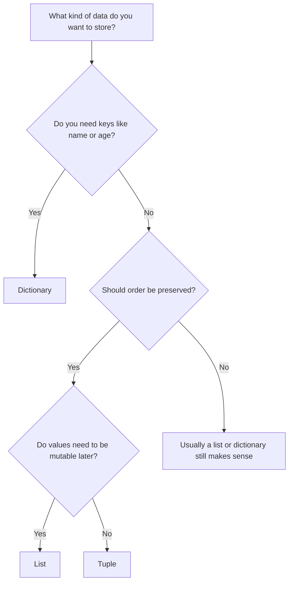
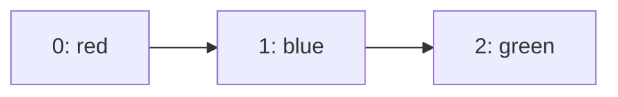
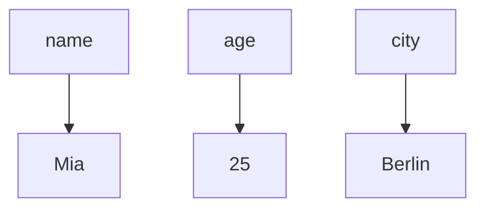

###### Topics

Data Structures in Python

- Understand differences and use cases of lists, tuples, and dictionaries
- Create and use lists, tuples, and dictionaries

Element access and manipulation

- Access elements and modify values
- Add and remove elements

Applying Data Structures

- Iterate over lists and dictionaries
- Implement typical simple use-cases such as counting and lookup

<br><br><br>
# 🐍 Data Structures in Python

When you program in Python, you’re almost always working with **data structures**. A data structure is simply a way to **store values in an organized and meaningful way**, so you can later read, modify, or search them.

For beginners, three types are especially important:

- **Lists**
- **Tuples**
- **Dictionaries**

These three are basically the basic tools for almost everything you’ll do in Python later: loops, functions, data processing, web development, automation, and much more.

Python itself describes lists as **mutable sequences**, tuples as **immutable sequences**, and dictionaries as **mappings from keys to values** ([Built-in Types](https://docs.python.org/3/library/stdtypes.html), [The Python Tutorial – Data Structures](https://docs.python.org/3/tutorial/datastructures.html)).

So you not only know **how** they look, but also **when** you should sensibly use each structure, let's go through them step by step.

<br><br><br>
## 🧭 Understanding the Differences and Use Cases of Lists, Tuples, and Dictionaries

The most important questions are always:

**Do I want to store an order?**  
**Should the data be changeable later on?**  
**Or do I want to look up values by a name or key?**

Exactly this determines which data structure fits.

<br><br><br>
### 📋 Lists

A **list** stores multiple values in a **specific order**. It’s **mutable**, that is: you can later add, remove, or replace elements ([Built-in Types](https://docs.python.org/3/library/stdtypes.html)).

Example:

```python
colors = ["red", "blue", "green"]
```

Here, the list contains three elements. The order is preserved:

1. `"red"`
2. `"blue"`
3. `"green"`

Lists are especially meaningful when:

- **Order matters**
- You want to **change elements later**
- You want to **add or remove** values
- You want to **iterate through many entries in sequence**

Typical use cases:

- To-do lists
- Measurement data
- Lists of names
- Search results
- Temporary storage for data

So a list is the standard tool if you just want to store "several things in sequence".

<br><br><br>
### 🧱 Tuples

A **tuple** is similar to a list, but it is **immutable**. That means: Once a tuple is created, you cannot replace, add, or remove its elements ([Built-in Types](https://docs.python.org/3/library/stdtypes.html)).

Example:

```python
coordinates = (10, 20)
```

Here, too, there is an order, but no later modification.

Tuples make sense when:

- Values **belong together**
- These values **should not be changed**
- You want to clearly indicate: “This structure is fixed”
- Data should be passed as a **safe, stable group**

Typical use cases:

- Coordinates like `(x, y)`
- RGB colors like `(255, 128, 0)`
- Fixed configurations
- Return values from functions

Important: A tuple does not automatically protect every kind of internal content. If, for example, a list is inside a tuple, the **list itself** remains mutable. Only the tuple’s structure is immutable ([Built-in Types](https://docs.python.org/3/library/stdtypes.html)).

<br><br><br>
### 🗂️ Dictionaries

A **dictionary** stores data as **key-value pairs**. Instead of accessing by a position like `0` or `1`, you use a **key**, for example a name ([Built-in Types](https://docs.python.org/3/library/stdtypes.html)).

Example:

```python
person = {
    "name": "Mia",
    "age": 25,
    "city": "Berlin"
}
```

Here, `"name"`, `"age"`, and `"city"` are the keys.

Dictionaries are especially useful when:

- You want to **look up data by a term**
- Values should have a **clear meaning**
- Information about one object is grouped together
- Fast lookup is important

Typical use cases:

- User data
- Settings
- Configurations
- Counters
- Dictionaries and translation tables
- Mappings like `ID -> record`

Since Python 3.7, dictionaries are guaranteed to **retain insertion order** ([Built-in Types](https://docs.python.org/3/library/stdtypes.html)). That means: If you add keys in a certain order, this order is maintained when iterating, normally. Still, dictionaries are not primarily used for their positions, but for their **keys**.

<br><br><br>
## 📊 A Direct Comparison

The differences are often easiest to see in a table:

| Property | List | Tuple | Dictionary |
|---|---|---|---|
| Syntax | `[]` | `()` | `{}` |
| Basic idea | ordered collection | ordered, fixed collection | key-value mapping |
| Mutable | yes | no | yes |
| Access via | index | index | key |
| Order | yes | yes | insertion order retained |
| Duplicate values allowed | yes | yes | keys must be unique |
| Typical purpose | store and modify multiple things | fixed data group | lookup and mapping |

A central point is:  
**Lists and tuples are sequences**, i.e., ordered elements.  
**Dictionaries are mappings**, i.e., associations from key to value ([Built-in Types](https://docs.python.org/3/library/stdtypes.html)).

<br><br><br>
## 🤔 When Should I Use Which Data Structure?

A simple decision logic helps here:



Practically:

- **List**: “I have several things and want to work flexibly with them.”
- **Tuple**: “These values belong together and should stay fixed.”
- **Dictionary**: “I want to find information by names or keys.”

A few typical decisions:

| Situation | Fitting Structure | Why |
|---|---|---|
| Shopping list | List | Order possible, entries mutable |
| GPS coordinate | Tuple | Two fixed values that belong together |
| User profile | Dictionary | Data by names like `name`, `email`, `age` |
| Grades in a class | List | Many entries to iterate over |
| Color codes | Tuple | Fixed combination of values |
| Dictionary German → English | Dictionary | Lookup by key |

<br><br><br>
## 🛠️ Creating and Using Lists, Tuples, and Dictionaries

Now let's look at how to actually create and use these data structures in Python.

<br><br><br>
### 📋 Creating and Using Lists

A list is written with square brackets:

```python
numbers = [10, 20, 30]
names = ["Anna", "Ben", "Clara"]
mixed = [1, "Hello", True, 3.14]
```

Python lists can **contain different data types at the same time** ([Built-in Types](https://docs.python.org/3/library/stdtypes.html)). In practice, it's often cleaner to store similar things together in a list, e.g., only numbers or only names.

Empty list:

```python
empty_list = []
```

You can also nest lists:

```python
matrix = [
    [1, 2, 3],
    [4, 5, 6]
]
```

This is useful for tables, grids, or structured groups of values.

You can think of a list as a row of compartments:



<br><br><br>
### 🧱 Creating and Using Tuples

A tuple is written with round brackets:

```python
point = (4, 7)
rgb = (255, 200, 100)
```

An empty tuple:

```python
empty = ()
```

For a tuple with only one element, you must add a comma, otherwise Python doesn't recognize it as a tuple:

```python
single_value = (5,)
```

That’s a classic beginner's point.  
`(5)` is just a parenthesized number.  
`(5,)` is a tuple with one element.

Tuples are often used when values logically belong together and shouldn’t be changed, for example:

```python
birthdate = (21, 3, 2001)
```

<br><br><br>
### 🗂️ Creating and Using Dictionaries

A dictionary is written with curly braces and `key: value`:

```python
student = {
    "name": "Lena",
    "age": 22,
    "major": "Computer Science"
}
```

Empty dictionary:

```python
empty_dict = {}
```

Important: **Keys must be unique**. If the same key appears more than once, only the last value is kept, since a key can only point to one value ([Built-in Types](https://docs.python.org/3/library/stdtypes.html)).

Example:

```python
data = {
    "name": "Tom",
    "name": "Eva"
}

print(data)
```

Result:

```python
{'name': 'Eva'}
```

You can imagine a dictionary like this:



It’s especially practical that with a dictionary you access data by their **meaning** rather than their position. This often makes code more readable.

<br><br><br>
# 🔎 Element Access and Manipulation

Now comes the part that is really needed all the time in practice:  
How do you access individual values, and how do you change them?

<br><br><br>
## 🎯 Accessing Elements and Modifying Values

Access differs depending on the data structure.

<br><br><br>
### 📋 Accessing List Elements

Lists use **indices**. The first index is `0`, not `1` ([The Python Tutorial – An Informal Introduction to Python](https://docs.python.org/3/tutorial/introduction.html)).

```python
colors = ["red", "blue", "green"]

print(colors[0])  # red
print(colors[1])  # blue
print(colors[2])  # green
```

Why does Python start with `0`?  
It has to do with how many programming languages handle positions internally. For you, the main thing is: **first element = index 0**.

You can also count from the end:

```python
print(colors[-1])  # green
print(colors[-2])  # blue
```

Negative indices mean: count from the end.

Lists are mutable, so you can replace values:

```python
colors[1] = "yellow"
print(colors)
```

Result:

```python
['red', 'yellow', 'green']
```

There is also **slicing**—cutting a range out:

```python
numbers = [10, 20, 30, 40, 50]

print(numbers[1:4])  # [20, 30, 40]
print(numbers[:3])   # [10, 20, 30]
print(numbers[2:])   # [30, 40, 50]
```

A slice creates a new list from a list ([Built-in Types](https://docs.python.org/3/library/stdtypes.html)).

<br><br><br>
### 🧱 Accessing Tuples

Tuples work almost like lists when reading:

```python
point = (5, 9)

print(point[0])   # 5
print(point[1])   # 9
print(point[-1])  # 9
```

Slicing is also possible:

```python
values = (1, 2, 3, 4, 5)
print(values[1:4])  # (2, 3, 4)
```

The crucial difference: You **cannot modify** a tuple.

```python
point[0] = 8
```

This leads to an error, because tuples are immutable ([Built-in Types](https://docs.python.org/3/library/stdtypes.html)).

That's what makes tuples useful if you want to avoid accidental changes.

<br><br><br>
### 🗂️ Accessing Dictionary Values

For dictionaries, access is via the **key**:

```python
person = {
    "name": "Mia",
    "age": 25
}

print(person["name"])   # Mia
print(person["age"])    # 25
```

If you want to change a value, just assign a new value to the key:

```python
person["age"] = 26
print(person)
```

Result:

```python
{'name': 'Mia', 'age': 26}
```

If you access a key that doesn’t exist, you get an error:

```python
print(person["city"])
```

A safer way is often the `get()` method:

```python
print(person.get("city"))           # None
print(person.get("city", "Unknown"))
```

So `get()` returns either `None` or a default value instead of an error if the key is missing ([Built-in Types](https://docs.python.org/3/library/stdtypes.html)).

This is very handy in everyday work with incomplete data.

<br><br><br>
## ➕ Adding and Removing Elements

Here you really see the differences between mutable and immutable structures most clearly.

<br><br><br>
### 📋 Modifying Lists

You can change lists in many ways.

#### Add to the End

```python
numbers = [1, 2, 3]
numbers.append(4)
print(numbers)
```

Result:

```python
[1, 2, 3, 4]
```

`append()` adds exactly **one element** to the end of the list ([The Python Tutorial – More on Lists](https://docs.python.org/3/tutorial/datastructures.html)).

#### Insert at a Specific Position

```python
numbers = [1, 2, 4]
numbers.insert(2, 3)
print(numbers)
```

Result:

```python
[1, 2, 3, 4]
```

#### Add Several Elements

```python
numbers = [1, 2]
numbers.extend([3, 4, 5])
print(numbers)
```

Result:

```python
[1, 2, 3, 4, 5]
```

`extend()` adds multiple elements from another iterable ([The Python Tutorial – More on Lists](https://docs.python.org/3/tutorial/datastructures.html)).

#### Remove Element by Value

```python
colors = ["red", "blue", "green"]
colors.remove("blue")
print(colors)
```

Result:

```python
['red', 'green']
```

`remove()` removes the **first occurrence** of a matching element. If the value does not exist, an error is raised ([The Python Tutorial – More on Lists](https://docs.python.org/3/tutorial/datastructures.html)).

#### Remove Element by Position

```python
numbers = [10, 20, 30]
removed = numbers.pop(1)

print(numbers)     # [10, 30]
print(removed)     # 20
```

`pop()` removes and returns an element at the same time.

Without an index, `pop()` removes the last element:

```python
numbers = [10, 20, 30]
last = numbers.pop()

print(last)   # 30
print(numbers)    # [10, 20]
```

#### Delete with `del`

```python
numbers = [10, 20, 30]
del numbers[1]
print(numbers)
```

Result:

```python
[10, 30]
```

With `del` you can also delete entire ranges:

```python
numbers = [1, 2, 3, 4, 5]
del numbers[1:4]
print(numbers)
```

Result:

```python
[1, 5]
```

#### Empty the Entire List

```python
numbers = [1, 2, 3]
numbers.clear()
print(numbers)
```

Result:

```python
[]
```

<br><br><br>
### 🧱 Modifying Tuples?

In short: **no**. A tuple is immutable.

So you cannot:

- Add elements
- Delete elements
- Replace elements directly

If you “want to change a tuple”, you’re really creating a **new tuple**:

```python
point = (1, 2)
point = (point[0], 5)
print(point)
```

Result:

```python
(1, 5)
```

The original tuple was not modified, but replaced by a new one.

For practical purposes:  
If you know from the start the data will be changed often, a tuple is usually **not** the right choice. Use a list instead.

<br><br><br>
### 🗂️ Expanding, Modifying, and Clearing Dictionaries

#### Add a New Key

```python
person = {"name": "Mia"}
person["city"] = "Berlin"
print(person)
```

Result:

```python
{'name': 'Mia', 'city': 'Berlin'}
```

#### Modify Existing Value

```python
person["name"] = "Lina"
print(person)
```

#### Update Several Values at Once

```python
person.update({
    "age": 25,
    "city": "Hamburg"
})
print(person)
```

`update()` adds multiple key-value pairs to a dictionary ([Built-in Types](https://docs.python.org/3/library/stdtypes.html)).

#### Remove Element with `pop()`

```python
person = {"name": "Mia", "age": 25}
age = person.pop("age")

print(person)   # {'name': 'Mia'}
print(age)      # 25
```

#### Remove Last Inserted Pair

```python
data = {"a": 1, "b": 2}
entry = data.popitem()

print(data)
print(entry)
```

Since Python 3.7, `popitem()` removes the most recently inserted key-value pair ([Built-in Types](https://docs.python.org/3/library/stdtypes.html)).

#### Remove with `del`

```python
person = {"name": "Mia", "age": 25}
del person["name"]
print(person)
```

#### Empty the Whole Dictionary

```python
person.clear()
print(person)
```

<br><br><br>
# 🔁 Applying Data Structures

Now it gets especially practical:  
Data structures are not just containers. They become exciting when you **work** with them—counting, searching, iterating, and processing structured information.

<br><br><br>
## 🚶 Iterating over Lists and Dictionaries

**Iterating** means going through a data structure element by element. In Python, this usually happens with a `for` loop ([The Python Tutorial – More Control Flow Tools](https://docs.python.org/3/tutorial/controlflow.html)).

<br><br><br>
### 📋 Iterating over Lists

The simplest form:

```python
names = ["Anna", "Ben", "Clara"]

for name in names:
    print(name)
```

Here, each entry from the list is placed into the variable `name` one after another.

If you need the index as well, `enumerate()` is very practical:

```python
names = ["Anna", "Ben", "Clara"]

for index, name in enumerate(names):
    print(index, name)
```

Result:

```python
0 Anna
1 Ben
2 Clara
```

`enumerate()` gives you both **position and value** ([The Python Tutorial – Looping Techniques](https://docs.python.org/3/tutorial/datastructures.html)).

That’s often cleaner than keeping your own counter.

<br><br><br>
### 🗂️ Iterating over Dictionaries

With dictionaries, there are several options depending on what you need.

#### Only Keys

```python
person = {"name": "Mia", "age": 25, "city": "Berlin"}

for key in person:
    print(key)
```

By default, you iterate over **keys** ([The Python Tutorial – Looping Techniques](https://docs.python.org/3/tutorial/datastructures.html)).

#### Over Values

```python
for value in person.values():
    print(value)
```

#### Over Both Keys and Values

```python
for key, value in person.items():
    print(key, "->", value)
```

`items()` is often the most practical variant, as you get both: **which field** and **which content**.

For orientation:

| Method | Result |
|---|---|
| `for k in d:` | keys |
| `d.keys()` | keys |
| `d.values()` | values |
| `d.items()` | key-value pairs |

<br><br><br>
## 🔢 Implementing Typical Simple Use-Cases like Counting and Lookup

These are two of the most important basic patterns in real programming practice:

- **Counting**: How often does something occur?
- **Lookup**: Which value belongs to which key?

If you understand these two patterns well, you’ve already grasped a large part of everyday data work in Python.

<br><br><br>
### 🔢 Counting with Lists and Dictionaries

Suppose you have a list of colors:

```python
colors = ["red", "blue", "red", "green", "blue", "red"]
```

Now you want to know how many times each color occurs.  
A dictionary is ideal for this because you can assign a counter to each color.

```python
colors = ["red", "blue", "red", "green", "blue", "red"]
counter = {}

for color in colors:
    if color in counter:
        counter[color] += 1
    else:
        counter[color] = 1

print(counter)
```

Result:

```python
{'red': 3, 'blue': 2, 'green': 1}
```

What exactly is happening here?

- The list provides each color one by one.
- The dictionary `counter` keeps count for each color.
- If the color is already present, it is increased.
- If not, the counter starts at `1`.

This is a very typical basic pattern in data processing, log analysis, text evaluation, and statistics.

Somewhat shorter with `get()`:

```python
colors = ["red", "blue", "red", "green", "blue", "red"]
counter = {}

for color in colors:
    counter[color] = counter.get(color, 0) + 1

print(counter)
```

Here, `counter.get(color, 0)` means:

- If `color` exists, take the old value.
- If not, take `0`.

Then add `+1`.

This is a very elegant solution in many cases.

<br><br><br>
### 🔍 Lookup with Dictionaries

Dictionaries are perfect when you want to quickly find something by a key.

Example:

```python
phonebook = {
    "Anna": "0176-123456",
    "Ben": "0151-987654",
    "Clara": "0160-555555"
}

print(phonebook["Ben"])
```

Result:

```python
0151-987654
```

Here the advantage is immediate:
You don’t have to go through a list and search yourself, but access directly by name.

Another realistic example:

```python
prices = {
    "Apple": 0.80,
    "Banana": 1.20,
    "Bread": 2.50
}

product = "Banana"
print(prices[product])
```

So a dictionary is ideal for:

- Price lists
- User data
- Settings
- Translations
- Configurations
- ID-based mappings

If the key might be missing, `get()` is a safer bet again:

```python
print(prices.get("Milk", "Not available"))
```

This way you avoid errors with uncertain input data.

<br><br><br>
### 🧠 Combination of List and Dictionary

In practice, data structures are often combined.

Example: a list of several dictionaries

```python
students = [
    {"name": "Anna", "grade": 1},
    {"name": "Ben", "grade": 2},
    {"name": "Clara", "grade": 1}
]
```

This is a very common pattern:  
**A list of records**, where each record is a dictionary.

Why is this so useful?

- The **list** stores multiple entries.
- Each **dictionary** describes an entry with named fields.

You can easily iterate through it:

```python
for entry in students:
    print(entry["name"], "got grade", entry["grade"])
```

This pattern shows up almost everywhere:

- API responses
- JSON data
- Tabular data
- User lists
- Product catalogs

It’s very much worth understanding this interplay early on, since it comes up constantly later.

<br><br><br>
## 🧩 Typical Mindset When Working with Data Structures

Especially when learning, it’s more useful not just to memorize methods, but to understand the underlying way of thinking.

When you see a task, ask yourself:

1. **What do my data look like?**
2. **Do I need to change them?**
3. **Do I access them by position or by name?**
4. **Do I want to count, store, group, or look up?**

This almost always gives you the right structure:

- **Positions and order important** → list or tuple
- **Mutable** → list
- **Fixed and immutable** → tuple
- **Lookup by name/key** → dictionary

This way of thinking is extremely important in **Core Tech Fundamentals**. Good programmers don’t just remember syntax, but recognize:  
**Which data shape fits the problem?**

This is one of the crucial steps from just “writing code” to really **understanding**.

<br><br><br>
## 🧱 Solid Basic Patterns You Should Remember

A few core patterns you’ll encounter over and over:

| Goal | Typical Tool |
|---|---|
| Store multiple values in order | List |
| Store fixed data groups | Tuple |
| Look up by name | Dictionary |
| Count occurrences | Dictionary |
| Store multiple records | List of dictionaries |
| Iterate through data | `for` loop |

And very practically:

```python
lst = ["a", "b", "c"]
tup = ("a", "b", "c")
dictionary = {"a": 1, "b": 2, "c": 3}
```

You should really be able to read and write these three forms securely. They are a foundation for almost everything else in Python.

<br><br><br>
## 🧠 Learning the Right Way: Really Understanding Data Structures

Because your main context is also **learning well**, here’s an important didactic point:  
You don’t understand data structures best by just reading, but by **comparing them in your mind**.

A good mental model is:

- **List** = mutable row of compartments
- **Tuple** = fixed row of compartments
- **Dictionary** = labeled drawers

If you imagine these mental images for every code example, you not only remember the syntax, but also the function much better.

It also helps, when learning, to always ask three questions of an example:

### ❓ Which structure is it?

First recognize the form:

- `[]` → list
- `()` → tuple
- `{}` with `key: value` → dictionary

### ❓ How do I access it?

- List/tuple → by index
- Dictionary → by key

### ❓ May I change it?

- List → yes
- Tuple → no
- Dictionary → yes

If you automatically keep these three questions in mind, you will correctly classify almost every simple Python example.

This is a very good learning strategy, as it doesn’t just memorize facts but builds a **stable network of concepts**. This is how long-term technical understanding is created.

<br><br><br>
## 🧪 A Complete Mini Example from Real Life

Finally, here’s a small but realistic example in which several of the discussed ideas come together:

```python
purchases = ["Apple", "Banana", "Apple", "Bread", "Banana", "Apple"]

frequency = {}

for product in purchases:
    frequency[product] = frequency.get(product, 0) + 1

for product, count in frequency.items():
    print(product, "was bought", count, "times")
```

What’s going on here?

- `purchases` is a **list**, since multiple entries are stored in order.
- `frequency` is a **dictionary**, because the count is looked up for each product.
- The first loop **counts**.
- The second loop outputs the result in a structured way.

Exactly these kinds of patterns form the core of many programs:
Read, structure, process, output data.

If you can securely master lists, tuples, and dictionaries at this level, you have really understood a very important part of Python fundamentals.