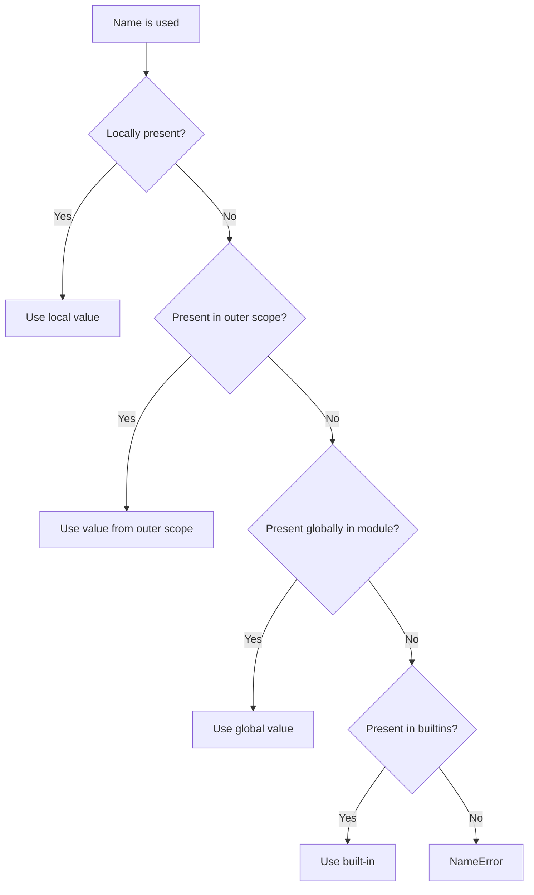
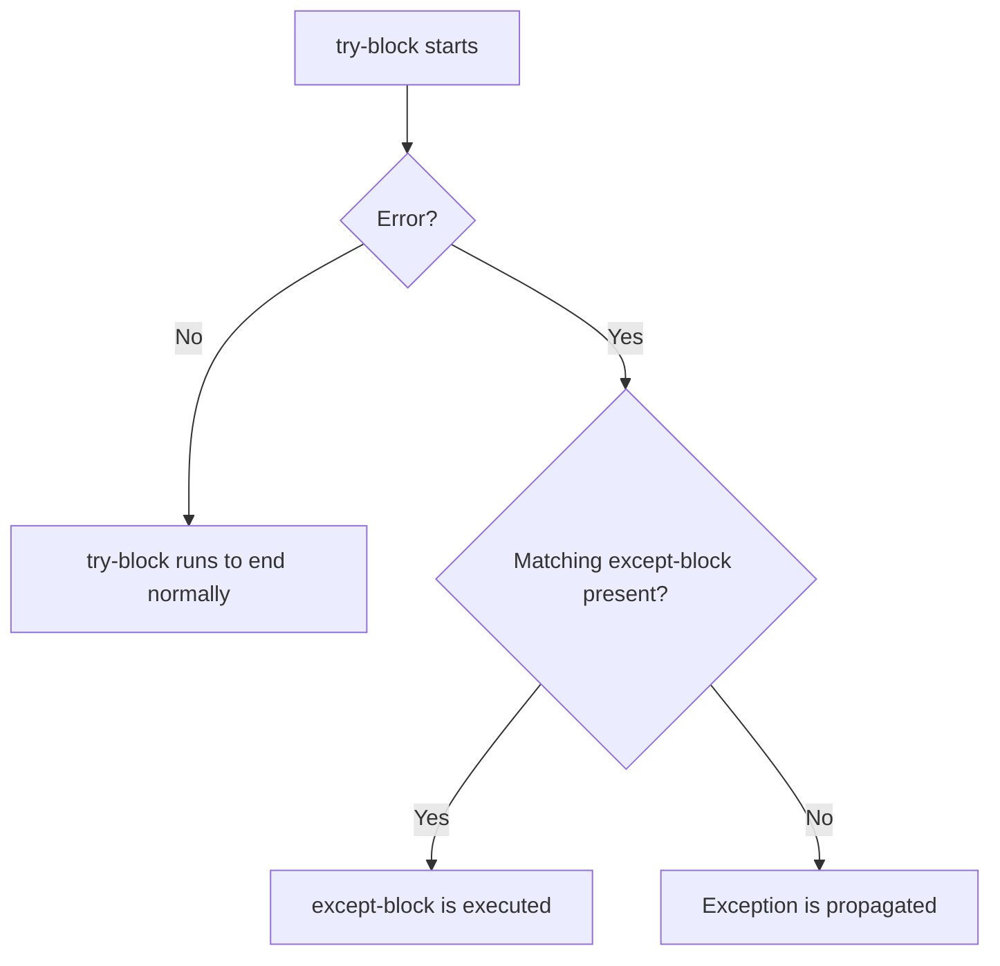
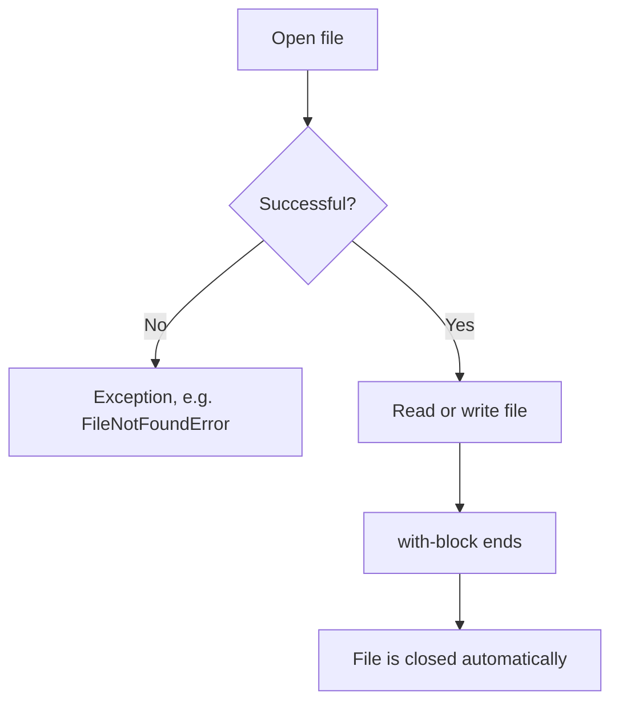

###### Topics

Scope and Modules

- Understand the basic difference between local and global variables
- Import and use standard modules
- Use your own Python files as modules in a simple form

Error Handling in Python

- Basics of exceptions and types of errors
- Use try and except for simple error handling

Simple File Processing

- Open, read, and write files with open()
- Use the with-statement for file access

<br><br><br>
# 🧭 Scope and Modules

When you program in Python, you constantly work with **names**: for example `x`, `name`, `price`, or `file`. These names refer to values or objects. The important question is always:

**From where is a name visible and usable?**

This is precisely the point of **scope**. Python manages very carefully **where** a variable exists and **where** it can be read or changed. This is a fundamental principle you should really understand, since it plays a role in almost every real Python program.

A second important topic is **modules**. Modules help you organize code, reuse it, and include functions from the Python standard library or from your own files. Python treats almost every `.py` file as a module, and that is what makes programs structured and maintainable ([The Python Tutorial – Modules](https://docs.python.org/3/tutorial/modules.html)).

<br><br><br>
## 📍 Understanding Local and Global Variables

A variable does not simply “exist”; it always lives in a specific **namespace** and thus in a specific **scope**. Python resolves names through fixed rules, based on where a name was defined and from where you access it ([Execution model](https://docs.python.org/3/reference/executionmodel.html)).

Roughly speaking:

- **Local variables** generally arise **inside a function**
- **Global variables** are generally defined **outside of functions**, i.e., at the module level

This might sound simple, but the crucial point is:
**It's not the name itself that's local or global, but the location where Python classifies it.**

<br><br><br>
### 🏠 Local Variables

A **local variable** is a variable that is created inside a function. It only belongs to this function and is usually not directly available outside of it.

```python
def greeting():
    text = "Hello!"
    print(text)

greeting()
```

Here, `text` is a local variable. It exists within the function `greeting()`.

If you were to write `print(text)` outside the function, you’d get an error because `text` is not known there.

Why is this useful?

Because this makes functions **independent**. What happens inside a function stays inside that function. This prevents chaos and makes code easier to understand.

An important point:
Local variables are usually **created only when the function is called**. When the function ends, this local binding is no longer normally accessible.

<br><br><br>
### 🌍 Global Variables

A **global variable** is a variable defined at the **module level**, i.e., outside of functions.

```python
language = "English"

def show_language():
    print(language)

show_language()
```

Here, `language` is global. The function can read it even though it didn’t define it itself.

That's because when searching for a name, Python doesn't just look locally. If it finds nothing local, it looks further outward and finally in the module's global scope ([Execution model](https://docs.python.org/3/reference/executionmodel.html)).

But it's important to note:
**Reading** a global variable is different from **modifying** a global variable.

<br><br><br>
### ⚠️ The Important Difference: Reading Is Not Assigning

This is one of the most common stumbling blocks for beginners.

Look at this example:

```python
number = 10

def func():
    print(number)

func()
```

This works. Why?
Because `number` is **only being read** inside the function.

Now this example:

```python
number = 10

def func():
    number = 20
    print(number)

func()
print(number)
```

Here, `number = 20` **creates a new local variable** called `number`. The global `number` remains unchanged. The output is:

```python
20
10
```

This means:
As soon as you assign a value to a variable inside a function, Python treats that name as **local** within the function, unless you explicitly state otherwise with `global` or `nonlocal` ([The Python Language Reference – The global statement](https://docs.python.org/3/reference/simple_stmts.html#the-global-statement)).

<br><br><br>
### 🔥 Typical Error: UnboundLocalError

A very classic beginner mistake looks like this:

```python
number = 10

def func():
    print(number)
    number = 20

func()
```

Many expect this to output `10` first. In fact, it produces an error:

```python
UnboundLocalError
```

Why?

Because Python treats `number` in the function as **local**, since later there’s an assignment `number = 20`. Then `print(number)` tries to access this local variable **before** it has a value. That's what `UnboundLocalError` is for—a subclass of `NameError` ([Built-in Exceptions](https://docs.python.org/3/library/exceptions.html#UnboundLocalError)).

This is a very important point of thought:

> Python decides the scope of a name in a function not at runtime line-by-line but based on the structure of the function body.

<br><br><br>
### 🛠️ Modifying Global Variables with `global`

If you really want to **modify** a global variable *within* a function, you must explicitly declare this with `global`.

```python
counter = 0

def increment():
    global counter
    counter += 1

increment()
print(counter)
```

Output:

```python
1
```

With `global counter`, you're telling Python:
“When I use `counter` in this function, I don’t mean a local variable, but the global one from the module.” The behavior is described precisely in the language reference ([The Python Language Reference – The global statement](https://docs.python.org/3/reference/simple_stmts.html#the-global-statement)).

Nevertheless, you should use global variables sparingly. The reason is simple:

- They make programs harder to follow
- Many parts of the code can change the same state
- Errors are often harder to find

In clean code, it's usually better to **pass values as parameters** and **use return values** instead of constantly changing global states.

<br><br><br>
### 🧠 How Python Looks Up Names

Python uses a fixed search logic for name resolution. Simplified, it looks like this:



This logic matches Python's execution model with local, enclosing, global, and built-in namespaces ([Execution model](https://docs.python.org/3/reference/executionmodel.html)).

For beginners, the most practical rule is:

- In functions, Python first looks locally
- Then farther outward
- Then globally in the module
- Then at built-in names like `print`, `len`, or `open`

<br><br><br>
### 📋 Local vs. Global Variables at a Glance

| Feature | Local Variable | Global Variable |
|---|---|---|
| Where defined? | Usually inside a function | Outside functions, at module level |
| Visible where? | Normally only inside that function | Readable throughout the module |
| Lifetime | During the function call | As long as the module is loaded |
| Change inside function | Directly possible | Only with `global`, if reassigned |
| Typical use | Intermediate results, function logic | Constants, shared settings, module state |

A good practical tip is:
If you’re wondering if something should be global, the answer is very often: **rather not**. Global variables are possible, but local variables and function parameters are usually clearer.

<br><br><br>
## 📦 Importing and Using Standard Modules

Python comes with a large **standard library**. It contains ready-made modules for many common tasks: random numbers, math, file paths, date and time, JSON, regular expressions, and much more ([The Python Standard Library](https://docs.python.org/3/library/index.html)).

You don’t have to write these modules yourself. You simply **import** them.

This is done with `import`.

<br><br><br>
### 🧩 What is a Module?

A module in Python is essentially a file with Python code, usually a `.py` file. Such a module can contain:

- Functions
- Classes
- Variables
- Constants
- Executable code

When you import a module, Python makes its contents available to your program ([The Python Tutorial – Modules](https://docs.python.org/3/tutorial/modules.html)).

<br><br><br>
### 📥 Importing a Module Completely

```python
import math

print(math.sqrt(25))
print(math.pi)
```

Here, you import the `math` module. Afterwards, you access it via `math.sqrt` or `math.pi`.

This is usually the cleanest form, as it’s immediately clear **where** a function or constant comes from.

`math.sqrt()` returns the square root, and `math.pi` contains the value of pi ([math — Mathematical functions](https://docs.python.org/3/library/math.html)).

<br><br><br>
### 🎯 Importing Only Certain Contents

```python
from math import sqrt, pi

print(sqrt(25))
print(pi)
```

Here, you’re not importing the entire module as a namespace, but direct names from it.

This is shorter, but a bit less explicit, since you can’t immediately see in your code where `sqrt` came from. For small scripts, this can be fine; in larger codebases, `import math` is often clearer.

<br><br><br>
### 🏷️ Importing Modules with an Alias

An alias is an alternative shorter name.

```python
import math as m

print(m.sqrt(49))
```

This is useful if a module name is long or there’s a commonly used short name. A well-known example outside the standard library is `import numpy as np`, but in the standard library it also occurs, for example `import datetime as dt` when you want it short.

<br><br><br>
### 🚫 Why `from module import *` Is Problematic

You can theoretically import like this:

```python
from math import *
```

This loads many names directly into your current namespace. It feels convenient, but is usually not a good idea.

Why?

Because it makes unclear:

- Where names come from
- If one name might overwrite another
- Which functions are actually available

Especially when learning and in clean code, you should avoid this form. The Python documentation shows that it exists, but for readable code, explicit imports are almost always better ([The Python Tutorial – Modules](https://docs.python.org/3/tutorial/modules.html)).

<br><br><br>
### 🧪 Common Standard Modules in Simple Programs

| Module | What it's good for | Example |
|---|---|---|
| `math` | Math functions | `math.sqrt(9)` |
| `random` | Random values | `random.randint(1, 6)` |
| `datetime` | Date and time | `datetime.date.today()` |
| `os` | OS-related functions | `os.getcwd()` |
| `json` | Read and write JSON | `json.loads(text)` |
| `pathlib` | Modern path handling | `Path("file.txt")` |

For example, `random.randint(a, b)` generates a random integer, including both bounds ([random — Generate pseudo-random numbers](https://docs.python.org/3/library/random.html)).  
And `os.getcwd()` provides the current working directory ([os — Miscellaneous operating system interfaces](https://docs.python.org/3/library/os.html)).

<br><br><br>
### 🧭 What Technically Happens on Import

When Python imports a module, the following simplified steps occur:

1. Python searches for the module
2. Python loads and executes the module code
3. The module object is made available
4. Later imports of the same module normally use the already loaded module from the module cache `sys.modules` ([The Python Import System](https://docs.python.org/3/reference/import.html))

This is important because an import does not just “make things visible”—on the first import, it also executes code.

That’s why, in modules, you should primarily define things and not run unnecessary code directly upon import.

<br><br><br>
## 🧩 Using Your Own Python Files as Modules

Now the specifically practical part:  
**You can use your own `.py` files just like standard modules.**

For example, if you have a file `calculator.py`, this file is a module named `calculator` as long as Python can find it ([The Python Tutorial – Modules](https://docs.python.org/3/tutorial/modules.html)).

<br><br><br>
### 📄 Simple Example with Your Own File

Imagine two files in the same folder.

**File `calculator.py`:**

```python
def add(a, b):
    return a + b

def multiply(a, b):
    return a * b
```

**File `main.py`:**

```python
import calculator

print(calculator.add(3, 4))
print(calculator.multiply(5, 6))
```

If both files are in the same directory, `main.py` can import the `calculator` module.

This is the first step toward well-structured programs:  
You separate tasks into multiple files.

<br><br><br>
### 🎯 Alternative Import Form for Your Own Modules

You can also import only individual functions:

```python
from calculator import add

print(add(10, 20))
```

This works too. As with standard modules, however, the explicit form `import calculator` is usually clearer, since it’s immediately visible where `add` comes from.

<br><br><br>
### 📁 Prerequisite: Python Must Find the Module

An import works only if Python knows where the module is. Python searches in specific places for modules, including the current directory and other paths in the import system ([The Python Import System](https://docs.python.org/3/reference/import.html)).

For beginners, the simplest rule is:

- Put the importing file and your own module in the same folder

Then it works directly in many simple cases.

<br><br><br>
### 🛡️ The Special Case `if __name__ == "__main__":`

If you want a Python file to be both **run directly** and **imported as a module**, this pattern is very important:

```python
def greeting():
    print("Hello from the module!")

if __name__ == "__main__":
    greeting()
```

What does this mean?

- If you run the file directly, the block is executed
- If you import it, this block is not executed

This is the Python documentation’s recommended pattern for separating module code from startup code ([__main__ — Top-level code environment](https://docs.python.org/3/library/__main__.html)).

It helps you keep modules clean. Functions and classes are importable, but test or start code does not run unintentionally upon import.

<br><br><br>
### 🧱 A Good Way to Think About Modules

A very helpful approach is:

- **One file = one topic area**
- **A module bundles related functions**
- **The main file uses these building blocks**

This results in programs that are composed of orderly parts rather than one huge script.

For example:

- `calculator.py` for calculation functions
- `files.py` for file access
- `main.py` for the actual program flow

This is a core principle of good software structure.

<br><br><br>
# ⚠️ Error Handling in Python

Errors are not just part of programming—they are actually normal. What's important is not **if** errors occur, but **how** your program handles them.

In Python, many errors are handled as **exceptions**. An exception is a signal that something has gone wrong during program execution. The Python documentation describes exceptions as objects that represent an error or an unusual event ([Errors and Exceptions](https://docs.python.org/3/tutorial/errors.html)).

If you don’t write error handling, a program will usually stop with an unhandled exception.

<br><br><br>
## 🚨 Basics of Exceptions and Types of Errors

An exception can occur, for example, if:

- you divide by zero
- you access a file that doesn’t exist
- you try to turn a string into a number if it’s not a number at all
- you access a name that isn’t defined

Here are some typical examples:

```python
print(10 / 0)          # ZeroDivisionError
number = int("abc")    # ValueError
print(unknown)         # NameError
```

These error types are built-in exception classes in Python ([Built-in Exceptions](https://docs.python.org/3/library/exceptions.html)).

<br><br><br>
### 🧠 Syntax Errors vs. Runtime Errors

A very important distinction is between **syntax errors** and **exceptions while running**.

#### Syntax Errors

A syntax error means:  
The code is not grammatically valid Python.

```python
if True
    print("Hello")
```

Here, the colon is missing, which is required by the syntax. Python cannot even properly start the program. These errors are called `SyntaxError` ([Exceptions – SyntaxError](https://docs.python.org/3/library/exceptions.html#SyntaxError)).

#### Runtime Errors / Exceptions

These errors occur **during** execution.

```python
number = 10 / 0
```

The code is syntactically correct but impossible at runtime. That’s why a `ZeroDivisionError` is raised ([Built-in Exceptions](https://docs.python.org/3/library/exceptions.html#ZeroDivisionError)).

This is a central distinction:

- **Syntax errors**: Python doesn’t understand your code
- **Exceptions**: Python understands your code, but during execution there’s a problem

<br><br><br>
### 📚 Important Exception Types for Beginners

| Exception | When it typically occurs | Example |
|---|---|---|
| `NameError` | Name does not exist | `print(x)` |
| `TypeError` | Wrong data type or type combination | `"3" + 4` |
| `ValueError` | Correct type, but wrong value | `int("abc")` |
| `ZeroDivisionError` | Division by 0 | `5 / 0` |
| `IndexError` | List index out of range | `list[10]` |
| `KeyError` | Key missing in a dictionary | `d["x"]` |
| `FileNotFoundError` | File does not exist | `open("abc.txt")` |
| `PermissionError` | No access allowed | opening protected file |

For example, `FileNotFoundError` is the suitable exception when a file or directory does not exist ([Built-in Exceptions – FileNotFoundError](https://docs.python.org/3/library/exceptions.html#FileNotFoundError)).

<br><br><br>
### 🔗 Exceptions Are Classes with Inheritance

Python organizes exceptions in a class hierarchy. This is important because it allows you to catch errors very specifically or more generally ([Built-in Exceptions](https://docs.python.org/3/library/exceptions.html)).

For example, `FileNotFoundError` is a more specific form of `OSError`.

This means:

- You can catch `FileNotFoundError` specifically
- Or more generally catch `OSError` if you care about several file system errors together

The most important insight for beginners is:
**Not all errors are the same.** Python gives you precise error types so you can respond appropriately.

<br><br><br>
## 🛠️ Using `try` and `except` for Simple Error Handling

With `try` and `except`, you can write code that **catches errors in a controlled way** instead of just crashing. The basic principle is described directly in the Python tutorial ([Errors and Exceptions](https://docs.python.org/3/tutorial/errors.html)).

The basic form looks like this:

```python
try:
    # critical code
except ErrorType:
    # response to the error
```

The code inside the `try` block is executed. If the specified exception occurs, Python jumps to the corresponding `except` block.

<br><br><br>
### 🧪 Simple Example with User Input

```python
text = input("Please enter a number: ")

try:
    number = int(text)
    print("Double:", number * 2)
except ValueError:
    print("That was not a valid whole number.")
```

Here, `int(text)` may fail if the user enters, for example, `"abc"`. In this case, a `ValueError` is raised and exactly this exception is caught ([Built-in Exceptions – ValueError](https://docs.python.org/3/library/exceptions.html#ValueError)).

This is a very good typical use of error handling:  
Input from the real world is often unreliable.

<br><br><br>
### 🎯 Catching Specific Errors Is Better Than Catching Everything

Technically, you could write something like:

```python
try:
    number = int(input("Number: "))
except:
    print("Something went wrong.")
```

This works but is usually not good practice. Why?

Because you catch **every** exception, even those you might not understand, or which indicate a real programming error.

Better:

```python
try:
    number = int(input("Number: "))
except ValueError:
    print("Please really enter a number.")
```

This form is clearer, safer, and more correct. The Python tutorial also recommends handling the most specific exception possible ([Errors and Exceptions](https://docs.python.org/3/tutorial/errors.html)).

<br><br><br>
### 🔀 Handling Multiple Error Types

You can use multiple `except` blocks:

```python
try:
    file = open("data.txt", "r", encoding="utf-8")
    content = file.read()
    number = int(content)
    print(100 / number)
except FileNotFoundError:
    print("The file was not found.")
except ValueError:
    print("The file content is not a valid number.")
except ZeroDivisionError:
    print("The number in the file must not be 0.")
```

This is a very good practical example:
Different errors can arise for different reasons, and your program can respond to each differently.

- File missing
- File content is not a number
- Number is 0

Each error gets its own appropriate handling.

<br><br><br>
### 🧱 Flow of `try` and `except`



This behavior is fundamental to the mechanism of exceptions in Python ([Errors and Exceptions](https://docs.python.org/3/tutorial/errors.html)).

<br><br><br>
### 📝 Using the Exception Object with `as`

Sometimes you not only want to know **that** an error has occurred, but also **what exact message** Python has for it.

Then you can bind the exception to a variable with `as`:

```python
try:
    number = int("abc")
except ValueError as error:
    print("Error:", error)
```

This gives you access to the exception object. This is useful for logging, debugging, or more precise error messages.

<br><br><br>
### 🚪 What `try` Is Not Meant For

Error handling is *not* meant to hide programming errors.

Bad style would be such as:

```python
try:
    print(price)
except:
    pass
```

Here a possible `NameError` would simply disappear silently. That’s dangerous, because your program might continue running but is logically incorrect.

Good error handling means:

- catching expected errors
- responding sensibly
- not needlessly hiding unexpected errors

Especially as a beginner, this is extremely important. You want to understand errors, not make them invisible.

<br><br><br>
# 📁 Simple File Processing

Files are one of the most important bridges between your program and the outside world. With files you can:

- Save data permanently
- Load texts
- Read configurations
- Save results
- Write log files

In Python, basic file access is usually handled with the built-in function `open()` ([Built-in Functions – open](https://docs.python.org/3/library/functions.html#open)).

<br><br><br>
## 📖 Opening, Reading, and Writing Files with `open()`

The `open()` function opens a file and returns a file object. You can then use this object to read or write ([Built-in Functions – open](https://docs.python.org/3/library/functions.html#open)).

The simplest form looks like:

```python
file = open("example.txt", "r", encoding="utf-8")
```

Here:

- `"example.txt"` is the filename or path
- `"r"` is the mode
- `encoding="utf-8"` specifies the text encoding

Especially for text files, `utf-8` is usually the right and modern choice.

<br><br><br>
### 📂 Important Modes for `open()`

| Mode | Meaning |
|---|---|
| `"r"` | read |
| `"w"` | write, file is created or overwritten |
| `"a"` | append, write at the end |
| `"x"` | exclusively create new, error if file exists |
| `"b"` | binary mode |
| `"t"` | text mode, default |

These modes are described in the documentation for `open()` ([Built-in Functions – open](https://docs.python.org/3/library/functions.html#open)).

For beginners, these three are especially important:

- `"r"` read
- `"w"` write
- `"a"` append

<br><br><br>
### 📥 Reading a File

```python
file = open("example.txt", "r", encoding="utf-8")
content = file.read()
file.close()

print(content)
```

`read()` reads the entire file contents as a string ([Built-in Functions – open](https://docs.python.org/3/library/functions.html#open)).

This is simple and practical for small files. For very large files, you’d often prefer reading line by line, but for beginners, `read()` is totally okay.

<br><br><br>
### 🧾 Reading Line by Line

You can also use `readline()` or `readlines()`, but often the cleanest and easiest form is a loop over the file.

```python
file = open("example.txt", "r", encoding="utf-8")

for line in file:
    print(line.strip())

file.close()
```

Why is this useful?

Because you’re not loading everything into memory at once—you’re processing the file step by step. File objects are iterable, so this loop form works directly ([Built-in Types – File Objects](https://docs.python.org/3/library/io.html)).

<br><br><br>
### ✍️ Writing to a File

```python
file = open("output.txt", "w", encoding="utf-8")
file.write("Hello World\n")
file.write("Another line\n")
file.close()
```

`write()` writes text to the file. Important:

- `write()` **does not** automatically add a line break
- If you want a new line, you must write `\n` yourself

The `"w"` mode is important here:  
If the file already exists, its previous contents will typically be deleted and overwritten ([Built-in Functions – open](https://docs.python.org/3/library/functions.html#open)).

<br><br><br>
### ➕ Appending to a File

```python
file = open("log.txt", "a", encoding="utf-8")
file.write("New entry\n")
file.close()
```

With `"a"`, you write at the end of the file. Existing contents are preserved. This is practical for log files or running notes.

<br><br><br>
### ⚠️ Common Errors with File Processing

With files, these problems occur especially often:

- File does not exist → `FileNotFoundError`
- Path is incorrect
- Lack of permission → `PermissionError`
- Incorrect encoding leads to display or reading errors
- You forget `close()`

The last point is especially important:  
An open file should be closed again to free system resources and ensure data is reliably written. That’s exactly why the `with`-statement is so valuable ([Built-in Functions – open](https://docs.python.org/3/library/functions.html#open)).

<br><br><br>
## 🔒 Using the `with`-Statement for File Access

The `with`-statement is the recommended way to work with files. The Python documentation explicitly shows that it should be used when working with files, because the file is properly closed afterwards, even if an error occurs ([The Python Tutorial – Reading and Writing Files](https://docs.python.org/3/tutorial/inputoutput.html#reading-and-writing-files)).

The basic form looks like this:

```python
with open("example.txt", "r", encoding="utf-8") as file:
    content = file.read()
    print(content)
```

As soon as the `with` block is exited, the file is automatically closed.

<br><br><br>
### 🧠 Why `with` Is Better Than Manual `close()`

Without `with`, you have to remember to call `close()` yourself:

```python
file = open("example.txt", "r", encoding="utf-8")
content = file.read()
file.close()
```

This seems harmless at first, but what happens if an error occurs between `open()` and `close()`? Then `close()` might never be called.

With `with`, it’s cleaner:

```python
with open("example.txt", "r", encoding="utf-8") as file:
    content = file.read()
    print(content)
```

Even if an exception occurs in the block, Python ensures the file is properly closed. That’s the strength of a **context manager**, and `open()` returns an object that can be used in a `with` block ([Data Model – Context Managers](https://docs.python.org/3/reference/datamodel.html#context-managers)).

<br><br><br>
### 📖 Reading with `with`

```python
with open("data.txt", "r", encoding="utf-8") as file:
    text = file.read()

print(text)
```

This is the standard form you should get used to right away.

<br><br><br>
### ✍️ Writing with `with`

```python
with open("output.txt", "w", encoding="utf-8") as file:
    file.write("First line\n")
    file.write("Second line\n")
```

The file is also closed automatically here when the block ends.

<br><br><br>
### 🔁 Processing Line by Line with `with`

```python
with open("names.txt", "r", encoding="utf-8") as file:
    for line in file:
        name = line.strip()
        print("Name:", name)
```

This is a very typical and good practice form:

- Open the file
- Process line by line
- Automatically close

<br><br><br>
### 🧷 Using `with` Together With Error Handling

This combination is especially powerful when you use `with` with `try` and `except`:

```python
try:
    with open("numbers.txt", "r", encoding="utf-8") as file:
        content = file.read()
        number = int(content)
        print(100 / number)
except FileNotFoundError:
    print("The file does not exist.")
except ValueError:
    print("The file does not contain a valid number.")
except ZeroDivisionError:
    print("The number in the file is 0.")
```

This is very close to what you'll often need in real practice:

- secure file access with `with`
- controlled response to errors with `try` and `except`

That’s how you write robust code.

<br><br><br>
### 🗂️ `open()` and `with` Compared

| Variant | Advantage | Disadvantage |
|---|---|---|
| `open()` + manual `close()` | easy to understand | You might forget `close()` |
| `with open(...) as ...` | safer, cleaner, recommended style | at first a little unfamiliar |

Therefore, as a very good standard rule:

> When working with files, always prefer `with open(...) as ...:`

<br><br><br>
### 🧭 Typical Procedure for File Access



This automatic closing is the practical core of the `with`-statement in file access ([The Python Tutorial – Reading and Writing Files](https://docs.python.org/3/tutorial/inputoutput.html#reading-and-writing-files)).

<br><br><br>
### 🪵 A Clean Rule of Thumb for Practice

For beginners, you can form these three habits:

- **Keep variables as local as possible**
- **Organize code into meaningful files with modules**
- **Almost always use `with open(...)` when dealing with files**
- **Handle expected errors specifically with `try` and `except`**

If you truly understand and apply these basics cleanly, you will not only be writing “working” code, but **clear and robust code**.