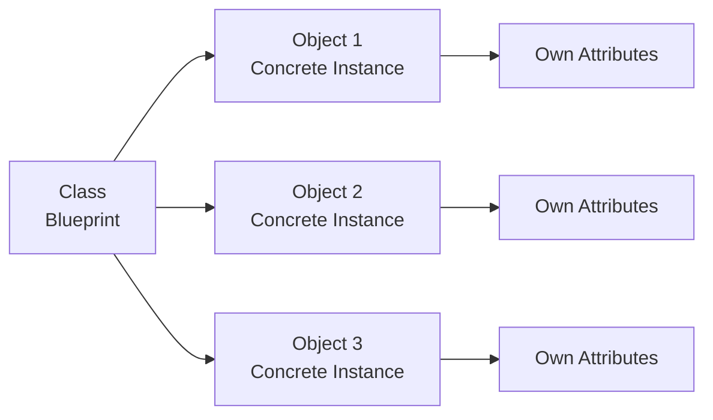
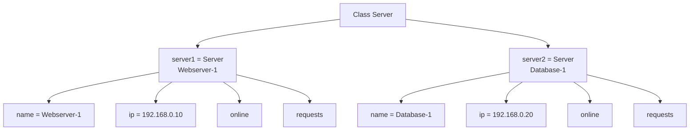

###### Topics

Classes and Objects in Python

- Understand the basic idea of classes and objects
- Define simple classes and create objects
- Learn about the role of --init--

Attributes and Methods

- Understand the difference between attributes and methods
- Access attributes and methods of an object

Practical Example

- Create a simple custom class
- Create object instances and apply methods

<br><br><br>
# 🧱 Classes and Objects in Python

When you work with **classes** and **objects** in Python, you're learning about one of the most important building blocks of object-oriented programming. This often sounds more technical at first than it really is. At its core, it’s a very simple idea:

A **class** is a **blueprint**.  
An **object** is a **concrete thing created from that blueprint**.

Python allows you to define your own classes using the `class` keyword. These classes can then have their own data and behavior. ([The Python Tutorial — Classes](https://docs.python.org/3/tutorial/classes.html))

Think of it like the real world:

- The class is the blueprint for a car.
- An object is then a specific car, for example, **your red VW**.
- Another object of the same class could be a **blue BMW**.

Both objects belong to the same class, but they can have different attributes.

<br><br><br>
## 🧠 Understanding the Basic Idea of Classes and Objects

A class describes **what an object needs to know** and **what an object can do**.

- What an object **needs to know** are its **data** or **properties**.
- What an object **can do** are its **functions** or **actions**.

In object-oriented programming, these two things are usually called:

- **Attributes** = data / properties
- **Methods** = functions that belong to the class

So, an object is not just a loose variable but a small package of:

- State
- Behavior
- Structure

This makes programs clearer because related things are cleanly organized in one place.

<br><br><br>
### 🏗️ What is a Class?

A class is a kind of template. It defines:

- what attributes an object should have
- which methods an object can use

As an example, a `Dog` class might specify:

- Every dog has a `name`
- Every dog has an `age`
- Every dog can `bark()`

The class itself is not **yet a real dog**, but just the description of one.

<br><br><br>
### 🧍 What is an Object?

An object is an **instance** of a class.  
The word **instance** simply means: a **concrete example**.

If you create two objects from the `Dog` class, they might be:

- `bella`
- `rex`

Both are dogs, i.e., instances of the `Dog` class, but each has its own values.

<br><br><br>
### 🧭 Why is this important?

Classes and objects help you write programs that are:

- more structured
- easier to extend
- simpler to understand
- represent real things or concepts well

This is especially useful in larger programs. Instead of working with many loose variables and functions, you bundle everything together logically.

<br><br><br>
## 🗺️ A Simple Picture to Imagine



So the class is the origin, and arbitrarily many objects can be created from it.

<br><br><br>
## 🛠️ Defining Simple Classes and Creating Objects

Let’s look at the smallest possible class:

```python
class Dog:
    pass
```

Here's what happens:

- With `class Dog:` you define a new class named `Dog`.
- `pass` means: intentionally there's nothing yet. But Python requires an indented block, so `pass` is just a placeholder. Using `class` to define a class is part of Python's normal syntax. ([The Python Tutorial — Classes](https://docs.python.org/3/tutorial/classes.html))

This class can now be used to create objects:

```python
class Dog:
    pass

bella = Dog()
rex = Dog()
```

Now two objects have been created:

- `bella` is an object of the `Dog` class
- `rex` is also an object of the `Dog` class

Both are separate instances. This means: changes to `bella` do not automatically affect `rex`.

<br><br><br>
### 👀 What’s the point of this empty class?

Not much, because it has neither attributes nor methods. But it already shows you the basic mechanism:

1. Define a class
2. Create an object
3. Use the object

It only becomes truly practical with attributes and methods.

<br><br><br>
## 🧱 A Class with Real Properties

Now let’s expand the example:

```python
class Dog:
    def __init__(self, name, age):
        self.name = name
        self.age = age
```

Now the class can store values directly when creating an object:

```python
bella = Dog("Bella", 3)
rex = Dog("Rex", 5)
```

Now each object has its own data:

```python
print(bella.name)   # Bella
print(rex.age)      # 5
```

That’s the crucial point:  
Although `bella` and `rex` come from the same class, they have **different values**.

<br><br><br>
# ⚙️ Learning about the Role of `__init__`

The `__init__` method is a **special method** in Python. It's used to initialize a newly created object. More precisely, `__init__` is called after an instance is created, to initialize it with starting values. ([Data model — object.__init__](https://docs.python.org/3/reference/datamodel.html#object.__init__))

Many beginners think:  
`__init__` is just “the thing that automatically gets run when you create the object.”  
For starters, that’s a good way to think of it.

<br><br><br>
## 🧠 Why do you need `__init__`?

Without `__init__`, you would often have to set attributes by hand later, for example like this:

```python
class Dog:
    pass

bella = Dog()
bella.name = "Bella"
bella.age = 3
```

This works, but is messier and more error-prone.

With `__init__` you can specify right from the start what an object should get when it's created:

```python
class Dog:
    def __init__(self, name, age):
        self.name = name
        self.age = age
```

Now it's clear: Every `Dog` should get a name and an age when being created.

That makes your code much clearer.

<br><br><br>
## 🔍 What does `self` mean?

In almost every Python class you’ll see `self`.  
At first, this is often the most confusing part.

`self` simply means:  
**"this particular object here"**

So when you write:

```python
self.name = name
```

that means:

- The object gets an attribute named `name`
- The value for that comes from the passed-in parameter `name`

The first parameter of an instance method is usually called `self` in Python. This is a convention described in the Python documentation. ([The Python Tutorial — Classes](https://docs.python.org/3/tutorial/classes.html))

Let’s look at that in detail:

```python
class Dog:
    def __init__(self, name, age):
        self.name = name
        self.age = age
```

Here, there are two different levels:

- `name` and `age` (right side of the equals sign) are the values you pass in as parameters
- `self.name` and `self.age` (left side) are the stored attributes of the object

If you then write:

```python
bella = Dog("Bella", 3)
```

then, roughly speaking:

- A new `Dog` object is created
- `self` refers to this new object
- `"Bella"` is stored in `self.name`
- `3` is stored in `self.age`

<br><br><br>
## 🧩 `__init__` is important, but not magical

It helps to think of `__init__` as the starting point of the object.  
But, technically speaking:

- `__init__` does **not** create the object itself
- `__init__` **initializes** the already created object

That’s a small but correct distinction. The actual object creation in Python is tied to the object model, while `__init__` takes care of initialization. ([Data model — object.__init__](https://docs.python.org/3/reference/datamodel.html#object.__init__))

For your everyday work as a beginner, what matters most is:  
If you want to set starting values, `__init__` is almost always the right place.

<br><br><br>
# 🧩 Attributes and Methods

Once you understand classes, you need to distinguish between two concepts:

- **Attributes**
- **Methods**

This is absolutely central because almost every class consists of exactly these two building blocks.

<br><br><br>
## 📌 Understanding the Difference Between Attributes and Methods

An **attribute** stores data.  
A **method** defines behavior.

Or more simply:

- Attributes say **what an object has**
- Methods say **what an object can do**

<br><br><br>
### 📦 Attributes

Attributes are values belonging to an object.

Examples:

- Name
- Age
- Color
- Price
- Status
- IP address

If you have a class called `Server`, possible attributes might be:

- `name`
- `ip_address`
- `online`

These attributes describe the state of the object.

<br><br><br>
### 🛠️ Methods

Methods are functions defined inside a class. Methods logically belong to the object or the class. This is described in the Python tutorial in the context of classes and methods. ([The Python Tutorial — Classes](https://docs.python.org/3/tutorial/classes.html))

Examples of methods might be:

- `start()`
- `stop()`
- `show_status()`

Methods make it possible for an object to do something.

<br><br><br>
### 📊 Attribute vs. Method — Direct Comparison

| Term     | Meaning                | Example            | Access            |
|----------|------------------------|--------------------|-------------------|
| Attribute| Stored property        | `name`, `age`, `online` | `object.name`    |
| Method   | Object function        | `bark()`, `start()` | `object.start()` |

The most visible difference is often:

- **Attributes** are usually accessed **without parentheses**
- **Methods** are called with **parentheses**

Example:

```python
print(server.name)       # Attribute
server.start()           # Method
```

<br><br><br>
## 🧪 A Small Example with Attributes and Methods

```python
class Lamp:
    def __init__(self, color):
        self.color = color
        self.is_on = False

    def turn_on(self):
        self.is_on = True

    def turn_off(self):
        self.is_on = False
```

The structure is clear:

**Attributes:**

- `color`
- `is_on`

**Methods:**

- `turn_on()`
- `turn_off()`

The attributes store the state of the lamp.  
The methods change this state.

<br><br><br>
## 👉 Accessing Attributes and Methods of an Object

In Python, you use **dot notation** to access attributes and methods. Attribute access such as `object.name` and method calls using an object are basic parts of the class model in Python. ([The Python Tutorial — Classes](https://docs.python.org/3/tutorial/classes.html))

It looks like this:

```python
object.attribute
object.method()
```

Let’s look at an example with the lamp:

```python
lamp1 = Lamp("blue")
```

Now you can access its data:

```python
print(lamp1.color)   # blue
print(lamp1.is_on)   # False
```

And you can call methods:

```python
lamp1.turn_on()
print(lamp1.is_on)   # True

lamp1.turn_off()
print(lamp1.is_on)   # False
```

<br><br><br>
### 👓 What happens when you call a method?

When you write:

```python
lamp1.turn_on()
```

the class’s method is internally executed with the object `lamp1` as `self`. This is exactly why a normal instance method in Python must have `self` as its first parameter. This principle is standard for methods in Python classes. ([The Python Tutorial — Classes](https://docs.python.org/3/tutorial/classes.html))

That’s why this method works:

```python
def turn_on(self):
    self.is_on = True
```

`self` refers at that moment to `lamp1`.

<br><br><br>
### ⚠️ Common Beginner Confusion

Many people confuse these two things:

```python
lamp1.color
lamp1.turn_on()
```

The difference is important:

- `lamp1.color` reads a stored value
- `lamp1.turn_on()` performs an action

If you accidentally add parentheses to an attribute, or forget them for a method, that quickly leads to mistakes or misunderstandings.

<br><br><br>
# 💻 Practical Example: Creating a Simple Custom Class

So that all this isn’t just theoretical, let's now build a small but realistic class from the tech world: a **Server**.

This fits well with Core Tech Fundamentals because here you are modeling a technical system as an object.

In our example, a server should:

- have a name
- have an IP address
- know whether it’s online
- be able to be started and stopped
- be able to count requests

<br><br><br>
## 🏗️ Defining the `Server` Class

```python
class Server:
    def __init__(self, name, ip_address):
        self.name = name
        self.ip_address = ip_address
        self.online = False
        self.requests = 0

    def start(self):
        self.online = True
        print(f"{self.name} has started.")

    def stop(self):
        self.online = False
        print(f"{self.name} has stopped.")

    def process_request(self):
        if self.online:
            self.requests += 1
            print(f"{self.name} is processing a request. Total: {self.requests}")
        else:
            print(f"{self.name} is offline and cannot process requests.")

    def show_status(self):
        print(f"Name: {self.name}")
        print(f"IP Address: {self.ip_address}")
        print(f"Online: {self.online}")
        print(f"Processed Requests: {self.requests}")
```

<br><br><br>
## 🔍 Explaining the Class Step by Step

<br><br><br>
### 🧱 `__init__` and the Start Values

```python
def __init__(self, name, ip_address):
    self.name = name
    self.ip_address = ip_address
    self.online = False
    self.requests = 0
```

When a new `Server` object is created, it immediately gets:

- a `name`
- an `ip_address`

We also set two initial values:

- `online = False`  
  The server is initially turned off.
- `requests = 0`  
  No requests have been processed yet.

These values are **attributes** of each object.

<br><br><br>
### ▶️ The `start` Method

```python
def start(self):
    self.online = True
    print(f"{self.name} has started.")
```

This method changes the state of the object:

- Before: `online = False`
- After:  `online = True`

It’s a classic example of a method:  
It works with the object's data and changes them.

<br><br><br>
### ⏹️ The `stop` Method

```python
def stop(self):
    self.online = False
    print(f"{self.name} has stopped.")
```

Here, the server is set offline again.

This is also behavior, so it's a method.

<br><br><br>
### 📈 The `process_request` Method

```python
def process_request(self):
    if self.online:
        self.requests += 1
        print(f"{self.name} is processing a request. Total: {self.requests}")
    else:
        print(f"{self.name} is offline and cannot process requests.")
```

This method clearly shows why methods are useful:

- It reads attributes (`self.online`)
- It modifies attributes (`self.requests += 1`)
- It performs logic (the `if` statement)

This means: An object doesn’t just store data, but can also use them meaningfully.

<br><br><br>
### 📋 The `show_status` Method

```python
def show_status(self):
    print(f"Name: {self.name}")
    print(f"IP Address: {self.ip_address}")
    print(f"Online: {self.online}")
    print(f"Processed Requests: {self.requests}")
```

This method summarizes the stored information of the object and outputs it.

<br><br><br>
## 🧪 Creating Object Instances and Applying Methods

Now let's create two different servers:

```python
server1 = Server("Webserver-1", "192.168.0.10")
server2 = Server("Database-1", "192.168.0.20")
```

Here, two **object instances** were created.  
Both belong to the `Server` class, but both have their own values.

Now let's apply methods:

```python
server1.show_status()
server1.start()
server1.process_request()
server1.process_request()
server1.show_status()

print("---")

server2.show_status()
server2.process_request()
server2.start()
server2.process_request()
server2.show_status()
```

A possible output might be:

```python
Name: Webserver-1
IP Address: 192.168.0.10
Online: False
Processed Requests: 0
Webserver-1 has started.
Webserver-1 is processing a request. Total: 1
Webserver-1 is processing a request. Total: 2
Name: Webserver-1
IP Address: 192.168.0.10
Online: True
Processed Requests: 2
---
Name: Database-1
IP Address: 192.168.0.20
Online: False
Processed Requests: 0
Database-1 is offline and cannot process requests.
Database-1 has started.
Database-1 is processing a request. Total: 1
Name: Database-1
IP Address: 192.168.0.20
Online: True
Processed Requests: 1
```

<br><br><br>
## 🧠 What you can see from this example technically

This example shows you several central ideas at once:

1. **A class describes a structure**  
   The `Server` class defines what data and what behavior every server should have.

2. **Each instance has its own values**  
   `server1` and `server2` are separate objects.  
   If `server1.requests` increases, it has no effect on `server2.requests`.

3. **Methods work with attributes**  
   `start()` sets `online` to `True`,  
   `process_request()` checks `online` and increments `requests`.

4. **`self` connects everything**  
   With `self`, Python knows which specific object it is currently working with.

<br><br><br>
## 🗺️ Visualization of the Practical Example



This diagram shows again:  
Both objects come from the same class, but store their **own states**.

<br><br><br>
## 🧵 A Second, Even Simpler Example to Reinforce the Concept

If the server example still seems a bit technical, here’s the same idea with an even simpler class:

```python
class Book:
    def __init__(self, title, author):
        self.title = title
        self.author = author
        self.checked_out = False

    def check_out(self):
        if not self.checked_out:
            self.checked_out = True
            print(f'"{self.title}" has been checked out.')
        else:
            print(f'"{self.title}" is already checked out.')

    def return_book(self):
        self.checked_out = False
        print(f'"{self.title}" has been returned.')
```

Creating objects:

```python
book1 = Book("Learn Python", "Max Mustermann")
book2 = Book("Understanding Networks", "Erika Example")
```

Accessing attributes:

```python
print(book1.title)
print(book1.checked_out)
```

Applying methods:

```python
book1.check_out()
book1.return_book()
```

Here, too:

- `title`, `author`, and `checked_out` are **attributes**
- `check_out()` and `return_book()` are **methods**

<br><br><br>
## 🔬 A Technically Clean Perspective on the Mindset

If you really want to understand classes and objects, this thinking framework helps:

- A **class** describes a model.
- An **object** is a concrete realization of that model.
- **Attributes** store state.
- **Methods** encapsulate behavior.
- `__init__` gives the object a meaningful initial form.
- `self` ensures that an object can access its own data.

That’s precisely why object-oriented programming is so useful:  
Data and behavior that belong together are organized together in code.

It’s not just “a Python technique”, but a way of thinking that lets you model software cleanly. Python's class syntax, attribute access, and method calls are made exactly for this kind of structure. ([The Python Tutorial — Classes](https://docs.python.org/3/tutorial/classes.html))