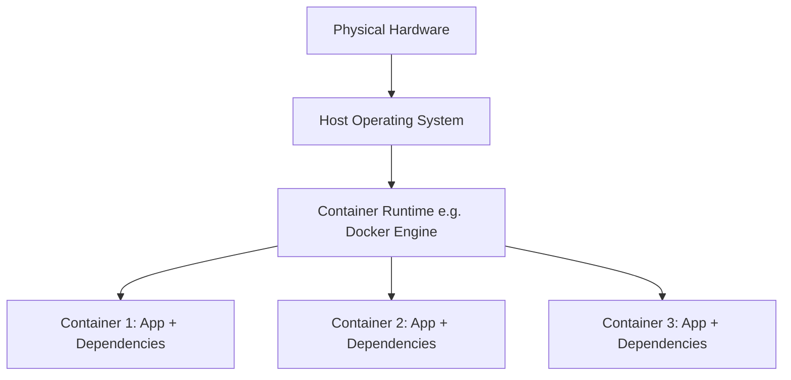
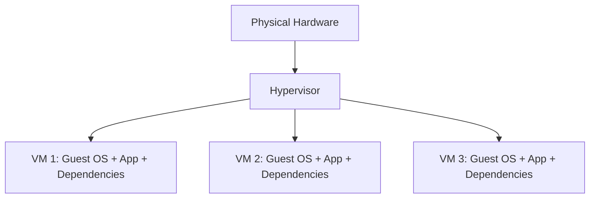
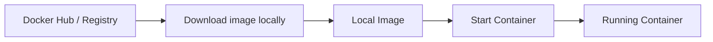
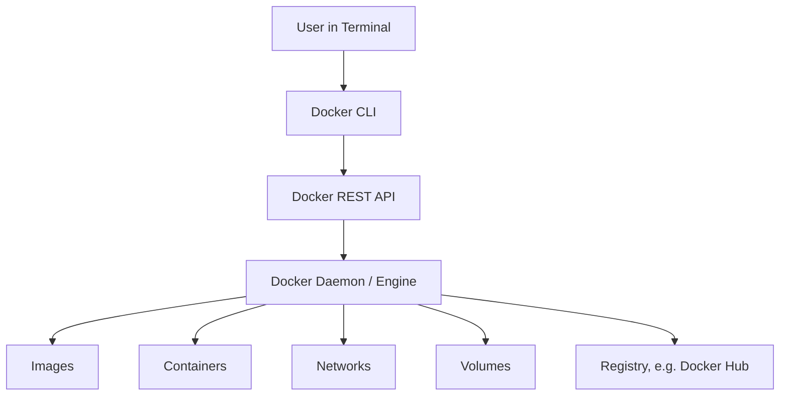

###### Topics

Introduction to Containerization

- Understand the basic idea of containers
- Learn the difference between containers and virtual machines
- Classify the advantages of containers in day-to-day development
- Learn about typical use cases for containers

Docker Installation and Setup

- Install Docker
- Verify successful installation with simple commands

Docker Basics

- Understand images, containers, and Docker Hub at a basic level
- Get an overview of the structure and purpose of Docker

<br><br><br>
# 📦 Introduction to Containerization

Containerization is a method of **packaging software so that it runs as identically as possible anywhere**. A container typically includes:

- the application itself
- its runtime environment
- necessary libraries
- configuration files
- often dependencies like specific tools or packages

The core idea is: **Don’t just ship the code, but also the matching environment.** That’s exactly why containers are so popular in software development. Docker describes containers as standardized units of software that package code and dependencies together, allowing applications to run quickly and reliably in different environments ([Docker Overview](https://docs.docker.com/get-started/docker-overview/)).

A key point here is: A container is **lighter** than a full virtual machine. It usually **does not bring along its own full operating system**, but uses the kernel of the host system. As a result, containers typically start very quickly and consume significantly fewer resources than classic VMs ([Docker Overview](https://docs.docker.com/get-started/docker-overview/)).

If you want to remember containers, this image helps:

> **A container is like a portable, standardized runtime box for an application.**

Such a box can be built locally on your laptop, started in a test environment, and later run almost identically on a server or in the cloud. This reduces the famous sentence: **"But it works on my machine!"**

<br><br><br>
## 🧠 The basic idea of containers explained simply

Imagine you’re developing a web application in Python or Node.js. Everything works perfectly locally. Suddenly, errors arise on the server because:

- a different version is installed
- a package is missing
- environment variables are set differently
- system libraries do not match

Containers solve exactly this problem by creating a **defined, reproducible environment**. Instead of just passing on the source code, you build a so-called **image**—a kind of blueprint or template. From this image, containers can then be started.

It’s important to note: A container is **not a magical mini-computer**, but rather an isolated process on the host system. In the Linux context, this isolation is mainly provided by kernel mechanisms like **namespaces** and **control groups (cgroups)**. Namespaces separate things like processes, network, or the file system, cgroups help limit resources like CPU and RAM ([Docker Engine Security](https://docs.docker.com/engine/security/), [Red Hat: A practical introduction to Linux namespaces](https://www.redhat.com/en/blog/intro-to-linux-namespaces)).

In practice, this means:

- Processes inside the container often see only “their own world”
- The container receives its own file system environment
- Network can be set up in an isolated way
- Resources can be controlled

It is exactly this combination of **portability, isolation, and reproducibility** that makes containers so useful.

<br><br><br>
## ⚖️ Difference between Containers and Virtual Machines

Containers and virtual machines solve similar problems, but do so in different ways.

A **virtual machine (VM)** typically virtualizes the entire hardware layer. A full guest operating system then runs on top of this. A hypervisor manages these virtual machines. Microsoft describes the difference as: containers share the kernel of the host operating system, whereas virtual machines each bring their own full OS ([Containers vs. virtual machines](https://learn.microsoft.com/en-us/virtualization/windowscontainers/about/containers-vs-vm)).

A **container** does not virtualize the entire hardware, but rather the execution environment at the operating system level. As a result, it is smaller and ready to start more quickly.

### 📊 Comparison Table

| Characteristic       | Container                    | Virtual Machine                 |
|---------------------|------------------------------|---------------------------------|
| Isolation           | Process/OS level             | Hardware/Hypervisor level       |
| Operating System    | Typically uses host kernel   | Own full guest OS               |
| Startup Time        | Usually seconds or less      | Often much longer               |
| Resource Usage      | Low                          | Higher                          |
| Portability         | Very high on matching platform| Also possible, but heavier      |
| Typical Use         | App deployment, microservices, dev/test | Complete system isolation, legacy systems |

### 🖼️ Visual Representation





### 🔍 What is the practical difference?

If you just want to run an application cleanly and portably, containers are often ideal. But if you need a **fully separate system environment with its own kernel and full OS isolation**, a VM is often the better choice.

So you should not think:

> Containers always replace virtual machines.

Rather, it is correct to say:

> Containers and VMs are different tools for different requirements.

In modern systems, both are often combined. For example, containers in the cloud often run **inside virtual machines**, because that way you get both: good utilization through containers and additional isolation through VMs.

<br><br><br>
## 🚀 Advantages of Containers in Day-to-Day Development

Containers are not just an “Ops topic” or something for large cloud platforms. Especially in the daily life of developers, they bring very concrete advantages.

### 🔁 Reproducible Environments

If everyone on the team uses the same container or image, the development environment is much more consistent. This greatly helps with onboarding, troubleshooting, and testing. Docker emphasizes portability and consistency as key advantages ([Docker Overview](https://docs.docker.com/get-started/docker-overview/)).

Instead of writing a long setup guide like:

- install version X of language Y
- enable package Z
- change this system variable
- start this service separately

you can often simply say:

> Start the container.

This saves time and reduces configuration errors.

### ⚡ Fast Startup Times

Since containers do not need to boot a full operating system, they typically start very quickly. This is especially useful for:

- local testing
- CI/CD pipelines
- temporary development environments
- scaling in production systems

### 🧩 Clean Separation of Services

Containers encourage thinking in terms of clearly separated services. For example, you can:

- run the web app in one container
- the database in another container
- a reverse proxy in yet another container

This keeps the architecture cleaner and makes changes easier to trace.

### 🔄 Easier Sharing and Deployment

An image can be uploaded to a registry and later downloaded onto another computer or server. This creates a clear transition from development to testing and production. Docker Hub is a well-known example of a public registry ([Docker Hub Quickstart](https://docs.docker.com/docker-hub/quickstart/)).

### 🧪 Improved Testability

Tests become more reliable when running in a defined environment. Integration tests particularly benefit from the ability to provide required services like databases or message queues in containers.

### 🧹 Less “System Clutter”

If you need many projects locally with different versions of Node.js, Python, Java, PostgreSQL, or Redis, your computer quickly becomes messy. Containers help encapsulate dependencies per project instead of installing everything globally.

### 🧠 Learning Hint: How You Should Classify Containers Mentally

A typical beginner’s mistake is to see containers only as an “installation shortcut”. That’s too simplistic.

A better perspective is:

- Containers are **standardized runtime environments**
- Images are **portable blueprints**
- Containers make systems **reproducible**
- Docker is **a tool**, not the concept itself

This distinction matters, as otherwise you may confuse Docker with containerization later on.

<br><br><br>
## 🏗️ Typical Use Cases for Containers

Containers are the standard in many areas today. You should know the typical use cases so you understand **why** they are used.

### 🌐 Web Applications

Web applications are frequently containerized. For example:

- frontend in one container
- backend in another container
- database in a container
- Nginx or Traefik as reverse proxy in a container

This is particularly useful in development, testing, and cloud deployment.

### 🧪 Development and Testing Environments

Containers are ideal for quickly creating consistent environments for a project. When a new team member joins, they can often start the environment locally in a short time instead of setting everything up manually.

### 🔄 Continuous Integration and Continuous Deployment

Build and test jobs in CI/CD systems often run in containers, ensuring they are executed in a clearly defined environment. Docker highlights containers as a good fit for modern build, test, and deployment processes ([Docker Overview](https://docs.docker.com/get-started/docker-overview/)).

### 🧩 Microservices

Containers are a great fit for microservice architectures. Each service can have its own image and container. This makes it easier to:

- develop independently
- scale separately
- have clearer responsibilities
- deploy in isolation

### ☁️ Cloud and Platform Operations

Many cloud-native platforms are heavily based on containers. Kubernetes, Amazon ECS or Azure Container Apps are built on the principle of automatically operating containerized applications. Kubernetes itself describes containers as lightweight and portable units for modern applications ([Kubernetes Documentation: Containers](https://kubernetes.io/docs/concepts/containers/)).

### 🗃️ Temporary Tools and Utility Services

Tools can also be conveniently started as containers, for example:

- database clients
- build tools
- scanners
- test servers
- admin tools

That way, you don’t have to install such tools locally on a permanent basis.

<br><br><br>
# 🐳 Docker: Installation and Setup

Docker is one of the best-known tools for practical work with containers. However, it’s important: **containerization is the concept, Docker is a specific tool for it**. Docker provides a set of tools for building images, starting containers, and using registries such as Docker Hub ([Docker Overview](https://docs.docker.com/get-started/docker-overview/)).

Installation steps differ depending on your operating system.

<br><br><br>
## 💻 Installing Docker

### 🪟 Installation on Windows

For most users on Windows, **Docker Desktop** is the usual route. Docker provides its own installation guide for this ([Install Docker Desktop on Windows](https://docs.docker.com/desktop/setup/install/windows-install/)).

Key points:

- Download Docker Desktop from the official Docker website.
- For many setups, **WSL 2** is recommended or required, as Docker can run efficiently on it ([Install Docker Desktop on Windows](https://docs.docker.com/desktop/setup/install/windows-install/)).
- After installation, you can optionally sign in with a Docker account, though this isn’t always required for local use.

On Windows, it’s important to understand: Docker containers are often based on Linux technologies. So, under the hood, Docker often uses a Linux-based runtime environment.

### 🍎 Installation on macOS

**Docker Desktop** is also the standard on macOS. The official instructions differ slightly depending on whether you have an Intel Mac or Apple Silicon ([Install Docker Desktop on Mac](https://docs.docker.com/desktop/setup/install/mac-install/)).

Pay attention to:

- getting the correct download version for your Mac
- granting the required system permissions
- successfully starting the Docker Desktop app

### 🐧 Installation on Linux

On Linux, you can use either Docker Desktop or install the **Docker Engine** directly. In many learning and server scenarios, the Docker Engine is the classic way. Docker offers distribution-specific guides, for example for Ubuntu ([Install Docker Engine on Ubuntu](https://docs.docker.com/engine/install/ubuntu/)).

Typical steps on Ubuntu:

1. Prepare package sources
2. Add the Docker repository
3. Install Docker Engine
4. Start the service
5. Test the installation

On Linux, note: To use Docker without `sudo`, users often add themselves to the `docker` group. Docker documents this step in the post-installation steps ([Linux post-installation steps for Docker Engine](https://docs.docker.com/engine/install/linux-postinstall/)).

### ⚠️ Important Security Note

The `docker` group has wide-reaching privileges on many Linux systems. Docker itself notes that the group can mean root-like privileges ([Docker Daemon Attack Surface](https://docs.docker.com/engine/security/#docker-daemon-attack-surface)). This is important so you don’t assign permissions thoughtlessly.

<br><br><br>
## ✅ Verify Successful Installation with Simple Commands

After installation, you shouldn’t just hope everything works. Test the installation consciously and systematically.

### 🔎 1. Display Docker Version

```bash
docker --version
```

This checks whether the Docker client is basically available.

You’ll often see output like:

```bash
Docker version 26.x.x, build ...
```

This tells you: the command was found and Docker is installed.

### 🔎 2. Fetch Detailed Information

```bash
docker info
```

This command shows more details, such as:

- client information
- server information
- number of images and containers
- storage driver
- runtime details

If you see meaningful information here, the Docker engine is usually working correctly.

### 🔎 3. Start a Test Container

```bash
docker run hello-world
```

This is the classic first test. Docker itself describes this as a simple way to check the installation ([Docker Hello-World](https://docs.docker.com/get-started/introduction/get-docker-desktop/)).

What basically happens?

1. Docker looks locally for the `hello-world` image
2. If it’s not present, it’s downloaded from a registry
3. A container is started from it
4. The container outputs a test message and exits

If this works, it’s a strong sign that:

- Docker can load images
- Containers can be created
- The runtime works

### 🧭 Typical Control Commands

```bash
docker images
docker ps
docker ps -a
```

- `docker images` shows local images
- `docker ps` shows running containers
- `docker ps -a` also shows terminated containers

Especially after `docker run hello-world`, `docker ps -a` is useful because the test container stops immediately.

### 📌 How to Understand the Commands Conceptually

It’s not enough to simply “memorize” the commands. More important is the mental model:

- `docker run` = start a container from an image
- `docker ps` = view containers
- `docker images` = view available blueprints

If you understand this model clearly, you’ll find it much easier to learn Docker later.

<br><br><br>
# 🧱 Docker Basics

Docker consists of more than just a single command—it’s made up of several components that work together. For beginners, these terms are especially central:

- **Image**
- **Container**
- **Registry / Docker Hub**
- **Docker Engine**
- **Docker CLI**

If you mix up these terms, Docker quickly gets confusing. If you keep them straight, much suddenly becomes logical.

<br><br><br>
## 🖼️ Understanding Images, Containers, and Docker Hub at a Basic Level

### 🧾 What is an Image?

An **image** is a read-only template from which containers are created. Docker describes images as read-only templates with instructions for creating a container ([Docker Overview](https://docs.docker.com/get-started/docker-overview/)).

An image typically contains:

- a base environment, e.g., `ubuntu` or `node`
- installed packages
- application code
- configuration
- startup command

So an image is not “the running application,” but rather the **blueprint** or **frozen template**.

You can think of an image as a prepared file system plus metadata.

### ▶️ What is a Container?

A **container** is a running or startable instance of an image. Docker puts it as follows: a container is a runnable instance of an image ([Docker Overview](https://docs.docker.com/get-started/docker-overview/)).

Key property:

- An image is the template
- A container is the concrete execution of this template

This is a crucial difference.

### 🍪 A Simple Everyday Analogy

You can remember it like this:

- **Image** = baking pan + recipe + prepared dough
- **Container** = the actual baked cake on the table

Or more technically:

- **Image** = snapshot/blueprint
- **Container** = running process based on this blueprint

### 🌍 What is Docker Hub?

**Docker Hub** is a public registry from Docker—a place where images can be stored and distributed. Docker describes Docker Hub as a service for finding and sharing container images ([Docker Hub Quickstart](https://docs.docker.com/docker-hub/quickstart/)).

There you can find:

- official base images
- community images
- company-provided images
- your own private or public repositories

For example, if you run `docker run nginx` and don’t have the image locally, Docker will typically try to download it from a registry like Docker Hub.

### 🔁 Interaction of Image, Container, Docker Hub



### 🧠 Typical Beginner Mistake

Many people say things like at first:

> “I started a Docker.”

A more accurate phrase would be:

> “I started a container.”

Or:

> “I built an image.”

This accuracy may sound minor, but it’s extremely helpful technically. Those who use the terms correctly usually grasp the technology much faster.

<br><br><br>
## ⚙️ Overview of Docker Structure and Purpose

Docker is fundamentally made up of several parts, each with different tasks.

### 🖥️ Docker CLI

The **Docker CLI** is the command-line tool—the part you use in the terminal, for example:

```bash
docker run
docker build
docker ps
docker pull
```

The CLI is the layer you interact with directly as a user.

### 🏭 Docker Engine

The **Docker Engine** is the actual runtime component. It builds and manages images, containers, networks, and volumes. Docker describes the Engine as a client-server application with a daemon, a REST API, and the CLI ([Docker Engine overview](https://docs.docker.com/engine/)).

### 🔌 Docker Daemon

The **daemon** is the background service that does the actual work. When you enter a Docker command, the CLI talks to the Docker Daemon, which carries out the action.

### 🗂️ Registry

A **registry** is a storage location for images. Docker Hub is the best-known registry, but not the only one. Companies often use private registries too.

### 💾 Volumes and Networks

Even if you won’t use them intensively right away, you should already know them:

- **Volumes** store data persistently outside the ephemeral container file system ([Docker Volumes](https://docs.docker.com/engine/storage/volumes/))
- **Networks** connect containers with each other or the outside world ([Networking overview](https://docs.docker.com/engine/network/))

### 🧱 Architecture as a Diagram



### 🎯 What is Docker’s Main Purpose?

Docker’s purpose is not simply to “start containers.” Its primary purpose is to make the entire lifecycle of containerized applications manageable:

- Build images
- Version images
- Distribute images
- Start and stop containers
- Manage data and networks
- Roll out applications reproducibly

Thus, Docker is fundamentally a **tool for standardizing build, shipping, and runtime processes** around containers.

That also explains why Docker is so strongly associated with topics like DevOps, CI/CD, microservices, and cloud in software development.

<br><br><br>
## 🧭 A Clean Mental Model for Getting Started

If you truly want to understand containerization and Docker, remember this sequence:

### 1️⃣ Understand the Problem First

The core problem is:

- differing environments
- hard-to-reproduce setups
- complicated dependencies
- inconsistent deployments

### 2️⃣ Then Understand the Concept

The concept is:

- packaging applications as standardized, isolated units
- using the same units in different environments

### 3️⃣ Then Understand the Tool

Docker is a tool that makes this concept practical.

### 4️⃣ Then Learn Commands

Many people learn Docker the wrong way:

- memorize 20 commands first
- then somehow use `docker run`
- then confusion later

Better is:

- understand the problem
- keep terminology precise
- get a basic grasp of the architecture
- then learn the commands

That way, you learn sustainably instead of superficially.

Especially for core tech fundamentals, this is critical: You want to know not just **which command** works, but **why** the system is built this way.

<br><br><br>
## 🧪 A First Mini Workflow for Understanding

So the terms don’t remain abstract, here’s a simple workflow:

```bash
docker run nginx
```

What basically happens?

1. Docker checks if the `nginx` image is available locally.
2. If not, it’s downloaded from a registry, usually Docker Hub.
3. Docker creates a container from the image.
4. The container starts the defined main process.
5. As long as that process is running, the container is considered running.

From this, you can clearly see the basic logic:

- **Registry** supplies images
- **Image** is the blueprint
- **Container** is the instance
- **Docker Engine** runs everything

This exact model shows up again later—even with more complex topics like Dockerfiles, Compose, or Kubernetes.

<br><br><br>
## 📘 Why This Topic is So Important

Containerization is a foundational building block of modern software development today. Even if you don’t type Docker commands daily later on, you’ll encounter the topic almost everywhere:

- in development environments
- in deployment pipelines
- in cloud platforms
- with microservices
- in platform and infrastructure teams

That’s why it’s worth learning these basics thoroughly—not just as a collection of terminal commands, but as a technical model for **how software can be operated portably, consistently, and efficiently**.