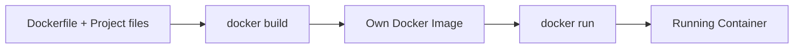
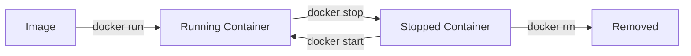
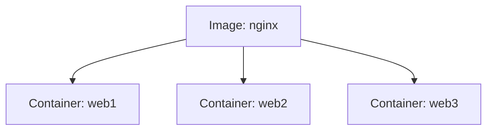

###### Topics

Working with Docker

- Basic usage of Docker via the command line
- Displaying existing images and containers

Working with Docker Images

- Downloading and using images from Docker Hub
- Basic understanding of the purpose of a Dockerfile
- Getting to know a simple Dockerfile

Container Management

- Starting, stopping, and removing containers
- Inspecting a running container and executing simple commands
- Solidifying the difference between an image and a running container

<br><br><br>

# 🐳 Working with Docker

At first glance, Docker often seems like "yet another tool with lots of commands." In reality, however, the core idea is quite clear: you have **images** as a template and **containers** as a running instance of that template. This mental model is the key to ensuring the command line doesn't feel like memorized magic.

A **Docker image** is an immutable template from which containers are created. A **container** is the actual process started, with its own isolated runtime environment ([Images](https://docs.docker.com/get-started/docker-concepts/the-basics/what-is-an-image/)) ([Containers](https://docs.docker.com/get-started/docker-concepts/the-basics/what-is-a-container/)).

To really learn Docker cleanly, this mindset is helpful:

- **Image = blueprint**
- **Container = started instance**
- **Dockerfile = recipe to create an image**
- **Docker Hub = the place where you can fetch ready-made images**

A good learning strategy with Docker is: **first understand the model, then learn the commands**. If you immediately start by memorizing commands, you will almost always end up confusing image, container, and Dockerfile.

<br><br><br>

## 🧭 Basic Usage of Docker via the Command Line

The Docker command line is structured quite logically. Many commands follow this pattern:

```bash
docker <object> <action>
```

Typical objects include:

- `image`
- `container`
- `volume`
- `network`

For beginners, however, **image** and **container** are especially important.

A few typical examples:

```bash
docker image ls
docker container ls
docker container stop my-container
docker image pull nginx
```

You can think of Docker as a mini-language:

- **What** do you want to target? → `image`, `container`
- **What** do you want to do with it? → `ls`, `pull`, `run`, `stop`, `rm`

This is much easier to learn than an unsorted list of single commands.

If you want to check if Docker is installed correctly, use these commands:

```bash
docker --version
docker info
docker help
```

`docker --version` shows you the installed version.  
`docker info` gives you technical info about your Docker environment.  
`docker help` shows you the general help page with available subcommands ([docker](https://docs.docker.com/reference/cli/docker/)).

<br><br><br>

### 🔤 How You Should Read Docker Commands

Let's take this command:

```bash
docker container ls
```

You can almost read it like a sentence:

- `docker` → addressing Docker
- `container` → working with containers
- `ls` → wanting to see a list

Similarly:

```bash
docker image pull nginx
```

This means:

- `docker` → Docker
- `image` → I'm working with images
- `pull` → I want to download something
- `nginx` → specifically the image `nginx`

If you get used to this way of reading, Docker will make much more sense.

<br><br><br>

### 🛠️ Very Important Basic Commands for Getting Started

| Command | Meaning |
|---|---|
| `docker --version` | Shows Docker version |
| `docker help` | Displays help for Docker |
| `docker image ls` | Shows local images |
| `docker container ls` | Lists running containers |
| `docker container ls -a` | Also shows stopped containers |
| `docker image pull <name>` | Downloads an image |
| `docker container run <image>` | Creates and starts a container |
| `docker container stop <name>` | Stops a container |
| `docker container start <name>` | Starts a stopped container |
| `docker container rm <name>` | Removes a container |

One important point: In many tutorials you'll still find short forms like `docker ps` or `docker images`. These still work, but the more modern and clearer forms are `docker container ls` and `docker image ls` ([docker container ls](https://docs.docker.com/reference/cli/docker/container/ls/)) ([docker image ls](https://docs.docker.com/reference/cli/docker/image/ls/)).

<br><br><br>

## 👀 Displaying Existing Images and Containers

Before you can sensibly manage containers, you always need to know: **What is already present locally?** and **What is currently running?**

For local images, use:

```bash
docker image ls
```

This command lists the images stored on your system ([docker image ls](https://docs.docker.com/reference/cli/docker/image/ls/)).

A typical output includes columns such as:

- `REPOSITORY`
- `TAG`
- `IMAGE ID`
- `CREATED`
- `SIZE`

Example:

```bash
REPOSITORY   TAG       IMAGE ID       CREATED         SIZE
nginx        latest    abc123def456   2 weeks ago     192MB
alpine       latest    fed456abc789   3 weeks ago     7MB
```

This means:

- **REPOSITORY**: Name of the image, e.g. `nginx`
- **TAG**: Version or variant, e.g. `latest`
- **IMAGE ID**: internal identifier
- **SIZE**: Size of the image

For running containers, use:

```bash
docker container ls
```

This shows you only the containers that are actually running right now ([docker container ls](https://docs.docker.com/reference/cli/docker/container/ls/)).

If you want to see **also stopped containers**, use:

```bash
docker container ls -a
```

The `-a` stands for "all."

<br><br><br>

### 📦 The Practical Difference between `image ls` and `container ls`

Many beginners confuse these two lists. That's totally normal.

| Question | Appropriate Command |
|---|---|
| What templates do I have saved locally? | `docker image ls` |
| Which containers are running right now? | `docker container ls` |
| Which containers exist in total, including stopped ones? | `docker container ls -a` |

An example clarifies it:

- You download the image `nginx`.
- Afterwards, `nginx` appears in `docker image ls`.
- Only once you start a container from it, something appears in `docker container ls`.

An image alone doesn't "run." It's just the foundation.

<br><br><br>

### 🔎 Example: What Do I See and When?

Assume you run these commands in sequence:

```bash
docker image pull nginx
docker container run --name webserver -d nginx
```

Then:

- `docker image ls` shows you `nginx`
- `docker container ls` shows you `webserver`
- `docker container ls -a` also shows you `webserver`

If you stop the container:

```bash
docker container stop webserver
```

Then:

- `docker image ls` still shows `nginx`
- `docker container ls` **no longer** shows `webserver`
- `docker container ls -a` **still** shows `webserver`, but as stopped

It's at this exact point that many people first clearly understand the difference between **template** and **instance**.

<br><br><br>

# 🖼️ Working with Docker Images

A Docker image is the heart of working with Docker. It contains everything an application needs to start: for example, a filesystem, libraries, runtimes, and standard commands ([Images](https://docs.docker.com/get-started/docker-concepts/the-basics/what-is-an-image/)).

Important: An image is **not the app in action**, but the prepared foundation for it.

<br><br><br>

## ⬇️ Downloading and Using Images from Docker Hub

If you want to use a pre-built image, you typically download it with `docker image pull`:

```bash
docker image pull nginx
```

This downloads the `nginx` image from a registry. This command is the standard way to make images available locally ([docker image pull](https://docs.docker.com/reference/cli/docker/image/pull/)).

You can then check whether the image has arrived:

```bash
docker image ls
```

If you then actually want to use the image, you start a container from it:

```bash
docker container run nginx
```

The command `docker container run` creates a new container from an image and starts it ([docker container run](https://docs.docker.com/reference/cli/docker/container/run/)).

In practice, you often use additional options:

```bash
docker container run --name webserver -d -p 8080:80 nginx
```

These options are extremely important:

- `--name webserver` → gives the container a memorable name
- `-d` → starts the container in the background ("detached mode")
- `-p 8080:80` → maps port 8080 on your computer to port 80 in the container

Especially `-p` is important if you want to test web applications or APIs.

So, if you start an Nginx web server, it's usually accessible at `http://localhost:8080` afterwards, because port 8080 on your computer is forwarded to port 80 in the container ([Publishing and exposing ports](https://docs.docker.com/get-started/docker-concepts/running-containers/publishing-ports/)).

<br><br><br>

### 🏷️ What Tags Like `latest` Mean

Often you'll see images in this form:

```bash
nginx:latest
python:3.12
node:20-alpine
```

The part after the colon is the **tag**. It usually indicates a version or variant.

Examples:

- `nginx:latest` → the currently marked default version
- `python:3.12` → Python 3.12
- `node:20-alpine` → Node.js 20 based on a small Alpine image

A very important learning point: **`latest` does not automatically mean "latest technically existing version," but only the tag `latest`**. For reproducible work, it's often better to use specific versions, e.g. `python:3.12` instead of just `python:latest` ([docker image pull](https://docs.docker.com/reference/cli/docker/image/pull/)).

<br><br><br>

### 🌐 Typical Workflow When Using a Pre-Built Image

This is what it usually looks like:

```bash
docker image pull nginx
docker container run --name webserver -d -p 8080:80 nginx
docker container ls
```

This is a very good minimal workflow for didactic purposes:

1. **Fetch the image**
2. **Start a container from it**
3. **Check that it is running**

If you really want to learn, you should internalize this sequence. Otherwise, `docker run` will later feel like a magic command, even though logically it builds on an existing image.

<br><br><br>

## 📜 Basic Understanding of the Purpose of a Dockerfile

A **Dockerfile** is a text file with instructions that Docker uses to build an image ([Dockerfile reference](https://docs.docker.com/reference/dockerfile/)).

The most important point in one sentence:

**A Dockerfile describes how to create your own image.**

So, if you don't want to only use pre-built images from Docker Hub, but want to specify

- which base is used,
- which files go into the image,
- which packages are installed,
- which start command is executed,

then you need a Dockerfile.

You can think of a Dockerfile as a **recipe**:

- `FROM` → what base am I using?
- `COPY` → which files am I copying into it?
- `RUN` → what should be installed or set up at build time?
- `CMD` → what should happen by default when the container starts?

The Dockerfile itself does not create a container. It first creates an **image**. Then, you can start containers from this image.

This is a crucial point of thought:

- **Dockerfile** → describes the build steps
- **Image** → result of the build
- **Container** → running instance of the result

<br><br><br>



<br><br><br>

## 🧱 Getting to Know a Simple Dockerfile

A very simple example is a small web server image based on Nginx:

```dockerfile
FROM nginx:alpine
COPY index.html /usr/share/nginx/html/index.html
```

This Dockerfile is intentionally minimal but very instructive.

Let's look at it line by line.

<br><br><br>

### 🪜 Explained Line by Line

```dockerfile
FROM nginx:alpine
```

With `FROM` you set the base image. Here, you're using a lean Nginx image based on Alpine. Every custom image build normally starts with `FROM` ([Dockerfile reference](https://docs.docker.com/reference/dockerfile/)).

```dockerfile
COPY index.html /usr/share/nginx/html/index.html
```

With `COPY` you copy a file from your project folder into the image. In this case, your local `index.html` is placed into Nginx's web directory. As a result, the web server later serves your custom HTML file ([Dockerfile reference](https://docs.docker.com/reference/dockerfile/)).

This means practically: You're taking a ready-made web server and only replacing the content it serves.

<br><br><br>

### 🏗️ How This Becomes an Image

Assuming your folder contains these files:

```bash
Dockerfile
index.html
```

Then you build your own image like this:

```bash
docker build -t my-website:1.0 .
```

This means:

- `docker build` → build an image
- `-t my-website:1.0` → give the image a name and tag
- `.` → use the current directory as build context

Building images with `docker build` based on a Dockerfile is the standard way to create your own images ([docker build](https://docs.docker.com/reference/cli/docker/buildx/build/)).

Afterwards, you can see the new image:

```bash
docker image ls
```

And start it:

```bash
docker container run --name my-site -d -p 8080:80 my-website:1.0
```

Now your own container is running, but based on your self-built image.

<br><br><br>

### 🧠 Why Dockerfiles Are So Important

Especially in core tech fundamentals, the Dockerfile is important because it provides **reproducibility**.

Without a Dockerfile, you often work "by hand":

- installing packages somewhere,
- copying files,
- trying out start commands,
- hoping it will work the same way next time.

With a Dockerfile, you describe everything clearly and repeatably as text. This is one of the most important fundamental ideas of modern infrastructure and development environments.

A team member can create the same image as you much more easily if they use the same Dockerfile, since the steps are documented ([Dockerfile reference](https://docs.docker.com/reference/dockerfile/)).

<br><br><br>

# 🧰 Container Management

Once you've understood images, everyday work with containers can begin. Containers are started, stopped, started again, inspected, and removed.

Important: A container is **more ephemeral** than an image. It is more of a running working instance than a permanent build artifact.

<br><br><br>

## ▶️ Starting, Stopping, and Removing Containers

A new container is created and started with `docker container run`:

```bash
docker container run --name webserver -d -p 8080:80 nginx
```

As mentioned above:

- `run` creates a **new** container
- it is started immediately
- `--name` gives it a name
- `-d` runs it in the background
- `-p` publishes a port ([docker container run](https://docs.docker.com/reference/cli/docker/container/run/))

To stop a running container:

```bash
docker container stop webserver
```

This command stops one or more running containers ([docker container stop](https://docs.docker.com/reference/cli/docker/container/stop/)).

To restart the same stopped container later:

```bash
docker container start webserver
```

`start` starts an existing, previously stopped container ([docker container start](https://docs.docker.com/reference/cli/docker/container/start/)).

To remove the container completely:

```bash
docker container rm webserver
```

This deletes a container. By default, it must be stopped first ([docker container rm](https://docs.docker.com/reference/cli/docker/container/rm/)).

A typical lifecycle looks like this:

```bash
docker container run --name demo -d nginx
docker container stop demo
docker container start demo
docker container stop demo
docker container rm demo
```

<br><br><br>



<br><br><br>

### 🧾 The Difference Between `run` and `start`

This is one of the most common pitfalls.

`docker container run` means:

- if needed: use image
- **create a new container**
- start this container

`docker container start` means:

- **restart an already existing** container

Simply put:

- **`run` = create new + start**
- **`start` = switch on an existing container**

So if you want to keep using the same container, use `start`. If you need a new instance, use `run`.

<br><br><br>

### 🗑️ Important When Removing

When you remove a container with `docker container rm`, you **do not automatically delete the underlying image**. The image usually remains locally available.

This is important because many beginners think: "I deleted the container, so everything is gone." No:

- **Container deleted** → running or stopped instance is gone
- **Image remains** → template is still there

That’s why you can often immediately start a new container from the same image later, without having to download the image again.

<br><br><br>

## 🔍 Inspecting a Running Container and Executing Simple Commands

A container is not a black box. You can go inside a running container and execute commands.

The most important command for this:

```bash
docker container exec -it webserver sh
```

With `docker exec` you run a command in a running container ([docker container exec](https://docs.docker.com/reference/cli/docker/container/exec/)).

The options mean:

- `-i` → interactive
- `-t` → open a terminal
- `sh` → start a shell in the container

Why `sh` and not always `bash`?  
Not every image has `bash` installed. Small images like Alpine often only contain `sh`. So for beginners, `sh` is usually the safer choice.

If the image contains `bash`, you can also write:

```bash
docker container exec -it webserver bash
```

Once inside, you can run simple Linux commands, for example:

```bash
pwd
ls
cat /etc/os-release
```

This gives you a feel for the file structure and environment inside the container.

<br><br><br>

### 🏠 Important Point: You Are Then in the Container, Not on Your Host

When working in a container via `exec`, you are in its isolated environment. This means:

- file paths may be different
- installed programs may be different
- user permissions may be different
- the filesystem is not simply the same as on your machine

That’s exactly what makes containers so useful: they encapsulate an application with its environment.

For example, if you run `ls /usr/share/nginx/html` inside the Nginx container, you see files **in the container’s filesystem**, not automatically the corresponding files of your host system.

<br><br><br>

### 📄 "Looking Inside" a Container from the Outside

You don't always have to open a shell. Very often it's enough to query information from outside.

For example:

```bash
docker logs webserver
```

This shows the log output of a container ([docker container logs](https://docs.docker.com/reference/cli/docker/container/logs/)).

Or:

```bash
docker inspect webserver
```

This gives very detailed technical info about the container, e.g., network settings, paths, and metadata ([docker inspect](https://docs.docker.com/reference/cli/docker/inspect/)).

This is very valuable for the learning process: step by step, you understand that a container is not just "a program," but a clearly defined and managed runtime context.

<br><br><br>

## 🧠 Solidifying the Difference Between Image and Running Container

This is Docker’s foundation. Once you understand this, almost everything else gets easier.

Here’s the core:

- An **image** is the template.
- A **container** is the running or stopped instance of that template.

A good everyday analogy is this:

| Docker Term | Everyday Analogy |
|---|---|
| Image | Blueprint or recipe |
| Container | The concrete built or started result |
| Dockerfile | The written instructions for creating the blueprint |

More specifically:

| Property | Image | Container |
|---|---|---|
| Purpose | Template | Running instance |
| Immutability | Basically immutable basis | State changes at runtime |
| Can it run? | No | Yes |
| Can multiples exist? | Yes, as basis for many containers | Yes, multiple containers from one image |
| Typical Command | `docker image ls` | `docker container ls` |

An image like `nginx` can thus serve as the foundation for multiple containers:

```bash
docker container run --name web1 -d -p 8081:80 nginx
docker container run --name web2 -d -p 8082:80 nginx
```

Both containers are based on the same image, but are different instances.

<br><br><br>



<br><br><br>

### 🧩 Why This Distinction Is So Important

Later, when you work with errors, updates, deployments, or build processes, you always have to know which level you’re thinking at:

- **Am I changing the blueprint/instructions?** → Dockerfile
- **Am I creating a new template from it?** → Image
- **Am I starting an instance from it?** → Container

Many typical beginner mistakes happen right here:

- You change something in the running container and wonder why it’s gone in the next container.
- You delete a container and think the image is also deleted.
- You confuse `run` and `start`.
- You look for a running container using `docker image ls`.

If you always remember that Docker works with **templates** and **instances**, the commands seem less random and much more systematic.

<br><br><br>

### 🏗️ A Complete Mini-Workflow that Solidifies the Model

Here is a small, very typical sequence:

```bash
docker image pull nginx
docker image ls
docker container run --name webserver -d -p 8080:80 nginx
docker container ls
docker container exec -it webserver sh
docker container stop webserver
docker container ls -a
docker container rm webserver
docker image ls
```

What's happening conceptually:

1. You fetch a template.
2. You check that the template is locally present.
3. You start an instance from it.
4. You check that the instance is running.
5. You look inside the running instance.
6. You stop it.
7. You see it still exists, but isn’t running.
8. You remove the instance.
9. You check that the template is still present.

This workflow is didactically powerful because it makes Docker’s core model very clearly visible.