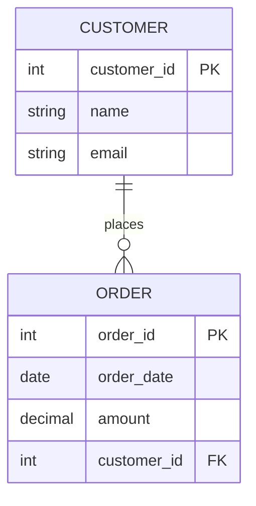
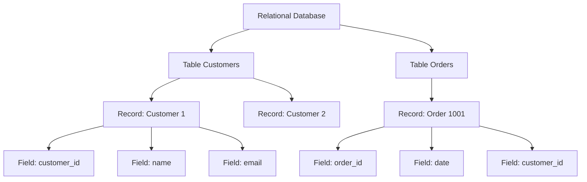

###### Topics

Fundamentals of Databases

- Importance and typical areas of application for databases
- Examples of database usage in everyday life and in companies
- Basic understanding of the difference between a database and a database management system

Overview of Relational Databases

- Basic concept of relational databases
- Understanding tables, records, and fields as central building blocks

   
# 🗄️ Fundamentals of Databases

   
## 🧠 Importance and Typical Areas of Application for Databases

Simply put, a database is a system in which information is stored **in an organized, permanent, and targeted-retrievable** manner. Instead of spreading data across individual files, Excel sheets, emails, or paper forms, it is managed centrally and in a structured way. This is precisely what makes databases so important: they ensure that information is not only stored but can also be **found, changed, compared, and protected**. Oracle describes databases in exactly this sense as an organized collection of structured information that is stored and processed electronically ([What Is a Database?](https://www.oracle.com/database/what-is-database/)).

At its core, a database solves a very practical problem: as soon as large amounts of data arise, simple files are often no longer sufficient. Imagine an online shop with millions of customers, orders, payments, and product data. If all this information were only stored in individual documents or lists, it would be extremely difficult to quickly look up:

- Which customer placed an order yesterday?
- Which products are still in stock?
- Which invoices are still outstanding?
- Which deliveries have already been shipped?

A database makes exactly these kinds of queries possible — quickly, in a structured way, and reliably.

Typical areas where databases are used are, therefore, everywhere that data is **continuously generated**, **needs to stay current**, and **is used multiple times**. For example:

- Storing customer data
- Managing orders
- Booking systems
- Inventory management
- User accounts and logins
- Payment and invoicing processes
- Appointment management
- Health and patient data
- School and university administration

Why are databases so important in practice? Mainly for these reasons:

**1. Organization and Structure**  
Databases bring order to large volumes of data. Information is not collected randomly but organized according to clear rules. This is crucial when many people or programs work with the same data.

**2. Fast Access**  
Databases are designed for targeted information retrieval. A search query for a customer number or an order can be answered in fractions of a second, even with very large amounts of data.

**3. Simultaneous Use by Many Users**  
Multiple employees or systems can access the same data at the same time without causing chaos. This is exactly what database systems are developed for ([What is a DBMS?](https://aws.amazon.com/what-is/dbms/)).

**4. Data Quality and Consistency**  
A well-designed database prevents many typical errors, such as duplicate entries, incorrect formats, or contradictory information. For example, if a date of birth must always be stored in a specific format, this can be enforced technically.

**5. Security and Rights Management**  
Not everyone can see or change everything. A database can control who can read, write, delete, or only see certain areas. This is essential in companies.

**6. Analysis and Decision Making**  
Databases are not only storage locations. They are also the basis for reports, statistics, dashboards, and business decisions. From them, you can derive, for example, sales, trends, or bottlenecks.

To put it simply:  
**A database is the memory of many digital systems.**  
Without databases, modern apps, online shops, banks, hospitals, or companies could hardly function efficiently.

   
## 🌍 Examples of Database Usage in Everyday Life and Companies

You encounter databases every day, often without even noticing them directly. Whenever a system needs to store, retrieve, or update information, a database is very often at work in the background.

To give you a sense of this, let's look at typical examples.

   
### 📱 Databases in Everyday Life

Many digital services operate with databases in the background.

| Area | What is stored in the database? | Why is this necessary? |
|---|---|---|
| Online shop | Customer account, shopping cart, orders, shipping address, payments | So that orders can be processed correctly |
| Banking app | Accounts, transactions, transfers, standing orders | So money movements are stored securely and traceably |
| Streaming service | User account, watchlist, history, recommendations | So content can be displayed in a personalized way |
| Messenger | User profiles, contacts, messages, timestamps | So conversations are stored and synchronized |
| Navigation or ticket app | Timetables, bookings, locations, reservations | So current information can be retrieved |
| Social networks | Profiles, posts, likes, comments, friendships | So content and relationships can be managed |

For example, when you buy a product in an online shop, several database operations often happen almost simultaneously:

1. Your customer account is recognized.
2. The order is saved.
3. The stock is reduced.
4. An invoice is generated.
5. The shipping status is prepared.

Without a database, all this information would have to be compiled manually — which would be slow, error-prone, and practically unscalable.

   
### 🏢 Databases in Companies

Databases are even more important in companies, as many departments often work with the same information at the same time.

| Business Area | Typical Data | Benefit |
|---|---|---|
| Sales | Customers, quotes, orders | Overview of sales processes |
| Purchasing | Suppliers, orders, prices | Planning and procurement |
| Inventory / Logistics | Items, stock levels, warehouse locations, deliveries | Control of goods movement |
| Human Resources | Employee data, contracts, vacations, salaries | Management of HR processes |
| Accounting | Invoices, payments, taxes, cost centers | Financial traceability |
| Production | Bills of materials, machine status, production orders | Control of production processes |
| Support / Service | Tickets, bug reports, customer cases | Better support and tracking |

So, a company doesn't just use “a list” but usually a whole network of databases or applications connected to databases. A CRM system stores customer data, an ERP system handles business processes, a shop system manages orders, and HR software stores employee data. All these systems depend on well-maintained data.

Importantly, databases are not just relevant for large corporations. Small companies use them as well, for example, for invoicing, appointment scheduling, inventory, or customer contacts.

   
## ⚙️ Basic Understanding of the Difference Between a Database and a Database Management System

This difference is extremely important, as the two terms are often confused.

**The database** is the actual collection of data.  
**The database management system (DBMS)** is the software that manages this data.

Or simply put:

- **Database** = the stored information
- **DBMS** = the program that works with this information

AWS describes a DBMS as software that stores, organizes, retrieves, updates, and protects data in a database ([What is a DBMS?](https://aws.amazon.com/what-is/dbms/)).

An analogy often helps:

- The **database** is like a well-sorted library with all the books.
- The **DBMS** is the library system with rules, search function, loans, user rights, and administration.

Without a DBMS, the data might be present somewhere, but you couldn’t conveniently search, change, secure, or provide access for multiple users at once.

Here’s the difference in a clear table:

| Term | Meaning | Example |
|---|---|---|
| Database | The actual stored data | A collection of customer data, orders, and products |
| DBMS | The software to manage this data | PostgreSQL, MySQL, MariaDB, Oracle Database, Microsoft SQL Server |

Typically, the DBMS performs tasks such as:

- Storing and loading data
- Executing queries
- Processing changes
- Coordinating access from multiple users
- Managing permissions and security
- Backup and recovery functions

So, when someone says:  
“We have a MySQL database,”  
they often mean the whole system in everyday life. Strictly speaking, **MySQL is the DBMS**, whereas the data it contains is the **database**.

It’s like a text document:  
The file containing the content is not the same as the program you use to open and edit it.

   
# 🧮 Overview of Relational Databases

   
## 🧩 Basic Concept of Relational Databases

Relational databases are among the most important and widely used types of databases. IBM describes relational databases as those that organize information in **tables with rows and columns** and establish relationships between these tables via shared values ([What is a Relational Database?](https://www.ibm.com/think/topics/relational-databases)).

The word **relational** comes from **relations**, meaning relationships. The idea is that data is not isolated but can be connected.

The basic idea is actually very elegant:

- Data is stored in **tables**.
- Each table describes a specific domain.
- Tables can be connected to each other.
- This allows information to be structured cleanly without duplicating everything.

A simple example:

- A table **Customers** contains information about customers.
- A table **Orders** contains information about orders.
- An order belongs to exactly one customer.
- Therefore, in the **Orders** table, it is stored **which customer** placed the order.

So you don’t have to copy the customer data for each order. Instead, the order refers to the appropriate customer. This saves storage space, reduces errors, and creates order.

This structured linking is a major advantage of relational databases.

Relational databases usually use **SQL** as the standard language for queries and data manipulation ([What is a Relational Database?](https://www.ibm.com/think/topics/relational-databases)). With SQL, you can say, for example:

- Show all customers from Berlin.
- Find all orders of a specific customer.
- Count how many products are still in stock.
- Change the price of an item.

Thus, a relational database becomes not just a place of storage but a system with which you can specifically analyze and modify information.

   
### 🧷 Why “Relationships” Are So Important

Suppose you run an online shop. One customer can place multiple orders. This relationship is thus:

**One customer → many orders**

In a relational database, this is cleanly modeled by storing both domains in separate tables and linking them via a shared key.

Here is a simple visualization:

What you see here:

- **CUSTOMER** is a table.
- **ORDER** is a second table.
- **customer_id** is the unique key in the customer table.
- In the order table, **customer_id** appears again, so it is clear which customer the order belongs to.

This linkage is the heart of relational databases.

   
### 🧱 Why Relational Databases Are So Popular

Relational databases are widespread because they are well-suited to many business problems. They offer:

- clear structure
- good traceability
- consistent data storage
- flexible queries
- proven standards

Especially in areas such as accounting, inventory management, HR management, e-commerce, and classic business applications, relational databases are often the first choice.

They are so popular because many real-world entities can be naturally “thought of as tables”: customers, products, invoices, bookings, employees, suppliers, courses, grades, rooms, reservations, and so on.

   
## 🗂️ Understanding Tables, Records, and Fields as Central Building Blocks

If you want to understand relational databases, you must be able to clearly distinguish especially three basic concepts:

- **Table**
- **Record**
- **Field**

These three building blocks always come up.

   
### 📋 The Table

A **table** is a structured area for a specific type of data. You can think of it like a worksheet, but with clear rules.

Examples of tables:

- `Customers`
- `Products`
- `Orders`
- `Employees`

Each table deals with **one topic**.  
So the `Customers` table does not store warehouse locations or invoice line items, but customer data. This keeps databases organized.

Here is a very simple example of a customer table:

| customer_id | name | email | city |
|---|---|---|---|
| 1 | Anna Meier | anna@example.de | Cologne |
| 2 | Omar Yilmaz | omar@example.de | Hamburg |
| 3 | Lea Schmidt | lea@example.de | Berlin |

This entire structure is the **table**.

Important: A table consists of **rows** and **columns**.

- The **rows** contain individual entries.
- The **columns** describe which properties are stored.

   
### 🧾 The Record

A **record** is **a single row** in a table. It describes a concrete object or event.

In the `Customers` table, for example, this row would be a record:

| customer_id | name | email | city |
|---|---|---|---|
| 2 | Omar Yilmaz | omar@example.de | Hamburg |

This record describes **exactly one customer**.

In other tables, a record can represent something else:

- In `Products`: a product
- In `Orders`: an order
- In `Employees`: an employee
- In `Invoices`: an invoice

You can remember:

**Table = many similar entries**  
**Record = a single entry**

In technical language, a record is also often called **record** or **tuple**. But for beginners, "record" is perfectly sufficient.

   
### 🔤 The Field

A **field** is a single data attribute within a record. In simple introductions, “field” is often almost synonymous with **column**. Strictly speaking, the column is more the category or structure, while the field content is the specific value in the record. But in everyday learning, the simple idea is usually most helpful:

- **Column/field name** = which property is stored
- **Field value** = the specific content in a cell

Example from the customer table:

| customer_id | name | email | city |
|---|---|---|---|
| 2 | Omar Yilmaz | omar@example.de | Hamburg |

Here:

- `customer_id`, `name`, `email`, `city` are the **fields or columns**
- `2`, `Omar Yilmaz`, `omar@example.de`, `Hamburg` are the **specific field values**

A field therefore describes an attribute such as:

- Name
- Email
- Phone number
- Price
- Date
- Quantity

Without fields, there would be no structure. Then everything would just be unstructured text.

   
### 🧭 Table, Record, and Field in Direct Comparison

| Term | Simple Meaning | Example |
|---|---|---|
| Table | Collection of similar data | `Customers` |
| Record | A row in the table | Customer “Omar Yilmaz” |
| Field | Single attribute within the record | `email` or `city` |

You can remember these three concepts with an image:

- **Table** = an entire index card box
- **Record** = a card in it
- **Field** = a single piece of information on the card

It sounds simple, but it’s the foundation of almost all database work.

   
### 🔑 A Brief Look at Keys to Tie Everything Together

As soon as tables are linked, you need unique identifiers. That’s why **keys** often appear in relational databases.

The most important is the **primary key**.  
This is a field that uniquely identifies each record.

Example:

| customer_id | name | email |
|---|---|---|
| 1 | Anna Meier | anna@example.de |
| 2 | Omar Yilmaz | omar@example.de |

Here, `customer_id` is a good primary key because each ID only occurs once.

When another table refers to this customer, it often uses a **foreign key**.  
This is a field that points to the primary key of another table. This is precisely how the relationships between tables are created, which according to IBM constitute the core principle of relational databases ([What is a Relational Database?](https://www.ibm.com/think/topics/relational-databases)).

For example:

**Table `Customers`**

| customer_id | name |
|---|---|
| 1 | Anna Meier |
| 2 | Omar Yilmaz |

**Table `Orders`**

| order_id | date | customer_id |
|---|---|---|
| 1001 | 2026-03-24 | 2 |

Here, `customer_id = 2` in the `Orders` table refers to customer “Omar Yilmaz” in the `Customers` table.

This is a very typical pattern in relational databases:

- Separate data by topic
- Link via keys
- Maintain structure and order

   
### 🏗️ How the Building Blocks Fit Together

Bringing all the concepts together looks like this:

1. A relational database contains multiple **tables**.
2. Each table contains multiple **records**.
3. Each record consists of multiple **fields**.
4. Records from different tables can be **linked** through keys.

As a visual:

This model is simple but extremely powerful. This is the basis for later topics like SQL queries, relationships between tables, primary keys, foreign keys, normalization, and data modeling.