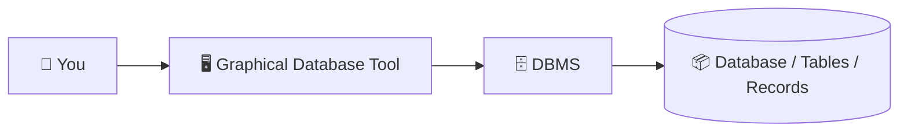
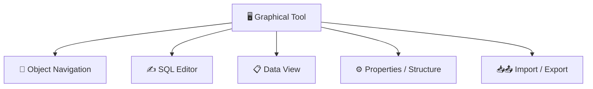
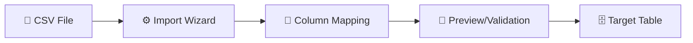
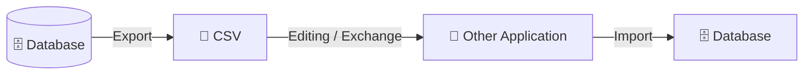

###### Topics

Working with a Database Management System

- Connecting to a local database using a graphical tool
- Getting to know the basic functions of a graphical database tool

Basic Database Operations

- Creating databases and tables using a tool
- Modifying and deleting tables with ease

Data Transfer

- Importing records from a CSV file
- Exporting data to simple formats like CSV

<br><br><br>
# 🗄️ Working with a Database Management System

When working with a database management system, or **DBMS** for short, you should clearly distinguish between three things:

1. **The Database** – the place where data is stored in a structured manner.  
2. **The DBMS** – the software that manages this database, executes queries, controls access, and stores data.  
3. **The graphical database tool** – the interface you use to conveniently access the DBMS, without having to type everything in SQL by hand.

A common misconception beginners have is thinking that the graphical tool **is** the database. That’s not true. The tool is more like your cockpit. The actual work is handled by the DBMS in the background.

A very good basic understanding emerges if you imagine the process like this:



The tool sends commands to the DBMS. The DBMS processes them and stores or reads data. This is why it’s important not only to learn “where do I click?”, but also “what is technically happening behind the scenes?”


<br><br><br>
## 🔌 Connecting to a local database using a graphical tool

A **local database** means that the database is located **on your own computer** or is running as a service there. There are basically two common variants:

- **File-based Database**: for example, SQLite. Here the database is simply a file on your computer. SQLite is serverless, self-contained and doesn’t require its own server installation. ([About SQLite](https://www.sqlite.org/about.html))
- **Server-based Database**: for example, PostgreSQL or MySQL. Here a local database server is running on your computer, and your tool connects to this service using host, port, username, and password.

This is an important distinction, as the way you connect depends on the type of database.

<br><br><br>
### 🧠 What “local” actually means

“Local” does not automatically mean “simple.” It just means that the database is **on your computer**, not on a remote server in the network or the cloud.

With SQLite, you usually just provide the **file path** to the database file. With PostgreSQL or MySQL, you generally also need to provide the following connection details:

- **Host** – usually `localhost` or `127.0.0.1`
- **Port** – the network port of the database service
- **Database name**
- **Username**
- **Password**

When you enter these details, the graphical tool establishes a connection to the DBMS. Afterwards, you can view tables, read data, create new tables, or import data in the tool.

<br><br><br>
### 🛠️ What you need to connect

Before you can establish a connection, you usually need these components:

| Component | Meaning |
|---|---|
| DBMS or database file | The database foundation, e.g., PostgreSQL, MySQL, or SQLite |
| Graphical Tool | e.g., DBeaver, pgAdmin, MySQL Workbench, or DB Browser for SQLite |
| Connection details | Host, port, database name, username, password, or file path |
| Running service | For server-based systems, the database service must be started |

If the service isn't running, the tool can’t connect. This is a very classic beginner mistake: The tool is open, but the database server itself isn’t even running.

<br><br><br>
### 🚶 Step-by-step guide

Nearly every graphical database tool works similarly when establishing a new connection. The terms might differ, but the logic is always the same.

**1. Select the database type**  
You first choose which system you want to connect to – for example, PostgreSQL, MySQL, or SQLite.

**2. Set connection type**  
For SQLite, usually select the file.  
For PostgreSQL/MySQL: host, port, database name, username, password.

**3. Test the connection**  
Good tools offer a button like “Test Connection.” This lets you see immediately whether your details are correct.

**4. Save the connection**  
Afterwards, the connection usually appears on the left in a navigation bar or tree structure.

**5. Open database objects**  
You can now browse schemas, tables, views, and other objects.

Especially for clean learning, it is important: When you create a connection, you are also learning the basic idea of **client and server**. The graphical tool is the client. The DBMS is the server or local data source.

<br><br><br>
### 📊 Typical local connection scenarios

| Scenario | What you enter in the tool | Typical learning goal |
|---|---|---|
| Open SQLite file | Path to the `.sqlite` or `.db` file | Understand that a database can be just a file |
| PostgreSQL locally | `localhost`, port, DB name, user, password | Understand the client-server principle |
| MySQL locally | `localhost`, port, DB name, user, password | Working with server service and user rights |

<br><br><br>
### ⚠️ Common connection errors

If the connection doesn’t work, it is often due to very basic issues:

**The database service isn't running.**  
Even if the address is correct, no one is answering.

**Username or password is incorrect.**  
You reach the server, but don’t get access.

**The database name is incorrect.**  
Perhaps the target database does not yet exist.

**The wrong port was entered.**  
The tool tries to talk to the right machine, but through the wrong door.

**The wrong file was chosen for SQLite.**  
You might open an empty or different database than expected.

For clean learning, remember this key phrase:  
**Connection problems are usually not an SQL problem but a configuration problem.**


<br><br><br>
## 🧭 Getting to know the basic functions of a graphical database tool

A graphical database tool doesn’t do your thinking for you, but it makes many work steps visible. Exactly this is very valuable for beginners.

Most tools offer you roughly these core areas:



<br><br><br>
### 🪟 The typical areas of the interface

**Object Navigation**  
On the left, you often see a tree structure listing databases, schemas, tables, views, and other objects. In PostgreSQL, schemas are a logical grouping within a database. ([The Schema](https://www.postgresql.org/docs/current/ddl-schemas.html))

**Table structure or properties window**  
Here, you see columns, data types, primary keys, default values, and other attributes.

**Data View**  
Here, you can see the actual records in a table, usually in a grid view.

**SQL Editor**  
Even if you click a lot, you should learn that nearly every action is backed by SQL. This is the crucial step from “tool operator” to real database understanding.

**Import/Export Wizards**  
They help you load CSV or other formats into tables or export data.

<br><br><br>
### 📋 Key functions for everyday use

| Function | What it’s for | Why it’s important |
|---|---|---|
| Manage connections | Open and save database connections | Nothing works without a stable connection |
| Show tables | Review structure and contents | See how data is organized |
| Execute SQL | Queries, changes, administration | This is the real language of the database |
| Filter/sort data | Find specific records | Useful for control and analysis |
| Create tables | Create structure for new data | Build a clean foundation |
| Modify tables | Adjust structure | The data model often evolves |
| Import/Export | Bring in or output data | Central to real-world workflows |

<br><br><br>
### 🧠 Why you shouldn’t just “memorize where to click”

Real learning here means: Always understand **which object** you are editing and **what effect** your action has.

For example, when you create a table in the tool, it usually generates a `CREATE TABLE` in the background. Such tables are defined in SQL using the `CREATE TABLE` command. ([CREATE TABLE](https://www.postgresql.org/docs/current/sql-createtable.html))

If you add a column, the DBMS usually uses `ALTER TABLE`. ([ALTER TABLE](https://www.postgresql.org/docs/current/sql-altertable.html))

If you delete a table, `DROP TABLE` is typically behind it. ([DROP TABLE](https://www.postgresql.org/docs/current/sql-droptable.html))

This is extremely important didactically:  
**The interface is just a convenient representation of database commands.**  
Whoever understands this will later learn SQL much more easily.


<br><br><br>
# 🏗️ Basic Database Operations

Once the connection is established, the actual basic work begins: Creating databases, defining tables, adjusting structure, and deleting as needed.

Here you learn the foundation of any database work: **Structure before content**.  
First the data model, then the data.


<br><br><br>
## 🏛️ Creating databases and tables with a tool

Before you can store data, you need a container and the suitable structure within it.

<br><br><br>
### 🧱 Cleanly distinguishing between database, schema, and table

These terms are often mixed up at first:

- **Database**: the overarching storage area
- **Schema**: a logical subdivision within a database, present or relevant depending on the system
- **Table**: the concrete structure with columns and rows

So a table is not “the database,” but just a building block inside it.

In PostgreSQL, a database is created with `CREATE DATABASE`. ([CREATE DATABASE](https://www.postgresql.org/docs/current/sql-createdatabase.html))  
A table is created with `CREATE TABLE`. ([CREATE TABLE](https://www.postgresql.org/docs/current/sql-createtable.html))

<br><br><br>
### 🧾 How to create a database with a tool

In a graphical tool, you usually click on an area like:

- “New Database”
- “Create Database”
- Right-click on server or connection → new database

You mainly provide a **name**. Depending on the system, further options may appear, such as owner, character set, or collation.

The important principle here:  
A database is the **organizational framework**. It doesn’t yet define which data fields will exist later; that happens at the table level.

<br><br><br>
### 🧬 How to sensibly create a table

When creating a table, you define the columns. Each column has a purpose and a data type.

A typical example could look like this:

| Column | Data Type | Meaning |
|---|---|---|
| `id` | Integer | Unique identifier |
| `product_name` | Text/VARCHAR | Name of the product |
| `price` | Decimal/Numeric | Amount of money |
| `stock` | Integer | Quantity in stock |
| `created_at` | Date/Timestamp | Creation timestamp |

When adding a table, a graphical tool will typically ask you for:

- **Column name**
- **Data type**
- **Length** for text fields
- **NULL allowed or not**
- **Primary key**
- **Auto-increment / Identity**
- **Default value**

Primary keys ensure each row is uniquely identifiable. The definition of primary keys and other constraints is part of `CREATE TABLE`. ([CREATE TABLE](https://www.postgresql.org/docs/current/sql-createtable.html))

A good learning pattern:  
**Each column should have precisely one business purpose.**  
Not “one column for everything,” but clearly separated information.

<br><br><br>
### 🔍 What distinguishes good tables from bad tables

A good table is not just technically valid, but also logically sound.

**Good** might be:

- An `id` as a unique key
- Sensible data types
- Clear column names
- No duplicate information in multiple columns
- Dates stored as date, not as free text

**Bad** would be, for example:

- Storing prices as text
- Mixing names, addresses, and comments into a single catch-all column
- No unique ID
- Data types too imprecise or too generous

With graphical tools, a dangerous thing happens quickly: You can click through dialogues too quickly and forget that data types and keys are real business decisions.


<br><br><br>
## ✏️ Easily modifying and deleting tables

In practice, a table is almost never unchanged forever. Requirements change, so you need to be able to adjust tables.

<br><br><br>
### ➕ Modifying tables: common changes

The most common changes are:

- adding a new column
- renaming a column
- changing a data type
- setting a default value
- changing NULL rules
- deleting a column

Such changes in SQL typically use `ALTER TABLE`. ([ALTER TABLE](https://www.postgresql.org/docs/current/sql-altertable.html))

In a graphical tool, you usually edit the table structure directly in a designer or properties dialog.

Some practical examples:

**Adding a new column**  
You want to add a `category` column to a products table.

**Adjusting data types**  
You realize that `price` should be saved as a decimal value, not an integer.

**Setting a default value**  
New records should automatically get a creation date.

<br><br><br>
### 🔁 What’s important technically when changing things

Not every change is harmless.

If you **add a new column**, that’s often relatively straightforward.  
If you **change a data type**, it can cause problems if existing data doesn’t fit the new format.

Example:  
A text column should now become a number column. That only works if the existing values can actually be converted to numbers.

This is a very important learning point:  
**Structural changes affect not only the schema, but often the data already stored.**

<br><br><br>
### 🗑️ Deleting tables

If you delete a table, you remove not just the data but the **entire table structure**. In SQL this is done with `DROP TABLE`. ([DROP TABLE](https://www.postgresql.org/docs/current/sql-droptable.html))

This is different from just deleting records.

| Action | What disappears? |
|---|---|
| Delete records | Only contents |
| Delete table | Contents **and** structure |

This is especially dangerous in graphical tools, as a right-click is quickly done. Good tools usually show a safety prompt.

For good practice:  
Before deleting, always check:
- Is this really the right table?
- Is it still in use somewhere?
- Do I need an export or backup first?

<br><br><br>
### 🧾 What the tool usually executes in the background

| Action in tool | Typical SQL command |
|---|---|
| Create new database | `CREATE DATABASE` |
| Create new table | `CREATE TABLE` |
| Alter table | `ALTER TABLE` |
| Delete table | `DROP TABLE` |

If you keep this in mind, you learn both:  
You learn the tool **and at the same time** the language of databases.


<br><br><br>
# 📦 Data Transfer

In practice, databases are never completely isolated. Data is often taken from files or exported. That’s exactly what import and export are for.

The most common exchange format for beginners is **CSV**, because it’s simple, widely used, and can be read by almost any tool.


<br><br><br>
## 📥 Importing records from a CSV file

Importing from CSV is one of the most practical basic workflows. It connects tabular data from files with an actual database structure.

<br><br><br>
### 📄 What a CSV file actually is

CSV stands for **Comma-Separated Values**. The format describes records as text lines whose fields are separated by delimiters; a header line is possible. ([RFC 4180](https://www.rfc-editor.org/rfc/rfc4180))

Important:  
CSV is **very simple**, but precisely because of that it normally **does not store real database logic** such as primary keys, foreign keys, data type rules, or relationships. It mainly transports raw values.

An example:

```csv
id,product_name,price,stock
1,Keyboard,49.99,20
2,Mouse,19.95,50
3,Monitor,199.00,8
```

The file contains values, but the database still needs to know:

- Which column is a number?
- Which is text?
- Which is the primary key?
- Is the first line a header?

<br><br><br>
### 🧹 What to check before importing

Before importing, you should check the CSV file both logically and technically:

**1. Do the columns match the target table?**  
If your table has `product_name`, `price`, and `stock`, but the CSV has `name`, `cost`, and `quantity`, you must assign them correctly during import.

**2. Is the first line a header?**  
Most import wizards can interpret the first line as column names.

**3. What delimiter is used?**  
CSV means “comma-separated,” but in many regions semicolons are used. You must set this correctly in the import dialog. The CSV format itself describes fields as separated by a delimiter. ([RFC 4180](https://www.rfc-editor.org/rfc/rfc4180))

**4. Are date and number formats correct?**  
Decimal separators, date formats, and empty values are particularly tricky.

**5. Are IDs unique?**  
If your table has a primary key, there must be no duplicate values.

<br><br><br>
### 🚚 How a CSV import typically works in the tool

The process is similar in many tools:

1. **Select the target table**  
   You import into an existing table or let a new one be created.

2. **Select the CSV file**  
   The tool reads a preview of the file.

3. **Set import options**  
   These often include:
   - Delimiter
   - Character set
   - Text qualifier, e.g., `"`
   - Header yes/no
   - NULL values
   - Date format

   Such options correspond to typical CSV import/export parameters in DB systems, for example, PostgreSQL `COPY` with options like `FORMAT csv`, `DELIMITER`, `HEADER`, or `NULL`. ([COPY](https://www.postgresql.org/docs/current/sql-copy.html))

4. **Map columns**  
   The tool maps CSV columns to table columns.

5. **Check preview**  
   Very important: Before final import, check if values are being interpreted correctly.

6. **Start import**  
   The tool writes data to the table.



<br><br><br>
### 🚧 Common problems during import

**Column order doesn't match**  
Then the price might end up in the stock column.

**Wrong delimiter**  
The tool might interpret an entire line as a single column.

**Data type mismatch**  
Text in a numeric column often results in errors or blank values.

**Umlauts or special characters are corrupted**  
This usually means the character encoding is set incorrectly.

**Empty fields handled incorrectly**  
An empty field is not always the same as `NULL`.

**Duplicate key values**  
If an ID occurs twice, import can fail due to primary key rules.

Here you clearly see why having a good table structure is so important:  
Importing becomes much easier if your target tables are well defined and logically sound.


<br><br><br>
## 📤 Exporting data to simple formats like CSV

Export is the reverse: You extract data from the database so it can be used in other programs or archived.

<br><br><br>
### 🎯 When export makes sense

A CSV export is often used to:

- Open data in Excel or LibreOffice Calc
- Share data with other systems
- Create simple backups of specific tables
- Provide data for analysis or reporting

Again, CSV is good for **exchanging tabular values**, but not for full database logic.

<br><br><br>
### 🧾 How an export typically works

You usually select in the tool:

- A table
- Or the result of an SQL query

Then you start the export wizard and specify:

- File format, e.g., CSV
- Destination path
- Delimiter
- Header yes/no
- Character set
- Text qualifier (optional)

PostgreSQL supports exactly these options during export via `COPY`, such as `CSV`, `HEADER`, and `DELIMITER`. ([COPY](https://www.postgresql.org/docs/current/sql-copy.html))

A very important difference:

- **Table export** often exports the entire table
- **Query export** exports only the data your SQL query returns

This is extremely useful in practice. This way, you can export only certain columns or only filtered records.

<br><br><br>
### 🧠 Why exporting from queries is especially valuable

If you only export raw tables, you often send too much data.  
But if you export from an SQL query, you can specify beforehand:

- Which columns are relevant
- Which rows should be included
- In what order the data appears
- Whether values are renamed or calculated

This makes a simple export a first step toward data processing.

<br><br><br>
### 🔐 What is lost when exporting to CSV

This is an important business point:  
When exporting to CSV, you usually **do not include the entire database structure**.

Often lost or not fully captured are:

- Primary key definitions
- Foreign key relationships
- Indexes
- Constraints
- Triggers
- User permissions
- Data type details

CSV mainly contains tabular values, not the entire database architecture. This follows from the nature of the format as a simple text-based exchange medium. ([RFC 4180](https://www.rfc-editor.org/rfc/rfc4180))

Therefore, a CSV export is **not a substitute for a full database backup**.  
It’s excellent for exchange and visibility, but not for fully reconstructing complex database structures.

<br><br><br>
### 🔄 The overall flow of import and export



This cycle is very typical in practice:  
Data is exported, processed, checked, or exchanged elsewhere, and later re-imported.

That’s why **connections, table structure, import, and export** are among the most important basics overall. If you really understand these processes, you’ll have a strong foundation for everything else in database work – whether you later focus on SQL, application development, data engineering, or administration.