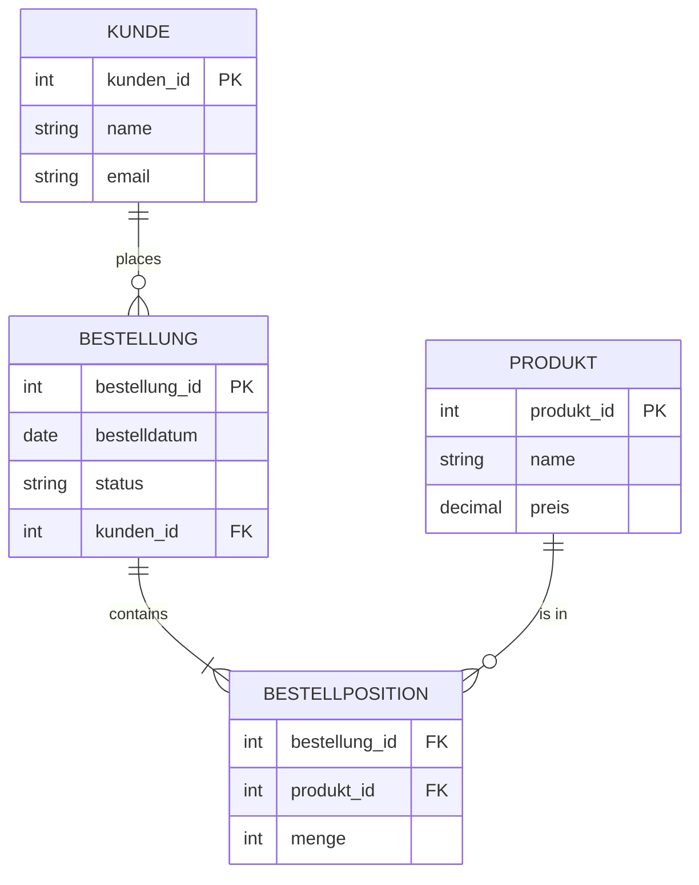
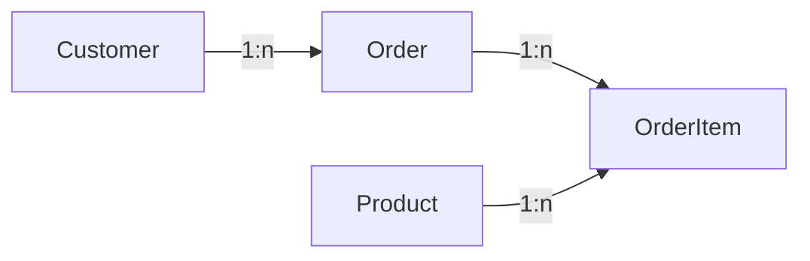

###### Topics

Fundamentals of Data Modeling

- Understanding entities, attributes, and relationships
- Describing simple connections between data

Entity-Relationship Model

- Reading and creating simple ER diagrams
- Identifying cardinalities in simple examples

From Model to Table

- Translating a simple ER diagram into a relational schema
- Deriving table structures from a sample scenario

<br><br><br>
# 📚 Fundamentals of Data Modeling

When you work with data, you first need to understand **what** you actually want to store, **how this information is connected**, and **how it eventually turns into tables**. That’s exactly what data modeling is for.

Data modeling means describing information from the real world so that a computer system can store and process it cleanly. You determine **what objects exist**, **which properties these objects have**, and **how they are connected**. Data models are used for this purpose ([What is data modeling?](https://www.ibm.com/think/topics/data-modeling)).

It may sound theoretical at first, but it's actually very practical. If you have a good data model, then:

- you understand a problem from a business perspective much better,
- you avoid duplicate or chaotic data,
- it becomes easier to create tables, queries, and applications later,
- and you make fewer mistakes in technical implementation.

A very important idea here is: **First the model, then the database**.  
Don’t start building tables immediately; first think: *What things are there? Which information belongs to them? How are they connected?*

<br><br><br>
## 🧱 Understanding Entities, Attributes, and Relationships

The three basic building blocks of data modeling are:

- **Entities**
- **Attributes**
- **Relationships**

If you really understand these three terms, the rest becomes much easier.

<br><br><br>
### 🧍 Entities: The things you store data about

An **entity** is an object or item from the business world about which you want to store information.

Examples of entities:

- Customer
- Product
- Order
- Employee
- Book
- Student

If, for example, you are modeling an online shop, then **Customer**, **Product**, and **Order** are typical entities.

It's important to distinguish between:

- **Entity type**: the general class, for example, **Customer**
- **Entity/Instance**: a concrete entry, for example, **Customer No. 17 = Anna Weber**

So:

- **Customer** is the type
- **Anna Weber** is a concrete instance of that type

This is a very important conceptual mistake many beginners make:  
You don’t model individual people or products initially, but first the **kinds of things** that occur.

<br><br><br>
### 🏷️ Attributes: The properties of an entity

An **attribute** describes a property of an entity.

Example for the entity **Customer**:

| Entity      | Possible Attributes                     |
|-------------|----------------------------------------|
| Customer    | Customer ID, First name, Last name, Email, Date of birth |
| Product     | Product ID, Name, Price, Stock quantity|
| Order       | Order number, Order date, Status       |

An attribute answers questions like:

- What is the customer's name?
- What is their email address?
- What does the product cost?
- When was the order placed?

An attribute should contain **exactly one piece of information**.  
For example, `Email` is a good attribute because exactly one clear value is stored there.

A less good attribute would be `Complete_Contact_Info`, as it could combine multiple pieces of information at once. Good data modeling tries to keep information clearly separated.

Typical attribute types are:

- **Identifying attributes**  
  They help to uniquely identify a record, for example `Customer-ID`.

- **Descriptive attributes**  
  They provide additional information, such as `Name` or `Price`.

- **Optional attributes**  
  They don't always have to have a value, for example `Phone number`.

- **Mandatory attributes**  
  They should always be present, like `Customer-ID` in many models.

A very central attribute is the **key**.

<br><br><br>
### 🔑 Key Attributes: How to Uniquely Identify a Record

In almost every data model, you need an attribute that **uniquely** identifies each record. In relational databases, this is usually the **primary key**.

Examples:

- `customer_id`
- `product_id`
- `order_id`

A primary key must be unique. That means there can't be two customers with the same `customer_id`. Also, a primary key cannot be empty. These are typical properties of a primary key in relational databases ([PostgreSQL: Constraints](https://www.postgresql.org/docs/current/ddl-constraints.html)).

Why is an artificial ID often used instead of a name?

Because names are not unique. There can be multiple people named "Max Mueller". An ID is more stable and reliable.

Therefore:

- `Customer-ID` → good as a key
- `Name` → usually unsuitable as a key

<br><br><br>
### 🔗 Relationships: How entities are connected

A **relationship** describes how two entities are connected.

Examples:

- A **Customer** places an **Order**.
- An **Order** contains **Products**.
- A **Teacher** teaches a **Class**.
- A **Book** is written by an **Author**.

Relationships are extremely important because data almost never exists in isolation.  
A customer alone is rarely interesting. They become interesting when you also know:

- which orders they placed,
- which products they bought,
- what address they have,
- what invoices are linked to them.

Without relationships, you only have separate data collections.  
With relationships, you get a **connected model**.

A simple example:

| Entity A  | Relationship  | Entity B      |
|-----------|---------------|--------------|
| Customer  | places        | Order        |
| Order     | contains      | Product      |
| Employee  | works in      | Department   |

You can also read relationships as full sentences:

- A customer places orders.
- An order belongs to exactly one customer.
- A product can appear in many orders.

Such sentences tremendously help you in modeling. If you can't describe a model in clear sentences, it's usually not well thought out.

<br><br><br>
## 🔍 Describing simple relationships between data

When modeling data, it’s not enough to say:  
“Customer and Order are connected.”

You have to specify:

- **How many** orders can a customer have?
- Does an order belong to **one or several** customers?
- Can a product appear in **many** orders?

This leads you to the so-called **cardinalities**. They describe the number of possible assignments between entities.

<br><br><br>
### 1️⃣ One-to-one Relationship (1:1)

In a **1:1 relationship**, a record has at most exactly one matching record on the other side.

Example:

- A **Person** has exactly one **ID card**
- An **ID card** belongs to exactly one **Person**

This is less common in practice than 1:n relationships.

Such relationships are often used when information needs to be separated, for example:

- for security reasons,
- because data is optional,
- or because part of the data only applies in special cases.

Example:

- `Employee`
- `Employee_Parking_Space`

Not every employee has a parking space, so it can be modeled separately.

<br><br><br>
### 2️⃣ One-to-many Relationship (1:n)

This is the most common type of relationship.

Example:

- A **Customer** can place many **Orders**.
- An **Order** belongs to only one **Customer**.

So:

- on one side: **1**
- on the other side: **many**

More examples:

- A **Department** has many **Employees**
- A **Class** has many **Students**
- A **Manufacturer** produces many **Products**

This type of relationship is particularly easy to implement in tables.

<br><br><br>
### 3️⃣ Many-to-many relationship (n:m)

In an **n:m relationship**, both sides can be connected to each other multiple times.

Example:

- An **Order** can contain many **Products**.
- A **Product** can appear in many **Orders**.

Or:

- A **Student** attends many **Courses**
- A **Course** is attended by many **Students**

This relationship is very common business-wise, but technically cannot be represented as a single column in relational databases. Therefore, it is later resolved using an **intermediate table**.

An important example:

- `Order`
- `Product`

The direct relationship is n:m at the business level.  
Technically, you often create:

- `OrderItem`

An order item connects exactly **one order** with exactly **one product** and often contains additional information such as `Quantity` or `Unit price`.

This is a very typical pattern in data modeling.

<br><br><br>
# 🧩 Entity-Relationship Model

The **Entity-Relationship Model**, in short, **ER model**, is a graphical method to make entities, attributes, and relationships visible. It was developed precisely to present data structures understandably before turning them into tables ([What is data modeling?](https://www.ibm.com/think/topics/data-modeling)).

The big advantage:  
You can clarify a business problem **visually** and **logically** first, without immediately dealing with SQL or database details.

An ER model mainly answers these questions:

- What entities exist?
- What attributes do they have?
- What relationships exist?
- What cardinalities apply?

<br><br><br>
## 👀 Reading and understanding simple ER diagrams

An **ER diagram** is the graphical representation of an ER model.

Depending on the notation, ER diagrams may look different. In practice, two things are almost always visible:

- **Entities**
- **Relationships**
- often also **Attributes**
- and the **Cardinalities**

A simple ER diagram for an online shop might look like this:



How you can read this:

- A **Customer** places **zero, one, or many orders**.
- An **Order** belongs to **exactly one customer**.
- An **Order** contains **at least one order item**.
- A **Product** can appear in **many order items**.

The key trick is:  
Read each relationship as a natural sentence.

For example:

- A customer places orders.
- An order contains order items.
- An order item refers to a product.

If you can read an ER diagram this way, you’ve understood the core.

<br><br><br>
### 🧠 What the cardinality symbols mean

In many representations, especially in the so-called **Crow’s-Foot notation**, you’ll see symbols like `||`, `o|`, `|{`, or `o{`.

In simplified form, they mean:

| Symbol | Meaning             |
|--------|---------------------|
| `||`   | exactly one         |
| `o|`   | zero or one         |
| `|{`   | one or many         |
| `o{`   | zero or many        |

So if you see:

`KUNDE ||--o{ BESTELLUNG`

that means:

- Every order belongs to **exactly one** customer,
- a customer can have **zero or many** orders.

That's much more expressive than just a line between two boxes.

<br><br><br>
## ✍️ Creating simple ER diagrams

Creating an ER diagram is essentially a thinking process in clear steps.

### 🪜 Step 1: Identify the important things in the scenario

You read a business scenario and look for the objects about which data should be stored.

Sample sentence:

> A customer orders products. Each order has a date. Products have a price.

From this, you quickly spot entities like:

- Customer
- Order
- Product

Pay special attention to nouns. Entities are often hidden there.

<br><br><br>
### 🏷️ Step 2: Gather attributes for each entity

Then think:  
Which information do we need to store for each entity?

Example:

**Customer**
- Customer ID
- Name
- Email

**Order**
- Order ID
- Order date
- Status

**Product**
- Product ID
- Name
- Price

What’s important here:  
Only include attributes that really belong to this entity.

For instance, `Price` belongs to Product, not Customer.

<br><br><br>
### 🔗 Step 3: Formulate relationships

Now write simple sentences for the connections:

- Customer places order
- Order contains product

If you can clearly formulate the sentence, it’s a good sign the relationship makes sense.

<br><br><br>
### 🔢 Step 4: Define cardinalities

Now get precise:

- Can a customer have multiple orders? → Yes
- Does an order belong to multiple customers? → No

So we have:

- Customer 1 : n Order

Then:

- Can an order contain multiple products? → Yes
- Can a product appear in multiple orders? → Yes

So:

- Order n : m Product

This is a key step. This is where the eventual table structure is determined.

<br><br><br>
### 🧹 Step 5: Clean up unclear or duplicate information

Good data modeling also means spotting issues early.

Example of a bad attribute:

- `product_list` in the `Order` table

Why is that problematic?  
Because several products would end up in one field. That contradicts the principle of well-structured data.

Better:

- `Order`
- `Product`
- `OrderItem`

This way, every piece of information is stored clearly and separately.

<br><br><br>
## 🔢 Identifying cardinalities in simple examples

To reliably spot cardinalities, it's helpful to think this way:

Always ask in **both directions**.

Not just:

- How many orders can a customer have?

But also:

- How many customers does an order belong to?

This double question is invaluable.

Here is a brief overview:

| Relationship | Meaning                                                | Example                   |
|--------------|--------------------------------------------------------|---------------------------|
| 1:1          | One record fits at most one record on the other side   | Person ↔ ID Card          |
| 1:n          | One record fits many records on the other side         | Customer ↔ Order          |
| n:m          | Both sides can be connected multiple times             | Order ↔ Product           |

It gets even clearer with language:

| Question                                  | Example answer | Result          |
|--------------------------------------------|---------------|-----------------|
| How many orders can a customer have?       | many          | left 1, right n |
| How many customers does an order belong to?| exactly one   | Cust ↔ Order=1:n|
| How many products can an order have?       | many          | n:m candidate   |
| In how many orders can a product appear?   | many          | Order ↔ Product = n:m |

A common beginner mistake is to consider only one direction.  
For example:

> An order contains many products.

That's correct, but not complete.  
Only the reverse question clarifies:

> A product can also appear in many orders.

And then you see:  
That's **n:m**.

<br><br><br>
# 🗄️ From Model to Table

Up to this point, you’ve modeled on a business level. Next comes the step:  
How does an ER model become a **relational table structure**?

In the relational model, data is organized in **tables**. A table has **columns** for attributes and **rows** for records. Relationships between tables are usually established via keys, particularly **primary keys** and **foreign keys** ([PostgreSQL: Constraints](https://www.postgresql.org/docs/current/ddl-constraints.html)).

This step is extremely important because this is where a business model becomes a concrete technical structure.

<br><br><br>
## 🔄 Translating a simple ER diagram into a relational schema

Luckily, the basic rules are quite clear.

<br><br><br>
### 🧱 Rule 1: Each entity becomes a table

If you have entities in the ER model such as:

- Customer
- Order
- Product

then these will normally become tables:

- `customer`
- `order`
- `product`

This is the simplest and most important rule.

<br><br><br>
### 🏷️ Rule 2: Each simple attribute becomes a column

From the entity **Customer** with the attributes

- Customer ID
- Name
- Email

you get the table:

| Table `customer` | Meaning           |
|------------------|------------------|
| customer_id      | unique ID        |
| name             | Customer's name  |
| email            | Email address    |

So attributes become columns directly.

<br><br><br>
### 🔑 Rule 3: The identifier becomes the primary key

If `customer_id` uniquely identifies the customer, this column becomes the **primary key**.

For example:

`CUSTOMER(customer_id PK, name, email)`

Likewise:

`PRODUCT(product_id PK, name, price)`

The primary key is thus the technical implementation of the unique identifier.

<br><br><br>
### 🔗 Rule 4: A 1:n relationship is implemented via a foreign key

Example:

- A customer has many orders
- An order belongs to exactly one customer

The foreign key goes on the **n side**, that is, in the `order` table.

Why?  
Because each order must know **to which customer it belongs**.

So:

`ORDER(order_id PK, order_date, customer_id FK)`

`customer_id` here is a **foreign key** referencing `CUSTOMER(customer_id)`.

A foreign key ensures that the reference points to an existing record. That’s exactly what a foreign key constraint is for ([PostgreSQL: Constraints](https://www.postgresql.org/docs/current/ddl-constraints.html)).

<br><br><br>
### 🔄 Rule 5: An n:m relationship requires an intermediate table

This is one of the most important rules.

Example:

- An order contains many products
- A product can appear in many orders

That’s n:m.  
In relational tables, you resolve this using an additional table, for example:

- `order_item`

This intermediate table usually contains:

- `order_id`
- `product_id`
- `quantity`

This turns an n:m relationship into two 1:n relationships:

- Order → OrderItem
- Product → OrderItem

This is not just a technical workaround, but often business-wise makes sense. Because these connections often have their own information, such as:

- Quantity
- Unit price
- Discount

Then the intermediate table is in fact a full business entity.

<br><br><br>
### 1️⃣ Rule 6: A 1:1 relationship is usually implemented with a foreign key plus uniqueness

In a 1:1 relationship, there are several technical options. The simple approach is placing a foreign key in one of the two tables, which must additionally be **unique**.

Example:

- `person`
- `id_card`

Then `id_card.person_id` can be a foreign key that may only occur once.

For beginners, the basic idea is enough:

- 1:1 means: a row can correspond to at most one matching row
- technically, this is often done with **FK + UNIQUE**

<br><br><br>
## 🧭 From ER Model to Relational Schema: Step by Step

Let’s take this small business scenario:

> A customer places orders.  
> Each order belongs to exactly one customer.  
> An order contains products.  
> A product can appear in many orders.

From this you identify:

- Entities: `Customer`, `Order`, `Product`
- Relationship 1:n: `Customer` → `Order`
- Relationship n:m: `Order` ↔ `Product`

The n:m relationship is resolved using `OrderItem`.

The relational schema then looks like this:

```text
CUSTOMER(
  customer_id PK,
  name,
  email
)

ORDER(
  order_id PK,
  order_date,
  status,
  customer_id FK -> CUSTOMER.customer_id
)

PRODUCT(
  product_id PK,
  name,
  price
)

ORDERITEM(
  order_id FK -> ORDER.order_id,
  product_id FK -> PRODUCT.product_id,
  quantity,
  PRIMARY KEY (order_id, product_id)
)
```

This schema is already very close to a real database structure.

<br><br><br>
## 🏗️ Deriving table structures from a sample scenario

Now let’s look at the same case more practically, so you can clearly see the path from thought to table structure.

<br><br><br>
### 🛒 Sample Scenario: A Small Online Shop

Suppose you have the following requirements:

- Customers should be stored.
- Customers can place orders.
- Orders contain products.
- Each order item should also record the quantity.

You proceed as follows:

**1. What things are there?**  
→ Customer, Order, Product

**2. What properties do these things have?**  
→ Customer: Name, Email  
→ Order: Date, Status  
→ Product: Name, Price

**3. What relationships are there?**  
→ Customer places order  
→ Order contains product

**4. What cardinalities apply?**  
→ Customer to Order = 1:n  
→ Order to Product = n:m

**5. What results from this technically?**  
→ additional table `order_item`

<br><br><br>
### 📋 Derived Table Structure

#### 👤 Table `customer`

| Column      | Explanation             |
|-------------|------------------------|
| customer_id | Primary key, unique ID |
| name        | Customer name          |
| email       | Email address          |

#### 📦 Table `order`

| Column       | Explanation                |
|--------------|---------------------------|
| order_id     | Primary key               |
| order_date   | Date of the order         |
| status       | e.g. open, paid, shipped  |
| customer_id  | Foreign key to `customer` |

#### 🏷️ Table `product`

| Column     | Explanation           |
|------------|----------------------|
| product_id | Primary key          |
| name       | Product name         |
| price      | Price of the product |

#### 🧾 Table `order_item`

| Column      | Explanation                          |
|-------------|-------------------------------------|
| order_id    | Foreign key to `order`              |
| product_id  | Foreign key to `product`            |
| quantity    | Number of the product in the order  |

The `order_item` table is important because it not only stores the connection but also an attribute of that connection: the **quantity**.

This is a wonderful learning point in data modeling:  
You notice that relationships sometimes become their own part of the model.

<br><br><br>
### 🖼️ Visualizing the Connection



This diagram shows the technically clean table logic:

- One customer has many orders.
- One order has many order items.
- One product can appear in many order items.

And this is how the original n:m relationship between `Order` and `Product` is properly resolved.

<br><br><br>
### 🧠 Why this separation is so important

Many beginners would spontaneously want to build something like this:

| Order    | Products                |
|----------|-------------------------|
| 1001     | Laptop, Mouse, Keyboard |

At first glance, this seems practical, but it’s poorly modeled.  
Why?

Because multiple values end up in a single field. After that, everything gets harder:

- Searching
- Filtering
- Analyzing
- Updating
- Deleting
- Joining

It’s cleaner to do:

| order_id | product_id | quantity |
|----------|------------|----------|
| 1001     | 501        | 1        |
| 1001     | 502        | 2        |
| 1001     | 503        | 1        |

Now each piece of information is atomic, meaning cleanly stored individually. That’s the core of the relational model.

<br><br><br>
### 🔍 Typical mistakes when deriving tables

Especially at the beginning, the same errors often occur. It's worth knowing them.

**1. Confusing entities and attributes**  
Example:  
`Address` may be a simple attribute or a separate entity depending on the scenario.  
If an address has several properties and relationships, it should often be modeled as its own entity.

**2. Forcing n:m relationships into a single table**  
For example, a product list as text in an order.  
This almost always leads to confusing structures.

**3. No unique key**  
Without a primary key, you can't clearly identify records.

**4. Using business-wise vague terms**  
If it's unclear what exactly "Order", "Purchase", or "Transaction" means, the model quickly becomes contradictory.

**5. Thinking technically only instead of business-wise**  
Good data modeling does not start with SQL data types, but with the question:  
*What real things and connections do we want to depict?*

<br><br><br>
### 🧭 A simple mnemonic for the right approach

Whenever you get a new sample scenario, think with this pattern:

1. **What things are there?**  
   → Entities

2. **What properties do these things have?**  
   → Attributes

3. **How are these things connected?**  
   → Relationships

4. **How many assignments are allowed?**  
   → Cardinalities

5. **How is that implemented in tables?**  
   → Primary keys, foreign keys, linking tables

This is basically the entire path from the business description to the relational schema.

If you master this way of thinking, you’ll not only understand ER diagrams better, but you’ll also find database concepts, SQL, normalization, and backend development much easier.