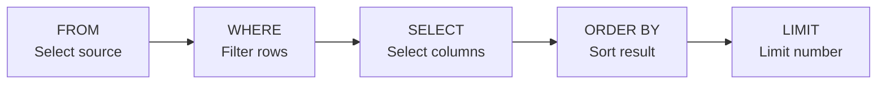
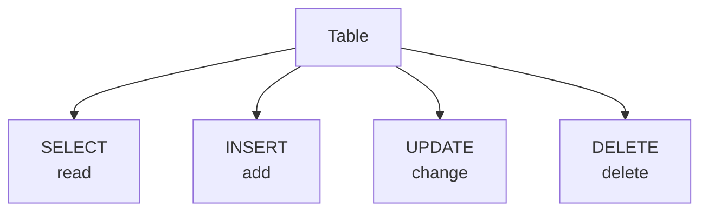

###### Topics

SQL Basics

- Understand structure and core idea of SQL commands
- Get to know simple data types in SQL

Querying and filtering data

- Select data with SELECT
- Filter results with WHERE
- Sort data with ORDER BY
- Limit result sets with LIMIT

Modifying data

- Add records with INSERT
- Change records with UPDATE
- Delete records with DELETE

<br><br><br>
# 🧱 SQL Basics

SQL stands for **Structured Query Language**. With SQL, you communicate with a **relational database**. This means: data is usually stored in **tables** made up of **columns** and **rows**. A column describes **what kind of information** is stored, and a row is a **concrete record**.

For example, if you have a `products` table, it might have columns like these:

| id | name | category | price | stock |
|---|---|---|---:|---:|
| 1 | Keyboard | Hardware | 49.90 | 15 |
| 2 | Mouse | Hardware | 19.90 | 42 |
| 3 | Monitor | Hardware | 249.00 | 8 |

At its core, SQL is the language you use to:

- **query**
- **filter**
- **sort**
- **insert**
- **update**
- **delete**

such data.

A key point for your technical understanding is: **SQL is declarative**. This means you tell the database **what** you want, not in detail **how** it should be computed internally. When you write `SELECT name FROM products`, you are only describing the desired result. The database takes care of execution. This is one of the most important ways of thinking in SQL.

<br><br><br>
## 🧠 Understanding the structure and core idea of SQL commands

An SQL command mostly consists of **clear building blocks**, each fulfilling a specific task. For queries, this often looks like:

```sql
SELECT name, price
FROM products
WHERE price < 100
ORDER BY price ASC
LIMIT 5;
```

This command simply means:

- **SELECT**: Which columns do you want to see?
- **FROM**: From which table should the data come?
- **WHERE**: Which rows should be included?
- **ORDER BY**: In what order should the results appear?
- **LIMIT**: How many results should be shown at most?

`SELECT` is the SQL command for retrieving data from one or more tables ([SELECT](https://www.postgresql.org/docs/current/sql-select.html)).

Important: Not every command needs every part. `WHERE`, `ORDER BY`, and `LIMIT` are often **optional**. `SELECT` and `FROM` are nearly always the core in simple queries.

<br><br><br>
### 🧭 The core idea: SQL reads almost like a question

This is why SQL is so popular: often, it reads like a small description. Look at this command:

```sql
SELECT name
FROM products
WHERE category = 'Hardware';
```

You can almost read that in plain language:

> Select the name from the table `products`, but only where the category is `Hardware`.

This “think in building blocks” approach is the most important foundation. When you learn SQL, don't just memorize terms but understand:

1. **What data source** is used?
2. **What data** should be shown?
3. **What conditions** apply?
4. **How** should the result look?

This is much more valuable than rote memorization.

<br><br><br>
### 🧱 Typical basic structure of an SQL command

Here is a very general pattern:

```sql
SELECT column1, column2
FROM tablename
WHERE condition
ORDER BY column1
LIMIT 10;
```

Order matters. Though SQL has many possibilities, this structure appears over and over.

A few practical rules will help you a lot at the beginning:

- **SQL keywords** like `SELECT`, `FROM`, `WHERE` are usually written in uppercase to improve code readability. This is not mandatory in most systems.
- **Text values** are usually in **single quotes**, e.g., `'Hardware'`.
- **Numbers** are written without quotes, e.g., `100`.
- A **semicolon** `;` often ends the command, especially in SQL tools or scripts.

<br><br><br>
### 🔄 The order in which SQL "thinks"

Here is something that confuses many beginners: The order in which you **write** SQL is not quite the same as the order in which the database **evaluates** the logic.

You usually write:

```sql
SELECT ...
FROM ...
WHERE ...
ORDER BY ...
LIMIT ...
```

But mentally, the evaluation happens more like this:

1. **FROM** – which table does the data come from?
2. **WHERE** – which rows are left?
3. **SELECT** – which columns are output?
4. **ORDER BY** – how is it sorted?
5. **LIMIT** – how many rows are shown at the end?

This is an extremely helpful mental model, as it helps you understand why a query gives a particular result.



<br><br><br>
### 🧠 Why understanding structure is so important

If you learn SQL as just a list of commands, you'll soon forget it. But if you understand that an SQL command almost always consists of the same logical parts, everything gets much easier.

Especially in the core tech fundamentals, this is crucial: You don't want to just "know that `WHERE` filters", but develop a feeling for **where** `WHERE` sits in the overall structure and **what role** it plays in the data flow.

That's true technical understanding.

<br><br><br>
## 🧾 Get to know simple data types in SQL

Every column in a table has a **data type**. The data type determines **what type of values** can be stored there. The database uses this information to store, validate, and process data correctly. PostgreSQL describes data types as the foundation for what kind of data can be stored ([Data Types](https://www.postgresql.org/docs/current/datatype.html)).

Simply put:

- A column for prices should be a **numeric type**.
- A column for names should be a **text type**.
- A column for a date should be a **date type**.

If you choose data types properly, you'll get fewer errors and more useful queries.

<br><br><br>
### 🔢 Common simple SQL data types

Names sometimes differ between database systems, but the basic idea is almost always the same.

| Data Type | Meaning | Example Value | Typical Use |
|---|---|---|---|
| `INT` / `INTEGER` | Whole numbers | `42` | IDs, counts, counters |
| `DECIMAL(p,s)` / `NUMERIC(p,s)` | Exact decimals | `19.99` | Prices, monetary values |
| `VARCHAR(n)` | Text with max length | `'Mouse'` | Names, titles, short texts |
| `TEXT` | Longer text | `'Product description'` | Free text, notes |
| `BOOLEAN` | True/false | `TRUE` / `FALSE` | active/inactive, yes/no |
| `DATE` | Calendar date | `'2026-03-24'` | Date of birth, order date |
| `TIMESTAMP` | Date and time | `'2026-03-24 14:30:00'` | Log entries, events |

For prices, an important type is `NUMERIC` or `DECIMAL`, because these types store **exact** decimal values ([Data Types](https://www.postgresql.org/docs/current/datatype.html)). For amounts of money, this is much better than an inaccurate floating-point value.

<br><br><br>
### 📝 Example of a table with data types

```sql
CREATE TABLE products (
    id INTEGER,
    name VARCHAR(100),
    category VARCHAR(50),
    price DECIMAL(10,2),
    stock INTEGER,
    active BOOLEAN,
    created_on DATE
);
```

You can see how data types fit the meaning of the column here:

- `id` is a whole number
- `name` is short text
- `price` is a decimal with two fractional digits
- `active` is true/false
- `created_on` is a date

This is not just formality. The database can better check whether a value makes sense. A `DATE` column should contain a date, not just any word.

<br><br><br>
### ❓ The special case: `NULL`

In addition to normal values, there is something very important in SQL: **`NULL`**.

`NULL` does not mean “0” nor “empty text”; it means: **There is no value present**. This distinction is central in SQL.

Examples:

- Price = `0` → the price is known and zero
- Name = `''` → the text is empty, but there is a value
- Delivery date = `NULL` → no date has been entered

Why is this important? Because `NULL` is **handled specially** in queries. You do not check with `= NULL`, but with `IS NULL` or `IS NOT NULL`.

Example:

```sql
SELECT name
FROM products
WHERE created_on IS NULL;
```

That's a typical beginner's mistake: `WHERE created_on = NULL` does not work as one might expect.

<br><br><br>
### 🧠 How to learn data types properly

When learning, don't just treat data types as a list. It's better to think like this:

- **What does the column mean content-wise?**
- **What operations do you want to perform with it later?**
- **How exact do the values need to be?**

A price is not just “a number”, but a value you want to calculate with and that must be exact. A date is not simply "text", but something you may want to later filter, sort, or calculate periods with.

Exactly this link between **meaning**, **storage**, and **later use** is what makes for good technical learning.

<br><br><br>
# 🔎 Querying and filtering data

Now we come to the part you work with most in SQL: **reading data**. The main tool is `SELECT`.

To keep the examples clear, we'll use this table as a mental basis:

```sql
products
```

with columns:

| id | name | category | price | stock | active | created_on |
|---|---|---|---:|---:|---|---|
| 1 | Keyboard | Hardware | 49.90 | 15 | TRUE | 2026-01-10 |
| 2 | Mouse | Hardware | 19.90 | 42 | TRUE | 2026-01-11 |
| 3 | Monitor | Hardware | 249.00 | 8 | TRUE | 2026-01-12 |
| 4 | Editor Pro | Software | 99.00 | 999 | FALSE | 2026-01-13 |

<br><br><br>
## 📥 Selecting data with `SELECT`

With `SELECT`, you choose **which columns** you want to see. `SELECT` returns rows from a table or multiple tables ([SELECT](https://www.postgresql.org/docs/current/sql-select.html)).

The simplest case:

```sql
SELECT name
FROM products;
```

Here you just get the `name` column.

If you want several columns:

```sql
SELECT name, price
FROM products;
```

Then the database only shows these two columns.

<br><br><br>
### 👀 `SELECT *` – select all columns

If you want to see all columns, you can use `*`:

```sql
SELECT *
FROM products;
```

The asterisk means: **take all columns**.

That's handy for a quick look. In real practice, though, you should often name the columns you need explicitly. This makes queries clearer and usually cleaner.

`SELECT *` is not “wrong”, but often not the best habit.

<br><br><br>
### 🏷️ Renaming columns with `AS`

Sometimes you want to give output a more meaningful name:

```sql
SELECT name AS product_name, price AS sale_price
FROM products;
```

Then, instead of `name` and `price`, the output shows your chosen labels. This is especially useful in reports, APIs, or more complex queries.

<br><br><br>
## 🧹 Filtering results with `WHERE`

With `WHERE`, you tell the database **which rows** you actually want. The `WHERE` clause filters rows based on a condition ([SELECT](https://www.postgresql.org/docs/current/sql-select.html)).

Example:

```sql
SELECT name, price
FROM products
WHERE price < 100;
```

This means: Show only products whose price is less than 100.

Without `WHERE`, you get all rows. With `WHERE`, the result shrinks to only the records that are relevant.

<br><br><br>
### ⚖️ Important comparison operators in `WHERE`

Here are the most important operators you'll almost always need:

| Operator | Meaning | Example |
|---|---|---|
| `=` | equal | `price = 19.90` |
| `<>` or `!=` | not equal | `category <> 'Software'` |
| `>` | greater than | `price > 100` |
| `<` | less than | `price < 100` |
| `>=` | greater or equal | `stock >= 10` |
| `<=` | less or equal | `stock <= 5` |

Examples:

```sql
SELECT *
FROM products
WHERE category = 'Hardware';
```

```sql
SELECT *
FROM products
WHERE stock <= 10;
```

```sql
SELECT *
FROM products
WHERE active = TRUE;
```

<br><br><br>
### 🔗 Combining multiple conditions

You can combine conditions with:

- `AND` → both conditions must be true
- `OR` → at least one condition must be true
- `NOT` → condition is negated

Example with `AND`:

```sql
SELECT name, price
FROM products
WHERE category = 'Hardware' AND price < 100;
```

This means: Only hardware products that cost less than 100.

Example with `OR`:

```sql
SELECT name
FROM products
WHERE category = 'Hardware' OR category = 'Software';
```

Example with `NOT`:

```sql
SELECT name
FROM products
WHERE NOT active = TRUE;
```

More readable:

```sql
SELECT name
FROM products
WHERE active = FALSE;
```

When mixing several conditions, parentheses are very helpful:

```sql
SELECT *
FROM products
WHERE (category = 'Hardware' OR category = 'Software')
  AND price < 100;
```

This makes your intent unambiguous.

<br><br><br>
### 🚫 Filtering with `NULL`

As explained above, `NULL` is treated specially in SQL. You filter for missing values like this:

```sql
SELECT *
FROM products
WHERE created_on IS NULL;
```

And for present values like this:

```sql
SELECT *
FROM products
WHERE created_on IS NOT NULL;
```

This is important because `= NULL` and `<> NULL` don't work like normal comparisons.

<br><br><br>
## ↕️ Sorting data with `ORDER BY`

With `ORDER BY`, you determine **the order** the result appears in. The `ORDER BY` clause sorts the returned rows ([SELECT](https://www.postgresql.org/docs/current/sql-select.html)).

A simple example:

```sql
SELECT name, price
FROM products
ORDER BY price;
```

By default, sorting is usually **ascending**, i.e., low to high. That's `ASC`.

Explicit ascending:

```sql
SELECT name, price
FROM products
ORDER BY price ASC;
```

Descending order:

```sql
SELECT name, price
FROM products
ORDER BY price DESC;
```

Then the most expensive product is listed first.

<br><br><br>
### 🧩 Sorting by multiple columns

You can sort by more than one criteria:

```sql
SELECT name, category, price
FROM products
ORDER BY category ASC, price DESC;
```

That means:

1. First by `category`
2. Within each category, by `price` descending

This is very useful for structured lists.

<br><br><br>
### 🧠 Why sorting is important from a business perspective

Without `ORDER BY`, you should **never assume** that data comes back in a particular order. A database only guarantees sorted results if you explicitly specify the sorting ([SELECT](https://www.postgresql.org/docs/current/sql-select.html)).

This is a core tech principle: **If order matters to you, you must define it explicitly**.

<br><br><br>
## ✂️ Limiting result sets with `LIMIT`

With `LIMIT`, you restrict **how many rows** are returned, at most. In PostgreSQL, `LIMIT` is part of the `SELECT` syntax ([SELECT](https://www.postgresql.org/docs/current/sql-select.html)).

Example:

```sql
SELECT *
FROM products
LIMIT 3;
```

Then you get up to three rows.

This is useful when you:

- just want to see a snippet
- want to query large tables in a test
- want to build previews or top lists

<br><br><br>
### 🎯 `LIMIT` almost always together with `ORDER BY`

A very important practical point: `LIMIT` without `ORDER BY` is often technically unsound if you expect a particular selection.

Example:

```sql
SELECT name, price
FROM products
ORDER BY price DESC
LIMIT 2;
```

That means: Show the **two most expensive products**.

Without `ORDER BY`, only this is clear: "Show some subset of two rows." Which two exactly is not reliably defined.

For proper learning, this difference is important: You should not only know syntax, but also understand **when a command makes business sense**.

<br><br><br>
### 🧠 Small note about database systems

`LIMIT` is common in many database systems, such as PostgreSQL, MySQL, and SQLite. Other systems or the SQL standard sometimes use alternatives like `FETCH FIRST ... ROWS ONLY` ([SELECT](https://www.postgresql.org/docs/current/sql-select.html)).

For the basics, however, `LIMIT` is a very good and widespread start.

<br><br><br>
# ✍️ Modifying data

So far we covered **reading** data. Now, let’s look at commands that actually **change** the stored data.

The three most important basic commands are:

| Command | Effect |
|---|---|
| `INSERT` | add new records |
| `UPDATE` | change existing records |
| `DELETE` | delete records |

These commands are powerful. That’s why you need to be especially careful with them.

A common misconception for beginners is: A `SELECT` query just displays something. An `INSERT`, `UPDATE`, or `DELETE`, in contrast, actually changes the database’s state.

<br><br><br>
## ➕ Adding records with `INSERT`

`INSERT` adds new rows to a table ([INSERT](https://www.postgresql.org/docs/current/sql-insert.html)).

The typical structure is:

```sql
INSERT INTO tablename (column1, column2, column3)
VALUES (value1, value2, value3);
```

A concrete example:

```sql
INSERT INTO products (id, name, category, price, stock, active, created_on)
VALUES (5, 'Webcam', 'Hardware', 79.90, 20, TRUE, '2026-01-20');
```

This writes a new record to the `products` table.

<br><br><br>
### 🧱 Why you should almost always specify the column list

It is possible to work without a column list in some cases, but for beginners and in real practice, this is often a needless risk.

Less readable might be:

```sql
INSERT INTO products
VALUES (5, 'Webcam', 'Hardware', 79.90, 20, TRUE, '2026-01-20');
```

The problem: then the order of values must **exactly** match the table’s structure. If the table changes later, something can easily go wrong.

Thus, it is almost always cleaner to write:

```sql
INSERT INTO products (id, name, category, price, stock, active, created_on)
VALUES (5, 'Webcam', 'Hardware', 79.90, 20, TRUE, '2026-01-20');
```

This form is clear, robust, and readable.

<br><br><br>
### 📦 Inserting multiple records at once

You can insert several rows in one command:

```sql
INSERT INTO products (id, name, category, price, stock, active, created_on)
VALUES
    (6, 'Headset', 'Hardware', 59.90, 12, TRUE, '2026-01-21'),
    (7, 'Docking Station', 'Hardware', 129.00, 7, TRUE, '2026-01-22');
```

This is often much more practical than many single `INSERT` commands in sequence.

<br><br><br>
## 🛠️ Changing records with `UPDATE`

`UPDATE` changes existing rows in a table ([UPDATE](https://www.postgresql.org/docs/current/sql-update.html)).

The basic form is:

```sql
UPDATE tablename
SET column1 = value1, column2 = value2
WHERE condition;
```

Example:

```sql
UPDATE products
SET price = 89.90
WHERE id = 5;
```

This changes the price for the product with `id` 5.

The crucial point here is the `WHERE` condition. It determines **which rows** are changed.

<br><br><br>
### ⚠️ The most important safety point for `UPDATE`

If you omit `WHERE`, **all rows** are updated. The SQL documentation points this out: without `WHERE`, an `UPDATE` affects all rows in the table ([UPDATE](https://www.postgresql.org/docs/current/sql-update.html)).

Example:

```sql
UPDATE products
SET active = FALSE;
```

This would set all products to inactive.

That’s why, with `UPDATE`, you should always briefly pause and ask yourself:

> Do I really want to change exactly these rows?

This control mindset is part of good technical practice.

<br><br><br>
### 🔧 Changing multiple columns at once

You can update several columns at once in a single `UPDATE`:

```sql
UPDATE products
SET price = 69.90,
    stock = 25,
    active = TRUE
WHERE id = 5;
```

This is useful when several values need updating together.

You can also reference existing values in `SET`, for example:

```sql
UPDATE products
SET stock = stock - 1
WHERE id = 5;
```

This means: Reduce the current stock by 1.

Here you can see that SQL not only stores data, but also logically manipulates it.

<br><br><br>
## 🗑️ Deleting records with `DELETE`

`DELETE` removes rows from a table ([DELETE](https://www.postgresql.org/docs/current/sql-delete.html)).

The basic form is:

```sql
DELETE FROM tablename
WHERE condition;
```

Example:

```sql
DELETE FROM products
WHERE id = 5;
```

This deletes just the record with `id = 5`.

<br><br><br>
### ⚠️ The most important safety point for `DELETE`

Again, if you leave out `WHERE`, **all rows** are deleted. The documentation notes that without `WHERE`, every row in the table is removed ([DELETE](https://www.postgresql.org/docs/current/sql-delete.html)).

Example:

```sql
DELETE FROM products;
```

The table itself usually remains, but its contents would be empty.

This is a classic error for beginners. Thus, you should get used to always double-checking the condition for `UPDATE` and `DELETE`.

<br><br><br>
### 🧠 A very good practical mindset before making changes

Especially at the start, this sequence is useful:

1. First use `SELECT` to check **which rows would be affected**
2. Then use that same filter in `UPDATE` or `DELETE`

Example:

```sql
SELECT *
FROM products
WHERE id = 5;
```

If that shows exactly the target row, you can then safely write:

```sql
DELETE FROM products
WHERE id = 5;
```

This is not just an exercise but a professional mindset: **first visualize, then change**.

<br><br><br>
## 🔗 How the commands are connected

If you look at the core commands as a whole, you get a neat mental model:



`SELECT` does not change anything, just reads.  
`INSERT`, `UPDATE`, and `DELETE`, by contrast, actually change the data ([SELECT](https://www.postgresql.org/docs/current/sql-select.html)) ([INSERT](https://www.postgresql.org/docs/current/sql-insert.html)) ([UPDATE](https://www.postgresql.org/docs/current/sql-update.html)) ([DELETE](https://www.postgresql.org/docs/current/sql-delete.html)).

If you really understand this model, you have already achieved a solid entry into SQL: you recognize which commands **display** data and which **permanently change** data. That is a central foundation for everything that follows in databases, backends, APIs, and data analysis.