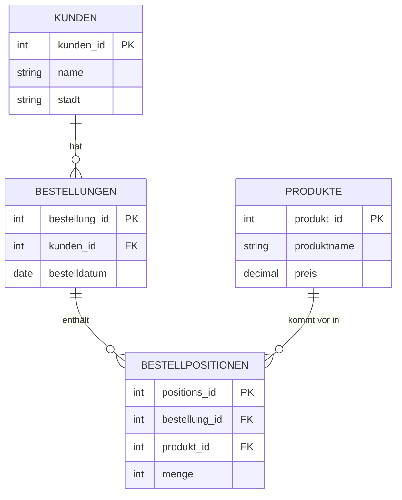

###### Topics

Querying Data from Multiple Tables

- Understand the basic idea of joins
- Apply INNER JOIN and LEFT JOIN in simple examples

Simple Analyses with SQL

- Group data with GROUP BY
- Use aggregate functions like COUNT, SUM, and AVG

Practical Application

- Apply simple SQL queries to a small sample data model
- Check results and recognize typical errors

<br><br><br>

# 🗃️ Querying Data from Multiple Tables

In real databases, information is almost never stored in just **one single table**. Instead, data is cleanly distributed across multiple tables. This isn't just for show—there is a very practical reason for this: It helps you avoid duplicate data, keeps information consistent, and allows more flexible evaluation. This core principle is called **normalization** in relational databases, i.e., working with relationships between tables ([PostgreSQL Documentation: `SELECT`](https://www.postgresql.org/docs/current/sql-select.html)).

Imagine, for example, a small online shop. If you write customers, orders, and products all into a single table, customer names, email addresses, and product information repeat constantly. This makes data confusing and error-prone. That's why you separate such information into several tables and link them when needed. This is exactly what **joins** are for.

<br><br><br>

## 🔗 The Basic Idea of Linking with `JOIN`

A `JOIN` connects rows from multiple tables based on a common column. In practice, this is usually a relationship between:

- a **primary key** (`PRIMARY KEY`) in one table
- and a **foreign key** (`FOREIGN KEY`) in another table

A primary key uniquely identifies a record. A foreign key references a record in another table. This creates a relationship between the tables.

Let's take this small sample data model:

<br><br><br>

### 🧱 Small Sample Data Model



Here, this means:

- One customer can have multiple orders.
- An order belongs to exactly one customer.
- An order can have multiple positions (line items).
- A position (line item) references exactly one product.

This kind of model is typical for relational databases.

<br><br><br>

### 🧾 Example Tables with Data

To make SQL queries more tangible, we work with simple sample data.

**Table `kunden`**

| kunden_id | name   | stadt   |
|----------:|--------|---------|
| 1         | Anna   | Berlin  |
| 2         | Ben    | Hamburg |
| 3         | Clara  | Cologne |

**Table `bestellungen`**

| bestellung_id | kunden_id | bestelldatum |
|--------------:|----------:|--------------|
| 101           | 1         | 2025-01-10   |
| 102           | 1         | 2025-01-15   |
| 103           | 2         | 2025-01-20   |

You can already see the relationship:

- `kunden.kunden_id` is the primary key of the customer table.
- `bestellungen.kunden_id` is the foreign key that points to the customer.

That means: Order `101` belongs to customer `1`, i.e., Anna.

<br><br><br>

## 🧠 Why You Need `JOIN` at All

If you look only at the `bestellungen` table, you see **which customer by ID** made an order, but not directly the customer's name. So if you want to know:

> “Which orders did Anna make?”

then you have to join `bestellungen` with `kunden`.

That's exactly what a `JOIN` does: It builds, at runtime, a view on the linked data. Important: a `JOIN` does not permanently change the tables. It only affects the result of your query.

<br><br><br>

## 🔍 `INNER JOIN` Simply Explained

An `INNER JOIN` returns **only those records that have a matching connection in both tables** ([PostgreSQL Documentation: `SELECT`](https://www.postgresql.org/docs/current/sql-select.html)).

In other words:

- If there is a record on the left but not a matching one on the right, it is excluded.
- If there is a record on the right but not a matching one on the left, it also does not appear.

<br><br><br>

### 🧪 Simple Example with `INNER JOIN`

```sql
SELECT
    k.name,
    b.bestellung_id,
    b.bestelldatum
FROM kunden k
INNER JOIN bestellungen b
    ON k.kunden_id = b.kunden_id;
```

**What happens here?**

- `FROM kunden k` says: Start with the table `kunden`.
- `INNER JOIN bestellungen b` says: Link it with `bestellungen`.
- `ON k.kunden_id = b.kunden_id` says: Connect the rows where the customer ID is the same.

**Result:**

| name  | bestellung_id | bestelldatum |
|-------|---------------|--------------|
| Anna  | 101           | 2025-01-10   |
| Anna  | 102           | 2025-01-15   |
| Ben   | 103           | 2025-01-20   |

Clara does **not** appear here, because she has no order. This is typical for an `INNER JOIN`: Only rows that actually match are shown.

<br><br><br>

### 👀 How to Read the `INNER JOIN` Intuitively

You can almost read the query like a sentence:

> Give me, from `kunden` and `bestellungen`, all combinations where `kunden_id` matches on both sides.

This is a great learning pattern: Don’t just read SQL as code—read it as an **instruction in plain language**.

<br><br><br>

## ↩️ `LEFT JOIN` Simply Explained

A `LEFT JOIN` returns **all rows from the left table** and adds matching data from the right. If nothing is found on the right, `NULL` values are returned ([PostgreSQL Documentation: `SELECT`](https://www.postgresql.org/docs/current/sql-select.html)).

This is the central difference to `INNER JOIN`:

- `INNER JOIN`: Only matches on both sides
- `LEFT JOIN`: Everything from the left, matches from the right if available

<br><br><br>

### 🧪 Simple Example with `LEFT JOIN`

```sql
SELECT
    k.name,
    b.bestellung_id,
    b.bestelldatum
FROM kunden k
LEFT JOIN bestellungen b
    ON k.kunden_id = b.kunden_id;
```

**Result:**

| name  | bestellung_id | bestelldatum |
|-------|---------------|--------------|
| Anna  | 101           | 2025-01-10   |
| Anna  | 102           | 2025-01-15   |
| Ben   | 103           | 2025-01-20   |
| Clara | NULL          | NULL         |

Now Clara also appears. Why? Because `kunden` is on the left, and the `LEFT JOIN` keeps all the left table's rows.

This is incredibly useful when you want to know:

- Which customers have placed orders?
- Which customers have **never** placed an order?
- Which products have **never** been sold?

<br><br><br>

### 🧭 When to Use `INNER JOIN` or `LEFT JOIN`?

| Situation | Appropriate Join |
|-----------|-----------------|
| You only want records with actual matches | `INNER JOIN` |
| You want all records from the left table, even without matches | `LEFT JOIN` |

A typical beginner's mistake is this:

> “I want to see all customers and, if available, their orders.”

Then `LEFT JOIN` is correct.

If you instead say:

> “I only want to see customers who have placed orders.”

Then `INNER JOIN` is suitable.

<br><br><br>

## ⚠️ The Importance of the `ON` Condition

The `ON` condition is key to joins. It defines **which rows actually belong together**.

Correct would be:

```sql
ON k.kunden_id = b.kunden_id
```

If you accidentally compare the wrong columns, you get wrong or far too many results.

For example, this would be problematic:

```sql
ON k.kunden_id = b.bestellung_id
```

That would be semantically nonsense because a customer ID is something different than an order ID. SQL may still execute the query, but the result would not make sense.

<br><br><br>

### 🧨 Typical Error: Join Without Proper Condition

When you combine tables without correctly connecting them, you can end up with a **Cartesian product**. That means each row from the first table is combined with each row from the second table, quickly resulting in way too many results ([PostgreSQL Documentation: `FROM`](https://www.postgresql.org/docs/current/sql-select.html)).

Example:

- 3 customers
- 3 orders

Without a proper join condition, this could become 9 rows.

This is one of the most common beginner errors.

<br><br><br>

## 🛠️ Joining Multiple Tables at Once

Joins are not limited to two tables. In practice, you often link three or more tables.

Let's take more sample data:

**Table `produkte`**

| produkt_id | produktname | preis |
|-----------:|-------------|------:|
| 10         | Keyboard    | 50.00 |
| 11         | Mouse       | 25.00 |
| 12         | Monitor     | 200.00 |

**Table `bestellpositionen`**

| positions_id | bestellung_id | produkt_id | menge |
|-------------:|--------------:|-----------:|------:|
| 1            | 101           | 10         | 1     |
| 2            | 101           | 11         | 2     |
| 3            | 102           | 12         | 1     |
| 4            | 103           | 11         | 1     |

Now you can build a query that brings together customers, orders, and products.

```sql
SELECT
    k.name,
    b.bestellung_id,
    p.produktname,
    bp.menge
FROM kunden k
INNER JOIN bestellungen b
    ON k.kunden_id = b.kunden_id
INNER JOIN bestellpositionen bp
    ON b.bestellung_id = bp.bestellung_id
INNER JOIN produkte p
    ON bp.produkt_id = p.produkt_id;
```

**Result:**

| name  | bestellung_id | produktname | menge |
|-------|---------------|-------------|------:|
| Anna  | 101           | Keyboard    | 1     |
| Anna  | 101           | Mouse       | 2     |
| Anna  | 102           | Monitor     | 1     |
| Ben   | 103           | Mouse       | 1     |

Here you can nicely see what a relational model brings: Every piece of information lives in its logical place, and through joins you can assemble it as needed.

<br><br><br>

# 📊 Simple Analyses with SQL

SQL is not just for displaying individual records. One of its greatest strengths is that you can very quickly **summarize, count, and calculate** data. This is where `GROUP BY` and aggregate functions come into play.

<br><br><br>

## 🧩 Grouping Data with `GROUP BY`

`GROUP BY` combines rows that have the same value in a specified column. Then you can perform calculations for each group, such as counting or summing ([PostgreSQL Documentation: `GROUP BY`](https://www.postgresql.org/docs/current/sql-select.html)).

A simple example:

```sql
SELECT
    kunden_id
FROM bestellungen
GROUP BY kunden_id;
```

This query groups all orders by customer. The result contains each `kunden_id` only once.

It gets more interesting with aggregate functions.

<br><br><br>

## 🔢 Aggregate Functions: `COUNT`, `SUM` and `AVG`

Aggregate functions calculate a value over several rows, for example:

- `COUNT(...)` counts
- `SUM(...)` adds up
- `AVG(...)` calculates the average

These functions are among the basic SQL aggregates ([PostgreSQL Documentation: Aggregate Functions](https://www.postgresql.org/docs/current/functions-aggregate.html)).

<br><br><br>

### 🔍 Using `COUNT`

With `COUNT` you can count rows.

```sql
SELECT COUNT(*) AS anzahl_bestellungen
FROM bestellungen;
```

**Result:**

| anzahl_bestellungen |
|--------------------:|
| 3                   |

This means: There are a total of 3 orders.

A subtle but important difference:

- `COUNT(*)` counts all rows
- `COUNT(column)` only counts rows where this column is **not `NULL`** ([PostgreSQL Documentation: Aggregate Functions](https://www.postgresql.org/docs/current/functions-aggregate.html))

This is very important, especially with `LEFT JOIN`.

<br><br><br>

### ➕ Using `SUM`

With `SUM`, you add up numeric values.

If you want to calculate the total revenue across positions, you must multiply price by quantity:

```sql
SELECT
    SUM(p.preis * bp.menge) AS gesamtumsatz
FROM bestellpositionen bp
INNER JOIN produkte p
    ON bp.produkt_id = p.produkt_id;
```

**Calculation in the background:**

- Keyboard: `50 * 1 = 50`
- Mouse: `25 * 2 = 50`
- Monitor: `200 * 1 = 200`
- Mouse: `25 * 1 = 25`

Total: `325`

**Result:**

| gesamtumsatz |
|-------------:|
| 325.00       |

<br><br><br>

### 📏 Using `AVG`

With `AVG` you calculate an average.

For example, the average product price:

```sql
SELECT
    AVG(preis) AS durchschnittspreis
FROM produkte;
```

**Calculation:**

- 50
- 25
- 200

Average = `(50 + 25 + 200) / 3 = 91.67`

**Result:**

| durchschnittspreis |
|-------------------:|
| 91.67              |

Also, `AVG` ignores `NULL` values in the calculation ([PostgreSQL Documentation: Aggregate Functions](https://www.postgresql.org/docs/current/functions-aggregate.html)).

<br><br><br>

## 🧠 Using `GROUP BY` and Aggregate Functions Together

Combining `GROUP BY` and aggregate functions gives you typical reporting queries.

For example:

> How many orders does each customer have?

```sql
SELECT
    kunden_id,
    COUNT(*) AS anzahl_bestellungen
FROM bestellungen
GROUP BY kunden_id;
```

**Result:**

| kunden_id | anzahl_bestellungen |
|----------:|--------------------:|
| 1         | 2                   |
| 2         | 1                   |

Customer `3` is missing because there is no row for Clara in `bestellungen`. If you want to **see customers without any order as well**, you need `LEFT JOIN`.

<br><br><br>

### 🔗 Grouping by Customer Name Instead of ID

Often you don’t want to see raw IDs, but meaningful information.

```sql
SELECT
    k.name,
    COUNT(b.bestellung_id) AS anzahl_bestellungen
FROM kunden k
LEFT JOIN bestellungen b
    ON k.kunden_id = b.kunden_id
GROUP BY k.name;
```

**Result:**

| name  | anzahl_bestellungen |
|-------|--------------------:|
| Anna  | 2                   |
| Ben   | 1                   |
| Clara | 0                   |

Here, the combination is nicely crafted:

- `LEFT JOIN` so all customers appear
- `COUNT(b.bestellung_id)` so only real orders are counted
- `GROUP BY k.name` so only one row per customer arises

Why `COUNT(b.bestellung_id)` and not `COUNT(*)`?  
Because `COUNT(*)` would also count Clara’s row created by the `LEFT JOIN`. `COUNT(b.bestellung_id)` only counts non-`NULL` values and thus correctly gives `0` instead of `1` ([PostgreSQL Documentation: Aggregate Functions](https://www.postgresql.org/docs/current/functions-aggregate.html)).

This is a classic stumbling block for beginners.

<br><br><br>

### 💶 Calculating Revenue Per Customer

Now it gets more realistic: We link multiple tables and calculate a total value per customer.

```sql
SELECT
    k.name,
    SUM(p.preis * bp.menge) AS umsatz
FROM kunden k
INNER JOIN bestellungen b
    ON k.kunden_id = b.kunden_id
INNER JOIN bestellpositionen bp
    ON b.bestellung_id = bp.bestellung_id
INNER JOIN produkte p
    ON bp.produkt_id = p.produkt_id
GROUP BY k.name;
```

**Result:**

| name | umsatz |
|------|-------:|
| Anna | 300.00 |
| Ben  | 25.00  |

**How does this come about?**

For Anna:

- Order 101:
  - Keyboard: `50 * 1 = 50`
  - Mouse: `25 * 2 = 50`
- Order 102:
  - Monitor: `200 * 1 = 200`

Total: `300`

For Ben:

- Order 103:
  - Mouse: `25 * 1 = 25`

Total: `25`

Clara does not appear because we use `INNER JOIN`. If you want to see all customers including those with revenue `0`, you need to use `LEFT JOIN` again.

<br><br><br>

### 📦 Quantity Sold per Product

```sql
SELECT
    p.produktname,
    SUM(bp.menge) AS verkaufte_menge
FROM produkte p
LEFT JOIN bestellpositionen bp
    ON p.produkt_id = bp.produkt_id
GROUP BY p.produktname;
```

**Result:**

| produktname | verkaufte_menge |
|-------------|----------------:|
| Keyboard    | 1               |
| Mouse       | 3               |
| Monitor     | 1               |

If there were products that were never sold, they would still appear thanks to `LEFT JOIN`. However, the sum would then often be `NULL`, not automatically `0`. In such cases, one often uses `COALESCE` to replace `NULL` with `0` ([PostgreSQL Documentation: Conditional Expressions](https://www.postgresql.org/docs/current/functions-conditional.html)).

Example:

```sql
SELECT
    p.produktname,
    COALESCE(SUM(bp.menge), 0) AS verkaufte_menge
FROM produkte p
LEFT JOIN bestellpositionen bp
    ON p.produkt_id = bp.produkt_id
GROUP BY p.produktname;
```

<br><br><br>

## 🧱 Important Rule for `GROUP BY`

When you use `GROUP BY`, usually the following applies in `SELECT`:

- Each column must either
  - appear in `GROUP BY`
  - or be calculated with an aggregate function

This rule is central to correct SQL ([PostgreSQL Documentation: `GROUP BY`](https://www.postgresql.org/docs/current/sql-select.html)).

A problematic example would be:

```sql
SELECT
    kunden_id,
    bestelldatum,
    COUNT(*)
FROM bestellungen
GROUP BY kunden_id;
```

Why is this problematic?

Because you're grouping by `kunden_id` but also selecting `bestelldatum`. For a customer, there can be several order dates. SQL then doesn’t know **which** date is meant.

So you must decide:

- Either also group by `bestelldatum`
- Or use an aggregate function like `MIN(bestelldatum)` or `MAX(bestelldatum)`

For example:

```sql
SELECT
    kunden_id,
    MIN(bestelldatum) AS erste_bestellung,
    COUNT(*) AS anzahl_bestellungen
FROM bestellungen
GROUP BY kunden_id;
```

<br><br><br>

## 🎯 Understanding `WHERE` and `GROUP BY` Together

A very important point when learning SQL is the processing order:

1. Select data (`FROM`, `JOIN`)
2. Filter rows (`WHERE`)
3. Form groups (`GROUP BY`)
4. Evaluate groups (aggregate functions)
5. Sort the result (`ORDER BY`)

This logical processing order helps a lot in understanding SQL ([PostgreSQL Documentation: `SELECT`](https://www.postgresql.org/docs/current/sql-select.html)).

This means specifically:

- `WHERE` filters **before** grouping
- `GROUP BY` then forms the groups

Example:

> Count only orders from January 15, 2025, onwards per customer.

```sql
SELECT
    kunden_id,
    COUNT(*) AS anzahl
FROM bestellungen
WHERE bestelldatum >= '2025-01-15'
GROUP BY kunden_id;
```

Here only the relevant orders are considered first, then grouped.

<br><br><br>

### 🚦 If You Want to Filter Groups: `HAVING`

Even though you specifically asked about `GROUP BY`, `COUNT`, `SUM`, and `AVG`, there’s a related point: **`HAVING`**. `HAVING` does not filter individual rows, but **entire groups** after aggregation ([PostgreSQL Documentation: `HAVING`](https://www.postgresql.org/docs/current/sql-select.html)).

Example:

> Show only customers with more than one order.

```sql
SELECT
    kunden_id,
    COUNT(*) AS anzahl_bestellungen
FROM bestellungen
GROUP BY kunden_id
HAVING COUNT(*) > 1;
```

**Result:**

| kunden_id | anzahl_bestellungen |
|----------:|--------------------:|
| 1         | 2                   |

Why not `WHERE COUNT(*) > 1`?  
Because `WHERE` works before grouping and aggregate functions cannot be filtered there in the same way. For conditions on groups, use `HAVING`.

<br><br><br>

# 🧪 Practical Application to a Small Sample Data Model

Now we put it all together: joins, grouping, aggregation, and result checking.

<br><br><br>

## 🗂️ The Complete Small Sample Data Model

Here are the tables again, compactly:

**`kunden`**

| kunden_id | name  | stadt   |
|----------:|-------|---------|
| 1         | Anna  | Berlin  |
| 2         | Ben   | Hamburg |
| 3         | Clara | Cologne |

**`bestellungen`**

| bestellung_id | kunden_id | bestelldatum |
|--------------:|----------:|--------------|
| 101           | 1         | 2025-01-10   |
| 102           | 1         | 2025-01-15   |
| 103           | 2         | 2025-01-20   |

**`produkte`**

| produkt_id | produktname | preis |
|-----------:|-------------|------:|
| 10         | Keyboard    | 50.00 |
| 11         | Mouse       | 25.00 |
| 12         | Monitor     | 200.00 |

**`bestellpositionen`**

| positions_id | bestellung_id | produkt_id | menge |
|-------------:|--------------:|-----------:|------:|
| 1            | 101           | 10         | 1     |
| 2            | 101           | 11         | 2     |
| 3            | 102           | 12         | 1     |
| 4            | 103           | 11         | 1     |

<br><br><br>

## 🔎 Typical Simple SQL Queries on this Model

<br><br><br>

### 👤 Show All Customers with Their Orders

```sql
SELECT
    k.name,
    b.bestellung_id,
    b.bestelldatum
FROM kunden k
LEFT JOIN bestellungen b
    ON k.kunden_id = b.kunden_id
ORDER BY k.name, b.bestelldatum;
```

This query is useful when you want to check:

- which customers have orders
- which customers have no orders
- whether the customer ↔ order linkage is correct

The result should include Clara, but with `NULL` for the order columns.

<br><br><br>

### 📦 Show All Products per Order

```sql
SELECT
    b.bestellung_id,
    p.produktname,
    bp.menge,
    p.preis,
    p.preis * bp.menge AS positionswert
FROM bestellungen b
INNER JOIN bestellpositionen bp
    ON b.bestellung_id = bp.bestellung_id
INNER JOIN produkte p
    ON bp.produkt_id = p.produkt_id
ORDER BY b.bestellung_id, p.produktname;
```

This query is practical for checking:

- if all positions of an order are linked correctly
- if price and quantity are plausible
- if the intermediate calculation is correct

<br><br><br>

### 💰 Calculate the Total Value of Each Order

```sql
SELECT
    b.bestellung_id,
    SUM(p.preis * bp.menge) AS bestellwert
FROM bestellungen b
INNER JOIN bestellpositionen bp
    ON b.bestellung_id = bp.bestellung_id
INNER JOIN produkte p
    ON bp.produkt_id = p.produkt_id
GROUP BY b.bestellung_id
ORDER BY b.bestellung_id;
```

**Result:**

| bestellung_id | bestellwert |
|--------------:|------------:|
| 101           | 100.00      |
| 102           | 200.00      |
| 103           | 25.00       |

You can easily check the values by hand:

- Order 101 = 50 + 50 = 100
- Order 102 = 200
- Order 103 = 25

Doing this manual check is great practice while learning: Don’t trust SQL blindly, but check the results with a quick hand calculation.

<br><br><br>

### 🧑‍🤝‍🧑 Number of Orders Per Customer

```sql
SELECT
    k.name,
    COUNT(b.bestellung_id) AS anzahl_bestellungen
FROM kunden k
LEFT JOIN bestellungen b
    ON k.kunden_id = b.kunden_id
GROUP BY k.name
ORDER BY anzahl_bestellungen DESC, k.name;
```

This query nicely shows the difference between `LEFT JOIN` and `COUNT(column)`.

- Anna → 2
- Ben → 1
- Clara → 0

If you used `INNER JOIN` here, Clara would disappear.  
If you used `COUNT(*)` instead of `COUNT(b.bestellung_id)`, Clara could be incorrectly counted as `1`. This is a classic case.

<br><br><br>

### 🏷️ Average Quantity per Position

If you want to see how `AVG` works with real data, you can calculate the average of the ordered quantities per order position:

```sql
SELECT
    AVG(menge) AS durchschnittliche_menge
FROM bestellpositionen;
```

**Calculation:**

- 1
- 2
- 1
- 1

Average = `1.25`

This is not a deep business metric, but it's a very good learning example for `AVG`.

<br><br><br>

## 🧠 Checking Results: How to Recognize if a Query is Plausible

Especially for beginners, writing SQL syntax isn't the hardest part—it's **carefully checking** whether the result makes business sense.

Some simple principles can help.

<br><br><br>

### 🧾 First Check the Number of Rows

The number of rows often immediately indicates if a join is correct.

Example:

- `kunden` has 3 rows
- `bestellungen` has 3 rows

When you `INNER JOIN` the two, you expect 3 result rows, since each order belongs to exactly one customer.

If you suddenly see 6 or 9 rows, that's a warning sign. Usually, the join condition is wrong or you accidentally produced duplicate rows.

<br><br><br>

### 🔍 Deliberately Check Key Columns

Always ask yourself:

- Which column is the primary key?
- Which column is the foreign key?
- Am I really joining logically matching fields?

Good SQL queries are not just syntactically correct, but also **semantically clean**. A technically valid join can still be semantically wrong.

<br><br><br>

### 🧮 Check Sums and Counts by Hand

When a query concerns only a few rows, do the arithmetic yourself.

For example, for revenue per customer:

- Anna = 50 + 50 + 200 = 300
- Ben = 25

If SQL returns 325 for Anna, you know: Somewhere, rows have been double-counted.

This manual plausibility check is one of the best methods for really learning SQL.

<br><br><br>

### 🕳️ Watch for `NULL` Values

`NULL` is not `0`, nor is it an empty string. It means “no value present.” This is an important SQL principle ([PostgreSQL Documentation: `NULL` and Aggregates](https://www.postgresql.org/docs/current/functions-aggregate.html)).

With `LEFT JOIN`, you often get `NULL` values on the right side. Their effects:

- `COUNT(column)` ignores `NULL`
- `SUM(column)` can return `NULL` when there are no values
- `AVG(column)` ignores `NULL`

So, analyses using `LEFT JOIN` are often only clean if you deliberately think about `NULL`.

<br><br><br>

## ⚠️ Typical Mistakes and How to Identify Them

<br><br><br>

### ❌ Error 1: Wrong Join Type

You want to see all customers but use `INNER JOIN`.

```sql
SELECT
    k.name,
    b.bestellung_id
FROM kunden k
INNER JOIN bestellungen b
    ON k.kunden_id = b.kunden_id;
```

Then Clara is missing.  
If your business goal is “all customers including those with no order,” the result is wrong, even though the SQL syntax is correct.

**Takeaway:** Not only syntax must be right, but also the business intent.

<br><br><br>

### ❌ Error 2: Wrong Use of `COUNT(*)` with `LEFT JOIN`

```sql
SELECT
    k.name,
    COUNT(*) AS anzahl
FROM kunden k
LEFT JOIN bestellungen b
    ON k.kunden_id = b.kunden_id
GROUP BY k.name;
```

The problem: With `LEFT JOIN`, there is still a row for Clara. `COUNT(*)` includes this. So Clara may appear as `1`, even though she has made no order.

Correct here is usually:

```sql
COUNT(b.bestellung_id)
```

Because only real orders are counted.

<br><br><br>

### ❌ Error 3: Ungrouped Column in `SELECT`

```sql
SELECT
    k.name,
    b.bestelldatum,
    COUNT(*)
FROM kunden k
INNER JOIN bestellungen b
    ON k.kunden_id = b.kunden_id
GROUP BY k.name;
```

Here you're grouping by name but also selecting `bestelldatum`, which is neither aggregated nor grouped. That is logically ambiguous and leads to errors or problematic results depending on your database ([PostgreSQL Documentation: `GROUP BY`](https://www.postgresql.org/docs/current/sql-select.html)).

<br><br><br>

### ❌ Error 4: Totals Skewed by Multiple Joins

When you join multiple tables, a row from one table may appear multiple times. This isn’t necessarily wrong, but you have to understand it.

Example: An order with two positions will appear twice after joining with `bestellpositionen`. If you then count or sum naively, you may inadvertently double values.

So you should always ask:

- On which business level am I working?
- Am I counting orders?
- Am I counting positions?
- Am I summing product values?
- Or am I counting, after a join, accidentally multiplied rows?

This is one of the most important thought processes in SQL.

<br><br><br>

### ❌ Error 5: `WHERE` Instead of `HAVING` for Grouped Results

A wrong way of thinking would be:

```sql
SELECT
    kunden_id,
    COUNT(*) AS anzahl
FROM bestellungen
WHERE COUNT(*) > 1
GROUP BY kunden_id;
```

This does not work as intended, because `WHERE` operates before aggregation.

Correct:

```sql
SELECT
    kunden_id,
    COUNT(*) AS anzahl
FROM bestellungen
GROUP BY kunden_id
HAVING COUNT(*) > 1;
```

<br><br><br>

### ❌ Error 6: Unclear Column Names without Aliases

If several tables have the same column, e.g., `kunden_id`, you need to use prefixes or aliases clearly.

Better:

```sql
SELECT
    k.name,
    b.bestellung_id
FROM kunden k
INNER JOIN bestellungen b
    ON k.kunden_id = b.kunden_id;
```

Instead of an unclear notation without table prefix.

Aliases such as `k`, `b`, `bp`, `p` make longer queries much more readable. It's not a must, but it’s good practice.

<br><br><br>

## 🧭 How to Cleanly Build Such SQL Queries in Your Mind

While learning, it helps to break each query into four questions.

<br><br><br>

### 🪜 Step 1: Which Table Is My Starting Point?

First, ask yourself:

> From which table do I basically want all rows?

- All customers? Then start with `kunden`
- All orders? Then start with `bestellungen`
- All products? Then start with `produkte`

This choice often influences whether `INNER JOIN` or `LEFT JOIN` is appropriate.

<br><br><br>

### 🔌 Step 2: Which Tables Do I Need to Join?

If you want to see customer names and order numbers, you need:

- `kunden`
- `bestellungen`

If you also want to see product names, you'll need:

- `bestellpositionen`
- `produkte`

SQL gets much easier if you first map the data model in your mind.

<br><br><br>

### 🧮 Step 3: Do I Want Details or Aggregated Results?

This is a central difference:

- **Detail query**: shows individual records
- **Analysis**: summarizes data

Examples:

- Detail query: “Which products are in order 101?”
- Analysis: “What is the order value of order 101?”

As soon as you count, sum, or average, you’re moving toward aggregation and often also `GROUP BY`.

<br><br><br>

### 🧪 Step 4: Is the Result Plausible from a Business Perspective?

At the end always ask:

- Is the number of rows correct?
- Are expected records missing?
- Are totals too high?
- Are `NULL` values logical?
- Do groupings fit my question?

Learning SQL is not just about learning syntax. It is, above all, about **structured thinking about data**.

<br><br><br>

# 🧠 Learning Joins and Evaluation Properly

Because your main context also includes “Core Tech Fundamentals & proper learning,” here’s an important didactic point: Many people learn SQL too early as a collection of commands. It's better to understand SQL on three levels.

<br><br><br>

## 🧱 Level 1: Understand the Data Model

Before you write any query, you should be able to answer:

- Which tables are there?
- Which table stores what?
- Which keys link the tables?
- What kind of relationship exists: 1:1, 1:n, or n:m?

If this level is unclear, joins almost always seem confusing.

<br><br><br>

## 🔄 Level 2: Understand the Query’s Data Flow

A good SQL query is not an incantation. It follows a clear sequence:


If you have this sequence in mind, it’s much easier to understand:

- why `WHERE` comes before `GROUP BY`
- why `HAVING` filters groups
- why `LEFT JOIN` produces `NULL`
- why aggregation sometimes gives surprising results

<br><br><br>

## 🎯 Level 3: Actively Question Results

Progress in SQL does not just happen because you can write a query, but because you can **check and explain it**.

A really good habit is:

> “Can I explain every row of my result?”

If yes, then you understand the query.  
If not, that’s a sign you should go through the join, grouping, or aggregation step by step again.

That’s not a sign of weakness, but exactly the kind of precise thinking needed with databases.