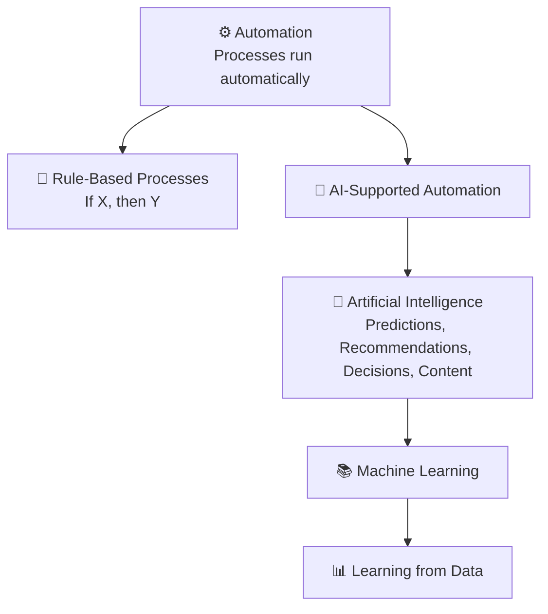

###### Topics

Basics of Artificial Intelligence

- Fundamentally understand the terms Artificial Intelligence, Machine Learning, and Automation
- Distinguish and relate the differences and connections between AI, ML, and Automation

Application Examples and Fields of Use

- Get to know typical uses of AI in everyday life and at work
- Easily assess the opportunities and limitations of AI applications

   
# 🤖 Basics of Artificial Intelligence

If you want to understand the topic of **Artificial Intelligence** clearly for the first time, a very simple idea helps:

**Not everything that runs automatically is AI. Not every AI learns for itself. And Machine Learning is only a part of AI.**

This distinction is important because the terms are often mixed up in everyday life. Many say “That’s AI,” when in reality it’s just a programmed automation system. Others say “Machine Learning,” when they actually mean AI in general.

So you can categorize this confidently, let’s look at the three terms one at a time.

   
## 🧠 What is Artificial Intelligence?

**Artificial Intelligence**, or **AI**, is an umbrella term for computer systems that can generate meaningful outputs based on inputs, such as **predictions, recommendations, classifications, decisions, or generated content**. The OECD also refers to such outputs in its definition of AI systems ([Recommendation of the Council on Artificial Intelligence](https://legalinstruments.oecd.org/en/instruments/OECD-LEGAL-0449)).

Simply put:

AI aims to solve tasks for which human abilities used to be needed, for example:

- Understanding language
- Recognizing images
- Finding patterns in data
- Supporting decisions
- Generating texts
- Assessing risks

Important to note: **AI is not a single program** but rather a **category of methods and systems**.

A navigation system that predicts traffic jams, image recognition in medicine, a voice assistant, or a recommendation system on Netflix or Spotify—these can all fall under AI if the system does not just strictly follow rules, but instead analyzes inputs and generates suitable outputs.

   
### 🧩 What AI Does Not Automatically Mean

People often imagine AI as something human-like, almost like a digital head with consciousness. That’s misleading.

In practice, AI typically means **specialized systems** trained or built for specific tasks. A system might be excellent at recognizing faces, but have no understanding at all of mathematics, everyday life, or common sense.

That’s why it’s important not to equate AI with real human intelligence. Most current AI systems are **narrowly specialized for individual tasks**.

   
## 📚 What is Machine Learning?

**Machine Learning**, in German **maschinelles Lernen**, is a **subfield of Artificial Intelligence**. Here, systems are not just controlled by fixed rules; they **learn patterns from data**. This is exactly the concept described in Google’s Machine Learning Glossary: An ML system trains a model based on input data ([Machine Learning Glossary](https://developers.google.com/machine-learning/glossary#machine_learning)).

Simply put:

- With traditional programming, a person writes many rules.
- With Machine Learning, the system receives many examples.
- From these examples it learns a pattern.
- This pattern is then applied to new cases.

A classic example is a spam filter:

In the past, you might have written rules like:

- If the email contains “free,” then spam.
- If the email has ten exclamation points, then spam.

That’s rule-based.

A Machine Learning system, on the other hand, receives many emails already marked as “spam” or “not spam.” It then learns for itself which features are often associated with spam.

The key point is:

**Machine Learning learns from data instead of just executing fixed rules.**

   
### 🧪 Typical Idea Behind Machine Learning

An ML system looks at many examples and searches for correlations:

- Which words often appear in spam?
- Which features are often seen in pictures of cats?
- Which customers often buy a certain product?
- Which movement data suggest a machine failure?

The system builds a **model** from this. This model, simply put, is a mathematical structure that maps patterns and makes an estimate or a decision with new data.

Important: The system does not “understand” the world like a human. It mainly recognizes **statistical patterns**.

   
### 🧭 Why Machine Learning Is So Important in Practice

Many modern AI applications are based on Machine Learning because some problems can’t be solved well with rigid rules.

For example:

How do you program every single rule to recognize a face?

That’s almost impossible because faces in photos are differently lit, at an angle, partially covered, or look different. With Machine Learning, you can instead show the system many images of faces so it learns typical patterns.

That’s why ML is so central for:

- Image recognition
- Speech recognition
- Translation
- Fraud detection
- Recommendation systems
- Predictions

   
## ⚙️ What is Automation?

**Automation** means that tasks or processes are carried out by technology so that less human intervention is needed. That’s exactly how basic introductions to automation describe it, such as from Red Hat: Technology takes over processes with as little manual work as possible ([What is automation?](https://www.redhat.com/en/topics/automation/what-is-automation)).

Simply put:

Automation means:

**A process runs by itself because it was defined beforehand.**

This can be very simple or very complex.

Examples:

- A washing machine runs a program.
- An email system automatically sends a confirmation after an order.
- A traffic light system switches based on fixed time rules.
- A backup runs automatically every night.
- An invoice is generated automatically by a defined workflow.

Here’s the core:

**Automation doesn’t have to be intelligent.**

A system can do something automatically without learning, understanding, or flexibly evaluating anything.

   
### 🔧 Rule-Based Automation

Many automations operate according to this scheme:

**If X happens, then do Y.**

For example:

- When a customer submits a form, send a confirmation email.
- If stock falls below 20, reorder.
- If a sensor value exceeds a threshold, stop the machine.

This is very useful, but it’s not AI. It’s more like **structured, plannable process control**.

   
## 🔗 Differences and Connections Between AI, ML, and Automation

Now for the most important part: How are the three terms related?

You can remember it like this:

- **Automation** = Something runs automatically.
- **AI** = A system makes “intelligent-seeming” outputs like predictions, classifications, or recommendations.
- **Machine Learning** = A method within AI where the system learns patterns from data.

Or even simpler:

- **Automation** asks: *How can a process run without constant manual work?*
- **AI** asks: *How can a system make tough decisions or assessments?*
- **ML** asks: *How can a system learn such assessments from data?*

   
### 📊 Comparison in a Table

| Term | Simple Meaning | Works with Fixed Rules? | Learns from Data? | Typical Example |
|---|---|---:|---:|---|
| Automation | A process runs automatically | often yes | no, not necessarily | Automatic invoice generation |
| Artificial Intelligence | System generates predictions, recommendations, decisions, or content | sometimes | sometimes | Voice assistant, image recognition |
| Machine Learning | Subfield of AI that learns patterns from data | not primarily | yes | Spam detection, product recommendation |

   
### 🧠 The Most Common Misconception

The most common mistake is:

**Automation is confused with AI.**

Example:

An online shop automatically sends an email after each order.  
That’s **automation**, not AI.

If the same shop predicts based on past purchases which products might interest you, that’s **AI**.  
If the system learned this prediction from historical customer data, then that's **Machine Learning**.

   
### 🔄 How the Terms Work Together

In real systems, these things are often combined.

An example from customer service:

1. A customer inquiry comes in.
2. An AI model recognizes the topic of the message.
3. An ML model assesses the urgency.
4. Automation forwards the ticket to the right team.
5. An automatic response is sent.

Here you see:

- **AI** helps with assessment.
- **ML** supplies the learned patterns behind it.
- **Automation** ensures the process continues without manual input.

   
### 🗺️ Visualization: The Relationship Between AI, ML, and Automation

The graphic shows something important:

- **Machine Learning belongs to AI**
- **AI can be part of automation**
- **Automation can also exist completely without AI**

   
### 🏗️ A Very Memorable Everyday Image

Imagine a factory or an office:

- **Automation** is the assembly line or workflow.
- **AI** is the part that decides or assesses.
- **ML** is the method by which this decisive part has learned from examples.

This makes it easy to keep the terms straight.

---

   
# 🌍 Application Examples and Fields of Use

AI is no longer just a topic of research. It’s already built into everyday digital services and many professional processes. Often you don’t even notice that you’re interacting with AI.

Important: AI isn’t always deployed as a big, visible system. It often works in the background, supporting other applications.

   
## 🏠 Typical Uses of AI in Everyday Life

In daily life, you often encounter AI in small, very practical features.

   
### 📱 Smartphone and Personal Devices

Many smartphones use AI for:

- **Face recognition or object recognition** in photos
- **Voice assistants**
- **Text suggestions and autocorrect**
- **Camera optimization**, such as night mode or automatic scene detection
- **Speech recognition** for dictation

Here, the system analyzes images, speech, or user behavior and generates suitable outputs.

A voice assistant is a good example of the combination of several AI components:

- Speech is recognized
- Meaning is interpreted
- A suitable answer is generated or an action started

   
### 🎬 Media, Entertainment, and Recommendations

Streaming services, music platforms, and online shops often use AI for **recommendation systems**.

The goal is:

- to figure out what might interest you
- to organize content accordingly
- to present search results more personally

If you are suggested similar movies after one, often AI is behind the scenes. The system analyzes for example:

- your past behavior
- similarities between items
- behavior of similar user groups

This is a typical application of ML because patterns are learned from lots of usage data.

   
### 📧 Communication and Internet Services

A very widespread example is **spam detection** in email services.

Here, too, AI helps classify messages:

- Spam
- Likely important
- Advertising
- Phishing attempt

Such systems need to keep dealing with new patterns, as spam and scam attempts are constantly changing. That’s exactly where Machine Learning is especially suitable.

   
### 🚗 Navigation and Mobility

Maps and navigation services use AI to:

- Assess traffic situations
- Predict arrival times
- Recommend better routes
- Recognize patterns in movement data

Huge volumes of data come into play here, such as jams, road closures, historical travel times, and current traffic data.

The system doesn’t make “human” decisions, but uses AI methods to make very useful predictions.

   
## 💼 Typical Uses of AI at Work

In the work environment, AI is especially strong where large amounts of data need to be processed or quick assessments are needed.

   
### 🏢 Office, Administration, and Knowledge Work

In office and administrative processes, AI is often used for:

- Automatic document analysis
- Sorting and classification of emails
- Text creation and drafts
- Meeting summaries
- Search in large knowledge bases
- Support in customer service

Example:

A company receives thousands of inquiries every day. AI can recognize if it’s about an invoice, a technical error, or a contract question. Automation then forwards it to the right department.

This is a good example of the interplay between AI and automation.

   
### 🛒 Retail and E-Commerce

In retail, AI helps with:

- Demand forecasts
- Price optimization
- Product recommendations
- Inventory planning
- Detecting fraud in payments
- Analyzing customer feedback

If a system estimates which products will soon run low or which products are often purchased together, these are often ML-based predictions.

   
### 🏭 Industry and Manufacturing

AI is especially exciting in industry because it not only analyzes data, but often brings real economic benefits.

Typical applications are:

- **Predictive maintenance**: detect machine problems before a failure happens
- **Quality control**: detect defects in images or sensor data
- **Process optimization**: improve energy consumption, material use, or runtimes
- **Robotics**: improve movements and handling

In predictive maintenance, for example, a system analyzes vibration, temperature, or noises and learns which patterns indicate an impending defect.

   
### 🏥 Medicine and Health

In healthcare, AI can help

- Analyze medical images
- Detect risks earlier
- Support documentation
- Find patterns in large datasets

Especially important here: AI does not automatically find “the truth.” In sensitive areas, it must be carefully verified. That’s why NIST emphasizes that trustworthy AI must be **valid, reliable, secure, transparent, and manageable** ([Artificial Intelligence Risk Management Framework (AI RMF 1.0)](https://nvlpubs.nist.gov/nistpubs/ai/NIST.AI.100-1.pdf)).

In practice, this means: Especially in medicine, AI usually may not simply decide uncontrolled, but often serves as a **support system**.

   
### 💬 Customer Service and Communication

Chatbots and assistant systems are now a very visible area.

They can:

- Answer frequent questions
- Pre-sort inquiries
- Explain forms
- Solve simple standard problems
- Pass cases on to humans when things get complex

Important: A good AI chatbot is not just “a bot.” It often needs several components:

- Language understanding
- Knowledge access
- Response generation
- Security rules
- Escalation to humans

   
## 🗂️ Examples by Field in an Overview

| Area | Typical AI Application | What the AI Does |
|---|---|---|
| Daily life / Smartphone | Voice assistant | Recognize speech and derive intent |
| Daily life / Email | Spam filter | Classify messages |
| Daily life / Streaming | Recommendations | Analyze usage data and make suggestions |
| Navigation | Route prediction | Analyze traffic data and estimate travel time |
| Office | Document classification | Recognize and assign contents |
| Customer service | Chatbot | Understand questions and generate answers |
| Retail | Demand forecasting | Estimate future sales |
| Industry | Predictive maintenance | Predict failures |
| Medicine | Image analysis | Recognize anomalies in images |

---

   
# 🌟 Opportunities of AI Applications

AI isn’t just “modern”—it’s useful in many cases because it can process certain tasks very fast and at large scale.

   
## 🚀 Where AI Brings Real Benefits

A huge strength of AI is **scaling**.

A human might be able to carefully examine 50 inquiries a day. An AI system can pre-sort or pre-assess thousands of inquiries. That doesn’t mean the AI is always better, but it can process vast amounts of data very quickly.

Typical opportunities are:

- **Time savings** on routine tasks
- **Support in decision making**
- **Detection of patterns** that people might miss
- **Personalization** of services
- **Better forecasts** in data-rich areas
- **Relief** from monotonous work

   
### ⏱️ Efficiency and Productivity

When used well, AI often saves time in tasks like:

- Sorting
- Classification
- Searching
- Transcribing
- Translating
- Pre-structuring information

This is especially valuable when it gives people more time for challenging tasks, such as communication, evaluation, creative problem solving, or taking responsibility for critical decisions.

   
### 🔍 Pattern Recognition in Large Data Sets

People are good at understanding context, but bad at spotting small statistical patterns in millions of data sets.

AI is strong in exactly this:

- Detecting anomalies in financial data
- Detecting signs of fraud
- Quality problems in image data
- Risk signals in sensor data
- Correlations in customer data

This is one of the main reasons AI is so attractive to companies.

   
### 🎯 Personalization and Better User Experience

AI can make systems more personal.

For example:

- Better search results
- More relevant product recommendations
- More individualized learning paths
- Targeted help in software
- More accessible usage through speech or automatic subtitles

Functions such as automatic speech recognition or live captions can make digital services much more accessible for many people.

   
## 🧠 Why Opportunities Always Depend on Context

An AI application isn’t good just because it’s technically impressive.

The key questions are:

- Does it really fit the problem?
- Is the data good enough?
- Is the benefit greater than the cost?
- Can a human check the results?
- Are there risks for data protection, fairness, or security?

This is a very important point in tech fundamentals:  
**You don’t judge AI by hype, but by suitability, quality, and responsible use.**

---

   
# 🚧 Easily Assessing the Limitations of AI Applications

As important as opportunities are, so are the limitations. Beginners in particular often hear: “AI can do everything.” That’s not factually correct.

AI can do a lot, but only does it well under certain conditions.

   
## ⚠️ AI Is Not Automatically Correct

An AI system can give convincing but wrong outputs. This is especially true if:

- The data is incomplete
- The training data is biased
- The application is poorly defined
- The system is used outside its intended range

NIST therefore emphasizes that AI systems need to be not only capable but also **reliable, testable, and controllable** ([Artificial Intelligence Risk Management Framework (AI RMF 1.0)](https://nvlpubs.nist.gov/nistpubs/ai/NIST.AI.100-1.pdf)).

Practically speaking:

Just because a system answers quickly or sounds confident, its output is not necessarily correct.

   
### 🪞 Biases and Unfair Output

If training data is biased or faulty, AI can inherit those problems.

Examples:

- A recruiting model was trained on biased historical data
- An image recognition system works worse for some groups of people
- A recommendation system always amplifies already popular content

The problem is often not that the machine is “bad,” but that it learns problematic patterns from problematic data.

That’s why data quality is a key issue.

   
### 🔒 Data Protection and Security

Many AI systems work with large amounts of data. This raises questions like:

- What data is collected?
- What is it used for?
- How long is it stored?
- Who has access?
- Can sensitive information inadvertently be disclosed?

Especially with personal or sensitive data this is a critical point. So AI is never just a tech issue, but always also a question of data protection, governance, and responsibility.

   
### 🧾 Missing Traceability

Some AI models are hard to understand. You see the result, but not always the path that led there.

This is problematic if decisions have major consequences, for example in:

- Loan approval
- Personnel decisions
- Medicine
- Security
- Justice-related applications

When people have to be accountable for decisions, they often need understandable reasons. That’s why **explainability** is important in many fields of application.

   
### 🧱 AI Needs Good Frameworks

AI does not work in a vacuum. It needs:

- Good data
- Clear goals
- Suitable tests
- Ongoing monitoring
- Human responsibility
- Sensible integration in processes

A bad system does not become good just by putting “AI” on it.  
And a chaotic process does not automatically become better just because you add a model.

This is a central principle in tech fundamentals:  
**First understand the process and the problem, then choose the right tool.**

   
## 🧑‍🤝‍🧑 Why People Remain Important

In many areas AI is strongest when it **supports** people, not blindly replaces them.

People bring things to the table that AI often can’t deliver reliably:

- Responsibility
- Ethical weighing
- Contextual understanding
- Social sensitivity
- Goal setting
- Critical questioning

That’s why in many professional environments, the best model does not matter most, but rather the best **collaboration between person, system, and process**.

   
## 🪜 A Simple Way to Classify in Your Head

In the future, when you look at a digital system, you can classify it clearly using three questions:

1. **Is something running automatically here?**  
   Then automation is involved.

2. **Is data analysis, prediction, or classification the central service?**  
   Then AI is probably involved.

3. **Did the system learn this ability from example data?**  
   Then it likely involves Machine Learning.

With these three questions, you can already classify many modern systems surprisingly precisely.