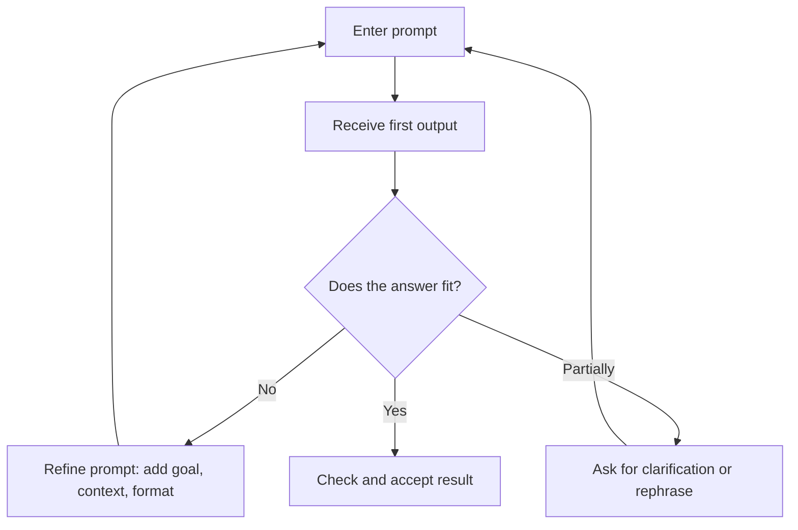

###### Topics

Practical use of AI-powered tools

- Get to know and use web-based AI tools for text generation
- Enter prompts and specifically adapt outputs
- Get to know AI-based image generators in a simple way

Practical work with supporting tools

- Use chatbots and voice assistants to help with simple tasks
- Learn about simple AI-powered organizational and automation tools

   
# 🧠 Practical Use of AI-Powered Tools

When we talk about **AI-powered tools**, we mean digital tools that don't just perform tasks following fixed rules, but can generate content, make suggestions, rephrase texts, create images, or support processes. In everyday life, you often encounter these systems directly in the browser, as an app, or integrated into familiar programs. Typical examples are **ChatGPT** by OpenAI, **Claude** by Anthropic, **Gemini** by Google, or **Copilot** by Microsoft ([ChatGPT](https://openai.com/chatgpt/), [Claude](https://www.anthropic.com/claude), [Gemini](https://gemini.google.com/), [Microsoft Copilot](https://www.microsoft.com/microsoft-copilot)).

The practical benefit is that you can work with these tools in **natural language**. So you don't need to program in order to summarize a text, gather ideas, revise an email, or have a topic explained to you. This is precisely why these tools are particularly exciting for **Core Tech Fundamentals**: you learn how modern digital tools work, how to use them correctly, and how to critically evaluate their results.

   
## 📝 Get to Know and Use Web-Based AI Tools for Text Generation

Web-based AI tools for text generation are programs that you can use directly through a browser. They help you **write, rewrite, structure, explain, or improve texts**. Such systems are usually based on large language models that process language statistically and can thus generate human-like responses ([OpenAI Platform Overview](https://platform.openai.com/docs/overview), [Anthropic: Prompt engineering overview](https://docs.anthropic.com/en/docs/build-with-claude/prompt-engineering/overview)).

It's important to note: These tools **do not understand language like a human**, but calculate likely suitable responses. This is practical, but it also means that answers can sometimes sound very convincing, even if they are inaccurate or even wrong. That's why **checking results** is always part of good interaction with AI.

   
### 📚 What These Text Tools Can Do Practically

In daily life, you can use them to:

- draft texts
- shorten or summarize texts
- have complicated content explained more simply
- turn bullet points into continuous text
- generate headlines, outlines, or ideas
- compose emails or messages
- improve texts stylistically
- structure information in table format

The key point is: The AI does not replace your thinking, but it can **support** your thinking. Especially in learning, this is very valuable. For example, you can have a difficult topic explained in simple terms first, then request an example, and then specifically ask about what you still haven't understood.

   
### 🧰 Overview of Typical Web-Based Text AIs

| Tool | Typical Strength | Common Uses |
|---|---|---|
| ChatGPT ([ChatGPT](https://openai.com/chatgpt/)) | versatile text work, explanations, dialogue | Composing, Explaining, Summarizing |
| Claude ([Claude](https://www.anthropic.com/claude)) | calm, structured text work, longer documents | Analyzing, Writing, Structuring |
| Gemini ([Gemini](https://gemini.google.com/)) | search, Google-integrated workflows, everyday questions | Explaining, Researching, Drafts |
| Microsoft Copilot ([Microsoft Copilot](https://www.microsoft.com/microsoft-copilot)) | work in the Microsoft environment | Emails, Office support, daily work |

These tools differ in interface, privacy options, integrations, and response style. But the basic principle is similar: **You enter a prompt, and the system generates a suitable output**.

   
### 🛠️ How to Work Effectively with Text AI

A very simple and effective workflow looks like this:

1. Give the AI a clear task.
2. Add context.
3. Define form and goal.
4. Review the first answer.
5. Improve your prompt or request a revision.

For example, if you only write:  
"Explain networks to me,"  
the task is understandable, but still very open.

If you instead write:  
"Explain the basic principle of computer networks in simple language, as if I were a beginner. Use a practical example from everyday life and explain the terms router, IP address, and server."  
then the task is much clearer. The output will almost always be better because you give the AI more orientation.

   
## 🎯 Entering Prompts and Specifically Adapting Outputs

A **prompt** is simply your input to the AI. It can be a question, an instruction, a task, or a specifically described job. The clearer your prompt, the more useful the answer usually is. Providers like OpenAI and Anthropic themselves recommend formulating tasks clearly, providing context, and explicitly stating desired output formats ([OpenAI Prompt Engineering Guide](https://platform.openai.com/docs/guides/prompt-engineering), [Anthropic: Prompt engineering overview](https://docs.anthropic.com/en/docs/build-with-claude/prompt-engineering/overview)).

Many beginners make the same mistake: They write too little. They think a short command is enough. In reality, a good prompt is more like a **clear work instruction**.

   
### 🧩 What a Good Prompt Should Contain

A good prompt contains as many of these building blocks as possible:

| Building Block | Meaning | Example |
|---|---|---|
| Goal | What should be produced? | "Explain the topic clearly." |
| Context | For whom or for what is it intended? | "I am a beginner in computer science." |
| Format | What should the answer look like? | "Use paragraphs and an example." |
| Length | How long or short should it be? | "About 200 words." |
| Style | What should the tone be? | "Simple, calm, factual." |
| Constraints | What should be avoided? | "No technical terms without explanation." |

If you consciously consider these points, a vague question becomes a very usable work order.

   
### ✍️ Example: Weak Prompt and Better Prompt

A weak prompt would be:

> "Write something about databases."

That's too open-ended. The AI does not know:
- what level it should write at,
- whether you want an explanation or a definition,
- whether an example is needed,
- how long the text should be.

A better prompt would be:

> "Explain databases in simple language for beginners. Explain the difference between table, record, and query. Use an everyday example, such as a library. The answer should be clearly structured and not too technical."

Now the AI has:
- a clear goal,
- a target audience,
- a style,
- an example,
- a desired depth.

Exactly this makes the output much more precise.

   
### 🔁 How to Specifically Improve Outputs

A big advantage of AI tools is that you can work **iteratively**. This means: You don't have to write the perfect prompt immediately. You can work step by step toward a better answer.

Typical follow-up adjustments are, for example:

- "Explain it even more simply."
- "Give me a concrete example."
- "Shorten the text to 5 sentences."
- "Phrase this more neutrally."
- "Structure the answer as a table."
- "Check if technical terms have been explained."
- "Show me the differences between A and B."

This is basically like a human conversation. You give a task, get a first answer, and then refine further.

   
### 🧠 How to Use AI Effectively for Learning

When learning, you should **not just ask AI for ready-made answers**, but use it as an explainer and thinking partner. That is the crucial difference between superficial use and real learning progress.

Useful learning prompts are for example:

- "Explain the topic in very simple language."
- "First state the main idea, then the technical terms."
- "Give me an example from everyday life."
- "Where do beginners often make mistakes here?"
- "Compare these two terms understandably."
- "Check my explanation and tell me what is unclear about it."

In this way you not only train information retrieval, but above all **understanding**, **categorizing**, and **reflecting**.

   
## 🖼️ Get to Know AI-Based Image Generators in a Simple Way

AI-based image generators create images from text inputs. So you describe in words what should be shown, and the AI generates an image. Well-known examples are **DALL·E**, **Adobe Firefly**, and on the open-source side, models from the **Stable Diffusion** ecosystem ([DALL·E 3](https://openai.com/index/dall-e-3/), [Adobe Firefly](https://www.adobe.com/products/firefly.html), [Stable Image](https://stability.ai/stable-image)).

This is particularly useful if you want to:
- visualize ideas,
- illustrate simple concepts,
- create drafts for presentations,
- generate moods, scenes, or illustrations.

   
### 🎨 How Image Generators Basically Work

Simply put, image generators translate a linguistic description into visual characteristics. If you write:

> "A modern workspace with a laptop, plant, and daylight, minimalist, realistic"

then the model tries to create a fitting image from terms like "modern workspace", "minimalist", and "realistic".

The AI does not think like a photographer. It combines patterns it has learned from training data. That's why it's worth formulating image prompts as clearly as possible.

   
### 🧾 What a Good Image Prompt Should Contain

A good image prompt describes not just the object but also the presentation. Typical building blocks are:

| Building Block | Example |
|---|---|
| Subject | "a desk with a laptop" |
| Style | "photorealistic", "comic style", "watercolor" |
| Perspective | "from the front", "top view", "close-up" |
| Lighting | "soft morning light", "dramatic lighting" |
| Colors | "warm tones", "black and white", "pastel colors" |
| Background | "modern office", "plain wall", "nature scene" |
| Quality | "highly detailed", "clean", "minimalist" |

A weak image prompt would be:

> "Make a picture of a dog."

A much better prompt would be:

> "A friendly golden retriever sitting on a green meadow in warm evening light, photorealistic, natural colors, light blurred background, close-up."

Again: more clarity usually leads to a better result.

   
### 🪄 What Simple Image Generators Are Practically Suitable For

For beginners, image generators are particularly good for:

- boosting presentations visually
- sketching ideas for designs
- quickly trying out visual variants
- making concepts visible
- testing mood boards or styles

They are less suitable when absolute correctness is needed, for example for very precise technical drawings, medical content, or complex text in the image. Many image generators also struggle with **legible text**, exact numbers, or very fine logical details.

   
### ⚠️ Important Limits with Image AI

With image generators, you should especially keep two things in mind.

First: The results are not automatically "true." If you generate an image of a historical scene, it is not a reliable historical source but a KI interpretation.

Second: Usage rights and training bases differ depending on the provider. Adobe, for example, emphasizes that Firefly is based on licensed content and Adobe Stock to support commercial usability ([Adobe Firefly](https://www.adobe.com/products/firefly.html)). With other tools, the conditions might be different. That's why you should always check the specific license rules when using them professionally or publicly.

   
# 🤝 Practical Work with Supporting Tools

Besides pure text or image generation, there are many AI-powered tools that support you in simple everyday tasks. These include **chatbots**, **voice assistants**, **organizers**, and **automation platforms**. The big advantage is that they take over repetitive work for you or help you with small decisions, formulations, and planning.

Here's the important distinction:

- **Generative AI** creates content, such as texts or images.
- **Supporting AI tools** help with organizing, sorting, planning, reminding, or connecting tasks.

   
## 💬 Using Chatbots and Voice Assistants to Support Simple Tasks

A **chatbot** is a dialogue-based system. You type a question or task and get an answer. A **voice assistant** works similarly, but usually via voice input and often focuses more on specific everyday actions, e.g. reminders, timers, music, navigation, or smart home commands. Well-known examples are **Siri**, **Alexa**, and **Google Assistant** ([Siri](https://www.apple.com/siri/), [Amazon Alexa](https://www.amazon.com/alexa), [Google Assistant](https://assistant.google.com/)).

Chatbots are usually stronger at **explaining, formulating, and reflecting**. Voice assistants are typically stronger for **fast, practical everyday actions**.

   
### 🗣️ What Chatbots Are Good For

You can use chatbots well for simple, supportive tasks such as:

- brief explanations of terms
- help with phrasing
- idea collections
- drafts for messages or emails
- rephrasing in simple style
- translation or smoothing language
- structuring thoughts
- first orientation in a topic

If you need to write a polite email but don't know how to start, a chatbot can deliver a usable draft in seconds. You save time, but still have to check if tone, content, and facts really fit.

   
### 🎙️ What Voice Assistants Are Good For

Voice assistants are especially useful if you want to **work quickly and hands-free**. Typical tasks are:

- setting alarms and timers
- creating reminders
- checking appointments
- checking weather or traffic
- starting music or podcasts
- controlling smart home devices
- querying quick facts

The advantage is speed. The disadvantage is that voice assistants often explain less thoroughly than good chatbots. For complex topics or longer texts, they are usually not the best choice.

   
### 🧭 When to Use Which Assistant

| Situation | Chatbot suitable | Voice assistant suitable |
|---|---|---|
| You want to understand a topic | very suitable | rather limited |
| You need a text draft | very suitable | rather unsuitable |
| You want to quickly set a timer | unnecessary | very suitable |
| You want to brainstorm ideas | very suitable | limited |
| You want to work hands-free | possible, but not ideal | very suitable |
| You want to ask a longer follow-up question | very suitable | rather tedious |

So the difference is not "better or worse," but **which tool suits which task**.

   
## 🗂️ Get to Know Simple AI-Powered Organizational and Automation Tools

Organization tools help you arrange information, plan tasks, structure notes, or find content faster. Automation tools connect programs so that certain steps are triggered automatically. Examples include **Notion AI**, **Microsoft 365 Copilot**, **Zapier**, or **Make** ([Notion AI](https://www.notion.so/product/ai), [Microsoft 365 Copilot](https://www.microsoft.com/microsoft-365/copilot), [Zapier AI](https://zapier.com/ai), [Make AI](https://www.make.com/en/ai)).

Especially in work or learning contexts, this is very useful because many small tasks recur:
- organizing notes
- creating to-do lists
- preparing appointments
- summarizing content
- automating recurring processes

   
### 📒 AI-Powered Organization Tools

Organization tools with AI mainly help you with **structuring**. They can, for example:

- turn notes into a clean to-do list
- break down a long text into key points
- summarize meeting notes
- prioritize tasks
- categorize content into tables or categories
- turn bullet points into a plan

They are especially helpful if you have lots of information but no structure yet. The AI does not take responsibility for your work but can make getting started much easier.

A typical example would be: You have messy raw notes from a lesson or meeting. An AI tool can turn this into sections like "open questions," "next steps," and "important terms." This saves time and reduces mental effort.

   
### ⚙️ AI-Powered Automation Tools

Automation tools work according to the principle:

**If something happens, then automatically perform one or more actions.**

A classic example would be:

- When a form is filled out,
- then save the data in a table,
- and additionally send a confirmation message.

Platforms like Zapier or Make are known for just these kinds of links ([Zapier AI](https://zapier.com/ai), [Make AI](https://www.make.com/en/ai)). With AI, this becomes even easier because you don't always have to click all steps together technically, but can partially describe workflows in natural language.

This is a good example of digital literacy: You don't just learn to use a tool, but also to **think of workflows as processes**.

   
### 🧱 Simple Practical Examples for Organization and Automation

Here are some very typical and easy-to-understand use cases:

| Task | Supporting Tool | Practical Benefit |
|---|---|---|
| Organize notes | Notion AI, Copilot | quick overview, better structure |
| Draft emails | Chatbot, Copilot | saves time formulating |
| Prepare appointments | Chatbot, Calendar AI | clear agenda, open points visible |
| Derive tasks from text | Organization AI | conversation becomes a to-do list |
| Form → table → email | Zapier, Make | recurring steps run automatically |
| Voice command → reminder | Siri, Alexa, Google Assistant | quick everyday organization |

What’s important: Even these simple cases show how AI is not "magical" in practice, but becomes very useful in **concrete, small assistance tasks**.

   
### 🧪 What You Also Learn Technically

Even if you're not a developer, working with such tools teaches you basic technology principles:

- **Input and output**: What you input influences the result.
- **Structured data**: Tables, forms, and lists form the basis of many processes.
- **Workflows**: Digital processes consist of clear steps.
- **Automation**: Repetitive tasks can be standardized.
- **Quality control**: Results have to be checked.
- **Interfaces and connections**: Many tools only become powerful when they are connected.

This is exactly the core of **Core Tech Fundamentals**: not just clicking, but understanding how digital tools are logically constructed.

   
# 🛡️ Responsible and Effective Use

Despite all their usefulness, there is one thing you should always keep in mind: AI tools are **assistants**, not infallible authorities. Providers themselves point out that generative AI can produce erroneous or inaccurate content and that important information should be checked ([OpenAI Safety & policies overview](https://openai.com/safety/), [Gemini](https://gemini.google.com/)).

This means in practice:

Do not carelessly send sensitive personal data, confidential documents, or internal information into freely accessible tools. Always check which privacy and usage settings a service offers. This is especially important in professional or school settings.

   
## 🔍 Check Quality Instead of Blindly Accepting

AI answers often seem smooth, confident, and linguistically polished. But that's no proof the content is correct. Good practice is therefore:

- Check facts against reliable sources
- Assess the plausibility of examples
- Look up technical terms
- Never adopt quotes unchecked
- For important decisions, have a human review

The more important a result is, the more carefully you must check. The risk is low with a quick phrasing aid. With technical statements, applications, official texts, or data processing, the risk is much higher.

   
## 🧠 Use AI Effectively for Learning

When learning with AI, the best use is not:  
"Just give me the answer."

But rather:
"Help me understand it."

This sounds simple, but it's a huge difference. The first variant quickly makes you dependent on ready-made answers. The second trains real thinking. AI is useful when it helps you

- clarify terms,
- understand connections,
- recognize thinking errors,
- find examples,
- bring structure to complex topics.

So the real learning performance remains yours, while the AI works like a patient assistant.

   
## 🧭 A Good Basic Principle for Practice

For almost all AI tools, you can remember this simple principle:

**Enter clearly, check critically, adapt specifically.**

This applies to text generators, image generators, chatbots, voice assistants, and automation tools alike. Whoever has understood this principle uses AI not just superficially, but truly competently.