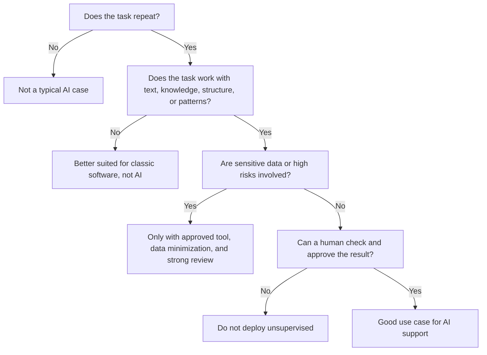
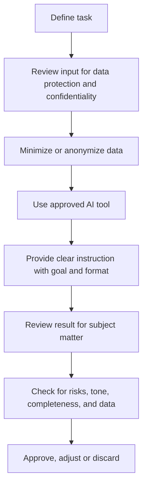

###### Topics

Using AI in Everyday Work

- Identify recurring tasks that can be supported by AI
- Learn about AI features in typical work applications
- Use simple examples for summarization, text suggestions, and structuring

Safe and Responsible Use of AI

- Consider data protection and security when using AI applications
- Understand sensitive handling of inputs, data, and results
- Classify basic ethical questions in everyday work

<br><br><br>
# 🤖 Using AI in Everyday Work

Artificial intelligence is most useful in everyday work when you don't see it as a “magical machine,” but as an **assistance system**. It is particularly strong at processing information quickly, reformulating texts, structuring content, recognizing patterns, and building a first draft from existing material. This makes it well-suited for many typical office, communication, and knowledge tasks.

A fundamental principle is important: **AI often does not replace humans in the workplace, but shifts work.** Less time is spent on routines, formatting, and first drafts; human work increasingly focuses on reviewing, deciding, prioritizing, and taking responsibility. Modern work tools already include such functions directly, for example for writing, summarizing, or preparing content in office, mail, or meeting applications ([Microsoft 365 Copilot](https://www.microsoft.com/en-us/microsoft-365/copilot), [Gemini for Google Workspace](https://workspace.google.com/intl/en/products/gemini/)).

<br><br><br>
## 🔁 Identify Recurring Tasks That Can Be Supported by AI

Not every task is automatically a good AI candidate. Good use cases usually have four characteristics:

First, they often repeat. Second, they follow a recognizable structure. Third, they work heavily with text, information, or patterns. Fourth, a human can review and approve the result in the end.

If you look at job tasks from this perspective, you'll quickly notice: Many activities are not made up of completely new problems, but of small recurring steps. This is exactly where AI can help meaningfully.

Typical examples are:

| Everyday Task | Why AI Can Help Here | Typical AI Support | What You Still Need to Check |
|---|---|---|---|
| Drafting emails | similar patterns, recurring tone | Draft, reformulation, shortening | factual correctness, tone, recipient relevance |
| Preparing meetings | lots of text, clear structure | Summarizing, extracting to-dos and decisions | whether something was misinterpreted |
| Reading long documents | large amount of text, little time | Short version, key statements, open questions | whether important details were omitted |
| Organizing notes | often unordered and fragmented | Structuring, topic blocks, prioritization | whether the structure really fits the task |
| Creating standard replies | frequently similar inquiries | Text suggestions, FAQ responses | legal or contractual accuracy |
| Rewriting content | e.g., technical → understandable | Simplify, adjust tone, shorten | whether content and meaning are preserved |
| Classifying information | recurring categorization | Sort by topic, urgency, categories | whether categorization is correct |

A good rule of thumb: **The clearer the input, goal, and desired format, the better AI works.**

If a task is very sensitive, legally delicate, strategically critical, or highly dependent on context, experience, and responsibility, caution is necessary. Then AI can at most prepare, but not decide.

For example:

- AI can extract the most important open points from 20 emails.
- But it should not independently decide which customer inquiry can be ignored.
- AI can structurally organize application texts.
- But it should not decide unreviewed about suitability, fairness, or rejection of people. Especially in the employment context, certain AI applications are considered particularly high risk, such as in recruitment or personnel decisions ([Regulation (EU) 2024/1689 on Artificial Intelligence](https://eur-lex.europa.eu/eli/reg/2024/1689/oj)).

<br><br><br>
### 🧭 How to Identify Good AI Tasks

You can remember a simple thinking rule for classification:

- **Routine?** Good for AI.
- **Text or information processing?** Good for AI.
- **First draft instead of final decision?** Very good for AI.
- **Sensitive data or high risk?** Only with extreme caution or not at all.
- **No one checks the result?** Poor AI candidate.

This is how this logic looks as a flowchart:



This perspective is important because it helps you use AI **deliberately** rather than indiscriminately. Good users don’t use AI everywhere, but where it has the greatest leverage with the lowest risk.

<br><br><br>
## 🧰 Learn About AI Features in Typical Work Applications

Many people first think of chatbots when they think of AI. In everyday work, however, AI is often directly embedded in regular applications you already know. This is practical, as you don’t need to open a separate tool each time.

You typically find such functions in:

| Work Application | Typical AI Features | Specific Use |
|---|---|---|
| Email programs | Write drafts, suggest replies, adjust tone, summarize emails | respond faster, phrase more clearly |
| Word processing | Rewrite paragraphs, shorten, simplify, generate outlines | turn notes into a usable first draft |
| Meeting tools | Derive meeting notes, to-dos, decisions, open points | less follow-up after meetings |
| Spreadsheets | Explain formulas, describe data, summarize trends | understand data more quickly |
| Presentation tools | Structure content, outline slides, formulate key statements | get from idea to presentation faster |
| Knowledge and note tools | Organize content, summarize pages, answer questions about documents | find and use knowledge faster |
| Project management tools | Derive tasks from text, state priorities, write status reports | better overview and less manual maintenance |

The basic idea behind all these features is almost always the same: AI helps you **turn unorganized material into a usable format**. This may be a text, list, table, protocol, or outline.

In many typical office scenarios, these functions boil down to three patterns:

1. **Summarize**  
   Turn a lot of material into a short, understandable version.

2. **Suggest**  
   Turn your goal into a first draft.

3. **Structure**  
   Turn loose information into a clear form.

These three patterns are particularly valuable at work because they reduce the most common inefficiencies: too much information, too little time, and unclear rough notes.

The broad availability of these features in standard tools today is evident, e.g., from features such as draft aids in emails and documents and meeting summaries and action item derivations in office and collaboration tools ([Microsoft 365 Copilot](https://www.microsoft.com/en-us/microsoft-365/copilot), [Gemini for Google Workspace](https://workspace.google.com/intl/en/products/gemini/)).

<br><br><br>
### 📧 AI in Email and Communication

Especially with emails, AI often saves a lot of time, because there are many small routine actions here. You have to write, sort, stay polite, be brief, and often respond to similar inquiries.

AI can help:

- write a first draft of a response,
- summarize a long email thread concisely,
- adjust tone, e.g., more formal or friendly,
- make a full email from bullet points,
- shorten a too-long message.

It’s practical but also risky if used uncritically. Emails are sent quickly, and small mistakes can be embarrassing or problematic. Therefore: **AI may write the first draft, but you are responsible for sending.**

<br><br><br>
### 📄 AI in Documents and Knowledge Work

AI is especially useful in documents when you already have material but not yet a good structure. Examples:

- Notes are to become a structured report.
- A technical text is to be simplified for non-experts.
- A long contract or guide is to be reduced to the key points.
- Several sources of information are to be turned into an organized outline.

Here, AI is strong because it can reformulate language and reorganize content. What it cannot reliably guarantee, however, is **factual accuracy**. So if you’re working on technical, legal, compliance, or customer topics, you must check very carefully.

<br><br><br>
### 🎥 AI in Meetings and Collaboration

Meetings often create a lot of work: taking notes, sorting, recording decisions, assigning to-dos. This is exactly where AI can relieve you.

Useful meeting functions include:

- creating transcripts,
- extracting key statements,
- listing responsibilities and next steps,
- highlighting open questions,
- preparing follow-up emails.

This is particularly helpful since meetings are often confusing. However, AI can easily misinterpret nuances here. A vague statement can be interpreted as a “decision” even though nothing was decided yet. Therefore, at least one person should review the result.

<br><br><br>
## ✍️ Use Simple Examples for Summaries, Text Suggestions, and Structuring

To make AI truly useful at work, you don’t need to “prompt perfectly.” But you should understand **what inputs produce good results**.

A very useful basic schema is:

| Component | Meaning | Example |
|---|---|---|
| Context | What's it about? | “This is an internal meeting protocol for a project kickoff.” |
| Goal | What should the AI do? | “Summarize the most important decisions.” |
| Format | What should the result look like? | “As a list with 5 items.” |
| Audience | Who is it for? | “For the team management, concise and factual.” |
| Limits | What should be avoided? | “No speculation, do not add new information.” |

This schema is didactically important because it helps you learn not to use AI as a riddle machine, but as a tool with clear requirements. The more precisely you formulate, the better the result usually is.

<br><br><br>
### 📝 Examples for Summaries

A summary is good when it’s not just shorter, but makes the important things visible. Particularly useful at work are these forms:

- key statements
- decisions
- open points
- risks
- next steps

A useful prompt might look like this:

```text
Summarize the following text for everyday work.
Goal: quick overview for a team lead.
Format:
1. Key statements
2. Decisions
3. Open points
4. Next steps
Important: do not invent anything; mark unclear areas as "unclear."
```

Why is this good? Because you don’t just tell the AI to “summarize it” but **specify a work format**. This reduces the risk that the output sounds nice but is useless for the job.

You can also control the level of detail:

- **very short:** 3 bullet points for a quick overview
- **medium:** brief management overview
- **detailed:** with decisions, responsible persons, and deadlines

Especially for long documents, it’s useful to explicitly ask for **missing information**. Then the AI is not just a summarizer, but a tool for better orientation.

Example:

```text
Read the following text and give me:
- the 5 most important statements,
- possible risks,
- missing information,
- questions that should be clarified before a decision.
```

With this, you learn a very important skill for dealing with AI: **not just condensing content, but creating thinking structure.**

<br><br><br>
### 💬 Examples for Text Suggestions

Text suggestions are best when you don't want to start from scratch. AI is very good at drafting an initial proposal that you can then adjust.

Typical use cases:

- polite reply to a rescheduled appointment,
- factual question to another team,
- brief management update,
- polite rejection,
- internal status update.

An example of a good input:

```text
Write a short, friendly, and professional email.
Situation: A project is delayed by one week because an external supplier has not yet delivered.
Audience: Client
Tone: transparent, calm, solution-oriented
Content:
- mention the delay
- state new timeline
- announce next update
- avoid assigning blame
```

Why is this strong? Because you provide four things:

- situation
- audience
- tone
- binding content

Without these specifications, you quickly get generic texts that are grammatically correct but weak in communication.

Very useful is also **rewriting in another tone**. For example:

```text
Rewrite this message to be more factual and shorter.
Keep the statement.
Avoid blaming language and colloquialisms.
```

Or:

```text
Turn these bullet points into a clear internal status message of 6 sentences.
```

This is very useful at work if you know **what** you want to say but not yet **how** to phrase it clearly.

<br><br><br>
### 🧱 Examples for Structuring

Structuring is one of AI’s underrated strengths. Many tasks fail not from content, but from lack of order.

AI can help turn raw material into a clear work structure. For example:

- notes into an agenda,
- a conversation into a to-do list,
- ideas into an outline,
- requirements into a checklist,
- a text into a table.

Example:

```text
Organize the following unordered notes into a sensible project structure.
Generate these sections:
1. Goal
2. Current status
3. Risks
4. Open questions
5. Next steps
If information is missing, mark it.
```

Or for to-dos:

```text
Create a task list from the following meeting text.
Format as a table with:
- task
- responsible person
- deadline
- dependencies
If responsibilities are unclear, mark this.
```

This shows why AI can be so useful at work: It doesn't do the thinking for you, but helps **turn chaotic information into a workable format**.

<br><br><br>
# 🔐 Safe and Responsible Use of AI

As useful as AI is, careful handling is just as important. In a work context, good results alone are not enough. It’s always also about data protection, security, responsibility, traceability, and fairness.

A common mistake is focusing only on convenience: “It's fast, so I'll use it.” But in companies, the opposite applies: **The faster a tool works, the more important it is to control what is input and what is output.**

<br><br><br>
## 🛡️ Consider Data Protection and Security When Using AI Applications

As soon as you use AI at work, you often work with data. And data are never neutral. Some are uncritical, some internal, some confidential, some personal, and some highly sensitive.

Data protection essentially means: You may not just enter data somewhere because a tool is convenient. The General Data Protection Regulation (GDPR) applies principles such as **purpose limitation**, **data minimization**, and **integrity and confidentiality** ([Regulation (EU) 2016/679 – GDPR](https://eur-lex.europa.eu/eli/reg/2016/679/oj)). For special categories of personal data, e.g., health data, stricter rules apply ([Regulation (EU) 2016/679 – GDPR](https://eur-lex.europa.eu/eli/reg/2016/679/oj)). The regulation also requires appropriate security measures for processing ([Regulation (EU) 2016/679 – GDPR](https://eur-lex.europa.eu/eli/reg/2016/679/oj)).

Practically, for you this means:

- Not every AI tool may be used in the company.
- Not every piece of information may be entered in an AI system.
- Not every automatically generated output may be passed on unchecked.

A key question: **What data do you enter?**

| Type of Data | Example | Risk | Good Practice |
|---|---|---|---|
| Public information | already published product description | low | usually uncritical, still check |
| Internal but uncritical data | general process notes without personal reference | medium | only in approved tools |
| Personal data | names, email addresses, performance data | high | minimize, anonymize, only if permitted |
| Special categories of personal data | health data, union, religion, etc. | very high | extremely careful, usually not in general AI tools |
| Trade secrets | prices, source code, strategies, contracts | very high | only in specifically approved and secured systems |
| Customer data | contact persons, internal project status, support cases | high | only with clear approval and minimal data usage |

The most important practical step is therefore **data minimization**. Only enter what is truly necessary for the task. Often “Customer A” is enough instead of a real name, “[address removed]” instead of a real address, or a generalized description of a case instead of a complete personnel file.

A good way to think is:  
Don’t ask “Can the AI process this?”, but first ask **“Am I allowed to put this information into this system at all?”**

You should also always check:

- Is the tool approved by your company?
- Where is data processed?
- Are inputs stored?
- May they be used for training or quality improvement?
- Who within the company can access the content?

These points are not coincidentally listed in company policies. They determine whether AI usage is not just practical but also legally and organizationally sound.

<br><br><br>
### 🔒 What You Should Never Carelessly Enter

Be especially careful with the following content:

- complete personnel information,
- health or application data,
- confidential customer data,
- contract content with confidentiality,
- access data, tokens, passwords,
- unpublished financial data,
- source code or architecture details, if not approved.

This is not only about data protection but also information security. A single careless prompt can put information in the wrong processing context at worst.

If you can abstract a case, do so. For example, instead of:

> “Please analyze this complaint from Max Mustermann, born ...”

better:

> “Please analyze this anonymized customer case and suggest a factual response structure.”

You then process the **task**, but not unnecessarily the **identity**.

<br><br><br>
## 🧠 Understand Sensitive Handling of Inputs, Data, and Results

Responsible AI use doesn’t end at the input. It also concerns how you evaluate results.

A major issue with generative AI is that it can generate convincing-sounding answers that are nevertheless incorrect or made up. NIST explicitly describes risks such as “confabulation” with generative AI—factually wrong but plausible-sounding outputs ([Artificial Intelligence Risk Management Framework: Generative Artificial Intelligence Profile](https://nvlpubs.nist.gov/nistpubs/ai/NIST.AI.600-1.pdf)).

This is especially tricky at work because good language easily creates an illusion of competence. A well-written text can still:

- distort facts,
- misreport numbers,
- invent sources,
- omit important caveats,
- ignore legal or technical boundaries.

Therefore: **Language quality is no proof of truth.**

<br><br><br>
### 🧾 Good Inputs: Precise, Minimal, with Clear Context

A good input is not just long, but sensibly structured. It should be specific enough that the AI knows what you want, but not contain unnecessary data.

Good inputs usually have these characteristics:

- clear goal,
- clear role or audience,
- desired format,
- explicit limits,
- only necessary data.

An example of a poor approach:

```text
Make this better.
```

This could mean almost anything.

A better approach:

```text
Revise the following internal text.
Goal: understandable for non-specialist colleagues.
Format: 1 short paragraph + 3 key points.
Important: do not add new information.
```

Such input is more professionally sound, better controllable, and usually more data-efficient.

<br><br><br>
### ✅ Review Results Properly

Reviewing AI results is not a minor matter, but the core of responsible use. Depending on the task, you should check different things:

| Review Question | Why It’s Important |
|---|---|
| Are the facts correct? | AI can generate plausible errors |
| Are important details missing? | Summaries often omit context |
| Was anything made up? | Generative models may inappropriately supplement |
| Does the tone fit the situation? | Text may be unintentionally too harsh, soft, or risky |
| Is the result complete? | To-dos, deadlines, or restrictions may be missing |
| Is the output GDPR-compliant? | Results may make sensitive data visible again |
| Is the decision traceable? | Especially important for personnel, customer, or compliance topics |

Especially critical are areas where mistakes have direct consequences for people or the company. These include:

- personnel matters,
- legal communication,
- performance evaluations,
- contract issues,
- security and compliance cases,
- customer communications with legal relevance.

In such cases, AI should rather **prepare** than **decide**.

<br><br><br>
### 👤 Human Oversight Remains Mandatory

A healthy work principle is: **AI writes along, thinks along, sorts along—but carries no responsibility.**

Responsibility remains with humans and organizations. This concretely means:

- A human grants approval.
- A human assesses risks.
- A human decides in borderline cases.
- A human must be able to explain why a result was used.

This is especially important at work because AI outputs often flow into processes with external impact. Whether an offer, a customer response, an internal appraisal, or a report is based on AI—the responsibility remains with the person or team that uses it.

A sensible workflow looks like this:



This way of working is not only safer, but more professional. You leverage AI’s speed without giving up quality control.

<br><br><br>
## ⚖️ Classify Basic Ethical Questions in Everyday Work

Ethics often sounds abstract, but at work it’s very concrete. Whenever AI deals with people, decisions, evaluations, or communication, ethical questions arise.

The most important are:

- **Fairness**
- **Transparency**
- **Responsibility**
- **Influence**
- **Human autonomy**

This is especially relevant in the employment context, as AI can help decide on opportunities, assessments, and communication. The EU AI Act treats certain applications in employment and HR as high-risk areas ([Regulation (EU) 2024/1689 on Artificial Intelligence](https://eur-lex.europa.eu/eli/reg/2024/1689/oj)).

<br><br><br>
### ⚖️ Fairness and Bias

AI learns from data, examples, and patterns. If these patterns contain biases, they may appear in the results. This is especially problematic with tasks such as:

- pre-sorting applications,
- assessing performance,
- summarizing texts about people,
- evaluating customer groups,
- setting priorities based on historical cases.

The ethical issue is not just a technical error but potential discrimination. If a model favors certain wording, resumes, or writing styles, it may treat people unfairly.

At work, this leads to an important rule: **AI must not secretly evaluate people according to questionable patterns.** Where people are affected, special care, transparency, and review are needed.

<br><br><br>
### 🪟 Transparency: When Should it Be Clear AI Was Involved?

Transparency means it remains traceable where AI helped and where not. You don’t always have to add a big notice to every small thing, but openness is sensible or even required in many situations.

Examples include:

- a protocol generated automatically,
- a customer reply largely AI-generated,
- internal decision models pre-sorted by AI,
- evaluations or recommendations prepared with AI.

Why is this important? Because otherwise others may easily assume a text or assessment has been fully reviewed by a human or individually created when it wasn't.

Transparency creates fairness and reduces blind trust assumptions.

<br><br><br>
### 🧑‍⚖️ Responsibility and Accountability

One of the most important ethical questions is: **Who is responsible if the AI result is wrong, unfair, or harmful?**

The practically correct answer: not the model, but always a human or organization.

Responsible AI use at work thus requires clear rules:

- Who may use which tools?
- For which tasks is AI allowed?
- Who reviews results?
- When is a second approval required?
- What needs documentation?

Without these rules, you quickly end up in a dangerous state: The AI generates content, but nobody feels responsible. This is exactly what should be avoided.

<br><br><br>
### 🧠 Not Everything Convenient Is Good

AI also becomes ethically problematic when it displaces human diligence. This often happens gradually:

- You review less closely because the text sounds so good.
- You accept recommendations because they’re quickly available.
- You unlearn how to structure things yourself.
- You trust the AI more than it deserves.

This is not just a technical problem but a question of good work practice. Responsible use also means not outsourcing your own judgment.

A good working style with AI is not:  
**“AI is probably right.”**

But:  
**“AI helps me think and formulate, but I remain responsible for quality, impact, and consequences.”**

<br><br><br>
### 🏢 Ethical Practice in Teams and Companies

AI is truly used responsibly in a company when not everyone improvises but shared standards apply.

These include for example:

| Area | Good Practice |
|---|---|
| Tool selection | only use approved and reviewed applications |
| Data input | minimal, anonymized, purpose-bound |
| Quality control | always review results according to risk |
| Human decision | no blind automation on critical topics |
| Documentation | make it traceable where AI was used |
| Communication | be open when AI was visibly involved |
| Training | employees learn not only operation, but also limitations |

This way, AI becomes not just efficient but also professionally used. And that’s exactly the decisive difference at work between merely experimenting and truly good, responsible work with AI.