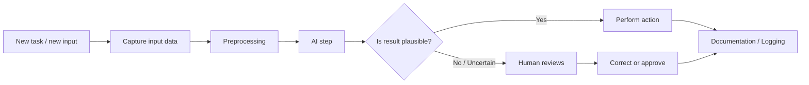
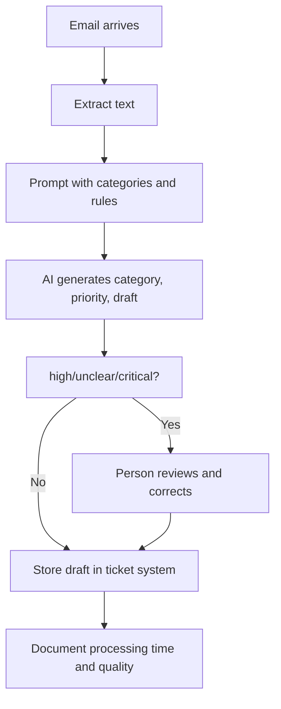
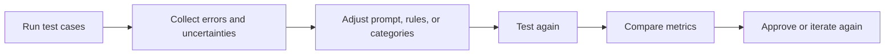

###### Topics

Process Optimization with AI

- Check simple workflows for automation potential
- Design small AI-supported workflows for typical tasks

Project-based Application

- Plan and implement a simple AI-supported mini-workflow
- Present results and reflect together
- Identify opportunities, limitations, and possibilities for improvement in your workflow

   
# 🤖 Process Optimization with AI

Process optimization with AI does not mean that you immediately automate entire departments or complete business processes. In practice, it almost always starts much smaller: You look at a simple, recurring routine, check if part of it can be automated, and then build a small workflow that uses AI at a sensible spot.

The key concept is: **Not every process is automatically a good AI process.** Some tasks are excellently supported by AI, others not so much. Especially with the basics, it’s useful to first understand **which types of work are suitable**, **where risks lie**, and **how to design a small, controllable workflow**—instead of immediately building something big and complex.

Recurring, digitally-based, language-oriented tasks are often good candidates. At the same time, established guidelines recommend considering risks, measurability, and human oversight from the outset, not just checking afterward if the system is actually reliable enough ([AI Risk Management Framework (AI RMF 1.0)](https://nvlpubs.nist.gov/nistpubs/ai/NIST.AI.100-1.pdf)).

   
## 🔍 Checking Simple Workflows for Automation Potential

If you want to check a workflow for automation potential, it comes down to one simple question:

**Is this task clear, frequent, and structured enough for a system to reliably support it?**

A workflow is, simply put, a sequence of steps. For example:

- An email arrives
- The content is read
- The topic is identified
- The message is assigned to a category
- A draft reply is prepared
- A person reviews and sends it

Such a process is much easier to assess than a vague goal like “improve customer service.” For AI, you first need a **concrete, observable sequence**.

   
### 🧩 How to Recognize a Good Automation Candidate

A process is especially well-suited for AI support if several of the following points apply:

| Criterion | Well-suited | Poorly suited | Why this matters |
|---|---|---|---|
| Repetition | Task occurs often | Task is rare or one-time | Repeated tasks are more worthwhile to automate |
| Standardization | Steps are similar | Each case is completely different | AI needs recognizable patterns |
| Digital Data | Texts, forms, tables, emails | Only informal talks or unstructured offline data | Digital input is much easier to process |
| Clear Input/Output | Input and desired result are clear | Result is vague or purely creative | A workflow needs defined handovers |
| Low Risk | Errors are correctable | Errors would be costly, legally, or dangerous | The higher the risk, the more oversight is needed |
| Language-based | Classify, summarize, write, extract | Precise expert decision with high liability | Language models are strong in text but not automatically reliable for high-risk decisions |
| Measurable | Quality, time, or error rate is measurable | Success is hardly evaluable | Without metrics, you can’t prove improvements |

Regular **text work** in particular is often ideal. Examples include:

- Sorting emails
- Summarizing meeting notes
- Extracting information from texts
- Preparing standard replies
- Classifying support requests
- Converting content into a fixed format

Language models are especially useful for tasks like **classification, extraction, summarization, and rewriting of text** when the instructions are clear and the desired output format is well-defined ([Best practices for prompt engineering with the OpenAI API](https://help.openai.com/en/articles/6654000-best-practices-for-prompt-engineering-with-the-openai-api)).

   
### 📏 A Simple Method for Checking Automation Potential

So you don’t just decide by gut feeling, you can assess a process with a small scoring logic. This doesn’t have to be complicated.

Give each criterion 0 to 2 points:

- **0 points** = poorly suited
- **1 point** = partly suitable
- **2 points** = well suited

| Check question | 0 | 1 | 2 |
|---|---:|---:|---:|
| Does the task occur frequently? | rarely | sometimes | often |
| Is the process similar and repeatable? | no | partly | yes |
| Are inputs and outputs clear? | unclear | partly | clear |
| Are the data digital? | no | partly | yes |
| Is the risk of error low or controllable? | no | medium | yes |
| Can a person easily double-check? | hard | partly | easy |
| Is success measurable? | hardly | partly | well |

The higher the total score, the better suited the process is for a first small AI workflow.

**Rule of thumb:**

- **11–14 points**: very good candidate
- **7–10 points**: usable, but with caution
- **0–6 points**: rather unsuitable for a first AI workflow

Of course, this isn’t a law of nature, but it helps you assess processes objectively instead of being guided by “AI sounds exciting”.

   
### 🛑 When You Should Avoid or Only Partially Automate

There are processes where you need to be very cautious. Especially when:

- wrong decisions could seriously harm people,
- legal or financial consequences are significant,
- sensitive personal data is processed,
- tasks require strong contextual knowledge or professional responsibility,
- the result cannot be easily checked.

If personal data is processed, you must consider purpose limitation, data minimization, and data protection; this is not an add-on, but part of the system design ([Regulation (EU) 2016/679 (General Data Protection Regulation)](https://eur-lex.europa.eu/eli/reg/2016/679/oj)).

From a trustworthy AI perspective, **robustness, transparency, traceability, and accountability** are also central principles ([OECD AI Principles overview](https://oecd.ai/en/ai-principles)).

Practically, that means:  
If a workflow only "works" when no one is paying attention, it’s usually badly designed. Good AI processes are set up so that a person can **intervene, check, and give approval at the right points**.

   
## 🛠️ Designing Small AI-Supported Workflows for Typical Tasks

When you design a small AI workflow, you shouldn’t treat AI as a “magical all-purpose solution,” but as **one building block within a clear process**.

The most important mindset is:

**Not all the work is done by AI. The AI only does the part it's good at.**

That’s a big difference. A clean workflow separates between:

- **Input**
- **Preparation**
- **AI step**
- **Review**
- **Action**
- **Documentation**

This makes the whole thing more controllable and reliable.

   
### 🧠 What AI Does Well in Typical Workflows

AI is particularly strong when language is central. Good use cases include, for example:

| Typical task | What AI does | Example |
|---|---|---|
| Classification | Assign content to categories | “Invoice,” “Complaint,” “Meeting question” |
| Extraction | Pull out important info | Name, date, ticket number, deadline |
| Summarization | Condense key points | Meeting minutes in 5 bullet points |
| Rewriting | Adapt text to style or audience | Technical text in plain language |
| Draft creation | Generate first drafts | Draft response for support |
| Structuring | Bring unstructured info into format | Text into table or JSON |

To make these workflows more stable, clear instructions, examples, and a desired output format help. That’s what all prompting guidelines keep recommending ([Best practices for prompt engineering with the OpenAI API](https://help.openai.com/en/articles/6654000-best-practices-for-prompt-engineering-with-the-openai-api)).

What AI **cannot automatically do well** is:

- guarantee factual accuracy,
- make binding, high-stakes decisions,
- honestly admit missing information if the workflow is poorly built,
- take legal or specialized responsibility.

That’s why you almost always need a **review step** or clear rules as to when a person takes over.

   
### 🧱 Building Blocks of a Small AI Workflow

A sensible mini-workflow usually consists of six building blocks.

| Building block | Explanation |
|---|---|
| Trigger | What starts the process? For example, a new email or a new document |
| Input data | What does the workflow get? Text, form, PDF, chat message |
| Preprocessing | Clean up the data, remove irrelevant parts, standardize format |
| AI step | Classify, extract, summarize, write |
| Check | Review result, recognize uncertainties, involve person if needed |
| Action | Save, mark, store draft, create ticket |

The **control part** is extremely important. A workflow isn't good because it’s fully automatic, but because it's **reliable enough for its purpose**. NIST emphasizes exactly this link between performance, risk consideration, and continuous monitoring ([AI Risk Management Framework (AI RMF 1.0)](https://nvlpubs.nist.gov/nistpubs/ai/NIST.AI.100-1.pdf)).

   
### 🧾 How to Formulate a Good AI Step

The AI step needs a clear task description. A good prompt in a workflow is usually not “creative,” but **precise and technically sound**.

A stable prompt often contains:

- the role or task of the AI,
- the specific work assignment,
- clear criteria,
- the desired output format,
- rules for uncertainty,
- optionally an example.

Instead of just writing:

> “Summarize the email”

this is much better:

> “Read the email. Assign it to one of the categories: Invoice, Support, Appointment, or Other. Extract customer name, urgency, and desired action. Give the result as a table with the columns Category, Name, Urgency, Action. If information is missing, write ‘unknown’ instead of guessing.”

Why is this better?  
Because the prompt tells the model not just **what** to do, but also **how cautiously** and **in which format**. This reduces variability and makes results easier to process.

   
### 🔄 Basic Pattern of a Small AI Workflow

Here’s the basic pattern as a Mermaid diagram:

That’s the key point:  
**The AI is in the middle, not at the end of responsibility.**

Especially for first projects, you should avoid letting the AI directly communicate outward, send decisions, or finalize data without review.

   
### 🧪 Typical Mini-Workflows for Getting Started

To start realistically, these examples are often well suited:

| Mini-workflow | Why well suited |
|---|---|
| Sort emails by topic | clear text data, frequent, easily checked |
| Summarize meeting notes | language-heavy, low harm if errors |
| Prioritize support requests | useful, manageable with human approval |
| Draft standard replies | saves time, human can review final version |
| Extract info from form text | well-defined fields, easily measurable |

When learning, you should deliberately **start small**. A mini-workflow is of much higher learning value than a big system no one truly understands. You learn how data flow, prompt, validation, and human control interact.

   
# 🧪 Project-Based Application

Project-based application is the step from theory to practice. It’s not just about knowing **what** is possible, but planning, implementing, showing, and critically evaluating a concrete workflow.

Didactically, this is important because, while building, you realize:

- where data is missing,
- where instructions are unclear,
- where results fluctuate,
- where human control remains necessary,
- and where true value is actually created.

A small project makes these points much more tangible than any purely theoretical explanation.

   
## 🗺️ Planning and Implementing a Simple AI-Supported Mini-Workflow

The main mistake at the beginning is usually: planning too big.  
It’s better to have a very small, clearly limited workflow with visible benefit.

A good first project should:

- have only one clear starting point,
- automate just a small task,
- be easily testable,
- work with a few examples,
- and deliver results a person can quickly check.

   
### 🎯 Step 1: Clearly Define Goal and Benefit

Before you select any tool, you need to describe the goal precisely.

Bad example:

> “We want to use AI in the office.”

Much better:

> “Incoming support emails should automatically be sorted into 4 categories and a draft reply should be prepared, so that initial processing is faster.”

Such a formulation is good because it clarifies five things:

1. **Input**: Support emails  
2. **AI task**: Classify and draft creation  
3. **Scope**: Only initial processing  
4. **Goal**: Save time  
5. **Verifiability**: Categories and drafts can be checked

   
### 🧱 Step 2: Describe the Process Before and After

You should first map out the process **without AI**, then **with AI**.

**Before:**

1. Email arrives  
2. Employees read everything themselves  
3. Topic is identified  
4. Priority is assessed  
5. Reply is written manually

**After:**

1. Email arrives  
2. Workflow sends text to the AI model  
3. AI suggests category, priority, and draft  
4. Person reviews  
5. Approve or correct  
6. Reply is sent

So you see right away:  
AI does not replace the entire support, but **shortens the initial work**.

   
### ⚙️ Step 3: Define Inputs, Outputs, and Rules

Now you must specify exactly what goes in and what comes out.

| Element | Example |
|---|---|
| Input | Text of the email |
| Extra info | Known categories, priority rules, company style |
| AI output | Category, priority, short justification, draft reply |
| Review rule | If priority is “high” or category unclear, manual review required |
| Action | Store draft in ticket system, do not send automatically |

The clearer this definition is, the better your workflow will be.

Above all, you should build in rules for uncertainty. A system must not pretend it’s confident when it’s actually just guessing. That’s why transparency and controllable processes are so important ([OECD AI Principles overview](https://oecd.ai/en/ai-principles)).

   
### 🛠️ Step 4: Choose a Simple Way to Implement

For a learning or entry project you don’t need a complicated platform. Technically, even simple means can build a mini-workflow, for example:

- form or email inbox as input,
- a simple automation logic,
- an AI call for text processing,
- output to table, ticket, or document.

Structure is more important than the tool.

A good learning process is:

1. Manually collect 10–30 real or realistic examples  
2. Clearly define categories and desired results  
3. Build the prompt  
4. Test results  
5. Analyze errors  
6. Refine the rules  
7. Only then build into a small workflow

This matches good learning practice: first understand, then systematize, then automate.

   
### 📨 Concrete Example: Mini-Workflow for Support Emails

Let’s take a complete small project.

**Goal:**  
Automatically pre-sort support emails and generate a draft reply.

**Categories:**

- Invoice
- Technical problem
- Appointment
- General inquiry

**Desired output:**

- Category
- Priority: low, medium, high
- Short justification
- Draft reply

**Rules:**

- If “cancellation,” “data loss,” or “outage” appear, always manual review
- If the AI can't assign a clear category, category = “unclear”
- Never sent automatically
- All results are stored for later evaluation

Visualization example:

This example is didactically strong, because you learn a lot from it:

- How to clearly specify categories?
- Where does the AI make mistakes?
- Which words lead to misclassification?
- When is human approval mandatory?
- How do you measure benefit?

   
### 📊 Step 5: Make Success Measurable

A project is only truly professional when you can measure if it actually improved something.

Typical metrics are:

| Metric | Question |
|---|---|
| Processing time | Does initial processing get faster? |
| Success rate for categories | Does AI assign correctly? |
| Post-processing effort | How often is strong correction needed? |
| Consistency | Are similar cases handled similarly? |
| Usefulness of draft | Does the draft really save work? |

You don’t need perfect statistics. Even a simple before-and-after comparison with a small test set can show a lot.

The key:  
Don’t just trust “feels faster.” Good process optimization needs observable criteria.

   
## 🗣️ Presenting Results and Reflecting Together

When you present an AI workflow, it’s not just about saying: “It works.”  
More important is showing:

- **exactly what was automated,**
- **what works well,**
- **where errors occur,**
- **and what limitations became visible.**

The presentation is therefore not a sales pitch, but a **technically honest process analysis**.

   
### 📌 What to Show When Presenting

A good mini-workflow presentation has five parts:

| Part | Content |
|---|---|
| Initial situation | What problem or bottleneck existed before? |
| Objective | What was the workflow supposed to improve? |
| Procedure | How does the process step with AI look in detail? |
| Examples | Show 2–3 real or realistic inputs/outputs |
| Evaluation | Where does it save time, where does it make errors, where are humans needed? |

It's particularly valuable to show **real sample results**—not only successful cases, but also edge cases. That shows whether you really understood the workflow.

A mature project shows not just the strengths, but also the problem areas.

   
### 🔍 What Joint Reflection Focuses On

Joint reflection means looking at the workflow not just technically, but also practically and critically.

This involves questions like:

- Does the workflow really fit daily routine?
- Does it save time in the right place?
- Are results sufficiently reliable?
- Is the review step sensibly integrated?
- Are risks well covered?
- Are prompt, rules, or categories still too vague?

That’s important because in practice, AI systems rarely work optimally on the first try. Good results almost always come from **iteration**: test, understand errors, adjust and test again.

   
### 🧠 What You Can Learn From Mistakes

Mistakes are especially valuable during learning. If a workflow produces incorrect results, it’s often not just “the AI’s fault” but due to one of these points:

- Categories are too vague
- Examples are missing
- Input data is incomplete
- Prompt is too generic
- No clear rule for uncertainty
- Process actually requires expertise rather than language processing

A good learning perspective is:

**Every mistake shows you which assumption in the process wasn’t clean enough.**

That’s a central mindset in technical learning: Not just looking at output, but understanding the system’s structure.

   
## ⚖️ Identifying Opportunities, Limits, and Improvement Possibilities in Your Own Workflow

An AI workflow is never simply “good” or “bad.” It always has **opportunities**, **limits**, and **potential for improvement**. These three perspectives should be clearly separated.

That shows you don’t just use a tool, but truly understand how a technical process works.

   
### 🌟 Opportunities in Your Own AI Workflow

A well-designed AI workflow can be very useful for simple task domains.

Typical opportunities are:

| Opportunity | Explanation |
|---|---|
| Time savings | Recurring preparatory work is done faster |
| Relief | People have to do less monotonous text work |
| Consistency | Similar inputs are treated more similarly |
| Scalability | More cases can be better prepared with the same team |
| Accessibility | Information can be prepared more simply |
| Standardization | Outputs follow more uniform formats |

Especially for text-heavy tasks, the benefit often doesn’t arise from “complete automation,” but through **faster initial processing**, **better structure**, and **less routine effort**.

   
### 🚧 Limitations You Should Honestly Name

Technical honesty is crucial here. Language models can sound convincing even when content is incomplete or wrong. Therefore, you should never evaluate only the style, but always also the technical correctness and process safety. Risks such as errors, lack of reliability, and insufficient oversight are central topics in AI risk management ([AI Risk Management Framework (AI RMF 1.0)](https://nvlpubs.nist.gov/nistpubs/ai/NIST.AI.100-1.pdf)).

Typical limitations are:

| Limitation | What it means in practice |
|---|---|
| Misclassification | Requests are assigned incorrectly |
| Hallucinations | The AI adds information not in the input |
| Fluctuating results | Same task gives inconsistent results |
| Dependence on prompt | Small changes in wording alter quality |
| Poor for special cases | Rare or complex cases handled poorly |
| Data protection risks | Sensitive data needs extra care |
| Illusory accuracy | Output looks confident but is actually uncertain |

Particularly critical is **illusory accuracy**. A well-worded text often seems much more trustworthy than it really is. That’s one reason why human review isn’t optional but necessary in many workflows.

If personal data is involved, you also have requirements for legality, purpose limitation, and data minimization ([Regulation (EU) 2016/679 (General Data Protection Regulation)](https://eur-lex.europa.eu/eli/reg/2016/679/oj)).

   
### 🔧 How to Improve a Workflow

The best improvements rarely come from “using a better model” alone. Most of the time, workflows improve by getting their structure right.

Typical levers for improvement are:

| Improvement | Effect |
|---|---|
| Clearer prompt | Less ambiguity |
| Better categories | Easier assignment |
| Examples in prompt | More stable results |
| Structured output | Easier to review and process |
| Rules for uncertainty | Less false confidence |
| Human approval | Reduces downstream errors |
| Logging and feedback | Errors are visible and can be systematically analyzed |
| Limiting the application area | Fewer outliers due to narrower scope |

If you notice the AI guesses a lot, it often helps to:

1. Narrow the scope,  
2. Define the task more specifically,  
3. Use fixed categories,  
4. Require a clear output format,  
5. Hand off edge cases to people.

Another important learning principle:  
**Don’t always use more AI; instead, tailor tasks so that they fit AI’s strengths.**

   
### 🧭 A Practical Improvement Cycle

Here’s how a sensible improvement cycle looks:

This is true process optimization:  
You’re not just building something, you **systematically improve the quality of a process**.

   
### 🧠 What Truly Distinguishes a Good Workflow

A good AI workflow isn’t the one with the flashiest demo, but the one that fulfills these characteristics:

- It has a clear, defined purpose.
- It uses AI only where it makes sense.
- It produces verifiable results.
- It includes rules for handling uncertainty.
- It has a meaningful human control point.
- It respects data protection and context.
- It can be evaluated using examples and metrics.

That’s how you know if “trying out AI” has really become **solid, technical process work**.